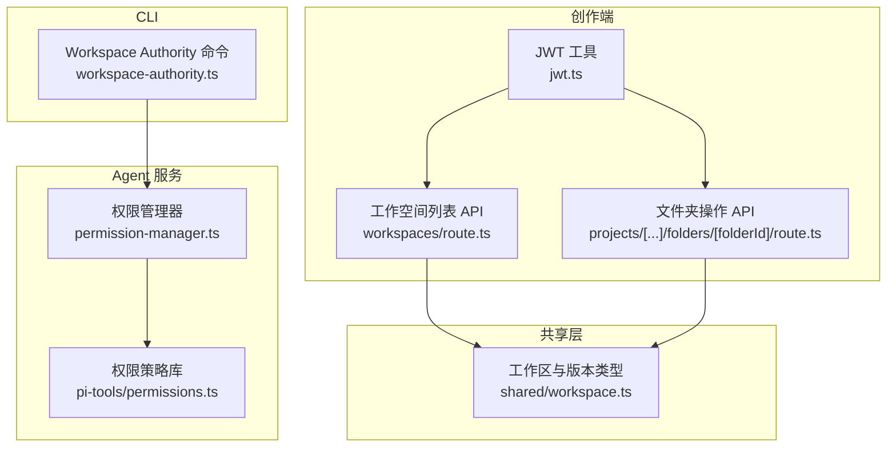
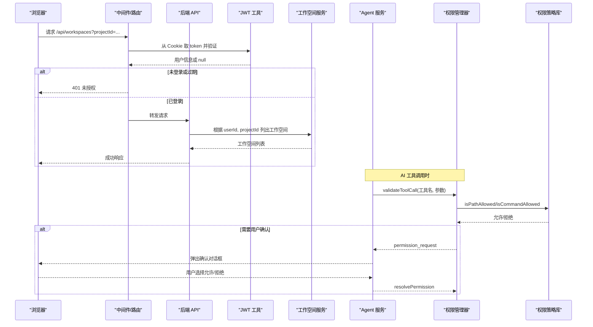
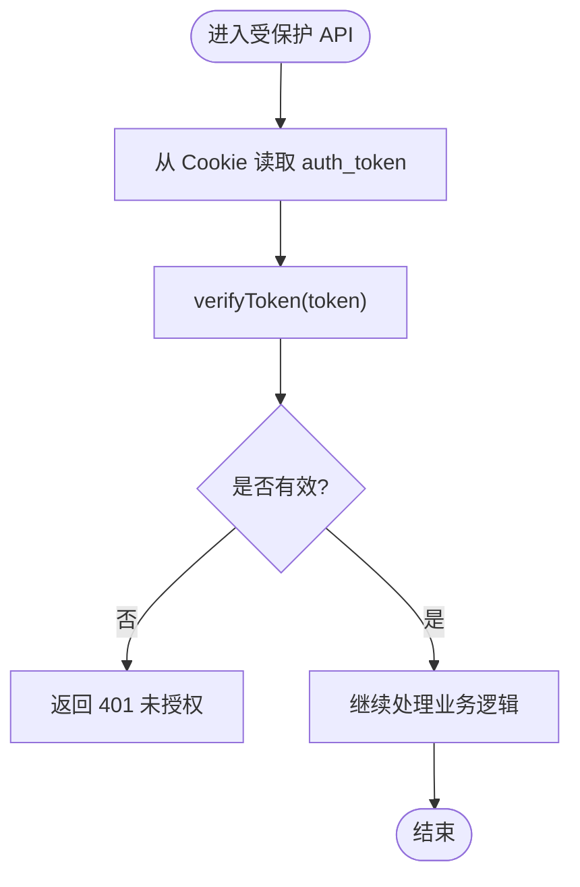
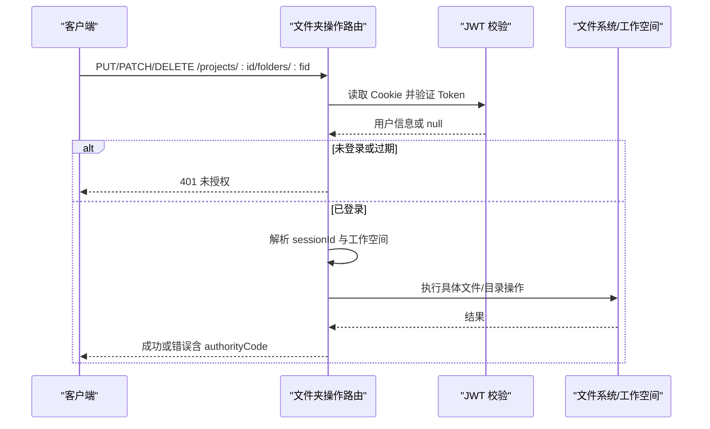
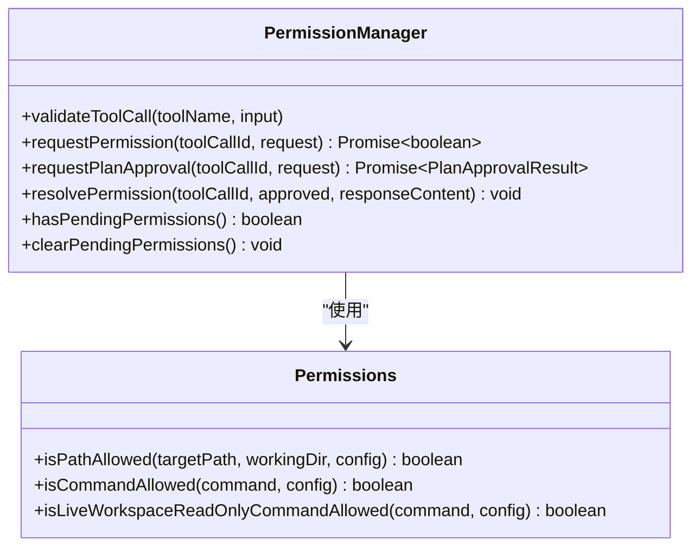
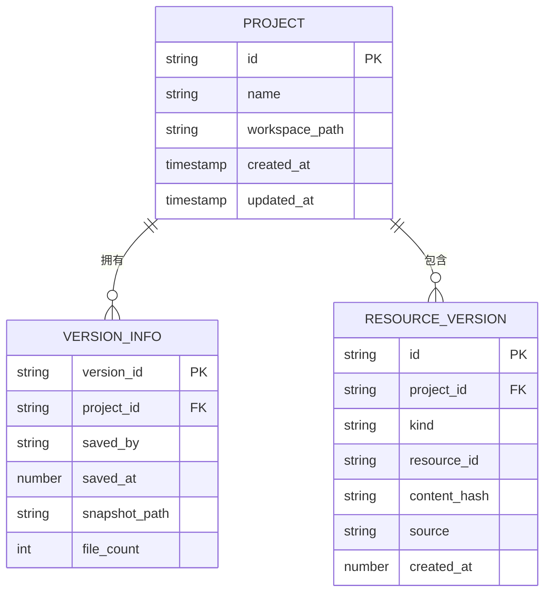
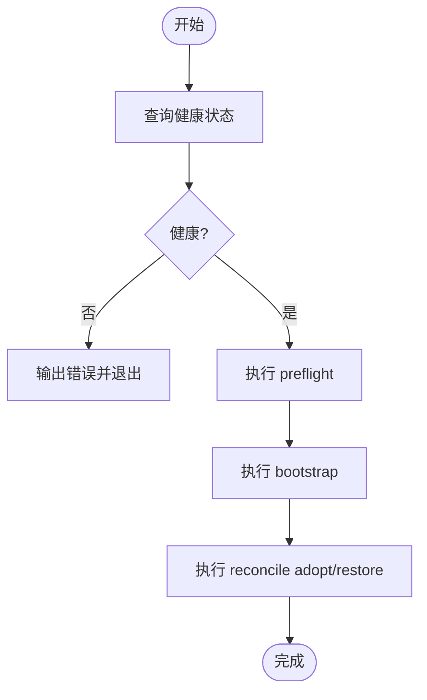
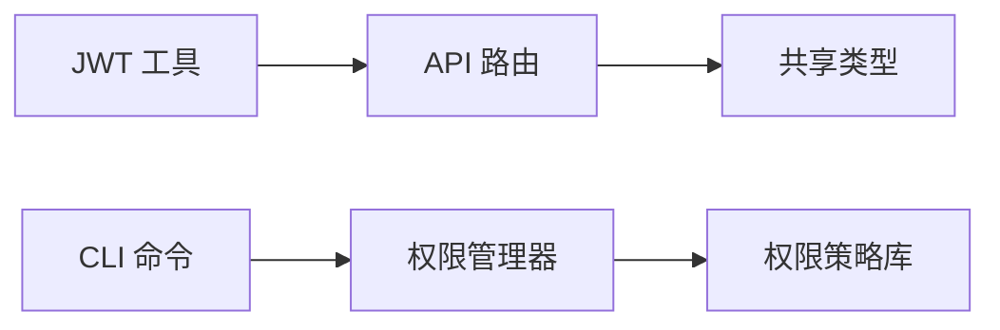

# 权限控制系统

<cite>
**本文引用的文件**   
- [permission-manager.ts](file://packages/agent-service/src/backends/managers/permission-manager.ts)
- [permissions.ts](file://packages/agent-service/src/backends/pi-tools/permissions.ts)
- [jwt.ts](file://packages/author-site/src/lib/auth/jwt.ts)
- [route.ts（工作空间列表）](file://packages/author-site/src/app/api/workspaces/route.ts)
- [route.ts（文件夹操作）](file://packages/author-site/src/app/api/projects/[projectId]/folders/[folderId]/route.ts)
- [workspace.ts（共享类型）](file://packages/shared/src/workspace.ts)
- [04_路由守卫与访问控制.md](file://docs/项目文档/创作端/01-用户鉴权/技术/04_路由守卫与访问控制.md)
- [03_AI行为约束机制.md](file://docs/项目文档/创作端/05-AI对话/技术/03_AI行为约束机制.md)
- [05_代理配置.md](file://docs/项目文档/创作端/03-项目管理/技术/05_代理配置.md)
- [workspace-authority.ts（CLI 命令）](file://OPS/CLI/src/commands/workspace-authority.ts)
</cite>

## 目录
1. [引言](#引言)
2. [项目结构](#项目结构)
3. [核心组件](#核心组件)
4. [架构总览](#架构总览)
5. [详细组件分析](#详细组件分析)
6. [依赖关系分析](#依赖关系分析)
7. [性能与安全考量](#性能与安全考量)
8. [故障排查指南](#故障排查指南)
9. [结论](#结论)
10. [附录：API 规范与最佳实践](#附录api-规范与最佳实践)

## 引言
本技术文档围绕权限控制系统展开，覆盖多用户角色定义、基于 JWT 的认证与会话管理、工作区级别的访问控制与资源隔离、权限继承与覆盖规则、动态权限更新机制，以及权限 API 接口规范与安全最佳实践。文档同时结合代码级实现与流程说明，帮助读者快速理解并正确扩展系统能力。

## 项目结构
权限相关能力横跨多个包与模块：
- 创作端（author-site）：负责用户登录态、JWT Cookie 管理、受保护 API 路由校验、工作空间列表获取等。
- Agent 服务（agent-service）：提供 AI 工具调用时的路径与命令白/黑名单校验、知识库写保护、删除页面与计划审批的用户确认流程。
- 共享类型（shared）：定义工作区、版本、资源指针等统一数据结构，为权限上下文提供基础模型。
- CLI（OPS/CLI）：提供 Workspace Authority 预检、引导、恢复等运维能力。
- 文档（docs）：沉淀了中间件、AI 行为约束、代理配置等权威说明。

图表来源
- [jwt.ts:1-70](file://packages/author-site/src/lib/auth/jwt.ts#L1-L70)
- [route.ts（工作空间列表）:51-94](file://packages/author-site/src/app/api/workspaces/route.ts#L51-L94)
- [route.ts（文件夹操作）:118-177](file://packages/author-site/src/app/api/projects/[projectId]/folders/[folderId]/route.ts#L118-L177)
- [permission-manager.ts:1-200](file://packages/agent-service/src/backends/managers/permission-manager.ts#L1-L200)
- [permissions.ts:1-131](file://packages/agent-service/src/backends/pi-tools/permissions.ts#L1-L131)
- [workspace.ts（共享类型）:1-526](file://packages/shared/src/workspace.ts#L1-L526)
- [workspace-authority.ts（CLI 命令）:178-498](file://OPS/CLI/src/commands/workspace-authority.ts#L178-L498)

章节来源
- [04_路由守卫与访问控制.md:69-475](file://docs/项目文档/创作端/01-用户鉴权/技术/04_路由守卫与访问控制.md#L69-L475)
- [03_AI行为约束机制.md:109-900](file://docs/项目文档/创作端/05-AI对话/技术/03_AI行为约束机制.md#L109-L900)
- [05_代理配置.md:91-125](file://docs/项目文档/创作端/03-项目管理/技术/05_代理配置.md#L91-L125)

## 核心组件
- 认证与会话
  - JWT 创建、验证、Cookie 设置与清除，支持生产环境 secure 标志与环境变量开关。
  - 中间件与 API 路由通过 Cookie 提取 Token 并校验，未登录或过期返回 401。
- 工作区访问控制
  - 工作空间列表 API 在读取前校验登录态与项目 ID。
  - 文件夹操作 API 在解析会话与工作空间后，再执行后续逻辑。
- AI 工具权限
  - 路径白/黑名单与命令白/黑名单校验，阻止越界访问与危险命令。
  - 知识库目录写保护，禁止 AI 修改 knowledge 下文件。
  - 高影响操作（如删除页面、执行计划）触发 permission_request，等待用户确认。
- 工作区版本与资源
  - 共享类型定义了工作区、版本、资源指针、提交审计等，为权限上下文提供数据基础。
- CLI 运维
  - 提供 Workspace Authority 健康检查、预检、引导、reconcile adopt/restore 等能力。

章节来源
- [jwt.ts:1-70](file://packages/author-site/src/lib/auth/jwt.ts#L1-L70)
- [route.ts（工作空间列表）:51-94](file://packages/author-site/src/app/api/workspaces/route.ts#L51-L94)
- [route.ts（文件夹操作）:118-177](file://packages/author-site/src/app/api/projects/[projectId]/folders/[folderId]/route.ts#L118-L177)
- [permission-manager.ts:1-200](file://packages/agent-service/src/backends/managers/permission-manager.ts#L1-L200)
- [permissions.ts:1-131](file://packages/agent-service/src/backends/pi-tools/permissions.ts#L1-L131)
- [workspace.ts（共享类型）:1-526](file://packages/shared/src/workspace.ts#L1-L526)
- [workspace-authority.ts（CLI 命令）:178-498](file://OPS/CLI/src/commands/workspace-authority.ts#L178-L498)

## 架构总览
整体权限体系由“认证层 + 访问控制层 + 工具权限层 + 工作区一致性层”组成：
- 认证层：基于 JWT 的无状态认证，Cookie 承载 token，服务端中间件与 API 路由进行校验。
- 访问控制层：按路由与资源维度进行鉴权，例如仅允许已登录用户访问工作空间列表。
- 工具权限层：对 AI 工具调用进行细粒度限制，包括路径、命令、知识库写保护与用户确认。
- 工作区一致性层：通过 Authority 机制确保 live workspace 写入一致性与可审计性。

图表来源
- [jwt.ts:1-70](file://packages/author-site/src/lib/auth/jwt.ts#L1-L70)
- [route.ts（工作空间列表）:51-94](file://packages/author-site/src/app/api/workspaces/route.ts#L51-L94)
- [permission-manager.ts:1-200](file://packages/agent-service/src/backends/managers/permission-manager.ts#L1-L200)
- [permissions.ts:1-131](file://packages/agent-service/src/backends/pi-tools/permissions.ts#L1-L131)

## 详细组件分析

### 组件一：JWT 认证与会话管理
- 功能要点
  - 使用 HS256 签名，有效期 7 天。
  - 生产环境默认启用 secure Cookie，可通过环境变量关闭。
  - 提供 createToken、verifyToken、setAuthCookie、getAuthCookie、clearAuthCookie 等能力。
- 安全要点
  - httpOnly 防止前端脚本读取。
  - sameSite=lax 降低 CSRF 风险。
  - 登出仅清除本地 Cookie，无法在服务端强制失效。

图表来源
- [jwt.ts:1-70](file://packages/author-site/src/lib/auth/jwt.ts#L1-L70)
- [route.ts（工作空间列表）:51-94](file://packages/author-site/src/app/api/workspaces/route.ts#L51-L94)

章节来源
- [jwt.ts:1-70](file://packages/author-site/src/lib/auth/jwt.ts#L1-L70)
- [04_路由守卫与访问控制.md:69-475](file://docs/项目文档/创作端/01-用户鉴权/技术/04_路由守卫与访问控制.md#L69-L475)

### 组件二：工作区访问控制（API 路由）
- 工作空间列表
  - 校验登录态与项目 ID，返回当前用户可见的工作空间集合。
- 文件夹操作
  - 校验登录态与 Token，解析 sessionId 与工作空间，再进行后续操作；错误映射包含 authorityCode 以便上层展示。

图表来源
- [route.ts（文件夹操作）:118-177](file://packages/author-site/src/app/api/projects/[projectId]/folders/[folderId]/route.ts#L118-L177)

章节来源
- [route.ts（工作空间列表）:51-94](file://packages/author-site/src/app/api/workspaces/route.ts#L51-L94)
- [route.ts（文件夹操作）:118-177](file://packages/author-site/src/app/api/projects/[projectId]/folders/[folderId]/route.ts#L118-L177)

### 组件三：AI 工具权限与用户确认
- 路径与命令白/黑名单
  - 路径必须落在 workingDir 内，且命中 allowedPaths 且不命中 deniedPatterns。
  - 命令需命中 allowedCommands，且不在 deniedCommands 中；npm/npx 与 node -e/--eval 被明确拒绝。
- 知识库写保护
  - 禁止对 knowledge 目录进行写操作。
- 用户确认流程
  - 删除页面与计划审批会触发 permission_request，等待用户允许或拒绝，超时自动拒绝。

图表来源
- [permission-manager.ts:1-200](file://packages/agent-service/src/backends/managers/permission-manager.ts#L1-L200)
- [permissions.ts:1-131](file://packages/agent-service/src/backends/pi-tools/permissions.ts#L1-L131)

章节来源
- [permission-manager.ts:1-200](file://packages/agent-service/src/backends/managers/permission-manager.ts#L1-L200)
- [permissions.ts:1-131](file://packages/agent-service/src/backends/pi-tools/permissions.ts#L1-L131)
- [03_AI行为约束机制.md:109-900](file://docs/项目文档/创作端/05-AI对话/技术/03_AI行为约束机制.md#L109-L900)

### 组件四：工作区版本与资源模型
- 关键概念
  - 工作区类型（user/temp）、快照模式（git-repo/snapshot）。
  - 版本历史（VersionInfo/PageVersionInfo），记录保存者、时间戳、关联会话、快照路径等。
  - 资源指针（ResourcePointer）与资源版本（ResourceVersion），用于跨资源引用与内容哈希追踪。
  - 项目提交（ProjectCommit）与审计字段（audit），记录 actorType、sessionId、workspaceId、revision/rootHash 等。
- 与权限的关系
  - 权限上下文常携带 sessionId、workspaceId、workspaceRevision、workspaceRootHash，用于审计与一致性校验。

图表来源
- [workspace.ts（共享类型）:1-526](file://packages/shared/src/workspace.ts#L1-L526)

章节来源
- [workspace.ts（共享类型）:1-526](file://packages/shared/src/workspace.ts#L1-L526)

### 组件五：CLI 与 Workspace Authority
- 能力概览
  - 健康检查、预检、引导、reconcile adopt/restore 等。
  - 失败时输出结构化 JSON，便于自动化集成。
- 典型流程
  - 先查询健康状态，再执行 preflight/bootstrap/reconcile 等操作，最终输出 action、applied、state 等信息。

图表来源
- [workspace-authority.ts（CLI 命令）:178-498](file://OPS/CLI/src/commands/workspace-authority.ts#L178-L498)

章节来源
- [workspace-authority.ts（CLI 命令）:178-498](file://OPS/CLI/src/commands/workspace-authority.ts#L178-L498)

## 依赖关系分析
- 低耦合高内聚
  - JWT 工具独立于业务路由，便于复用与替换。
  - 权限策略库与权限管理器解耦，策略可配置化。
- 直接依赖
  - 路由依赖 JWT 工具进行身份校验。
  - 权限管理器依赖权限策略库进行路径与命令判定。
- 间接依赖
  - 共享类型贯穿前后端与服务端，保证数据契约一致。
  - CLI 依赖权限管理器提供的 Authority 能力进行运维操作。

图表来源
- [jwt.ts:1-70](file://packages/author-site/src/lib/auth/jwt.ts#L1-L70)
- [route.ts（工作空间列表）:51-94](file://packages/author-site/src/app/api/workspaces/route.ts#L51-L94)
- [permission-manager.ts:1-200](file://packages/agent-service/src/backends/managers/permission-manager.ts#L1-L200)
- [permissions.ts:1-131](file://packages/agent-service/src/backends/pi-tools/permissions.ts#L1-L131)
- [workspace-authority.ts（CLI 命令）:178-498](file://OPS/CLI/src/commands/workspace-authority.ts#L178-L498)

章节来源
- [05_代理配置.md:91-125](file://docs/项目文档/创作端/03-项目管理/技术/05_代理配置.md#L91-L125)

## 性能与安全考量
- 性能
  - JWT 验证为无状态计算，开销极低。
  - 权限策略匹配采用 glob 正则，建议合理设计白/黑名单以减少回溯。
  - 用户确认流程异步等待，注意超时与取消，避免阻塞主线程。
- 安全
  - 严格路径边界校验，禁止越界访问。
  - 命令白名单最小化，禁用高危命令与组合语法。
  - 知识库目录写保护，防止 AI 篡改知识资产。
  - Cookie 安全标志与 sameSite 策略，降低 CSRF 风险。
  - 错误信息不泄露敏感细节，统一错误码与消息。

[本节为通用指导，无需源码引用]

## 故障排查指南
- 常见错误码与定位
  - UNAUTHORIZED：未登录或 Token 过期，检查 Cookie 与中间件。
  - INVALID_REQUEST：缺少必要参数（如 projectId、sessionId），检查请求体与查询参数。
  - FILE_WRITE_ERROR/FILE_READ_ERROR：读写失败，检查文件系统权限与工作空间路径。
  - WORKSPACE_AUTHORITY_*：Authority 相关错误，检查健康状态、preflight 与 reconcile 结果。
- 排查步骤
  - 确认登录态：查看 Cookie 是否存在且未过期。
  - 核对权限策略：检查 allowedPaths/deniedPatterns/allowedCommands/deniedCommands。
  - 观察用户确认：确认 permission_request 是否超时或被拒绝。
  - 检查 Authority：运行 CLI 预检与健康检查，必要时执行 reconcile。

章节来源
- [route.ts（工作空间列表）:51-94](file://packages/author-site/src/app/api/workspaces/route.ts#L51-L94)
- [route.ts（文件夹操作）:118-177](file://packages/author-site/src/app/api/projects/[projectId]/folders/[folderId]/route.ts#L118-L177)
- [workspace-authority.ts（CLI 命令）:178-498](file://OPS/CLI/src/commands/workspace-authority.ts#L178-L498)

## 结论
本权限控制系统以 JWT 为基础认证，结合工作区级别的路径与命令白/黑名单、知识库写保护与用户确认机制，形成多层防护。通过共享类型与 Authority 机制，实现了可审计、可回滚、可一致性的工作区变更。建议在新增能力时遵循最小权限原则，保持策略可配置与可观测。

[本节为总结，无需源码引用]

## 附录：API 规范与最佳实践

### 接口规范（示例）
- 工作空间列表
  - 方法：GET
  - 路径：/api/workspaces
  - 查询参数：projectId（必填）
  - 鉴权：需要登录（Cookie 中的 auth_token）
  - 成功响应：包含工作空间列表
  - 失败响应：UNAUTHORIZED、INVALID_REQUEST、FILE_READ_ERROR
- 文件夹操作
  - 方法：PUT/PATCH/DELETE
  - 路径：/api/projects/:projectId/folders/:folderId
  - 鉴权：需要登录（Cookie 中的 auth_token）
  - 请求体：可能包含 sessionId（必填）
  - 成功响应：操作结果
  - 失败响应：UNAUTHORIZED、INVALID_REQUEST、FILE_WRITE_ERROR（含 authorityCode）

章节来源
- [route.ts（工作空间列表）:51-94](file://packages/author-site/src/app/api/workspaces/route.ts#L51-L94)
- [route.ts（文件夹操作）:118-177](file://packages/author-site/src/app/api/projects/[projectId]/folders/[folderId]/route.ts#L118-L177)

### 最佳实践
- 认证与会话
  - 使用 httpOnly、sameSite、secure（生产）标志。
  - 登出仅清 Cookie，如需服务端失效，引入令牌黑名单或短 TTL。
- 权限策略
  - 白名单优先，黑名单兜底；尽量缩小 allowedPaths 范围。
  - 命令白名单最小化，禁用 npm/npx 与 node -e/--eval。
- 用户确认
  - 对高影响操作（删除、批量修改）强制用户确认。
  - 设置合理超时，避免长时间阻塞。
- 审计与一致性
  - 记录 actorType、sessionId、workspaceId、revision/rootHash。
  - 通过 Authority 机制保障 live workspace 写入一致性与可回滚。

章节来源
- [04_路由守卫与访问控制.md:69-475](file://docs/项目文档/创作端/01-用户鉴权/技术/04_路由守卫与访问控制.md#L69-L475)
- [03_AI行为约束机制.md:109-900](file://docs/项目文档/创作端/05-AI对话/技术/03_AI行为约束机制.md#L109-L900)
- [05_代理配置.md:91-125](file://docs/项目文档/创作端/03-项目管理/技术/05_代理配置.md#L91-L125)