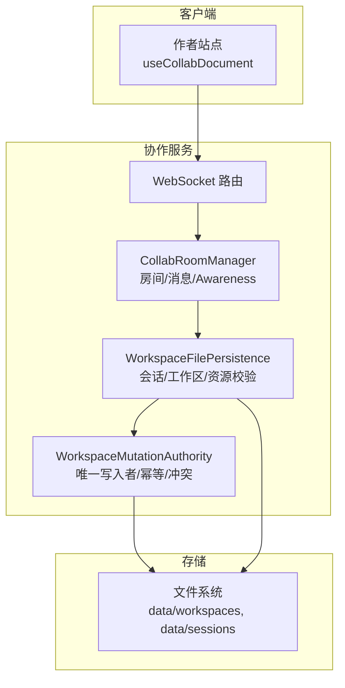
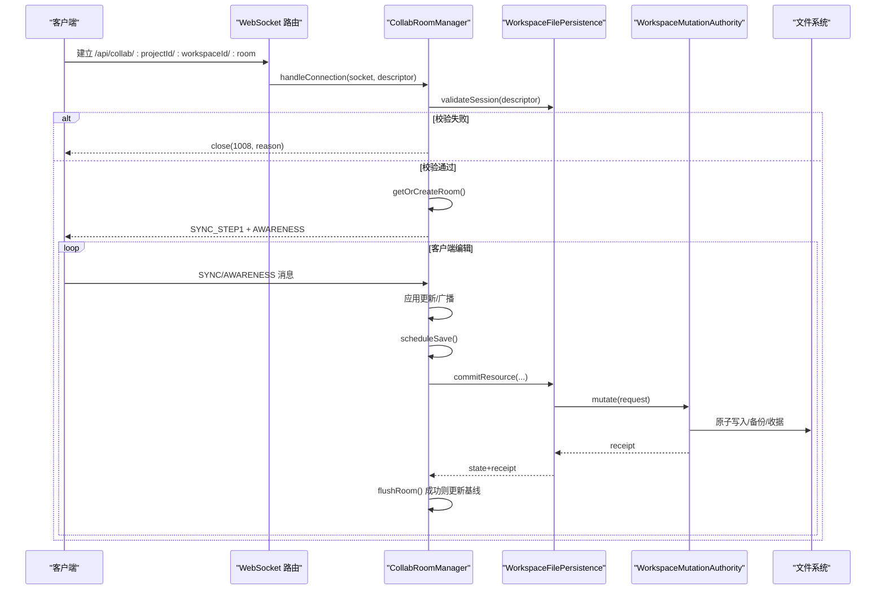
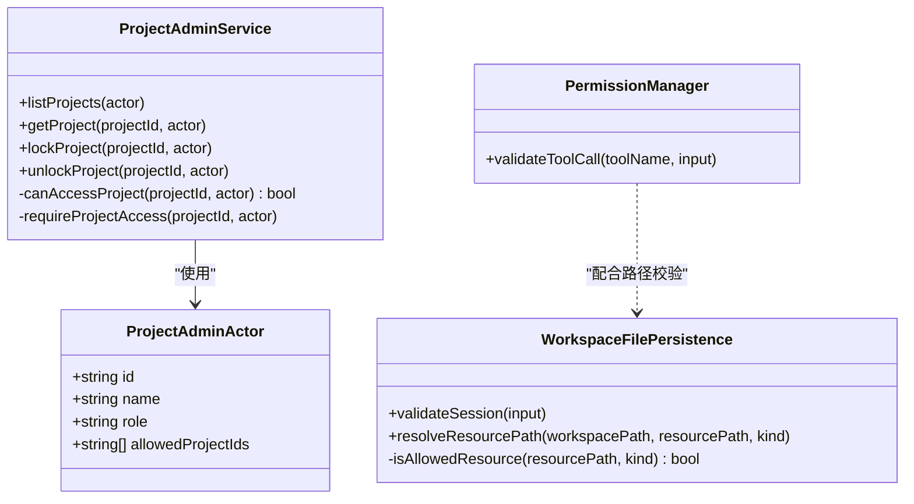
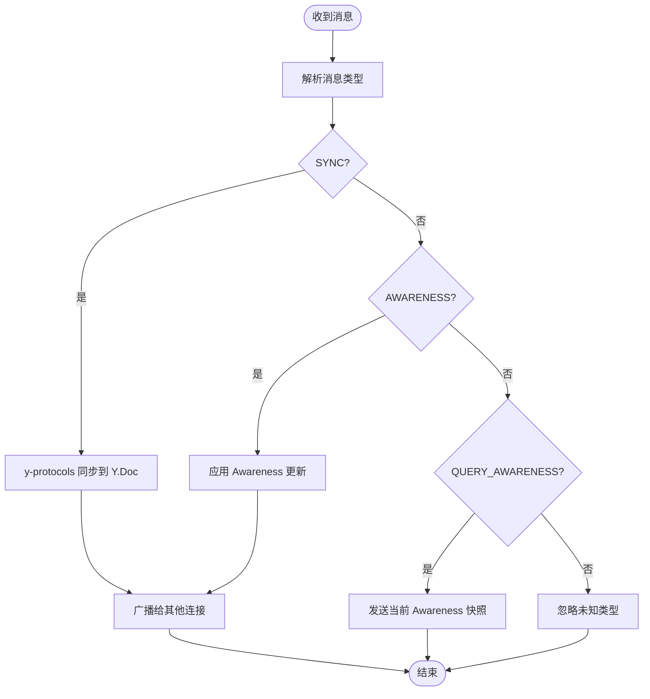
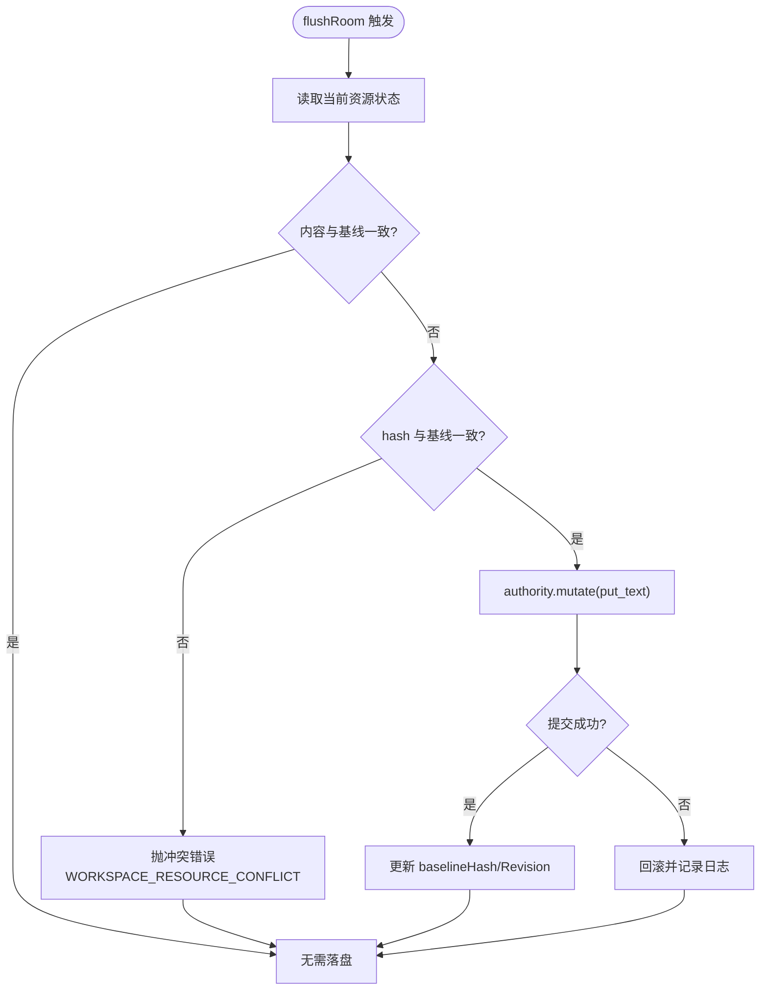
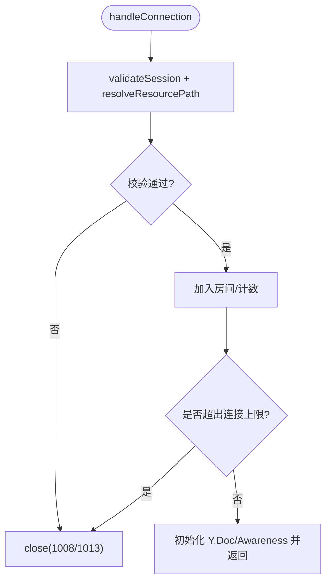
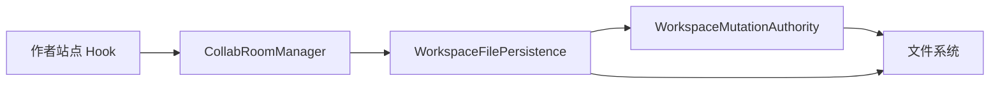

# 项目协作功能

<cite>
**本文引用的文件**
- [packages/agent-service/src/collab/collab-room-manager.ts](file://packages/agent-service/src/collab/collab-room-manager.ts)
- [packages/agent-service/src/collab/workspace-file-persistence.ts](file://packages/agent-service/src/collab/workspace-file-persistence.ts)
- [packages/agent-service/src/workspace/workspace-mutation-authority.ts](file://packages/agent-service/src/workspace/workspace-mutation-authority.ts)
- [packages/project-core/src/service.ts](file://packages/project-core/src/service.ts)
- [packages/project-core/src/types.ts](file://packages/project-core/src/types.ts)
- [packages/author-site/src/hooks/useCollabDocument.ts](file://packages/author-site/src/hooks/useCollabDocument.ts)
- [docs/项目文档/创作端/03-项目管理/技术/11_实时保存与协同编辑.md](file://docs/项目文档/创作端/03-项目管理/技术/11_实时保存与协同编辑.md)
- [docs/项目文档/创作端/05-AI对话/技术/07_运行进度与事件日志.md](file://docs/项目文档/创作端/05-AI对话/技术/07_运行进度与事件日志.md)
- [packages/agent-service/src/session/run-log-store.ts](file://packages/agent-service/src/session/run-log-store.ts)
- [packages/agent-service/src/backends/managers/permission-manager.ts](file://packages/agent-service/src/backends/managers/permission-manager.ts)
- [docs/项目文档/创作端/05-AI对话/技术/03_AI行为约束机制.md](file://docs/项目文档/创作端/05-AI对话/技术/03_AI行为约束机制.md)
- [packages/agent-service/tests/unit/collab-room-manager.test.ts](file://packages/agent-service/tests/unit/collab-room-manager.test.ts)
- [packages/agent-service/tests/unit/collab-persistence.test.ts](file://packages/agent-service/tests/unit/collab-persistence.test.ts)
</cite>

## 目录
1. [引言](#引言)
2. [项目结构](#项目结构)
3. [核心组件](#核心组件)
4. [架构总览](#架构总览)
5. [详细组件分析](#详细组件分析)
6. [依赖关系分析](#依赖关系分析)
7. [性能考量](#性能考量)
8. [故障排查指南](#故障排查指南)
9. [结论](#结论)
10. [附录](#附录)

## 引言
本文件面向“项目协作”能力，系统性阐述多用户权限控制、实时协作（WebSocket + Yjs）、工作区隔离、冲突解决、审计日志以及 API 规范与安全要点。内容基于仓库中实际实现进行提炼，并辅以图示帮助理解。

## 项目结构
协作相关代码主要分布在以下模块：
- 实时协作服务：房间管理、Yjs 同步、连接生命周期、空闲清理
- 工作区持久化与校验：会话与工作区定位、资源路径白名单、Authority 集成
- 工作区变更权威写入：幂等提交、哈希一致性、冲突检测、恢复与对账
- 前端协作 Hook：在线状态广播、断连抖动抑制策略
- 权限与工具调用限制：路径/命令白黑名单、知识文件写保护
- 审计与运行日志：操作审计、AI 运行日志、诊断事件流

图表来源
- [packages/agent-service/src/collab/collab-room-manager.ts:115-157](file://packages/agent-service/src/collab/collab-room-manager.ts#L115-L157)
- [packages/agent-service/src/collab/workspace-file-persistence.ts:82-136](file://packages/agent-service/src/collab/workspace-file-persistence.ts#L82-L136)
- [packages/agent-service/src/workspace/workspace-mutation-authority.ts:468-598](file://packages/agent-service/src/workspace/workspace-mutation-authority.ts#L468-L598)

章节来源
- [packages/agent-service/src/collab/collab-room-manager.ts:1-518](file://packages/agent-service/src/collab/collab-room-manager.ts#L1-L518)
- [packages/agent-service/src/collab/workspace-file-persistence.ts:1-416](file://packages/agent-service/src/collab/workspace-file-persistence.ts#L1-L416)
- [packages/agent-service/src/workspace/workspace-mutation-authority.ts:1-800](file://packages/agent-service/src/workspace/workspace-mutation-authority.ts#L1-L800)

## 核心组件
- CollabRoomManager：维护每个资源的 Yjs Doc 与 Awareness，处理连接、消息分发、增量同步、自动落盘与空闲回收。
- WorkspaceFilePersistence：负责会话与工作区元数据校验、资源路径白名单过滤、读取/提交资源，并桥接 Authority。
- WorkspaceMutationAuthority：单一权威写入器，保证幂等、原子性、根哈希一致性与外部漂移检测；提供恢复和对账能力。
- ProjectAdminService：项目级权限与锁定、审计入口、发布与导出等。
- 前端 useCollabDocument：封装 y-websocket 使用，广播在线状态，抑制短暂断连导致的 UI 抖动。

章节来源
- [packages/agent-service/src/collab/collab-room-manager.ts:55-118](file://packages/agent-service/src/collab/collab-room-manager.ts#L55-L118)
- [packages/agent-service/src/collab/workspace-file-persistence.ts:70-136](file://packages/agent-service/src/collab/workspace-file-persistence.ts#L70-L136)
- [packages/agent-service/src/workspace/workspace-mutation-authority.ts:112-180](file://packages/agent-service/src/workspace/workspace-mutation-authority.ts#L112-L180)
- [packages/project-core/src/service.ts:477-506](file://packages/project-core/src/service.ts#L477-L506)
- [packages/author-site/src/hooks/useCollabDocument.ts:54-91](file://packages/author-site/src/hooks/useCollabDocument.ts#L54-L91)

## 架构总览
协作流程从 WebSocket 接入开始，经房间管理器与持久化层，最终由 Authority 完成幂等提交与一致性校验。

图表来源
- [packages/agent-service/src/routes/collab.ts:69-94](file://packages/agent-service/src/routes/collab.ts#L69-L94)
- [packages/agent-service/src/collab/collab-room-manager.ts:115-157](file://packages/agent-service/src/collab/collab-room-manager.ts#L115-L157)
- [packages/agent-service/src/collab/workspace-file-persistence.ts:164-194](file://packages/agent-service/src/collab/workspace-file-persistence.ts#L164-L194)
- [packages/agent-service/src/workspace/workspace-mutation-authority.ts:468-598](file://packages/agent-service/src/workspace/workspace-mutation-authority.ts#L468-L598)

## 详细组件分析

### 多用户权限控制系统
- 角色与访问控制
  - ProjectAdminActor 定义角色与可访问项目集合；ProjectAdminService 在列举/获取项目时按 allowedProjectIds 过滤，并在锁定/解锁等操作中强制 admin 角色。
  - 项目锁定：仅管理员可锁定/解锁，防止并发误改。
- 工具调用与路径权限
  - PermissionManager 在工具层拦截路径/命令访问，支持白名单/黑名单与 workingDir 边界检查；知识库文件写保护与委派任务限制。
- 工作区资源路径白名单
  - WorkspaceFilePersistence 根据 CollabResourceKind 严格限定可编辑资源路径模式，拒绝越界与穿越路径。

图表来源
- [packages/project-core/src/types.ts:28-36](file://packages/project-core/src/types.ts#L28-L36)
- [packages/project-core/src/service.ts:4714-4742](file://packages/project-core/src/service.ts#L4714-L4742)
- [packages/project-core/src/service.ts:6392-6420](file://packages/project-core/src/service.ts#L6392-L6420)
- [packages/agent-service/src/backends/managers/permission-manager.ts:24-64](file://packages/agent-service/src/backends/managers/permission-manager.ts#L24-L64)
- [packages/agent-service/src/collab/workspace-file-persistence.ts:281-313](file://packages/agent-service/src/collab/workspace-file-persistence.ts#L281-L313)

章节来源
- [packages/project-core/src/types.ts:28-36](file://packages/project-core/src/types.ts#L28-L36)
- [packages/project-core/src/service.ts:4714-4742](file://packages/project-core/src/service.ts#L4714-L4742)
- [packages/project-core/src/service.ts:6392-6420](file://packages/project-core/src/service.ts#L6392-L6420)
- [packages/agent-service/src/backends/managers/permission-manager.ts:24-64](file://packages/agent-service/src/backends/managers/permission-manager.ts#L24-L64)
- [docs/项目文档/创作端/05-AI对话/技术/03_AI行为约束机制.md:109-223](file://docs/项目文档/创作端/05-AI对话/技术/03_AI行为约束机制.md#L109-L223)
- [packages/agent-service/src/collab/workspace-file-persistence.ts:281-313](file://packages/agent-service/src/collab/workspace-file-persistence.ts#L281-L313)

### 实时协作机制（WebSocket + Yjs）
- 连接与会话校验
  - 路由接收参数后构造 RoomDescriptor，调用 Persistence.validateSession 校验 sessionId、workspaceId、projectId 与资源路径合法性。
- 房间与文档
  - 每个资源对应一个 Y.Doc/Y.Text，Awareness 用于共享光标/选区等存在信息。
- 消息协议
  - 自定义消息类型：SYNC、AWARENESS、QUERY_AWARENESS；采用 lib0 编码/解码与 y-protocols 协议。
- 自动落盘与去抖
  - 每次 update 标记 dirty 并调度 save；saveDebounceMs 控制合并落盘频率。
- 空闲回收
  - 无连接且超过 TTL 的房间被 flush 并销毁。

图表来源
- [packages/agent-service/src/collab/collab-room-manager.ts:320-346](file://packages/agent-service/src/collab/collab-room-manager.ts#L320-L346)
- [packages/agent-service/src/collab/collab-room-manager.ts:285-318](file://packages/agent-service/src/collab/collab-room-manager.ts#L285-L318)
- [packages/agent-service/src/collab/collab-room-manager.ts:452-461](file://packages/agent-service/src/collab/collab-room-manager.ts#L452-L461)

章节来源
- [packages/agent-service/src/collab/collab-room-manager.ts:115-157](file://packages/agent-service/src/collab/collab-room-manager.ts#L115-L157)
- [packages/agent-service/src/collab/collab-room-manager.ts:285-318](file://packages/agent-service/src/collab/collab-room-manager.ts#L285-L318)
- [packages/agent-service/src/collab/collab-room-manager.ts:320-346](file://packages/agent-service/src/collab/collab-room-manager.ts#L320-L346)
- [packages/agent-service/src/collab/collab-room-manager.ts:452-461](file://packages/agent-service/src/collab/collab-room-manager.ts#L452-L461)
- [docs/项目文档/创作端/03-项目管理/技术/11_实时保存与协同编辑.md:252-255](file://docs/项目文档/创作端/03-项目管理/技术/11_实时保存与协同编辑.md#L252-L255)

### 操作同步与冲突解决算法
- 基线与哈希
  - 房间维护 baselineHash/baselineRevision；落盘前比对磁盘 hash，若不一致视为外部变更。
- 冲突判定与回滚
  - 当外部变更导致 hash 不一致，flush 抛出 WORKSPACE_RESOURCE_CONFLICT；Authority 的 mutate 也会检测 rootHash 与 baseRevision 一致性。
- 幂等与恢复
  - mutationId 幂等；prepared/reconcile 状态持久化，进程重启后可恢复或回滚；支持 reconcileAdopt/reconcileRestore。

图表来源
- [packages/agent-service/src/collab/collab-room-manager.ts:369-422](file://packages/agent-service/src/collab/collab-room-manager.ts#L369-L422)
- [packages/agent-service/src/workspace/workspace-mutation-authority.ts:468-598](file://packages/agent-service/src/workspace/workspace-mutation-authority.ts#L468-L598)
- [packages/agent-service/src/workspace/workspace-mutation-authority.ts:286-378](file://packages/agent-service/src/workspace/workspace-mutation-authority.ts#L286-L378)

章节来源
- [packages/agent-service/src/collab/collab-room-manager.ts:369-422](file://packages/agent-service/src/collab/collab-room-manager.ts#L369-L422)
- [packages/agent-service/src/workspace/workspace-mutation-authority.ts:468-598](file://packages/agent-service/src/workspace/workspace-mutation-authority.ts#L468-L598)
- [packages/agent-service/src/workspace/workspace-mutation-authority.ts:286-378](file://packages/agent-service/src/workspace/workspace-mutation-authority.ts#L286-L378)

### 工作区隔离机制
- 会话与工作区定位
  - 通过 sessions/.session.json 与 workspaces/.workspace.json 双重校验，确保 projectId/workspaceId 匹配。
- 资源路径白名单
  - 按 CollabResourceKind 严格匹配允许的路径模式，拒绝跨目录穿越与非法资源。
- 连接上限
  - 单工作区最大连接数限制，超限以 1013 关闭。

图表来源
- [packages/agent-service/src/collab/workspace-file-persistence.ts:82-136](file://packages/agent-service/src/collab/workspace-file-persistence.ts#L82-L136)
- [packages/agent-service/src/collab/workspace-file-persistence.ts:281-313](file://packages/agent-service/src/collab/workspace-file-persistence.ts#L281-L313)
- [packages/agent-service/src/collab/collab-room-manager.ts:115-157](file://packages/agent-service/src/collab/collab-room-manager.ts#L115-L157)

章节来源
- [packages/agent-service/src/collab/workspace-file-persistence.ts:82-136](file://packages/agent-service/src/collab/workspace-file-persistence.ts#L82-L136)
- [packages/agent-service/src/collab/workspace-file-persistence.ts:281-313](file://packages/agent-service/src/collab/workspace-file-persistence.ts#L281-L313)
- [packages/agent-service/src/collab/collab-room-manager.ts:115-157](file://packages/agent-service/src/collab/collab-room-manager.ts#L115-L157)
- [packages/agent-service/tests/unit/collab-persistence.test.ts:188-231](file://packages/agent-service/tests/unit/collab-persistence.test.ts#L188-L231)

### 审计日志系统
- 操作审计
  - ProjectAdminService 暴露 auditList/auditGet 等接口，审计事件按日期分目录存放 JSON 文件。
- AI 运行日志
  - AgentRunLog 将每轮关键事件追加至 JSONL，并对敏感字段脱敏；同时向结构化诊断事件流同步摘要。
- 诊断与日志采集
  - CLI 支持收集 agent-service 日志与远程会话诊断，便于问题定位。

章节来源
- [packages/project-core/src/service.ts:477-506](file://packages/project-core/src/service.ts#L477-L506)
- [packages/agent-service/src/session/run-log-store.ts:355-384](file://packages/agent-service/src/session/run-log-store.ts#L355-L384)
- [docs/项目文档/创作端/05-AI对话/技术/07_运行进度与事件日志.md:61-81](file://docs/项目文档/创作端/05-AI对话/技术/07_运行进度与事件日志.md#L61-L81)

### API 接口规范与安全考虑
- WebSocket 协作接口
  - GET /api/collab/projects/:projectId/workspaces/:workspaceId/:room
  - 查询参数包含 sessionId、resourcePath、kind 等；鉴权与路径白名单在服务器侧执行。
- 安全要点
  - 会话与工作区强绑定校验；资源路径白名单与目录穿越防护；单工作区连接上限；冲突时返回 409。
- 集成示例
  - 前端使用 y-websocket 连接到上述路径，携带 sessionId 与资源描述；服务端返回 SYNC_STEP1 与 Awareness 初始状态。

章节来源
- [packages/agent-service/src/routes/collab.ts:69-94](file://packages/agent-service/src/routes/collab.ts#L69-L94)
- [packages/agent-service/src/collab/workspace-file-persistence.ts:82-136](file://packages/agent-service/src/collab/workspace-file-persistence.ts#L82-L136)
- [packages/agent-service/src/collab/workspace-file-persistence.ts:281-313](file://packages/agent-service/src/collab/workspace-file-persistence.ts#L281-L313)
- [packages/agent-service/tests/unit/collab-room-manager.test.ts:292-327](file://packages/agent-service/tests/unit/collab-room-manager.test.ts#L292-L327)

## 依赖关系分析
- 组件耦合
  - CollabRoomManager 依赖 WorkspaceFilePersistence 做鉴权与落盘；后者依赖 WorkspaceMutationAuthority 作为唯一写入者。
  - ProjectAdminService 独立于协作链路，但提供项目级权限与审计能力。
- 外部依赖
  - Yjs/y-protocols/lib0 用于 CRDT 与二进制编解码；ws 用于 WebSocket。
- 潜在循环
  - 协作链单向依赖，未见循环引用。

图表来源
- [packages/agent-service/src/collab/collab-room-manager.ts:1-518](file://packages/agent-service/src/collab/collab-room-manager.ts#L1-L518)
- [packages/agent-service/src/collab/workspace-file-persistence.ts:1-416](file://packages/agent-service/src/collab/workspace-file-persistence.ts#L1-L416)
- [packages/agent-service/src/workspace/workspace-mutation-authority.ts:1-800](file://packages/agent-service/src/workspace/workspace-mutation-authority.ts#L1-L800)

章节来源
- [packages/agent-service/src/collab/collab-room-manager.ts:1-518](file://packages/agent-service/src/collab/collab-room-manager.ts#L1-L518)
- [packages/agent-service/src/collab/workspace-file-persistence.ts:1-416](file://packages/agent-service/src/collab/workspace-file-persistence.ts#L1-L416)
- [packages/agent-service/src/workspace/workspace-mutation-authority.ts:1-800](file://packages/agent-service/src/workspace/workspace-mutation-authority.ts#L1-L800)

## 性能考量
- 落盘去抖：COLLAB_SAVE_DEBOUNCE_MS 控制批量落盘频率，降低频繁 IO。
- 空闲回收：COLLAB_ROOM_IDLE_TTL_MS 定期清理闲置房间，释放内存与句柄。
- 连接限流：COLLAB_MAX_CONNECTIONS_PER_WORKSPACE 限制单工作区并发连接，避免热点资源过载。
- 前端抖动抑制：短暂断连不立即降级为离线，减少 UI 闪烁。

章节来源
- [packages/agent-service/src/collab/collab-room-manager.ts:64-73](file://packages/agent-service/src/collab/collab-room-manager.ts#L64-L73)
- [packages/agent-service/src/collab/collab-room-manager.ts:452-461](file://packages/agent-service/src/collab/collab-room-manager.ts#L452-L461)
- [docs/项目文档/创作端/03-项目管理/技术/11_实时保存与协同编辑.md:252-255](file://docs/项目文档/创作端/03-项目管理/技术/11_实时保存与协同编辑.md#L252-L255)

## 故障排查指南
- 常见错误码
  - COLLAB_FORBIDDEN：会话/工作区/资源路径校验失败
  - COLLAB_WORKSPACE_CONNECTION_LIMIT：连接数超限
  - WORKSPACE_RESOURCE_CONFLICT：外部变更导致冲突
  - WORKSPACE_EXTERNAL_DRIFT：工作区根哈希不一致
- 定位步骤
  - 检查会话与工作区元数据是否存在且匹配
  - 确认资源路径是否在白名单内
  - 查看 Authority 健康信息与回执数量
  - 审查 AI 运行日志与诊断事件流

章节来源
- [packages/agent-service/src/collab/collab-room-manager.ts:115-157](file://packages/agent-service/src/collab/collab-room-manager.ts#L115-L157)
- [packages/agent-service/src/workspace/workspace-mutation-authority.ts:240-284](file://packages/agent-service/src/workspace/workspace-mutation-authority.ts#L240-L284)
- [packages/agent-service/src/session/run-log-store.ts:355-384](file://packages/agent-service/src/session/run-log-store.ts#L355-L384)

## 结论
本项目协作方案以 Authority 为核心保障数据一致性与幂等，结合 Yjs 实现高效实时协作；通过严格的会话/工作区/资源路径校验与连接限流提升安全性与稳定性；完善的审计与运行日志体系支撑可观测与排障。建议在生产环境合理配置去抖与回收阈值，并结合前端抖动抑制策略优化用户体验。

## 附录
- 术语
  - 工作区：项目的可编辑副本，含页面代码、原型、配置等资源
  - 房间：针对单个资源的 Yjs 协作单元
  - 基线：落盘前的资源内容与版本标识
- 参考实现路径
  - 协作路由与房间管理：[packages/agent-service/src/collab/collab-room-manager.ts](file://packages/agent-service/src/collab/collab-room-manager.ts)
  - 持久化与鉴权：[packages/agent-service/src/collab/workspace-file-persistence.ts](file://packages/agent-service/src/collab/workspace-file-persistence.ts)
  - 权威写入与恢复：[packages/agent-service/src/workspace/workspace-mutation-authority.ts](file://packages/agent-service/src/workspace/workspace-mutation-authority.ts)
  - 项目权限与审计：[packages/project-core/src/service.ts](file://packages/project-core/src/service.ts), [packages/project-core/src/types.ts](file://packages/project-core/src/types.ts)
  - 前端协作 Hook：[packages/author-site/src/hooks/useCollabDocument.ts](file://packages/author-site/src/hooks/useCollabDocument.ts)