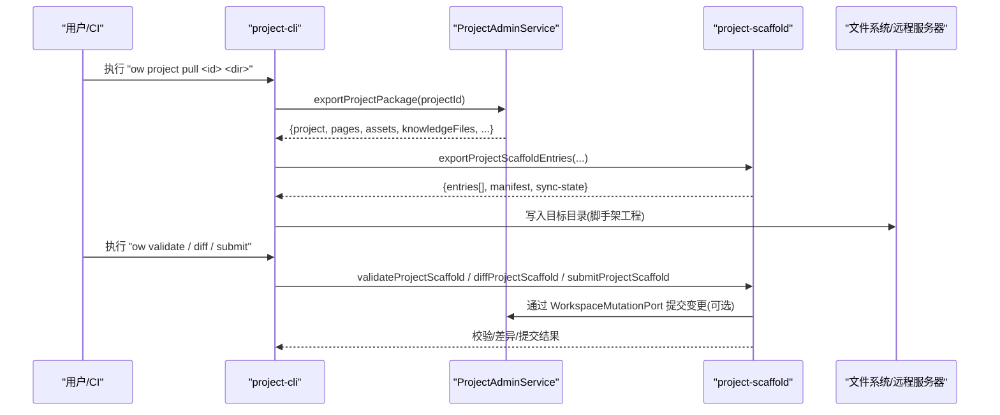
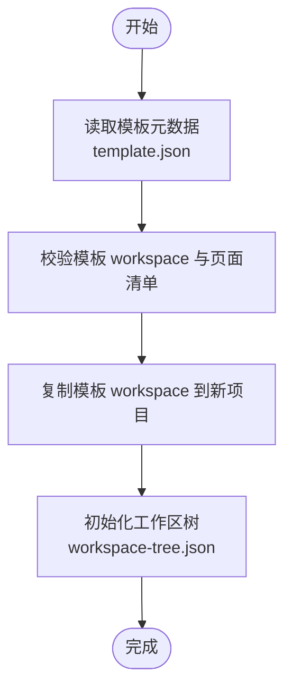
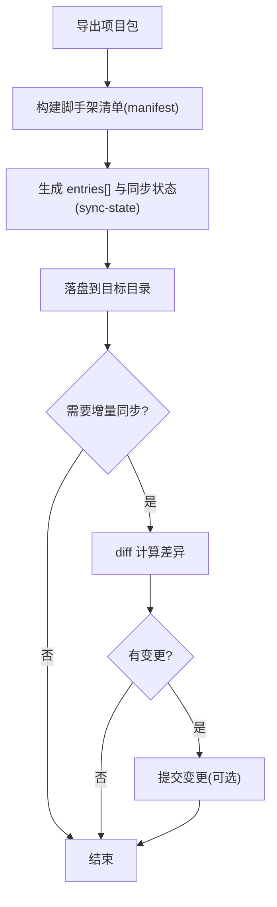
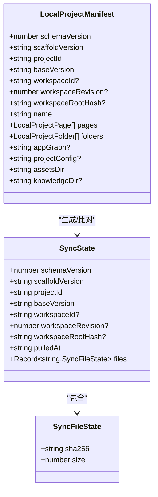
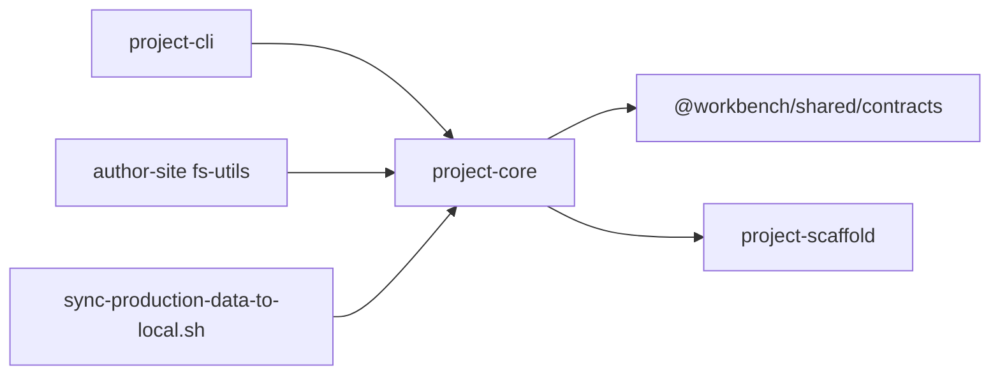

# 项目导入导出

<cite>
**本文引用的文件**   
- [packages/project-cli/src/index.ts](file://packages/project-cli/src/index.ts)
- [packages/project-scaffold/src/index.ts](file://packages/project-scaffold/src/index.ts)
- [packages/project-core/src/service.ts](file://packages/project-core/src/service.ts)
- [packages/author-site/src/lib/fs-utils.ts](file://packages/author-site/src/lib/fs-utils.ts)
- [scripts/sync-production-data-to-local.sh](file://scripts/sync-production-data-to-local.sh)
- [packages/project-core/src/types.ts](file://packages/project-core/src/types.ts)
</cite>

## 目录
1. [简介](#简介)
2. [项目结构](#项目结构)
3. [核心组件](#核心组件)
4. [架构总览](#架构总览)
5. [详细组件分析](#详细组件分析)
6. [依赖关系分析](#依赖关系分析)
7. [性能与一致性考量](#性能与一致性考量)
8. [故障排查指南](#故障排查指南)
9. [结论](#结论)
10. [附录：API 与命令参考](#附录api-与命令参考)

## 简介
本技术文档围绕“项目导入导出”能力，系统阐述以下主题：
- 模板系统：模板结构定义、变量替换策略（基于本地脚手架映射）、批量创建机制。
- 备份与恢复：全量导出、增量同步、数据迁移策略与脚本化流程。
- 命令行工具：CLI 命令、批量操作与自动化任务集成方式。
- 文件格式规范：工作区清单、脚手架清单、同步状态等关键文件的结构与校验规则。
- 数据完整性校验：运行时契约校验、Schema 冲突检测、文件存在性与哈希校验。
- API 接口说明与错误处理方案：面向服务端的统一返回模型、错误码与可恢复建议。
- 最佳实践：从模板创建、拉取到提交的全链路操作范式与注意事项。

## 项目结构
本项目在多个包中协作完成导入导出能力：
- project-cli：提供 CLI 入口与命令注册，封装参数解析、JSON 输入合并、结果格式化输出。
- project-scaffold：负责将服务端导出的项目包转换为本地可运行的“脚手架工程”，并实现验证、差异对比、提交、升级等能力。
- project-core：核心服务层，提供项目、页面、模板、资产、知识文件等的读写、校验、导出与版本管理。
- author-site：作者站点侧的模板保存、工作区树维护、路径解析与快照复制等辅助能力。
- scripts：运维脚本，支持从正式环境拉取 data 到本地 staging，再覆盖本地 data，用于数据迁移与恢复演练。

```mermaid
graph TB
subgraph "CLI"
CLI["project-cli<br/>命令注册/参数解析"]
end
subgraph "核心服务"
Core["project-core<br/>ProjectAdminService"]
Types["types.ts<br/>类型与返回模型"]
end
subgraph "脚手架"
Scaff["project-scaffold<br/>导出/拉取/校验/提交"]
end
subgraph "作者站点"
FSU["author-site fs-utils<br/>模板保存/工作区树"]
end
subgraph "运维脚本"
Sync["sync-production-data-to-local.sh<br/>远程拉取/覆盖/备份"]
end
CLI --> Core
Core --> Scaff
Core --> Types
FSU --> Core
Sync --> Core
```

图表来源
- [packages/project-cli/src/index.ts:1-120](file://packages/project-cli/src/index.ts#L1-L120)
- [packages/project-core/src/service.ts:477-520](file://packages/project-core/src/service.ts#L477-L520)
- [packages/project-scaffold/src/index.ts:916-1087](file://packages/project-scaffold/src/index.ts#L916-L1087)
- [packages/author-site/src/lib/fs-utils.ts:352-412](file://packages/author-site/src/lib/fs-utils.ts#L352-L412)
- [scripts/sync-production-data-to-local.sh:1-120](file://scripts/sync-production-data-to-local.sh#L1-L120)

章节来源
- [packages/project-cli/src/index.ts:1-120](file://packages/project-cli/src/index.ts#L1-L120)
- [packages/project-core/src/service.ts:477-520](file://packages/project-core/src/service.ts#L477-L520)
- [packages/project-scaffold/src/index.ts:916-1087](file://packages/project-scaffold/src/index.ts#L916-L1087)
- [packages/author-site/src/lib/fs-utils.ts:352-412](file://packages/author-site/src/lib/fs-utils.ts#L352-L412)
- [scripts/sync-production-data-to-local.sh:1-120](file://scripts/sync-production-data-to-local.sh#L1-L120)

## 核心组件
- ProjectAdminService（project-core）
  - 提供项目 CRUD、模板管理、导出项目包、运行时校验、发布制品索引重建等。
  - 导出项目包时包含项目元信息、页面文件、资源与知识文件、应用图与配置 Schema 等。
- 脚手架模块（project-scaffold）
  - 将服务端导出内容转换为本地脚手架工程，生成 workbench.project.json、package.json、dev-server.mjs、同步状态等。
  - 提供 validate/diff/submit/upgrade/pull/init 等能力。
- CLI（project-cli）
  - 注册命令如 project pull/template instantiate/template create-from-project 等，统一参数解析与 JSON 输出。
- 作者站点工具（author-site fs-utils）
  - 提供 saveProjectAsTemplate、工作区树读写、路由键规范化、页面发现等。
- 运维脚本（scripts）
  - 提供从正式环境拉取 data 到本地 staging，支持 dry-run、备份、覆盖与清理。

章节来源
- [packages/project-core/src/service.ts:725-814](file://packages/project-core/src/service.ts#L725-L814)
- [packages/project-scaffold/src/index.ts:916-1087](file://packages/project-scaffold/src/index.ts#L916-L1087)
- [packages/project-cli/src/index.ts:1641-1668](file://packages/project-cli/src/index.ts#L1641-L1668)
- [packages/author-site/src/lib/fs-utils.ts:352-412](file://packages/author-site/src/lib/fs-utils.ts#L352-L412)
- [scripts/sync-production-data-to-local.sh:210-265](file://scripts/sync-production-data-to-local.sh#L210-L265)

## 架构总览
下图展示从 CLI 到核心服务再到脚手架与存储的整体调用链与数据流向。



图表来源
- [packages/project-cli/src/index.ts:1641-1668](file://packages/project-cli/src/index.ts#L1641-L1668)
- [packages/project-core/src/service.ts:725-814](file://packages/project-core/src/service.ts#L725-L814)
- [packages/project-scaffold/src/index.ts:916-1087](file://packages/project-scaffold/src/index.ts#L916-L1087)

## 详细组件分析

### 模板系统与批量创建
- 模板结构
  - 模板目录包含 template.json 与 workspace 快照；template.json 记录 id、sourceProjectId、category、name、description、thumbnail、scope、official、demoCount、demoPages、时间戳等。
  - 模板列表按 scope/official 过滤排序，健康检查会校验 workspace 是否存在、页面数量是否一致、运行契约是否通过。
- 变量替换与映射
  - 本地脚手架通过 LocalProjectManifest 将服务端页面的 code/schema/prototypeHtml/CSS/Meta 等映射到 src/pages/{pageId}/... 的文件路径，从而在本地以标准工程结构组织。
  - 该映射是“约定式”的，不采用文本占位符替换，而是通过清单驱动的文件布局。
- 批量创建
  - 通过 CLI 命令 template instantiate 或 project create --templateId 触发；内部使用 copyWorkspace 复制模板 workspace 到新项目的 workspace 目录，并初始化工作区树。
  - 支持 dryRun 模式预览创建效果，便于流水线集成。



图表来源
- [packages/author-site/src/lib/fs-utils.ts:352-412](file://packages/author-site/src/lib/fs-utils.ts#L352-L412)
- [packages/project-core/src/service.ts:816-899](file://packages/project-core/src/service.ts#L816-L899)
- [packages/project-scaffold/src/index.ts:916-976](file://packages/project-scaffold/src/index.ts#L916-L976)

章节来源
- [packages/author-site/src/lib/fs-utils.ts:352-412](file://packages/author-site/src/lib/fs-utils.ts#L352-L412)
- [packages/project-core/src/service.ts:1039-1200](file://packages/project-core/src/service.ts#L1039-L1200)
- [packages/project-scaffold/src/index.ts:916-976](file://packages/project-scaffold/src/index.ts#L916-L976)

### 全量导出与增量同步
- 全量导出
  - 服务端导出项目包包含：项目元信息、所有页面文件（code/schema/原型/场景等）、assets、knowledge 文件、app.graph、project.config.schema/values、baseVersion、workspace 证明（id/revision/rootHash）。
  - 脚手架层将导出内容转为 entries[]，并生成 workbench.project.json、remote.json、package.json、dev-server.mjs、.workbench/sync-state.json。
- 增量同步
  - 通过 .workbench/sync-state.json 记录每个受管文件的 sha256 与 size，结合 manifest 中的 managed files 集合，计算差异。
  - 支持 diff 查看 created/updated/deleted/unchanged/notes，以及提交变更到远端（通过 WorkspaceMutationPort）。
- 数据迁移策略
  - 运维脚本支持从正式环境拉取 data 到本地 staging，再进行覆盖或仅备份；支持 dry-run、保留 staging、SHA256 校验等。



图表来源
- [packages/project-core/src/service.ts:725-814](file://packages/project-core/src/service.ts#L725-L814)
- [packages/project-scaffold/src/index.ts:916-1087](file://packages/project-scaffold/src/index.ts#L916-L1087)
- [scripts/sync-production-data-to-local.sh:210-265](file://scripts/sync-production-data-to-local.sh#L210-L265)

章节来源
- [packages/project-core/src/service.ts:725-814](file://packages/project-core/src/service.ts#L725-L814)
- [packages/project-scaffold/src/index.ts:916-1087](file://packages/project-scaffold/src/index.ts#L916-L1087)
- [scripts/sync-production-data-to-local.sh:210-265](file://scripts/sync-production-data-to-local.sh#L210-L265)

### 文件格式规范与数据完整性校验
- 关键文件
  - workbench.project.json：脚手架清单，包含 schemaVersion、scaffoldVersion、projectId、pages/folders、appGraph、projectConfig、assetsDir、knowledgeDir 等。
  - remote.json：记录远端关联的 projectId/workspaceId/revision/rootHash 及 pulledAt。
  - package.json：脚手架工程描述，内置 dev/validate/diff/submit/build 等脚本。
  - .workbench/sync-state.json：受管文件集合及其 sha256/size，用于增量同步。
- 校验规则
  - 清单形状校验：schemaVersion、字段类型、必填项、数组约束等。
  - 页面文件校验：entry/schema 必须存在且为合法 JSON（schema），原型/场景文件按需存在。
  - 运行时契约校验：在服务端导出前进行编译/渲染/Schema 契约校验，失败则阻止导出。
  - 冲突检测：项目级 Schema 与页面级字段冲突检测，避免同名字段歧义。
  - 文件夹深度与引用校验：防止过深嵌套与循环引用。



图表来源
- [packages/project-scaffold/src/index.ts:50-82](file://packages/project-scaffold/src/index.ts#L50-L82)
- [packages/project-scaffold/src/index.ts:250-327](file://packages/project-scaffold/src/index.ts#L250-L327)

章节来源
- [packages/project-scaffold/src/index.ts:337-433](file://packages/project-scaffold/src/index.ts#L337-L433)
- [packages/project-scaffold/src/index.ts:504-574](file://packages/project-scaffold/src/index.ts#L504-L574)
- [packages/project-core/src/service.ts:6253-6292](file://packages/project-core/src/service.ts#L6253-L6292)

### 命令行工具与自动化
- 常用命令
  - project pull：拉取项目到本地脚手架工程，支持 --force 覆盖非空目录。
  - project create：创建空白项目或从模板创建，支持 --dryRun。
  - template create-from-project：将当前项目保存为模板快照。
  - template instantiate：从模板创建项目。
  - template init：从模板创建项目并拉取为本地项目包。
  - validate/diff/submit：脚手架工程的校验、差异对比与提交。
- 参数与输入
  - 支持 --json 输出结构化结果；支持 inputJson/stdin 合并输入；支持 @file 引用外部文件内容。
  - 支持 stringArrayArg/objectArg/objectArrayArg 等灵活输入解析。
- 自动化集成
  - CLI 可作为 CI 步骤，配合脚本进行批量创建、校验、提交与发布。
  - OPS CLI 提供诊断与运维能力，可与项目导入导出流程联动。

章节来源
- [packages/project-cli/src/index.ts:1641-1668](file://packages/project-cli/src/index.ts#L1641-L1668)
- [packages/project-cli/src/index.ts:2086-2187](file://packages/project-cli/src/index.ts#L2086-L2187)
- [packages/project-cli/src/index.ts:196-328](file://packages/project-cli/src/index.ts#L196-L328)

### 错误处理与返回模型
- 统一返回模型
  - ProjectAdminResult<T>：ok/data/error/warnings/diffSummary/validation/runtimeValidation/nextActions/auditId。
  - 错误对象包含 code/message/recoverable/details，便于客户端提示与重试。
- 常见错误码
  - PROJECT_NOT_FOUND、TEMPLATE_NOT_FOUND、WORKSPACE_STALE、VALIDATION_BLOCKED、TARGET_DIR_NOT_EMPTY、PLAN_NOT_FOUND、CONFIRMATION_REQUIRED 等。
- 可恢复建议
  - nextActions 提供后续操作建议，如刷新工作区、选择空目录、追加 --force、执行下一步命令等。

章节来源
- [packages/project-core/src/types.ts:113-123](file://packages/project-core/src/types.ts#L113-L123)
- [packages/project-core/src/service.ts:972-1027](file://packages/project-core/src/service.ts#L972-L1027)
- [packages/project-scaffold/src/index.ts:1189-1200](file://packages/project-scaffold/src/index.ts#L1189-L1200)

## 依赖关系分析
- CLI 依赖 core 的服务方法，core 依赖文件系统与共享契约类型，脚手架模块依赖 core 的导出结果并生成本地工程。
- 作者站点工具提供模板保存与工作区树维护，供 core 复用。
- 运维脚本通过 SSH/rsync 与远端交互，服务于数据迁移与恢复演练。



图表来源
- [packages/project-cli/src/index.ts:1-120](file://packages/project-cli/src/index.ts#L1-L120)
- [packages/project-core/src/service.ts:477-520](file://packages/project-core/src/service.ts#L477-L520)
- [packages/project-scaffold/src/index.ts:916-1087](file://packages/project-scaffold/src/index.ts#L916-L1087)
- [packages/author-site/src/lib/fs-utils.ts:352-412](file://packages/author-site/src/lib/fs-utils.ts#L352-L412)
- [scripts/sync-production-data-to-local.sh:1-120](file://scripts/sync-production-data-to-local.sh#L1-L120)

章节来源
- [packages/project-cli/src/index.ts:1-120](file://packages/project-cli/src/index.ts#L1-L120)
- [packages/project-core/src/service.ts:477-520](file://packages/project-core/src/service.ts#L477-L520)
- [packages/project-scaffold/src/index.ts:916-1087](file://packages/project-scaffold/src/index.ts#L916-L1087)
- [packages/author-site/src/lib/fs-utils.ts:352-412](file://packages/author-site/src/lib/fs-utils.ts#L352-L412)
- [scripts/sync-production-data-to-local.sh:1-120](file://scripts/sync-production-data-to-local.sh#L1-L120)

## 性能与一致性考量
- 大文件导出
  - 导出时以 Base64 编码传输，注意内存占用与网络带宽；建议在 CI 中分片或流式处理。
- 增量同步
  - 利用 sha256 与 size 快速判断文件变化，减少不必要传输；对大量小文件建议压缩打包。
- 并发与锁
  - 删除/覆盖操作需确保幂等与原子性；建议使用 staging 目录预写后切换。
- 一致性保证
  - 导出前进行运行时契约校验，避免导出损坏的项目包；模板保存前同样进行校验。

[本节为通用指导，无需源码引用]

## 故障排查指南
- 常见问题
  - 工作区过期：WORKSPACE_STALE，需刷新项目后再操作。
  - 目标目录非空：TARGET_DIR_NOT_EMPTY，需清空或使用 --force。
  - 模板不存在：TEMPLATE_NOT_FOUND，确认模板 ID 与权限。
  - 校验失败：VALIDATION_BLOCKED，根据 runtimeValidation 修复页面代码或 Schema。
- 定位手段
  - 使用 --json 输出结构化结果，关注 error.code/message/nextActions。
  - 使用 validate/diff 命令定位具体文件问题。
  - 使用运维脚本的 --dry-run 预检远端数据与本地环境。

章节来源
- [packages/project-core/src/service.ts:702-723](file://packages/project-core/src/service.ts#L702-L723)
- [packages/project-scaffold/src/index.ts:1118-1127](file://packages/project-scaffold/src/index.ts#L1118-L1127)
- [packages/project-core/src/service.ts:1076-1128](file://packages/project-core/src/service.ts#L1076-L1128)
- [scripts/sync-production-data-to-local.sh:148-175](file://scripts/sync-production-data-to-local.sh#L148-L175)

## 结论
项目导入导出体系以“服务端导出 + 脚手架落地 + CLI 编排 + 运维脚本兜底”的方式，实现了从模板创建、全量导出、增量同步到数据迁移的完整闭环。通过严格的清单与校验机制，保障了数据完整性与一致性；统一的返回模型与错误码提升了可观测性与可恢复性。建议在生产环境中结合 CI/CD 与自动化任务，形成标准化的导入导出流水线。

[本节为总结，无需源码引用]

## 附录：API 与命令参考
- CLI 命令
  - project pull <projectId> <dir> [--force]
  - project create [--name] [--category] [--templateId] [--description] [--dryRun]
  - template create-from-project <templateId> [--category] [--name] [--description] [--thumbnail] [--scope] [--official]
  - template update-meta <templateId> [--category] [--name] [--description] [--thumbnail] [--scope] [--official]
  - template health-check [<templateId>]
  - template delete-preview <templateId>
  - template delete-execute <planId> <confirmToken>
  - template recommend <description>
  - template instantiate <templateId> <name>
  - template init <templateId> <dir> [--name] [--force]
- 脚手架工程命令
  - pnpm validate / pnpm diff / pnpm submit / pnpm build / pnpm preview:check / pnpm preview:screenshot
- 运维脚本
  - scripts/sync-production-data-to-local.sh --backup-only | --overwrite-local-data --confirm-overwrite-local-data [--dry-run] [--keep-staging]

章节来源
- [packages/project-cli/src/index.ts:1641-1668](file://packages/project-cli/src/index.ts#L1641-L1668)
- [packages/project-cli/src/index.ts:2086-2187](file://packages/project-cli/src/index.ts#L2086-L2187)
- [packages/project-scaffold/src/index.ts:580-600](file://packages/project-scaffold/src/index.ts#L580-L600)
- [scripts/sync-production-data-to-local.sh:29-50](file://scripts/sync-production-data-to-local.sh#L29-L50)