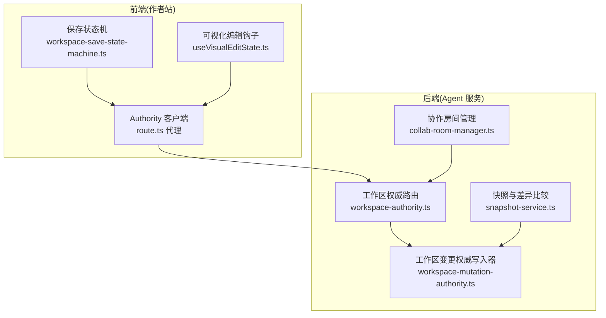
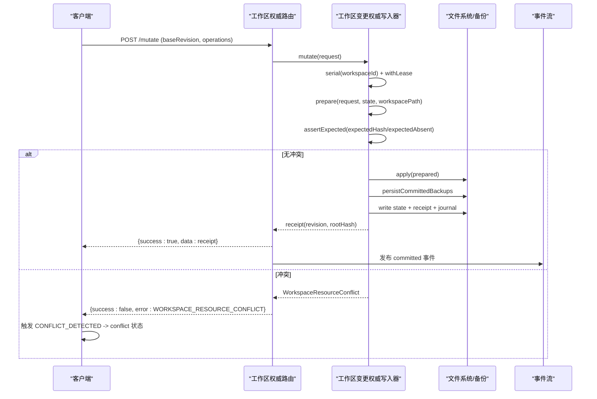
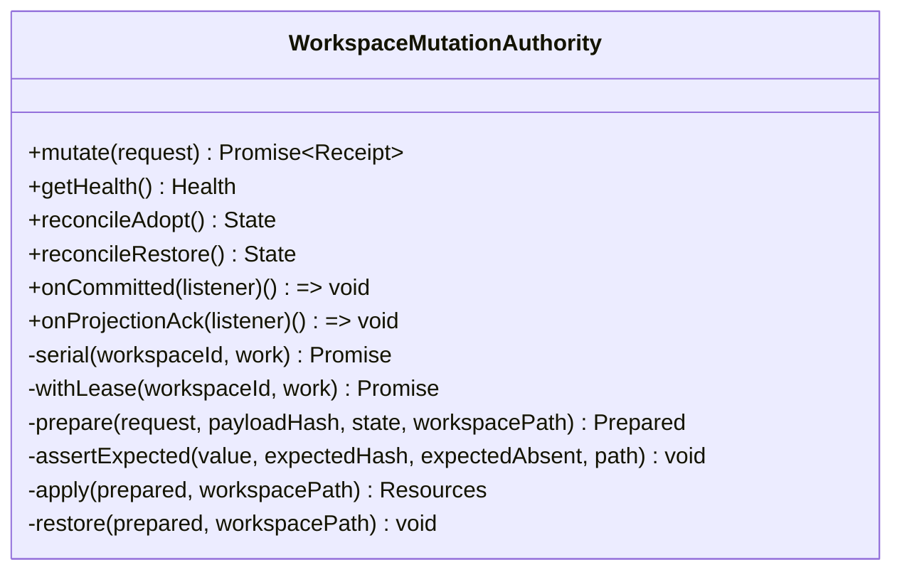
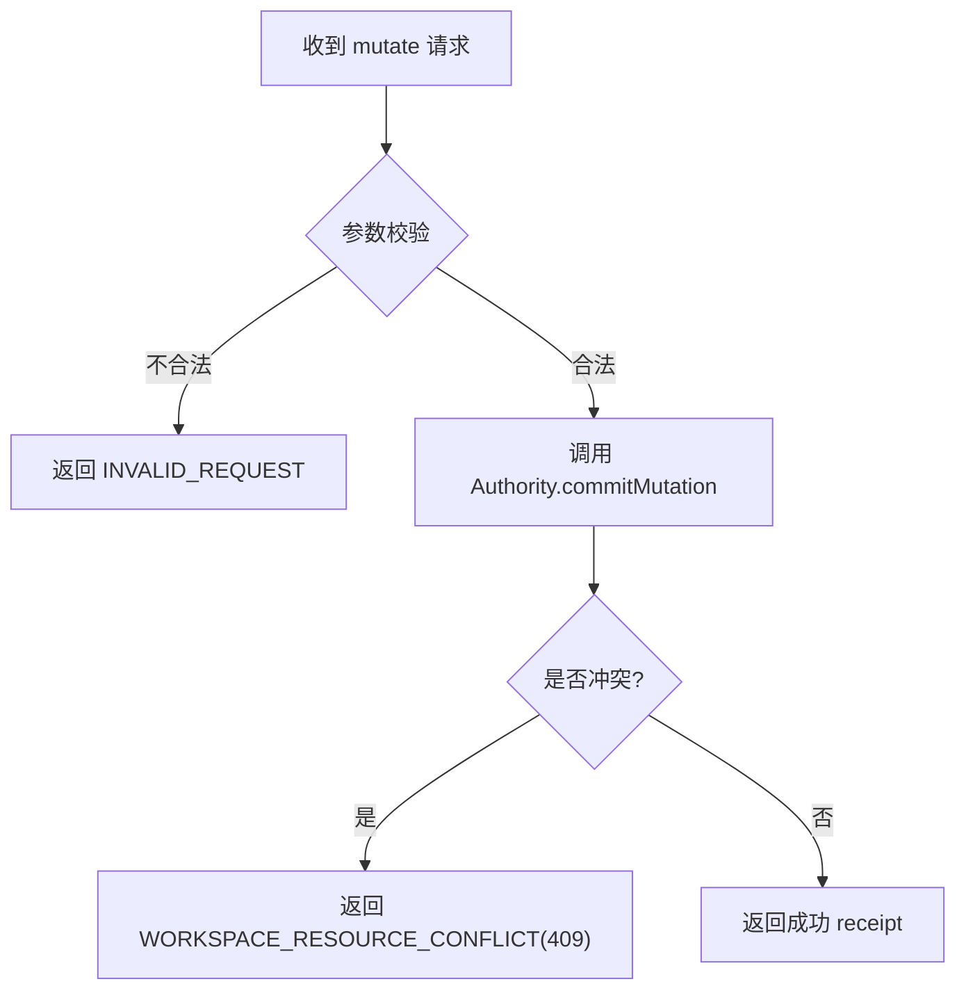
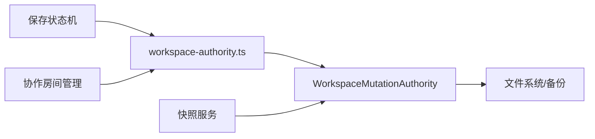

# 冲突检测与解决

<cite>
**本文引用的文件**   
- [workspace-mutation-authority.ts](file://packages/agent-service/src/workspace/workspace-mutation-authority.ts)
- [workspace-authority.ts](file://packages/agent-service/src/routes/workspace-authority.ts)
- [route.ts](file://packages/author-site/src/app/api/workspace-authority/[projectId]/[workspaceId]/[...segments]/route.ts)
- [workspace-save-state-machine.ts](file://packages/author-site/src/lib/workspace-save-state-machine.ts)
- [collab-room-manager.ts](file://packages/agent-service/src/collab/collab-room-manager.ts)
- [snapshot-service.ts](file://packages/agent-service/src/session/snapshot-service.ts)
- [useVisualEditState.ts](file://packages/author-site/src/app/demo/[id]/edit/hooks/useVisualEditState.ts)
</cite>

## 目录
1. [简介](#简介)
2. [项目结构](#项目结构)
3. [核心组件](#核心组件)
4. [架构总览](#架构总览)
5. [详细组件分析](#详细组件分析)
6. [依赖关系分析](#依赖关系分析)
7. [性能考量](#性能考量)
8. [故障排查指南](#故障排查指南)
9. [结论](#结论)
10. [附录：API 参考](#附录api-参考)

## 简介
本技术文档围绕“冲突检测与解决”能力，系统阐述以下方面：
- 冲突检测算法：文件级冲突识别、内容差异分析与语义冲突判断。
- 冲突解决策略：自动合并规则、用户干预流程与优先级处理。
- 并发控制：多用户协作下的乐观锁、悲观锁与事件溯源机制。
- 冲突标记系统：冲突标识、可视化展示与编辑辅助工具。
- API 接口：冲突检测、获取解决方案、应用合并结果等。
- 实战案例与最佳实践。

## 项目结构
冲突相关代码主要分布在后端服务（Agent Service）与前端创作端（Author Site）中：
- 后端工作区变更权威写入器负责并发控制、冲突判定与持久化。
- 路由层提供 HTTP/WebSocket 接口，暴露状态、快照、事件流与变更提交。
- 前端保存状态机驱动 UI 状态流转，并在检测到冲突时提示用户。
- 协作房间管理器在实时协作场景下广播冲突信号。
- 快照服务用于对比工作区变化，辅助冲突定位。
- 可视化编辑钩子提供配置变更的标注与合并辅助。



**图示来源** 
- [workspace-mutation-authority.ts:112-127](file://packages/agent-service/src/workspace/workspace-mutation-authority.ts#L112-L127)
- [workspace-authority.ts:61-122](file://packages/agent-service/src/routes/workspace-authority.ts#L61-L122)
- [workspace-save-state-machine.ts:76-116](file://packages/author-site/src/lib/workspace-save-state-machine.ts#L76-L116)
- [collab-room-manager.ts:334-367](file://packages/agent-service/src/collab/collab-room-manager.ts#L334-L367)
- [snapshot-service.ts:108-183](file://packages/agent-service/src/session/snapshot-service.ts#L108-L183)
- [route.ts:1-26](file://packages/author-site/src/app/api/workspace-authority/[projectId]/[workspaceId]/[...segments]/route.ts#L1-L26)

**章节来源**
- [workspace-mutation-authority.ts:112-127](file://packages/agent-service/src/workspace/workspace-mutation-authority.ts#L112-L127)
- [workspace-authority.ts:61-122](file://packages/agent-service/src/routes/workspace-authority.ts#L61-L122)
- [workspace-save-state-machine.ts:76-116](file://packages/author-site/src/lib/workspace-save-state-machine.ts#L76-L116)
- [collab-room-manager.ts:334-367](file://packages/agent-service/src/collab/collab-room-manager.ts#L334-L367)
- [snapshot-service.ts:108-183](file://packages/agent-service/src/session/snapshot-service.ts#L108-L183)
- [route.ts:1-26](file://packages/author-site/src/app/api/workspace-authority/[projectId]/[workspaceId]/[...segments]/route.ts#L1-L26)

## 核心组件
- 工作区变更权威写入器（WorkspaceMutationAuthority）
  - 职责：单写者串行化、乐观锁校验、资源哈希一致性检查、事务式准备与应用、回滚与恢复、健康度与诊断。
  - 关键能力：prepare/assertExpected 实现基于 expectedHash/expectedAbsent 的细粒度冲突检测；serial 保证同工作区串行；withLease 提供进程级互斥；journal/receipts/backups 保障可恢复性。
- 工作区权威路由（workspace-authority.ts）
  - 职责：HTTP/WebSocket 接口封装，错误码映射，事件流推送，二进制暂存与投影确认。
- 保存状态机（Save State Machine）
  - 职责：将 Authority 提交结果与 canonical 同步状态解耦，显式表达 conflict 状态并引导用户解决。
- 协作房间管理器（Collab Room Manager）
  - 职责：在协作会话中广播 WORKSPACE_RESOURCE_CONFLICT 等消息，驱动客户端进入冲突态。
- 快照服务（Snapshot Service）
  - 职责：对比 Git 或文件系统快照，输出 staged/unstaged 变更集合，辅助冲突定位。
- 可视化编辑钩子（useVisualEditState）
  - 职责：对可视配置变更进行标注、去重与合并，为后续自动/半自动合并提供输入。

**章节来源**
- [workspace-mutation-authority.ts:468-637](file://packages/agent-service/src/workspace/workspace-mutation-authority.ts#L468-L637)
- [workspace-authority.ts:215-276](file://packages/agent-service/src/routes/workspace-authority.ts#L215-L276)
- [workspace-save-state-machine.ts:10-28](file://packages/author-site/src/lib/workspace-save-state-machine.ts#L10-L28)
- [collab-room-manager.ts:399-400](file://packages/agent-service/src/collab/collab-room-manager.ts#L399-L400)
- [snapshot-service.ts:108-183](file://packages/agent-service/src/session/snapshot-service.ts#L108-L183)
- [useVisualEditState.ts:326-363](file://packages/author-site/src/app/demo/[id]/edit/hooks/useVisualEditState.ts#L326-L363)

## 架构总览
下图展示了从客户端发起变更到冲突检测与解决的端到端流程，包括乐观锁校验、冲突返回、UI 状态切换与用户干预。



**图示来源** 
- [workspace-authority.ts:215-225](file://packages/agent-service/src/routes/workspace-authority.ts#L215-L225)
- [workspace-mutation-authority.ts:468-637](file://packages/agent-service/src/workspace/workspace-mutation-authority.ts#L468-L637)
- [workspace-mutation-authority.ts:710-744](file://packages/agent-service/src/workspace/workspace-mutation-authority.ts#L710-L744)
- [workspace-mutation-authority.ts:811-815](file://packages/agent-service/src/workspace/workspace-mutation-authority.ts#L811-L815)
- [workspace-save-state-machine.ts:76-116](file://packages/author-site/src/lib/workspace-save-state-machine.ts#L76-L116)

## 详细组件分析

### 工作区变更权威写入器（WorkspaceMutationAuthority）
- 并发控制
  - 乐观锁：通过 baseRevision 与 rootHash 双重校验，确保提交基于最新一致视图。
  - 悲观锁：withLease 使用文件锁避免进程间并发写入同一工作区。
  - 串行队列：serial 按 workspaceId 串行化请求，避免内存竞争。
- 冲突检测
  - 文件级：readResourceHashes 计算每个受管资源的 SHA256，rootHash 聚合全量一致性。
  - 内容差异：assertExpected 针对 put_text/put_binary/delete_path/move_path 的 expectedHash/expectedAbsent 做精确匹配。
  - 语义冲突：由上层操作语义（如 move_path 目标存在性）参与断言，失败即冲突。
- 事务式应用与回滚
  - prepare 阶段记录 before 快照与 previousState；apply 成功后持久化 backups/state/receipt/journal；异常则 restore 并回滚。
- 事件溯源
  - journal.jsonl 记录 prepared/committed/rolled_back/conflicted 等事件；receipts 作为幂等提交凭证；projection-acks 记录下游消费确认。
- 健康与恢复
  - getHealth 汇总 queueDepth/preparedCount/missingBackupCount 等指标；recover 支持恢复未完成的 prepared 与 reconcile 操作。



**图示来源** 
- [workspace-mutation-authority.ts:112-127](file://packages/agent-service/src/workspace/workspace-mutation-authority.ts#L112-L127)
- [workspace-mutation-authority.ts:468-637](file://packages/agent-service/src/workspace/workspace-mutation-authority.ts#L468-L637)
- [workspace-mutation-authority.ts:710-744](file://packages/agent-service/src/workspace/workspace-mutation-authority.ts#L710-L744)
- [workspace-mutation-authority.ts:773-801](file://packages/agent-service/src/workspace/workspace-mutation-authority.ts#L773-L801)
- [workspace-mutation-authority.ts:811-815](file://packages/agent-service/src/workspace/workspace-mutation-authority.ts#L811-L815)

**章节来源**
- [workspace-mutation-authority.ts:468-637](file://packages/agent-service/src/workspace/workspace-mutation-authority.ts#L468-L637)
- [workspace-mutation-authority.ts:710-744](file://packages/agent-service/src/workspace/workspace-mutation-authority.ts#L710-L744)
- [workspace-mutation-authority.ts:773-801](file://packages/agent-service/src/workspace/workspace-mutation-authority.ts#L773-L801)
- [workspace-mutation-authority.ts:811-815](file://packages/agent-service/src/workspace/workspace-mutation-authority.ts#L811-L815)

### 工作区权威路由（HTTP/WebSocket）
- 接口能力
  - GET state/snapshot/health/events/projection-acks/stream
  - POST mutate/staging/projection-ack/reconcile/adopt/reconcile/restore
  - GET resources/* 读取权威资源
- 错误码映射
  - 将内部错误码稳定映射为 HTTP 状态码，例如 WORKSPACE_RESOURCE_CONFLICT -> 409。
- 事件流
  - WebSocket 推送 workspace_mutation_committed 与 projection_acknowledged 事件，支持 afterRevision 增量拉取与 gap 提示。



**图示来源** 
- [workspace-authority.ts:215-225](file://packages/agent-service/src/routes/workspace-authority.ts#L215-L225)
- [workspace-authority.ts:21-38](file://packages/agent-service/src/routes/workspace-authority.ts#L21-L38)
- [workspace-authority.ts:124-193](file://packages/agent-service/src/routes/workspace-authority.ts#L124-L193)

**章节来源**
- [workspace-authority.ts:21-38](file://packages/agent-service/src/routes/workspace-authority.ts#L21-L38)
- [workspace-authority.ts:215-225](file://packages/agent-service/src/routes/workspace-authority.ts#L215-L225)
- [workspace-authority.ts:124-193](file://packages/agent-service/src/routes/workspace-authority.ts#L124-L193)

### 保存状态机（前端）
- 状态定义
  - editing/saving/autosaved/offline/conflict/canonical-stale
- 转移规则
  - SAVE_STARTED/SAVE_COMMITTED/SAVE_FAILED/DISCONNECT/RECONNECT/CONFLICT_DETECTED/CONFLICT_RESOLVED/CANONICAL_STALE/CANONICAL_SYNCED
- 设计要点
  - autosaved 仅表示 Authority commit 成功，canonical 异常独立承载于 canonical-stale。
  - conflict 优先级最高，需显式 CONFLICT_RESOLVED 退出。

```mermaid
stateDiagram-v2
[*] --> editing
editing --> saving : "SAVE_STARTED"
saving --> autosaved : "SAVE_COMMITTED"
saving --> editing : "SAVE_FAILED"
editing --> offline : "DISCONNECT"
offline --> editing : "RECONNECT"
autosaved --> offline : "DISCONNECT"
autosaved --> canonical-stale : "CANONICAL_STALE"
canonical-stale --> autosaved : "CANONICAL_SYNCED"
autosaved --> conflict : "CONFLICT_DETECTED"
saving --> conflict : "CONFLICT_DETECTED"
conflict --> editing : "CONFLICT_RESOLVED"
conflict --> offline : "DISCONNECT"
```

**图示来源** 
- [workspace-save-state-machine.ts:76-116](file://packages/author-site/src/lib/workspace-save-state-machine.ts#L76-L116)

**章节来源**
- [workspace-save-state-machine.ts:10-28](file://packages/author-site/src/lib/workspace-save-state-machine.ts#L10-L28)
- [workspace-save-state-machine.ts:76-116](file://packages/author-site/src/lib/workspace-save-state-machine.ts#L76-L116)

### 协作房间管理器（实时协作）
- 在协作消息处理中，当检测到资源冲突时，向客户端广播 WORKSPACE_RESOURCE_CONFLICT，促使客户端进入冲突态。
- 与 Awareness 协议集成，维护在线用户状态与协作上下文。

**章节来源**
- [collab-room-manager.ts:399-400](file://packages/agent-service/src/collab/collab-room-manager.ts#L399-L400)
- [collab-room-manager.ts:334-367](file://packages/agent-service/src/collab/collab-room-manager.ts#L334-L367)

### 快照服务（差异比较）
- 若工作区为 Git 仓库，解析 git status --porcelain 输出，区分 staged/unstaged 变更。
- 非 Git 仓库时，扫描当前文件并与历史快照对比，生成变更列表，辅助冲突定位。

**章节来源**
- [snapshot-service.ts:108-183](file://packages/agent-service/src/session/snapshot-service.ts#L108-L183)

### 可视化编辑钩子（配置变更标注与合并）
- 对可视配置变更进行 changeId 去重与签名比对，过滤已提交的变更。
- 合并变更与标注集合，减少重复提交与冲突概率。

**章节来源**
- [useVisualEditState.ts:326-363](file://packages/author-site/src/app/demo/[id]/edit/hooks/useVisualEditState.ts#L326-L363)

## 依赖关系分析
- 低耦合高内聚
  - Authority 专注并发控制与一致性，路由层仅做参数校验与错误码映射。
  - 前端状态机与 Authority 通过标准事件/错误码交互，便于替换实现。
- 外部依赖
  - 文件系统原子写入与 JSON/二进制持久化。
  - Git CLI（可选）用于快照差异比较。
- 潜在循环依赖
  - 当前未发现直接循环依赖；Authority 通过静态监听器与事件总线解耦订阅方。



**图示来源** 
- [workspace-mutation-authority.ts:946-961](file://packages/agent-service/src/workspace/workspace-mutation-authority.ts#L946-L961)
- [workspace-authority.ts:61-122](file://packages/agent-service/src/routes/workspace-authority.ts#L61-L122)
- [workspace-save-state-machine.ts:76-116](file://packages/author-site/src/lib/workspace-save-state-machine.ts#L76-L116)
- [collab-room-manager.ts:334-367](file://packages/agent-service/src/collab/collab-room-manager.ts#L334-L367)
- [snapshot-service.ts:108-183](file://packages/agent-service/src/session/snapshot-service.ts#L108-L183)

**章节来源**
- [workspace-mutation-authority.ts:946-961](file://packages/agent-service/src/workspace/workspace-mutation-authority.ts#L946-L961)
- [workspace-authority.ts:61-122](file://packages/agent-service/src/routes/workspace-authority.ts#L61-L122)
- [workspace-save-state-machine.ts:76-116](file://packages/author-site/src/lib/workspace-save-state-machine.ts#L76-L116)
- [collab-room-manager.ts:334-367](file://packages/agent-service/src/collab/collab-room-manager.ts#L334-L367)
- [snapshot-service.ts:108-183](file://packages/agent-service/src/session/snapshot-service.ts#L108-L183)

## 性能考量
- 串行化与队列深度
  - serial 保证同工作区串行，queueDepth 可用于监控排队情况，避免长尾阻塞。
- 原子写入与备份
  - 原子写入降低部分写入风险；backups 以 hash 命名，避免重复存储，提升恢复效率。
- 事件流与批处理
  - WebSocket 初始化缓冲与排序发送，减少乱序与抖动。
- 快照比较
  - Git 模式 O(n) 遍历 porcelains 输出；非 Git 模式递归扫描，建议按需增量扫描。

[本节为通用指导，无需特定文件引用]

## 故障排查指南
- 常见错误码与含义
  - WORKSPACE_RESOURCE_CONFLICT：资源期望不一致，需重新拉取最新状态后重试。
  - WORKSPACE_EXTERNAL_DRIFT：磁盘实际根哈希与权威不一致，需 reconcile/adopt 或 reconcile/restore。
  - WORKSPACE_WRITE_LEASE_UNAVAILABLE：进程级写锁不可用，等待释放或人工清理。
  - WORKSPACE_AUTHORITY_BACKUP_MISSING：缺失必要备份，需修复备份目录。
- 诊断与观测
  - health 接口返回 ready/externalDrift/queueDepth/preparedCount 等指标。
  - journal.jsonl 与 receipts 目录用于审计与回放。
- 恢复流程
  - reconcile/adopt：接受磁盘漂移为新的权威版本。
  - reconcile/restore：丢弃漂移，恢复到上次提交的一致状态。

**章节来源**
- [workspace-authority.ts:21-38](file://packages/agent-service/src/routes/workspace-authority.ts#L21-L38)
- [workspace-authority.ts:205-213](file://packages/agent-service/src/routes/workspace-authority.ts#L205-L213)
- [workspace-authority.ts:245-263](file://packages/agent-service/src/routes/workspace-authority.ts#L245-L263)
- [workspace-mutation-authority.ts:240-284](file://packages/agent-service/src/workspace/workspace-mutation-authority.ts#L240-L284)
- [workspace-mutation-authority.ts:286-378](file://packages/agent-service/src/workspace/workspace-mutation-authority.ts#L286-L378)

## 结论
本方案通过“乐观锁 + 进程级互斥 + 事件溯源”的组合，实现了强一致的多用户协作写入与可靠的冲突检测。前端状态机与可视化标注进一步提升了用户体验与可解释性。结合快照差异与健康诊断，形成完整的冲突检测与解决闭环。

[本节为总结，无需特定文件引用]

## 附录：API 参考
- 查询类
  - GET /api/workspace-authority/projects/:projectId/workspaces/:workspaceId/state
  - GET /api/workspace-authority/projects/:projectId/workspaces/:workspaceId/snapshot
  - GET /api/workspace-authority/projects/:projectId/workspaces/:workspaceId/health
  - GET /api/workspace-authority/projects/:projectId/workspaces/:workspaceId/events?afterRevision=
  - GET /api/workspace-authority/projects/:projectId/workspaces/:workspaceId/projection-acks?afterRevision=
  - GET /api/workspace-authority/projects/:projectId/workspaces/:workspaceId/resources/*
- 变更类
  - POST /api/workspace-authority/projects/:projectId/workspaces/:workspaceId/mutate
  - POST /api/workspace-authority/projects/:projectId/workspaces/:workspaceId/staging
  - POST /api/workspace-authority/projects/:projectId/workspaces/:workspaceId/projection-ack
- 协调类
  - POST /api/workspace-authority/projects/:projectId/workspaces/:workspaceId/reconcile/adopt
  - POST /api/workspace-authority/projects/:projectId/workspaces/:workspaceId/reconcile/restore
- 事件流
  - WS /api/workspace-authority/projects/:projectId/workspaces/:workspaceId/stream?afterRevision=

**章节来源**
- [workspace-authority.ts:67-122](file://packages/agent-service/src/routes/workspace-authority.ts#L67-L122)
- [workspace-authority.ts:124-193](file://packages/agent-service/src/routes/workspace-authority.ts#L124-L193)
- [workspace-authority.ts:215-276](file://packages/agent-service/src/routes/workspace-authority.ts#L215-L276)
- [route.ts:1-26](file://packages/author-site/src/app/api/workspace-authority/[projectId]/[workspaceId]/[...segments]/route.ts#L1-L26)