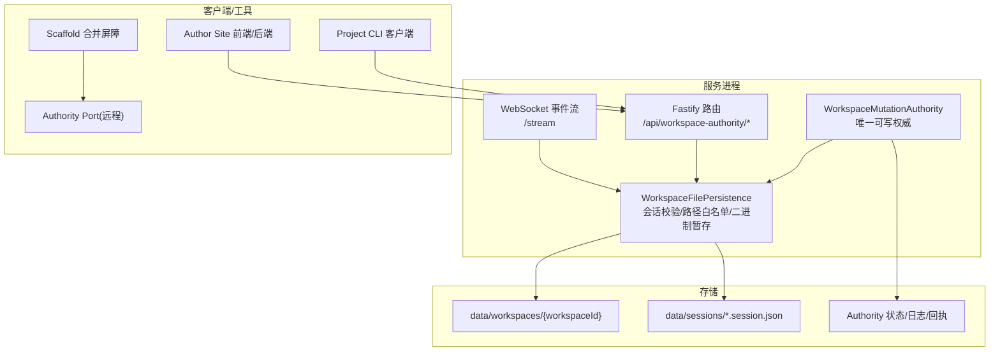
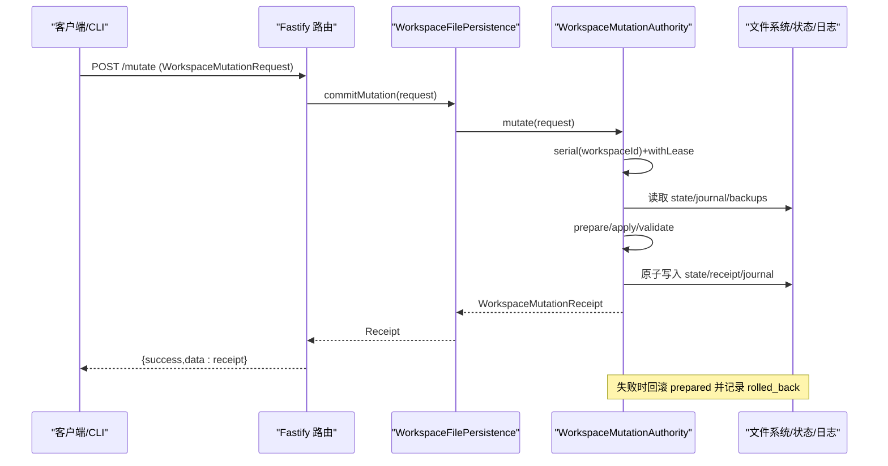
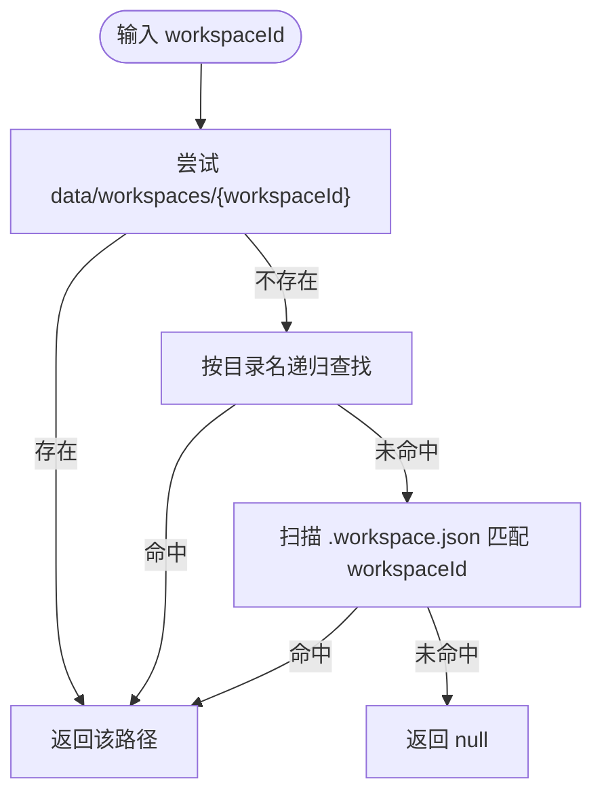
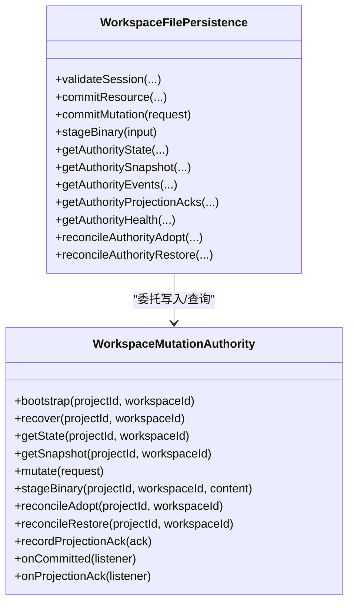
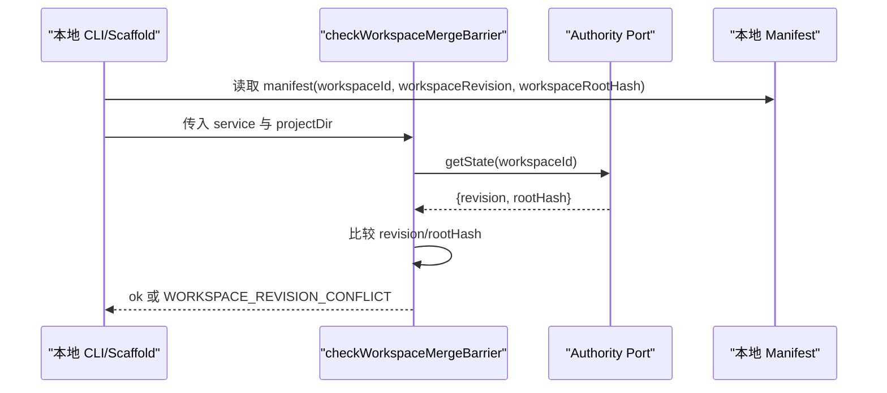
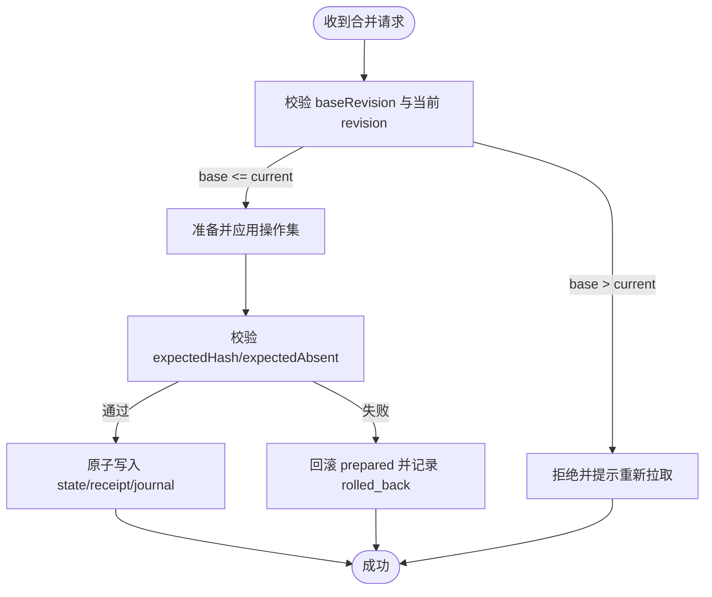
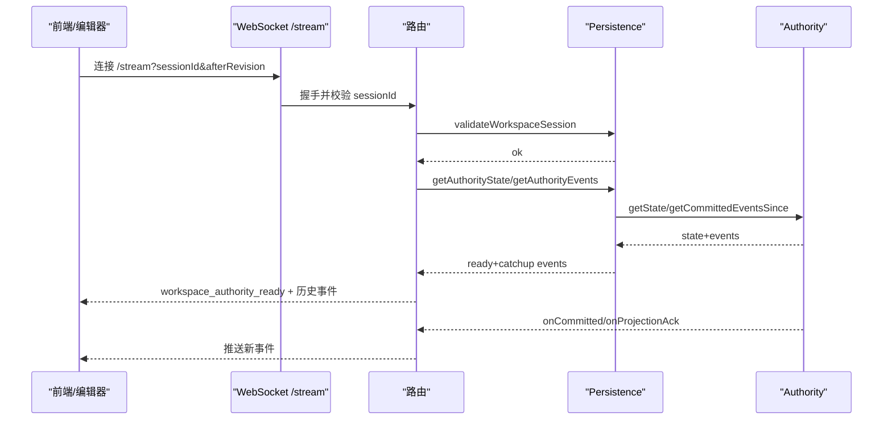
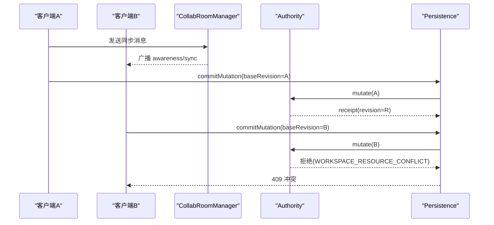
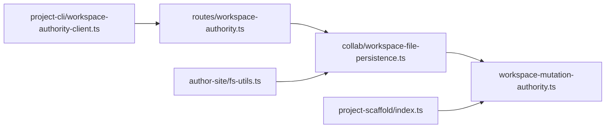

# 分支操作

<cite>
**本文引用的文件**   
- [packages/agent-service/src/workspace/workspace-mutation-authority.ts](file://packages/agent-service/src/workspace/workspace-mutation-authority.ts)
- [packages/agent-service/src/collab/workspace-file-persistence.ts](file://packages/agent-service/src/collab/workspace-file-persistence.ts)
- [packages/agent-service/src/routes/workspace-authority.ts](file://packages/agent-service/src/routes/workspace-authority.ts)
- [packages/project-scaffold/src/index.ts](file://packages/project-scaffold/src/index.ts)
- [packages/project-core/src/service.ts](file://packages/project-core/src/service.ts)
- [packages/author-site/src/lib/fs-utils.ts](file://packages/author-site/src/lib/fs-utils.ts)
- [packages/agent-service/src/session/snapshot-service.ts](file://packages/agent-service/src/session/snapshot-service.ts)
- [packages/agent-service/src/collab/collab-room-manager.ts](file://packages/agent-service/src/collab/collab-room-manager.ts)
- [packages/project-cli/src/workspace-authority-client.ts](file://packages/project-cli/src/workspace-authority-client.ts)
</cite>

## 目录
1. [简介](#简介)
2. [项目结构](#项目结构)
3. [核心组件](#核心组件)
4. [架构总览](#架构总览)
5. [详细组件分析](#详细组件分析)
6. [依赖关系分析](#依赖关系分析)
7. [性能与并发特性](#性能与并发特性)
8. [故障排查指南](#故障排查指南)
9. [结论](#结论)
10. [附录：API 规范](#附录api-规范)

## 简介
本技术文档围绕“分支操作”能力，系统化阐述工作区隔离机制、分支命名与状态管理、并发控制、分支创建与合并策略、切换流程、以及面向多用户协作的冲突处理与锁设计。文档同时提供完整的分支管理 API 规范，覆盖创建、删除、切换、合并等关键操作的接口定义与错误码约定。

## 项目结构
分支相关能力由以下模块协同实现：
- 工作区变更权威写入器（WorkspaceMutationAuthority）：单实例串行化、幂等提交、外部漂移检测、恢复与对账。
- 文件持久化适配层（WorkspaceFilePersistence）：会话校验、资源路径白名单、二进制暂存、事件订阅。
- HTTP/WebSocket 路由（workspace-authority routes）：对外暴露状态、快照、事件流、变更提交、投影确认等接口。
- 脚手架合并屏障（checkWorkspaceMergeBarrier）：在本地提交前进行 revision/rootHash 一致性检查，避免并发冲突。
- 内容提交与审计（project-core service）：将工作区变更落盘为不可变提交，记录审计元数据。
- 工作区定位与会话元数据（author-site fs-utils）：按 workspaceId 查找工作区目录，维护 scope/status 等元信息。
- 快照服务（snapshot-service）：从 Git 仓库获取当前分支名，用于快照上下文。
- 协作房间管理器（collab-room-manager）：基于 Yjs 的实时同步与感知广播。
- CLI 客户端（workspace-authority-client）：封装 mutate/events/projection-acks 等调用。

图示来源
- [packages/agent-service/src/workspace/workspace-mutation-authority.ts:112-189](file://packages/agent-service/src/workspace/workspace-mutation-authority.ts#L112-L189)
- [packages/agent-service/src/collab/workspace-file-persistence.ts:70-136](file://packages/agent-service/src/collab/workspace-file-persistence.ts#L70-L136)
- [packages/agent-service/src/routes/workspace-authority.ts:61-122](file://packages/agent-service/src/routes/workspace-authority.ts#L61-L122)
- [packages/project-scaffold/src/index.ts:2007-2058](file://packages/project-scaffold/src/index.ts#L2007-L2058)

章节来源
- [packages/agent-service/src/workspace/workspace-mutation-authority.ts:112-189](file://packages/agent-service/src/workspace/workspace-mutation-authority.ts#L112-L189)
- [packages/agent-service/src/collab/workspace-file-persistence.ts:70-136](file://packages/agent-service/src/collab/workspace-file-persistence.ts#L70-L136)
- [packages/agent-service/src/routes/workspace-authority.ts:61-122](file://packages/agent-service/src/routes/workspace-authority.ts#L61-L122)
- [packages/project-scaffold/src/index.ts:2007-2058](file://packages/project-scaffold/src/index.ts#L2007-L2058)

## 核心组件
- 工作区变更权威写入器（WorkspaceMutationAuthority）
  - 职责：对已激活 live 工作区的唯一持久化写入者；维护 per-workspace 队列与状态；保证幂等提交、外部漂移检测、崩溃恢复与对账。
  - 并发控制：进程内通过静态 Map 维护 per-workspace 串行队列与深度统计；方法统一经 serial + withLease 保护。
  - 状态模型：revision、rootHash、resourceHashes、mutationPayloads、updatedAt 等。
- 文件持久化适配层（WorkspaceFilePersistence）
  - 职责：会话校验、资源路径白名单、二进制暂存、读取/提交资源、事件订阅、健康检查、对账恢复。
  - 安全：严格校验 resourcePath 与 kind 映射，拒绝越权访问。
- HTTP/WebSocket 路由
  - 职责：将 Authority 能力以 REST/WS 形式暴露；统一错误码映射；支持事件流与投影确认。
- 脚手架合并屏障
  - 职责：在本地提交前对比 Authority 当前 revision/rootHash 与本地 manifest 记录，防止并发写入冲突。
- 内容提交与审计（project-core）
  - 职责：将工作区变更落盘为不可变提交，记录审计元数据（含 workspaceId/revision/rootHash）。

章节来源
- [packages/agent-service/src/workspace/workspace-mutation-authority.ts:112-189](file://packages/agent-service/src/workspace/workspace-mutation-authority.ts#L112-L189)
- [packages/agent-service/src/collab/workspace-file-persistence.ts:70-136](file://packages/agent-service/src/collab/workspace-file-persistence.ts#L70-L136)
- [packages/agent-service/src/routes/workspace-authority.ts:61-122](file://packages/agent-service/src/routes/workspace-authority.ts#L61-L122)
- [packages/project-scaffold/src/index.ts:2007-2058](file://packages/project-scaffold/src/index.ts#L2007-L2058)
- [packages/project-core/src/service.ts:5004-5055](file://packages/project-core/src/service.ts#L5004-L5055)

## 架构总览
下图展示了分支操作的关键交互：客户端通过 HTTP/WS 与路由交互，路由委托持久化层，最终由权威写入器完成幂等提交、状态更新与事件广播。

图示来源
- [packages/agent-service/src/routes/workspace-authority.ts:215-225](file://packages/agent-service/src/routes/workspace-authority.ts#L215-L225)
- [packages/agent-service/src/collab/workspace-file-persistence.ts:256-265](file://packages/agent-service/src/collab/workspace-file-persistence.ts#L256-L265)
- [packages/agent-service/src/workspace/workspace-mutation-authority.ts:468-598](file://packages/agent-service/src/workspace/workspace-mutation-authority.ts#L468-L598)

## 详细组件分析

### 工作区隔离与命名规范
- 工作区定位
  - 优先按 workspaceId 直接匹配目录；否则按目录名递归查找；最后扫描 .workspace.json 中的 workspaceId 字段。
  - 支持按 userId/projectId 层级组织，便于权限与归属推断。
- 工作区元数据
  - scope 支持 live/branch/snapshot-source/legacy；status 支持 active/archived/committed/expired。
  - 通过 findWorkspacePath/readWorkspaceMeta 等方法维护与查询。
- 资源路径白名单
  - 根据 CollabResourceKind 限定允许的路径模式，防止越权读写。

图示来源
- [packages/agent-service/src/collab/workspace-file-persistence.ts:321-337](file://packages/agent-service/src/collab/workspace-file-persistence.ts#L321-L337)
- [packages/author-site/src/lib/fs-utils.ts:1739-1762](file://packages/author-site/src/lib/fs-utils.ts#L1739-L1762)

章节来源
- [packages/agent-service/src/collab/workspace-file-persistence.ts:321-337](file://packages/agent-service/src/collab/workspace-file-persistence.ts#L321-L337)
- [packages/author-site/src/lib/fs-utils.ts:1739-1762](file://packages/author-site/src/lib/fs-utils.ts#L1739-L1762)

### 状态管理与并发控制
- 状态模型
  - revision：单调递增的版本号。
  - rootHash：所有受管资源的根哈希，用于快速检测外部漂移。
  - resourceHashes：每个受管资源的哈希索引。
  - mutationPayloads：记录已处理的 mutationId→payloadHash，保障幂等。
- 并发控制
  - 进程内 per-workspace 串行队列（static queues），避免同一工作区并发写入。
  - 每次写入前 withLease 确保独占；失败自动清理 prepared 与 staging。
- 外部漂移检测
  - 提交前比对实际 rootHash 与期望 rootHash，不一致则拒绝并上报冲突。
- 崩溃恢复与对账
  - recover：恢复 prepared mutations/reconciles，必要时抛出外部漂移异常。
  - reconcileAdopt：将磁盘漂移接受为新版本。
  - reconcileRestore：丢弃漂移并恢复到上次提交状态。

图示来源
- [packages/agent-service/src/workspace/workspace-mutation-authority.ts:112-189](file://packages/agent-service/src/workspace/workspace-mutation-authority.ts#L112-L189)
- [packages/agent-service/src/collab/workspace-file-persistence.ts:70-136](file://packages/agent-service/src/collab/workspace-file-persistence.ts#L70-L136)

章节来源
- [packages/agent-service/src/workspace/workspace-mutation-authority.ts:112-189](file://packages/agent-service/src/workspace/workspace-mutation-authority.ts#L112-L189)
- [packages/agent-service/src/collab/workspace-file-persistence.ts:70-136](file://packages/agent-service/src/collab/workspace-file-persistence.ts#L70-L136)

### 分支创建流程（基准选择、初始化、权限继承）
- 基准选择
  - 若配置了 Authority Port，则在提交前通过 checkWorkspaceMergeBarrier 对比本地 manifest 的 workspaceRevision 与 Authority 当前 revision/rootHash，不一致则拒绝。
- 初始化
  - 首次 bootstrap 会扫描工作区资源计算初始 rootHash 与 resourceHashes，并持久化 state。
- 权限继承
  - 通过 validateWorkspaceSession 校验 sessionId 与 workspaceId、projectId 的一致性，并限制资源路径白名单，确保权限继承到具体资源操作。

图示来源
- [packages/project-scaffold/src/index.ts:2007-2058](file://packages/project-scaffold/src/index.ts#L2007-L2058)

章节来源
- [packages/project-scaffold/src/index.ts:2007-2058](file://packages/project-scaffold/src/index.ts#L2007-L2058)

### 分支合并策略（自动合并、手动解决冲突、三方合并算法）
- 自动合并
  - 系统采用幂等提交与外部漂移检测，当 baseRevision 落后于当前 revision 时拒绝提交，要求客户端先拉取最新状态后重试。
- 手动解决冲突
  - 通过 reconcileAdopt 显式接受磁盘漂移为新版本；或通过 reconcileRestore 丢弃漂移并恢复到上次提交状态。
- 三方合并算法
  - 当前实现未内置三方合并逻辑；建议在应用层基于 snapshot 与 diff 生成合并补丁，再作为一次 mutate 提交。

图示来源
- [packages/agent-service/src/workspace/workspace-mutation-authority.ts:468-598](file://packages/agent-service/src/workspace/workspace-mutation-authority.ts#L468-L598)
- [packages/agent-service/src/workspace/workspace-mutation-authority.ts:286-378](file://packages/agent-service/src/workspace/workspace-mutation-authority.ts#L286-L378)

章节来源
- [packages/agent-service/src/workspace/workspace-mutation-authority.ts:468-598](file://packages/agent-service/src/workspace/workspace-mutation-authority.ts#L468-L598)
- [packages/agent-service/src/workspace/workspace-mutation-authority.ts:286-378](file://packages/agent-service/src/workspace/workspace-mutation-authority.ts#L286-L378)

### 分支切换操作（状态保存、上下文切换、数据同步）
- 状态保存
  - 切换前可通过 getAuthoritySnapshot 获取完整文本快照（排除二进制），用于离线或回滚。
- 上下文切换
  - 通过 validateWorkspaceSession 验证新 workspaceId 与 sessionId 的绑定关系，确保后续操作权限正确。
- 数据同步
  - 使用 WebSocket /stream 订阅 workspace_mutation_committed 与 projection_acknowledged 事件，结合 afterRevision 游标实现增量同步。

图示来源
- [packages/agent-service/src/routes/workspace-authority.ts:124-193](file://packages/agent-service/src/routes/workspace-authority.ts#L124-L193)
- [packages/agent-service/src/collab/workspace-file-persistence.ts:220-230](file://packages/agent-service/src/collab/workspace-file-persistence.ts#L220-L230)
- [packages/agent-service/src/workspace/workspace-mutation-authority.ts:141-179](file://packages/agent-service/src/workspace/workspace-mutation-authority.ts#L141-L179)

章节来源
- [packages/agent-service/src/routes/workspace-authority.ts:124-193](file://packages/agent-service/src/routes/workspace-authority.ts#L124-L193)
- [packages/agent-service/src/collab/workspace-file-persistence.ts:220-230](file://packages/agent-service/src/collab/workspace-file-persistence.ts#L220-L230)
- [packages/agent-service/src/workspace/workspace-mutation-authority.ts:141-179](file://packages/agent-service/src/workspace/workspace-mutation-authority.ts#L141-L179)

### 多用户协作与锁机制
- 协作基础
  - 基于 Yjs 的协作房间管理器负责 awareness 与同步消息广播，支撑多人实时编辑。
- 锁机制
  - 进程内 per-workspace 串行队列 + withLease 保证同一工作区互斥写入。
  - 外部漂移检测与冲突计数用于监控与告警。
- 投影确认
  - recordProjectionAck 记录客户端投影结果，若 ack.revision 超过当前 revision 则视为冲突并记录诊断。

图示来源
- [packages/agent-service/src/collab/collab-room-manager.ts:297-332](file://packages/agent-service/src/collab/collab-room-manager.ts#L297-L332)
- [packages/agent-service/src/workspace/workspace-mutation-authority.ts:468-598](file://packages/agent-service/src/workspace/workspace-mutation-authority.ts#L468-L598)

章节来源
- [packages/agent-service/src/collab/collab-room-manager.ts:297-332](file://packages/agent-service/src/collab/collab-room-manager.ts#L297-L332)
- [packages/agent-service/src/workspace/workspace-mutation-authority.ts:468-598](file://packages/agent-service/src/workspace/workspace-mutation-authority.ts#L468-L598)

### 快照与分支上下文
- 快照服务可从 Git 仓库获取当前分支名，用于快照上下文标识。
- 适用于 snapshot-source 类型工作区，辅助追踪快照来源分支。

章节来源
- [packages/agent-service/src/session/snapshot-service.ts:20-54](file://packages/agent-service/src/session/snapshot-service.ts#L20-L54)

## 依赖关系分析
- 路由依赖 Persistence，Persistence 依赖 Authority。
- CLI 客户端通过 HTTP 调用路由接口，Scaffold 合并屏障通过 Authority Port 远程查询状态。
- Author Site 通过 fs-utils 定位工作区目录并读取元数据。

图示来源
- [packages/agent-service/src/routes/workspace-authority.ts:61-122](file://packages/agent-service/src/routes/workspace-authority.ts#L61-L122)
- [packages/agent-service/src/collab/workspace-file-persistence.ts:70-136](file://packages/agent-service/src/collab/workspace-file-persistence.ts#L70-L136)
- [packages/agent-service/src/workspace/workspace-mutation-authority.ts:112-189](file://packages/agent-service/src/workspace/workspace-mutation-authority.ts#L112-L189)
- [packages/project-cli/src/workspace-authority-client.ts:52-76](file://packages/project-cli/src/workspace-authority-client.ts#L52-L76)
- [packages/project-scaffold/src/index.ts:2007-2058](file://packages/project-scaffold/src/index.ts#L2007-L2058)
- [packages/author-site/src/lib/fs-utils.ts:1739-1762](file://packages/author-site/src/lib/fs-utils.ts#L1739-L1762)

章节来源
- [packages/agent-service/src/routes/workspace-authority.ts:61-122](file://packages/agent-service/src/routes/workspace-authority.ts#L61-L122)
- [packages/agent-service/src/collab/workspace-file-persistence.ts:70-136](file://packages/agent-service/src/collab/workspace-file-persistence.ts#L70-L136)
- [packages/agent-service/src/workspace/workspace-mutation-authority.ts:112-189](file://packages/agent-service/src/workspace/workspace-mutation-authority.ts#L112-L189)
- [packages/project-cli/src/workspace-authority-client.ts:52-76](file://packages/project-cli/src/workspace-authority-client.ts#L52-L76)
- [packages/project-scaffold/src/index.ts:2007-2058](file://packages/project-scaffold/src/index.ts#L2007-L2058)
- [packages/author-site/src/lib/fs-utils.ts:1739-1762](file://packages/author-site/src/lib/fs-utils.ts#L1739-L1762)

## 性能与并发特性
- 串行化与队列深度
  - 每工作区独立队列，避免跨工作区竞争；queueDepth 可用于监控排队情况。
- 幂等与去重
  - mutationId 与 payloadHash 双重校验，重复提交直接返回已有 receipt。
- 原子写入与备份
  - 使用原子写入保证 state/receipt/journal 一致性；提交后持久化 committed backups 以便恢复。
- 外部漂移检测
  - 提交前 rootHash 校验，避免覆盖外部修改；发现漂移立即拒绝并记录诊断。
- 二进制暂存
  - 大文件先 stageBinary，再在 put_binary 中校验 size/hash，减少无效写入。

[本节为通用性能指导，不直接分析具体文件]

## 故障排查指南
- 常见错误码
  - INVALID_REQUEST：参数不合法或缺少必要字段。
  - SESSION_NOT_FOUND/SESSION_EXPIRED：会话不存在或过期。
  - PROJECT_MISMATCH/WORKSPACE_MISMATCH/WORKSPACE_PROJECT_MISMATCH：ID 不一致。
  - WORKSPACE_NOT_FOUND：工作区不存在。
  - WORKSPACE_AUTHORITY_NOT_READY：Authority 尚未就绪。
  - WORKSPACE_RESOURCE_CONFLICT：资源冲突（baseRevision 落后）。
  - WORKSPACE_MUTATION_ID_REUSED：mutationId 被重用且 payload 不一致。
  - WORKSPACE_INVALID_OPERATION：操作非法（路径/大小/格式不符）。
  - WORKSPACE_EXTERNAL_DRIFT：检测到外部漂移。
  - WORKSPACE_AUTHORITY_BACKUP_MISSING：缺少提交备份。
  - WORKSPACE_WRITE_LEASE_UNAVAILABLE：写入租约不可用。
  - WORKSPACE_MUTATION_FAILED：未知失败。
- 诊断与恢复
  - 使用 health 接口查看 queueDepth、preparedCount、missingBackupCount、journalEntries 等指标。
  - 使用 reconcileAdopt 接受漂移；reconcileRestore 丢弃漂移并恢复。
  - 使用 getAuthorityEvents 与 getAuthorityProjectionAcks 回溯事件与投影结果。

章节来源
- [packages/agent-service/src/routes/workspace-authority.ts:21-54](file://packages/agent-service/src/routes/workspace-authority.ts#L21-L54)
- [packages/agent-service/src/workspace/workspace-mutation-authority.ts:240-284](file://packages/agent-service/src/workspace/workspace-mutation-authority.ts#L240-L284)
- [packages/agent-service/src/workspace/workspace-mutation-authority.ts:286-378](file://packages/agent-service/src/workspace/workspace-mutation-authority.ts#L286-L378)

## 结论
本方案通过“权威写入器 + 持久化适配层 + 路由/事件流”的分层架构，实现了高可靠、幂等、可恢复的工作区变更管理。配合合并屏障、外部漂移检测与串行化队列，有效保障了多用户协作下的数据一致性与并发安全。对于复杂合并场景，建议在上层引入三方合并算法，并以单次 mutate 提交合并结果。

[本节为总结性内容，不直接分析具体文件]

## 附录：API 规范

### 通用约定
- 认证与会话
  - 多数接口需要 query 参数 sessionId，用于会话校验与权限继承。
- 错误响应
  - 统一返回 { success: boolean; error?: { code: string; message: string } }。
  - 错误码与 HTTP 状态映射见路由定义。

### 工作区状态与快照
- GET /api/workspace-authority/projects/:projectId/workspaces/:workspaceId/state
  - 查询工作区权威状态（revision、rootHash、resourceHashes 等）。
- GET /api/workspace-authority/projects/:projectId/workspaces/:workspaceId/snapshot
  - 获取工作区文本快照（不含二进制资源）。

### 资源读取
- GET /api/workspace-authority/projects/:projectId/workspaces/:workspaceId/resources/*
  - 读取指定资源内容及其 hash、revision。

### 事件与投影
- GET /api/workspace-authority/projects/:projectId/workspaces/:workspaceId/events?afterRevision=...
  - 拉取自某 revision 之后的提交事件。
- GET /api/workspace-authority/projects/:projectId/workspaces/:workspaceId/projection-acks?afterRevision=...
  - 拉取自某 revision 之后的投影确认事件。
- WebSocket /api/workspace-authority/projects/:projectId/workspaces/:workspaceId/stream?sessionId&afterRevision=...
  - 实时订阅提交与投影事件，支持 gap 通知。

### 变更提交与二进制暂存
- POST /api/workspace-authority/projects/:projectId/workspaces/:workspaceId/mutate
  - 提交变更请求（包含 operations、baseRevision、actor、reason 等）。
- POST /api/workspace-authority/projects/:projectId/workspaces/:workspaceId/staging
  - 上传二进制内容至暂存区，返回 stagingId、hash、size。

### 对账与恢复
- POST /api/workspace-authority/projects/:projectId/workspaces/:workspaceId/reconcile/adopt
  - 接受磁盘漂移为新版本。
- POST /api/workspace-authority/projects/:projectId/workspaces/:workspaceId/reconcile/restore
  - 丢弃漂移并恢复到上次提交状态。

### 投影确认
- POST /api/workspace-authority/projects/:projectId/workspaces/:workspaceId/projection-ack
  - 记录客户端投影结果，供权威侧校验与诊断。

### 健康检查
- GET /api/workspace-authority/projects/:projectId/workspaces/:workspaceId/health
  - 返回工作区健康指标（ready、queueDepth、preparedCount、missingBackupCount 等）。

章节来源
- [packages/agent-service/src/routes/workspace-authority.ts:61-278](file://packages/agent-service/src/routes/workspace-authority.ts#L61-L278)
- [packages/project-cli/src/workspace-authority-client.ts:52-76](file://packages/project-cli/src/workspace-authority-client.ts#L52-L76)