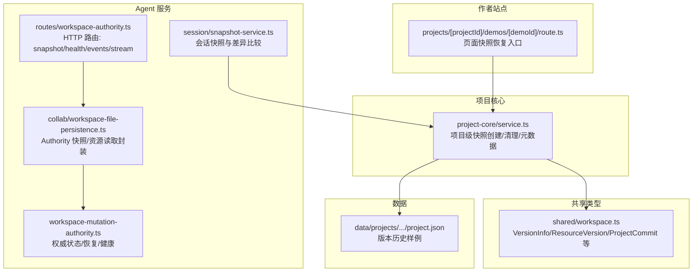
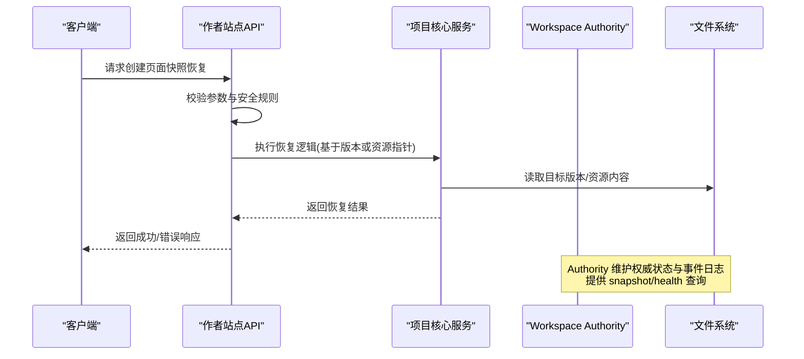
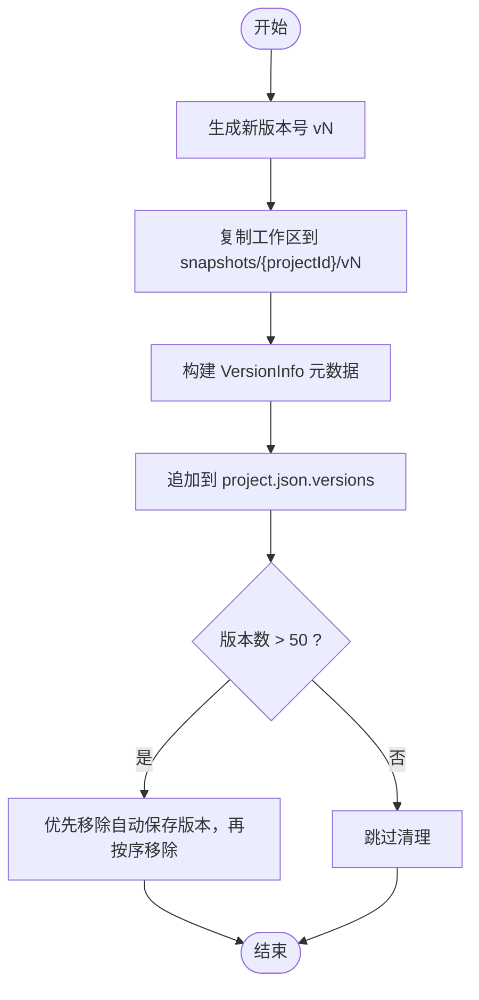
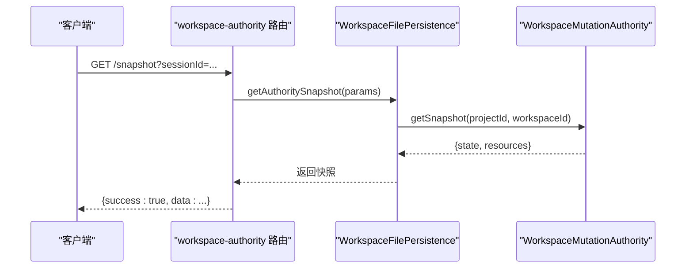
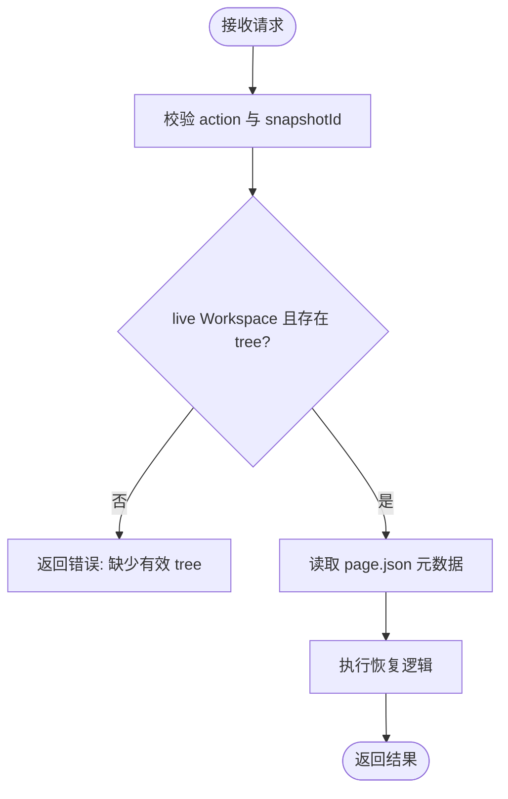
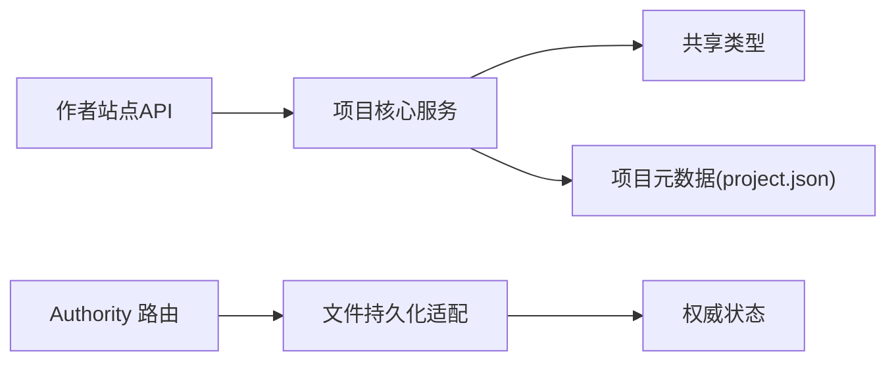

# 快照管理

<cite>
**本文引用的文件**   
- [packages/agent-service/src/session/snapshot-service.ts](file://packages/agent-service/src/session/snapshot-service.ts)
- [packages/shared/src/workspace.ts](file://packages/shared/src/workspace.ts)
- [packages/project-core/src/service.ts](file://packages/project-core/src/service.ts)
- [packages/author-site/src/app/api/projects/[projectId]/demos/[demoId]/route.ts](file://packages/author-site/src/app/api/projects/[projectId]/demos/[demoId]/route.ts)
- [packages/agent-service/src/routes/workspace-authority.ts](file://packages/agent-service/src/routes/workspace-authority.ts)
- [packages/agent-service/src/collab/workspace-file-persistence.ts](file://packages/agent-service/src/collab/workspace-file-persistence.ts)
- [packages/agent-service/src/workspace/workspace-mutation-authority.ts](file://packages/agent-service/src/workspace/workspace-mutation-authority.ts)
- [data/projects/proj_1782718595285_h4lda7/project.json](file://data/projects/proj_1782718595285_h4lda7/project.json)
- [docs/项目文档/创作端/03-项目管理/技术/04_版本管理.md](file://docs/项目文档/创作端/03-项目管理/技术/04_版本管理.md)
- [docs/项目文档/创作端/03-项目管理/技术/06_项目工作空间迁移方案.md](file://docs/项目文档/创作端/03-项目管理/技术/06_项目工作空间迁移方案.md)
</cite>

## 目录
1. [简介](#简介)
2. [项目结构](#项目结构)
3. [核心组件](#核心组件)
4. [架构总览](#架构总览)
5. [详细组件分析](#详细组件分析)
6. [依赖关系分析](#依赖关系分析)
7. [性能考量](#性能考量)
8. [故障排查指南](#故障排查指南)
9. [结论](#结论)
10. [附录：API 规范与使用示例](#附录api-规范与使用示例)

## 简介
本技术文档围绕“快照管理”能力，系统性阐述以下方面：
- 快照的创建机制：触发条件、数据收集策略、存储格式
- 生命周期管理：持久化、索引维护、清理策略
- 恢复流程：版本回滚、增量恢复、一致性保证
- 与文件系统映射：大文件分块与去重（内容哈希）
- API 接口规范：创建、列出、删除、恢复等操作的参数与返回
- 实际使用示例与性能优化建议

## 项目结构
快照相关代码分布在多个包中，职责清晰分层：
- agent-service：会话级快照服务（内存快照/Git 对比）、Workspace Authority 快照与健康检查、事件流
- project-core：项目级版本快照创建、清理、元数据写入
- author-site：页面级快照恢复入口、安全校验
- shared：统一类型定义（VersionInfo、ResourceVersion、ProjectCommit 等）
- data：项目元数据中的版本历史样例



图示来源
- [packages/agent-service/src/session/snapshot-service.ts:1-342](file://packages/agent-service/src/session/snapshot-service.ts#L1-L342)
- [packages/agent-service/src/workspace/workspace-mutation-authority.ts:1-200](file://packages/agent-service/src/workspace/workspace-mutation-authority.ts#L1-L200)
- [packages/agent-service/src/routes/workspace-authority.ts:1-278](file://packages/agent-service/src/routes/workspace-authority.ts#L1-L278)
- [packages/agent-service/src/collab/workspace-file-persistence.ts:202-224](file://packages/agent-service/src/collab/workspace-file-persistence.ts#L202-L224)
- [packages/author-site/src/app/api/projects/[projectId]/demos/[demoId]/route.ts:126-536](file://packages/author-site/src/app/api/projects/[projectId]/demos/[demoId]/route.ts#L126-L536)
- [packages/project-core/src/service.ts:5673-5732](file://packages/project-core/src/service.ts#L5673-L5732)
- [packages/shared/src/workspace.ts:1-526](file://packages/shared/src/workspace.ts#L1-L526)
- [data/projects/proj_1782718595285_h4lda7/project.json:149-192](file://data/projects/proj_1782718595285_h4lda7/project.json#L149-L192)

章节来源
- [packages/agent-service/src/session/snapshot-service.ts:1-342](file://packages/agent-service/src/session/snapshot-service.ts#L1-L342)
- [packages/project-core/src/service.ts:5673-5732](file://packages/project-core/src/service.ts#L5673-L5732)
- [packages/author-site/src/app/api/projects/[projectId]/demos/[demoId]/route.ts:126-536](file://packages/author-site/src/app/api/projects/[projectId]/demos/[demoId]/route.ts#L126-L536)
- [packages/agent-service/src/routes/workspace-authority.ts:1-278](file://packages/agent-service/src/routes/workspace-authority.ts#L1-L278)
- [packages/agent-service/src/collab/workspace-file-persistence.ts:202-224](file://packages/agent-service/src/collab/workspace-file-persistence.ts#L202-L224)
- [packages/agent-service/src/workspace/workspace-mutation-authority.ts:1-200](file://packages/agent-service/src/workspace/workspace-mutation-authority.ts#L1-L200)
- [packages/shared/src/workspace.ts:1-526](file://packages/shared/src/workspace.ts#L1-L526)
- [data/projects/proj_1782718595285_h4lda7/project.json:149-192](file://data/projects/proj_1782718595285_h4lda7/project.json#L149-L192)

## 核心组件
- 会话快照服务（SnapshotService）
  - 支持两种模式：Git 仓库模式与非 Git 目录的文件快照模式
  - 提供初始化、差异比较、基线内容获取、暂存/取消暂存、丢弃变更等操作
- 项目核心服务（Project Core Service）
  - 负责项目级快照创建、版本号生成、旧版本清理、元数据写入
  - 将当前工作区完整拷贝到 snapshots 目录，并记录 VersionInfo
- Workspace Mutation Authority
  - 作为 live Workspace 的唯一持久化写入者，维护权威状态、事件日志、投影确认
  - 提供快照导出、健康检查、恢复与冲突处理
- 作者站点 API
  - 暴露页面级快照恢复入口，包含严格的安全校验与 workspace-tree 一致性检查

章节来源
- [packages/agent-service/src/session/snapshot-service.ts:1-342](file://packages/agent-service/src/session/snapshot-service.ts#L1-L342)
- [packages/project-core/src/service.ts:5673-5732](file://packages/project-core/src/service.ts#L5673-L5732)
- [packages/agent-service/src/workspace/workspace-mutation-authority.ts:1-200](file://packages/agent-service/src/workspace/workspace-mutation-authority.ts#L1-L200)
- [packages/author-site/src/app/api/projects/[projectId]/demos/[demoId]/route.ts:126-536](file://packages/author-site/src/app/api/projects/[projectId]/demos/[demoId]/route.ts#L126-L536)

## 架构总览
系统采用“会话快照 + 项目快照 + 权威状态”三层协同：
- 会话层：快速感知变更、提供基线与丢弃能力，便于编辑体验
- 项目层：不可变版本快照，用于回溯与发布
- 权威层：确保并发写一致性与可恢复性，提供快照导出与健康监控



图示来源
- [packages/author-site/src/app/api/projects/[projectId]/demos/[demoId]/route.ts:126-536](file://packages/author-site/src/app/api/projects/[projectId]/demos/[demoId]/route.ts#L126-L536)
- [packages/project-core/src/service.ts:5673-5732](file://packages/project-core/src/service.ts#L5673-L5732)
- [packages/agent-service/src/routes/workspace-authority.ts:195-213](file://packages/agent-service/src/routes/workspace-authority.ts#L195-L213)
- [packages/agent-service/src/collab/workspace-file-persistence.ts:202-224](file://packages/agent-service/src/collab/workspace-file-persistence.ts#L202-L224)

## 详细组件分析

### 会话快照服务（SnapshotService）
- 初始化
  - 检测是否为 Git 仓库；是则进入 git-repo 模式，否则扫描目录构建内存快照
- 差异比较
  - Git 模式：通过 git status --porcelain 解析暂存与未暂存变更
  - 非 Git 模式：递归扫描当前目录，与内存快照比对内容与 mtime
- 基线内容
  - Git 模式：git show HEAD:"filePath"
  - 非 Git 模式：从内存快照 Map 中取 baseline
- 变更操作
  - stage/unstage/discard/reset 均按模式分别调用 git 命令或内存快照还原

```mermaid
classDiagram
class SnapshotService {
-snapshots : Map~string, SnapshotData~
+init(workingDir) : Promise~SnapshotInfo~
+compare(workingDir) : Promise~CompareResult~
+getBaselineContent(workingDir, filePath) : Promise~string|null~
+stageFile(...)/stageAll()/unstageFile(...)
+discardFile(...)/resetFile(...)
+clearSnapshot(workingDir) : void
}
class SnapshotData {
-files : Map~string, {content : string; mtime : number}~
-createdAt : number
}
SnapshotService --> SnapshotData : "维护"
```

图示来源
- [packages/agent-service/src/session/snapshot-service.ts:1-342](file://packages/agent-service/src/session/snapshot-service.ts#L1-L342)

章节来源
- [packages/agent-service/src/session/snapshot-service.ts:1-342](file://packages/agent-service/src/session/snapshot-service.ts#L1-L342)

### 项目级快照与版本管理（Project Core Service）
- 快照创建
  - 生成递增版本号 vN
  - 将当前工作区完整拷贝至 snapshots/{projectId}/{versionId}
  - 写入 VersionInfo 到项目元数据（含 fileCount、workspaceId/revision/rootHash 等）
- 版本清理
  - 最多保留 MAX_VERSIONS_KEEP（50）条
  - 优先移除 auto_checkpoint 类型，其次按顺序移除其他类型
- 元数据与引用
  - 更新 materialization manifest 与 references，支撑后续物化与查询



图示来源
- [packages/project-core/src/service.ts:5673-5732](file://packages/project-core/src/service.ts#L5673-L5732)
- [packages/shared/src/workspace.ts:41-64](file://packages/shared/src/workspace.ts#L41-L64)

章节来源
- [packages/project-core/src/service.ts:5673-5732](file://packages/project-core/src/service.ts#L5673-L5732)
- [packages/shared/src/workspace.ts:41-64](file://packages/shared/src/workspace.ts#L41-L64)
- [data/projects/proj_1782718595285_h4lda7/project.json:149-192](file://data/projects/proj_1782718595285_h4lda7/project.json#L149-L192)

### Workspace 权威状态与快照导出（Authority）
- 权威状态
  - 维护 revision、rootHash、resourceHashes、mutationPayloads 等
  - 以原子写入与 append-only journal 保障一致性
- 快照导出
  - 导出 state 与 resources 映射，供外部消费或诊断
- 健康检查
  - 返回 ready、stateExists、externalDrift、queueDepth、recoveryState 等指标



图示来源
- [packages/agent-service/src/routes/workspace-authority.ts:195-213](file://packages/agent-service/src/routes/workspace-authority.ts#L195-L213)
- [packages/agent-service/src/collab/workspace-file-persistence.ts:202-224](file://packages/agent-service/src/collab/workspace-file-persistence.ts#L202-L224)
- [packages/agent-service/src/workspace/workspace-mutation-authority.ts:1-200](file://packages/agent-service/src/workspace/workspace-mutation-authority.ts#L1-L200)

章节来源
- [packages/agent-service/src/routes/workspace-authority.ts:1-278](file://packages/agent-service/src/routes/workspace-authority.ts#L1-L278)
- [packages/agent-service/src/collab/workspace-file-persistence.ts:202-224](file://packages/agent-service/src/collab/workspace-file-persistence.ts#L202-L224)
- [packages/agent-service/src/workspace/workspace-mutation-authority.ts:1-200](file://packages/agent-service/src/workspace/workspace-mutation-authority.ts#L1-L200)

### 页面级快照恢复（Author Site）
- 参数校验
  - 仅允许 action="restoreDeletedSnapshot" 且 snapshotId 符合安全正则
- 一致性检查
  - 若为 live Workspace，需存在有效的 workspace-tree.json
- 恢复路径
  - 读取 page.json 元数据，定位对应快照目录进行恢复



图示来源
- [packages/author-site/src/app/api/projects/[projectId]/demos/[demoId]/route.ts:126-536](file://packages/author-site/src/app/api/projects/[projectId]/demos/[demoId]/route.ts#L126-L536)

章节来源
- [packages/author-site/src/app/api/projects/[projectId]/demos/[demoId]/route.ts:126-536](file://packages/author-site/src/app/api/projects/[projectId]/demos/[demoId]/route.ts#L126-L536)

## 依赖关系分析
- 模块耦合
  - 作者站点依赖项目核心服务完成恢复与版本管理
  - Agent 服务内部通过 persistence 适配 authority 的状态与资源访问
- 外部依赖
  - Git 命令（仅在 git-repo 模式下使用）
  - 文件系统原子写入与 append-only 日志
- 潜在循环依赖
  - 无直接循环；通过路由与 persistence 解耦



图示来源
- [packages/author-site/src/app/api/projects/[projectId]/demos/[demoId]/route.ts:126-536](file://packages/author-site/src/app/api/projects/[projectId]/demos/[demoId]/route.ts#L126-L536)
- [packages/project-core/src/service.ts:5673-5732](file://packages/project-core/src/service.ts#L5673-L5732)
- [packages/agent-service/src/routes/workspace-authority.ts:1-278](file://packages/agent-service/src/routes/workspace-authority.ts#L1-L278)
- [packages/agent-service/src/collab/workspace-file-persistence.ts:202-224](file://packages/agent-service/src/collab/workspace-file-persistence.ts#L202-L224)

章节来源
- [packages/author-site/src/app/api/projects/[projectId]/demos/[demoId]/route.ts:126-536](file://packages/author-site/src/app/api/projects/[projectId]/demos/[demoId]/route.ts#L126-L536)
- [packages/project-core/src/service.ts:5673-5732](file://packages/project-core/src/service.ts#L5673-L5732)
- [packages/agent-service/src/routes/workspace-authority.ts:1-278](file://packages/agent-service/src/routes/workspace-authority.ts#L1-L278)
- [packages/agent-service/src/collab/workspace-file-persistence.ts:202-224](file://packages/agent-service/src/collab/workspace-file-persistence.ts#L202-L224)

## 性能考量
- 快照创建
  - 全量拷贝工作区，I/O 密集；对大项目建议异步队列与限流
- 差异比较
  - Git 模式利用 git status，效率高；非 Git 模式需递归扫描与逐文件读取，注意 I/O 放大
- 清理策略
  - 优先移除自动保存版本，减少磁盘压力；定期巡检避免磁盘爆满
- 权威状态
  - 原子写入与 append-only 日志降低锁竞争；健康检查提供 queueDepth 与 recoveryState 指标

[本节为通用指导，不直接分析具体文件]

## 故障排查指南
- 常见问题
  - 快照丢失：手动删除 snapshots 目录导致版本不可恢复
  - 并发保存：多进程同时保存可能竞态，建议加文件锁或串行队列
  - Live Workspace 不一致：缺少有效 workspace-tree.json 时无法恢复
- 定位方法
  - 查看 Authority health 指标（ready、externalDrift、queueDepth、recoveryState）
  - 核对 project.json 中 versions 与实际 snapshots 目录是否一致
  - 使用 snapshot 导出与 events/stream 拉取最近事件，辅助定位断点

章节来源
- [docs/项目文档/创作端/03-项目管理/技术/06_项目工作空间迁移方案.md:415-422](file://docs/项目文档/创作端/03-项目管理/技术/06_项目工作空间迁移方案.md#L415-L422)
- [packages/agent-service/src/routes/workspace-authority.ts:205-213](file://packages/agent-service/src/routes/workspace-authority.ts#L205-L213)

## 结论
本项目在“会话快照 + 项目快照 + 权威状态”的分层设计下，实现了高可用的快照管理与恢复能力。通过严格的参数校验、原子写入与 append-only 日志，保障了并发一致性与可恢复性。配合版本清理策略与健康检查，可在大规模项目中稳定运行。

[本节为总结，不直接分析具体文件]

## 附录：API 规范与使用示例

### 工作区权威快照与健康
- 获取权威快照
  - 方法：GET
  - 路径：/api/workspace-authority/projects/:projectId/workspaces/:workspaceId/snapshot
  - 查询参数：sessionId
  - 返回：{ success: true, data: { state, resources } }
- 健康检查
  - 方法：GET
  - 路径：/api/workspace-authority/projects/:projectId/workspaces/:workspaceId/health
  - 查询参数：sessionId
  - 返回：{ success: true, data: { ready, externalDrift, queueDepth, ... } }

章节来源
- [packages/agent-service/src/routes/workspace-authority.ts:195-213](file://packages/agent-service/src/routes/workspace-authority.ts#L195-L213)
- [packages/agent-service/src/collab/workspace-file-persistence.ts:202-224](file://packages/agent-service/src/collab/workspace-file-persistence.ts#L202-L224)

### 页面级快照恢复
- 恢复已删除页面快照
  - 方法：POST
  - 路径：/api/projects/:projectId/demos/:demoId
  - 请求体字段：action="restoreDeletedSnapshot", snapshotId（安全正则校验）
  - 前置条件：live Workspace 必须存在有效的 workspace-tree.json
  - 返回：成功或错误码（如 INVALID_REQUEST、FILE_WRITE_ERROR）

章节来源
- [packages/author-site/src/app/api/projects/[projectId]/demos/[demoId]/route.ts:126-536](file://packages/author-site/src/app/api/projects/[projectId]/demos/[demoId]/route.ts#L126-L536)

### 项目级版本快照（后端实现）
- 创建版本快照
  - 行为：生成 vN，拷贝工作区到 snapshots/{projectId}/vN，写入 VersionInfo
  - 清理：超过 50 条时优先移除 auto_checkpoint
- 版本历史
  - 数据结构：VersionInfo（含 type、savedAt、savedBy、sessionId、snapshotPath、fileCount、workspaceId/revision/rootHash、note）
  - 样例：见 data/projects/.../project.json 中 publish_snapshot/auto_checkpoint 条目

章节来源
- [packages/project-core/src/service.ts:5673-5732](file://packages/project-core/src/service.ts#L5673-L5732)
- [packages/shared/src/workspace.ts:41-64](file://packages/shared/src/workspace.ts#L41-L64)
- [data/projects/proj_1782718595285_h4lda7/project.json:149-192](file://data/projects/proj_1782718595285_h4lda7/project.json#L149-L192)

### 使用示例（步骤说明）
- 创建项目级快照
  - 触发保存后，后端会生成新的 vN 快照并追加到 project.json.versions
  - 若版本数超过 50，自动清理最旧的自动保存版本
- 恢复页面快照
  - 调用页面恢复接口，传入合法的 snapshotId
  - 系统校验 workspace-tree.json 有效性后执行恢复
- 查看权威快照与健康
  - 通过 snapshot 与 health 接口获取权威状态与资源映射，用于诊断与审计

[本节为使用指引，不直接分析具体文件]

### 数据模型与存储格式
- 项目级快照
  - 存储位置：snapshots/{projectId}/{versionId}
  - 元数据：project.json.versions 中的 VersionInfo
- 资源级快照（内容图）
  - 存储位置：content/resources/{kind}/{resourceId}/versions/{versionId}
  - 内容哈希：ResourceVersion.contentHash 指向 blobs 中的唯一对象
- 权威快照
  - 导出结构：{ state, resources }，state 包含 revision、rootHash、resourceHashes 等

章节来源
- [packages/shared/src/workspace.ts:92-116](file://packages/shared/src/workspace.ts#L92-L116)
- [docs/项目文档/创作端/03-项目管理/技术/04_版本管理.md:92-103](file://docs/项目文档/创作端/03-项目管理/技术/04_版本管理.md#L92-L103)
- [packages/agent-service/src/workspace/workspace-mutation-authority.ts:27-40](file://packages/agent-service/src/workspace/workspace-mutation-authority.ts#L27-L40)