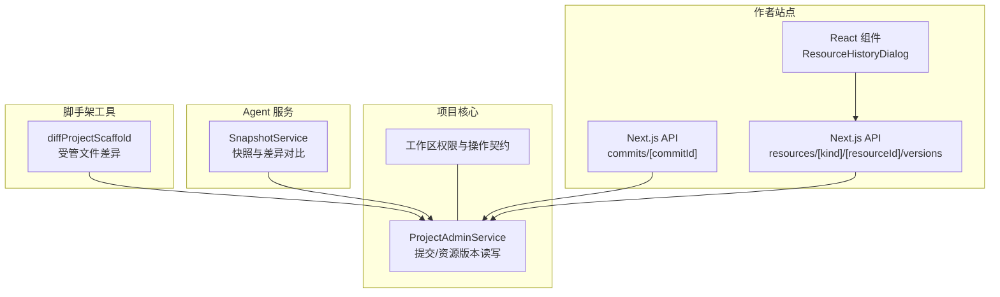
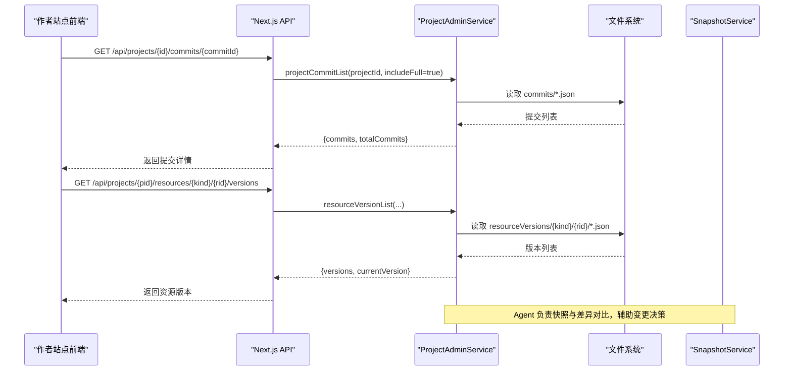
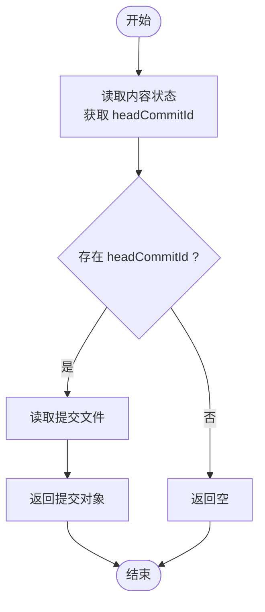
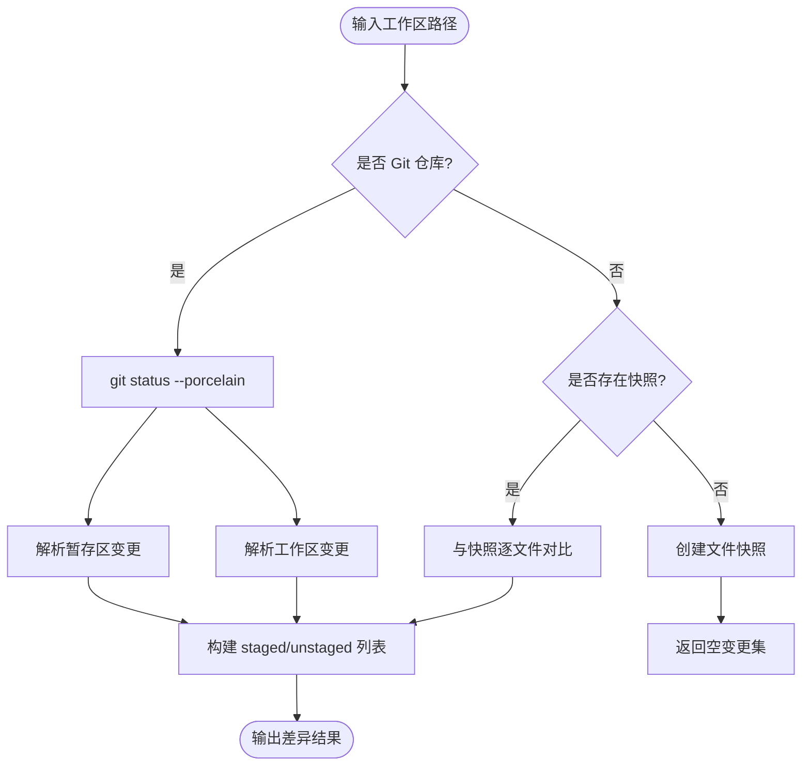
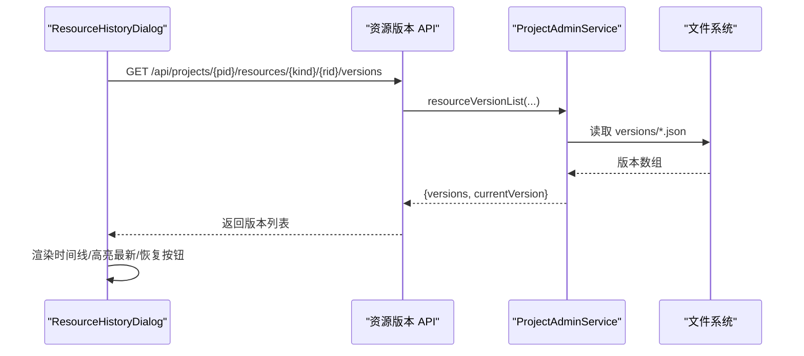
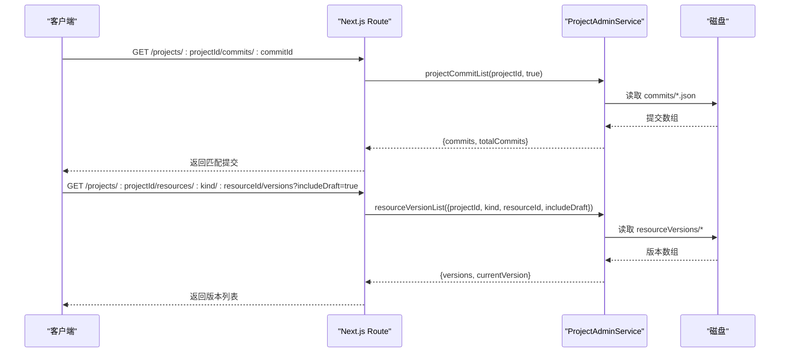
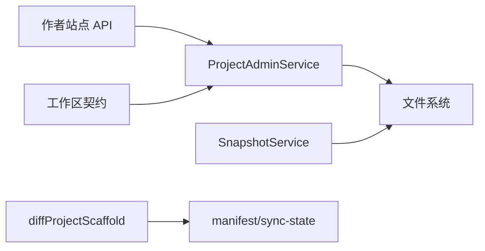

# 版本历史

<cite>
**本文引用的文件**   
- [packages/project-core/src/service.ts](file://packages/project-core/src/service.ts)
- [packages/shared/src/contracts.ts](file://packages/shared/src/contracts.ts)
- [packages/shared/src/workspace.ts](file://packages/shared/src/workspace.ts)
- [packages/project-cli/src/workspace-authority-client.ts](file://packages/project-cli/src/workspace-authority-client.ts)
- [packages/author-site/src/app/api/projects/[projectId]/commits/[commitId]/route.ts](file://packages/author-site/src/app/api/projects/[projectId]/commits/[commitId]/route.ts)
- [packages/author-site/src/app/api/projects/[projectId]/resources/[kind]/[resourceId]/versions/route.ts](file://packages/author-site/src/app/api/projects/[projectId]/resources/[kind]/[resourceId]/versions/route.ts)
- [packages/author-site/src/components/demo/ResourceHistoryDialog.tsx](file://packages/author-site/src/components/demo/ResourceHistoryDialog.tsx)
- [packages/agent-service/src/session/snapshot-service.ts](file://packages/agent-service/src/session/snapshot-service.ts)
- [packages/project-scaffold/src/index.ts](file://packages/project-scaffold/src/index.ts)
</cite>

## 目录
1. [简介](#简介)
2. [项目结构](#项目结构)
3. [核心组件](#核心组件)
4. [架构总览](#架构总览)
5. [详细组件分析](#详细组件分析)
6. [依赖关系分析](#依赖关系分析)
7. [性能考虑](#性能考虑)
8. [故障排查指南](#故障排查指南)
9. [结论](#结论)
10. [附录](#附录)

## 简介
本技术文档围绕“版本历史”能力，系统性阐述提交记录管理、元数据与索引结构、差异对比算法、版本浏览界面实现、回滚安全机制以及查询API设计。内容基于仓库中现有实现进行归纳与可视化说明，帮助读者快速理解并扩展该功能。

## 项目结构
版本历史相关代码主要分布在以下模块：
- 项目核心服务（持久化、提交与资源版本管理）
- 共享合约（工作区变更协议、错误码等）
- 作者站点 API（提供版本列表、详情、资源版本列表等接口）
- 前端组件（资源历史对话框、时间线展示）
- Agent 快照与差异对比（Git 与非 Git 工作区）
- 脚手架差异工具（本地受管文件差异）



图表来源
- [packages/author-site/src/app/api/projects/[projectId]/commits/[commitId]/route.ts:1-42](file://packages/author-site/src/app/api/projects/[projectId]/commits/[commitId]/route.ts#L1-L42)
- [packages/author-site/src/app/api/projects/[projectId]/resources/[kind]/[resourceId]/versions/route.ts:77-110](file://packages/author-site/src/app/api/projects/[projectId]/resources/[kind]/[resourceId]/versions/route.ts#L77-L110)
- [packages/author-site/src/components/demo/ResourceHistoryDialog.tsx:1-167](file://packages/author-site/src/components/demo/ResourceHistoryDialog.tsx#L1-L167)
- [packages/project-core/src/service.ts:4890-5002](file://packages/project-core/src/service.ts#L4890-L5002)
- [packages/shared/src/contracts.ts:1-202](file://packages/shared/src/contracts.ts#L1-L202)
- [packages/agent-service/src/session/snapshot-service.ts:108-183](file://packages/agent-service/src/session/snapshot-service.ts#L108-L183)
- [packages/project-scaffold/src/index.ts:1372-1413](file://packages/project-scaffold/src/index.ts#L1372-L1413)

章节来源
- [packages/project-core/src/service.ts:4890-5002](file://packages/project-core/src/service.ts#L4890-L5002)
- [packages/shared/src/contracts.ts:1-202](file://packages/shared/src/contracts.ts#L1-L202)
- [packages/author-site/src/app/api/projects/[projectId]/commits/[commitId]/route.ts:1-42](file://packages/author-site/src/app/api/projects/[projectId]/commits/[commitId]/route.ts#L1-L42)
- [packages/author-site/src/app/api/projects/[projectId]/resources/[kind]/[resourceId]/versions/route.ts:77-110](file://packages/author-site/src/app/api/projects/[projectId]/resources/[kind]/[resourceId]/versions/route.ts#L77-L110)
- [packages/author-site/src/components/demo/ResourceHistoryDialog.tsx:1-167](file://packages/author-site/src/components/demo/ResourceHistoryDialog.tsx#L1-L167)
- [packages/agent-service/src/session/snapshot-service.ts:108-183](file://packages/agent-service/src/session/snapshot-service.ts#L108-L183)
- [packages/project-scaffold/src/index.ts:1372-1413](file://packages/project-scaffold/src/index.ts#L1372-L1413)

## 核心组件
- 提交与资源版本存储
  - 提交按项目隔离，以 JSON 文件形式落盘，按创建时间倒序排列；支持读取 head commit。
  - 资源版本按 kind/resourceId 维度组织，独立目录存储，支持增量写入与去重哈希。
- 差异对比
  - Agent 侧支持 Git 仓库状态解析与快照对比，输出 staged/unstaged 变更集。
  - 脚手架层对受管文件集合计算新增/更新/删除差异。
- 前端浏览与恢复
  - 资源历史对话框通过 API 拉取版本列表，渲染时间线，并提供恢复按钮。
  - 页面编辑页聚合项目级与页面级版本事件，按日期分组展示。
- 权限与安全
  - 工作区变更遵循统一契约，包含 actor、baseRevision、operations 等字段，确保幂等与冲突检测。
  - 路径白名单/黑名单校验，防止越权访问。

章节来源
- [packages/project-core/src/service.ts:4890-5002](file://packages/project-core/src/service.ts#L4890-L5002)
- [packages/agent-service/src/session/snapshot-service.ts:108-183](file://packages/agent-service/src/session/snapshot-service.ts#L108-L183)
- [packages/project-scaffold/src/index.ts:1372-1413](file://packages/project-scaffold/src/index.ts#L1372-L1413)
- [packages/author-site/src/components/demo/ResourceHistoryDialog.tsx:1-167](file://packages/author-site/src/components/demo/ResourceHistoryDialog.tsx#L1-L167)
- [packages/shared/src/contracts.ts:1-202](file://packages/shared/src/contracts.ts#L1-L202)

## 架构总览
版本历史在系统内的交互流程如下：
- 前端通过 Next.js API 获取提交或资源版本信息。
- API 调用 ProjectAdminService 执行读/写逻辑，落盘到 contentDir 下的 commits 与 resourceVersions 目录。
- Agent 服务负责快照与差异对比，为变更提供前置依据。
- 工作区变更遵循 contracts 定义，保证多端一致性与可追溯性。



图表来源
- [packages/author-site/src/app/api/projects/[projectId]/commits/[commitId]/route.ts:1-42](file://packages/author-site/src/app/api/projects/[projectId]/commits/[commitId]/route.ts#L1-L42)
- [packages/author-site/src/app/api/projects/[projectId]/resources/[kind]/[resourceId]/versions/route.ts:77-110](file://packages/author-site/src/app/api/projects/[projectId]/resources/[kind]/[resourceId]/versions/route.ts#L77-L110)
- [packages/project-core/src/service.ts:4890-5002](file://packages/project-core/src/service.ts#L4890-L5002)
- [packages/agent-service/src/session/snapshot-service.ts:108-183](file://packages/agent-service/src/session/snapshot-service.ts#L108-L183)

## 详细组件分析

### 提交记录管理与元数据存储
- 提交写入与列举
  - 提交对象以 JSON 文件形式持久化，文件名即提交 ID。
  - 列举时扫描 commits 目录，过滤 .json 并按 createdAt 降序排序。
- Head Commit 读取
  - 从内容状态中读取 headCommitId，再加载对应提交。
- 资源版本写入与列举
  - 资源版本按 kind/resourceId 分目录存储，写入后按创建时间倒序返回。
- 内容哈希与 Blob 去重
  - 文本内容使用 SHA-256 生成哈希，作为 blob 引用，避免重复存储。
- 指针合并
  - 将当前与更新的资源指针按 kind:resourceId 键合并，稳定排序。



图表来源
- [packages/project-core/src/service.ts:4981-4986](file://packages/project-core/src/service.ts#L4981-L4986)
- [packages/project-core/src/service.ts:4894-4903](file://packages/project-core/src/service.ts#L4894-L4903)
- [packages/project-core/src/service.ts:4928-4941](file://packages/project-core/src/service.ts#L4928-L4941)
- [packages/project-core/src/service.ts:4943-4963](file://packages/project-core/src/service.ts#L4943-L4963)
- [packages/project-core/src/service.ts:4988-5002](file://packages/project-core/src/service.ts#L4988-L5002)

章节来源
- [packages/project-core/src/service.ts:4890-5002](file://packages/project-core/src/service.ts#L4890-L5002)

### 版本差异对比算法
- Git 仓库模式
  - 通过 git status --porcelain 解析暂存区与工作区变更，映射为 create/modify/delete 操作。
- 非 Git 模式
  - 维护工作区快照，递归遍历文件，比较内容与 mtime，生成 unstaged 变更集。
- 脚手架受管文件差异
  - 基于 manifest 与 sync-state.json，计算 created/updated/deleted 三类差异。



图表来源
- [packages/agent-service/src/session/snapshot-service.ts:108-183](file://packages/agent-service/src/session/snapshot-service.ts#L108-L183)
- [packages/project-scaffold/src/index.ts:1372-1413](file://packages/project-scaffold/src/index.ts#L1372-L1413)

章节来源
- [packages/agent-service/src/session/snapshot-service.ts:108-183](file://packages/agent-service/src/session/snapshot-service.ts#L108-L183)
- [packages/project-scaffold/src/index.ts:1372-1413](file://packages/project-scaffold/src/index.ts#L1372-L1413)

### 版本浏览界面实现
- 资源历史对话框
  - 打开时请求资源版本列表，按时间格式显示，支持恢复操作。
- 页面编辑页时间线
  - 聚合项目级与页面级版本事件，按日期分组，展示标题、时间与操作人，支持恢复。



图表来源
- [packages/author-site/src/components/demo/ResourceHistoryDialog.tsx:1-167](file://packages/author-site/src/components/demo/ResourceHistoryDialog.tsx#L1-L167)
- [packages/author-site/src/app/api/projects/[projectId]/resources/[kind]/[resourceId]/versions/route.ts:77-110](file://packages/author-site/src/app/api/projects/[projectId]/resources/[kind]/[resourceId]/versions/route.ts#L77-L110)
- [packages/project-core/src/service.ts:4928-4941](file://packages/project-core/src/service.ts#L4928-L4941)

章节来源
- [packages/author-site/src/components/demo/ResourceHistoryDialog.tsx:1-167](file://packages/author-site/src/components/demo/ResourceHistoryDialog.tsx#L1-L167)
- [packages/author-site/src/app/api/projects/[projectId]/resources/[kind]/[resourceId]/versions/route.ts:77-110](file://packages/author-site/src/app/api/projects/[projectId]/resources/[kind]/[resourceId]/versions/route.ts#L77-L110)

### 版本回滚安全机制
- 权限验证
  - API 入口校验认证 Cookie 与 Token，未登录返回未授权。
- 工作区变更契约
  - 所有变更需携带 sessionId、baseRevision、actor、reason、operations，服务端校验一致性。
- 冲突检测与幂等
  - operations 支持 expectedHash/expectedAbsent 条件，避免并发覆盖。
- 影响分析与预览确认
  - 通过 WorkspaceProjectionAck 反馈应用状态，必要时提示失败原因。

```mermaid
classDiagram
class WorkspaceMutationRequest {
+string mutationId
+string projectId
+string workspaceId
+number baseRevision
+WorkspaceMutationActor actor
+string reason
+WorkspaceMutationOperation[] operations
}
class WorkspaceMutationReceipt {
+boolean committed
+string mutationId
+number revision
+string rootHash
+{path,action,beforeHash,afterHash}[] resources
+number committedAt
}
class WorkspaceProjectionAck {
+string clientId
+string surface
+string status
+number acknowledgedAt
}
WorkspaceMutationRequest --> WorkspaceMutationReceipt : "产生"
WorkspaceMutationReceipt --> WorkspaceProjectionAck : "触发后续确认"
```

图表来源
- [packages/shared/src/contracts.ts:104-148](file://packages/shared/src/contracts.ts#L104-L148)
- [packages/project-cli/src/workspace-authority-client.ts:59-76](file://packages/project-cli/src/workspace-authority-client.ts#L59-L76)

章节来源
- [packages/author-site/src/app/api/projects/[projectId]/commits/[commitId]/route.ts:1-42](file://packages/author-site/src/app/api/projects/[projectId]/commits/[commitId]/route.ts#L1-L42)
- [packages/shared/src/contracts.ts:104-148](file://packages/shared/src/contracts.ts#L104-L148)
- [packages/project-cli/src/workspace-authority-client.ts:59-76](file://packages/project-cli/src/workspace-authority-client.ts#L59-L76)

### 版本历史的查询 API
- 获取提交详情
  - 路径：GET /api/projects/{projectId}/commits/{commitId}
  - 行为：鉴权后调用项目服务列出提交，定位指定 commitId 返回详情。
- 获取资源版本列表
  - 路径：GET /api/projects/{projectId}/resources/{kind}/{resourceId}/versions
  - 参数：includeDraft（可选）
  - 行为：鉴权后调用项目服务列出资源版本，返回当前版本与历史列表。



图表来源
- [packages/author-site/src/app/api/projects/[projectId]/commits/[commitId]/route.ts:1-42](file://packages/author-site/src/app/api/projects/[projectId]/commits/[commitId]/route.ts#L1-L42)
- [packages/author-site/src/app/api/projects/[projectId]/resources/[kind]/[resourceId]/versions/route.ts:77-110](file://packages/author-site/src/app/api/projects/[projectId]/resources/[kind]/[resourceId]/versions/route.ts#L77-L110)
- [packages/project-core/src/service.ts:4894-4903](file://packages/project-core/src/service.ts#L4894-L4903)
- [packages/project-core/src/service.ts:4928-4941](file://packages/project-core/src/service.ts#L4928-L4941)

章节来源
- [packages/author-site/src/app/api/projects/[projectId]/commits/[commitId]/route.ts:1-42](file://packages/author-site/src/app/api/projects/[projectId]/commits/[commitId]/route.ts#L1-L42)
- [packages/author-site/src/app/api/projects/[projectId]/resources/[kind]/[resourceId]/versions/route.ts:77-110](file://packages/author-site/src/app/api/projects/[projectId]/resources/[kind]/[resourceId]/versions/route.ts#L77-L110)

## 依赖关系分析
- 组件耦合
  - 作者站点 API 强依赖 ProjectAdminService 的提交与资源版本方法。
  - 前端组件仅依赖 API 响应结构，不直接访问底层存储。
- 外部依赖
  - Agent 服务依赖操作系统命令（git）与文件系统。
  - 脚手架工具依赖 manifest 与 sync-state.json。
- 潜在循环依赖
  - 当前未见循环引用，API 层与服务层单向依赖。



图表来源
- [packages/author-site/src/app/api/projects/[projectId]/commits/[commitId]/route.ts:1-42](file://packages/author-site/src/app/api/projects/[projectId]/commits/[commitId]/route.ts#L1-L42)
- [packages/project-core/src/service.ts:4890-5002](file://packages/project-core/src/service.ts#L4890-L5002)
- [packages/agent-service/src/session/snapshot-service.ts:108-183](file://packages/agent-service/src/session/snapshot-service.ts#L108-L183)
- [packages/project-scaffold/src/index.ts:1372-1413](file://packages/project-scaffold/src/index.ts#L1372-L1413)
- [packages/shared/src/contracts.ts:1-202](file://packages/shared/src/contracts.ts#L1-L202)

章节来源
- [packages/author-site/src/app/api/projects/[projectId]/commits/[commitId]/route.ts:1-42](file://packages/author-site/src/app/api/projects/[projectId]/commits/[commitId]/route.ts#L1-L42)
- [packages/project-core/src/service.ts:4890-5002](file://packages/project-core/src/service.ts#L4890-L5002)
- [packages/agent-service/src/session/snapshot-service.ts:108-183](file://packages/agent-service/src/session/snapshot-service.ts#L108-L183)
- [packages/project-scaffold/src/index.ts:1372-1413](file://packages/project-scaffold/src/index.ts#L1372-L1413)
- [packages/shared/src/contracts.ts:1-202](file://packages/shared/src/contracts.ts#L1-L202)

## 性能考虑
- 大目录遍历优化
  - 列举提交与资源版本时使用同步 IO，建议在高并发场景引入分页与缓存。
- 差异对比优化
  - Git 模式下优先使用 git status，减少全量扫描；非 Git 模式可对大型二进制跳过行级 diff。
- 去重与压缩
  - 利用内容哈希去重存储，降低磁盘占用；对历史版本可考虑归档策略。
- 最大版本保留
  - 工作区约定最大版本保留数量，避免无限增长。

章节来源
- [packages/shared/src/workspace.ts:516-525](file://packages/shared/src/workspace.ts#L516-L525)
- [packages/project-core/src/service.ts:4894-4903](file://packages/project-core/src/service.ts#L4894-L4903)
- [packages/project-core/src/service.ts:4928-4941](file://packages/project-core/src/service.ts#L4928-L4941)
- [packages/agent-service/src/session/snapshot-service.ts:108-183](file://packages/agent-service/src/session/snapshot-service.ts#L108-L183)

## 故障排查指南
- 未登录或权限不足
  - 检查认证 Cookie 与 Token 是否正确传递，确认角色具备 creator/admin 权限。
- 资源不存在
  - 核对 kind 与 resourceId 是否合法，确认资源已创建且未被删除。
- 工作区会话过期或不匹配
  - 检查 sessionId 与 baseRevision 是否与服务器一致，必要时刷新会话。
- 差异对比失败
  - 确认 git 可用（Git 模式），或非 Git 模式下快照目录存在且可读。

章节来源
- [packages/author-site/src/app/api/projects/[projectId]/commits/[commitId]/route.ts:1-42](file://packages/author-site/src/app/api/projects/[projectId]/commits/[commitId]/route.ts#L1-L42)
- [packages/author-site/src/app/api/projects/[projectId]/resources/[kind]/[resourceId]/versions/route.ts:77-110](file://packages/author-site/src/app/api/projects/[projectId]/resources/[kind]/[resourceId]/versions/route.ts#L77-L110)
- [packages/agent-service/src/session/snapshot-service.ts:108-183](file://packages/agent-service/src/session/snapshot-service.ts#L108-L183)

## 结论
本项目版本历史能力以文件系统为核心存储，结合工作区变更契约与 Agent 快照对比，提供了稳定的提交与资源版本管理能力。前端通过简洁的 API 与对话框组件实现了时间线浏览与恢复操作。建议在大规模数据场景下引入分页、缓存与归档策略，进一步提升性能与可扩展性。

## 附录
- 关键数据结构参考
  - 工作区变更请求与回执、投影确认等见共享合约。
  - 工作区版本轴与最大版本保留数见工作区类型定义。

章节来源
- [packages/shared/src/contracts.ts:1-202](file://packages/shared/src/contracts.ts#L1-L202)
- [packages/shared/src/workspace.ts:516-525](file://packages/shared/src/workspace.ts#L516-L525)