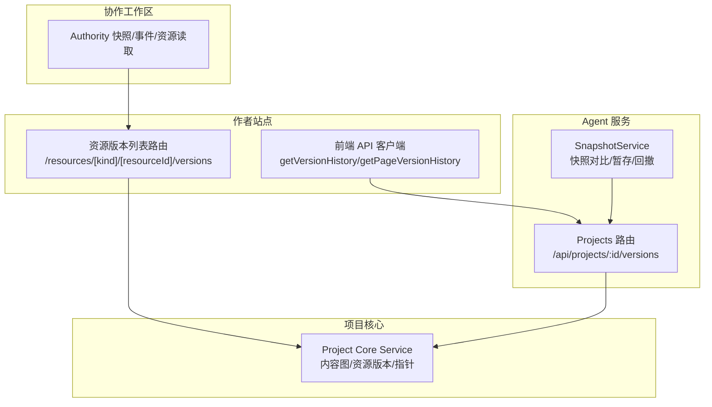
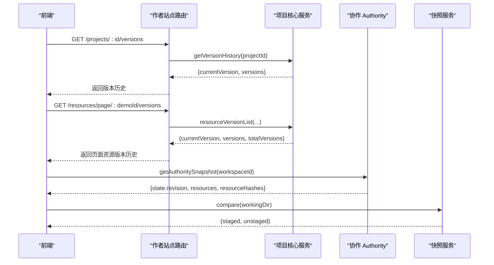
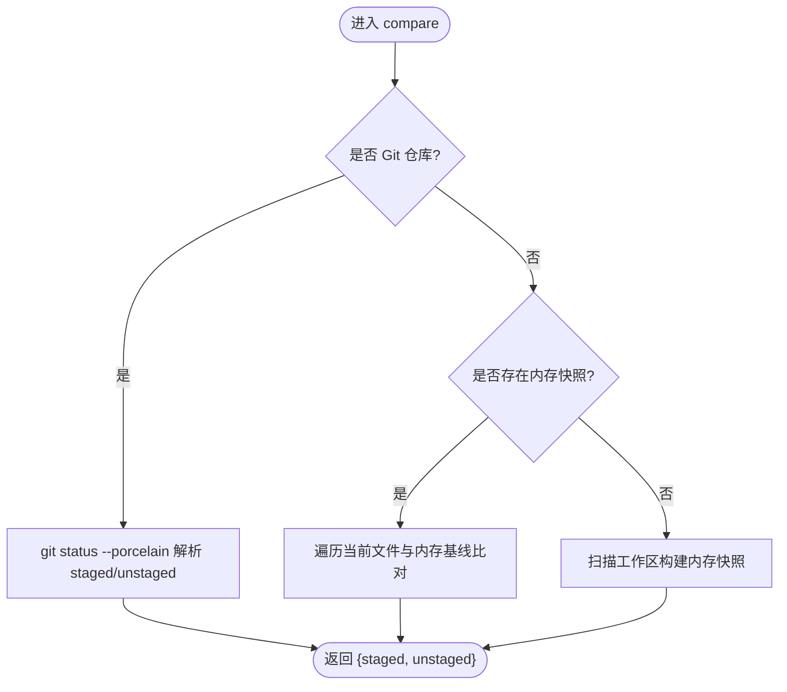
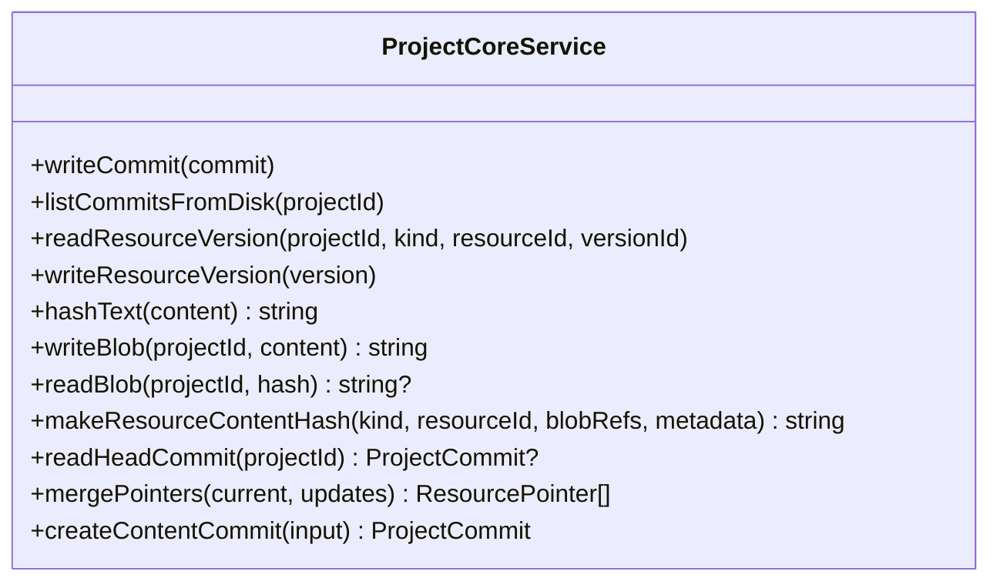
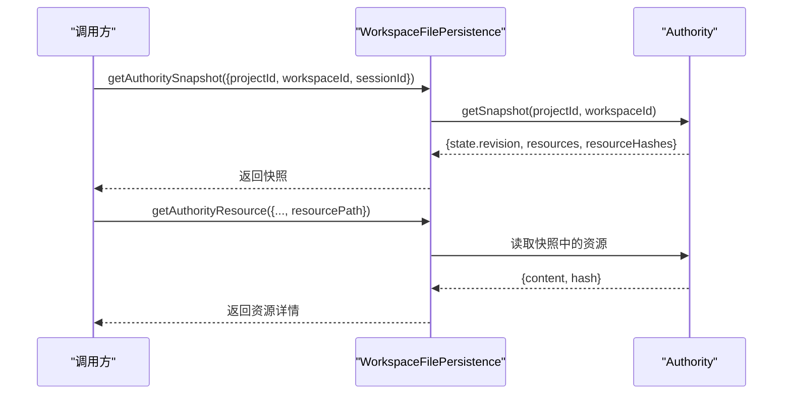
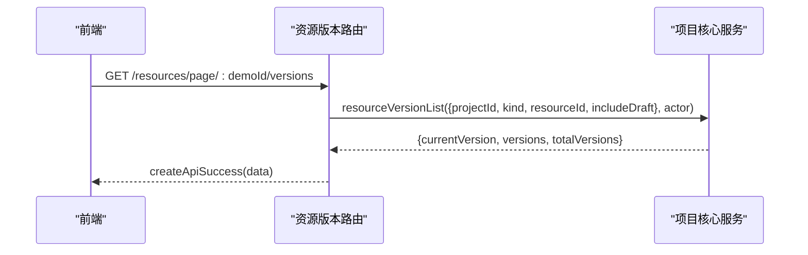
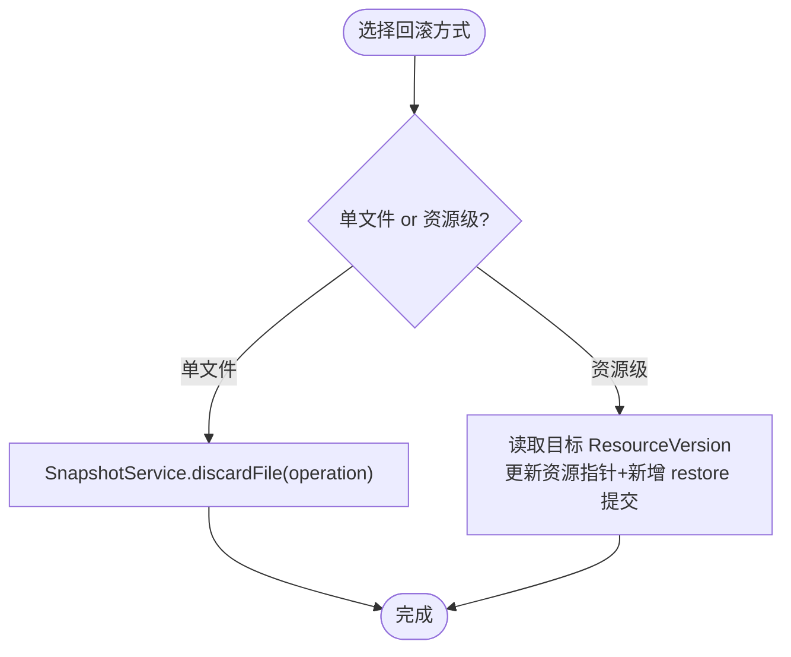
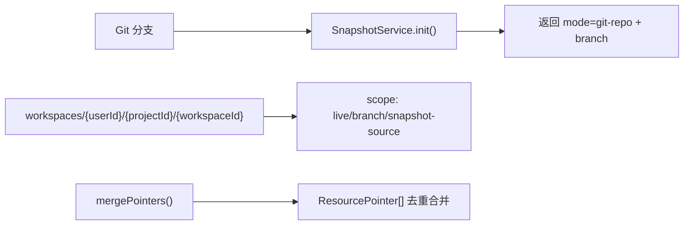
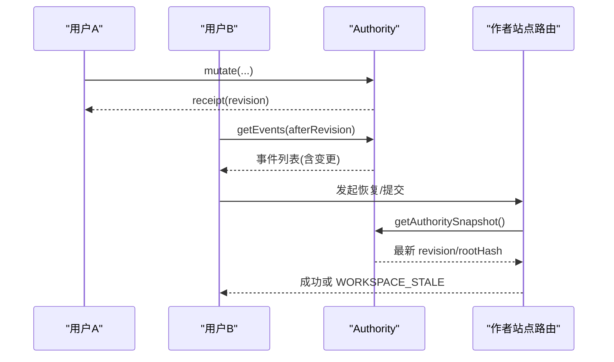
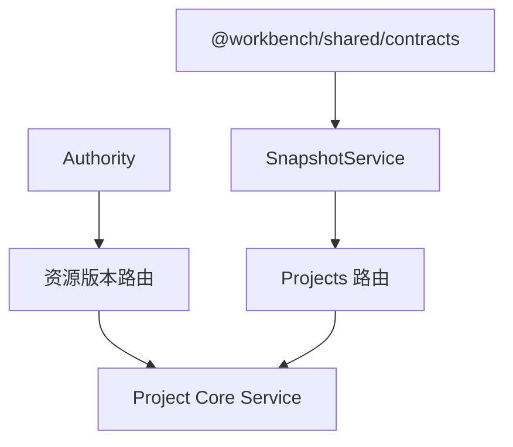

# 项目版本控制

<cite>
**本文引用的文件**   
- [packages/agent-service/src/session/snapshot-service.ts](file://packages/agent-service/src/session/snapshot-service.ts)
- [packages/agent-service/src/routes/projects.ts](file://packages/agent-service/src/routes/projects.ts)
- [packages/agent-service/src/collab/workspace-file-persistence.ts](file://packages/agent-service/src/collab/workspace-file-persistence.ts)
- [packages/project-core/src/service.ts](file://packages/project-core/src/service.ts)
- [packages/author-site/src/lib/project-api.ts](file://packages/author-site/src/lib/project-api.ts)
- [packages/author-site/src/app/api/projects/[projectId]/resources/[kind]/[resourceId]/versions/route.ts](file://packages/author-site/src/app/api/projects/[projectId]/resources/[kind]/[resourceId]/versions/route.ts)
- [docs/项目文档/创作端/03-项目管理/技术/04_版本管理.md](file://docs/项目文档/创作端/03-项目管理/技术/04_版本管理.md)
- [docs/项目文档/创作端/06-基础设施/技术/01_路由设计.md](file://docs/项目文档/创作端/06-基础设施/技术/01_路由设计.md)
- [packages/project-cli/src/cli.test.ts](file://packages/project-cli/src/cli.test.ts)
</cite>

## 目录
1. [简介](#简介)
2. [项目结构](#项目结构)
3. [核心组件](#核心组件)
4. [架构总览](#架构总览)
5. [详细组件分析](#详细组件分析)
6. [依赖关系分析](#依赖关系分析)
7. [性能考量](#性能考量)
8. [故障排除指南](#故障排除指南)
9. [结论](#结论)
10. [附录：API 规范与使用示例](#附录api-规范与使用示例)

## 简介
本文件面向“项目版本控制”能力，系统性阐述快照系统、版本历史、分支与工作区隔离、冲突检测与解决、以及前后端 API 与前端界面实现。内容基于仓库中已落地的代码与设计文档，覆盖从底层存储到上层交互的完整链路，帮助读者理解并正确使用版本控制功能。

## 项目结构
版本控制相关代码分布在多个包与文档中：
- Agent 服务层提供快照对比、暂存/回撤等基础能力，并在路由中暴露版本历史查询接口。
- 项目核心（project-core）负责内容图提交、资源版本持久化、指针合并与物化元数据维护。
- 作者站点（author-site）提供前端 API 客户端、REST 路由与页面级资源历史入口。
- 协作工作区（collab）提供 Authority 快照、事件拉取与资源读取，支撑多用户协同。
- CLI 测试用例验证 diff/submit 流程与本地项目包一致性。
- 设计文档明确版本策略、数据结构、触发条件与清理规则。

图示来源
- [packages/agent-service/src/routes/projects.ts:277-308](file://packages/agent-service/src/routes/projects.ts#L277-L308)
- [packages/agent-service/src/session/snapshot-service.ts:1-342](file://packages/agent-service/src/session/snapshot-service.ts#L1-L342)
- [packages/author-site/src/app/api/projects/[projectId]/resources/[kind]/[resourceId]/versions/route.ts:77-110](file://packages/author-site/src/app/api/projects/[projectId]/resources/[kind]/[resourceId]/versions/route.ts#L77-L110)
- [packages/author-site/src/lib/project-api.ts:103-139](file://packages/author-site/src/lib/project-api.ts#L103-L139)
- [packages/agent-service/src/collab/workspace-file-persistence.ts:202-224](file://packages/agent-service/src/collab/workspace-file-persistence.ts#L202-L224)
- [packages/project-core/src/service.ts:4890-5089](file://packages/project-core/src/service.ts#L4890-L5089)

章节来源
- [docs/项目文档/创作端/03-项目管理/技术/04_版本管理.md:1-174](file://docs/项目文档/创作端/03-项目管理/技术/04_版本管理.md#L1-L174)

## 核心组件
- 快照服务（SnapshotService）
  - 职责：在 Git 仓库与非 Git 目录两种模式下进行差异对比、基线内容获取、暂存/取消暂存、单文件回撤/重置、快照清理。
  - 关键方法：init、compare、getBaselineContent、stageFile/unstageFile、discardFile/resetFile、clearSnapshot。
- 项目核心服务（Project Core Service）
  - 职责：内容图提交、资源版本读写、指针合并、Blob 去重存储、Head Commit 读取、物化状态更新。
  - 关键方法：writeCommit/listCommitsFromDisk/readResourceVersion/writeResourceVersion/makeResourceContentHash/readHeadCommit/mergePointers/createContentCommit。
- 协作工作区 Authority
  - 职责：提供 Authority 快照、按 revision 拉取事件、按路径读取资源内容与哈希，用于协同与幂等校验。
  - 关键方法：getAuthoritySnapshot、getAuthorityResource、getAuthorityEvents。
- 作者站点 API 与客户端
  - 职责：对外暴露资源版本历史查询；为前端提供统一调用封装。
  - 关键方法：GET /resources/[kind]/[resourceId]/versions、project-api.getVersionHistory/getPageVersionHistory。

章节来源
- [packages/agent-service/src/session/snapshot-service.ts:1-342](file://packages/agent-service/src/session/snapshot-service.ts#L1-L342)
- [packages/project-core/src/service.ts:4890-5089](file://packages/project-core/src/service.ts#L4890-L5089)
- [packages/agent-service/src/collab/workspace-file-persistence.ts:202-224](file://packages/agent-service/src/collab/workspace-file-persistence.ts#L202-L224)
- [packages/author-site/src/app/api/projects/[projectId]/resources/[kind]/[resourceId]/versions/route.ts:77-110](file://packages/author-site/src/app/api/projects/[projectId]/resources/[kind]/[resourceId]/versions/route.ts#L77-L110)
- [packages/author-site/src/lib/project-api.ts:103-139](file://packages/author-site/src/lib/project-api.ts#L103-L139)

## 架构总览
版本控制由“会话/工作区 + 内容图 + 快照/发布”三层构成：
- 会话/工作区：实时编辑与协同变更，通过 Authority 提供快照与事件流。
- 内容图：不可变提交链，记录资源指针与变更摘要，作为发布与物化的权威来源。
- 快照/发布：命名版本、自动检查点、发布快照，配合清理策略保障可追溯与空间可控。

图示来源
- [packages/agent-service/src/routes/projects.ts:277-308](file://packages/agent-service/src/routes/projects.ts#L277-L308)
- [packages/author-site/src/app/api/projects/[projectId]/resources/[kind]/[resourceId]/versions/route.ts:77-110](file://packages/author-site/src/app/api/projects/[projectId]/resources/[kind]/[resourceId]/versions/route.ts#L77-L110)
- [packages/agent-service/src/collab/workspace-file-persistence.ts:202-224](file://packages/agent-service/src/collab/workspace-file-persistence.ts#L202-L224)
- [packages/agent-service/src/session/snapshot-service.ts:108-162](file://packages/agent-service/src/session/snapshot-service.ts#L108-L162)

## 详细组件分析

### 快照服务（SnapshotService）
- 模式识别：初始化时判断是否为 Git 仓库，分别走 Git 或内存快照两条路径。
- 差异对比：Git 模式解析 git status --porcelain；非 Git 模式扫描当前文件并与内存基线比对。
- 基线读取：Git 模式通过 git show HEAD:"path"；非 Git 模式从内存 Map 读取。
- 暂存/回撤：Git 模式调用 git add/reset/checkout；非 Git 模式按操作类型恢复或删除文件。
- 生命周期：支持 clearSnapshot 清理内存快照。

图示来源
- [packages/agent-service/src/session/snapshot-service.ts:17-37](file://packages/agent-service/src/session/snapshot-service.ts#L17-L37)
- [packages/agent-service/src/session/snapshot-service.ts:108-162](file://packages/agent-service/src/session/snapshot-service.ts#L108-L162)
- [packages/agent-service/src/session/snapshot-service.ts:176-229](file://packages/agent-service/src/session/snapshot-service.ts#L176-L229)
- [packages/agent-service/src/session/snapshot-service.ts:231-254](file://packages/agent-service/src/session/snapshot-service.ts#L231-L254)
- [packages/agent-service/src/session/snapshot-service.ts:298-333](file://packages/agent-service/src/session/snapshot-service.ts#L298-L333)

章节来源
- [packages/agent-service/src/session/snapshot-service.ts:1-342](file://packages/agent-service/src/session/snapshot-service.ts#L1-L342)

### 项目核心服务（Project Core Service）
- 提交写入与列举：将 ProjectCommit 持久化为 JSON，并按创建时间倒序列出。
- 资源版本读写：按 kind/resourceId/versionId 定位资源版本文件，支持排序与过滤。
- Blob 去重：以内容 SHA256 为键，避免重复存储。
- Head Commit：从 content state 读取 headCommitId 并加载对应提交。
- 指针合并：按 kind:resourceId 键合并资源指针集合，保证唯一性与有序性。
- 内容提交创建：生成新提交，合并指针，更新 content state 的 headCommitId 与物化状态。

图示来源
- [packages/project-core/src/service.ts:4890-5089](file://packages/project-core/src/service.ts#L4890-L5089)

章节来源
- [packages/project-core/src/service.ts:4890-5089](file://packages/project-core/src/service.ts#L4890-L5089)

### 协作工作区 Authority
- Authority 快照：返回 workspace 的 state.revision、资源映射与资源哈希表。
- 资源读取：规范化路径后从快照中读取内容与哈希，失败返回未找到错误。
- 事件拉取：按 afterRevision 增量拉取已提交事件，用于同步与冲突检测。

图示来源
- [packages/agent-service/src/collab/workspace-file-persistence.ts:202-224](file://packages/agent-service/src/collab/workspace-file-persistence.ts#L202-L224)

章节来源
- [packages/agent-service/src/collab/workspace-file-persistence.ts:202-224](file://packages/agent-service/src/collab/workspace-file-persistence.ts#L202-L224)

### 作者站点 API 与客户端
- 资源版本历史：GET /api/projects/:projectId/resources/:kind/:resourceId/versions，鉴权后调用 projectService.resourceVersionList。
- 前端客户端：封装 getVersionHistory 与 getPageVersionHistory，统一错误处理与响应解构。

图示来源
- [packages/author-site/src/app/api/projects/[projectId]/resources/[kind]/[resourceId]/versions/route.ts:77-110](file://packages/author-site/src/app/api/projects/[projectId]/resources/[kind]/[resourceId]/versions/route.ts#L77-L110)
- [packages/author-site/src/lib/project-api.ts:103-139](file://packages/author-site/src/lib/project-api.ts#L103-L139)

章节来源
- [packages/author-site/src/app/api/projects/[projectId]/resources/[kind]/[resourceId]/versions/route.ts:77-110](file://packages/author-site/src/app/api/projects/[projectId]/resources/[kind]/[resourceId]/versions/route.ts#L77-L110)
- [packages/author-site/src/lib/project-api.ts:103-139](file://packages/author-site/src/lib/project-api.ts#L103-L139)

### 版本历史管理与回滚
- 版本历史：项目级 VersionInfo 与资源级 ResourceVersion 双轨并存；内容图提交串联资源指针与变更摘要。
- 回滚机制：
  - 单文件回撤：通过 SnapshotService.discardFile 根据 operation 执行删除或恢复到基线。
  - 资源级恢复：仅更新目标资源的指针，新增语义 restore 提交，不改动无关资源。
- 清理策略：最多保留 50 条，优先淘汰自动保存记录，受保护提交与引用 blob 高优先级保留。

图示来源
- [packages/agent-service/src/session/snapshot-service.ts:298-333](file://packages/agent-service/src/session/snapshot-service.ts#L298-L333)
- [docs/项目文档/创作端/03-项目管理/技术/04_版本管理.md:149-166](file://docs/项目文档/创作端/03-项目管理/技术/04_版本管理.md#L149-L166)

章节来源
- [docs/项目文档/创作端/03-项目管理/技术/04_版本管理.md:51-166](file://docs/项目文档/创作端/03-项目管理/技术/04_版本管理.md#L51-L166)

### 分支管理与工作区隔离
- 分支感知：SnapshotService.init 会探测 Git 分支并返回分支信息，便于 UI 展示与上下文提示。
- 工作区隔离：Author Site 提供 workspaces/{userId}/{projectId}/ 目录结构，支持 live/branch/snapshot-source 等 scope；Session 与 Workspace 解耦，确保并发编辑互不影响。
- 合并策略：资源指针合并采用 key=kind:resourceId 的去重合并，保证同一资源在同一提交中只出现一次。

图示来源
- [packages/agent-service/src/session/snapshot-service.ts:17-37](file://packages/agent-service/src/session/snapshot-service.ts#L17-L37)
- [packages/author-site/src/lib/fs-utils.ts:1713-1762](file://packages/author-site/src/lib/fs-utils.ts#L1713-L1762)
- [packages/project-core/src/service.ts:4988-5002](file://packages/project-core/src/service.ts#L4988-L5002)

章节来源
- [packages/agent-service/src/session/snapshot-service.ts:17-37](file://packages/agent-service/src/session/snapshot-service.ts#L17-L37)
- [packages/author-site/src/lib/fs-utils.ts:1713-1762](file://packages/author-site/src/lib/fs-utils.ts#L1713-L1762)
- [packages/project-core/src/service.ts:4988-5002](file://packages/project-core/src/service.ts#L4988-L5002)

### 冲突检测与多用户协作
- 冲突检测：Authority 提供 revision 与资源哈希，客户端可通过 getAuthorityEvents(afterRevision) 增量拉取事件，结合资源哈希判断是否发生冲突。
- 协作流程：在 live Workspace 下，恢复或变更先提交 Authority mutation，再按需推进 baseVersion；若检测到 stale canonical proof，需重新 flush 与同步后再继续。
- 权限校验：所有 Authority 访问均经过 validateWorkspaceSession，非法请求直接拒绝。

图示来源
- [packages/agent-service/src/collab/workspace-file-persistence.ts:202-224](file://packages/agent-service/src/collab/workspace-file-persistence.ts#L202-L224)
- [docs/项目文档/创作端/03-项目管理/技术/04_版本管理.md:129-146](file://docs/项目文档/创作端/03-项目管理/技术/04_版本管理.md#L129-L146)

章节来源
- [packages/agent-service/src/collab/workspace-file-persistence.ts:202-224](file://packages/agent-service/src/collab/workspace-file-persistence.ts#L202-L224)
- [docs/项目文档/创作端/03-项目管理/技术/04_版本管理.md:129-146](file://docs/项目文档/创作端/03-项目管理/技术/04_版本管理.md#L129-L146)

## 依赖关系分析
- Agent 服务依赖共享契约类型（SnapshotInfo/CompareResult/FileChangeInfo），并通过 execSync 调用 Git 命令。
- 作者站点路由依赖项目核心服务进行资源版本查询与提交。
- 协作 Authority 被作者站点与 CLI 共同消费，提供一致的 snapshot/event/resource 能力。
- 项目核心服务内部强耦合于文件系统与 JSON 序列化，提供稳定的业务接口。

图示来源
- [packages/agent-service/src/session/snapshot-service.ts:1-6](file://packages/agent-service/src/session/snapshot-service.ts#L1-L6)
- [packages/agent-service/src/routes/projects.ts:277-308](file://packages/agent-service/src/routes/projects.ts#L277-L308)
- [packages/author-site/src/app/api/projects/[projectId]/resources/[kind]/[resourceId]/versions/route.ts:77-110](file://packages/author-site/src/app/api/projects/[projectId]/resources/[kind]/[resourceId]/versions/route.ts#L77-L110)
- [packages/project-core/src/service.ts:4890-5089](file://packages/project-core/src/service.ts#L4890-L5089)

章节来源
- [packages/agent-service/src/session/snapshot-service.ts:1-6](file://packages/agent-service/src/session/snapshot-service.ts#L1-L6)
- [packages/agent-service/src/routes/projects.ts:277-308](file://packages/agent-service/src/routes/projects.ts#L277-L308)
- [packages/author-site/src/app/api/projects/[projectId]/resources/[kind]/[resourceId]/versions/route.ts:77-110](file://packages/author-site/src/app/api/projects/[projectId]/resources/[kind]/[resourceId]/versions/route.ts#L77-L110)
- [packages/project-core/src/service.ts:4890-5089](file://packages/project-core/src/service.ts#L4890-L5089)

## 性能考量
- 快照对比：Git 模式通过 porcelain 输出一次性解析，避免多次子进程调用；非 Git 模式采用递归扫描与内存 Map 比对，注意大仓库 I/O 开销。
- 资源版本：Blob 去重减少磁盘占用；指针合并使用 Map 去重，时间复杂度 O(n)。
- 协作事件：增量拉取 events 降低带宽与 CPU 消耗；revision 与 rootHash 校验避免无效同步。
- 清理策略：限制历史数量，优先淘汰自动保存记录，减少磁盘压力与检索成本。

## 故障排除指南
- 无法获取版本历史
  - 现象：返回 PROJECT_NOT_FOUND 或 FILE_READ_ERROR。
  - 排查：确认项目存在且可读；检查后端日志与权限。
  - 参考：路由中对异常的统一处理与错误码返回。
- 资源版本为空
  - 现象：页面资源版本列表无数据。
  - 排查：确认 includeDraft 参数；检查资源版本是否已写入；核对鉴权用户角色。
- 协作冲突
  - 现象：WORKSPACE_STALE 或 WORKSPACE_RESOURCE_NOT_FOUND。
  - 排查：拉取最新 events；刷新 Authority snapshot；重试操作。
- 回撤失败
  - 现象：discardFile 抛出异常。
  - 排查：确认 operation 与文件状态一致；Git 模式下检查 HEAD 是否存在该文件；非 Git 模式检查内存快照是否包含基线。

章节来源
- [packages/agent-service/src/routes/projects.ts:277-308](file://packages/agent-service/src/routes/projects.ts#L277-L308)
- [packages/author-site/src/app/api/projects/[projectId]/resources/[kind]/[resourceId]/versions/route.ts:77-110](file://packages/author-site/src/app/api/projects/[projectId]/resources/[kind]/[resourceId]/versions/route.ts#L77-L110)
- [packages/agent-service/src/collab/workspace-file-persistence.ts:202-224](file://packages/agent-service/src/collab/workspace-file-persistence.ts#L202-L224)
- [packages/agent-service/src/session/snapshot-service.ts:298-333](file://packages/agent-service/src/session/snapshot-service.ts#L298-L333)

## 结论
本项目版本控制在“会话/工作区 + 内容图 + 快照/发布”的分层架构下，实现了稳定可靠的快照、历史、回滚与协作能力。通过 Authority 提供的 revision 与事件流，有效支撑多用户协作与冲突检测；通过内容图与资源版本，保证了发布与物化的可追溯性。建议在生产环境关注大仓库快照对比的性能与清理策略的执行效果，并结合审计日志持续优化体验。

## 附录：API 规范与使用示例

### 版本历史 API
- 获取项目版本历史
  - 方法：GET
  - 路径：/api/projects/:id/versions
  - 说明：返回 currentVersion 与 versions 列表。
  - 参考：路由注册与错误处理。
- 获取页面资源版本历史
  - 方法：GET
  - 路径：/api/projects/:projectId/resources/page/:demoId/versions
  - 说明：返回 currentVersion、versions 与 totalVersions。
  - 参考：资源版本路由与前端客户端封装。

章节来源
- [docs/项目文档/创作端/06-基础设施/技术/01_路由设计.md:374-392](file://docs/项目文档/创作端/06-基础设施/技术/01_路由设计.md#L374-L392)
- [packages/agent-service/src/routes/projects.ts:277-308](file://packages/agent-service/src/routes/projects.ts#L277-L308)
- [packages/author-site/src/app/api/projects/[projectId]/resources/[kind]/[resourceId]/versions/route.ts:77-110](file://packages/author-site/src/app/api/projects/[projectId]/resources/[kind]/[resourceId]/versions/route.ts#L77-L110)
- [packages/author-site/src/lib/project-api.ts:103-139](file://packages/author-site/src/lib/project-api.ts#L103-L139)

### 使用示例
- 前端获取版本历史
  - 调用 project-api.getVersionHistory(projectId)，处理 success/data 字段。
- 前端获取页面资源版本
  - 调用 project-api.getPageVersionHistory(projectId, demoId)，渲染版本卡片与恢复按钮。
- CLI 验证 diff/submit
  - 运行 cli.test.ts 中的 diff/submit 流程，确认本地项目包与远程一致。

章节来源
- [packages/author-site/src/lib/project-api.ts:103-139](file://packages/author-site/src/lib/project-api.ts#L103-L139)
- [packages/project-cli/src/cli.test.ts:155-176](file://packages/project-cli/src/cli.test.ts#L155-L176)