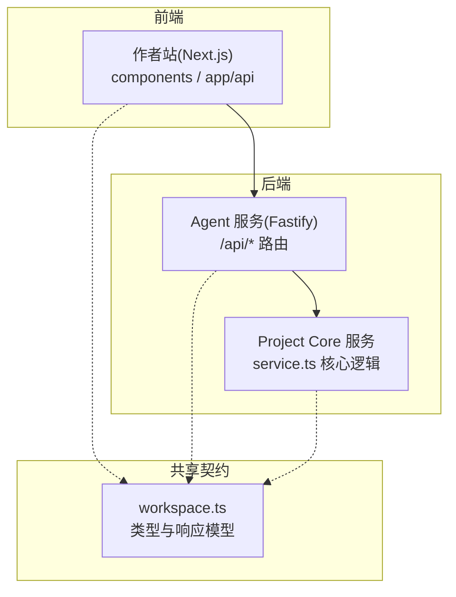
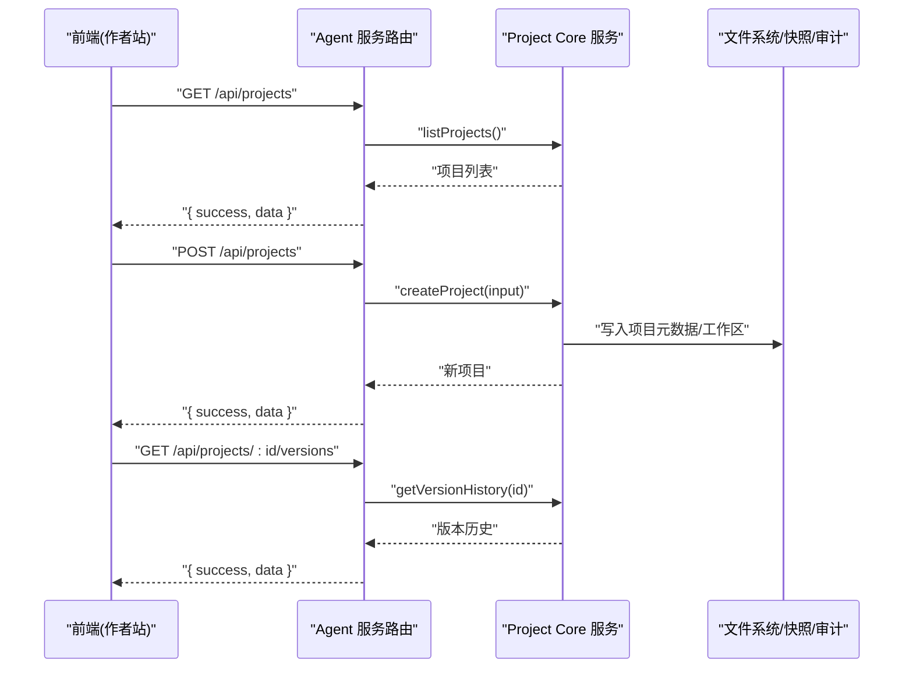
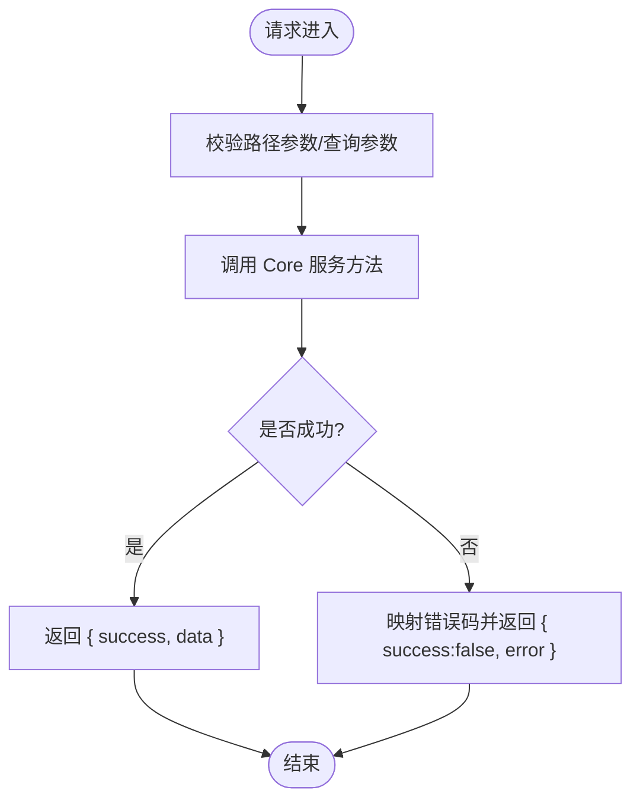
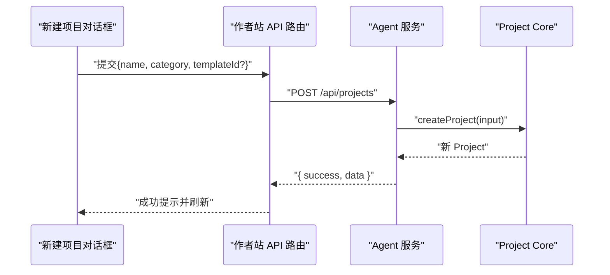
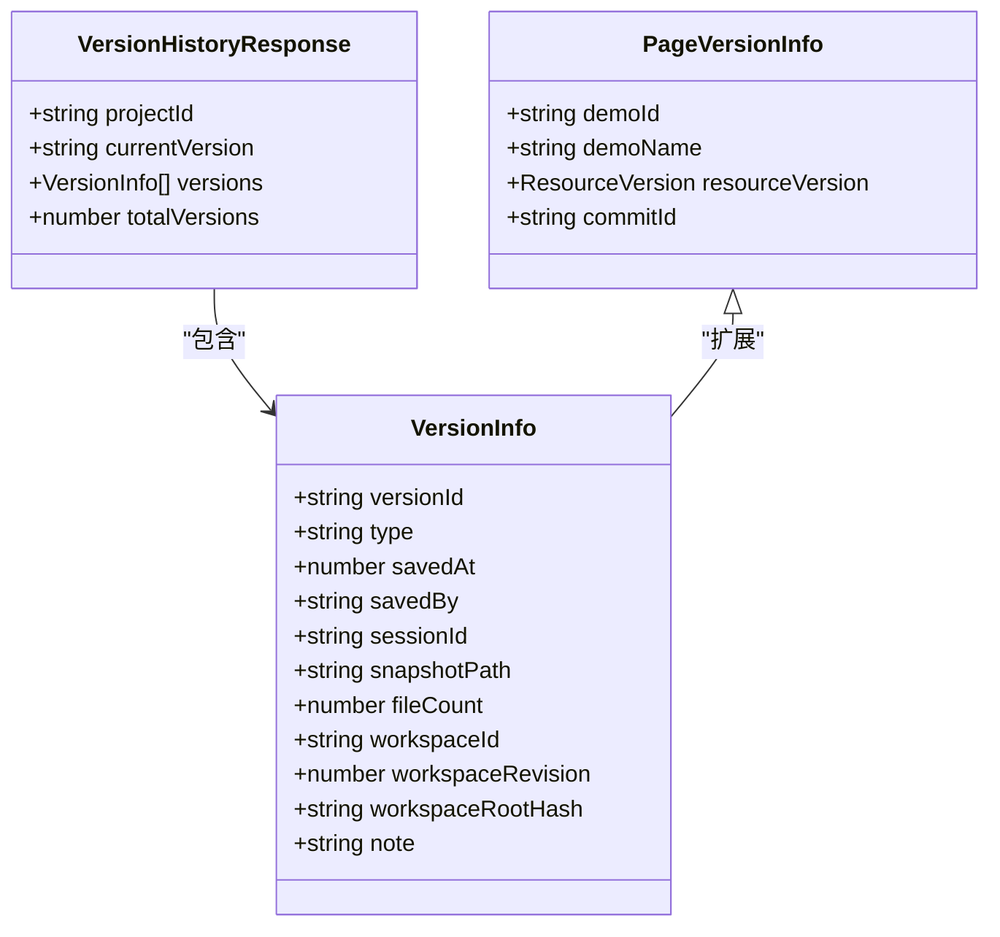
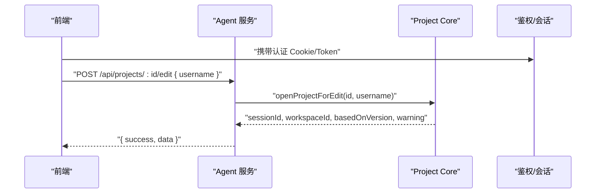
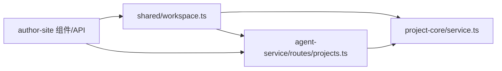

# 项目管理界面

<cite>
**本文引用的文件**
- [packages/shared/src/workspace.ts](file://packages/shared/src/workspace.ts)
- [packages/agent-service/src/routes/projects.ts](file://packages/agent-service/src/routes/projects.ts)
- [packages/project-core/src/service.ts](file://packages/project-core/src/service.ts)
- [docs/项目文档/创作端/03-项目管理/技术/11_实时保存与协同编辑.md](file://docs/项目文档/创作端/03-项目管理/技术/11_实时保存与协同编辑.md)
- [packages/author-site/src/components/demo/create-demo-dialog.tsx](file://packages/author-site/src/components/demo/create-demo-dialog.tsx)
- [packages/author-site/src/components/demo/project-name-category-dialog.tsx](file://packages/author-site/src/components/demo/project-name-category-dialog.tsx)
- [packages/author-site/src/app/api/demos/[id]/route.ts](file://packages/author-site/src/app/api/demos/[id]/route.ts)
- [docs/项目文档/创作端/06-基础设施/技术/01_路由设计.md](file://docs/项目文档/创作端/06-基础设施/技术/01_路由设计.md)
</cite>

## 目录
1. [简介](#简介)
2. [项目结构](#项目结构)
3. [核心组件](#核心组件)
4. [架构总览](#架构总览)
5. [详细组件分析](#详细组件分析)
6. [依赖关系分析](#依赖关系分析)
7. [性能考虑](#性能考虑)
8. [故障排查指南](#故障排查指南)
9. [结论](#结论)
10. [附录：API 接口说明与前端使用示例](#附录api-接口说明与前端使用示例)

## 简介
本文件面向“项目管理界面”的功能实现，覆盖以下能力：
- 项目列表展示、创建与编辑
- 项目元数据管理（名称、描述、配置等）的存储与更新机制
- 版本控制（快照创建、版本切换、历史查看）
- 协作功能（多用户权限控制、冲突解决策略）
- 导入导出（模板与批量操作）
- API 接口说明与前端组件使用示例

## 项目结构
本项目采用前后端分离与多包组织方式：
- 共享契约层：定义项目、版本、会话、页面等数据结构
- 后端服务层：提供 HTTP 路由与业务编排
- 核心服务层：负责项目生命周期、工作区与版本、资源与提交等核心逻辑
- 前端站点：Next.js 应用，包含页面、对话框、API 代理与交互组件

图表来源
- [packages/agent-service/src/routes/projects.ts:1-309](file://packages/agent-service/src/routes/projects.ts#L1-L309)
- [packages/project-core/src/service.ts:1-200](file://packages/project-core/src/service.ts#L1-L200)
- [packages/shared/src/workspace.ts:1-526](file://packages/shared/src/workspace.ts#L1-L526)

章节来源
- [packages/shared/src/workspace.ts:1-526](file://packages/shared/src/workspace.ts#L1-L526)
- [packages/agent-service/src/routes/projects.ts:1-309](file://packages/agent-service/src/routes/projects.ts#L1-L309)
- [packages/project-core/src/service.ts:1-200](file://packages/project-core/src/service.ts#L1-L200)

## 核心组件
- 共享契约与数据模型
  - 项目、版本、会话、页面、文件夹、资源指针、提交等统一类型定义
  - 列表/详情/版本历史等标准响应结构
- Agent 服务路由
  - 暴露项目 CRUD、编辑会话、版本历史等 REST 接口
- Project Core 服务
  - 实现项目访问控制、内容状态、提交与发布、模板与导入导出、预览删除等核心流程

章节来源
- [packages/shared/src/workspace.ts:258-526](file://packages/shared/src/workspace.ts#L258-L526)
- [packages/agent-service/src/routes/projects.ts:17-309](file://packages/agent-service/src/routes/projects.ts#L17-L309)
- [packages/project-core/src/service.ts:1945-1986](file://packages/project-core/src/service.ts#L1945-L1986)

## 架构总览
从前端到后端的调用链路如下：
- 前端通过 Next.js API 路由或直接调用 Agent 服务
- Agent 服务进行参数校验与错误封装，委托 Project Core 执行
- Project Core 负责权限检查、工作区与版本、资源与提交、审计日志等

图表来源
- [packages/agent-service/src/routes/projects.ts:19-34](file://packages/agent-service/src/routes/projects.ts#L19-L34)
- [packages/agent-service/src/routes/projects.ts:36-63](file://packages/agent-service/src/routes/projects.ts#L36-L63)
- [packages/agent-service/src/routes/projects.ts:277-305](file://packages/agent-service/src/routes/projects.ts#L277-L305)

## 详细组件分析

### 项目列表与详情
- 列表接口
  - GET /api/projects：返回分页或全量项目摘要，包含名称、分类、描述、缩略图、当前版本、最后保存时间/人、文件数、演示页数量等
- 详情接口
  - GET /api/projects/:id：返回完整项目对象、当前版本与文件计数
- 删除接口
  - DELETE /api/projects/:id：管理员确认计划后执行删除，清理项目目录与会话/快照关联

图表来源
- [packages/agent-service/src/routes/projects.ts:19-34](file://packages/agent-service/src/routes/projects.ts#L19-L34)
- [packages/agent-service/src/routes/projects.ts:65-91](file://packages/agent-service/src/routes/projects.ts#L65-L91)
- [packages/agent-service/src/routes/projects.ts:93-109](file://packages/agent-service/src/routes/projects.ts#L93-L109)

章节来源
- [packages/shared/src/workspace.ts:487-513](file://packages/shared/src/workspace.ts#L487-L513)
- [packages/agent-service/src/routes/projects.ts:19-109](file://packages/agent-service/src/routes/projects.ts#L19-L109)

### 项目创建与编辑
- 创建项目
  - POST /api/projects：支持可选模板 ID；前端对话框收集项目名称与分类，提交后刷新列表与模板视图
- 编辑项目元信息
  - 前端提供“项目名称/分类”对话框，提交后调用更新接口；作者站 Next.js API 路由会转发至 Project Core 执行更新
- 删除项目
  - 先创建删除预览计划，再二次确认执行删除

图表来源
- [packages/agent-service/src/routes/projects.ts:36-63](file://packages/agent-service/src/routes/projects.ts#L36-L63)
- [packages/author-site/src/components/demo/create-demo-dialog.tsx:311-346](file://packages/author-site/src/components/demo/create-demo-dialog.tsx#L311-L346)
- [packages/author-site/src/components/demo/project-name-category-dialog.tsx:256-301](file://packages/author-site/src/components/demo/project-name-category-dialog.tsx#L256-L301)
- [packages/author-site/src/app/api/demos/[id]/route.ts:69-109](file://packages/author-site/src/app/api/demos/[id]/route.ts#L69-L109)

章节来源
- [packages/agent-service/src/routes/projects.ts:36-63](file://packages/agent-service/src/routes/projects.ts#L36-L63)
- [packages/author-site/src/components/demo/create-demo-dialog.tsx:311-346](file://packages/author-site/src/components/demo/create-demo-dialog.tsx#L311-L346)
- [packages/author-site/src/components/demo/project-name-category-dialog.tsx:256-301](file://packages/author-site/src/components/demo/project-name-category-dialog.tsx#L256-L301)
- [packages/author-site/src/app/api/demos/[id]/route.ts:69-109](file://packages/author-site/src/app/api/demos/[id]/route.ts#L69-L109)

### 项目元数据管理
- 字段范围
  - 名称、分类、描述、缩略图、已发布版本、发布时间戳、创作偏好等
- 存储与更新
  - 列表/详情接口聚合元数据；更新由 Core 服务完成，并在需要时触发预览重建或删除
- 项目级配置
  - 存在性由工作区中配置文件判定，不持久化标记字段；提供读取与更新接口

章节来源
- [packages/shared/src/workspace.ts:258-283](file://packages/shared/src/workspace.ts#L258-L283)
- [packages/shared/src/workspace.ts:373-383](file://packages/shared/src/workspace.ts#L373-L383)
- [packages/author-site/src/app/api/demos/[id]/route.ts:69-109](file://packages/author-site/src/app/api/demos/[id]/route.ts#L69-L109)

### 版本控制（快照、切换、历史）
- 版本历史
  - GET /api/projects/:id/versions：返回当前版本与倒序版本列表
- 版本条目
  - 包含版本号、类型（自动检查点/命名版本/发布快照/恢复快照）、时间、保存者、关联会话、快照路径、文件数、工作区信息等
- 页面级版本
  - 支持页面维度版本历史与恢复，返回代码与 Schema 内容

图表来源
- [packages/shared/src/workspace.ts:41-76](file://packages/shared/src/workspace.ts#L41-L76)
- [packages/shared/src/workspace.ts:449-462](file://packages/shared/src/workspace.ts#L449-L462)

章节来源
- [packages/agent-service/src/routes/projects.ts:277-305](file://packages/agent-service/src/routes/projects.ts#L277-L305)
- [packages/shared/src/workspace.ts:41-76](file://packages/shared/src/workspace.ts#L41-L76)
- [packages/shared/src/workspace.ts:449-462](file://packages/shared/src/workspace.ts#L449-L462)

### 协作与权限控制
- 打开编辑会话
  - POST /api/projects/:id/edit：基于用户名打开编辑会话，返回会话 ID、工作空间信息与警告（如多人编辑）
- 会话文件同步
  - 获取/更新会话文件、保存/放弃编辑
- 权限与锁定
  - 未登录/过期返回未授权；只读角色禁止写操作；管理员可解锁/删除；Live Workspace 下拒绝非 Authority 的直接写入

图表来源
- [packages/agent-service/src/routes/projects.ts:113-151](file://packages/agent-service/src/routes/projects.ts#L113-L151)
- [docs/项目文档/创作端/06-基础设施/技术/01_路由设计.md:270-371](file://docs/项目文档/创作端/06-基础设施/技术/01_路由设计.md#L270-L371)

章节来源
- [packages/agent-service/src/routes/projects.ts:113-151](file://packages/agent-service/src/routes/projects.ts#L113-L151)
- [docs/项目文档/创作端/06-基础设施/技术/01_路由设计.md:270-371](file://docs/项目文档/创作端/06-基础设施/技术/01_路由设计.md#L270-L371)
- [docs/项目文档/创作端/03-项目管理/技术/11_实时保存与协同编辑.md:110-111](file://docs/项目文档/创作端/03-项目管理/技术/11_实时保存与协同编辑.md#L110-L111)

### 冲突解决策略
- Live Workspace 单写者收敛
  - 在 live 工作区下，所有变更通过 Authority 提交，避免 CLI/共享层直接写入导致冲突
- 事务与撤销
  - 页面新增/复制/删除/恢复均合并为一次 Authority mutation；删除后清理已消费快照
- 运行时切换
  - 将目标运行时文件与可选 Schema 放入同一 mutation，保证一致性

章节来源
- [docs/项目文档/创作端/03-项目管理/技术/11_实时保存与协同编辑.md:110-111](file://docs/项目文档/创作端/03-项目管理/技术/11_实时保存与协同编辑.md#L110-L111)

### 导入导出与模板
- 模板列表与详情
  - 支持按作用域与官方标识过滤，排序优先官方与更新时间
- 从项目创建模板
  - 以项目快照形式生成模板，供后续复用
- 将模板转为项目
  - 前端点击转换后调用后端接口，成功后刷新列表与模板视图
- 批量操作
  - 列表接口返回汇总信息，便于批量选择与处理

章节来源
- [tmp/pdfs/import-challenge-prototype.mjs:816-849](file://tmp/pdfs/import-challenge-prototype.mjs#L816-L849)
- [tmp/pdfs/fix-challenge-prototype-inline-images.mjs:821-853](file://tmp/pdfs/fix-challenge-prototype-inline-images.mjs#L821-L853)
- [packages/author-site/src/components/demo/home-page.tsx:587-604](file://packages/author-site/src/components/demo/home-page.tsx#L587-L604)

## 依赖关系分析
- 耦合与内聚
  - Agent 服务仅做路由与错误封装，核心逻辑集中在 Project Core，职责清晰
  - 共享契约被前后端共同引用，降低接口不一致风险
- 外部依赖
  - 文件系统、快照目录、审计日志、预览服务等
- 潜在循环依赖
  - 未见明显循环；各层单向依赖

图表来源
- [packages/shared/src/workspace.ts:1-526](file://packages/shared/src/workspace.ts#L1-L526)
- [packages/agent-service/src/routes/projects.ts:1-309](file://packages/agent-service/src/routes/projects.ts#L1-L309)
- [packages/project-core/src/service.ts:1-200](file://packages/project-core/src/service.ts#L1-L200)

章节来源
- [packages/shared/src/workspace.ts:1-526](file://packages/shared/src/workspace.ts#L1-L526)
- [packages/agent-service/src/routes/projects.ts:1-309](file://packages/agent-service/src/routes/projects.ts#L1-L309)
- [packages/project-core/src/service.ts:1-200](file://packages/project-core/src/service.ts#L1-L200)

## 性能考虑
- 列表与详情
  - 列表仅返回必要摘要字段，减少传输体积
- 版本历史
  - 限制最大保留版本数量，避免历史膨胀
- 并发与锁
  - Live Workspace 通过 Authority 收敛写入，避免重复物化与竞争条件
- 缓存与预热
  - 预览产物与服务健康检查可配合缓存与预热策略提升首屏体验

[本节为通用建议，无需特定文件来源]

## 故障排查指南
- 常见错误码
  - PROJECT_NOT_FOUND：项目不存在
  - SESSION_NOT_FOUND：会话不存在
  - SESSION_NOT_EDITING：会话不在编辑状态
  - FILE_READ_ERROR/FILE_WRITE_ERROR：读写失败
  - UNAUTHORIZED：未登录或 Token 过期
- 定位步骤
  - 检查路由参数与查询参数是否齐全
  - 核对权限与角色（只读/管理员）
  - 查看 Agent 服务日志与 Core 服务审计记录
  - 确认 Live Workspace 下的 Authority 提交是否成功

章节来源
- [packages/agent-service/src/routes/projects.ts:20-34](file://packages/agent-service/src/routes/projects.ts#L20-L34)
- [packages/agent-service/src/routes/projects.ts:153-191](file://packages/agent-service/src/routes/projects.ts#L153-L191)
- [packages/agent-service/src/routes/projects.ts:237-275](file://packages/agent-service/src/routes/projects.ts#L237-L275)

## 结论
本项目在“项目管理界面”上实现了从列表、创建、编辑到版本与协作的完整闭环。通过共享契约、清晰的层次划分与 Authority 驱动的协同机制，既保证了数据一致性与安全性，也为后续扩展提供了良好基础。

[本节为总结，无需特定文件来源]

## 附录：API 接口说明与前端使用示例

### 项目相关 API
- 获取项目列表
  - 方法：GET
  - 路径：/api/projects
  - 响应：{ success, data: ProjectListResponse }
- 创建项目
  - 方法：POST
  - 路径：/api/projects
  - 请求体：CreateProjectRequest
  - 响应：{ success, data: Project }
- 获取项目详情
  - 方法：GET
  - 路径：/api/projects/:id
  - 响应：{ success, data: ProjectDetailResponse }
- 删除项目
  - 方法：DELETE
  - 路径：/api/projects/:id
  - 响应：{ success, message }

章节来源
- [packages/agent-service/src/routes/projects.ts:19-109](file://packages/agent-service/src/routes/projects.ts#L19-L109)
- [packages/shared/src/workspace.ts:487-513](file://packages/shared/src/workspace.ts#L487-L513)

### 编辑会话 API
- 打开项目编辑
  - 方法：POST
  - 路径：/api/projects/:id/edit
  - 请求体：OpenProjectEditRequest
  - 响应：{ success, data: OpenProjectEditResponse }
- 获取会话信息
  - 方法：GET
  - 路径：/api/sessions/:sessionId
  - 查询：projectId
  - 响应：{ success, data: EditSession }
- 保存项目变更
  - 方法：POST
  - 路径：/api/sessions/:sessionId/save
  - 查询：projectId
  - 请求体：SaveProjectChangesRequest
  - 响应：{ success, data: SaveProjectChangesResponse }
- 放弃编辑
  - 方法：POST
  - 路径：/api/sessions/:sessionId/discard
  - 查询：projectId
  - 响应：{ success, message }

章节来源
- [packages/agent-service/src/routes/projects.ts:113-275](file://packages/agent-service/src/routes/projects.ts#L113-L275)
- [docs/项目文档/创作端/06-基础设施/技术/01_路由设计.md:270-371](file://docs/项目文档/创作端/06-基础设施/技术/01_路由设计.md#L270-L371)

### 版本管理 API
- 获取版本历史
  - 方法：GET
  - 路径：/api/projects/:id/versions
  - 响应：{ success, data: VersionHistoryResponse }

章节来源
- [packages/agent-service/src/routes/projects.ts:277-305](file://packages/agent-service/src/routes/projects.ts#L277-L305)
- [packages/shared/src/workspace.ts:449-462](file://packages/shared/src/workspace.ts#L449-L462)

### 前端组件使用示例
- 新建项目对话框
  - 组件：create-demo-dialog.tsx
  - 行为：收集项目名称与模板选择，调用创建接口，成功后关闭并重置
- 项目名称/分类编辑对话框
  - 组件：project-name-category-dialog.tsx
  - 行为：编辑名称与分类，提交后调用更新接口
- 作者站 API 路由
  - 路径：src/app/api/demos/[id]/route.ts
  - 行为：转发更新/删除等操作至 Project Core

章节来源
- [packages/author-site/src/components/demo/create-demo-dialog.tsx:311-346](file://packages/author-site/src/components/demo/create-demo-dialog.tsx#L311-L346)
- [packages/author-site/src/components/demo/project-name-category-dialog.tsx:256-301](file://packages/author-site/src/components/demo/project-name-category-dialog.tsx#L256-L301)
- [packages/author-site/src/app/api/demos/[id]/route.ts:69-109](file://packages/author-site/src/app/api/demos/[id]/route.ts#L69-L109)