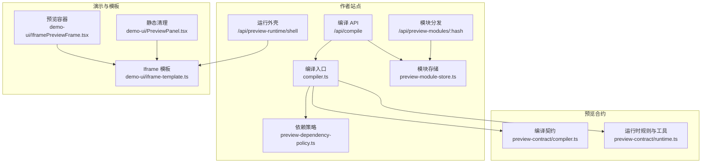
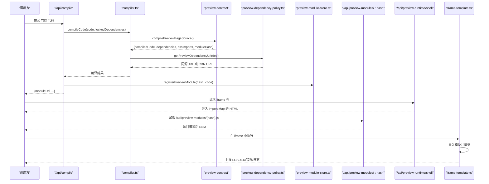
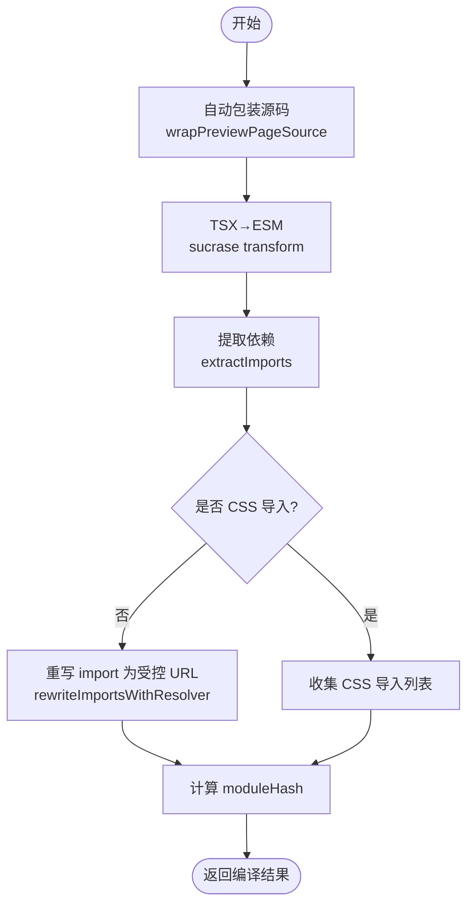
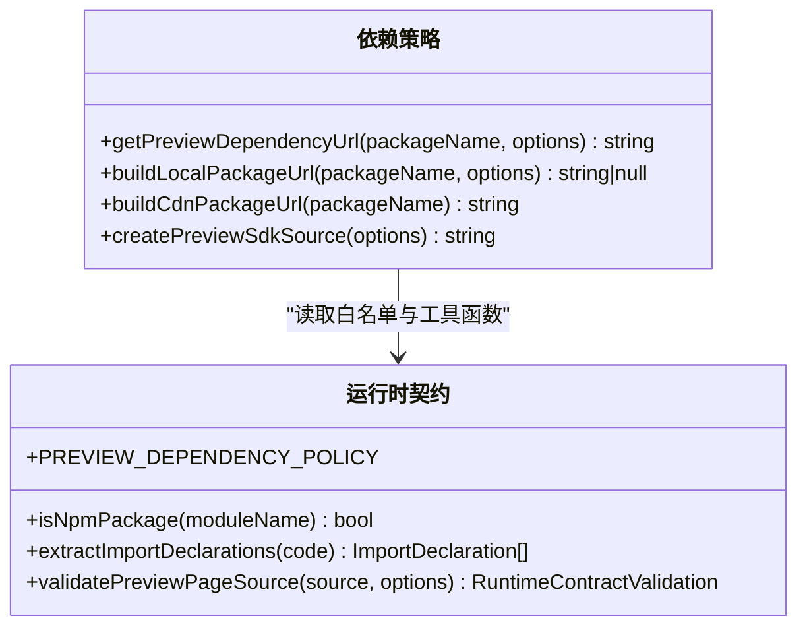
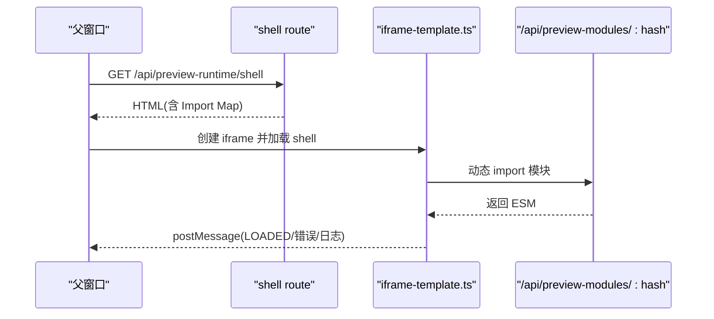
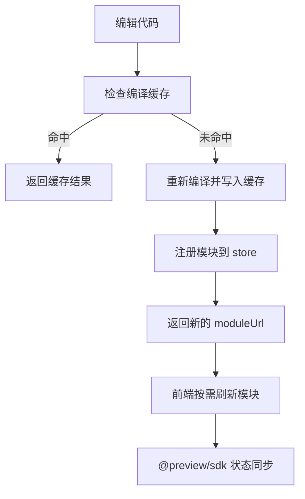
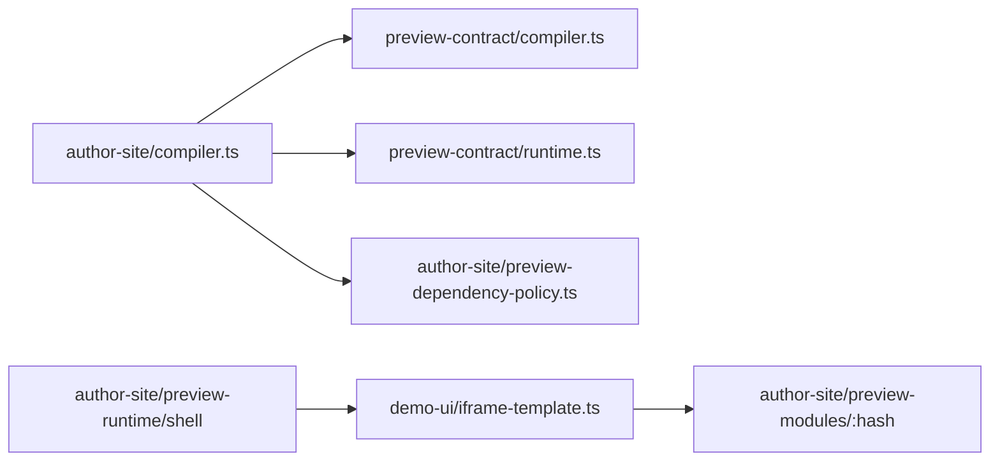

# 预览系统

<cite>
**本文引用的文件**   
- [packages/author-site/src/lib/compiler.ts](file://packages/author-site/src/lib/compiler.ts)
- [packages/preview-contract/src/compiler.ts](file://packages/preview-contract/src/compiler.ts)
- [packages/preview-contract/src/runtime.ts](file://packages/preview-contract/src/runtime.ts)
- [packages/author-site/src/lib/preview-dependency-policy.ts](file://packages/author-site/src/lib/preview-dependency-policy.ts)
- [packages/author-site/src/app/api/compile/route.ts](file://packages/author-site/src/app/api/compile/route.ts)
- [packages/author-site/src/app/api/preview-modules/[hash]/route.ts](file://packages/author-site/src/app/api/preview-modules/[hash]/route.ts)
- [packages/author-site/src/lib/preview-module-store.ts](file://packages/author-site/src/lib/preview-module-store.ts)
- [packages/author-site/src/app/api/preview-runtime/shell/route.ts](file://packages/author-site/src/app/api/preview-runtime/shell/route.ts)
- [packages/demo-ui/src/iframe-template.ts](file://packages/demo-ui/src/iframe-template.ts)
- [packages/demo-ui/src/PreviewPanel.tsx](file://packages/demo-ui/src/PreviewPanel.tsx)
- [packages/demo-ui/src/IframePreviewFrame.tsx](file://packages/demo-ui/src/IframePreviewFrame.tsx)
- [packages/author-site/src/lib/__tests__/preview-runtime-policy.test.ts](file://packages/author-site/src/lib/__tests__/preview-runtime-policy.test.ts)
- [packages/author-site/src/lib/__tests__/runtime-config.test.ts](file://packages/author-site/src/lib/__tests__/runtime-config.test.ts)
- [packages/project-core/src/__tests__/config.test.ts](file://packages/project-core/src/__tests__/config.test.ts)
- [docs/项目文档/创作端/04-配置与预览/技术/01_动态编译方案.md](file://docs/项目文档/创作端/04-配置与预览/技术/01_动态编译方案.md)
</cite>

## 目录
1. [简介](#简介)
2. [项目结构](#项目结构)
3. [核心组件](#核心组件)
4. [架构总览](#架构总览)
5. [详细组件分析](#详细组件分析)
6. [依赖关系分析](#依赖关系分析)
7. [性能考虑](#性能考虑)
8. [故障排查指南](#故障排查指南)
9. [结论](#结论)
10. [附录：API 参考与自定义编译器开发指南](#附录api-参考与自定义编译器开发指南)

## 简介
本技术文档面向“预览系统”，围绕以下目标展开：
- 动态编译引擎：代码转换、依赖解析与模块打包
- 预览沙箱机制：安全隔离、资源加载与错误处理
- 热重载能力：增量编译、实时更新与状态保持
- 预览配置管理：环境变量注入、路径重写与资源代理
- 性能优化：编译缓存、并行构建与内存回收
- API 参考与自定义编译器开发指南

整体采用“服务端编译 + 同源 Preview Runtime + iframe 沙箱渲染”的架构，将 AI 生成的 TSX 代码编译为 ESM 模块，核心运行时与白名单依赖从同源 preview-runtime 或 CDN 回退加载，在 iframe 中隔离执行。发布后的 React 页面使用独立 compiled.js 模块 URL 加载，并通过发布批次参数避免浏览器复用旧产物。

## 项目结构
预览系统的关键实现分布在 author-site（创作端）、preview-contract（预览合约）、demo-ui（演示与模板）等包中：
- 编译与依赖策略：author-site 的 compiler.ts 与 preview-dependency-policy.ts，以及 preview-contract 的 compiler.ts 与 runtime.ts
- 运行时壳与模块分发：author-site 的 shell route 与 preview-modules 路由，demo-ui 的 iframe-template.ts
- 前端容器与沙箱：demo-ui 的 IframePreviewFrame.tsx 与 PreviewPanel.tsx
- 测试与配置：author-site 与 project-core 的配置与策略测试

图表来源
- [packages/author-site/src/lib/compiler.ts:1-197](file://packages/author-site/src/lib/compiler.ts#L1-L197)
- [packages/preview-contract/src/compiler.ts:1-62](file://packages/preview-contract/src/compiler.ts#L1-L62)
- [packages/preview-contract/src/runtime.ts:1-643](file://packages/preview-contract/src/runtime.ts#L1-L643)
- [packages/author-site/src/lib/preview-dependency-policy.ts:1-471](file://packages/author-site/src/lib/preview-dependency-policy.ts#L1-L471)
- [packages/author-site/src/app/api/compile/route.ts:68-101](file://packages/author-site/src/app/api/compile/route.ts#L68-L101)
- [packages/author-site/src/lib/preview-module-store.ts:43-76](file://packages/author-site/src/lib/preview-module-store.ts#L43-L76)
- [packages/author-site/src/app/api/preview-modules/[hash]/route.ts:1-33](file://packages/author-site/src/app/api/preview-modules/[hash]/route.ts#L1-L33)
- [packages/author-site/src/app/api/preview-runtime/shell/route.ts:1-24](file://packages/author-site/src/app/api/preview-runtime/shell/route.ts#L1-L24)
- [packages/demo-ui/src/iframe-template.ts:1-200](file://packages/demo-ui/src/iframe-template.ts#L1-L200)
- [packages/demo-ui/src/IframePreviewFrame.tsx:1-62](file://packages/demo-ui/src/IframePreviewFrame.tsx#L1-L62)
- [packages/demo-ui/src/PreviewPanel.tsx:129-168](file://packages/demo-ui/src/PreviewPanel.tsx#L129-L168)

章节来源
- [docs/项目文档/创作端/04-配置与预览/技术/01_动态编译方案.md:31-149](file://docs/项目文档/创作端/04-配置与预览/技术/01_动态编译方案.md#L31-L149)

## 核心组件
- 编译引擎
  - 入口函数 compileCode 负责将 TSX 源码转换为 ESM，提取 import，替换 npm 依赖为受控 URL，并生成 moduleHash。
  - 通过 preview-contract 的 compilePreviewPageSource 完成语法转换与契约校验。
- 依赖策略
  - 基于 PREVIEW_DEPENDENCY_POLICY 白名单，优先同源 runtime，否则回退到 CDN；@preview/sdk 作为虚拟模块注入。
- 模块存储与分发
  - registerPreviewModule 将编译产物持久化到磁盘并维护内存缓存；/api/preview-modules/:hash 提供只读读取。
- 运行外壳与沙箱
  - /api/preview-runtime/shell 返回 iframe 壳 HTML，内嵌 Import Map 与运行时脚本，支持 URL 模式与 CDN 回退。
  - iframe-template.ts 负责模块加载、错误上报、计时统计与父窗口通信。
- 前端容器
  - IframePreviewFrame.tsx 负责尺寸自适应、沙箱属性控制与事件桥接。
  - PreviewPanel.tsx 对静态输出进行安全清洗，移除危险节点与属性。

章节来源
- [packages/author-site/src/lib/compiler.ts:1-197](file://packages/author-site/src/lib/compiler.ts#L1-L197)
- [packages/preview-contract/src/compiler.ts:1-62](file://packages/preview-contract/src/compiler.ts#L1-L62)
- [packages/preview-contract/src/runtime.ts:1-643](file://packages/preview-contract/src/runtime.ts#L1-L643)
- [packages/author-site/src/lib/preview-dependency-policy.ts:1-471](file://packages/author-site/src/lib/preview-dependency-policy.ts#L1-L471)
- [packages/author-site/src/lib/preview-module-store.ts:43-76](file://packages/author-site/src/lib/preview-module-store.ts#L43-L76)
- [packages/author-site/src/app/api/preview-modules/[hash]/route.ts:1-33](file://packages/author-site/src/app/api/preview-modules/[hash]/route.ts#L1-L33)
- [packages/author-site/src/app/api/preview-runtime/shell/route.ts:1-24](file://packages/author-site/src/app/api/preview-runtime/shell/route.ts#L1-L24)
- [packages/demo-ui/src/iframe-template.ts:1-200](file://packages/demo-ui/src/iframe-template.ts#L1-L200)
- [packages/demo-ui/src/IframePreviewFrame.tsx:1-62](file://packages/demo-ui/src/IframePreviewFrame.tsx#L1-L62)
- [packages/demo-ui/src/PreviewPanel.tsx:129-168](file://packages/demo-ui/src/PreviewPanel.tsx#L129-L168)

## 架构总览
预览系统由“服务端编译 + 同源运行时 + iframe 沙箱”组成。编译阶段产出 ESM 模块与依赖清单，依赖被重写到受控 URL；运行阶段通过 shell 注入 Import Map，统一加载 react、lucide-react、@preview/sdk 等依赖，并在 iframe 中执行用户模块。

图表来源
- [packages/author-site/src/app/api/compile/route.ts:68-101](file://packages/author-site/src/app/api/compile/route.ts#L68-L101)
- [packages/author-site/src/lib/compiler.ts:1-197](file://packages/author-site/src/lib/compiler.ts#L1-L197)
- [packages/preview-contract/src/compiler.ts:1-62](file://packages/preview-contract/src/compiler.ts#L1-L62)
- [packages/author-site/src/lib/preview-dependency-policy.ts:1-471](file://packages/author-site/src/lib/preview-dependency-policy.ts#L1-L471)
- [packages/author-site/src/lib/preview-module-store.ts:43-76](file://packages/author-site/src/lib/preview-module-store.ts#L43-L76)
- [packages/author-site/src/app/api/preview-modules/[hash]/route.ts:1-33](file://packages/author-site/src/app/api/preview-modules/[hash]/route.ts#L1-L33)
- [packages/author-site/src/app/api/preview-runtime/shell/route.ts:1-24](file://packages/author-site/src/app/api/preview-runtime/shell/route.ts#L1-L24)
- [packages/demo-ui/src/iframe-template.ts:1-200](file://packages/demo-ui/src/iframe-template.ts#L1-L200)

## 详细组件分析

### 动态编译引擎
- 代码转换
  - 使用 sucrase 将 TSX 转为 ESM，保留 import/export，自动注入 jsx-runtime。
  - 通过 wrapPreviewPageSource 自动包装裸 JSX 或缺失默认导出的情况。
- 依赖解析
  - extractImports 提取所有 import 源模块名。
  - rewriteImportsWithResolver 将 npm 包名替换为 getPreviewDependencyUrl 返回的同源 URL 或 CDN URL。
- 模块打包
  - 生成 sha256 作为 moduleHash，配合 /api/preview-modules/:hash 提供稳定只读访问。
  - 支持 CSS 导入分离与后续处理。

图表来源
- [packages/preview-contract/src/compiler.ts:1-62](file://packages/preview-contract/src/compiler.ts#L1-L62)
- [packages/preview-contract/src/runtime.ts:258-274](file://packages/preview-contract/src/runtime.ts#L258-L274)
- [packages/preview-contract/src/runtime.ts:603-643](file://packages/preview-contract/src/runtime.ts#L603-L643)
- [packages/author-site/src/lib/compiler.ts:82-112](file://packages/author-site/src/lib/compiler.ts#L82-L112)

章节来源
- [packages/preview-contract/src/compiler.ts:1-62](file://packages/preview-contract/src/compiler.ts#L1-L62)
- [packages/preview-contract/src/runtime.ts:1-643](file://packages/preview-contract/src/runtime.ts#L1-L643)
- [packages/author-site/src/lib/compiler.ts:1-197](file://packages/author-site/src/lib/compiler.ts#L1-L197)

### 依赖策略与运行时映射
- 白名单策略
  - 仅允许 PREVIEW_DEPENDENCY_POLICY 中的包，react/react-dom/lucide-react/framer-motion/svgaplayerweb/@preview/sdk 等。
- 同源优先
  - 优先通过 getPreviewRuntimeUrl 获取同源 vendor URL；未命中则回退到 CDN。
- @preview/sdk 虚拟模块
  - 以 data URL 注入，暴露 Icon/Button/Card/Motion/Chart 等受控 UI 与 trigger/useAppState/useRouteParams 等运行时能力。

图表来源
- [packages/author-site/src/lib/preview-dependency-policy.ts:1-471](file://packages/author-site/src/lib/preview-dependency-policy.ts#L1-L471)
- [packages/preview-contract/src/runtime.ts:1-643](file://packages/preview-contract/src/runtime.ts#L1-L643)

章节来源
- [packages/author-site/src/lib/preview-dependency-policy.ts:1-471](file://packages/author-site/src/lib/preview-dependency-policy.ts#L1-L471)
- [packages/author-site/src/lib/__tests__/preview-runtime-policy.test.ts:1-38](file://packages/author-site/src/lib/__tests__/preview-runtime-policy.test.ts#L1-L38)

### 预览沙箱机制
- 安全隔离
  - iframe 沙箱限制权限（如 allow-scripts），禁止 script/iframe/embed/object 等危险标签，清理 on* 事件与 javascript: 协议链接。
- 资源加载
  - shell 注入 Import Map，统一指向 /preview-runtime/vendor/*；支持 useCdnRuntime 开关。
  - 模块通过 /api/preview-modules/:hash 加载，确保内容寻址与缓存。
- 错误处理
  - 捕获依赖导入失败、无默认导出等错误，上报父窗口；同时记录性能指标。

图表来源
- [packages/author-site/src/app/api/preview-runtime/shell/route.ts:1-24](file://packages/author-site/src/app/api/preview-runtime/shell/route.ts#L1-L24)
- [packages/demo-ui/src/iframe-template.ts:1-200](file://packages/demo-ui/src/iframe-template.ts#L1-L200)
- [packages/author-site/src/app/api/preview-modules/[hash]/route.ts:1-33](file://packages/author-site/src/app/api/preview-modules/[hash]/route.ts#L1-L33)
- [packages/demo-ui/src/PreviewPanel.tsx:129-168](file://packages/demo-ui/src/PreviewPanel.tsx#L129-L168)

章节来源
- [packages/demo-ui/src/PreviewPanel.tsx:129-168](file://packages/demo-ui/src/PreviewPanel.tsx#L129-L168)
- [packages/demo-ui/src/IframePreviewFrame.tsx:1-62](file://packages/demo-ui/src/IframePreviewFrame.tsx#L1-L62)
- [packages/author-site/src/app/api/preview-runtime/shell/route.ts:1-24](file://packages/author-site/src/app/api/preview-runtime/shell/route.ts#L1-L24)
- [packages/author-site/src/app/api/preview-modules/[hash]/route.ts:1-33](file://packages/author-site/src/app/api/preview-modules/[hash]/route.ts#L1-L33)
- [packages/demo-ui/src/iframe-template.ts:1-200](file://packages/demo-ui/src/iframe-template.ts#L1-L200)

### 热重载与增量更新
- 增量编译
  - 服务端按代码指纹与策略版本生成缓存 key，命中则直接返回结果，减少重复编译。
- 实时更新
  - 通过 /api/compile 返回 moduleUrl，前端可动态刷新模块引用；iframe-template 支持从 URL 模式加载新模块。
- 状态保持
  - 通过 @preview/sdk 的 useAppState/useRouteParams 监听 __APP_STATE__ 与 __ROUTE_PARAMS__ 变更，结合 window 事件实现局部状态同步。

图表来源
- [packages/author-site/src/lib/compiler.ts:28-37](file://packages/author-site/src/lib/compiler.ts#L28-L37)
- [packages/author-site/src/lib/compiler.ts:82-112](file://packages/author-site/src/lib/compiler.ts#L82-L112)
- [packages/author-site/src/lib/preview-module-store.ts:43-76](file://packages/author-site/src/lib/preview-module-store.ts#L43-L76)
- [packages/author-site/src/app/api/compile/route.ts:68-101](file://packages/author-site/src/app/api/compile/route.ts#L68-L101)
- [packages/author-site/src/lib/preview-dependency-policy.ts:96-471](file://packages/author-site/src/lib/preview-dependency-policy.ts#L96-L471)

章节来源
- [packages/author-site/src/lib/compiler.ts:1-197](file://packages/author-site/src/lib/compiler.ts#L1-L197)
- [packages/author-site/src/lib/preview-module-store.ts:43-76](file://packages/author-site/src/lib/preview-module-store.ts#L43-L76)
- [packages/author-site/src/app/api/compile/route.ts:68-101](file://packages/author-site/src/app/api/compile/route.ts#L68-L101)
- [packages/author-site/src/lib/preview-dependency-policy.ts:1-471](file://packages/author-site/src/lib/preview-dependency-policy.ts#L1-L471)

### 预览配置管理
- 环境变量注入
  - 通过 NEXT_PUBLIC_* 变量向浏览器暴露服务地址与功能开关；服务端 URL 与公开 URL 分别读取。
- 路径重写
  - 编译期将 npm 依赖重写为 /preview-runtime/vendor/* 或 CDN URL；图片等资源可通过配置数据或 ImageAsset 处理。
- 资源代理
  - 通过 shell 的 Import Map 与 /api/preview-modules 路由集中管理资源路径与缓存策略。

章节来源
- [packages/author-site/src/lib/__tests__/runtime-config.test.ts:42-81](file://packages/author-site/src/lib/__tests__/runtime-config.test.ts#L42-L81)
- [packages/project-core/src/__tests__/config.test.ts:1-70](file://packages/project-core/src/__tests__/config.test.ts#L1-L70)
- [packages/author-site/src/app/api/preview-runtime/shell/route.ts:1-24](file://packages/author-site/src/app/api/preview-runtime/shell/route.ts#L1-L24)
- [packages/author-site/src/lib/preview-dependency-policy.ts:1-471](file://packages/author-site/src/lib/preview-dependency-policy.ts#L1-L471)

## 依赖关系分析
- 编译链路
  - author-site/compiler.ts 依赖 preview-contract/compiler.ts 与 runtime.ts，以及本地 preview-dependency-policy.ts。
- 运行链路
  - demo-ui/iframe-template.ts 通过 Import Map 与 /api/preview-modules 路由加载模块，并与父窗口通信。
- 外部依赖
  - sucrase 用于快速 TSX→ESM 转换；TypeScript 用于 AST 分析与契约校验。

图表来源
- [packages/author-site/src/lib/compiler.ts:1-197](file://packages/author-site/src/lib/compiler.ts#L1-L197)
- [packages/preview-contract/src/compiler.ts:1-62](file://packages/preview-contract/src/compiler.ts#L1-L62)
- [packages/preview-contract/src/runtime.ts:1-643](file://packages/preview-contract/src/runtime.ts#L1-L643)
- [packages/author-site/src/lib/preview-dependency-policy.ts:1-471](file://packages/author-site/src/lib/preview-dependency-policy.ts#L1-L471)
- [packages/author-site/src/app/api/preview-runtime/shell/route.ts:1-24](file://packages/author-site/src/app/api/preview-runtime/shell/route.ts#L1-L24)
- [packages/demo-ui/src/iframe-template.ts:1-200](file://packages/demo-ui/src/iframe-template.ts#L1-L200)
- [packages/author-site/src/app/api/preview-modules/[hash]/route.ts:1-33](file://packages/author-site/src/app/api/preview-modules/[hash]/route.ts#L1-L33)

章节来源
- [packages/author-site/src/lib/compiler.ts:1-197](file://packages/author-site/src/lib/compiler.ts#L1-L197)
- [packages/preview-contract/src/compiler.ts:1-62](file://packages/preview-contract/src/compiler.ts#L1-L62)
- [packages/preview-contract/src/runtime.ts:1-643](file://packages/preview-contract/src/runtime.ts#L1-L643)
- [packages/author-site/src/lib/preview-dependency-policy.ts:1-471](file://packages/author-site/src/lib/preview-dependency-policy.ts#L1-L471)
- [packages/author-site/src/app/api/preview-runtime/shell/route.ts:1-24](file://packages/author-site/src/app/api/preview-runtime/shell/route.ts#L1-L24)
- [packages/demo-ui/src/iframe-template.ts:1-200](file://packages/demo-ui/src/iframe-template.ts#L1-L200)
- [packages/author-site/src/app/api/preview-modules/[hash]/route.ts:1-33](file://packages/author-site/src/app/api/preview-modules/[hash]/route.ts#L1-L33)

## 性能考虑
- 编译缓存
  - 服务端按代码哈希与策略版本缓存编译结果，避免重复转换与重写。
- 并行构建
  - 依赖解析与锁定可在后台异步进行，不阻塞首次响应；多页面场景可按需触发。
- 内存回收
  - 内存缓存设置最大条目数，LRU 淘汰；文件层使用原子写入与临时文件避免脏读。
- 资源缓存
  - /api/preview-modules 返回 immutable 缓存头，提升浏览器缓存命中率。

章节来源
- [packages/author-site/src/lib/compiler.ts:28-37](file://packages/author-site/src/lib/compiler.ts#L28-L37)
- [packages/author-site/src/lib/compiler.ts:103-112](file://packages/author-site/src/lib/compiler.ts#L103-L112)
- [packages/author-site/src/lib/preview-module-store.ts:43-76](file://packages/author-site/src/lib/preview-module-store.ts#L43-L76)
- [packages/author-site/src/app/api/preview-modules/[hash]/route.ts:25-33](file://packages/author-site/src/app/api/preview-modules/[hash]/route.ts#L25-L33)

## 故障排查指南
- 常见错误
  - 未知 npm 导入：不在白名单内的依赖会被拒绝，需加入策略或使用 @preview/sdk。
  - 相对导入不支持：预览要求单文件，避免跨文件引用。
  - 无默认导出：组件必须提供 export default，否则无法渲染。
  - 空渲染风险：return null 可能导致空白页，建议使用占位。
- 诊断手段
  - 查看 iframe 控制台日志与错误上报消息。
  - 检查 Import Map 与 vendor 资源是否可用。
  - 验证 moduleHash 与 /api/preview-modules 返回码。

章节来源
- [packages/preview-contract/src/runtime.ts:276-369](file://packages/preview-contract/src/runtime.ts#L276-L369)
- [packages/preview-contract/src/runtime.ts:555-601](file://packages/preview-contract/src/runtime.ts#L555-L601)
- [packages/author-site/src/lib/__tests__/preview-runtime-policy.test.ts:1-38](file://packages/author-site/src/lib/__tests__/preview-runtime-policy.test.ts#L1-L38)
- [packages/demo-ui/src/iframe-template.ts:1-200](file://packages/demo-ui/src/iframe-template.ts#L1-L200)

## 结论
预览系统通过严格的依赖白名单、同源优先的资源加载与 iframe 沙箱，实现了安全可控的动态预览体验。编译链路与运行时契约保证了产物的一致性与可诊断性，配合缓存与原子写入提升了性能与稳定性。未来可进一步扩展白名单、增强状态恢复与错误边界，以满足更复杂的业务场景。

## 附录：API 参考与自定义编译器开发指南

### 预览 API 参考
- 编译接口
  - POST /api/compile
    - 输入：code 或 sessionId（可选 demoId）
    - 输出：{ compiledCode, dependencies, cssImports, moduleHash, moduleUrl }
    - 行为：注册模块到 store，返回稳定的 moduleUrl
- 模块接口
  - GET /api/preview-modules/:hash.js
    - 输入：64 位十六进制 hash
    - 输出：编译后的 ESM 代码
    - 缓存：immutable 长缓存
- 运行外壳
  - GET /api/preview-runtime/shell?runtimeSource=cdn|local
    - 输出：包含 Import Map 的 HTML
    - 用途：在 iframe 中加载运行时与模块

章节来源
- [packages/author-site/src/app/api/compile/route.ts:68-101](file://packages/author-site/src/app/api/compile/route.ts#L68-L101)
- [packages/author-site/src/app/api/preview-modules/[hash]/route.ts:1-33](file://packages/author-site/src/app/api/preview-modules/[hash]/route.ts#L1-L33)
- [packages/author-site/src/app/api/preview-runtime/shell/route.ts:1-24](file://packages/author-site/src/app/api/preview-runtime/shell/route.ts#L1-L24)

### 自定义编译器开发指南
- 集成点
  - 使用 preview-contract 的 compilePreviewPageSource 与 validatePreviewPageSource 保证产物符合运行时契约。
  - 通过 rewriteImportsWithResolver 自定义依赖重写逻辑，例如接入私有 registry 或本地 vendor。
- 依赖策略
  - 在 getPreviewDependencyUrl 中实现同源优先与 CDN 回退；@preview/sdk 可作为虚拟模块注入。
- 产物校验
  - 使用 assertCompiledPreviewModule 确保产物可被浏览器正确解析，避免绑定冲突与多重 default export。
- 示例参考
  - 单元测试展示了 @preview/sdk 与 lucide-react 的重写行为与 moduleHash 格式。

章节来源
- [packages/preview-contract/src/compiler.ts:1-62](file://packages/preview-contract/src/compiler.ts#L1-L62)
- [packages/preview-contract/src/runtime.ts:1-643](file://packages/preview-contract/src/runtime.ts#L1-L643)
- [packages/author-site/src/lib/preview-dependency-policy.ts:1-471](file://packages/author-site/src/lib/preview-dependency-policy.ts#L1-L471)
- [packages/author-site/src/lib/__tests__/preview-runtime-policy.test.ts:1-38](file://packages/author-site/src/lib/__tests__/preview-runtime-policy.test.ts#L1-L38)