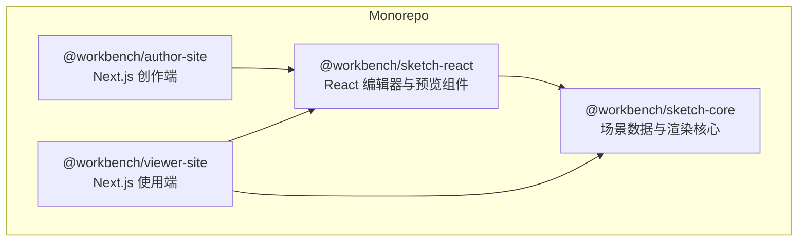
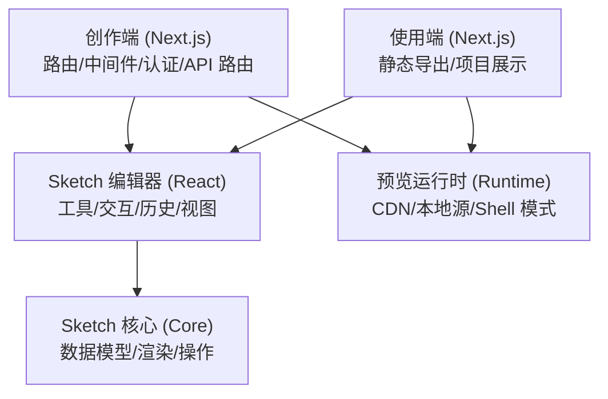
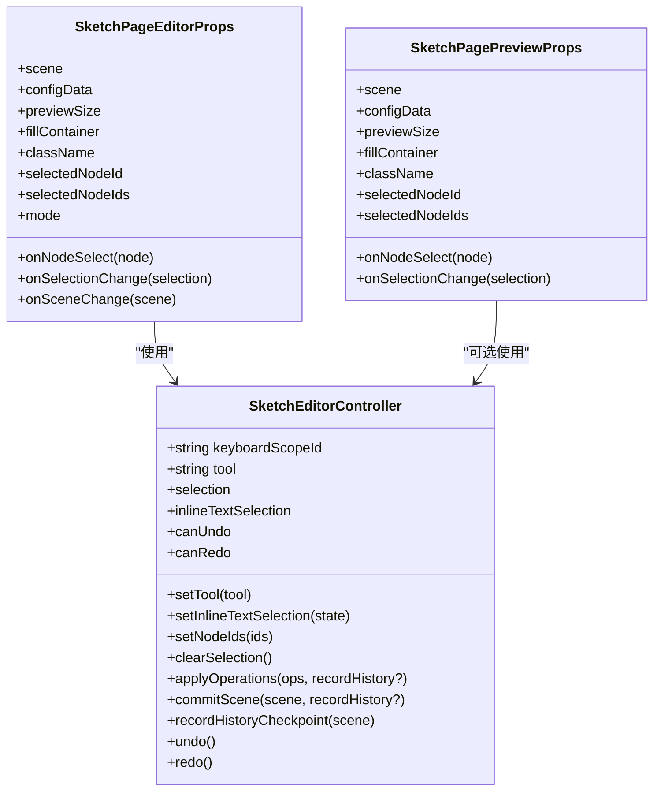
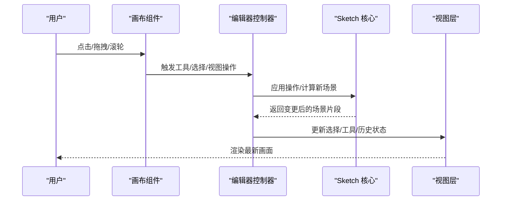
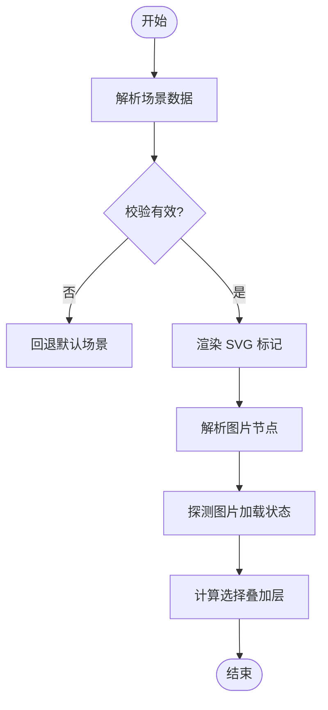
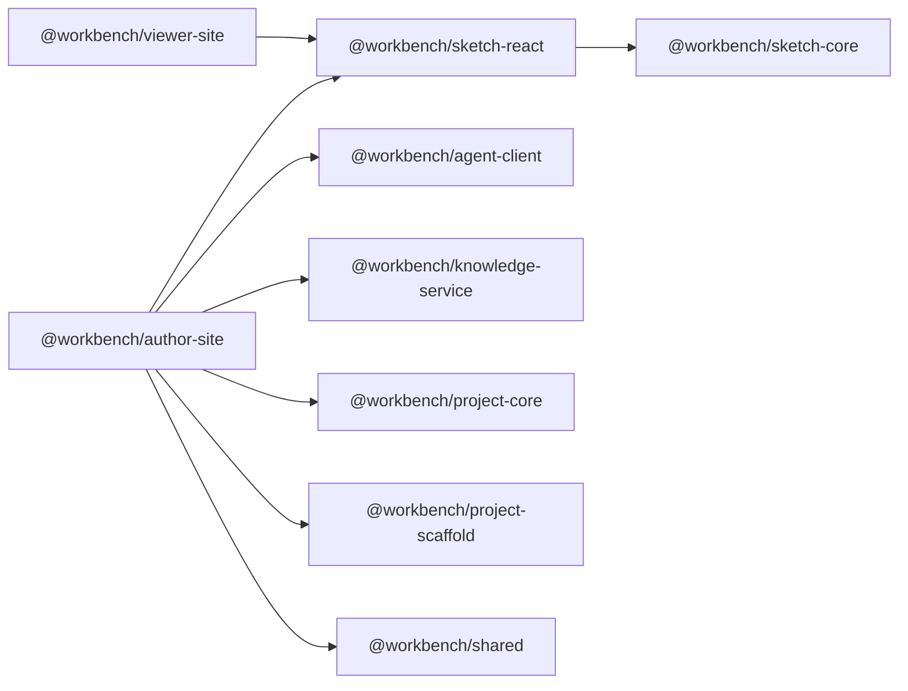

# 前端应用

<cite>
**本文引用的文件**   
- [package.json](file://package.json)
- [author-site/package.json](file://packages/author-site/package.json)
- [viewer-site/package.json](file://packages/viewer-site/package.json)
- [sketch-react/package.json](file://packages/sketch-react/package.json)
- [sketch-core/package.json](file://packages/sketch-core/package.json)
- [author-site/next.config.js](file://packages/author-site/next.config.js)
- [viewer-site/next.config.js](file://packages/viewer-site/next.config.js)
- [sketch-react/src/index.tsx](file://packages/sketch-react/src/index.tsx)
- [sketch-react/src/preview.tsx](file://packages/sketch-react/src/preview.tsx)
</cite>

## 目录
1. [简介](#简介)
2. [项目结构](#项目结构)
3. [核心组件](#核心组件)
4. [架构总览](#架构总览)
5. [详细组件分析](#详细组件分析)
6. [依赖关系分析](#依赖关系分析)
7. [性能考量](#性能考量)
8. [故障排查指南](#故障排查指南)
9. [结论](#结论)
10. [附录](#附录)

## 简介
本技术文档面向 Workbench 的前端应用，聚焦以下目标：
- 创作端（Author Site）基于 Next.js 的架构、路由组织与中间件机制、用户认证系统。
- 使用端（Viewer Site）的静态站点生成与项目展示能力。
- Sketch 画布编辑器的核心逻辑：React 组件封装、交互设计模式与性能优化策略。
- 实时协作的实现思路：WebSocket 连接管理、状态同步与冲突解决。
- UI 组件库使用指南、主题定制方案与响应式设计实现。
- 构建配置、代码分割与懒加载优化策略。
- 实际组件使用示例与最佳实践。

## 项目结构
Workbench 采用 monorepo 组织方式，前端相关包包括：
- @workbench/author-site：Next.js 创作端应用，提供页面、API 路由、中间件与运行时预览集成。
- @workbench/viewer-site：Next.js 使用端应用，支持导出为静态站点并展示项目内容。
- @workbench/sketch-core：Sketch 场景数据模型与渲染、操作等核心算法。
- @workbench/sketch-react：基于 React 的 Sketch 编辑器与预览组件封装。

图表来源
- [author-site/package.json:1-127](file://packages/author-site/package.json#L1-L127)
- [viewer-site/package.json:1-62](file://packages/viewer-site/package.json#L1-L62)
- [sketch-react/package.json:1-34](file://packages/sketch-react/package.json#L1-L34)
- [sketch-core/package.json:1-21](file://packages/sketch-core/package.json#L1-L21)

章节来源
- [package.json:1-101](file://package.json#L1-L101)
- [author-site/package.json:1-127](file://packages/author-site/package.json#L1-L127)
- [viewer-site/package.json:1-62](file://packages/viewer-site/package.json#L1-L62)
- [sketch-react/package.json:1-34](file://packages/sketch-react/package.json#L1-L34)
- [sketch-core/package.json:1-21](file://packages/sketch-core/package.json#L1-L21)

## 核心组件
- 创作端（Author Site）
  - 基于 Next.js 14，启用 Server Actions、instrumentationHook 等实验特性。
  - 通过 transpilePackages 将内部包（如 sketch-core、sketch-react、project-core 等）纳入编译流程。
  - 提供环境变量注入与 CDN 预览运行时配置。
- 使用端（Viewer Site）
  - 生产环境输出为静态站点（export），开启 trailingSlash。
  - 同样通过 transpilePackages 引入内部包，图片处理设置为 unoptimized 以适配静态导出。
- Sketch 编辑器（sketch-react）
  - 提供 SketchPageEditor/SketchPagePreview 等组件，封装了工具栏、属性面板、图层面板、画布交互、撤销重做、缩放平移、选择框选、拖拽绘制等能力。
  - 与 sketch-core 紧密耦合，负责解析、校验、渲染与操作场景数据。

章节来源
- [author-site/next.config.js:1-78](file://packages/author-site/next.config.js#L1-L78)
- [viewer-site/next.config.js:1-26](file://packages/viewer-site/next.config.js#L1-L26)
- [sketch-react/src/index.tsx:1-800](file://packages/sketch-react/src/index.tsx#L1-L800)
- [sketch-react/src/preview.tsx:1-263](file://packages/sketch-react/src/preview.tsx#L1-L263)

## 架构总览
整体前端架构由“创作端 + 使用端 + 编辑器核心”组成。创作端负责编辑与协作，使用端负责预览与发布产物展示；两者共享 sketch-core 与 sketch-react 的能力。

图表来源
- [author-site/next.config.js:26-55](file://packages/author-site/next.config.js#L26-L55)
- [viewer-site/next.config.js:1-26](file://packages/viewer-site/next.config.js#L1-L26)
- [sketch-react/src/index.tsx:1-120](file://packages/sketch-react/src/index.tsx#L1-L120)
- [sketch-react/src/preview.tsx:1-120](file://packages/sketch-react/src/preview.tsx#L1-L120)

## 详细组件分析

### 创作端（Author Site）
- 路由组织
  - 使用 App Router 的分组路由（例如 (auth)、admin 等），便于权限控制与布局复用。
  - API 路由集中在 src/app/api 下，按功能域划分（如 admin、agent、ai、auth）。
- 中间件机制
  - 可通过 Next.js 中间件统一鉴权、日志、请求拦截等。结合认证系统对受保护路由进行守卫。
- 用户认证系统
  - 登录、注册、忘记密码等页面位于 (auth) 分组内，配合 API 路由完成令牌签发与校验。
  - 建议采用 JWT 或会话 Cookie，并在中间件中校验身份后放行到受保护页面。
- 构建与运行
  - output: standalone，适合容器化部署。
  - transpilePackages 包含多个内部包，确保开发/构建时类型与模块正确解析。
  - 环境变量注入 NEXT_PUBLIC_PREVIEW_*，用于控制预览运行时来源与 shell 模式。

章节来源
- [author-site/package.json:1-127](file://packages/author-site/package.json#L1-L127)
- [author-site/next.config.js:1-78](file://packages/author-site/next.config.js#L1-L78)

### 使用端（Viewer Site）
- 静态站点生成
  - 生产环境使用 export 输出静态站点，trailingSlash 保证 URL 风格一致。
  - images.unoptimized 适配静态导出限制。
- 项目展示
  - 通过 [[...slug]] 动态路由匹配项目路径，渲染 Sketch 预览或项目页面。
  - 可结合 preview-runtime/shell 路由提供轻量壳资源。
- 构建与运行
  - 同样通过 transpilePackages 引入内部包，保持与创作端一致的渲染行为。

章节来源
- [viewer-site/package.json:1-62](file://packages/viewer-site/package.json#L1-L62)
- [viewer-site/next.config.js:1-26](file://packages/viewer-site/next.config.js#L1-L26)

### Sketch 画布编辑器（sketch-react）
- 组件封装
  - 提供 SketchPageEditor 与 SketchPagePreview 两类组件：前者用于编辑，后者仅用于预览。
  - 控制器接口 SketchEditorController 暴露键盘作用域、工具切换、选择状态、批量操作、历史记录、撤销重做等能力。
- 数据结构与复杂度
  - 场景数据 SketchSceneDocument 包含 nodes、pageSize 等字段；节点类型覆盖矩形、菱形、椭圆、线条、箭头、画笔、文本、图片、便签等。
  - 常用操作（移动、缩放、旋转、路径简化）时间复杂度近似 O(n)，n 为选中节点数或路径点数。
- 交互设计模式
  - 指针事件驱动：点击、拖拽、滚轮缩放、中键平移、Shift 对齐角度、Alt/Ctrl/Meta 修饰键组合。
  - 选择与框选：根据可见性过滤计算选择边界，避免隐藏节点影响视觉反馈。
  - 绘制草稿：在鼠标移动过程中生成临时节点，达到阈值后提交，减少频繁更新。
- 性能优化策略
  - 路径点简化（Ramer–Douglas–Peucker 思想）降低路径复杂度。
  - 视口规范化与四舍五入，减少浮点抖动导致的重绘。
  - 图像资源探测与失败占位，避免阻塞主渲染。
  - useMemo/useEffect 缓存计算结果，按需触发更新。

图表来源
- [sketch-react/src/index.tsx:104-150](file://packages/sketch-react/src/index.tsx#L104-L150)
- [sketch-react/src/preview.tsx:28-38](file://packages/sketch-react/src/preview.tsx#L28-L38)

图表来源
- [sketch-react/src/index.tsx:175-240](file://packages/sketch-react/src/index.tsx#L175-L240)
- [sketch-react/src/index.tsx:687-757](file://packages/sketch-react/src/index.tsx#L687-L757)

图表来源
- [sketch-react/src/preview.tsx:44-121](file://packages/sketch-react/src/preview.tsx#L44-L121)
- [sketch-react/src/preview.tsx:162-263](file://packages/sketch-react/src/preview.tsx#L162-L263)

章节来源
- [sketch-react/src/index.tsx:1-800](file://packages/sketch-react/src/index.tsx#L1-L800)
- [sketch-react/src/preview.tsx:1-263](file://packages/sketch-react/src/preview.tsx#L1-L263)

### 实时协作（概念性说明）
- WebSocket 连接管理
  - 客户端建立持久连接，维护心跳与重连策略，记录连接状态与错误码。
- 状态同步
  - 基于 Yjs 的 CRDT 数据结构，将操作转换为增量补丁（Patch），在网络层广播。
  - 客户端合并远端补丁，保持本地状态一致。
- 冲突解决
  - 利用 Yjs 的自动冲突解决机制，确保多端编辑最终一致性。
  - 针对复杂场景（如路径点顺序、样式覆盖），可在应用层定义合并策略。

[本节为概念性说明，不直接分析具体源码文件]

## 依赖关系分析
- 作者端与使用端均依赖 sketch-react，而 sketch-react 依赖 sketch-core。
- author-site 额外依赖 agent-client、knowledge-service、project-core、project-scaffold、shared 等，形成更丰富的业务链路。
- viewer-site 依赖相对精简，聚焦预览与展示。

图表来源
- [author-site/package.json:16-99](file://packages/author-site/package.json#L16-L99)
- [viewer-site/package.json:13-47](file://packages/viewer-site/package.json#L13-L47)
- [sketch-react/package.json:15-20](file://packages/sketch-react/package.json#L15-L20)
- [sketch-core/package.json:1-21](file://packages/sketch-core/package.json#L1-L21)

章节来源
- [author-site/package.json:1-127](file://packages/author-site/package.json#L1-L127)
- [viewer-site/package.json:1-62](file://packages/viewer-site/package.json#L1-L62)
- [sketch-react/package.json:1-34](file://packages/sketch-react/package.json#L1-L34)
- [sketch-core/package.json:1-21](file://packages/sketch-core/package.json#L1-L21)

## 性能考量
- 构建与打包
  - transpilePackages 提升内部包编译效率，避免重复打包。
  - Next.js 的 code splitting 与 lazy loading 默认启用，建议在大型组件中使用 dynamic import。
- 渲染优化
  - 使用 useMemo 缓存昂贵的计算（如 SVG 标记、选择边界、图片列表）。
  - 视口规范化与数值取整，减少不必要的重绘。
  - 路径点简化降低复杂路径的渲染开销。
- 资源加载
  - 图片探测与失败占位，避免阻塞主线程。
  - 静态导出下关闭图片优化，确保兼容性。

章节来源
- [author-site/next.config.js:26-74](file://packages/author-site/next.config.js#L26-L74)
- [viewer-site/next.config.js:1-26](file://packages/viewer-site/next.config.js#L1-L26)
- [sketch-react/src/index.tsx:587-624](file://packages/sketch-react/src/index.tsx#L587-L624)
- [sketch-react/src/preview.tsx:113-121](file://packages/sketch-react/src/preview.tsx#L113-L121)

## 故障排查指南
- 预览运行时不可用
  - 检查 NEXT_PUBLIC_PREVIEW_RUNTIME_SOURCE 与 NEXT_PUBLIC_PREVIEW_CDN_BASE_URL 环境变量是否正确设置。
  - 确认 CDN 可达性与 Shell 模式（fixed/inline）是否符合预期。
- 静态站点导出异常
  - 确认 images.unoptimized 已启用，避免静态导出时的图片优化问题。
  - 检查 trailingSlash 是否导致路由匹配不一致。
- 编辑器交互卡顿
  - 观察路径点数量与选择集合大小，必要时启用路径简化或减少选中节点。
  - 检查是否存在大量未优化的外部资源（如大尺寸 data URL）。
- 认证与鉴权失败
  - 验证中间件是否正确读取令牌并放行受保护路由。
  - 检查 API 路由的权限校验逻辑与错误返回。

章节来源
- [author-site/next.config.js:26-55](file://packages/author-site/next.config.js#L26-L55)
- [viewer-site/next.config.js:1-26](file://packages/viewer-site/next.config.js#L1-L26)
- [sketch-react/src/index.tsx:587-624](file://packages/sketch-react/src/index.tsx#L587-L624)
- [sketch-react/src/preview.tsx:113-121](file://packages/sketch-react/src/preview.tsx#L113-L121)

## 结论
Workbench 前端采用清晰的 monorepo 分层与职责分离：创作端负责编辑与协作，使用端负责预览与发布，二者共享 Sketch 编辑器与核心能力。通过合理的构建配置、渲染优化与资源管理，系统在交互体验与性能之间取得平衡。后续可进一步扩展实时协作与主题定制能力，完善测试与监控体系。

## 附录
- UI 组件库使用指南
  - 推荐使用 Radix UI 基础组件与 Tailwind CSS 样式组合，借助 clsx/tailwind-merge 进行类名合并。
  - 图标库使用 lucide-react，保持一致的视觉风格。
- 主题定制方案
  - 通过 Tailwind 配置文件集中定义颜色、字体、间距等主题变量，便于全局替换。
  - 编辑器中的样式覆盖建议使用 CSS 变量与主题上下文，避免硬编码。
- 响应式设计实现
  - 使用 Tailwind 断点与 flex/grid 布局，适配不同屏幕尺寸。
  - 编辑器视口缩放与偏移在不同设备上需重新计算，确保交互一致性。
- 构建配置与优化
  - 使用 next.config.js 的 transpilePackages、webpack 别名与规则，提升构建效率与兼容性。
  - 在生产环境启用 standalone 输出，结合容器化部署提高可移植性。
- 组件使用示例与最佳实践
  - 在页面中引入 SketchPagePreview 进行只读展示，传入 scene 与 configData。
  - 在编辑页面使用 SketchPageEditor，绑定 onSceneChange 与历史记录，确保数据持久化。
  - 对于大图与复杂路径，优先启用路径简化与懒加载，减少首屏压力。