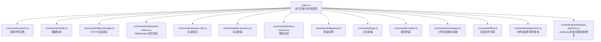
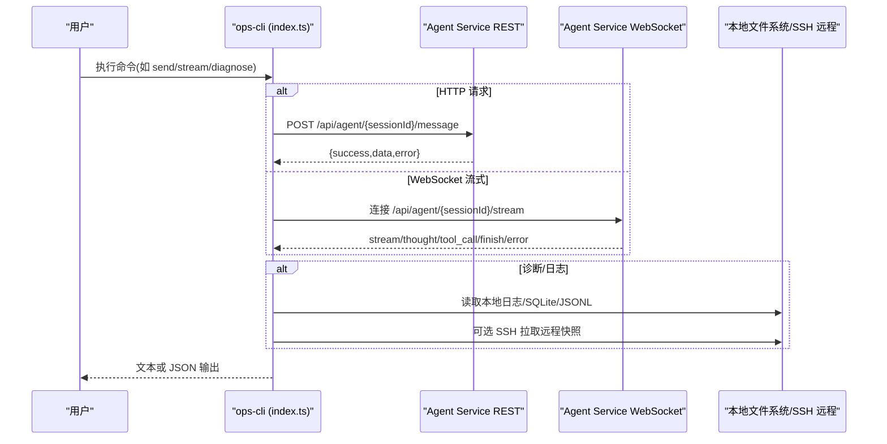
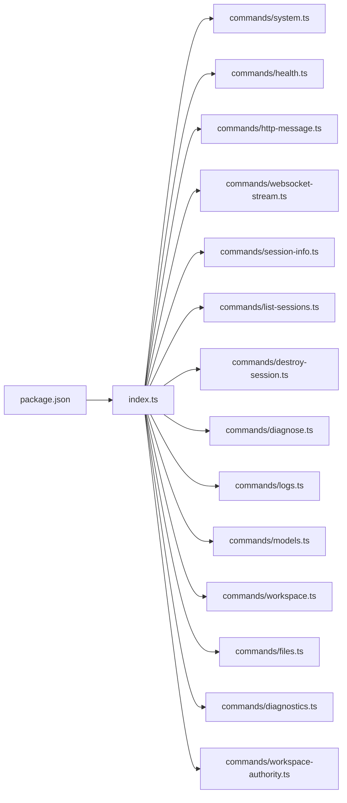

# CLI 工具

<cite>
**本文引用的文件**   
- [index.ts](file://OPS/CLI/src/index.ts)
- [system.ts](file://OPS/CLI/src/commands/system.ts)
- [health.ts](file://OPS/CLI/src/commands/health.ts)
- [http-message.ts](file://OPS/CLI/src/commands/http-message.ts)
- [websocket-stream.ts](file://OPS/CLI/src/commands/websocket-stream.ts)
- [session-info.ts](file://OPS/CLI/src/commands/session-info.ts)
- [list-sessions.ts](file://OPS/CLI/src/commands/list-sessions.ts)
- [destroy-session.ts](file://OPS/CLI/src/commands/destroy-session.ts)
- [diagnose.ts](file://OPS/CLI/src/commands/diagnose.ts)
- [logs.ts](file://OPS/CLI/src/commands/logs.ts)
- [models.ts](file://OPS/CLI/src/commands/models.ts)
- [workspace.ts](file://OPS/CLI/src/commands/workspace.ts)
- [files.ts](file://OPS/CLI/src/commands/files.ts)
- [diagnostics.ts](file://OPS/CLI/src/commands/diagnostics.ts)
- [workspace-authority.ts](file://OPS/CLI/src/commands/workspace-authority.ts)
- [package.json](file://OPS/CLI/package.json)
- [README.md](file://OPS/CLI/README.md)
</cite>

## 目录
1. [简介](#简介)
2. [项目结构](#项目结构)
3. [核心组件](#核心组件)
4. [架构总览](#架构总览)
5. [详细命令说明](#详细命令说明)
6. [依赖关系分析](#依赖关系分析)
7. [性能与可用性考虑](#性能与可用性考虑)
8. [故障排除指南](#故障排除指南)
9. [结论](#结论)
10. [附录：交互式模式与 JSON 输出最佳实践](#附录交互式模式与-json-输出最佳实践)

## 简介
本文件为 Workbench Platform 的 Project Admin CLI 工具的权威文档，覆盖系统诊断、会话管理、消息测试、错误诊断、日志采集、模型与工作空间管理、Workspace Authority 相关命令等。文档面向运维与开发者，提供参数说明、使用场景、输出格式、示例与最佳实践，并给出常见问题排查方法。

## 项目结构
CLI 基于 Commander 构建，入口在 index.ts，各子命令按功能拆分到 commands 目录下，统一通过全局选项 --url 指定 Agent Service 地址，--json 切换结构化输出。

图表来源
- [index.ts:1-374](file://OPS/CLI/src/index.ts#L1-L374)
- [system.ts:1-250](file://OPS/CLI/src/commands/system.ts#L1-L250)
- [health.ts:1-90](file://OPS/CLI/src/commands/health.ts#L1-L90)
- [http-message.ts:1-161](file://OPS/CLI/src/commands/http-message.ts#L1-L161)
- [websocket-stream.ts:1-285](file://OPS/CLI/src/commands/websocket-stream.ts#L1-L285)
- [session-info.ts:1-78](file://OPS/CLI/src/commands/session-info.ts#L1-L78)
- [list-sessions.ts:1-121](file://OPS/CLI/src/commands/list-sessions.ts#L1-L121)
- [destroy-session.ts:1-40](file://OPS/CLI/src/commands/destroy-session.ts#L1-L40)
- [diagnose.ts:1-372](file://OPS/CLI/src/commands/diagnose.ts#L1-L372)
- [logs.ts:1-294](file://OPS/CLI/src/commands/logs.ts#L1-L294)
- [models.ts:1-76](file://OPS/CLI/src/commands/models.ts#L1-L76)
- [workspace.ts:1-124](file://OPS/CLI/src/commands/workspace.ts#L1-L124)
- [files.ts:1-100](file://OPS/CLI/src/commands/files.ts#L1-L100)
- [diagnostics.ts:1-200](file://OPS/CLI/src/commands/diagnostics.ts#L1-L200)
- [workspace-authority.ts:1-200](file://OPS/CLI/src/commands/workspace-authority.ts#L1-L200)

章节来源
- [index.ts:1-374](file://OPS/CLI/src/index.ts#L1-L374)
- [package.json:1-28](file://OPS/CLI/package.json#L1-L28)

## 核心组件
- 全局选项
  - -u, --url <url>：Agent Service 地址（默认 http://localhost:3201）
  - --json：以 JSON 格式输出，便于脚本化解析
- 命令分组
  - 系统与环境：system、health
  - 会话管理：session、sessions、destroy
  - 消息测试：send、stream
  - 错误诊断：diagnose、logs
  - 模型与工作空间：models、workspace、files
  - 创作端诊断：diagnostics
  - Workspace Authority：workspace-authority-status、workspace-authority-preflight、workspace-authority-bootstrap、workspace-authority-reconcile-adopt、workspace-authority-reconcile-restore
  - 交互模式：interactive

章节来源
- [index.ts:26-374](file://OPS/CLI/src/index.ts#L26-L374)

## 架构总览
CLI 作为轻量客户端，调用 Agent Service 的 REST 与 WebSocket 接口；部分命令（如 diagnostics、logs）会读取本地数据文件或通过 SSH 远程拉取快照进行离线分析。

图表来源
- [index.ts:62-103](file://OPS/CLI/src/index.ts#L62-L103)
- [http-message.ts:39-56](file://OPS/CLI/src/commands/http-message.ts#L39-L56)
- [websocket-stream.ts:47-75](file://OPS/CLI/src/commands/websocket-stream.ts#L47-L75)
- [diagnostics.ts:1-200](file://OPS/CLI/src/commands/diagnostics.ts#L1-L200)
- [logs.ts:22-59](file://OPS/CLI/src/commands/logs.ts#L22-L59)

## 详细命令说明

### 系统与环境
- system
  - 作用：一键系统环境诊断（运行时版本、服务状态、端口占用、后端可用性、项目结构）
  - 关键行为：检测 Node/pnpm/tsc、端口监听、Agent Service 健康、常见目录存在性
  - 输出：人类可读报告或 JSON（含 runtime、agentService、ports、project 等字段）
  - 参考实现路径：[system.ts:22-217](file://OPS/CLI/src/commands/system.ts#L22-L217)
- health
  - 作用：检查 Agent Service 健康状态
  - 输出：包含 status、uptime、agents、backends 等；失败时返回 httpStatus 或 error
  - 参考实现路径：[health.ts:11-89](file://OPS/CLI/src/commands/health.ts#L11-L89)

章节来源
- [index.ts:42-57](file://OPS/CLI/src/index.ts#L42-L57)
- [system.ts:1-250](file://OPS/CLI/src/commands/system.ts#L1-L250)
- [health.ts:1-90](file://OPS/CLI/src/commands/health.ts#L1-L90)

### 会话管理
- session <sessionId>
  - 作用：获取会话详细信息（状态、后端、消息数、创建/活动时间、工作目录、存活时长）
  - 输出：JSON 或格式化文本
  - 参考实现路径：[session-info.ts:5-60](file://OPS/CLI/src/commands/session-info.ts#L5-L60)
- sessions
  - 作用：列出活跃会话，支持 limit/offset/status 过滤
  - 输出：JSON 或表格化列表
  - 参考实现路径：[list-sessions.ts:11-99](file://OPS/CLI/src/commands/list-sessions.ts#L11-L99)
- destroy <sessionId>
  - 作用：销毁指定会话，释放资源
  - 输出：成功/失败结果
  - 参考实现路径：[destroy-session.ts:8-39](file://OPS/CLI/src/commands/destroy-session.ts#L8-L39)

章节来源
- [index.ts:108-144](file://OPS/CLI/src/index.ts#L108-L144)
- [session-info.ts:1-78](file://OPS/CLI/src/commands/session-info.ts#L1-L78)
- [list-sessions.ts:1-121](file://OPS/CLI/src/commands/list-sessions.ts#L1-L121)
- [destroy-session.ts:1-40](file://OPS/CLI/src/commands/destroy-session.ts#L1-L40)

### 消息测试
- send <sessionId> <message>
  - 作用：通过 HTTP 发送消息，等待完整响应后返回
  - 参数：-d/--demo-id、-w/--working-dir、-m/--model、-t/--timeout
  - 输出：JSON 或文本（内容、文件变更、元数据）
  - 参考实现路径：[http-message.ts:13-160](file://OPS/CLI/src/commands/http-message.ts#L13-L160)
- stream <sessionId> [message]
  - 作用：通过 WebSocket 流式接收 AI 回复，实时显示
  - 参数：-w/--working-dir、-m/--model、-t/--timeout、--no-wait
  - 输出：流式文本、工具调用状态、完成统计
  - 参考实现路径：[websocket-stream.ts:15-284](file://OPS/CLI/src/commands/websocket-stream.ts#L15-L284)

章节来源
- [index.ts:62-103](file://OPS/CLI/src/index.ts#L62-L103)
- [http-message.ts:1-161](file://OPS/CLI/src/commands/http-message.ts#L1-L161)
- [websocket-stream.ts:1-285](file://OPS/CLI/src/commands/websocket-stream.ts#L1-L285)

### 错误诊断与日志
- diagnose [sessionId]
  - 作用：四步诊断（服务健康→会话状态→测试消息→错误分析），可带 -m/--message 触发端到端验证
  - 输出：JSON 或步骤化报告，包含问题、可能原因、解决方案
  - 参考实现路径：[diagnose.ts:44-283](file://OPS/CLI/src/commands/diagnose.ts#L44-L283)
- logs [sessionId]
  - 作用：优先读取本地 agent-service 日志文件；若不存在则回退到通过 API 收集会话诊断摘要
  - 参数：-l/--level、-p/--pattern、-n/--lines
  - 输出：JSON 或彩色时间线
  - 参考实现路径：[logs.ts:22-223](file://OPS/CLI/src/commands/logs.ts#L22-L223)

章节来源
- [index.ts:149-184](file://OPS/CLI/src/index.ts#L149-L184)
- [diagnose.ts:1-372](file://OPS/CLI/src/commands/diagnose.ts#L1-L372)
- [logs.ts:1-294](file://OPS/CLI/src/commands/logs.ts#L1-L294)

### 模型与工作空间
- models
  - 作用：获取可用模型列表及当前模型
  - 输出：JSON 或列表（标注当前模型）
  - 参考实现路径：[models.ts:14-75](file://OPS/CLI/src/commands/models.ts#L14-L75)
- workspace <sessionId>
  - 作用：查看会话工作空间信息（目录、类型、快照模式/分支等）
  - 参考实现路径：[workspace.ts:14-63](file://OPS/CLI/src/commands/workspace.ts#L14-L63)
- workspace-set <sessionId> <workingDir> [--custom]
  - 作用：更新会话工作空间目录，可标记自定义工作空间
  - 参考实现路径：[workspace.ts:65-123](file://OPS/CLI/src/commands/workspace.ts#L65-L123)
- files <sessionId>
  - 作用：查看会话变更文件列表（已暂存/未暂存）
  - 输出：JSON 或分类列表
  - 参考实现路径：[files.ts:17-86](file://OPS/CLI/src/commands/files.ts#L17-L86)

章节来源
- [index.ts:189-228](file://OPS/CLI/src/index.ts#L189-L228)
- [models.ts:1-76](file://OPS/CLI/src/commands/models.ts#L1-L76)
- [workspace.ts:1-124](file://OPS/CLI/src/commands/workspace.ts#L1-L124)
- [files.ts:1-100](file://OPS/CLI/src/commands/files.ts#L1-L100)

### 创作端诊断事件查询
- diagnostics <kind>
  - 作用：查询 data/diagnostics/editor-events.db 中的结构化创作端事件；缺失/不可读时扫描 editor-diagnostics/*.jsonl 兜底；支持远程 SSH 拉取快照
  - 常用 kind：recent/project/session/trace/operation/autosave/collab/preview/export
  - 参数：--project/--session/--workspace/--editor-session/--trace/--operation/--since/--limit/--format/--data-dir/--remote-host/--remote-user/--remote-port/--remote-data-dir/--remote-password-env/--output
  - 输出：默认 JSON；--format text 输出简短时间线；export 可写入文件
  - 参考实现路径：[diagnostics.ts:1-200](file://OPS/CLI/src/commands/diagnostics.ts#L1-L200)

章节来源
- [index.ts:233-254](file://OPS/CLI/src/index.ts#L233-L254)
- [diagnostics.ts:1-200](file://OPS/CLI/src/commands/diagnostics.ts#L1-L200)

### Workspace Authority 相关命令
- workspace-authority-status <projectId> <workspaceId>
  - 作用：只读查询 live Workspace 的 Authority 状态（ready/revision/rootHash/queue/lease/prepared/drift 等）
  - 必需参数：--session（用于校验访问权限）
  - 输出：JSON（status.* 字段、warnings）
  - 参考实现路径：[workspace-authority.ts:1-200](file://OPS/CLI/src/commands/workspace-authority.ts#L1-L200)
- workspace-authority-preflight <projectId> <workspaceId>
  - 作用：只读执行关键动作前置检查，输出 passed/issues；可配置 --fail-on-queue/--fail-on-staging
  - 输出：JSON（passed、issues、status、warnings）
  - 参考实现路径：[workspace-authority.ts:1-200](file://OPS/CLI/src/commands/workspace-authority.ts#L1-L200)
- workspace-authority-bootstrap <projectId> <workspaceId>
  - 作用：dry-run 检查是否需要 bootstrap；加 --apply 才创建 Authority state
  - 输出：would_bootstrap/already_bootstrapped 等
  - 参考实现路径：[workspace-authority.ts:1-200](file://OPS/CLI/src/commands/workspace-authority.ts#L1-L200)
- workspace-authority-reconcile-adopt <projectId> <workspaceId>
  - 作用：dry-run 检查 external drift；加 --apply 才 adopt 当前磁盘为新 revision
  - 输出：would_adopt/noop 等
  - 参考实现路径：[workspace-authority.ts:1-200](file://OPS/CLI/src/commands/workspace-authority.ts#L1-L200)
- workspace-authority-reconcile-restore <projectId> <workspaceId>
  - 作用：dry-run 检查能否从 committed backup 恢复；加 --apply 丢弃外部漂移并恢复最后 committed 内容
  - 输出：would_restore/restore_blocked/noop 等
  - 参考实现路径：[workspace-authority.ts:1-200](file://OPS/CLI/src/commands/workspace-authority.ts#L1-L200)

章节来源
- [index.ts:259-347](file://OPS/CLI/src/index.ts#L259-L347)
- [workspace-authority.ts:1-200](file://OPS/CLI/src/commands/workspace-authority.ts#L1-L200)

### 交互式测试模式
- interactive [sessionId]
  - 作用：进入交互式对话模式，支持 HTTP 与 WebSocket 两种模式
  - 参数：-w/--working-dir、--ws（启用 WebSocket）
  - 交互命令：任意文本发送、quit/exit 退出、clear 清屏、status 查看会话状态
  - 参考实现路径：[index.ts:352-364](file://OPS/CLI/src/index.ts#L352-L364)

章节来源
- [index.ts:352-364](file://OPS/CLI/src/index.ts#L352-L364)

## 依赖关系分析
- 运行期依赖
  - commander：命令行框架
  - chalk：终端彩色输出
  - ws：WebSocket 客户端
  - ora：加载动画
  - better-sqlite3：本地 SQLite 只读查询（创作端诊断）
- 开发依赖
  - tsx：TypeScript 执行器
  - typescript：类型检查
- 包入口与脚本
  - main：dist/index.js
  - scripts：dev/test/build
  - 参考路径：[package.json:1-28](file://OPS/CLI/package.json#L1-L28)

图表来源
- [package.json:1-28](file://OPS/CLI/package.json#L1-L28)
- [index.ts:1-374](file://OPS/CLI/src/index.ts#L1-L374)

章节来源
- [package.json:1-28](file://OPS/CLI/package.json#L1-L28)
- [index.ts:1-374](file://OPS/CLI/src/index.ts#L1-L374)

## 性能与可用性考虑
- 超时控制
  - send/stream 均支持 -t/--timeout，建议长任务适当增大
- 流式传输
  - stream 使用 WebSocket，适合大文本与工具调用的实时展示；--no-wait 可在仅发送后退出
- 并发与队列
  - Authority 状态中包含 queueDepth、stagingCount 等指标，发布/导出前建议使用 preflight 阻断高风险状态
- 本地缓存与回退
  - diagnostics 优先 SQLite，缺失/锁定/不可读时回退 JSONL，并在输出中标记数据来源
- 网络健壮性
  - 健康检查失败、连接拒绝、内部错误均有明确提示与处理路径

[本节为通用指导，不直接分析具体文件]

## 故障排除指南
- 常见问题
  - Agent Service 不可用：检查服务是否启动、端口是否监听、防火墙设置
  - No active session：重新创建会话或使用新的 sessionId
  - INTERNAL_ERROR：查看 agent-service 日志，必要时重启服务
  - WebSocket 连接失败：改用 HTTP 模式或重建会话
- 快速定位
  - 使用 system 一次性检查环境与端口
  - 使用 diagnose -m 进行端到端验证
  - 使用 logs 过滤级别与关键字，或结合 diagnostics 导出复现包
- 自动化集成
  - 所有命令支持 --json，便于 CI/CD 中解析与断言
  - 使用 workspace-authority-preflight 在部署前做门禁

章节来源
- [README.md:495-604](file://OPS/CLI/README.md#L495-L604)
- [diagnose.ts:285-372](file://OPS/CLI/src/commands/diagnose.ts#L285-L372)
- [logs.ts:225-294](file://OPS/CLI/src/commands/logs.ts#L225-L294)

## 结论
该 CLI 提供了从环境自检、会话与消息测试、错误诊断到创作端与 Authority 深度排障的一体化能力。配合 --json 输出与交互式模式，既能满足人工快速调试，也能无缝接入自动化流程。

[本节为总结性内容，不直接分析具体文件]

## 附录：交互式模式与 JSON 输出最佳实践
- 交互式模式
  - 适合连续对话与多轮调试；WebSocket 模式可获得更真实的流式体验
  - 常用命令：输入文本发送、status 查看会话状态、quit/exit 退出
- JSON 输出
  - 在脚本中统一使用 --json，避免解析人类可读文本
  - 典型用法：将输出重定向到文件供后续处理或上报
- 推荐工作流
  - 先 health/system 确认环境
  - 再 send/stream 验证基本链路
  - 需要深入时使用 diagnose -m 与 logs/diagnostics
  - 发布/导出前使用 workspace-authority-preflight 做门禁

章节来源
- [index.ts:352-364](file://OPS/CLI/src/index.ts#L352-L364)
- [README.md:432-490](file://OPS/CLI/README.md#L432-L490)