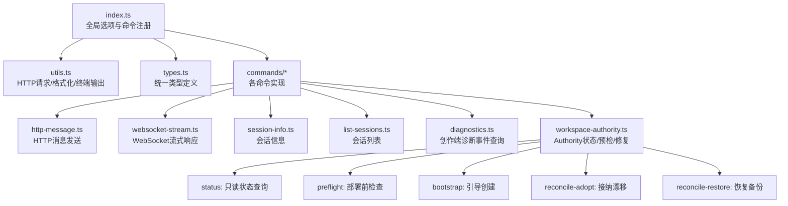
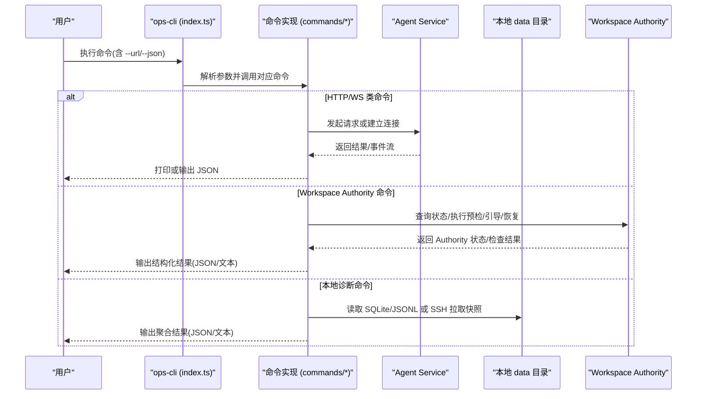
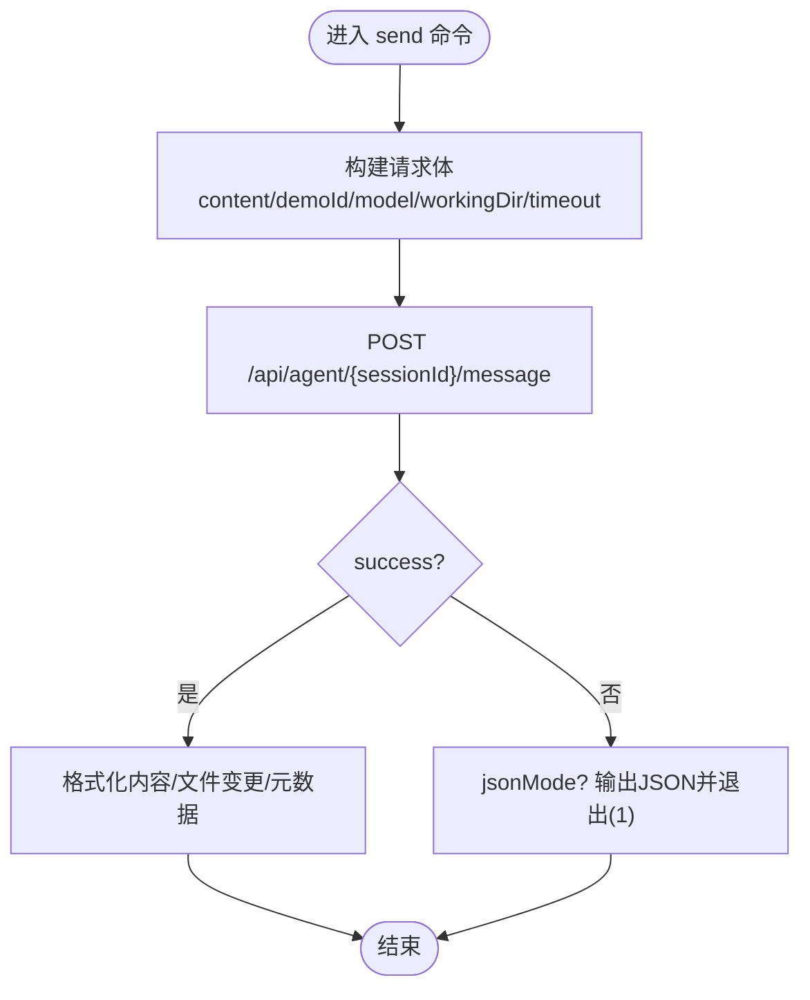
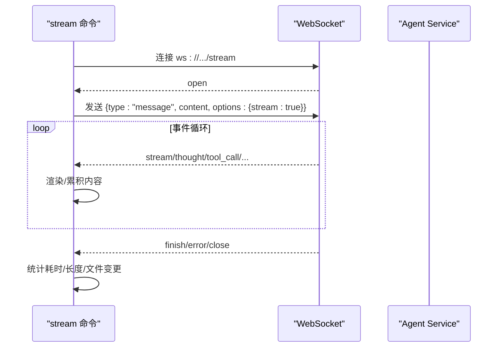
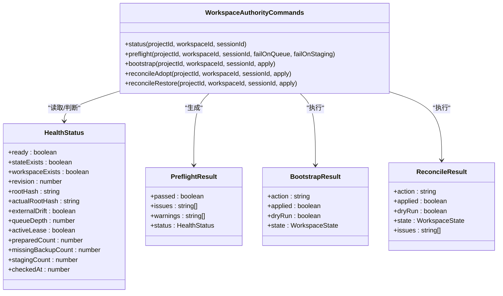
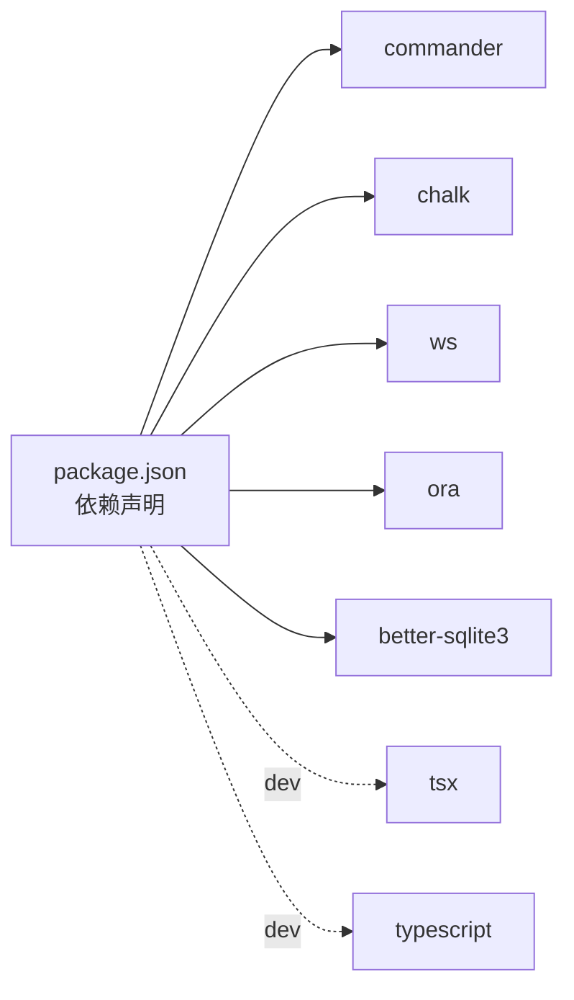

# CLI 工具概览

<cite>
**本文引用的文件**   
- [OPS/CLI/src/index.ts](file://OPS/CLI/src/index.ts)
- [OPS/CLI/src/types.ts](file://OPS/CLI/src/types.ts)
- [OPS/CLI/src/utils.ts](file://OPS/CLI/src/utils.ts)
- [OPS/CLI/src/commands/http-message.ts](file://OPS/CLI/src/commands/http-message.ts)
- [OPS/CLI/src/commands/websocket-stream.ts](file://OPS/CLI/src/commands/websocket-stream.ts)
- [OPS/CLI/src/commands/session-info.ts](file://OPS/CLI/src/commands/session-info.ts)
- [OPS/CLI/src/commands/list-sessions.ts](file://OPS/CLI/src/commands/list-sessions.ts)
- [OPS/CLI/src/commands/diagnostics.ts](file://OPS/CLI/src/commands/diagnostics.ts)
- [OPS/CLI/src/commands/workspace-authority.ts](file://OPS/CLI/src/commands/workspace-authority.ts)
- [OPS/CLI/src/commands/workspace-authority.test.ts](file://OPS/CLI/src/commands/workspace-authority.test.ts)
- [OPS/CLI/package.json](file://OPS/CLI/package.json)
- [OPS/CLI/README.md](file://OPS/CLI/README.md)
</cite>

## 更新摘要
**变更内容**   
- 新增 Workspace Authority 管理命令章节，详细说明状态监控、预检验证、引导操作和恢复工具
- 扩展架构总览图，增加 Workspace Authority 相关组件
- 更新核心组件分类，将 Workspace Authority 命令纳入统一管理
- 增强故障排查指南，包含 Authority 相关的常见问题和解决方案
- 完善快速开始指南，提供 Authority 命令的使用示例

## 目录
1. [简介](#简介)
2. [项目结构](#项目结构)
3. [核心组件](#核心组件)
4. [架构总览](#架构总览)
5. [详细组件分析](#详细组件分析)
6. [依赖关系分析](#依赖关系分析)
7. [性能与可观测性](#性能与可观测性)
8. [故障排查指南](#故障排查指南)
9. [结论](#结论)
10. [附录：快速开始与常用命令](#附录快速开始与常用命令)

## 简介
本概览面向 Workbench Platform 的 CLI 工具，聚焦其整体架构、设计理念与核心功能模块。文档重点说明命令行参数配置（--url、--json）、全局选项的作用与使用场景，解释该工具在开发、测试与运维工作流中的定位与价值，并提供快速开始指南、JSON 输出模式在自动化脚本中的应用方式，以及错误处理机制与调试技巧。

**更新** 新增了完整的 Workspace Authority 管理能力，包括状态监控、部署前检查、引导操作和冲突恢复等高级功能。

## 项目结构
CLI 工具位于 OPS/CLI 子包中，采用"入口注册 + 命令模块化"的组织方式：
- 入口文件负责声明全局选项、注册所有子命令，并将参数转发到具体命令实现。
- 每个命令以独立文件形式实现，便于扩展与维护。
- 类型定义与通用工具函数集中管理，保证一致性与复用性。

**图表来源**
- [OPS/CLI/src/index.ts:1-374](file://OPS/CLI/src/index.ts#L1-L374)
- [OPS/CLI/src/utils.ts:1-174](file://OPS/CLI/src/utils.ts#L1-L174)
- [OPS/CLI/src/types.ts:1-234](file://OPS/CLI/src/types.ts#L1-L234)
- [OPS/CLI/src/commands/workspace-authority.ts:1-620](file://OPS/CLI/src/commands/workspace-authority.ts#L1-L620)

**章节来源**
- [OPS/CLI/src/index.ts:1-374](file://OPS/CLI/src/index.ts#L1-L374)
- [OPS/CLI/src/utils.ts:1-174](file://OPS/CLI/src/utils.ts#L1-L174)
- [OPS/CLI/src/types.ts:1-234](file://OPS/CLI/src/types.ts#L1-L234)

## 核心组件
- 全局选项
  - --url：指定 Agent Service 地址，默认 http://localhost:3201。用于所有需要网络访问的命令。
  - --json：启用 JSON 输出模式，适合程序化解析与自动化集成。
- 命令分组
  - 健康与系统检查：health、system
  - 消息交互：send、stream、interactive
  - 会话管理：session、sessions、destroy
  - 诊断与排障：diagnose、logs、models、files、workspace*
  - 创作端诊断：diagnostics
  - **Workspace Authority 管理**：workspace-authority-status、workspace-authority-preflight、workspace-authority-bootstrap、workspace-authority-reconcile-adopt、workspace-authority-reconcile-restore

**更新** 新增了完整的 Workspace Authority 管理命令组，提供生产环境下的工作空间一致性保障能力。

**章节来源**
- [OPS/CLI/src/index.ts:26-374](file://OPS/CLI/src/index.ts#L26-L374)
- [OPS/CLI/README.md:1-676](file://OPS/CLI/README.md#L1-L676)

## 架构总览
CLI 作为轻量客户端，通过 HTTP 与 WebSocket 与 Agent Service 交互；部分本地诊断能力直接读取 data 目录下的 SQLite 与 JSONL 数据，支持远程拉取快照后离线分析。Workspace Authority 命令专门用于确保工作空间的一致性和完整性。

**图表来源**
- [OPS/CLI/src/index.ts:26-374](file://OPS/CLI/src/index.ts#L26-L374)
- [OPS/CLI/src/commands/http-message.ts:1-161](file://OPS/CLI/src/commands/http-message.ts#L1-L161)
- [OPS/CLI/src/commands/websocket-stream.ts:1-285](file://OPS/CLI/src/commands/websocket-stream.ts#L1-L285)
- [OPS/CLI/src/commands/diagnostics.ts:1-825](file://OPS/CLI/src/commands/diagnostics.ts#L1-L825)
- [OPS/CLI/src/commands/workspace-authority.ts:1-620](file://OPS/CLI/src/commands/workspace-authority.ts#L1-L620)

## 详细组件分析

### 全局选项与参数解析
- 全局选项
  - --url：设置 Agent Service 基础地址，所有网络命令均基于此拼接路径。
  - --json：切换为 JSON 输出模式，关闭彩色提示与加载动画，便于管道与脚本消费。
- 参数传递
  - index.ts 将 program.opts().url 与 getJsonMode() 透传到各命令实现，确保行为一致。

**章节来源**
- [OPS/CLI/src/index.ts:26-40](file://OPS/CLI/src/index.ts#L26-L40)
- [OPS/CLI/src/utils.ts:43-50](file://OPS/CLI/src/utils.ts#L43-L50)

### HTTP 消息发送（send）
- 功能：通过 /api/agent/{sessionId}/message 发送非流式消息，等待完整响应。
- 关键流程：构造请求体 -> 发起 fetch -> 解析 ApiResponse -> 根据 jsonMode 输出。
- 错误处理：区分服务端错误码与网络异常，提供常见原因与建议。

**图表来源**
- [OPS/CLI/src/commands/http-message.ts:1-161](file://OPS/CLI/src/commands/http-message.ts#L1-L161)
- [OPS/CLI/src/utils.ts:5-41](file://OPS/CLI/src/utils.ts#L5-L41)

**章节来源**
- [OPS/CLI/src/commands/http-message.ts:1-161](file://OPS/CLI/src/commands/http-message.ts#L1-L161)

### WebSocket 流式响应（stream）
- 功能：通过 ws://{baseUrl}/api/agent/{sessionId}/stream 建立长连接，实时接收 AI 回复片段。
- 事件类型：stream/status/thought/tool_call/tool_call_update/permission_request/finish/error 等。
- 超时控制：支持 --timeout，到达时间未完成则主动关闭连接并报告。

**图表来源**
- [OPS/CLI/src/commands/websocket-stream.ts:1-285](file://OPS/CLI/src/commands/websocket-stream.ts#L1-L285)

**章节来源**
- [OPS/CLI/src/commands/websocket-stream.ts:1-285](file://OPS/CLI/src/commands/websocket-stream.ts#L1-L285)

### 会话信息查询与管理
- session：获取单个会话详情（状态、后端、消息数、创建/活动时间、工作目录等）。
- sessions：分页列出活跃会话，支持按状态过滤。
- destroy：销毁指定会话释放资源。

**章节来源**
- [OPS/CLI/src/commands/session-info.ts:1-78](file://OPS/CLI/src/commands/session-info.ts#L1-L78)
- [OPS/CLI/src/commands/list-sessions.ts:1-121](file://OPS/CLI/src/commands/list-sessions.ts#L1-L121)
- [OPS/CLI/src/index.ts:108-144](file://OPS/CLI/src/index.ts#L108-L144)

### 创作端诊断事件查询（diagnostics）
- 数据来源
  - 主账本：data/diagnostics/editor-events.db（SQLite）
  - 兜底/补充：data/editor-diagnostics/*.jsonl
  - 可选：通过 SSH 拉取远程 data 目录快照后本地解析
- 能力
  - 多条件筛选：project/session/workspace/editorSession/trace/operation/since/limit
  - 专项查询：autosave/collab/preview/project/export
  - 输出：JSON（默认）或 text（人类可读时间线）
  - 指标：按事件组聚合 workspace flows 与性能分位值
- 远程模式
  - 仅读取 diagnostics/editor-events.db*、editor-diagnostics/ 与 agent-run-logs/，不修改生产数据
  - 密码通过环境变量传入，避免写入命令历史或仓库

**章节来源**
- [OPS/CLI/src/commands/diagnostics.ts:1-825](file://OPS/CLI/src/commands/diagnostics.ts#L1-L825)
- [OPS/CLI/README.md:230-287](file://OPS/CLI/README.md#L230-L287)

### Workspace Authority 管理命令

#### 状态监控（workspace-authority-status）
- 功能：只读查询 Workspace Authority 的健康状态，包括 ready 标志、revision、rootHash、queue 深度、lease 状态等。
- 安全特性：需要有效的编辑 Session ID 进行权限校验，不会触发任何写操作。
- 输出格式：支持 JSON 和文本两种格式，JSON 模式适合自动化集成。

#### 部署前检查（workspace-authority-preflight）
- 功能：将 health 状态转换为机器可消费的 passed/issues 结果，用于 CI/CD 门禁。
- 阻断条件：Workspace 缺失、Authority state 缺失、external drift、active lease、prepared 事务、committed backup 不完整。
- 可选策略：支持 --fail-on-queue 和 --fail-on-staging 将队列积压和 staging 文件也纳入阻断项。

#### 引导操作（workspace-authority-bootstrap）
- 功能：创建 Authority state，初始化工作空间的版本控制元数据。
- 安全设计：默认 dry-run 模式，只有显式添加 --apply 才会执行实际创建。
- 幂等性：已存在的 state 会返回 already_bootstrapped，避免重复创建。

#### 冲突恢复工具
- reconcile-adopt：接纳当前磁盘内容为新 revision，解决 external drift 问题。
- reconcile-restore：从 committed backup 恢复最后一致的内容，丢弃外部漂移。
- 安全保护：restore 操作在 committed backup 缺失时会返回阻断结果，不会静默 adopt。

**图表来源**
- [OPS/CLI/src/commands/workspace-authority.ts:1-620](file://OPS/CLI/src/commands/workspace-authority.ts#L1-L620)
- [OPS/CLI/src/types.ts:68-92](file://OPS/CLI/src/types.ts#L68-L92)

**章节来源**
- [OPS/CLI/src/commands/workspace-authority.ts:1-620](file://OPS/CLI/src/commands/workspace-authority.ts#L1-L620)
- [OPS/CLI/src/types.ts:68-92](file://OPS/CLI/src/types.ts#L68-L92)
- [OPS/CLI/src/commands/workspace-authority.test.ts:1-493](file://OPS/CLI/src/commands/workspace-authority.test.ts#L1-L493)

## 依赖关系分析
- 运行时依赖
  - commander：命令行框架
  - chalk：终端彩色输出
  - ws：WebSocket 客户端
  - ora：加载动画
  - better-sqlite3：本地 SQLite 只读查询
- 开发依赖
  - tsx：TypeScript 执行器
  - typescript：类型检查与编译

**图表来源**
- [OPS/CLI/package.json:1-28](file://OPS/CLI/package.json#L1-L28)

**章节来源**
- [OPS/CLI/package.json:1-28](file://OPS/CLI/package.json#L1-L28)

## 性能与可观测性
- 流式响应
  - stream 命令对事件进行增量渲染，减少首屏延迟，提升交互体验。
- 诊断指标
  - diagnostics 命令聚合 autosave debounce wait、queue wait、commit latency、remote update latency、draft preview latency、projection latency、reconnect convergence、canonical lag 等指标的分位统计，便于定位瓶颈。
- 日志采集
  - logs 命令支持按级别与关键字过滤，结合 --lines 限制输出规模，降低 IO 压力。
- **Authority 监控**
  - status 命令提供详细的 health 指标，包括 queueDepth、preparedCount、missingBackupCount 等关键状态。
  - preflight 命令提供快速的一致性检查，适合在部署流水线中频繁执行。

**更新** 新增了 Workspace Authority 相关的性能监控和可观测性能力。

**章节来源**
- [OPS/CLI/src/commands/websocket-stream.ts:1-285](file://OPS/CLI/src/commands/websocket-stream.ts#L1-L285)
- [OPS/CLI/src/commands/diagnostics.ts:610-637](file://OPS/CLI/src/commands/diagnostics.ts#L610-L637)
- [OPS/CLI/src/index.ts:167-184](file://OPS/CLI/src/index.ts#L167-L184)
- [OPS/CLI/src/commands/workspace-authority.ts:108-197](file://OPS/CLI/src/commands/workspace-authority.ts#L108-L197)

## 故障排查指南
- 常见问题
  - Agent Service 不可用：确认服务已启动且 --url 正确；使用 health 命令验证连通性。
  - No active session：会话未初始化或失效；使用 diagnose 发送测试消息定位失败点，或更换新的 sessionId。
  - INTERNAL_ERROR：服务器内部错误；查看 agent-service 日志并结合 diagnose 输出进一步分析。
  - WebSocket 连接失败：检查路由与服务状态；必要时回退到 HTTP 模式。
- **Workspace Authority 相关问题**
  - external drift detected：工作空间内容与 Authority state 不一致，使用 reconcile-adopt 或 reconcile-restore 修复。
  - active or stale write lease exists：存在活跃的写锁，等待其他进程完成或手动清理。
  - prepared transactions need recovery：存在待恢复的事务，重启服务自动处理或手动干预。
  - committed backups are incomplete：备份文件缺失或损坏，使用 migrate 命令修复或重新 bootstrap。
- 调试技巧
  - 使用 --json 输出结构化结果，便于 grep/jq 处理。
  - 使用 diagnostics 命令导出 JSON 复现包，包含事件、flows 与性能指标。
  - 对于远程环境，通过 --remote-host 配合环境变量安全地拉取快照进行分析。
  - **Authority 调试**：先使用 status 查看详细状态，再用 preflight 确定阻断原因，最后选择合适的修复命令。

**更新** 新增了 Workspace Authority 相关的故障排查指南和调试技巧。

**章节来源**
- [OPS/CLI/README.md:543-605](file://OPS/CLI/README.md#L543-L605)
- [OPS/CLI/src/commands/diagnostics.ts:768-825](file://OPS/CLI/src/commands/diagnostics.ts#L768-L825)
- [OPS/CLI/src/commands/workspace-authority.ts:37-67](file://OPS/CLI/src/commands/workspace-authority.ts#L37-L67)

## 结论
该 CLI 工具围绕"快速验证、精准诊断、可自动化"的目标设计，覆盖从端到端消息交互到创作端事件溯源的全链路能力。通过统一的 --url 与 --json 全局选项，既满足交互式调试，也无缝融入 CI/CD 与运维流水线。**新增的 Workspace Authority 系列命令为发布、导出、模板与部署前检查提供了强一致性的前置保障，确保生产环境的工作空间状态可靠可控。**

**更新** 强调了 Workspace Authority 功能在生产环境中的重要价值和作用。

## 附录：快速开始与常用命令

### 安装与运行
- 安装依赖
  - 在项目根目录执行 pnpm install（参考 README 安装步骤）
- 启动 Agent Service
  - 使用 pnpm dev:agent 启动服务，默认监听 http://localhost:3201
- 健康检查
  - 使用 pnpm dev health 验证服务可用性

**章节来源**
- [OPS/CLI/README.md:1-60](file://OPS/CLI/README.md#L1-L60)

### 基本使用示例
- 发送消息（HTTP）
  - pnpm dev send "test-session" "你好"
- 流式对话（WebSocket）
  - pnpm dev stream "test-session" "你好"
- 查看会话信息
  - pnpm dev session "test-session"
- 列出会话
  - pnpm dev sessions
- 销毁会话
  - pnpm dev destroy "test-session"

**章节来源**
- [OPS/CLI/README.md:61-206](file://OPS/CLI/README.md#L61-L206)

### Workspace Authority 常用命令
- 检查工作空间状态
  - corepack pnpm workspace-authority:status -- "project-1" "live-1" --session "session-1" --json
- 执行部署前检查
  - corepack pnpm workspace-authority:preflight -- "project-1" "live-1" --session "session-1" --json
- 引导新工作空间
  - corepack pnpm workspace-authority:bootstrap -- "project-1" "live-1" --session "session-1" --apply --json
- 解决外部漂移
  - corepack pnpm workspace-authority:reconcile-adopt -- "project-1" "live-1" --session "session-1" --apply --json
- 恢复到一致状态
  - corepack pnpm workspace-authority:reconcile-restore -- "project-1" "live-1" --session "session-1" --apply --json

**更新** 新增了 Workspace Authority 命令的快速使用示例。

**章节来源**
- [OPS/CLI/README.md:289-391](file://OPS/CLI/README.md#L289-L391)

### 常用命令组合
- 诊断"No active session"
  - pnpm dev health
  - pnpm dev diagnose "your-session-id" -m "测试"
  - pnpm dev stream "new-session" "测试消息"
- 检查工作目录
  - pnpm dev send "session-1" "修改代码" -w "/path/to/project"
  - pnpm dev session "session-1"
- 清理资源
  - pnpm dev sessions
  - pnpm dev destroy "session-1"
- **Workspace Authority 工作流**
  - 状态检查：workspace-authority:status --json
  - 预检验证：workspace-authority:preflight --json
  - 问题解决：根据 issues 选择相应的修复命令

**更新** 新增了 Workspace Authority 的完整工作流程示例。

**章节来源**
- [OPS/CLI/README.md:493-539](file://OPS/CLI/README.md#L493-L539)
- [OPS/CLI/README.md:289-391](file://OPS/CLI/README.md#L289-L391)

### JSON 输出模式在自动化中的应用
- 开启 JSON 模式
  - 在所有命令后追加 --json，例如：
    - ops-cli --url http://localhost:3201 --json health
    - ops-cli --url http://localhost:3201 --json send "sid" "msg"
- 典型用法
  - 在脚本中通过 jq 提取字段，如 success、duration、error.code/message
  - 在 CI 中根据 exit code 与 JSON 字段判定任务成败
  - 将 diagnostics 的 JSON 结果持久化，作为问题复现包归档
- **Workspace Authority 自动化**
  - 在部署流水线中集成 preflight 检查，确保工作空间一致性
  - 使用 status 命令监控生产环境的 Authority 健康状态
  - 结合告警系统，当检测到 external drift 或 missing backups 时自动通知

**更新** 新增了 Workspace Authority 在自动化场景中的应用方式。

**章节来源**
- [OPS/CLI/src/index.ts:32-37](file://OPS/CLI/src/index.ts#L32-L37)
- [OPS/CLI/src/utils.ts:48-50](file://OPS/CLI/src/utils.ts#L48-50)
- [OPS/CLI/src/commands/http-message.ts:62-71](file://OPS/CLI/src/commands/http-message.ts#L62-L71)
- [OPS/CLI/src/commands/websocket-stream.ts:178-208](file://OPS/CLI/src/commands/websocket-stream.ts#L178-L208)
- [OPS/CLI/src/commands/diagnostics.ts:768-825](file://OPS/CLI/src/commands/diagnostics.ts#L768-L825)
- [OPS/CLI/README.md:321-351](file://OPS/CLI/README.md#L321-L351)