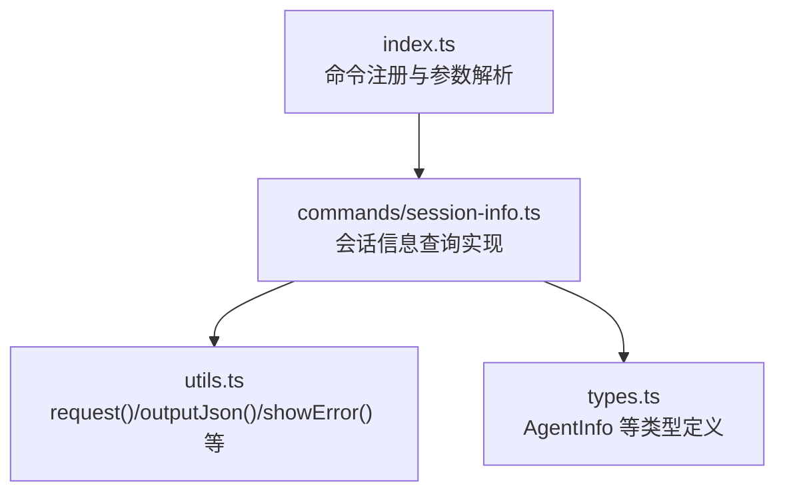
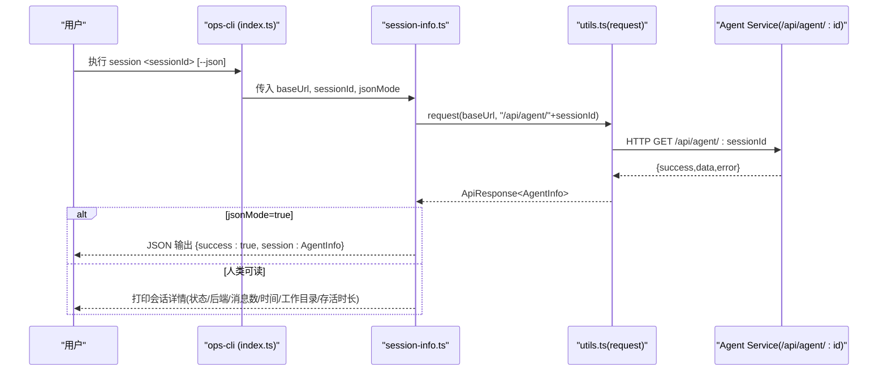
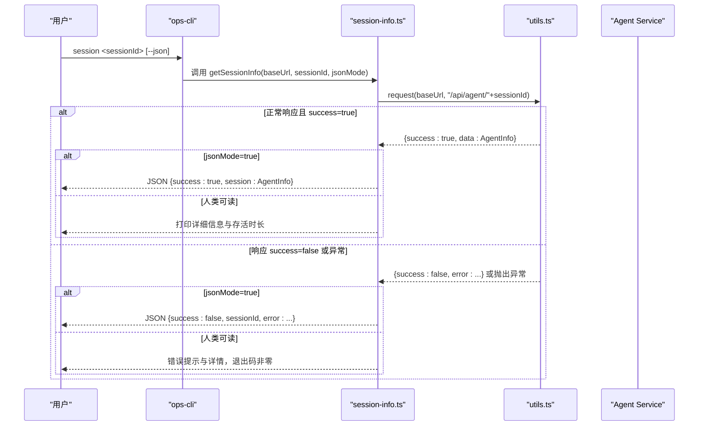
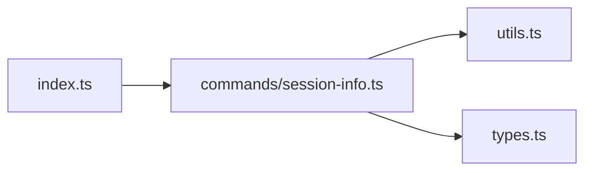

# 会话信息查询命令

<cite>
**本文引用的文件**   
- [OPS/CLI/src/index.ts](file://OPS/CLI/src/index.ts)
- [OPS/CLI/src/commands/session-info.ts](file://OPS/CLI/src/commands/session-info.ts)
- [OPS/CLI/src/types.ts](file://OPS/CLI/src/types.ts)
- [OPS/CLI/src/utils.ts](file://OPS/CLI/src/utils.ts)
- [OPS/CLI/README.md](file://OPS/CLI/README.md)
</cite>

## 目录
1. [简介](#简介)
2. [项目结构](#项目结构)
3. [核心组件](#核心组件)
4. [架构总览](#架构总览)
5. [详细组件分析](#详细组件分析)
6. [依赖分析](#依赖分析)
7. [性能考虑](#性能考虑)
8. [故障排查指南](#故障排查指南)
9. [结论](#结论)
10. [附录](#附录)

## 简介
本章节面向使用 ops-cli 的运维与开发者，聚焦“会话信息查询”能力。通过该命令可查询指定会话的详细信息，包括：
- 会话状态（如 ready、processing、error、initializing、destroyed）
- 后端类型（backend）
- 消息数量（messageCount）
- 创建时间（createdAt）
- 最后活动时间（lastActivityAt）
- 工作目录（workingDir，可选）
- 会话存活时长（由 createdAt 与 lastActivityAt 计算得出）

同时提供人类可读输出与 JSON 格式输出两种模式，便于人工查看或程序化解析。

## 项目结构
ops-cli 采用模块化组织方式：
- 入口与命令注册：index.ts
- 具体命令实现：commands/*.ts
- 公共类型定义：types.ts
- 通用工具函数：utils.ts（HTTP 请求、JSON 输出、错误提示、格式化等）

图表来源
- [OPS/CLI/src/index.ts:108-113](file://OPS/CLI/src/index.ts#L108-L113)
- [OPS/CLI/src/commands/session-info.ts:1-78](file://OPS/CLI/src/commands/session-info.ts#L1-L78)
- [OPS/CLI/src/utils.ts:1-174](file://OPS/CLI/src/utils.ts#L1-L174)
- [OPS/CLI/src/types.ts:31-46](file://OPS/CLI/src/types.ts#L31-L46)

章节来源
- [OPS/CLI/src/index.ts:1-374](file://OPS/CLI/src/index.ts#L1-L374)
- [OPS/CLI/src/commands/session-info.ts:1-78](file://OPS/CLI/src/commands/session-info.ts#L1-L78)
- [OPS/CLI/src/types.ts:1-234](file://OPS/CLI/src/types.ts#L1-L234)
- [OPS/CLI/src/utils.ts:1-174](file://OPS/CLI/src/utils.ts#L1-L174)

## 核心组件
- 命令入口与参数解析
  - 全局选项：--url（默认 http://localhost:3201）、--json（启用 JSON 输出）
  - 子命令：session <sessionId>
- 会话信息查询实现
  - 调用 /api/agent/<sessionId> 获取 AgentInfo
  - 根据 --json 决定输出为 JSON 或人类可读文本
  - 计算并展示会话存活时长
- 类型与工具
  - AgentInfo：包含 sessionId、status、backend、createdAt、lastActivityAt、messageCount、workingDir
  - request：封装 fetch 请求，统一返回 ApiResponse<T>
  - outputJson/showError/formatDuration：输出与格式化辅助

章节来源
- [OPS/CLI/src/index.ts:28-37](file://OPS/CLI/src/index.ts#L28-L37)
- [OPS/CLI/src/index.ts:108-113](file://OPS/CLI/src/index.ts#L108-L113)
- [OPS/CLI/src/commands/session-info.ts:5-60](file://OPS/CLI/src/commands/session-info.ts#L5-L60)
- [OPS/CLI/src/types.ts:31-46](file://OPS/CLI/src/types.ts#L31-L46)
- [OPS/CLI/src/utils.ts:5-41](file://OPS/CLI/src/utils.ts#L5-L41)
- [OPS/CLI/src/utils.ts:48-99](file://OPS/CLI/src/utils.ts#L48-L99)

## 架构总览
下图展示了从命令行到服务端的数据流与处理逻辑。

图表来源
- [OPS/CLI/src/index.ts:108-113](file://OPS/CLI/src/index.ts#L108-L113)
- [OPS/CLI/src/commands/session-info.ts:5-60](file://OPS/CLI/src/commands/session-info.ts#L5-L60)
- [OPS/CLI/src/utils.ts:5-41](file://OPS/CLI/src/utils.ts#L5-L41)

## 详细组件分析

### 命令参数与用法
- 全局选项
  - -u, --url <url>：Agent Service 地址，默认 http://localhost:3201
  - --json：以 JSON 格式输出（供程序化解析）
- 子命令
  - session <sessionId>：获取指定会话的详细信息

示例（来自 README）：
- pnpm dev session "session-1"
- pnpm dev session "session-1" --json

章节来源
- [OPS/CLI/src/index.ts:28-37](file://OPS/CLI/src/index.ts#L28-L37)
- [OPS/CLI/src/index.ts:108-113](file://OPS/CLI/src/index.ts#L108-L113)
- [OPS/CLI/README.md:140-164](file://OPS/CLI/README.md#L140-L164)

### 数据模型（AgentInfo）
- sessionId：字符串
- status：字符串（ready/processing/error/initializing/destroyed 等）
- backend：字符串（后端类型标识）
- createdAt：ISO 时间字符串
- lastActivityAt：ISO 时间字符串
- messageCount：数字
- workingDir：可选字符串（工作目录路径）

章节来源
- [OPS/CLI/src/types.ts:31-46](file://OPS/CLI/src/types.ts#L31-L46)

### 输出格式说明
- 人类可读模式（默认）
  - 标题与成功提示
  - 字段列表：会话 ID、状态（带颜色）、后端、消息数量、创建时间、最后活动、工作目录（若存在）、会话存活时间（基于两个时间戳差值计算）
- JSON 模式（--json）
  - 成功：{ success: true, session: AgentInfo }
  - 失败：{ success: false, sessionId, error: ... }

章节来源
- [OPS/CLI/src/commands/session-info.ts:23-49](file://OPS/CLI/src/commands/session-info.ts#L23-L49)
- [OPS/CLI/src/commands/session-info.ts:12-19](file://OPS/CLI/src/commands/session-info.ts#L12-L19)
- [OPS/CLI/src/utils.ts:48-50](file://OPS/CLI/src/utils.ts#L48-L50)

### 错误处理机制
- 网络或服务端错误
  - request 将非 2xx 响应包装为 { success: false, error: { code, message, details? } }
  - 在人类可读模式下，显示错误代码与信息；在 JSON 模式下输出结构化错误对象
- 异常捕获
  - try/catch 包裹请求与后续处理，确保在异常时也能输出错误信息并退出进程（非 JSON 模式）
- 状态颜色映射
  - 不同 status 对应不同终端颜色，便于快速识别

章节来源
- [OPS/CLI/src/utils.ts:5-41](file://OPS/CLI/src/utils.ts#L5-L41)
- [OPS/CLI/src/commands/session-info.ts:12-19](file://OPS/CLI/src/commands/session-info.ts#L12-L19)
- [OPS/CLI/src/commands/session-info.ts:50-59](file://OPS/CLI/src/commands/session-info.ts#L50-L59)
- [OPS/CLI/src/commands/session-info.ts:62-77](file://OPS/CLI/src/commands/session-info.ts#L62-L77)

### 关键流程时序图（含错误分支）

图表来源
- [OPS/CLI/src/commands/session-info.ts:5-60](file://OPS/CLI/src/commands/session-info.ts#L5-L60)
- [OPS/CLI/src/utils.ts:5-41](file://OPS/CLI/src/utils.ts#L5-L41)

## 依赖分析
- 外部依赖
  - commander：命令行框架，用于注册命令与解析参数
  - chalk：终端彩色输出
  - ora：加载动画（在 JSON 模式下禁用）
  - tsx：TypeScript 执行器
- 内部依赖
  - index.ts 导入并注册 session-info 命令
  - session-info.ts 依赖 utils.ts 的 request/outputJson/showError/formatDuration
  - types.ts 提供 AgentInfo 等类型约束

图表来源
- [OPS/CLI/src/index.ts:1-25](file://OPS/CLI/src/index.ts#L1-L25)
- [OPS/CLI/src/commands/session-info.ts:1-4](file://OPS/CLI/src/commands/session-info.ts#L1-L4)
- [OPS/CLI/src/utils.ts:1-4](file://OPS/CLI/src/utils.ts#L1-L4)
- [OPS/CLI/src/types.ts:1-9](file://OPS/CLI/src/types.ts#L1-L9)

章节来源
- [OPS/CLI/src/index.ts:1-374](file://OPS/CLI/src/index.ts#L1-L374)
- [OPS/CLI/src/commands/session-info.ts:1-78](file://OPS/CLI/src/commands/session-info.ts#L1-L78)
- [OPS/CLI/src/utils.ts:1-174](file://OPS/CLI/src/utils.ts#L1-L174)
- [OPS/CLI/src/types.ts:1-234](file://OPS/CLI/src/types.ts#L1-L234)

## 性能考虑
- 单次查询：仅一次 HTTP GET 请求，开销较小
- JSON 模式：避免终端渲染开销，适合自动化脚本
- 存活时长计算：基于本地时间戳差值，无额外 IO
- 建议
  - 批量巡检场景优先使用 --json 输出，配合管道或日志系统
  - 在高并发环境下，合理设置服务端的连接池与超时策略

[本节为通用指导，不直接分析具体文件]

## 故障排查指南
- 常见问题与定位
  - 服务不可用或地址错误：检查 --url 是否正确，先运行 health 确认服务可达
  - 会话不存在或无效：确认 sessionId 是否有效，必要时新建会话
  - 服务器内部错误：结合 diagnose 命令与 agent-service 日志进一步定位
- 诊断步骤
  - 使用 health 检查服务状态
  - 使用 diagnose 发送测试消息进行深度诊断
  - 使用 sessions 列出活跃会话，筛选问题会话
  - 使用 destroy 清理异常会话释放资源
- 常见错误场景
  - HTTP 错误（非 2xx）：request 会返回 { success: false, error }，在 JSON 模式下可直接解析
  - 网络异常：try/catch 捕获后输出错误详情并退出（非 JSON 模式）

章节来源
- [OPS/CLI/README.md:543-604](file://OPS/CLI/README.md#L543-L604)
- [OPS/CLI/src/utils.ts:5-41](file://OPS/CLI/src/utils.ts#L5-L41)
- [OPS/CLI/src/commands/session-info.ts:50-59](file://OPS/CLI/src/commands/session-info.ts#L50-L59)

## 结论
会话信息查询命令提供了简洁而强大的能力，既能满足日常运维查看需求，也支持 JSON 输出用于自动化集成。通过清晰的参数设计、稳定的错误处理与友好的输出格式，能够快速定位会话状态与元数据，提升排障效率。

[本节为总结性内容，不直接分析具体文件]

## 附录

### 使用示例
- 基本查询
  - pnpm dev session "session-1"
- JSON 输出
  - pnpm dev session "session-1" --json
- 指定服务地址
  - pnpm dev -u http://your-agent-service:3201 session "session-1"

章节来源
- [OPS/CLI/README.md:140-164](file://OPS/CLI/README.md#L140-L164)
- [OPS/CLI/src/index.ts:28-37](file://OPS/CLI/src/index.ts#L28-L37)

### 最佳实践建议
- 在脚本中统一使用 --json 输出，便于解析与告警
- 结合 sessions 命令定期巡检，发现长时间 idle 或 error 状态的会话
- 对重要任务会话，记录其 sessionId 与 workingDir，便于回溯
- 在 CI/CD 环境中，使用 --url 指向目标环境的服务地址，避免硬编码

[本节为通用指导，不直接分析具体文件]