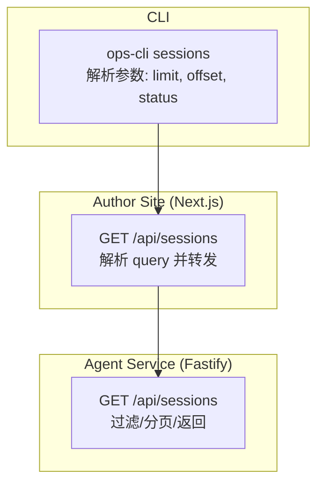
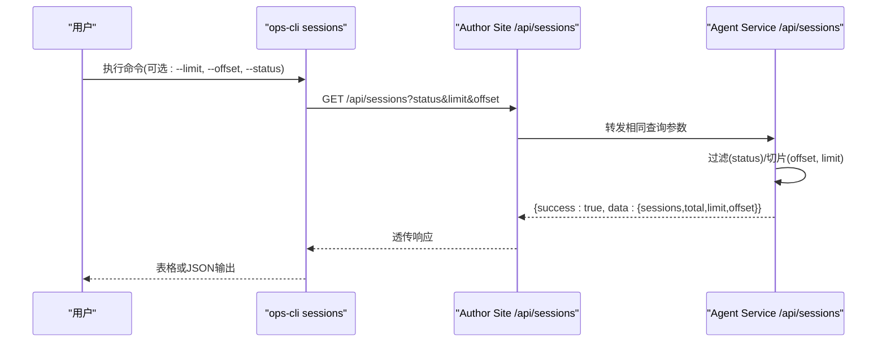
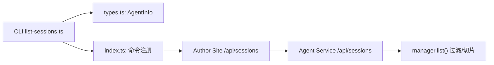

# 会话列表查询命令

<cite>
**本文引用的文件**   
- [OPS/CLI/src/commands/list-sessions.ts](file://OPS/CLI/src/commands/list-sessions.ts)
- [OPS/CLI/src/index.ts](file://OPS/CLI/src/index.ts)
- [OPS/CLI/src/types.ts](file://OPS/CLI/src/types.ts)
- [packages/agent-service/src/routes/agent.ts](file://packages/agent-service/src/routes/agent.ts)
- [packages/author-site/src/app/api/sessions/route.ts](file://packages/author-site/src/app/api/sessions/route.ts)
- [packages/agent-client/src/types.ts](file://packages/agent-client/src/types.ts)
</cite>

## 目录
1. [简介](#简介)
2. [项目结构](#项目结构)
3. [核心组件](#核心组件)
4. [架构总览](#架构总览)
5. [详细组件分析](#详细组件分析)
6. [依赖关系分析](#依赖关系分析)
7. [性能与分页优化](#性能与分页优化)
8. [故障排查指南](#故障排查指南)
9. [结论](#结论)
10. [附录：参数、返回结构与示例](#附录参数返回结构与示例)

## 简介
本文件为“list-sessions”命令的权威文档，聚焦于如何获取所有活跃会话的列表信息。内容涵盖：
- 命令参数选项（baseUrl、statusFilter、limit、offset）
- 分页查询、状态过滤与排序说明
- 返回数据结构（每个会话的基本信息与统计字段）
- 不同过滤条件下的查询示例
- 批量操作与自动化脚本集成建议
- 性能优化与常见问题排查

## 项目结构
该功能由 CLI 层、Web API 路由层与 Agent Service 后端共同实现：
- CLI 层负责解析命令行参数并调用 /api/sessions
- Web API 路由转发请求到 agent-service
- Agent Service 提供 /api/sessions 接口，支持 status、limit、offset 参数

图表来源
- [OPS/CLI/src/index.ts:115-134](file://OPS/CLI/src/index.ts#L115-L134)
- [packages/author-site/src/app/api/sessions/route.ts:181-210](file://packages/author-site/src/app/api/sessions/route.ts#L181-L210)
- [packages/agent-service/src/routes/agent.ts:343-366](file://packages/agent-service/src/routes/agent.ts#L343-L366)

章节来源
- [OPS/CLI/src/index.ts:115-134](file://OPS/CLI/src/index.ts#L115-L134)
- [packages/author-site/src/app/api/sessions/route.ts:181-210](file://packages/author-site/src/app/api/sessions/route.ts#L181-L210)
- [packages/agent-service/src/routes/agent.ts:343-366](file://packages/agent-service/src/routes/agent.ts#L343-L366)

## 核心组件
- CLI 命令入口：注册 sessions 子命令，解析 -l/--limit、-o/--offset、-s/--status 等参数，并调用 listSessions 函数
- 列表逻辑：构建 URLSearchParams，发起 GET /api/sessions?status&limit&offset，处理成功/失败响应，并以表格或 JSON 输出
- Web API 路由：解析查询参数，调用 agentClient.listSessions，统一包装为 success/data/error 格式
- Agent Service 路由：读取 manager.list()，按 status 过滤，按 offset/limit 切片，返回 total、limit、offset 与 sessions 数组

章节来源
- [OPS/CLI/src/index.ts:115-134](file://OPS/CLI/src/index.ts#L115-L134)
- [OPS/CLI/src/commands/list-sessions.ts:11-99](file://OPS/CLI/src/commands/list-sessions.ts#L11-L99)
- [packages/author-site/src/app/api/sessions/route.ts:181-210](file://packages/author-site/src/app/api/sessions/route.ts#L181-L210)
- [packages/agent-service/src/routes/agent.ts:343-366](file://packages/agent-service/src/routes/agent.ts#L343-L366)

## 架构总览
下图展示了从 CLI 到 Agent Service 的完整调用链与数据流转。

图表来源
- [OPS/CLI/src/commands/list-sessions.ts:19-31](file://OPS/CLI/src/commands/list-sessions.ts#L19-L31)
- [packages/author-site/src/app/api/sessions/route.ts:181-210](file://packages/author-site/src/app/api/sessions/route.ts#L181-L210)
- [packages/agent-service/src/routes/agent.ts:343-366](file://packages/agent-service/src/routes/agent.ts#L343-L366)

## 详细组件分析

### CLI 命令：sessions
- 参数定义
  - -l, --limit <n>：限制返回数量，默认 50
  - -o, --offset <n>：偏移量，默认 0
  - -s, --status <status>：按状态过滤
- 行为
  - 将 baseUrl 与参数拼接为 /api/sessions?status&limit&offset
  - 非 JSON 模式：以表格形式展示序号、会话ID、状态、后端、消息数、最后活动时间
  - JSON 模式：输出 { success, total, sessions } 或错误对象
  - 错误时：JSON 模式输出错误；非 JSON 模式打印错误并退出进程

章节来源
- [OPS/CLI/src/index.ts:115-134](file://OPS/CLI/src/index.ts#L115-L134)
- [OPS/CLI/src/commands/list-sessions.ts:11-99](file://OPS/CLI/src/commands/list-sessions.ts#L11-L99)

### Web API 路由：/api/sessions (Author Site)
- 解析查询参数：status、limit、offset
- 调用 agentClient.listSessions({ status, limit, offset })
- 成功：返回 createApiSuccess(result.data)
- 失败：返回 createApiError("AGENT_SERVICE_ERROR", result.error.message)

章节来源
- [packages/author-site/src/app/api/sessions/route.ts:181-210](file://packages/author-site/src/app/api/sessions/route.ts#L181-L210)

### Agent Service 路由：/api/sessions
- 读取 manager.list() 得到全部会话
- 若传入 status，则过滤出 s.status === status 的会话
- 使用 offset 和 limit 进行切片：filtered.slice(offsetNum, offsetNum + limitNum)
- 返回：
  - success: true
  - data.sessions: 当前页会话数组
  - data.total: 过滤后的总数
  - data.limit: 本次请求的 limit
  - data.offset: 本次请求的 offset

章节来源
- [packages/agent-service/src/routes/agent.ts:343-366](file://packages/agent-service/src/routes/agent.ts#L343-L366)

### 数据类型与状态
- AgentInfo 字段
  - sessionId：会话唯一标识
  - status：会话状态枚举
  - backend：后端类型（如 pi-agent）
  - createdAt：创建时间字符串
  - lastActivityAt：最后活动时间字符串
  - messageCount：消息计数
  - workingDir：工作目录（可选）
- AgentStatus 取值
  - initializing、ready、processing、error、destroyed

章节来源
- [OPS/CLI/src/types.ts:31-39](file://OPS/CLI/src/types.ts#L31-L39)
- [packages/agent-client/src/types.ts:3-8](file://packages/agent-client/src/types.ts#L3-L8)
- [packages/agent-client/src/types.ts:129-137](file://packages/agent-client/src/types.ts#L129-L137)

## 依赖关系分析
- CLI 依赖 types 中的 AgentInfo 用于类型提示与输出
- Author Site 路由通过 agentClient 与 Agent Service 通信
- Agent Service 路由直接基于内存管理器列出会话并进行过滤与分页

图表来源
- [OPS/CLI/src/commands/list-sessions.ts:1-3](file://OPS/CLI/src/commands/list-sessions.ts#L1-L3)
- [OPS/CLI/src/types.ts:31-39](file://OPS/CLI/src/types.ts#L31-L39)
- [packages/author-site/src/app/api/sessions/route.ts:181-210](file://packages/author-site/src/app/api/sessions/route.ts#L181-L210)
- [packages/agent-service/src/routes/agent.ts:343-366](file://packages/agent-service/src/routes/agent.ts#L343-L366)

章节来源
- [OPS/CLI/src/commands/list-sessions.ts:1-3](file://OPS/CLI/src/commands/list-sessions.ts#L1-L3)
- [OPS/CLI/src/types.ts:31-39](file://OPS/CLI/src/types.ts#L31-L39)
- [packages/author-site/src/app/api/sessions/route.ts:181-210](file://packages/author-site/src/app/api/sessions/route.ts#L181-L210)
- [packages/agent-service/src/routes/agent.ts:343-366](file://packages/agent-service/src/routes/agent.ts#L343-L366)

## 性能与分页优化
- 合理设置 limit：避免一次拉取过多数据导致网络与渲染压力
- 使用 offset 分页：结合 total 计算页数，逐页加载
- 使用 status 过滤：在服务器端减少不必要的数据传输
- 注意：当前实现未提供排序参数，如需排序可在客户端对返回结果进行二次排序

[本节为通用指导，不直接分析具体文件]

## 故障排查指南
- 常见错误码与含义
  - SESSION_NOT_FOUND：会话不存在
  - INVALID_PARAMS：参数无效
  - FILE_ACCESS_DENIED：路径访问受限
  - RATE_LIMIT_EXCEEDED：速率限制
  - INTERNAL_ERROR：内部错误
- 定位步骤
  - 确认 baseUrl 正确且可达
  - 检查 status 值是否为有效枚举之一
  - 校验 limit/offset 为非负整数
  - 查看 JSON 模式下的 error.code 与 error.message
  - 若 Author Site 报错 AGENT_SERVICE_ERROR，需进一步检查 Agent Service 日志

章节来源
- [packages/agent-client/src/types.ts:10-18](file://packages/agent-client/src/types.ts#L10-L18)
- [packages/author-site/src/app/api/sessions/route.ts:195-209](file://packages/author-site/src/app/api/sessions/route.ts#L195-L209)
- [packages/agent-service/src/routes/agent.ts:343-366](file://packages/agent-service/src/routes/agent.ts#L343-L366)

## 结论
list-sessions 命令提供了简洁高效的会话列表查询能力，支持状态过滤与分页。通过合理的 limit/offset 与 status 组合，可以在大规模会话场景下获得良好的性能与可维护性。建议在自动化脚本中优先采用 JSON 模式输出，并结合状态过滤与分页策略进行批处理。

[本节为总结性内容，不直接分析具体文件]

## 附录：参数、返回结构与示例

### 命令参数
- baseUrl：全局基础地址（通过 ops-cli 全局选项传入）
- statusFilter：对应 -s/--status，用于按状态过滤
- limit：对应 -l/--limit，默认 50
- offset：对应 -o/--offset，默认 0

章节来源
- [OPS/CLI/src/index.ts:115-134](file://OPS/CLI/src/index.ts#L115-L134)

### 返回数据结构
- 成功响应 data
  - sessions：AgentInfo[]
  - total：number（过滤后总数）
  - limit：number
  - offset：number
- AgentInfo 字段
  - sessionId：string
  - status：'initializing'|'ready'|'processing'|'error'|'destroyed'
  - backend：string（如 'pi-agent'）
  - createdAt：string（ISO 时间）
  - lastActivityAt：string（ISO 时间）
  - messageCount：number
  - workingDir：string（可选）

章节来源
- [packages/agent-client/src/types.ts:129-144](file://packages/agent-client/src/types.ts#L129-L144)
- [packages/agent-service/src/routes/agent.ts:356-364](file://packages/agent-service/src/routes/agent.ts#L356-L364)

### 查询示例
- 列出最近 20 个会话
  - ops-cli sessions --url <baseUrl> --limit 20
- 仅列出 ready 状态的会话，每页 10 条
  - ops-cli sessions --url <baseUrl> --status ready --limit 10
- 第二页（offset=10）
  - ops-cli sessions --url <baseUrl> --status ready --limit 10 --offset 10
- JSON 模式输出（便于脚本处理）
  - ops-cli sessions --url <baseUrl> --json --status processing --limit 50

[以上示例为用法说明，不直接引用代码片段]

### 批量操作与自动化集成建议
- 使用 JSON 模式输出，解析 total 与 sessions 长度判断是否还有下一页
- 循环递增 offset 直到返回为空或达到上限
- 对返回结果按 lastActivityAt 或 messageCount 做本地排序以满足特定展示需求
- 结合 status 过滤缩小范围，降低网络与处理开销

[本节为通用实践建议，不直接分析具体文件]