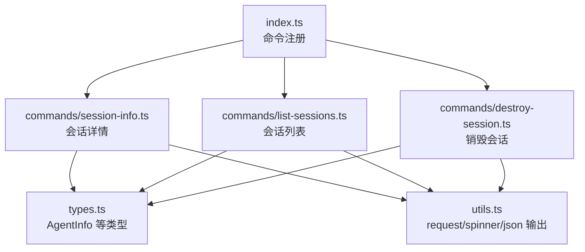
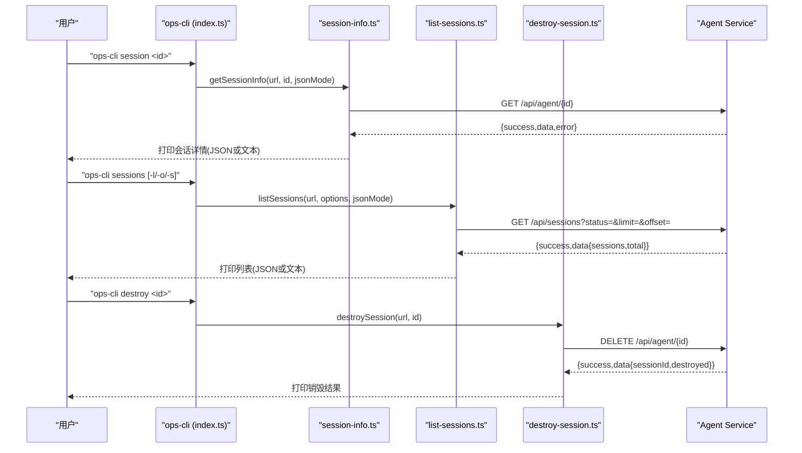
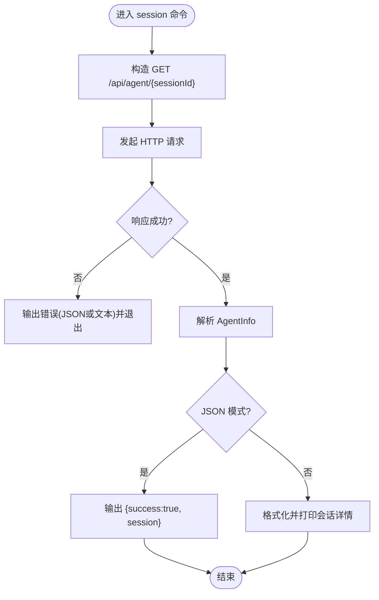
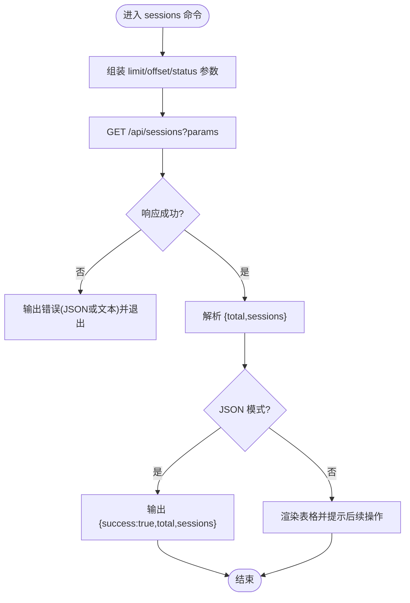
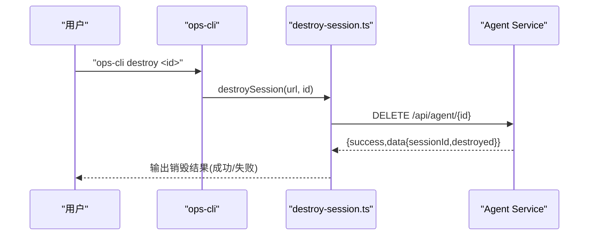
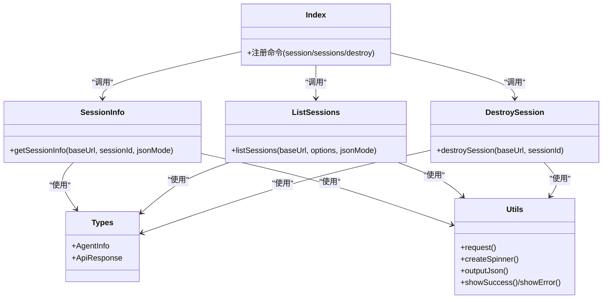

# 会话管理命令

<cite>
**本文引用的文件**
- [index.ts](file://OPS/CLI/src/index.ts)
- [session-info.ts](file://OPS/CLI/src/commands/session-info.ts)
- [list-sessions.ts](file://OPS/CLI/src/commands/list-sessions.ts)
- [destroy-session.ts](file://OPS/CLI/src/commands/destroy-session.ts)
- [types.ts](file://OPS/CLI/src/types.ts)
- [utils.ts](file://OPS/CLI/src/utils.ts)
</cite>

## 目录
1. [简介](#简介)
2. [项目结构](#项目结构)
3. [核心组件](#核心组件)
4. [架构总览](#架构总览)
5. [详细组件分析](#详细组件分析)
6. [依赖关系分析](#依赖关系分析)
7. [性能与可用性考虑](#性能与可用性考虑)
8. [故障排查指南](#故障排查指南)
9. [结论](#结论)
10. [附录：命令速查](#附录命令速查)

## 简介
本文件面向运维与开发者，系统化说明 CLI 中的会话管理相关命令，包括：
- session：查询单个会话的详细信息（状态、消息数量、工作空间信息、存活时长等）
- sessions：分页列出会话列表，支持按状态过滤
- destroy：销毁指定会话并释放资源

文档同时覆盖参数选项、查询条件、输出格式、错误处理、生命周期管理与最佳实践建议。

## 项目结构
会话管理命令位于 OPS/CLI 子项目中，采用“入口注册 + 命令实现”的分层组织方式：
- 入口注册：在 index.ts 中通过 commander 注册 session、sessions、destroy 三个命令
- 命令实现：分别位于 commands/session-info.ts、commands/list-sessions.ts、commands/destroy-session.ts
- 类型定义：统一在 types.ts 中声明 AgentInfo 等数据结构
- 工具函数：网络请求、格式化、提示等在 utils.ts 中提供

图表来源
- [index.ts:108-144](file://OPS/CLI/src/index.ts#L108-L144)
- [session-info.ts:1-78](file://OPS/CLI/src/commands/session-info.ts#L1-L78)
- [list-sessions.ts:1-121](file://OPS/CLI/src/commands/list-sessions.ts#L1-L121)
- [destroy-session.ts:1-40](file://OPS/CLI/src/commands/destroy-session.ts#L1-L40)
- [types.ts:31-46](file://OPS/CLI/src/types.ts#L31-L46)
- [utils.ts:5-41](file://OPS/CLI/src/utils.ts#L5-L41)

章节来源
- [index.ts:1-374](file://OPS/CLI/src/index.ts#L1-L374)

## 核心组件
- 会话信息查询（session）
  - 功能：获取单个会话的详细信息，包含状态、后端、消息数量、创建时间、最后活动时间、工作目录、存活时长等
  - 接口：GET /api/agent/{sessionId}
  - 输出：JSON 或彩色表格文本；JSON 模式返回 { success, session }
- 会话列表查询（sessions）
  - 功能：分页列出会话，支持按状态过滤
  - 接口：GET /api/sessions?status=&limit=&offset=
  - 输出：JSON 或彩色表格文本；JSON 模式返回 { success, total, sessions }
- 会话销毁（destroy）
  - 功能：删除指定会话，释放资源
  - 接口：DELETE /api/agent/{sessionId}
  - 输出：成功/失败提示；JSON 模式下可结合全局 --json 使用

章节来源
- [session-info.ts:5-60](file://OPS/CLI/src/commands/session-info.ts#L5-L60)
- [list-sessions.ts:11-99](file://OPS/CLI/src/commands/list-sessions.ts#L11-L99)
- [destroy-session.ts:8-39](file://OPS/CLI/src/commands/destroy-session.ts#L8-L39)
- [types.ts:31-46](file://OPS/CLI/src/types.ts#L31-L46)

## 架构总览
以下序列图展示各命令从 CLI 到后端的调用流程。

图表来源
- [index.ts:108-144](file://OPS/CLI/src/index.ts#L108-L144)
- [session-info.ts:5-60](file://OPS/CLI/src/commands/session-info.ts#L5-L60)
- [list-sessions.ts:11-99](file://OPS/CLI/src/commands/list-sessions.ts#L11-L99)
- [destroy-session.ts:8-39](file://OPS/CLI/src/commands/destroy-session.ts#L8-L39)

## 详细组件分析

### 命令：session（会话信息查询）
- 功能要点
  - 查询单个会话的详细信息
  - 显示状态、后端、消息数量、创建时间、最后活动、工作目录、存活时长
  - 支持 JSON 模式输出，便于程序化解析
- 参数与用法
  - 命令：ops-cli session <sessionId>
  - 全局选项：--url 指定服务地址；--json 启用 JSON 输出
- 数据模型
  - 返回类型为 AgentInfo，字段包括 sessionId、status、backend、createdAt、lastActivityAt、messageCount、workingDir
- 输出格式
  - 文本模式：彩色标题与键值对
  - JSON 模式：{ success: true/false, session: AgentInfo | undefined, error?: ... }
- 错误处理
  - 非 2xx 或业务 success=false 时，输出错误代码与信息；JSON 模式返回结构化错误对象
- 典型场景
  - 快速定位某会话是否 ready/processing/error
  - 查看工作目录与会话存活时长，辅助资源评估

图表来源
- [session-info.ts:5-60](file://OPS/CLI/src/commands/session-info.ts#L5-L60)
- [utils.ts:5-41](file://OPS/CLI/src/utils.ts#L5-L41)
- [types.ts:31-46](file://OPS/CLI/src/types.ts#L31-L46)

章节来源
- [session-info.ts:1-78](file://OPS/CLI/src/commands/session-info.ts#L1-L78)
- [types.ts:31-46](file://OPS/CLI/src/types.ts#L31-L46)
- [utils.ts:5-41](file://OPS/CLI/src/utils.ts#L5-L41)

### 命令：sessions（会话列表）
- 功能要点
  - 分页查询会话列表
  - 支持按状态过滤
  - 文本模式以表格形式展示关键列；JSON 模式返回完整数据
- 参数与用法
  - 命令：ops-cli sessions
  - 选项：
    - -l, --limit <n>：限制返回数量（默认 50）
    - -o, --offset <n>：偏移量（默认 0）
    - -s, --status <status>：按状态过滤（如 ready、error、processing、initializing）
  - 全局选项：--url、--json
- 数据模型
  - 返回 data.sessions 为 AgentInfo[]，data.total 为总数
- 输出格式
  - 文本模式：表头含序号、会话 ID、状态、后端、消息数、最后活动时间
  - JSON 模式：{ success: true/false, total, sessions }
- 错误处理
  - 请求失败或业务失败时，文本模式输出错误详情并退出；JSON 模式返回结构化错误
- 典型场景
  - 批量巡检活跃会话
  - 筛选异常会话进行后续处置

图表来源
- [list-sessions.ts:11-99](file://OPS/CLI/src/commands/list-sessions.ts#L11-L99)
- [utils.ts:5-41](file://OPS/CLI/src/utils.ts#L5-L41)

章节来源
- [list-sessions.ts:1-121](file://OPS/CLI/src/commands/list-sessions.ts#L1-L121)
- [types.ts:31-46](file://OPS/CLI/src/types.ts#L31-L46)
- [utils.ts:5-41](file://OPS/CLI/src/utils.ts#L5-L41)

### 命令：destroy（会话销毁）
- 功能要点
  - 删除指定会话，触发后端资源清理
  - 返回 destroyed 布尔值指示销毁结果
- 参数与用法
  - 命令：ops-cli destroy <sessionId>
  - 全局选项：--url、--json
- 数据模型
  - 返回 data.destroyed 表示是否销毁成功
- 输出格式
  - 文本模式：成功/失败提示与结果
  - JSON 模式：结合全局 --json 可得到结构化输出（当前实现未显式包裹 JSON 包装体，但可通过 --json 统一输出）
- 错误处理
  - 请求失败或业务失败时，输出错误详情并退出
- 典型场景
  - 清理长时间占用资源的会话
  - 配合自动化任务进行会话生命周期治理

图表来源
- [destroy-session.ts:8-39](file://OPS/CLI/src/commands/destroy-session.ts#L8-L39)
- [utils.ts:5-41](file://OPS/CLI/src/utils.ts#L5-L41)

章节来源
- [destroy-session.ts:1-40](file://OPS/CLI/src/commands/destroy-session.ts#L1-L40)
- [utils.ts:5-41](file://OPS/CLI/src/utils.ts#L5-L41)

## 依赖关系分析
- 模块耦合
  - index.ts 仅负责命令注册与参数转发，低耦合
  - 各命令文件独立实现，复用 types.ts 与 utils.ts
- 外部依赖
  - 通过 fetch 访问后端 REST 接口
  - 使用 chalk 与 ora 进行终端输出与加载动画
- 潜在风险
  - 若后端接口变更（路径/字段），需同步更新对应命令与类型定义
  - 网络异常或服务不可用时的重试策略未在 CLI 层实现，建议在编排脚本中补充

图表来源
- [index.ts:108-144](file://OPS/CLI/src/index.ts#L108-L144)
- [session-info.ts:1-78](file://OPS/CLI/src/commands/session-info.ts#L1-L78)
- [list-sessions.ts:1-121](file://OPS/CLI/src/commands/list-sessions.ts#L1-L121)
- [destroy-session.ts:1-40](file://OPS/CLI/src/commands/destroy-session.ts#L1-L40)
- [types.ts:1-46](file://OPS/CLI/src/types.ts#L1-L46)
- [utils.ts:1-41](file://OPS/CLI/src/utils.ts#L1-L41)

章节来源
- [index.ts:1-374](file://OPS/CLI/src/index.ts#L1-L374)
- [types.ts:1-46](file://OPS/CLI/src/types.ts#L1-L46)
- [utils.ts:1-41](file://OPS/CLI/src/utils.ts#L1-L41)

## 性能与可用性考虑
- 分页与过滤
  - 合理设置 limit 与 offset，避免一次性拉取过多数据
  - 使用 status 过滤减少不必要的数据传输
- 输出模式
  - 自动化流水线优先使用 --json，避免解析文本的不稳定性
- 超时与重试
  - 当前实现未内置重试逻辑，可在上层编排脚本中增加幂等重试与退避策略
- 并发与节流
  - 批量销毁时建议串行执行，避免对后端造成瞬时压力

[本节为通用指导，不直接分析具体文件]

## 故障排查指南
- 常见错误
  - 连接失败：检查 --url 是否正确，确认后端服务可达
  - 权限或认证：根据后端鉴权要求配置必要凭据（由后端决定）
  - 参数错误：确认 limit/offset/status 取值符合预期
- 诊断步骤
  - 使用 --json 获取结构化错误信息，便于定位问题
  - 先执行 sessions 查看目标会话是否存在与状态
  - 再执行 session 获取详细信息，核对 workingDir、messageCount、时间戳等
- 日志与上下文
  - 如需进一步排查，可结合其他诊断命令采集日志与系统信息（与本主题相关的命令不在本次范围）

章节来源
- [utils.ts:5-41](file://OPS/CLI/src/utils.ts#L5-L41)
- [session-info.ts:5-60](file://OPS/CLI/src/commands/session-info.ts#L5-L60)
- [list-sessions.ts:11-99](file://OPS/CLI/src/commands/list-sessions.ts#L11-L99)
- [destroy-session.ts:8-39](file://OPS/CLI/src/commands/destroy-session.ts#L8-L39)

## 结论
- session、sessions、destroy 三命令覆盖了会话查询、列表与销毁的核心能力
- 通过统一的类型与工具函数，保证了输出一致性与错误处理一致性
- 在生产环境中建议结合 --json 与自动化脚本，实现会话生命周期的可观测与可治理

[本节为总结性内容，不直接分析具体文件]

## 附录：命令速查
- session
  - 用途：查询单个会话详情
  - 用法：ops-cli session <sessionId> [--url <url>] [--json]
  - 接口：GET /api/agent/{sessionId}
  - 输出：文本表格或 JSON {success, session}
- sessions
  - 用途：分页列出会话，支持状态过滤
  - 用法：ops-cli sessions [-l <n>] [-o <n>] [-s <status>] [--url <url>] [--json]
  - 接口：GET /api/sessions?status=&limit=&offset=
  - 输出：文本表格或 JSON {success, total, sessions}
- destroy
  - 用途：销毁指定会话
  - 用法：ops-cli destroy <sessionId> [--url <url>] [--json]
  - 接口：DELETE /api/agent/{sessionId}
  - 输出：成功/失败提示；JSON 模式可获结构化结果

章节来源
- [index.ts:108-144](file://OPS/CLI/src/index.ts#L108-L144)
- [session-info.ts:5-60](file://OPS/CLI/src/commands/session-info.ts#L5-L60)
- [list-sessions.ts:11-99](file://OPS/CLI/src/commands/list-sessions.ts#L11-L99)
- [destroy-session.ts:8-39](file://OPS/CLI/src/commands/destroy-session.ts#L8-L39)