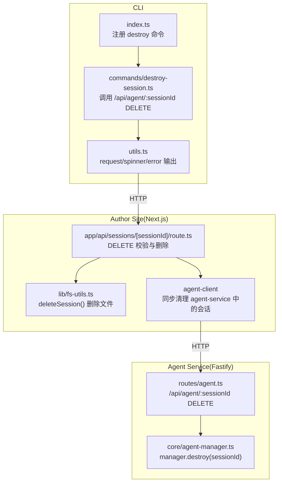
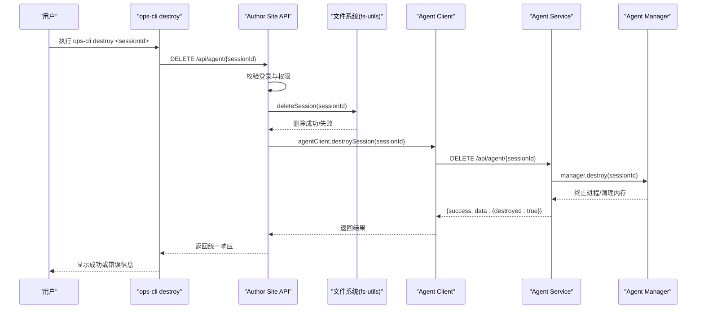
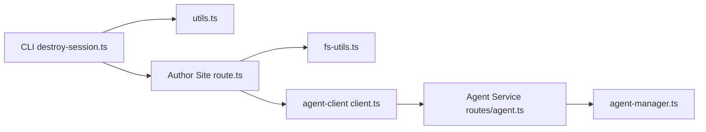

# 会话销毁命令

<cite>
**本文引用的文件**   
- [OPS/CLI/src/index.ts](file://OPS/CLI/src/index.ts)
- [OPS/CLI/src/commands/destroy-session.ts](file://OPS/CLI/src/commands/destroy-session.ts)
- [OPS/CLI/src/utils.ts](file://OPS/CLI/src/utils.ts)
- [packages/author-site/src/app/api/sessions/[sessionId]/route.ts](file://packages/author-site/src/app/api/sessions/[sessionId]/route.ts)
- [packages/author-site/src/lib/fs-utils.ts](file://packages/author-site/src/lib/fs-utils.ts)
- [packages/agent-client/src/client.ts](file://packages/agent-client/src/client.ts)
- [packages/agent-service/src/routes/agent.ts](file://packages/agent-service/src/routes/agent.ts)
- [packages/agent-service/src/core/agent-manager.ts](file://packages/agent-service/src/core/agent-manager.ts)
</cite>

## 目录
1. [简介](#简介)
2. [项目结构](#项目结构)
3. [核心组件](#核心组件)
4. [架构总览](#架构总览)
5. [详细组件分析](#详细组件分析)
6. [依赖关系分析](#依赖关系分析)
7. [性能与可靠性考虑](#性能与可靠性考虑)
8. [故障排查指南](#故障排查指南)
9. [结论](#结论)
10. [附录：参数与用法](#附录参数与用法)

## 简介
本文件围绕“销毁会话”能力，提供从命令行到服务端、再到资源清理的端到端说明。重点包括：
- 安全销毁指定会话的完整流程（资源清理、文件删除、连接释放）
- 命令参数选项与使用方式（baseUrl、sessionId、force）
- 销毁过程中的安全检查机制与回滚策略
- 销毁前的准备工作建议与最佳实践
- 错误处理与异常恢复机制
- 批量销毁与定时清理的自动化方案

## 项目结构
销毁会话涉及 CLI 入口、命令实现、HTTP 客户端、创作端路由、文件系统工具以及 Agent 服务侧的会话管理。

图表来源
- [OPS/CLI/src/index.ts:139-144](file://OPS/CLI/src/index.ts#L139-L144)
- [OPS/CLI/src/commands/destroy-session.ts:8-39](file://OPS/CLI/src/commands/destroy-session.ts#L8-L39)
- [OPS/CLI/src/utils.ts:5-41](file://OPS/CLI/src/utils.ts#L5-L41)
- [packages/author-site/src/app/api/sessions/[sessionId]/route.ts:72-137](file://packages/author-site/src/app/api/sessions/[sessionId]/route.ts#L72-L137)
- [packages/author-site/src/lib/fs-utils.ts:1272-1303](file://packages/author-site/src/lib/fs-utils.ts#L1272-L1303)
- [packages/agent-client/src/client.ts:89-98](file://packages/agent-client/src/client.ts#L89-L98)
- [packages/agent-service/src/routes/agent.ts:280-296](file://packages/agent-service/src/routes/agent.ts#L280-L296)
- [packages/agent-service/src/core/agent-manager.ts:147-153](file://packages/agent-service/src/core/agent-manager.ts#L147-L153)

章节来源
- [OPS/CLI/src/index.ts:139-144](file://OPS/CLI/src/index.ts#L139-L144)
- [OPS/CLI/src/commands/destroy-session.ts:8-39](file://OPS/CLI/src/commands/destroy-session.ts#L8-L39)
- [OPS/CLI/src/utils.ts:5-41](file://OPS/CLI/src/utils.ts#L5-L41)
- [packages/author-site/src/app/api/sessions/[sessionId]/route.ts:72-137](file://packages/author-site/src/app/api/sessions/[sessionId]/route.ts#L72-L137)
- [packages/author-site/src/lib/fs-utils.ts:1272-1303](file://packages/author-site/src/lib/fs-utils.ts#L1272-L1303)
- [packages/agent-client/src/client.ts:89-98](file://packages/agent-client/src/client.ts#L89-L98)
- [packages/agent-service/src/routes/agent.ts:280-296](file://packages/agent-service/src/routes/agent.ts#L280-L296)
- [packages/agent-service/src/core/agent-manager.ts:147-153](file://packages/agent-service/src/core/agent-manager.ts#L147-L153)

## 核心组件
- CLI 命令注册与执行
  - 通过 commander 注册 destroy <sessionId> 子命令，并传入全局 --url 作为 baseUrl。
- CLI 命令实现
  - 向 /api/agent/{sessionId} 发起 DELETE 请求，展示进度与结果。
- Author Site 删除接口
  - 校验登录与权限后，删除本地会话目录，并尝试同步清理 agent-service 中的会话。
- Agent 服务删除接口
  - 终止对应 Agent 进程、清理内存缓存与会话存储，返回成功响应。
- Agent 管理器
  - 负责具体 Agent 实例的生命周期管理，包含 kill 与清理逻辑。

章节来源
- [OPS/CLI/src/index.ts:139-144](file://OPS/CLI/src/index.ts#L139-L144)
- [OPS/CLI/src/commands/destroy-session.ts:8-39](file://OPS/CLI/src/commands/destroy-session.ts#L8-L39)
- [packages/author-site/src/app/api/sessions/[sessionId]/route.ts:72-137](file://packages/author-site/src/app/api/sessions/[sessionId]/route.ts#L72-L137)
- [packages/agent-service/src/routes/agent.ts:280-296](file://packages/agent-service/src/routes/agent.ts#L280-L296)
- [packages/agent-service/src/core/agent-manager.ts:147-153](file://packages/agent-service/src/core/agent-manager.ts#L147-L153)

## 架构总览
下图展示了从 CLI 到 Author Site 再到 Agent Service 的完整销毁链路，以及失败时的提示与退出行为。

图表来源
- [OPS/CLI/src/commands/destroy-session.ts:8-39](file://OPS/CLI/src/commands/destroy-session.ts#L8-L39)
- [packages/author-site/src/app/api/sessions/[sessionId]/route.ts:72-137](file://packages/author-site/src/app/api/sessions/[sessionId]/route.ts#L72-L137)
- [packages/author-site/src/lib/fs-utils.ts:1272-1303](file://packages/author-site/src/lib/fs-utils.ts#L1272-L1303)
- [packages/agent-client/src/client.ts:89-98](file://packages/agent-client/src/client.ts#L89-L98)
- [packages/agent-service/src/routes/agent.ts:280-296](file://packages/agent-service/src/routes/agent.ts#L280-L296)
- [packages/agent-service/src/core/agent-manager.ts:147-153](file://packages/agent-service/src/core/agent-manager.ts#L147-L153)

## 详细组件分析

### CLI 命令：destroy <sessionId>
- 功能
  - 接收 sessionId，向 /api/agent/{sessionId} 发送 DELETE 请求。
  - 打印进度、成功/失败信息与退出码。
- 参数
  - sessionId：必填位置参数。
  - baseUrl：来自全局 --url 选项。
  - force：当前命令未暴露该选项；如需强制行为，可在上层封装脚本中控制。
- 错误处理
  - HTTP 非 2xx 时，解析 error 字段并输出错误代码与信息，退出码为 1。
  - 网络异常或 JSON 解析异常时，捕获并输出错误详情，退出码为 1。

章节来源
- [OPS/CLI/src/index.ts:139-144](file://OPS/CLI/src/index.ts#L139-L144)
- [OPS/CLI/src/commands/destroy-session.ts:8-39](file://OPS/CLI/src/commands/destroy-session.ts#L8-L39)
- [OPS/CLI/src/utils.ts:5-41](file://OPS/CLI/src/utils.ts#L5-L41)

### Author Site 删除接口：DELETE /api/sessions/:sessionId
- 功能
  - 校验登录与权限（对比 .session.json 中的 userId）。
  - 调用 deleteSession 删除会话目录及关联 workspace（非 live）。
  - 尝试通过 agentClient.destroySession 同步清理 agent-service 中的会话。
- 安全检查
  - 未登录或 token 过期：返回 401。
  - 无权删除其他用户的 Session：返回 403。
  - 会话不存在：返回 404。
- 回滚策略
  - 若删除文件失败，返回 500 错误。
  - 同步清理 agent-service 失败仅记录警告，不影响主流程返回成功。
- 返回值
  - 成功：{ success: true }。
  - 失败：{ success: false, error: { code, message } }。

章节来源
- [packages/author-site/src/app/api/sessions/[sessionId]/route.ts:72-137](file://packages/author-site/src/app/api/sessions/[sessionId]/route.ts#L72-L137)
- [packages/author-site/src/lib/fs-utils.ts:1272-1303](file://packages/author-site/src/lib/fs-utils.ts#L1272-L1303)

### Agent 服务删除接口：DELETE /api/agent/:sessionId
- 功能
  - 调用 manager.destroy(sessionId) 终止 Agent 进程并从内存中移除。
  - 清理控制台缓冲、会话模型配置、外部认证配置与会话存储。
  - 返回 { success: true, data: { sessionId, destroyed: true } }。
- 错误处理
  - 内部异常将返回 500 错误与错误信息。

章节来源
- [packages/agent-service/src/routes/agent.ts:280-296](file://packages/agent-service/src/routes/agent.ts#L280-L296)
- [packages/agent-service/src/core/agent-manager.ts:147-153](file://packages/agent-service/src/core/agent-manager.ts#L147-L153)

### Agent 客户端：AgentClient.destroySession
- 功能
  - 封装对 /api/agent/{sessionId} 的 DELETE 请求，供后端服务间调用。
- 注意
  - 在 Author Site 中用于“同步清理 agent-service 中的会话”，失败不阻断主流程。

章节来源
- [packages/agent-client/src/client.ts:89-98](file://packages/agent-client/src/client.ts#L89-L98)

### 文件删除逻辑：deleteSession
- 功能
  - 读取 .session.json，若存在 workspaceId 且非 live，则删除对应 workspace。
  - 递归删除会话目录。
- 健壮性
  - 元数据读取失败不影响 session 删除。
  - 使用强制递归删除，避免残留。

章节来源
- [packages/author-site/src/lib/fs-utils.ts:1272-1303](file://packages/author-site/src/lib/fs-utils.ts#L1272-L1303)

## 依赖关系分析
- CLI 依赖 utils 进行 HTTP 请求与输出格式化。
- Author Site 依赖 fs-utils 进行文件系统操作，依赖 agent-client 进行跨服务清理。
- Agent Service 依赖 agent-manager 管理进程生命周期。

图表来源
- [OPS/CLI/src/commands/destroy-session.ts:8-39](file://OPS/CLI/src/commands/destroy-session.ts#L8-L39)
- [OPS/CLI/src/utils.ts:5-41](file://OPS/CLI/src/utils.ts#L5-L41)
- [packages/author-site/src/app/api/sessions/[sessionId]/route.ts:72-137](file://packages/author-site/src/app/api/sessions/[sessionId]/route.ts#L72-L137)
- [packages/author-site/src/lib/fs-utils.ts:1272-1303](file://packages/author-site/src/lib/fs-utils.ts#L1272-L1303)
- [packages/agent-client/src/client.ts:89-98](file://packages/agent-client/src/client.ts#L89-L98)
- [packages/agent-service/src/routes/agent.ts:280-296](file://packages/agent-service/src/routes/agent.ts#L280-L296)
- [packages/agent-service/src/core/agent-manager.ts:147-153](file://packages/agent-service/src/core/agent-manager.ts#L147-L153)

## 性能与可靠性考虑
- 幂等性
  - 多次调用销毁同一会话应返回成功或无副作用。
- 异步清理
  - 同步清理 agent-service 失败不应阻塞主流程，但需记录告警以便后续补偿。
- 大目录删除
  - 递归删除可能耗时较长，建议在后台任务或批处理场景中使用超时与重试。
- 并发与锁
  - 高并发删除时需确保文件系统锁与进程状态一致性，避免重复删除导致异常。

[本节为通用指导，无需源码引用]

## 故障排查指南
- 常见错误码与含义
  - UNAUTHORIZED：未登录或 token 过期。
  - FORBIDDEN：无权删除其他用户的 Session。
  - SESSION_NOT_FOUND：会话不存在。
  - FILE_WRITE_ERROR：删除文件或同步清理失败。
  - HTTP_ERROR：网络或远端服务不可用。
- 定位步骤
  - 检查 CLI 输出的错误代码与消息。
  - 确认 Author Site 日志中是否存在权限校验失败或文件写入异常。
  - 检查 Agent Service 是否仍在运行，端口是否被占用。
  - 验证 .session.json 的 userId 是否与当前登录用户一致。
- 恢复建议
  - 若仅 agent-service 清理失败，可手动调用其 /api/agent/:sessionId DELETE 进行补偿。
  - 若文件删除失败，检查磁盘权限与路径有效性，必要时以管理员身份重试。

章节来源
- [packages/author-site/src/app/api/sessions/[sessionId]/route.ts:72-137](file://packages/author-site/src/app/api/sessions/[sessionId]/route.ts#L72-L137)
- [OPS/CLI/src/utils.ts:5-41](file://OPS/CLI/src/utils.ts#L5-L41)

## 结论
销毁会话是一个跨多模块的协作过程：CLI 发起请求，Author Site 完成权限校验与本地资源清理，并尝试同步清理 Agent Service 中的会话。整体具备明确的安全检查与错误处理机制。对于生产环境，建议结合批量与定时清理策略，提升系统稳定性与资源回收效率。

[本节为总结，无需源码引用]

## 附录：参数与用法

### 命令参数
- 必需参数
  - sessionId：要销毁的会话 ID。
- 可选参数
  - baseUrl：通过全局 --url 指定，默认指向本地开发地址。
  - force：当前命令未暴露该选项；如需强制行为，请在上层脚本中控制。

示例
- 基本用法
  - ops-cli destroy <sessionId>
- 指定服务地址
  - ops-cli --url https://your-author-site destroy <sessionId>

章节来源
- [OPS/CLI/src/index.ts:139-144](file://OPS/CLI/src/index.ts#L139-L144)
- [OPS/CLI/src/commands/destroy-session.ts:8-39](file://OPS/CLI/src/commands/destroy-session.ts#L8-L39)

### 销毁前准备与最佳实践
- 确认目标会话不再被使用（无活跃 WebSocket 或后台任务）。
- 备份重要数据（如需要保留的消息历史或快照）。
- 在非高峰时段执行批量销毁，降低对在线用户的影响。
- 先小范围灰度验证，再推广至全量。

[本节为通用指导，无需源码引用]

### 错误处理与异常恢复
- CLI 层
  - 捕获 HTTP 错误与网络异常，输出结构化错误信息并设置退出码。
- Author Site 层
  - 权限校验失败返回 403；文件删除失败返回 500；同步清理失败仅记录警告。
- Agent Service 层
  - 内部异常返回 500；正常流程返回 destroyed: true。

章节来源
- [OPS/CLI/src/utils.ts:5-41](file://OPS/CLI/src/utils.ts#L5-L41)
- [packages/author-site/src/app/api/sessions/[sessionId]/route.ts:72-137](file://packages/author-site/src/app/api/sessions/[sessionId]/route.ts#L72-L137)
- [packages/agent-service/src/routes/agent.ts:280-296](file://packages/agent-service/src/routes/agent.ts#L280-L296)

### 批量销毁与定时清理自动化方案
- 批量销毁
  - 通过 CLI 循环调用 destroy 命令，或使用 Author Site 的内部接口批量触发。
  - 建议加入去重、限流与重试机制。
- 定时清理
  - 利用 Author Site 提供的过期清理接口，按用户维度清理过期会话的 workspace 并标记状态。
  - 可结合系统调度器（如 cron）定期执行。

章节来源
- [packages/author-site/src/app/api/sessions/cleanup/route.ts:1-37](file://packages/author-site/src/app/api/sessions/cleanup/route.ts#L1-L37)
- [packages/author-site/src/lib/session-manager.ts:907-998](file://packages/author-site/src/lib/session-manager.ts#L907-L998)