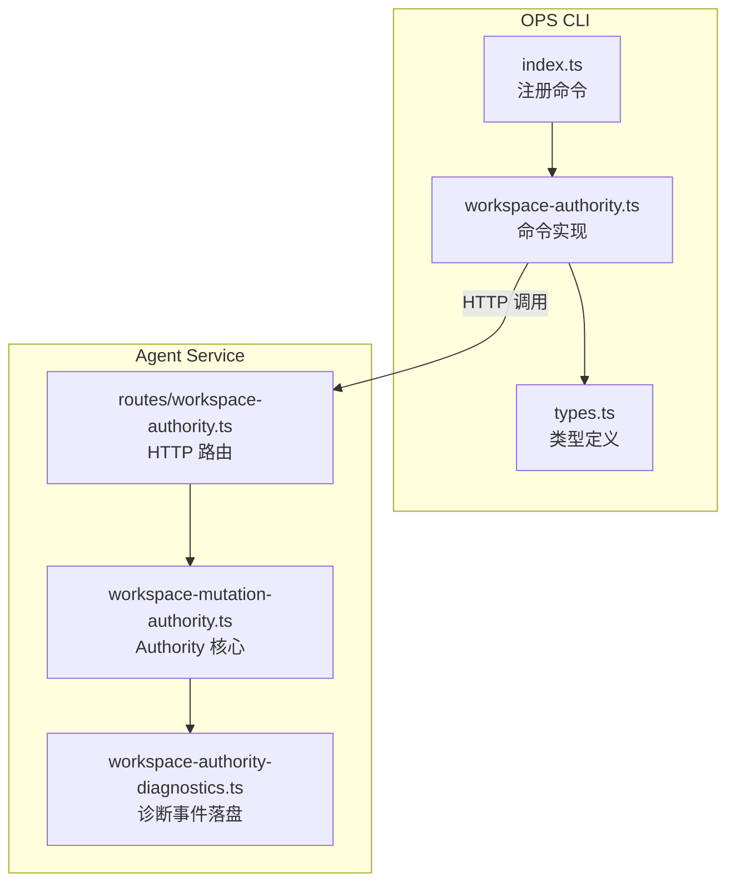
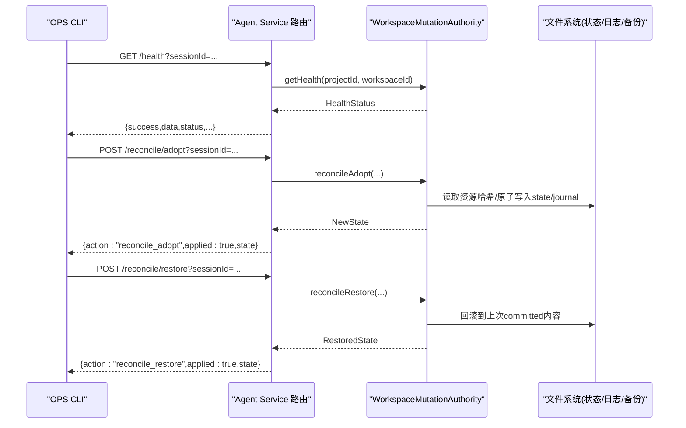
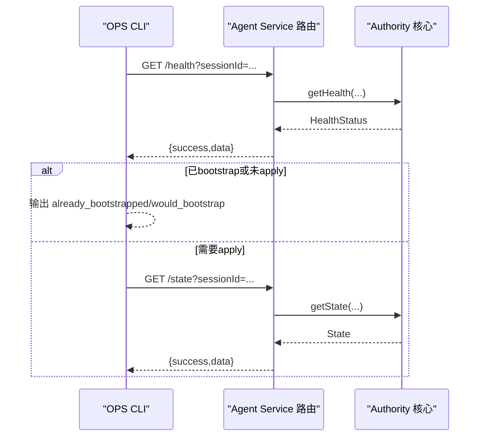
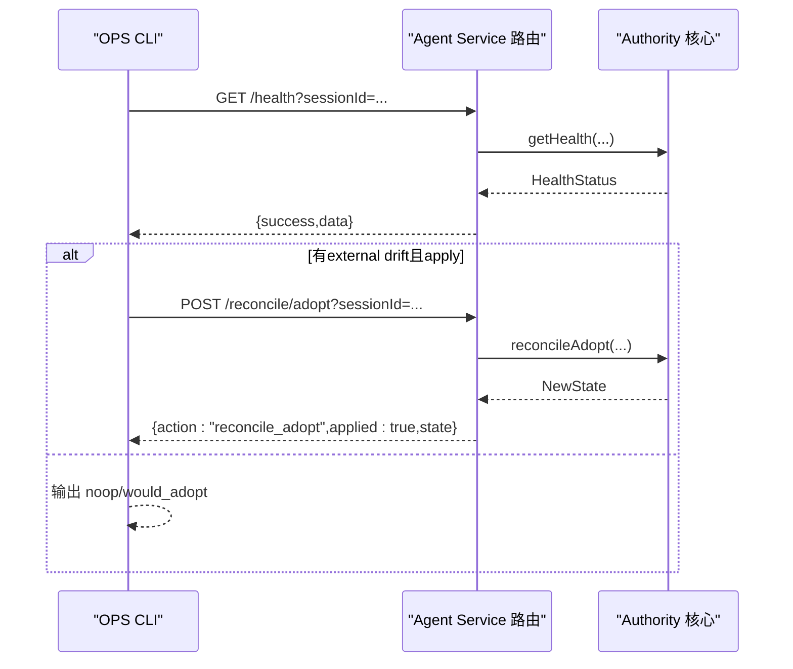
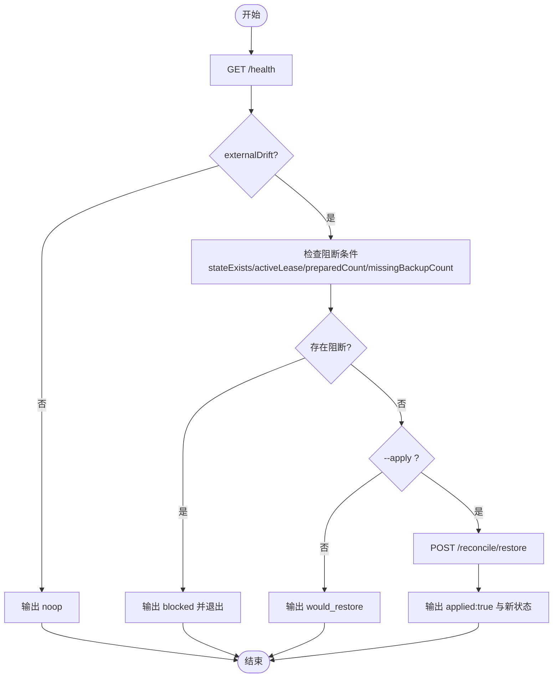
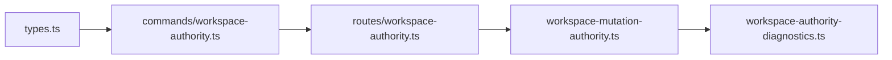
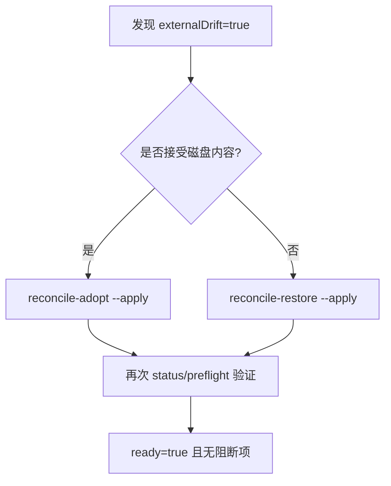

# Workspace Authority 权限管理命令

<cite>
**本文引用的文件**   
- [OPS/CLI/src/index.ts](file://OPS/CLI/src/index.ts)
- [OPS/CLI/src/commands/workspace-authority.ts](file://OPS/CLI/src/commands/workspace-authority.ts)
- [OPS/CLI/src/types.ts](file://OPS/CLI/src/types.ts)
- [packages/agent-service/src/routes/workspace-authority.ts](file://packages/agent-service/src/routes/workspace-authority.ts)
- [packages/agent-service/src/workspace/workspace-mutation-authority.ts](file://packages/agent-service/src/workspace/workspace-mutation-authority.ts)
- [packages/agent-service/src/workspace/workspace-authority-diagnostics.ts](file://packages/agent-service/src/workspace/workspace-authority-diagnostics.ts)
</cite>

## 更新摘要
**所做更改**   
- 更新了所有子命令的详细实现说明，包括状态检查、预检验证、引导初始化、漂移恢复和一致性校验
- 完善了权限模型与访问控制策略的文档说明
- 增强了数据一致性保证机制的描述
- 新增了完整的命令执行流程图和故障诊断指南
- 更新了最佳实践与安全建议部分

## 目录
1. [简介](#简介)
2. [项目结构](#项目结构)
3. [核心组件](#核心组件)
4. [架构总览](#架构总览)
5. [详细组件分析](#详细组件分析)
6. [依赖关系分析](#依赖关系分析)
7. [性能与一致性考量](#性能与一致性考量)
8. [故障诊断与修复指南](#故障诊断与修复指南)
9. [最佳实践与安全建议](#最佳实践与安全建议)
10. [结论](#结论)

## 简介
本文件面向运维与平台工程师，系统化梳理 workspace-authority-* 系列命令的权限管理与一致性保障能力。这些命令围绕"单写者权威（Workspace Authority）"模型，提供：
- 状态检查：只读查询健康、队列、租约、备份等关键指标
- 预检验证：在部署或变更动作前进行阻断性检查
- 引导初始化：为未初始化的工作区创建 Authority state
- 漂移恢复：对磁盘与权威状态不一致的情况执行 adopt 或 restore
- 一致性校验：通过 rootHash 与 revision 保证数据一致性

## 项目结构
命令入口位于 OPS CLI，具体实现封装在 commands 模块；后端路由与核心逻辑位于 agent-service。



**图表来源**
- [OPS/CLI/src/index.ts:256-347](file://OPS/CLI/src/index.ts#L256-L347)
- [OPS/CLI/src/commands/workspace-authority.ts:1-120](file://OPS/CLI/src/commands/workspace-authority.ts#L1-L120)
- [packages/agent-service/src/routes/workspace-authority.ts:61-213](file://packages/agent-service/src/routes/workspace-authority.ts#L61-L213)
- [packages/agent-service/src/workspace/workspace-mutation-authority.ts:240-284](file://packages/agent-service/src/workspace/workspace-mutation-authority.ts#L240-L284)
- [packages/agent-service/src/workspace/workspace-authority-diagnostics.ts:61-115](file://packages/agent-service/src/workspace/workspace-authority-diagnostics.ts#L61-L115)

**章节来源**
- [OPS/CLI/src/index.ts:256-347](file://OPS/CLI/src/index.ts#L256-L347)
- [OPS/CLI/src/commands/workspace-authority.ts:1-120](file://OPS/CLI/src/commands/workspace-authority.ts#L1-L120)
- [packages/agent-service/src/routes/workspace-authority.ts:61-213](file://packages/agent-service/src/routes/workspace-authority.ts#L61-L213)

## 核心组件
- 命令层（OPS CLI）
  - 负责解析参数、构建请求、输出 JSON/人类可读结果
  - 支持 dry-run 与 apply 模式，避免误操作
- 服务层（Agent Service）
  - 暴露 /api/workspace-authority/... 路由，统一错误码映射
  - 维护 Authority State、Journal、Receipts、Backups、Staging 等持久化
- 诊断层
  - 将 mutation/projection 生命周期事件写入 editor-diagnostics，便于排障

**章节来源**
- [OPS/CLI/src/commands/workspace-authority.ts:108-619](file://OPS/CLI/src/commands/workspace-authority.ts#L108-L619)
- [packages/agent-service/src/routes/workspace-authority.ts:61-278](file://packages/agent-service/src/routes/workspace-authority.ts#L61-L278)
- [packages/agent-service/src/workspace/workspace-authority-diagnostics.ts:61-115](file://packages/agent-service/src/workspace/workspace-authority-diagnostics.ts#L61-L115)

## 架构总览
下图展示从 CLI 到 Agent Service 的完整调用链，以及 Authority 内部的关键路径。



**图表来源**
- [OPS/CLI/src/commands/workspace-authority.ts:101-106](file://OPS/CLI/src/commands/workspace-authority.ts#L101-L106)
- [packages/agent-service/src/routes/workspace-authority.ts:205-213](file://packages/agent-service/src/routes/workspace-authority.ts#L205-213)
- [packages/agent-service/src/routes/workspace-authority.ts:245-263](file://packages/agent-service/src/routes/workspace-authority.ts#L245-263)
- [packages/agent-service/src/workspace/workspace-mutation-authority.ts:286-378](file://packages/agent-service/src/workspace/workspace-mutation-authority.ts#L286-378)

## 详细组件分析

### 子命令一览与职责
- **workspace-authority-status**
  - 用途：只读查询 Authority 健康状态与风险项
  - 输入：projectId, workspaceId, --session
  - 行为：调用 health 接口，输出 ready/revision/rootHash/actualRootHash/queueDepth/activeLease/preparedCount/recoveryState/conflictCount/eventSubscriberCount/stagingCount/backupCount/missingBackupCount/receiptCount/journalEntries/projectionAckEntries/checkedAt 及 warnings
- **workspace-authority-preflight**
  - 用途：在发布/迁移前做阻断性检查
  - 输入：同上 + --fail-on-queue, --fail-on-staging
  - 行为：基于 health 计算 issues，若存在则失败退出；可配置是否把队列积压和 staging 残留纳入阻断
- **workspace-authority-bootstrap**
  - 用途：为尚未 bootstrap 的工作区创建 Authority state
  - 输入：同上 + --apply
  - 行为：默认 dry-run 返回 would_bootstrap/already_bootstrapped；加 --apply 才真正创建 state
- **workspace-authority-reconcile-adopt**
  - 用途：当检测到 external drift 时，以当前磁盘内容为新 revision
  - 输入：同上 + --apply
  - 行为：dry-run 返回 would_adopt/noop；apply 后更新 state 并记录 journal
- **workspace-authority-reconcile-restore**
  - 用途：丢弃外部漂移，恢复到最近一次 committed 的内容
  - 输入：同上 + --apply
  - 行为：dry-run 返回 would_restore/noop/blocked；apply 后回滚并记录 journal

**章节来源**
- [OPS/CLI/src/index.ts:256-347](file://OPS/CLI/src/index.ts#L256-L347)
- [OPS/CLI/src/commands/workspace-authority.ts:108-619](file://OPS/CLI/src/commands/workspace-authority.ts#L108-L619)

### 权限模型与访问控制策略
- **Session 鉴权**
  - 所有读写端点均要求 sessionId 查询参数，缺失即拒绝
  - 路由层对非法请求返回稳定错误码，客户端据此映射 HTTP 状态
- **单写者权威**
  - 每个工作区按 workspaceId 串行化，避免并发冲突
  - 通过 lease 文件检测活跃/过期写租约，防止多写
- **一致性校验**
  - 每次变更前后计算 rootHash，确保磁盘与权威状态一致
  - 使用 prepared/receipt/journal/backups 机制保证幂等与可恢复

**章节来源**
- [packages/agent-service/src/routes/workspace-authority.ts:67-75](file://packages/agent-service/src/routes/workspace-authority.ts#L67-L75)
- [packages/agent-service/src/workspace/workspace-mutation-authority.ts:112-127](file://packages/agent-service/src/workspace/workspace-mutation-authority.ts#L112-L127)
- [packages/agent-service/src/workspace/workspace-mutation-authority.ts:240-284](file://packages/agent-service/src/workspace/workspace-mutation-authority.ts#L240-L284)

### 数据一致性保证机制
- **原子写入与快照**
  - 状态、收据、journal、backups 均采用原子写入，崩溃后可恢复
- **幂等提交**
  - 相同 mutationId 重复提交会直接返回已有 receipt，避免重复应用
- **外部漂移防护**
  - mutate 前校验 actualRootHash 与 state.rootHash 一致，否则拒绝
- **投影确认**
  - projection ack 记录与监听，用于观测与告警

**章节来源**
- [packages/agent-service/src/workspace/workspace-mutation-authority.ts:468-637](file://packages/agent-service/src/workspace/workspace-mutation-authority.ts#L468-L637)
- [packages/agent-service/src/workspace/workspace-mutation-authority.ts:380-451](file://packages/agent-service/src/workspace/workspace-mutation-authority.ts#L380-L451)

### 命令执行流程（序列图）

#### preflight 流程
```mermaid
sequenceDiagram
participant CLI as "OPS CLI"
participant API as "Agent Service 路由"
participant AUTH as "Authority 核心"
CLI->>API : GET /health?sessionId=...
API->>AUTH : getHealth(...)
AUTH-->>API : HealthStatus
API-->>CLI : {success,data}
CLI->>CLI : 计算issues(可选failOnQueue/failOnStaging)
CLI-->>CLI : passed=true/false; 失败则退出
```

**图表来源**
- [OPS/CLI/src/commands/workspace-authority.ts:199-280](file://OPS/CLI/src/commands/workspace-authority.ts#L199-L280)
- [packages/agent-service/src/routes/workspace-authority.ts:205-213](file://packages/agent-service/src/routes/workspace-authority.ts#L205-213)

#### bootstrap 流程


**图表来源**
- [OPS/CLI/src/commands/workspace-authority.ts:282-385](file://OPS/CLI/src/commands/workspace-authority.ts#L282-L385)
- [packages/agent-service/src/routes/workspace-authority.ts:67-75](file://packages/agent-service/src/routes/workspace-authority.ts#L67-L75)

#### reconcile adopt 流程


**图表来源**
- [OPS/CLI/src/commands/workspace-authority.ts:387-491](file://OPS/CLI/src/commands/workspace-authority.ts#L387-L491)
- [packages/agent-service/src/routes/workspace-authority.ts:245-253](file://packages/agent-service/src/routes/workspace-authority.ts#L245-253)

#### reconcile restore 流程


**图表来源**
- [OPS/CLI/src/commands/workspace-authority.ts:493-619](file://OPS/CLI/src/commands/workspace-authority.ts#L493-L619)
- [packages/agent-service/src/routes/workspace-authority.ts:255-263](file://packages/agent-service/src/routes/workspace-authority.ts#L255-263)

### 健康状态字段说明（节选）
- **ready**：综合就绪标志（需满足无外部漂移、无活跃租约、无待恢复事务、备份完整等）
- **externalDrift**：磁盘实际 rootHash 与权威 state 不一致
- **queueDepth**：待处理变更队列深度
- **activeLease**：是否存在活跃或过期写租约
- **preparedCount**：待恢复的 prepared 事务数
- **missingBackupCount**：已提交但缺失的备份数
- **stagingCount/backupCount/receiptCount/journalEntries/projectionAckEntries**：各类持久化计数

**章节来源**
- [OPS/CLI/src/types.ts:68-92](file://OPS/CLI/src/types.ts#L68-L92)
- [packages/agent-service/src/workspace/workspace-mutation-authority.ts:240-284](file://packages/agent-service/src/workspace/workspace-mutation-authority.ts#L240-L284)

## 依赖关系分析
- CLI 依赖 types 中的 WorkspaceAuthorityHealthStatus 等类型
- CLI 通过 HTTP 调用 Agent Service 路由
- 路由层将错误码标准化并映射为 HTTP 状态
- Authority 核心负责状态机、持久化与一致性校验
- 诊断模块将关键事件追加到 editor-diagnostics.jsonl



**图表来源**
- [OPS/CLI/src/types.ts:68-92](file://OPS/CLI/src/types.ts#L68-L92)
- [OPS/CLI/src/commands/workspace-authority.ts:1-120](file://OPS/CLI/src/commands/workspace-authority.ts#L1-L120)
- [packages/agent-service/src/routes/workspace-authority.ts:61-213](file://packages/agent-service/src/routes/workspace-authority.ts#L61-L213)
- [packages/agent-service/src/workspace/workspace-mutation-authority.ts:240-284](file://packages/agent-service/src/workspace/workspace-mutation-authority.ts#L240-L284)
- [packages/agent-service/src/workspace/workspace-authority-diagnostics.ts:61-115](file://packages/agent-service/src/workspace/workspace-authority-diagnostics.ts#L61-L115)

**章节来源**
- [packages/agent-service/src/routes/workspace-authority.ts:40-54](file://packages/agent-service/src/routes/workspace-authority.ts#L40-L54)

## 性能与一致性考量
- **串行化与租约**
  - 同一工作区的变更串行执行，减少竞争开销
  - 租约文件快速判断是否可写，避免不必要的 I/O
- **幂等与重试**
  - 基于 mutationId 的幂等设计，允许客户端安全重试
- **最小化副作用**
  - 先持久化状态与 receipts，再清理临时文件，降低崩溃窗口
- **观测性**
  - 通过 journal、receipts、projection-acks 与诊断事件，全面追踪变更链路

## 故障诊断与修复指南

### 常见错误码与含义
- **SESSION_NOT_FOUND**：缺少 sessionId
- **WORKSPACE_AUTHORITY_NOT_READY**：Authority 未就绪（如未 bootstrap）
- **WORKSPACE_EXTERNAL_DRIFT**：检测到外部漂移
- **WORKSPACE_RESOURCE_CONFLICT**：资源冲突（例如 baseRevision 过旧）
- **WORKSPACE_MUTATION_ID_REUSED**：mutationId 被重用且 payload 不一致
- **WORKSPACE_INVALID_OPERATION**：操作参数不合法
- **WORKSPACE_WRITE_LEASE_UNAVAILABLE**：无法获取写租约
- **WORKSPACE_AUTHORITY_BACKUP_MISSING**：备份不完整

**章节来源**
- [packages/agent-service/src/routes/workspace-authority.ts:21-38](file://packages/agent-service/src/routes/workspace-authority.ts#L21-L38)

### 典型问题定位步骤
- **查看健康状态**
  - 使用 status 命令观察 ready、externalDrift、queueDepth、preparedCount、missingBackupCount 等
- **检查前置条件**
  - 使用 preflight 命令，必要时开启 --fail-on-queue 与 --fail-on-staging
- **处理外部漂移**
  - 若确认磁盘内容为期望版本，使用 reconcile-adopt --apply
  - 若需回滚到权威状态，使用 reconcile-restore --apply
- **恢复未决事务**
  - 关注 preparedCount 与 recoveryState，必要时重启服务触发恢复
- **审计与回溯**
  - 查看 editor-diagnostics.jsonl 中 workspace.* 事件，结合 journal/receipts 定位根因

**章节来源**
- [OPS/CLI/src/commands/workspace-authority.ts:108-619](file://OPS/CLI/src/commands/workspace-authority.ts#L108-L619)
- [packages/agent-service/src/workspace/workspace-authority-diagnostics.ts:61-115](file://packages/agent-service/src/workspace/workspace-authority-diagnostics.ts#L61-L115)

### 修复流程图（示例：外部漂移）


**图表来源**
- [OPS/CLI/src/commands/workspace-authority.ts:387-619](file://OPS/CLI/src/commands/workspace-authority.ts#L387-L619)

## 最佳实践与安全建议
- 始终携带有效的 sessionId，避免会话失效导致 401
- 变更前先运行 preflight，必要时启用 --fail-on-queue 与 --fail-on-staging
- 优先 dry-run，确认 action 后再加 --apply
- 对 adopt 谨慎使用，仅在确认磁盘内容为最终期望版本时执行
- 对 restore 谨慎使用，仅在不信任外部修改时执行
- 定期巡检 missingBackupCount 与 journal/receipt 计数，确保备份完整性
- 将 CLI 集成到 CI/CD 门禁，阻止在 Authority 不健康时发布

## 结论
workspace-authority-* 命令围绕"单写者权威 + 强一致性"的设计，提供了完备的状态观测、前置校验、引导初始化与漂移恢复能力。配合完善的错误码体系与诊断事件，可在复杂协作环境中有效保障工作区数据的一致性与可恢复性。建议在自动化流水线中常态化使用 preflight 与 dry-run，并在人工确认后执行 apply，从而兼顾效率与安全。