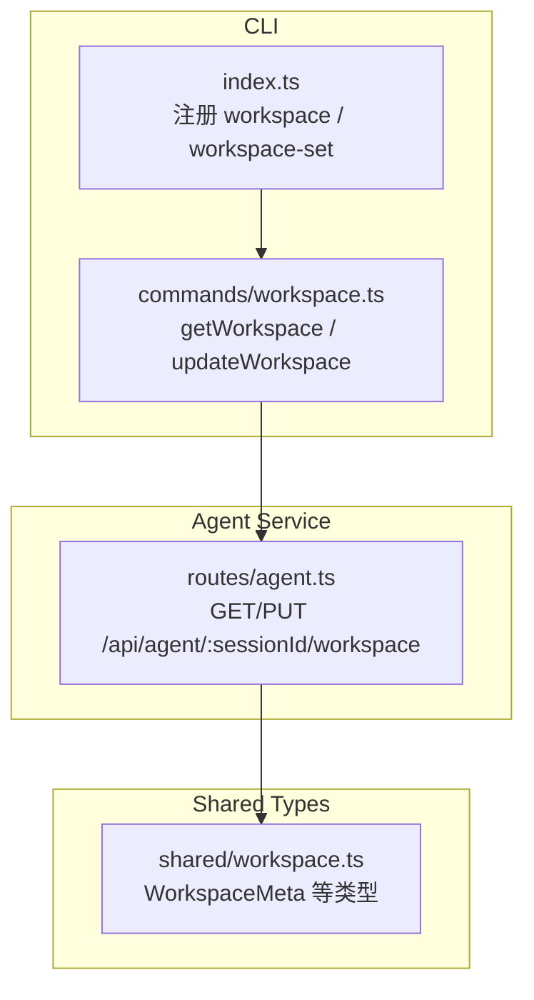
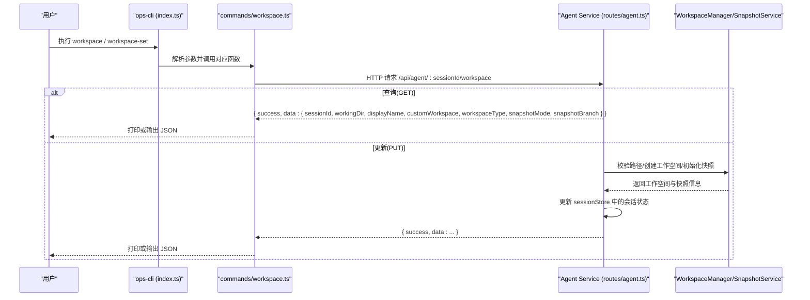

# 基础工作空间命令

<cite>
**本文引用的文件**   
- [OPS/CLI/src/index.ts](file://OPS/CLI/src/index.ts)
- [OPS/CLI/src/commands/workspace.ts](file://OPS/CLI/src/commands/workspace.ts)
- [packages/agent-service/src/routes/agent.ts](file://packages/agent-service/src/routes/agent.ts)
- [packages/shared/src/workspace.ts](file://packages/shared/src/workspace.ts)
</cite>

## 目录
1. [简介](#简介)
2. [项目结构](#项目结构)
3. [核心组件](#核心组件)
4. [架构总览](#架构总览)
5. [详细组件分析](#详细组件分析)
6. [依赖关系分析](#依赖关系分析)
7. [性能与行为特性](#性能与行为特性)
8. [故障排查指南](#故障排查指南)
9. [结论](#结论)
10. [附录：使用示例与返回格式](#附录使用示例与返回格式)

## 简介
本文件面向“基础工作空间操作命令”，聚焦以下两个 CLI 子命令：
- workspace：查看会话的工作空间信息（包含会话 ID、工作目录、显示名称、自定义工作空间标记、工作空间类型、快照模式、快照分支等字段）
- workspace-set：更新会话的工作空间目录，并可设置自定义工作空间标记

文档将详细说明每个命令的参数选项、返回值格式、错误处理机制，并提供实际使用示例与常见错误场景的解决方案。

## 项目结构
与基础工作空间命令相关的代码分布在如下位置：
- CLI 入口与命令注册：OPS/CLI/src/index.ts
- 工作空间命令实现：OPS/CLI/src/commands/workspace.ts
- Agent 服务路由（HTTP API）：packages/agent-service/src/routes/agent.ts
- 共享类型定义（工作空间元数据）：packages/shared/src/workspace.ts

图表来源
- [OPS/CLI/src/index.ts:196-218](file://OPS/CLI/src/index.ts#L196-L218)
- [OPS/CLI/src/commands/workspace.ts:14-123](file://OPS/CLI/src/commands/workspace.ts#L14-L123)
- [packages/agent-service/src/routes/agent.ts:470-554](file://packages/agent-service/src/routes/agent.ts#L470-L554)
- [packages/shared/src/workspace.ts:29-35](file://packages/shared/src/workspace.ts#L29-L35)

章节来源
- [OPS/CLI/src/index.ts:196-218](file://OPS/CLI/src/index.ts#L196-L218)
- [OPS/CLI/src/commands/workspace.ts:14-123](file://OPS/CLI/src/commands/workspace.ts#L14-L123)
- [packages/agent-service/src/routes/agent.ts:470-554](file://packages/agent-service/src/routes/agent.ts#L470-L554)
- [packages/shared/src/workspace.ts:29-35](file://packages/shared/src/workspace.ts#L29-L35)

## 核心组件
- CLI 命令注册
  - workspace <sessionId>：调用 getWorkspace
  - workspace-set <sessionId> <workingDir> [--custom]：调用 updateWorkspace
- 工作空间查询与更新逻辑
  - GET /api/agent/:sessionId/workspace：读取当前会话的工作空间信息并返回
  - PUT /api/agent/:sessionId/workspace：校验路径、创建/识别工作空间、初始化快照、更新会话状态并返回最新信息
- 共享类型
  - WorkspaceMeta：定义 workingDir、customWorkspace、workspaceType、snapshotMode、snapshotBranch 等字段的语义与取值范围

章节来源
- [OPS/CLI/src/index.ts:196-218](file://OPS/CLI/src/index.ts#L196-L218)
- [OPS/CLI/src/commands/workspace.ts:14-123](file://OPS/CLI/src/commands/workspace.ts#L14-L123)
- [packages/agent-service/src/routes/agent.ts:470-554](file://packages/agent-service/src/routes/agent.ts#L470-L554)
- [packages/shared/src/workspace.ts:29-35](file://packages/shared/src/workspace.ts#L29-L35)

## 架构总览
下图展示了从 CLI 到 Agent 服务的完整请求链路，以及关键的数据流转与状态更新点。

图表来源
- [OPS/CLI/src/index.ts:196-218](file://OPS/CLI/src/index.ts#L196-L218)
- [OPS/CLI/src/commands/workspace.ts:14-123](file://OPS/CLI/src/commands/workspace.ts#L14-L123)
- [packages/agent-service/src/routes/agent.ts:470-554](file://packages/agent-service/src/routes/agent.ts#L470-L554)

## 详细组件分析

### 命令 workspace：查看工作空间信息
- 功能
  - 通过 GET /api/agent/:sessionId/workspace 获取当前会话的工作空间信息
  - 支持 --json 全局开关以 JSON 格式输出
- 参数
  - 位置参数
    - sessionId：必填，目标会话 ID
  - 全局选项
    - -u/--url：Agent Service 地址（默认 http://localhost:3201）
    - --json：JSON 输出
- 响应字段含义
  - sessionId：会话唯一标识
  - workingDir：工作目录绝对路径
  - displayName：由工作目录派生的显示名称
  - customWorkspace：是否自定义工作空间（布尔值）
  - workspaceType：工作空间类型（如 user/temp）
  - snapshotMode：快照模式（如 git-repo/snapshot）
  - snapshotBranch：快照分支（字符串或空）
- 输出格式
  - 非 JSON：彩色文本块，逐行展示各字段
  - JSON：{ success: true, workspace: { ... } }
- 错误处理
  - 服务端返回 success=false：CLI 在 JSON 模式下输出 { success:false, sessionId, error }；否则打印错误并退出码 1
  - 网络异常：CLI 捕获异常并在 JSON 模式下输出 { success:false, sessionId, error: message }；否则打印错误详情并退出码 1

章节来源
- [OPS/CLI/src/index.ts:196-204](file://OPS/CLI/src/index.ts#L196-L204)
- [OPS/CLI/src/commands/workspace.ts:14-63](file://OPS/CLI/src/commands/workspace.ts#L14-L63)
- [packages/agent-service/src/routes/agent.ts:470-496](file://packages/agent-service/src/routes/agent.ts#L470-L496)
- [packages/shared/src/workspace.ts:29-35](file://packages/shared/src/workspace.ts#L29-L35)

### 命令 workspace-set：更新工作空间目录与自定义标记
- 功能
  - 通过 PUT /api/agent/:sessionId/workspace 更新会话的工作目录，并可设置自定义工作空间标记
- 参数
  - 位置参数
    - sessionId：必填，目标会话 ID
    - workingDir：必填，新的工作目录路径
  - 选项
    - --custom：标记为自定义工作空间（布尔开关）
  - 全局选项
    - -u/--url：Agent Service 地址
    - --json：JSON 输出
- 服务端处理要点
  - 校验会话是否存在
  - 校验新路径是否在允许范围内（越界或受限将被拒绝）
  - 创建工作空间/识别现有工作空间
  - 初始化快照（git-repo 或 snapshot），并记录 mode 与 branch
  - 更新会话状态（workingDir、customWorkspace、workspaceType、snapshotMode、snapshotBranch）
- 响应字段含义
  - 同 workspace 查询返回的字段，但反映更新后的最新状态
- 输出格式
  - 非 JSON：成功提示 + 关键字段摘要
  - JSON：{ success: true, workspace: { ... } }
- 错误处理
  - 会话不存在：success=false，error.code=SESSION_NOT_FOUND
  - 路径不合法：success=false，error.code=FILE_ACCESS_DENIED，message 包含违规说明
  - 网络异常：CLI 捕获异常并以 JSON 或非 JSON 方式输出错误

章节来源
- [OPS/CLI/src/index.ts:206-218](file://OPS/CLI/src/index.ts#L206-L218)
- [OPS/CLI/src/commands/workspace.ts:65-123](file://OPS/CLI/src/commands/workspace.ts#L65-L123)
- [packages/agent-service/src/routes/agent.ts:498-554](file://packages/agent-service/src/routes/agent.ts#L498-L554)
- [packages/shared/src/workspace.ts:29-35](file://packages/shared/src/workspace.ts#L29-L35)

### 字段与类型说明
- WorkspaceMeta（共享类型）
  - workingDir：string，工作目录绝对路径
  - customWorkspace：boolean，是否自定义工作空间
  - workspaceType：'user' | 'temp'，工作空间类型
  - snapshotMode：'git-repo' | 'snapshot' | null，快照模式
  - snapshotBranch：string | null，快照分支
- 显示名称
  - displayName 由后端根据 workingDir 计算得出，便于人类阅读

章节来源
- [packages/shared/src/workspace.ts:29-35](file://packages/shared/src/workspace.ts#L29-L35)
- [packages/agent-service/src/routes/agent.ts:483-494](file://packages/agent-service/src/routes/agent.ts#L483-L494)

## 依赖关系分析
- CLI 层
  - index.ts 注册 workspace 与 workspace-set 命令，并将参数传递给 commands/workspace.ts 的实现
- 命令实现层
  - commands/workspace.ts 封装了 HTTP 请求、加载器、错误输出与 JSON 输出
- 服务层
  - routes/agent.ts 暴露 GET/PUT 接口，负责权限校验、工作空间创建/识别、快照初始化与会话状态更新
- 类型层
  - shared/workspace.ts 提供 WorkspaceMeta 等类型，确保前后端对字段语义一致

图表来源
- [OPS/CLI/src/index.ts:196-218](file://OPS/CLI/src/index.ts#L196-L218)
- [OPS/CLI/src/commands/workspace.ts:14-123](file://OPS/CLI/src/commands/workspace.ts#L14-L123)
- [packages/agent-service/src/routes/agent.ts:470-554](file://packages/agent-service/src/routes/agent.ts#L470-L554)
- [packages/shared/src/workspace.ts:29-35](file://packages/shared/src/workspace.ts#L29-L35)

## 性能与行为特性
- 查询 workspace：单次 HTTP 请求，无额外 IO，响应时间主要取决于网络与服务端负载
- 更新 workspace-set：
  - 路径校验与权限检查：O(1) 级别的路径解析与匹配
  - 工作空间创建/识别：可能涉及文件系统访问
  - 快照初始化：若目标目录未初始化快照，会进行一次性初始化（git-repo 或 snapshot），耗时与目录大小相关
- 建议
  - 批量更新前先用 workspace 确认当前状态
  - 大目录首次初始化时避免并发频繁更新，以免重复初始化开销

[本节为通用指导，无需源码引用]

## 故障排查指南
- 常见错误与定位
  - 会话不存在
    - 现象：返回 success=false，error.code=SESSION_NOT_FOUND
    - 排查：确认 sessionId 是否正确，服务中是否存在该会话
  - 路径不合法
    - 现象：返回 success=false，error.code=FILE_ACCESS_DENIED，message 包含违规说明
    - 排查：检查 workingDir 是否为允许范围内的路径；避免越界或受保护目录
  - 网络或服务不可用
    - 现象：CLI 抛出“请求失败”或 JSON 输出 error.message
    - 排查：确认 -u/--url 指向正确的 Agent Service 地址，服务已启动且端口可达
- 诊断步骤
  - 先使用 workspace 命令查看当前状态，再执行 workspace-set
  - 使用 --json 输出以便程序化解析与日志记录
  - 在服务端日志中搜索 SESSION_NOT_FOUND 或 FILE_ACCESS_DENIED 定位问题

章节来源
- [packages/agent-service/src/routes/agent.ts:470-554](file://packages/agent-service/src/routes/agent.ts#L470-L554)
- [OPS/CLI/src/commands/workspace.ts:28-62](file://OPS/CLI/src/commands/workspace.ts#L28-L62)
- [OPS/CLI/src/commands/workspace.ts:90-122](file://OPS/CLI/src/commands/workspace.ts#L90-L122)

## 结论
- workspace 与 workspace-set 提供了简洁而强大的工作空间管理能力
- 通过统一的 JSON 输出与明确的错误码，便于自动化集成与排障
- 建议在变更工作空间前先查询并校验路径，减少误操作风险

[本节为总结性内容，无需源码引用]

## 附录：使用示例与返回格式

### 示例一：查询当前工作空间状态
- 命令行
  - ops-cli -u http://localhost:3201 workspace <sessionId>
  - ops-cli -u http://localhost:3201 --json workspace <sessionId>
- 预期输出（非 JSON）
  - 打印“=== 工作空间信息 ===”标题及各项字段
- 预期输出（JSON）
  - { success: true, workspace: { sessionId, workingDir, displayName, customWorkspace, workspaceType, snapshotMode, snapshotBranch } }

章节来源
- [OPS/CLI/src/index.ts:196-204](file://OPS/CLI/src/index.ts#L196-L204)
- [OPS/CLI/src/commands/workspace.ts:39-52](file://OPS/CLI/src/commands/workspace.ts#L39-L52)
- [packages/agent-service/src/routes/agent.ts:483-494](file://packages/agent-service/src/routes/agent.ts#L483-L494)

### 示例二：更新工作空间配置
- 命令行
  - ops-cli -u http://localhost:3201 workspace-set <sessionId> <newWorkingDir>
  - ops-cli -u http://localhost:3201 workspace-set <sessionId> <newWorkingDir> --custom
  - 以上均可追加 --json 以 JSON 输出
- 预期输出（非 JSON）
  - 成功提示与更新后的关键字段摘要
- 预期输出（JSON）
  - { success: true, workspace: { ... } }
- 错误场景
  - 会话不存在：{ success: false, sessionId, error: { code: "SESSION_NOT_FOUND", message: "..." } }
  - 路径不合法：{ success: false, sessionId, error: { code: "FILE_ACCESS_DENIED", message: "..." } }

章节来源
- [OPS/CLI/src/index.ts:206-218](file://OPS/CLI/src/index.ts#L206-L218)
- [OPS/CLI/src/commands/workspace.ts:99-112](file://OPS/CLI/src/commands/workspace.ts#L99-L112)
- [packages/agent-service/src/routes/agent.ts:504-554](file://packages/agent-service/src/routes/agent.ts#L504-L554)