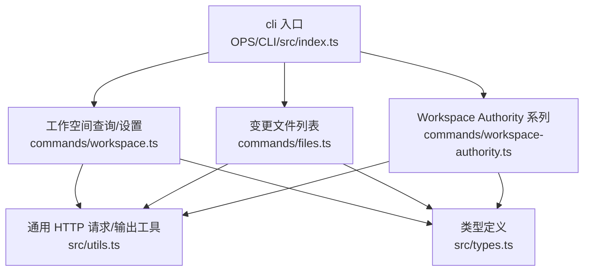
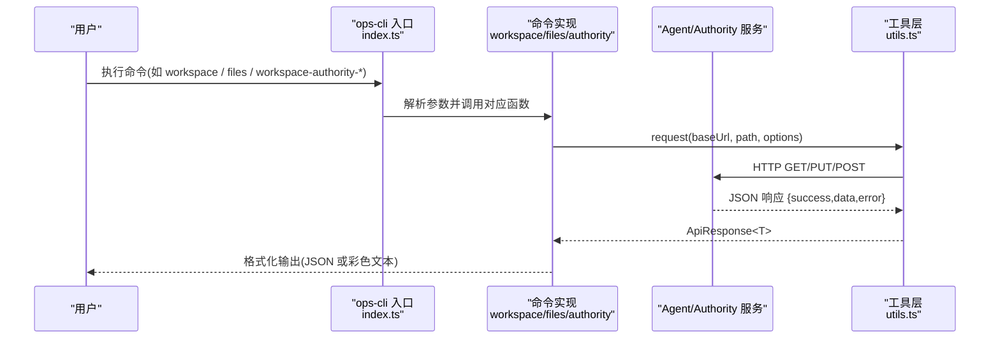
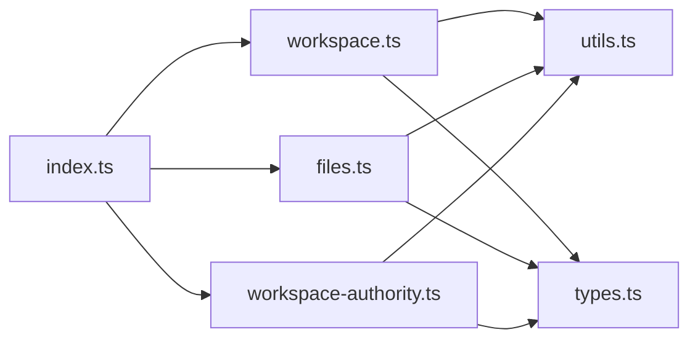

# 工作空间操作命令

<cite>
**本文引用的文件**   
- [index.ts](file://OPS/CLI/src/index.ts)
- [workspace.ts](file://OPS/CLI/src/commands/workspace.ts)
- [files.ts](file://OPS/CLI/src/commands/files.ts)
- [workspace-authority.ts](file://OPS/CLI/src/commands/workspace-authority.ts)
- [types.ts](file://OPS/CLI/src/types.ts)
- [utils.ts](file://OPS/CLI/src/utils.ts)
</cite>

## 目录
1. [简介](#简介)
2. [项目结构](#项目结构)
3. [核心组件](#核心组件)
4. [架构总览](#架构总览)
5. [详细组件分析](#详细组件分析)
6. [依赖关系分析](#依赖关系分析)
7. [性能与行为特征](#性能与行为特征)
8. [故障排查指南](#故障排查指南)
9. [结论](#结论)

## 简介
本文件面向使用 CLI 工具进行“工作空间”相关操作的运维与开发者，聚焦以下能力：
- workspace：查看工作空间信息（目录、类型、快照模式等）
- workspace-set：更新工作空间路径与自定义标记
- files：查看会话变更文件列表（已暂存/未暂存）
- workspace-authority-*：权限与健康治理系列命令（状态检查、预检验证、引导初始化、漂移恢复、一致性校验）

文档提供每个命令的参数选项、权限要求、输出结果说明，并给出同步问题与权限故障的排查方法。

## 项目结构
与本次主题相关的源码位于 OPS/CLI 子包中，入口通过 commander 注册各命令，具体实现分散在 commands 目录下。

图表来源
- [index.ts:196-228](file://OPS/CLI/src/index.ts#L196-L228)
- [workspace.ts:14-124](file://OPS/CLI/src/commands/workspace.ts#L14-L124)
- [files.ts:17-100](file://OPS/CLI/src/commands/files.ts#L17-L100)
- [workspace-authority.ts:108-620](file://OPS/CLI/src/commands/workspace-authority.ts#L108-L620)
- [utils.ts:5-41](file://OPS/CLI/src/utils.ts#L5-L41)
- [types.ts:68-92](file://OPS/CLI/src/types.ts#L68-L92)

章节来源
- [index.ts:1-374](file://OPS/CLI/src/index.ts#L1-L374)

## 核心组件
- 工作空间信息查看与更新：getWorkspace、updateWorkspace
- 变更文件列表：listFiles
- Workspace Authority 健康与治理：status、preflight、bootstrap、reconcile adopt、reconcile restore

章节来源
- [workspace.ts:14-124](file://OPS/CLI/src/commands/workspace.ts#L14-L124)
- [files.ts:17-100](file://OPS/CLI/src/commands/files.ts#L17-L100)
- [workspace-authority.ts:108-620](file://OPS/CLI/src/commands/workspace-authority.ts#L108-L620)

## 架构总览
所有命令均通过统一的 HTTP 客户端访问 Agent Service 或 Workspace Authority 服务，统一封装了错误处理、JSON 输出与进度提示。

图表来源
- [index.ts:196-347](file://OPS/CLI/src/index.ts#L196-L347)
- [utils.ts:5-41](file://OPS/CLI/src/utils.ts#L5-L41)
- [workspace.ts:14-124](file://OPS/CLI/src/commands/workspace.ts#L14-L124)
- [files.ts:17-100](file://OPS/CLI/src/commands/files.ts#L17-L100)
- [workspace-authority.ts:108-620](file://OPS/CLI/src/commands/workspace-authority.ts#L108-L620)

## 详细组件分析

### 命令：workspace（查看工作空间信息）
- 功能：获取指定会话的工作空间信息，包括工作目录、显示名称、是否自定义工作空间、工作空间类型、快照模式与分支。
- 路由：GET /api/agent/{sessionId}/workspace
- 参数
  - 位置参数：sessionId
  - 全局选项：-u/--url（默认 http://localhost:3201）、--json
- 权限要求：需要有效的 sessionId 以访问该会话的工作空间
- 输出
  - 非 JSON：打印工作空间基本信息
  - JSON：返回 { success, workspace } 或 { success, error }
- 典型用法
  - ops-cli -u <base> workspace <sessionId>
  - ops-cli --json workspace <sessionId>

章节来源
- [index.ts:199-204](file://OPS/CLI/src/index.ts#L199-L204)
- [workspace.ts:14-63](file://OPS/CLI/src/commands/workspace.ts#L14-L63)

### 命令：workspace-set（更新工作空间）
- 功能：更新会话工作空间目录，并可标记为自定义工作空间。
- 路由：PUT /api/agent/{sessionId}/workspace
- 参数
  - 位置参数：sessionId, workingDir
  - 可选选项：--custom（标记为自定义工作空间）
  - 全局选项：-u/--url、--json
- 权限要求：需要有效的 sessionId 以修改该会话的工作空间
- 输出
  - 非 JSON：成功提示与更新后的工作空间摘要
  - JSON：返回 { success, workspace } 或 { success, error }
- 典型用法
  - ops-cli workspace-set <sessionId> <workingDir>
  - ops-cli workspace-set <sessionId> <workingDir> --custom
  - ops-cli --json workspace-set <sessionId> <workingDir>

章节来源
- [index.ts:206-218](file://OPS/CLI/src/index.ts#L206-L218)
- [workspace.ts:65-124](file://OPS/CLI/src/commands/workspace.ts#L65-L124)

### 命令：files（查看变更文件列表）
- 功能：列出会话的文件变更，包含已暂存与未暂存两类，以及变更动作（创建/修改/删除）。
- 路由：GET /api/agent/{sessionId}/files
- 参数
  - 位置参数：sessionId
  - 全局选项：-u/--url、--json
- 权限要求：需要有效的 sessionId 以读取该会话的文件变更
- 输出
  - 非 JSON：按“已暂存/未暂存”分组展示，附带 action 颜色标识
  - JSON：返回 { success, sessionId, files, staged, unstaged } 或 { success, error }
- 注意
  - 当前实现仅展示变更列表，不包含差异内容对比与冲突解决逻辑；如需差异分析，请结合后端接口或编辑器诊断事件。

章节来源
- [index.ts:223-228](file://OPS/CLI/src/index.ts#L223-L228)
- [files.ts:17-100](file://OPS/CLI/src/commands/files.ts#L17-L100)

### 命令：workspace-authority-status（权限与健康状态检查）
- 功能：只读查询 Workspace Authority 的健康状态，包括 ready、revision、rootHash、队列深度、租约、准备事务、外部漂移等。
- 路由：GET /api/workspace-authority/projects/{projectId}/workspaces/{workspaceId}/health?sessionId=...
- 参数
  - 位置参数：projectId, workspaceId
  - 必填选项：--session <sessionId>（用于校验访问权限）
  - 全局选项：-u/--url、--json
- 权限要求：需具备对目标工作空间的访问权限（由 sessionId 校验）
- 输出
  - 非 JSON：打印详细信息与风险项（warnings）
  - JSON：返回 { success, projectId, workspaceId, status, warnings } 或错误对象
- 关键指标
  - ready：是否就绪
  - externalDrift：是否存在外部漂移
  - queueDepth：待处理变更队列长度
  - activeLease：是否存在活跃或过期写租约
  - preparedCount：需要恢复的准备事务数
  - stagingCount：暂存文件数量
  - backupCount/missingBackupCount：备份完整性
  - journalEntries/projectionAckEntries：日志与投影确认条目数

章节来源
- [index.ts:259-273](file://OPS/CLI/src/index.ts#L259-L273)
- [workspace-authority.ts:108-197](file://OPS/CLI/src/commands/workspace-authority.ts#L108-L197)
- [types.ts:68-92](file://OPS/CLI/src/types.ts#L68-L92)

### 命令：workspace-authority-preflight（预检验证）
- 功能：基于 health 数据判断是否满足关键动作前置条件，输出 passed/issues。
- 路由：复用 health 端点
- 参数
  - 位置参数：projectId, workspaceId
  - 必填选项：--session <sessionId>
  - 可选选项：--fail-on-queue（队列非空也判失败）、--fail-on-staging（存在暂存文件也判失败）
  - 全局选项：-u/--url、--json
- 权限要求：同 status
- 输出
  - 非 JSON：passed 或失败原因列表
  - JSON：{ success, passed, issues, warnings, status } 或错误对象

章节来源
- [index.ts:275-293](file://OPS/CLI/src/index.ts#L275-L293)
- [workspace-authority.ts:199-280](file://OPS/CLI/src/commands/workspace-authority.ts#L199-L280)

### 命令：workspace-authority-bootstrap（引导初始化）
- 功能：默认 dry-run 检查是否需要 bootstrap；加 --apply 才创建 Authority state。
- 路由
  - 检查：health
  - 执行：GET /api/workspace-authority/projects/{projectId}/workspaces/{workspaceId}/state?sessionId=...
- 参数
  - 位置参数：projectId, workspaceId
  - 必填选项：--session <sessionId>
  - 可选选项：--apply（执行 bootstrap）
  - 全局选项：-u/--url、--json
- 权限要求：需具备对工作空间的写入权限（由服务端校验）
- 输出
  - dry-run：action=would_bootstrap，applied=false
  - 执行后：action=bootstrap，applied=true，返回新 state（revision/rootHash）

章节来源
- [index.ts:295-311](file://OPS/CLI/src/index.ts#L295-L311)
- [workspace-authority.ts:282-385](file://OPS/CLI/src/commands/workspace-authority.ts#L282-L385)

### 命令：workspace-authority-reconcile-adopt（漂移恢复-采用磁盘）
- 功能：检测 external drift；dry-run 下报告 would_adopt；--apply 将当前磁盘内容作为新 revision。
- 路由
  - 检查：health
  - 执行：POST /api/workspace-authority/projects/{projectId}/workspaces/{workspaceId}/reconcile/adopt?sessionId=...
- 参数
  - 位置参数：projectId, workspaceId
  - 必填选项：--session <sessionId>
  - 可选选项：--apply
  - 全局选项：-u/--url、--json
- 权限要求：需具备对工作空间的写入权限
- 输出
  - dry-run：action=would_adopt，applied=false
  - 执行后：action=reconcile_adopt，applied=true，返回新 state

章节来源
- [index.ts:313-329](file://OPS/CLI/src/index.ts#L313-L329)
- [workspace-authority.ts:387-491](file://OPS/CLI/src/commands/workspace-authority.ts#L387-L491)

### 命令：workspace-authority-reconcile-restore（漂移恢复-回滚到最近提交）
- 功能：检测 external drift；dry-run 下报告 would_restore；--apply 恢复最后 committed 内容并丢弃外部漂移。
- 路由
  - 检查：health
  - 执行：POST /api/workspace-authority/projects/{projectId}/workspaces/{workspaceId}/reconcile/restore?sessionId=...
- 参数
  - 位置参数：projectId, workspaceId
  - 必填选项：--session <sessionId>
  - 可选选项：--apply
  - 全局选项：-u/--url、--json
- 权限要求：需具备对工作空间的写入权限
- 阻断条件
  - authority state missing
  - active or stale write lease exists
  - prepared transactions need recovery
  - committed backups are incomplete
- 输出
  - dry-run：action=would_restore，applied=false
  - 执行后：action=reconcile_restore，applied=true，返回新 state

章节来源
- [index.ts:331-347](file://OPS/CLI/src/index.ts#L331-L347)
- [workspace-authority.ts:493-620](file://OPS/CLI/src/commands/workspace-authority.ts#L493-L620)

## 依赖关系分析
- 入口 index.ts 负责命令注册与参数解析，转发至各命令模块。
- 各命令模块通过 utils.request 发起 HTTP 请求，统一处理成功/失败分支与 JSON 输出。
- types.ts 定义了 WorkspaceAuthorityHealthStatus 等关键数据结构，供命令与工具层共享。

图表来源
- [index.ts:196-347](file://OPS/CLI/src/index.ts#L196-L347)
- [workspace.ts:1-124](file://OPS/CLI/src/commands/workspace.ts#L1-L124)
- [files.ts:1-100](file://OPS/CLI/src/commands/files.ts#L1-L100)
- [workspace-authority.ts:1-620](file://OPS/CLI/src/commands/workspace-authority.ts#L1-L620)
- [utils.ts:5-41](file://OPS/CLI/src/utils.ts#L5-L41)
- [types.ts:68-92](file://OPS/CLI/src/types.ts#L68-L92)

章节来源
- [index.ts:1-374](file://OPS/CLI/src/index.ts#L1-L374)
- [utils.ts:5-41](file://OPS/CLI/src/utils.ts#L5-L41)
- [types.ts:68-92](file://OPS/CLI/src/types.ts#L68-L92)

## 性能与行为特征
- 网络 I/O：所有命令均为轻量级 HTTP 请求，延迟主要取决于服务端响应时间。
- 输出格式：--json 便于程序化消费；无 --json 时提供人类可读的彩色输出。
- 幂等性：
  - workspace-set 会覆盖 workingDir 与 customWorkspace 标记
  - reconcile adopt/restore 为幂等修复操作，但会改变 revision/rootHash
- 安全性：所有写操作均需服务端鉴权（通过 sessionId 校验），建议仅在受控环境执行 --apply。

[本节为通用指导，不直接分析具体文件]

## 故障排查指南

### 工作空间同步问题
- 现象
  - files 显示大量变更或长时间未收敛
  - workspace-authority-status 显示 queueDepth > 0 或 externalDrift = true
- 排查步骤
  1) 使用 workspace-authority-status 查看 ready、externalDrift、queueDepth、stagingCount、backupCount/missingBackupCount 等指标
  2) 若 externalDrift 为真且无阻塞项，优先尝试 reconcile-adopt（先 dry-run，再 --apply）
  3) 若需要恢复到最近一致版本，使用 reconcile-restore（先 dry-run，再 --apply）
  4) 若存在 activeLease 或 preparedCount > 0，应先等待或清理锁与准备事务后再重试
- 参考命令
  - workspace-authority-status
  - workspace-authority-reconcile-adopt
  - workspace-authority-reconcile-restore

章节来源
- [workspace-authority.ts:108-197](file://OPS/CLI/src/commands/workspace-authority.ts#L108-L197)
- [workspace-authority.ts:387-491](file://OPS/CLI/src/commands/workspace-authority.ts#L387-L491)
- [workspace-authority.ts:493-620](file://OPS/CLI/src/commands/workspace-authority.ts#L493-L620)

### 权限故障
- 现象
  - 任意 workspace-authority-* 命令返回错误，或 preflight 未通过
- 排查步骤
  1) 确认 --session 对应的编辑会话具有目标工作空间访问权限
  2) 使用 workspace-authority-preflight 检查阻断项（如 workspace missing、state missing、lease 存在等）
  3) 若缺少 Authority state，先执行 bootstrap（dry-run 验证，再 --apply）
  4) 若存在外部漂移且需要恢复，再执行 reconcile-restore
- 参考命令
  - workspace-authority-preflight
  - workspace-authority-bootstrap
  - workspace-authority-reconcile-restore

章节来源
- [index.ts:275-311](file://OPS/CLI/src/index.ts#L275-L311)
- [workspace-authority.ts:199-280](file://OPS/CLI/src/commands/workspace-authority.ts#L199-L280)
- [workspace-authority.ts:282-385](file://OPS/CLI/src/commands/workspace-authority.ts#L282-L385)

### 变更文件列表异常
- 现象
  - files 为空但预期有变更，或 staged/unstaged 不一致
- 排查步骤
  1) 确认 sessionId 有效且处于活跃状态
  2) 检查 workspace 指向的 workingDir 是否正确（必要时用 workspace-set 修正）
  3) 观察 workspace-authority-status 中的 stagingCount 与 queueDepth，辅助定位同步阶段
- 参考命令
  - files
  - workspace
  - workspace-set
  - workspace-authority-status

章节来源
- [files.ts:17-100](file://OPS/CLI/src/commands/files.ts#L17-L100)
- [workspace.ts:14-124](file://OPS/CLI/src/commands/workspace.ts#L14-L124)
- [workspace-authority.ts:108-197](file://OPS/CLI/src/commands/workspace-authority.ts#L108-L197)

## 结论
- workspace 与 workspace-set 提供了工作空间信息的查看与路径/标记更新能力，适合在调试与迁移场景中使用。
- files 命令可快速了解会话的文件变更概况，便于定位同步阶段与范围。
- workspace-authority-* 系列命令构成了一套完整的权限与健康治理闭环：状态检查、预检、引导、漂移恢复与一致性校验，配合 --json 输出可实现自动化编排。
- 建议在流水线或运维脚本中优先使用 dry-run 模式验证影响面，再按需启用 --apply，确保变更可控。