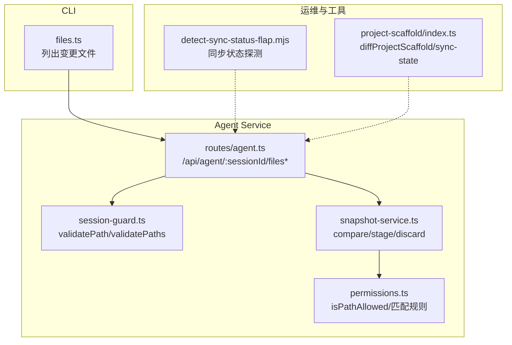
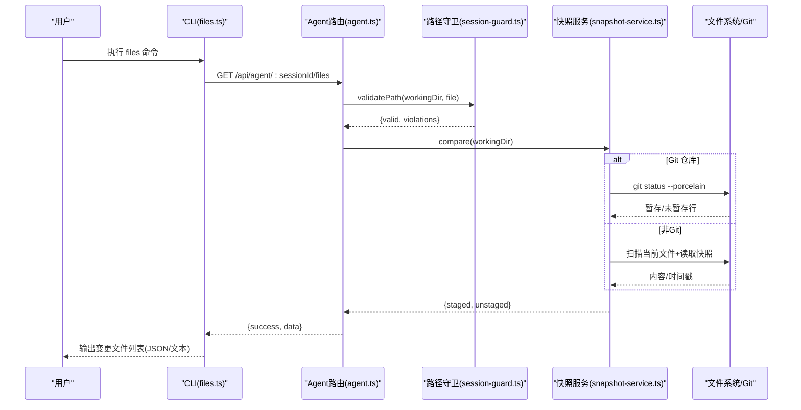
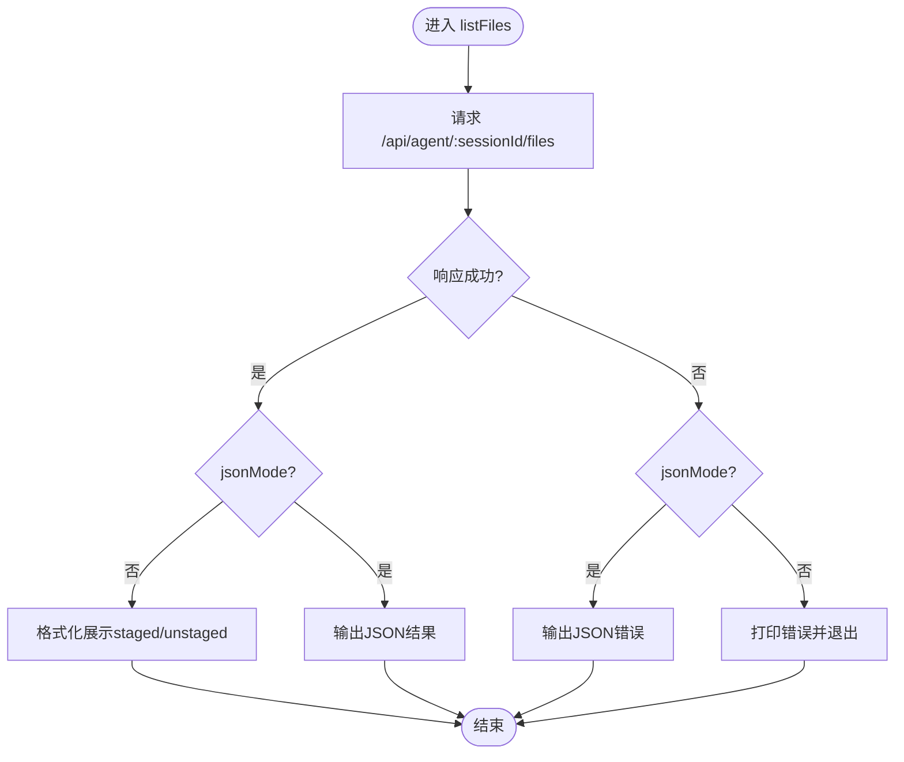
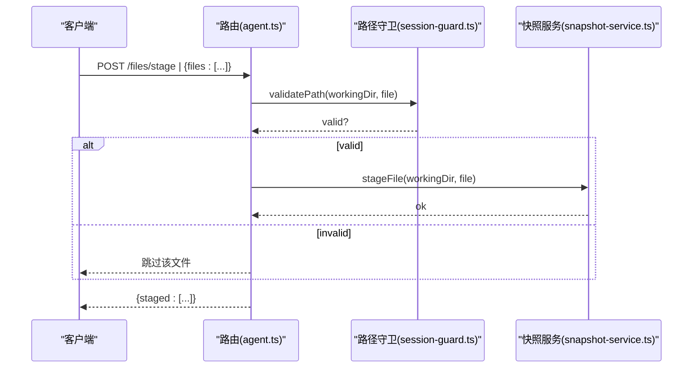
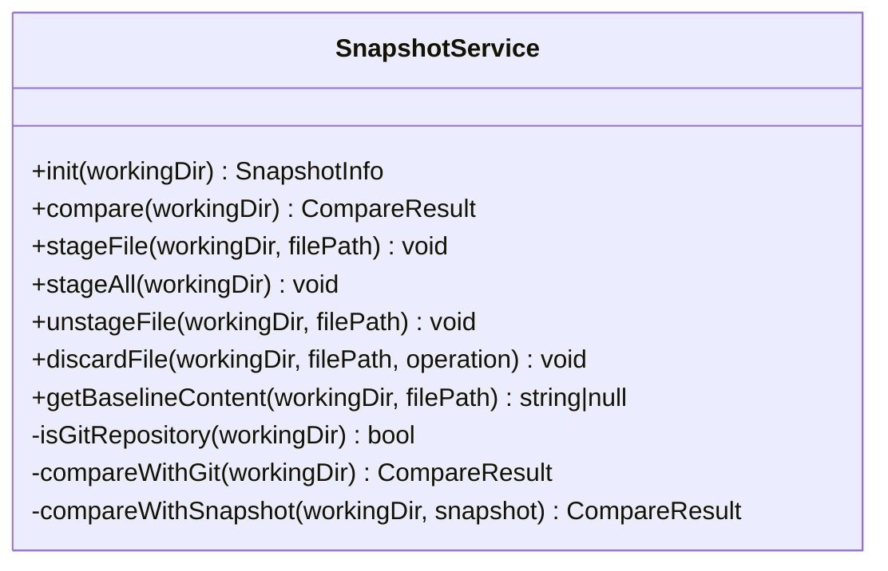
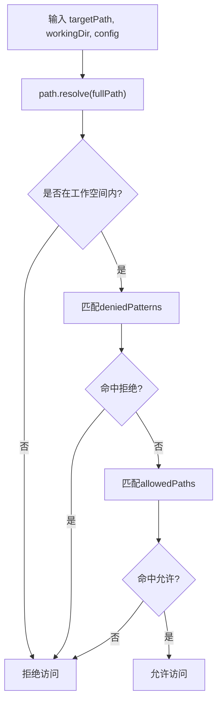
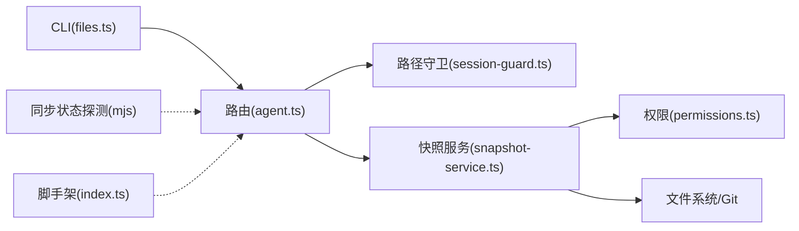

# 文件管理命令

<cite>
**本文引用的文件**
- [OPS/CLI/src/commands/files.ts](file://OPS/CLI/src/commands/files.ts)
- [packages/agent-service/src/routes/agent.ts](file://packages/agent-service/src/routes/agent.ts)
- [packages/agent-service/src/session/snapshot-service.ts](file://packages/agent-service/src/session/snapshot-service.ts)
- [packages/agent-service/src/backends/pi-tools/permissions.ts](file://packages/agent-service/src/backends/pi-tools/permissions.ts)
- [packages/agent-service/src/session/session-guard.ts](file://packages/agent-service/src/session/session-guard.ts)
- [scripts/development/detect-sync-status-flap.mjs](file://scripts/development/detect-sync-status-flap.mjs)
- [packages/project-scaffold/src/index.ts](file://packages/project-scaffold/src/index.ts)
</cite>

## 目录
1. [简介](#简介)
2. [项目结构](#项目结构)
3. [核心组件](#核心组件)
4. [架构总览](#架构总览)
5. [详细组件分析](#详细组件分析)
6. [依赖关系分析](#依赖关系分析)
7. [性能与增量同步](#性能与增量同步)
8. [权限检查、路径验证与安全](#权限检查路径验证与安全)
9. [最佳实践](#最佳实践)
10. [故障排查与恢复](#故障排查与恢复)
11. [结论](#结论)

## 简介
本文件围绕“文件管理相关命令”展开，重点说明 files 命令的文件变更检测能力（差异分析、状态跟踪、冲突解决）、同步状态查询、增量更新与全量同步的实现原理，以及权限检查、路径验证和安全防护措施。同时提供批量操作、错误处理与性能优化建议，并给出常见问题排查方法与故障恢复策略。

## 项目结构
与文件管理命令相关的代码主要分布在以下位置：
- CLI 层：提供用户交互的命令入口与输出格式化
- Agent Service 路由层：暴露 HTTP API，接收并校验请求
- 快照服务：实现 Git 与非 Git 两种模式下的变更检测、暂存与丢弃
- 权限与路径守卫：统一的路径白名单/黑名单与路径穿越防护
- 同步状态探测脚本：用于诊断同步状态抖动问题
- 项目脚手架：本地项目包与远程的 diff 与同步状态维护

图表来源
- [OPS/CLI/src/commands/files.ts:1-100](file://OPS/CLI/src/commands/files.ts#L1-L100)
- [packages/agent-service/src/routes/agent.ts:560-648](file://packages/agent-service/src/routes/agent.ts#L560-L648)
- [packages/agent-service/src/session/session-guard.ts:76-123](file://packages/agent-service/src/session/session-guard.ts#L76-L123)
- [packages/agent-service/src/session/snapshot-service.ts:108-174](file://packages/agent-service/src/session/snapshot-service.ts#L108-L174)
- [packages/agent-service/src/backends/pi-tools/permissions.ts:40-73](file://packages/agent-service/src/backends/pi-tools/permissions.ts#L40-L73)
- [scripts/development/detect-sync-status-flap.mjs:65-735](file://scripts/development/detect-sync-status-flap.mjs#L65-L735)
- [packages/project-scaffold/src/index.ts:1372-1413](file://packages/project-scaffold/src/index.ts#L1372-L1413)

章节来源
- [OPS/CLI/src/commands/files.ts:1-100](file://OPS/CLI/src/commands/files.ts#L1-L100)
- [packages/agent-service/src/routes/agent.ts:560-648](file://packages/agent-service/src/routes/agent.ts#L560-L648)
- [packages/agent-service/src/session/snapshot-service.ts:108-174](file://packages/agent-service/src/session/snapshot-service.ts#L108-L174)
- [packages/agent-service/src/backends/pi-tools/permissions.ts:40-73](file://packages/agent-service/src/backends/pi-tools/permissions.ts#L40-L73)
- [packages/agent-service/src/session/session-guard.ts:76-123](file://packages/agent-service/src/session/session-guard.ts#L76-L123)
- [scripts/development/detect-sync-status-flap.mjs:65-735](file://scripts/development/detect-sync-status-flap.mjs#L65-L735)
- [packages/project-scaffold/src/index.ts:1372-1413](file://packages/project-scaffold/src/index.ts#L1372-L1413)

## 核心组件
- CLI 文件列表命令：调用后端接口获取变更文件清单，并以 JSON 或人类可读格式输出
- Agent 路由：对 /api/agent/:sessionId/files 系列接口进行鉴权、参数校验与转发
- 快照服务：在 Git 仓库模式下使用 git status 解析暂存/未暂存；在非 Git 模式下基于内存快照对比内容/时间戳
- 权限与路径守卫：统一路径白名单/黑名单匹配与路径穿越防护
- 同步状态探测：周期性采样 UI 渲染的同步状态，辅助定位“同步失败”显示异常
- 项目脚手架：维护 .workbench/sync-state.json，计算受管文件哈希，支持 diff 与提交后清理

章节来源
- [OPS/CLI/src/commands/files.ts:17-86](file://OPS/CLI/src/commands/files.ts#L17-L86)
- [packages/agent-service/src/routes/agent.ts:560-648](file://packages/agent-service/src/routes/agent.ts#L560-L648)
- [packages/agent-service/src/session/snapshot-service.ts:108-174](file://packages/agent-service/src/session/snapshot-service.ts#L108-L174)
- [packages/agent-service/src/backends/pi-tools/permissions.ts:40-73](file://packages/agent-service/src/backends/pi-tools/permissions.ts#L40-L73)
- [scripts/development/detect-sync-status-flap.mjs:65-735](file://scripts/development/detect-sync-status-flap.mjs#L65-L735)
- [packages/project-scaffold/src/index.ts:1372-1413](file://packages/project-scaffold/src/index.ts#L1372-L1413)

## 架构总览
下图展示了从 CLI 到 Agent Service 再到文件系统与 Git 的完整调用链，包括变更检测、暂存与丢弃等关键流程。

图表来源
- [OPS/CLI/src/commands/files.ts:17-86](file://OPS/CLI/src/commands/files.ts#L17-L86)
- [packages/agent-service/src/routes/agent.ts:560-648](file://packages/agent-service/src/routes/agent.ts#L560-L648)
- [packages/agent-service/src/session/session-guard.ts:76-123](file://packages/agent-service/src/session/session-guard.ts#L76-L123)
- [packages/agent-service/src/session/snapshot-service.ts:108-174](file://packages/agent-service/src/session/snapshot-service.ts#L108-L174)

## 详细组件分析

### 组件一：CLI 文件列表命令（files.ts）
- 功能要点
  - 通过 request 封装调用后端 /api/agent/:sessionId/files
  - 支持 JSON 模式与人类可读模式输出
  - 区分 staged/unstaged 两类变更，按 action 着色展示
- 错误处理
  - 网络异常或后端返回 success=false 时，JSON 模式输出结构化错误，文本模式打印错误详情并退出
- 数据模型
  - FilesData 包含 sessionId、files、staged、unstaged 字段，便于上层聚合展示

图表来源
- [OPS/CLI/src/commands/files.ts:17-86](file://OPS/CLI/src/commands/files.ts#L17-L86)

章节来源
- [OPS/CLI/src/commands/files.ts:17-86](file://OPS/CLI/src/commands/files.ts#L17-L86)

### 组件二：Agent 路由（agent.ts）
- 暴露接口
  - POST /api/agent/:sessionId/files/stage：批量暂存文件
  - POST /api/agent/:sessionId/files/discard：批量丢弃文件（create/modify/delete）
- 安全与校验
  - 校验会话存在与工作目录绑定
  - 对每个文件路径调用 validatePath 进行路径穿越防护
- 业务逻辑
  - 遍历请求体中的文件列表，逐个调用 snapshotService.stageFile/discardFile
  - 返回已处理的文件清单

图表来源
- [packages/agent-service/src/routes/agent.ts:560-648](file://packages/agent-service/src/routes/agent.ts#L560-L648)
- [packages/agent-service/src/session/session-guard.ts:76-123](file://packages/agent-service/src/session/session-guard.ts#L76-L123)
- [packages/agent-service/src/session/snapshot-service.ts:256-296](file://packages/agent-service/src/session/snapshot-service.ts#L256-L296)

章节来源
- [packages/agent-service/src/routes/agent.ts:560-648](file://packages/agent-service/src/routes/agent.ts#L560-L648)

### 组件三：快照服务（snapshot-service.ts）
- 初始化与模式识别
  - init：检测是否为 Git 仓库；若是则记录分支信息，否则创建内存快照
- 差异比较
  - compare：Git 模式走 git status --porcelain；非 Git 模式对比内存快照与当前文件内容/时间戳
- 暂存与丢弃
  - stageFile/stageAll：Git 模式执行 git add/-A；非 Git 模式无暂存概念
  - unstageFile：Git 模式执行 git reset HEAD
  - discardFile：Git 模式 checkout HEAD 或删除新建文件；非 Git 模式回写到快照基线或删除
- 基线内容
  - getBaselineContent：Git 模式取 HEAD 版本；非 Git 模式从内存快照读取

图表来源
- [packages/agent-service/src/session/snapshot-service.ts:108-174](file://packages/agent-service/src/session/snapshot-service.ts#L108-L174)
- [packages/agent-service/src/session/snapshot-service.ts:256-329](file://packages/agent-service/src/session/snapshot-service.ts#L256-L329)

章节来源
- [packages/agent-service/src/session/snapshot-service.ts:108-174](file://packages/agent-service/src/session/snapshot-service.ts#L108-L174)
- [packages/agent-service/src/session/snapshot-service.ts:256-329](file://packages/agent-service/src/session/snapshot-service.ts#L256-L329)

### 组件四：权限与路径守卫（permissions.ts、session-guard.ts）
- 路径允许判定
  - isPathAllowed：基于 workingDir 做绝对路径归一化，拒绝工作空间外访问；再结合 deniedPatterns 与 allowedPaths 的 glob 匹配
- 路径穿越防护
  - validatePath/validatePaths：解析真实路径，检测符号链接逃逸与相对路径越界
- 默认权限配置
  - DEFAULT_WORKSPACE_PERMISSIONS：限定可访问路径与命令白名单/黑名单

图表来源
- [packages/agent-service/src/backends/pi-tools/permissions.ts:40-73](file://packages/agent-service/src/backends/pi-tools/permissions.ts#L40-L73)
- [packages/agent-service/src/session/session-guard.ts:76-123](file://packages/agent-service/src/session/session-guard.ts#L76-L123)

章节来源
- [packages/agent-service/src/backends/pi-tools/permissions.ts:40-73](file://packages/agent-service/src/backends/pi-tools/permissions.ts#L40-L73)
- [packages/agent-service/src/session/session-guard.ts:76-123](file://packages/agent-service/src/session/session-guard.ts#L76-L123)

### 组件五：同步状态探测（detect-sync-status-flap.mjs）
- 作用
  - 定时采样前端页面渲染的同步状态，判断是否存在“同步失败”闪烁或丢失
- 关键指标
  - flushProbe：触发 flush 的能力与响应
  - flushErrorVisible：UI 是否正确展示同步错误
  - statusMissing：是否能在渲染页找到同步状态文本
- 适用场景
  - 定位“同步状态不稳定”的前端渲染或后端持久化问题

章节来源
- [scripts/development/detect-sync-status-flap.mjs:65-735](file://scripts/development/detect-sync-status-flap.mjs#L65-L735)

### 组件六：项目脚手架同步状态（project-scaffold/index.ts）
- 同步状态文件
  - .workbench/sync-state.json 维护受管文件的哈希与元信息
- diff 与提交
  - diffProjectScaffold：对比当前受管文件与 sync-state，生成 created/updated/deleted 列表
  - 提交后应清理差异，确保 diff 结果为空

章节来源
- [packages/project-scaffold/src/index.ts:1372-1413](file://packages/project-scaffold/src/index.ts#L1372-L1413)

## 依赖关系分析
- CLI 仅负责发起 HTTP 请求与输出格式化，不直接操作文件系统
- Agent 路由承担鉴权、参数校验与调度职责
- 快照服务是差异检测与文件操作的核心，内部依赖 Git 或文件系统
- 权限与路径守卫为所有文件访问提供统一的安全边界
- 同步状态探测脚本独立于主流程，用于诊断 UI 层同步状态一致性

图表来源
- [OPS/CLI/src/commands/files.ts:17-86](file://OPS/CLI/src/commands/files.ts#L17-L86)
- [packages/agent-service/src/routes/agent.ts:560-648](file://packages/agent-service/src/routes/agent.ts#L560-L648)
- [packages/agent-service/src/session/session-guard.ts:76-123](file://packages/agent-service/src/session/session-guard.ts#L76-L123)
- [packages/agent-service/src/session/snapshot-service.ts:108-174](file://packages/agent-service/src/session/snapshot-service.ts#L108-L174)
- [packages/agent-service/src/backends/pi-tools/permissions.ts:40-73](file://packages/agent-service/src/backends/pi-tools/permissions.ts#L40-L73)
- [scripts/development/detect-sync-status-flap.mjs:65-735](file://scripts/development/detect-sync-status-flap.mjs#L65-L735)
- [packages/project-scaffold/src/index.ts:1372-1413](file://packages/project-scaffold/src/index.ts#L1372-L1413)

章节来源
- [OPS/CLI/src/commands/files.ts:17-86](file://OPS/CLI/src/commands/files.ts#L17-L86)
- [packages/agent-service/src/routes/agent.ts:560-648](file://packages/agent-service/src/routes/agent.ts#L560-L648)
- [packages/agent-service/src/session/snapshot-service.ts:108-174](file://packages/agent-service/src/session/snapshot-service.ts#L108-L174)
- [packages/agent-service/src/backends/pi-tools/permissions.ts:40-73](file://packages/agent-service/src/backends/pi-tools/permissions.ts#L40-L73)
- [scripts/development/detect-sync-status-flap.mjs:65-735](file://scripts/development/detect-sync-status-flap.mjs#L65-L735)
- [packages/project-scaffold/src/index.ts:1372-1413](file://packages/project-scaffold/src/index.ts#L1372-L1413)

## 性能与增量同步
- 差异检测
  - Git 模式：git status --porcelain 高效返回索引与工作树差异，适合大仓库
  - 非 Git 模式：首次扫描构建内存快照，后续只比对新增/修改/删除，避免重复全量读取
- 增量更新
  - 暂存/丢弃操作针对单个文件或批量处理，减少不必要的 I/O
- 全量同步
  - 非 Git 模式下可通过重新创建快照实现“全量基线”，但需谨慎评估磁盘与 CPU 开销
- 建议
  - 优先使用 Git 仓库模式以获得更好的性能与可靠性
  - 大批量操作时分批提交，避免单次请求过大导致超时
  - 定期清理无用文件，降低扫描与快照体积

章节来源
- [packages/agent-service/src/session/snapshot-service.ts:108-174](file://packages/agent-service/src/session/snapshot-service.ts#L108-L174)
- [packages/agent-service/src/session/snapshot-service.ts:256-329](file://packages/agent-service/src/session/snapshot-service.ts#L256-L329)

## 权限检查、路径验证与安全
- 路径白名单/黑名单
  - 通过 allowedPaths 与 deniedPatterns 控制可访问范围，支持通配符匹配
- 路径穿越防护
  - 解析真实路径并校验是否位于工作空间内，防止符号链接逃逸
- 命令限制
  - 默认权限配置限制危险命令与 shell 组合语法，降低误用风险
- 建议
  - 在生产环境收紧 allowedPaths，仅开放必要目录
  - 定期审计 deniedPatterns，避免遗漏敏感路径

章节来源
- [packages/agent-service/src/backends/pi-tools/permissions.ts:40-73](file://packages/agent-service/src/backends/pi-tools/permissions.ts#L40-L73)
- [packages/agent-service/src/session/session-guard.ts:76-123](file://packages/agent-service/src/session/session-guard.ts#L76-L123)

## 最佳实践
- 批量操作
  - 将多个文件放入一次请求中，减少往返次数
  - 对超大目录分批处理，避免单次任务过长
- 错误处理
  - CLI 的 JSON 模式便于自动化集成，建议在 CI/CD 中使用
  - 捕获并记录具体错误码与消息，便于快速定位
- 性能优化
  - 优先使用 Git 仓库模式
  - 避免频繁全量扫描，利用增量差异
- 安全加固
  - 严格配置权限策略，最小权限原则
  - 启用路径穿越防护，禁止外部不可信路径

[本节为通用指导，无需特定文件引用]

## 故障排查与恢复
- 常见现象
  - 同步状态闪烁或丢失：使用 detect-sync-status-flap.mjs 进行探测，关注 flushProbe 与 flushErrorVisible
  - 变更未正确暂存：检查 validatePath 是否通过，确认 workingDir 绑定
  - 非 Git 模式差异异常：确认内存快照是否被清理或进程重启
- 恢复策略
  - 丢弃变更：使用 discard 接口，根据 operation 类型选择 create/modify/delete
  - 重置基线：非 Git 模式下重建快照，重新建立基线
  - 修复权限：调整 allowedPaths/deniedPatterns，确保目标路径合法
- 诊断步骤
  - 先运行 health 检查服务可用性
  - 使用 diagnostics 专项命令查看 autosave/collab/preview 事件
  - 导出 JSON 复现包，便于离线分析

章节来源
- [scripts/development/detect-sync-status-flap.mjs:65-735](file://scripts/development/detect-sync-status-flap.mjs#L65-L735)
- [packages/agent-service/src/routes/agent.ts:602-648](file://packages/agent-service/src/routes/agent.ts#L602-L648)
- [packages/agent-service/src/session/snapshot-service.ts:298-329](file://packages/agent-service/src/session/snapshot-service.ts#L298-L329)

## 结论
文件管理命令以 CLI 为入口，经由 Agent 路由与快照服务完成变更检测与文件操作，并通过权限与路径守卫保障安全。Git 模式具备更优的性能与可靠性，非 Git 模式提供轻量替代方案。配合同步状态探测与脚手架同步状态文件，可实现端到端的变更可视与可控。遵循本文的最佳实践与故障排查方法，可有效提升稳定性与效率。