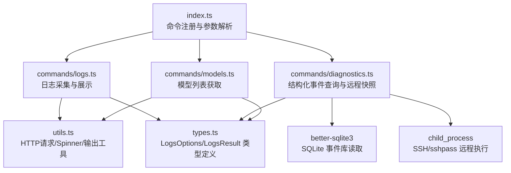
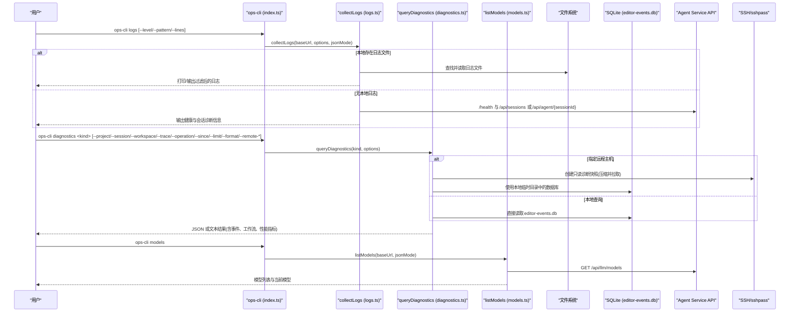
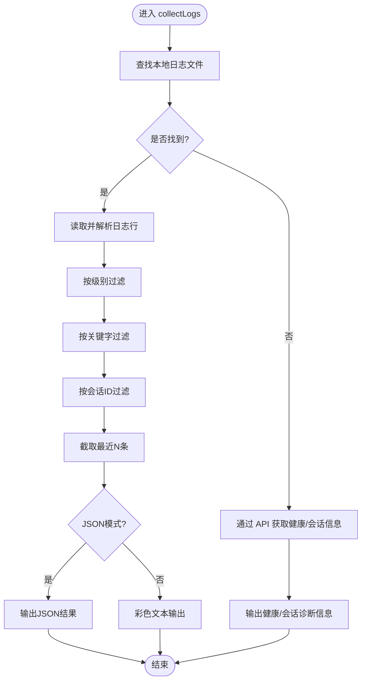
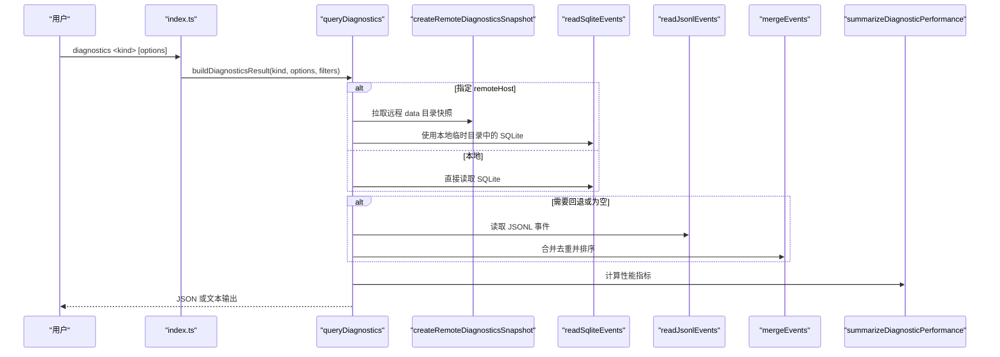
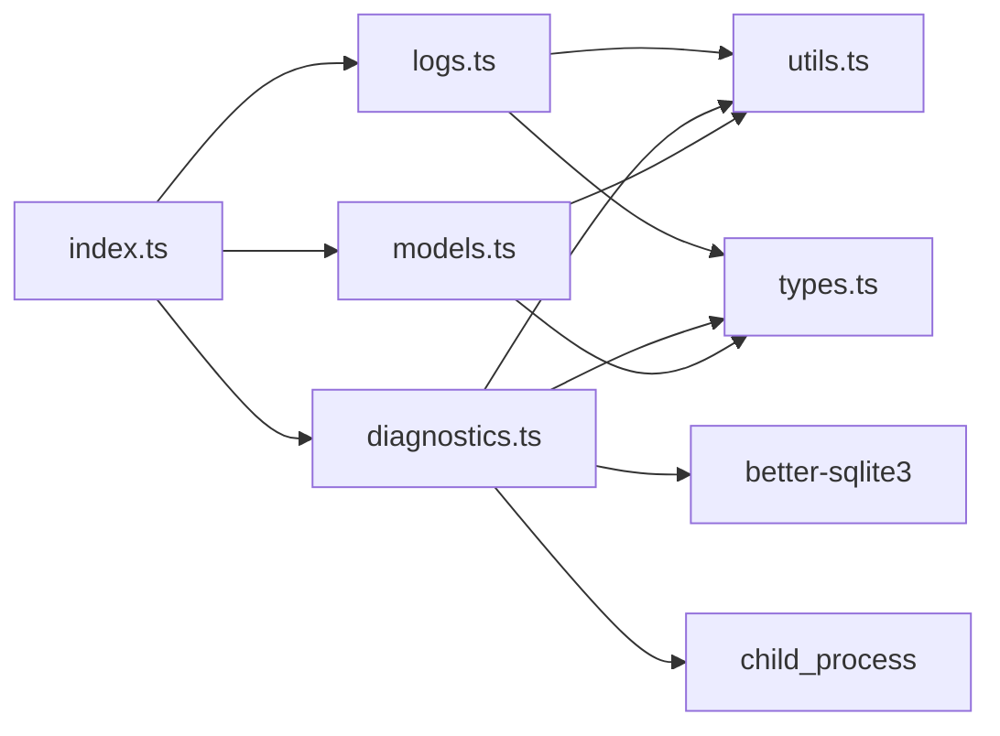

# 日志与诊断命令

<cite>
**本文引用的文件**
- [index.ts](file://OPS/CLI/src/index.ts)
- [logs.ts](file://OPS/CLI/src/commands/logs.ts)
- [diagnostics.ts](file://OPS/CLI/src/commands/diagnostics.ts)
- [models.ts](file://OPS/CLI/src/commands/models.ts)
- [types.ts](file://OPS/CLI/src/types.ts)
- [utils.ts](file://OPS/CLI/src/utils.ts)
</cite>

## 目录
1. [简介](#简介)
2. [项目结构](#项目结构)
3. [核心组件](#核心组件)
4. [架构总览](#架构总览)
5. [详细组件分析](#详细组件分析)
6. [依赖关系分析](#依赖关系分析)
7. [性能考量](#性能考量)
8. [故障排查指南](#故障排查指南)
9. [结论](#结论)
10. [附录](#附录)

## 简介
本文件面向运维、开发与测试人员，系统化说明 CLI 中与“日志与诊断”相关的三个命令：
- logs：本地或远程的日志采集与过滤（级别、关键字、会话、行数），并支持 JSON 输出。
- diagnostics：结构化诊断事件查询（按项目、会话、工作区、Trace/Operation、时间范围等），支持远程 SSH 快照拉取、文本/JSON 输出、导出到文件。
- models：列出可用模型及当前模型，便于切换与排障。

文档同时提供参数选项、查询语法、输出格式说明，以及分析方法、性能监控和问题定位的最佳实践。

## 项目结构
与日志与诊断相关的主要代码位于 OPS/CLI 子项目中，入口通过 commander 注册各命令，具体实现分散在 commands 目录下。

图表来源
- [index.ts:167-254](file://OPS/CLI/src/index.ts#L167-L254)
- [logs.ts:1-294](file://OPS/CLI/src/commands/logs.ts#L1-L294)
- [diagnostics.ts:1-825](file://OPS/CLI/src/commands/diagnostics.ts#L1-L825)
- [models.ts:1-76](file://OPS/CLI/src/commands/models.ts#L1-L76)
- [utils.ts:1-174](file://OPS/CLI/src/utils.ts#L1-L174)
- [types.ts:157-174](file://OPS/CLI/src/types.ts#L157-L174)

章节来源
- [index.ts:1-374](file://OPS/CLI/src/index.ts#L1-L374)

## 核心组件
- 日志采集器（logs）
  - 优先从本地路径读取 agent-service 日志文件；若未找到，则通过 API 获取健康状态与会话信息作为替代数据源。
  - 支持级别过滤、关键字搜索、会话 ID 过滤、显示最近 N 行。
  - 支持 JSON 模式输出，便于程序化消费。
- 诊断事件查询器（diagnostics）
  - 主数据源为 SQLite 事件库；当不可用或需要关联查询时回退到 JSONL 文件。
  - 支持按项目、会话、工作区、编辑会话、Trace/Operation、事件类型、分组、时间范围筛选。
  - 支持远程 SSH 快照拉取（自动探测 data 目录），支持文本/JSON 输出与导出到文件。
  - 内置工作流聚合与性能百分位统计（如 autosave 延迟、投影延迟、canonical 滞后等）。
- 模型管理（models）
  - 调用后端 /api/llm/models 接口，返回可用模型列表与当前模型标识。
  - 支持 JSON 输出，便于自动化集成。

章节来源
- [logs.ts:22-59](file://OPS/CLI/src/commands/logs.ts#L22-L59)
- [diagnostics.ts:659-707](file://OPS/CLI/src/commands/diagnostics.ts#L659-L707)
- [models.ts:14-75](file://OPS/CLI/src/commands/models.ts#L14-L75)

## 架构总览
以下序列图展示了三个命令的典型调用流程与关键交互点。

图表来源
- [index.ts:167-254](file://OPS/CLI/src/index.ts#L167-L254)
- [logs.ts:22-59](file://OPS/CLI/src/commands/logs.ts#L22-L59)
- [diagnostics.ts:768-825](file://OPS/CLI/src/commands/diagnostics.ts#L768-L825)
- [models.ts:14-75](file://OPS/CLI/src/commands/models.ts#L14-L75)

## 详细组件分析

### logs 命令
- 功能要点
  - 本地优先：扫描常见日志路径，读取最新日志并按条件过滤。
  - 远程兜底：未找到本地日志时，通过 API 获取服务健康与会话信息。
  - 过滤能力：级别(level)、关键字(pattern)、会话(sessionId)、行数(lines)。
  - 输出：终端彩色文本或 JSON。
- 参数选项
  - --level：日志级别过滤（trace/debug/info/warn/error/fatal）。
  - --pattern：关键字匹配（消息字段与整行 JSON 均参与匹配）。
  - --lines：显示最近 N 条（默认 100）。
  - sessionId：可选位置参数，用于聚焦特定会话。
  - --json：全局 JSON 输出开关。
- 查询语法与行为
  - 级别过滤：将字符串级别映射为数值阈值，仅保留大于等于该阈值的条目。
  - 关键字搜索：对每条日志的消息字段和完整 JSON 进行包含匹配。
  - 会话过滤：对完整 JSON 字符串进行包含匹配。
  - 行数限制：先读取最近若干行，再应用过滤，最后截取最后 N 条。
- 输出格式
  - 文本：带时间戳、级别颜色、消息内容。
  - JSON：包含 source、totalLines、filteredLines、logs[]。
- 典型用法
  - 查看最近 200 条 warn 及以上日志：ops-cli logs --level warn --lines 200
  - 搜索包含某关键字的日志：ops-cli logs --pattern "timeout"
  - 聚焦某会话：ops-cli logs <sessionId> --level error
  - 程序化消费：ops-cli logs --json > logs.json

图表来源
- [logs.ts:22-59](file://OPS/CLI/src/commands/logs.ts#L22-L59)
- [logs.ts:75-129](file://OPS/CLI/src/commands/logs.ts#L75-L129)
- [logs.ts:131-223](file://OPS/CLI/src/commands/logs.ts#L131-L223)

章节来源
- [index.ts:167-184](file://OPS/CLI/src/index.ts#L167-L184)
- [logs.ts:22-59](file://OPS/CLI/src/commands/logs.ts#L22-L59)
- [logs.ts:75-129](file://OPS/CLI/src/commands/logs.ts#L75-L129)
- [logs.ts:131-223](file://OPS/CLI/src/commands/logs.ts#L131-L223)
- [types.ts:157-174](file://OPS/CLI/src/types.ts#L157-L174)

### diagnostics 命令
- 功能要点
  - 结构化事件检索：基于 SQLite 事件库，支持多字段精确过滤与时间范围。
  - 项目级筛选：按 project/session/workspace/editorSession/trace/operation/group/eventType 过滤。
  - 会话追踪：支持 traceId/operationId/editorSessionId 串联上下文。
  - 操作审计：可结合 workspace 流与失败事件进行问题定位。
  - 远程访问：通过 SSH 拉取只读快照，自动探测远程 data 目录。
  - 输出：JSON（默认）或文本；支持导出到文件。
- 参数选项
  - kind：必需，recent/project/session/trace/operation/autosave/collab/preview/export。
  - --project/--session/--workspace/--editor-session/--trace/--operation/--group/--eventType：过滤键值。
  - --since：起始时间，支持 24h/7d/ISO 格式；部分 kind 有默认 24h。
  - --limit：上限（默认 200，最大 1000）。
  - --format：json/text。
  - --data-dir：覆盖本地 data 目录。
  - --remote-host/--remote-user/--remote-port/--remote-data-dir/--remote-password-env：SSH 远程查询。
  - --output：export 查询写入文件。
- 查询语法与行为
  - 时间解析：支持相对小时/天与 ISO 时间字符串。
  - 多组过滤：groups 以逗号分隔，支持 event_group IN (...)。
  - 回退策略：当 SQLite 不可用或为空时，回退到 JSONL 文件；合并去重后排序输出。
  - 远程快照：通过 ssh/sshpass 执行 tar 打包并解压到临时目录，随后本地分析。
- 输出格式
  - JSON：包含 success、query、diagnostics、events、workspaceFlows、performance、fallbackEvents、agentRunLogs。
  - 文本：时间线 + 工作流摘要 + 性能百分位。
- 典型用法
  - 最近 24 小时项目事件：ops-cli diagnostics recent --project <projectId>
  - 按 Trace 追踪：ops-cli diagnostics trace --trace <traceId>
  - 导出结果：ops-cli diagnostics export --project <projectId> --output ./report.json
  - 远程查询：ops-cli diagnostics recent --remote-host prod --remote-user deploy --remote-data-dir /opt/opencode-workbench/data

图表来源
- [diagnostics.ts:768-825](file://OPS/CLI/src/commands/diagnostics.ts#L768-L825)
- [diagnostics.ts:659-707](file://OPS/CLI/src/commands/diagnostics.ts#L659-L707)
- [diagnostics.ts:377-440](file://OPS/CLI/src/commands/diagnostics.ts#L377-L440)
- [diagnostics.ts:442-473](file://OPS/CLI/src/commands/diagnostics.ts#L442-L473)
- [diagnostics.ts:639-643](file://OPS/CLI/src/commands/diagnostics.ts#L639-L643)
- [diagnostics.ts:610-637](file://OPS/CLI/src/commands/diagnostics.ts#L610-L637)

章节来源
- [index.ts:233-254](file://OPS/CLI/src/index.ts#L233-L254)
- [diagnostics.ts:105-122](file://OPS/CLI/src/commands/diagnostics.ts#L105-L122)
- [diagnostics.ts:308-331](file://OPS/CLI/src/commands/diagnostics.ts#L308-L331)
- [diagnostics.ts:377-440](file://OPS/CLI/src/commands/diagnostics.ts#L377-L440)
- [diagnostics.ts:475-494](file://OPS/CLI/src/commands/diagnostics.ts#L475-L494)
- [diagnostics.ts:659-707](file://OPS/CLI/src/commands/diagnostics.ts#L659-L707)
- [diagnostics.ts:768-825](file://OPS/CLI/src/commands/diagnostics.ts#L768-L825)

### models 命令
- 功能要点
  - 获取后端可用模型列表与当前模型标识。
  - 支持 JSON 输出，便于脚本集成。
- 参数选项
  - 无额外参数，遵循全局 --url 与 --json。
- 输出格式
  - JSON：{ success, models[], currentModelId } 或 { success: false, error }。
  - 文本：逐行展示模型名称与 ID，标注当前模型。
- 典型用法
  - 列出模型：ops-cli models
  - 程序化消费：ops-cli models --json

章节来源
- [index.ts:189-194](file://OPS/CLI/src/index.ts#L189-L194)
- [models.ts:14-75](file://OPS/CLI/src/commands/models.ts#L14-L75)

## 依赖关系分析
- 外部依赖
  - better-sqlite3：用于高效读取 SQLite 事件库。
  - child_process：用于 SSH/sshpass 远程执行与 tar 解压。
  - chalk/ora：终端美化与加载指示。
  - fetch：HTTP 请求（Node 原生）。
- 内部依赖
  - utils.ts：统一 HTTP 请求封装、错误/警告/信息输出、Spinner、JSON 输出。
  - types.ts：统一的输入输出类型定义，确保 CLI 与命令间契约一致。

图表来源
- [index.ts:1-374](file://OPS/CLI/src/index.ts#L1-L374)
- [logs.ts:1-294](file://OPS/CLI/src/commands/logs.ts#L1-L294)
- [diagnostics.ts:1-825](file://OPS/CLI/src/commands/diagnostics.ts#L1-L825)
- [models.ts:1-76](file://OPS/CLI/src/commands/models.ts#L1-L76)
- [utils.ts:1-174](file://OPS/CLI/src/utils.ts#L1-L174)
- [types.ts:1-234](file://OPS/CLI/src/types.ts#L1-L234)

章节来源
- [diagnostics.ts:1-10](file://OPS/CLI/src/commands/diagnostics.ts#L1-L10)
- [utils.ts:1-174](file://OPS/CLI/src/utils.ts#L1-L174)

## 性能考量
- 日志采集
  - 本地读取：建议合理设置 --lines，避免一次性处理超大文件。
  - 远程兜底：网络往返与序列化开销较小，但需关注后端负载。
- 诊断事件查询
  - SQLite 优先：索引与 WHERE 条件可有效减少 IO 与内存占用。
  - JSONL 回退：全量扫描成本较高，应配合 --since 与 --limit 缩小范围。
  - 远程快照：网络传输与解压会引入额外耗时，适合离线分析与报告生成。
  - 性能统计：内置 autosave 延迟、投影延迟、canonical 滞后等百分位指标，可用于基线与回归对比。

[本节为通用指导，不直接分析具体文件]

## 故障排查指南
- logs 常见问题
  - 未找到本地日志：提示通过 API 获取会话诊断信息；检查 Agent Service 部署与日志输出配置。
  - 过滤结果为空：确认级别阈值、关键字拼写与会话 ID 正确性。
  - JSON 输出异常：检查 --json 模式与下游解析逻辑。
- diagnostics 常见问题
  - SQLite 不可用或不存在：自动回退 JSONL；检查 data 目录权限与完整性。
  - 远程连接失败：确认 SSH 可达、端口与密码环境变量；必要时显式 --remote-data-dir。
  - 结果过大：增加 --since 与减小 --limit，或使用 --format text 快速浏览。
  - 导出文件为空：确认 kind=export 且 --output 路径可写。
- models 常见问题
  - 列表为空：检查模型供应商配置与 agent-service 日志；确认后端 /api/llm/models 正常。
  - 请求失败：检查 --url 指向的服务地址与网络连通性。

章节来源
- [logs.ts:33-59](file://OPS/CLI/src/commands/logs.ts#L33-L59)
- [diagnostics.ts:659-707](file://OPS/CLI/src/commands/diagnostics.ts#L659-L707)
- [diagnostics.ts:768-825](file://OPS/CLI/src/commands/diagnostics.ts#L768-L825)
- [models.ts:24-31](file://OPS/CLI/src/commands/models.ts#L24-L31)

## 结论
- logs 命令提供了灵活的本地/远程日志采集与过滤能力，适合日常巡检与快速定位。
- diagnostics 命令构建了完整的结构化事件查询体系，支持项目级筛选、会话追踪与操作审计，并可远程拉取快照进行分析。
- models 命令简化了模型管理与切换前的验证流程。
- 结合 JSON 输出与导出能力，上述命令可与自动化流水线与告警系统无缝集成。

[本节为总结性内容，不直接分析具体文件]

## 附录

### 参数与输出速查表
- logs
  - 参数：--level、--pattern、--lines、sessionId、--json
  - 输出：文本（彩色）或 JSON（source、totalLines、filteredLines、logs[]）
- diagnostics
  - 参数：kind、--project/--session/--workspace/--editor-session/--trace/--operation/--group/--eventType、--since、--limit、--format、--data-dir、--remote-*、--output
  - 输出：JSON（success、query、diagnostics、events、workspaceFlows、performance、fallbackEvents、agentRunLogs）或文本（时间线+分析）
- models
  - 参数：--json
  - 输出：JSON（success、models、currentModelId）或文本（模型列表与当前模型）

章节来源
- [index.ts:167-254](file://OPS/CLI/src/index.ts#L167-L254)
- [types.ts:157-174](file://OPS/CLI/src/types.ts#L157-L174)