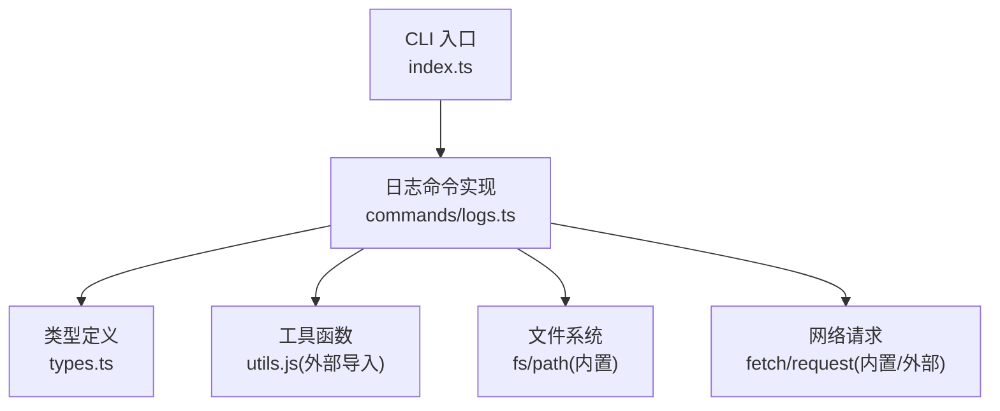
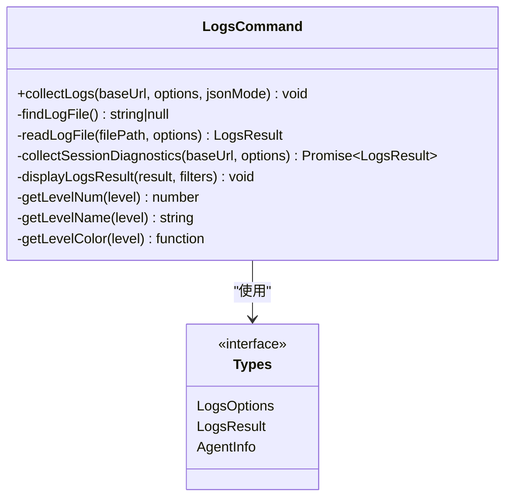
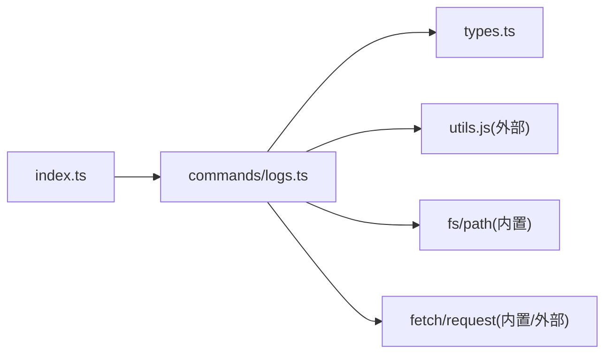
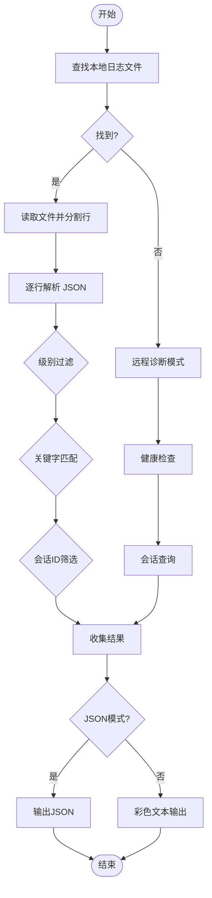

# 日志采集命令

<cite>
**本文引用的文件**   
- [OPS/CLI/src/commands/logs.ts](file://OPS/CLI/src/commands/logs.ts)
- [OPS/CLI/src/types.ts](file://OPS/CLI/src/types.ts)
- [OPS/CLI/src/index.ts](file://OPS/CLI/src/index.ts)
- [data/editor-diagnostics/editor-027234bf-e511-467f-8a82-de65c0685796.jsonl](file://data/editor-diagnostics/editor-027234bf-e511-467f-8a82-de65c0685796.jsonl)
- [packages/agent-service/data/dws-auth/1c249e9ee503fb5447bce1795718ce0f/logs/dws.log](file://packages/agent-service/data/dws-auth/1c249e9ee503fb5447bce1795718ce0f/logs/dws.log)
</cite>

## 目录
1. [简介](#简介)
2. [项目结构](#项目结构)
3. [核心组件](#核心组件)
4. [架构总览](#架构总览)
5. [详细组件分析](#详细组件分析)
6. [依赖关系分析](#依赖关系分析)
7. [性能考虑](#性能考虑)
8. [故障排查指南](#故障排查指南)
9. [结论](#结论)
10. [附录](#附录)

## 简介
本文件为“日志采集命令”（logs）的完整技术文档，覆盖本地日志读取、JSON 解析与结构化输出、级别过滤、关键字模式搜索、会话 ID 筛选，以及远程诊断模式下的健康检查、会话状态查询与错误信息收集。同时提供参数说明、日志文件格式规范、时间戳处理策略、性能优化建议、常见使用场景示例与排障技巧。

## 项目结构
日志采集命令位于 CLI 子项目中，入口注册在命令行程序定义中，具体实现集中在日志命令模块内，类型定义统一在 types 文件中。



图表来源
- [OPS/CLI/src/index.ts:167-184](file://OPS/CLI/src/index.ts#L167-L184)
- [OPS/CLI/src/commands/logs.ts:1-294](file://OPS/CLI/src/commands/logs.ts#L1-L294)
- [OPS/CLI/src/types.ts:157-174](file://OPS/CLI/src/types.ts#L157-L174)

章节来源
- [OPS/CLI/src/index.ts:167-184](file://OPS/CLI/src/index.ts#L167-L184)
- [OPS/CLI/src/commands/logs.ts:1-294](file://OPS/CLI/src/commands/logs.ts#L1-L294)
- [OPS/CLI/src/types.ts:157-174](file://OPS/CLI/src/types.ts#L157-L174)

## 核心组件
- 命令入口：注册 logs 命令及选项，将用户输入转换为 LogsOptions 并调用 collectLogs。
- 日志采集器：collectLogs 负责自动查找本地日志文件；若未找到则回退到远程诊断模式。
- 本地日志读取：readLogFile 按行读取 JSON 日志，支持级别过滤、关键字匹配与会话 ID 筛选，最终返回结构化结果。
- 远程诊断：collectSessionDiagnostics 通过 /health 健康检查与 /api/agent/{sessionId} 或 /api/sessions 获取会话信息，生成诊断日志条目。
- 展示与输出：displayLogsResult 用于彩色文本展示；当启用 JSON 模式时，通过 outputJson 输出结构化结果。

章节来源
- [OPS/CLI/src/index.ts:167-184](file://OPS/CLI/src/index.ts#L167-L184)
- [OPS/CLI/src/commands/logs.ts:22-59](file://OPS/CLI/src/commands/logs.ts#L22-L59)
- [OPS/CLI/src/commands/logs.ts:75-129](file://OPS/CLI/src/commands/logs.ts#L75-L129)
- [OPS/CLI/src/commands/logs.ts:131-223](file://OPS/CLI/src/commands/logs.ts#L131-L223)
- [OPS/CLI/src/commands/logs.ts:225-251](file://OPS/CLI/src/commands/logs.ts#L225-L251)
- [OPS/CLI/src/types.ts:157-174](file://OPS/CLI/src/types.ts#L157-L174)

## 架构总览
日志采集命令采用“本地优先、远程兜底”的双路径设计：
- 本地路径：自动探测多个候选路径，读取 JSON 日志并进行过滤与格式化。
- 远程路径：当本地无日志文件时，通过 HTTP 接口进行健康检查与会话信息查询，构造诊断日志条目。

```mermaid
sequenceDiagram
participant U as "用户"
participant CLI as "CLI 入口<br/>index.ts"
participant LOG as "日志命令<br/>collectLogs"
participant FS as "文件系统<br/>findLogFile/readLogFile"
participant API as "远程服务<br/>/health, /api/*"
U->>CLI : 执行 logs [sessionId] --level/--pattern/--lines/--sessionId
CLI->>LOG : 传入 baseUrl, options, jsonMode
LOG->>FS : findLogFile()
alt 找到本地日志
FS-->>LOG : 返回文件路径
LOG->>FS : readLogFile(path, options)
FS-->>LOG : 返回 LogsResult
LOG-->>U : 输出(文本或JSON)
else 未找到本地日志
LOG->>API : /health
API-->>LOG : 健康状态
opt 指定 sessionId
LOG->>API : /api/agent/{sessionId}
API-->>LOG : 会话详情
else 未指定 sessionId
LOG->>API : /api/sessions?limit=20
API-->>LOG : 活跃会话列表
end
LOG-->>U : 输出(文本或JSON)
end
```

图表来源
- [OPS/CLI/src/index.ts:167-184](file://OPS/CLI/src/index.ts#L167-L184)
- [OPS/CLI/src/commands/logs.ts:22-59](file://OPS/CLI/src/commands/logs.ts#L22-L59)
- [OPS/CLI/src/commands/logs.ts:61-73](file://OPS/CLI/src/commands/logs.ts#L61-L73)
- [OPS/CLI/src/commands/logs.ts:75-129](file://OPS/CLI/src/commands/logs.ts#L75-L129)
- [OPS/CLI/src/commands/logs.ts:131-223](file://OPS/CLI/src/commands/logs.ts#L131-L223)

## 详细组件分析

### 命令入口与参数
- 命令名：logs
- 位置参数：[sessionId]（可选）
- 选项：
  - --level/-l：过滤日志级别（trace/debug/info/warn/error/fatal），默认 info
  - --pattern/-p：关键字模式搜索（字符串包含匹配）
  - --lines/-n：显示行数，默认 100
  - --json：以 JSON 格式输出（由全局 getJsonMode 控制）
- 行为：
  - 解析参数后调用 collectLogs(baseUrl, options, jsonMode)
  - 根据是否找到本地日志决定走本地读取还是远程诊断流程

章节来源
- [OPS/CLI/src/index.ts:167-184](file://OPS/CLI/src/index.ts#L167-L184)
- [OPS/CLI/src/types.ts:157-162](file://OPS/CLI/src/types.ts#L157-L162)

### 本地日志自动查找
- 候选路径顺序：
  - packages/agent-service/logs
  - logs
  - packages/agent-service/agent-service.log
- 规则：
  - 若候选是目录，则尝试读取该目录下 agent-service.log 或 latest.log
  - 若候选是文件，直接使用该文件
- 返回值：首个存在的日志文件路径，否则返回 null

章节来源
- [OPS/CLI/src/commands/logs.ts:15-20](file://OPS/CLI/src/commands/logs.ts#L15-L20)
- [OPS/CLI/src/commands/logs.ts:61-73](file://OPS/CLI/src/commands/logs.ts#L61-L73)

### 本地日志读取与结构化输出
- 读取方式：一次性读取文件内容并按换行分割
- 预取范围：仅保留最近 lines*5 行以减少内存占用
- JSON 解析：
  - 每行尝试 JSON.parse，失败则降级为 { level: 30, time: ISO时间, msg: 原始行 }
- 过滤逻辑：
  - 级别过滤：支持数字与字符串两种 level 表示；数字比较阈值映射 trace<=10, debug<=20, info<=30, warn<=40, error<=50, fatal>50
  - 关键字匹配：在 msg 字段与整行 JSON 字符串中进行包含匹配
  - 会话 ID 筛选：在整行 JSON 字符串中包含 sessionId
- 时间戳处理：
  - 若 time 为数字，转换为 ISO 字符串
  - 若 time 为字符串，直接使用
- 输出结构：
  - source：日志来源路径或 api-diagnostics
  - totalLines：总行数
  - filteredLines：过滤后条数
  - logs：每条包含 level/time/msg 及原始字段展开

章节来源
- [OPS/CLI/src/commands/logs.ts:75-129](file://OPS/CLI/src/commands/logs.ts#L75-L129)
- [OPS/CLI/src/commands/logs.ts:253-276](file://OPS/CLI/src/commands/logs.ts#L253-L276)
- [OPS/CLI/src/types.ts:164-174](file://OPS/CLI/src/types.ts#L164-L174)

### 远程诊断模式
- 健康检查：
  - 请求 /health，成功记录 info 级诊断消息（status/uptime/agents），失败记录 error 级消息
- 会话查询：
  - 若指定 sessionId：请求 /api/agent/{sessionId}，根据 success 与 data.status 输出 info 或 error 级消息
  - 若未指定：请求 /api/sessions?limit=20，列出活跃会话数量，并对 status=error 的会话输出 error 级消息
- 异常处理：
  - 网络异常或请求失败均记录 error 级消息，避免中断整体流程

章节来源
- [OPS/CLI/src/commands/logs.ts:131-223](file://OPS/CLI/src/commands/logs.ts#L131-L223)

### 输出与展示
- 文本模式：
  - 打印来源、总行数、筛选后行数、过滤条件摘要
  - 逐条输出带颜色级别的日志行
- JSON 模式：
  - 直接输出 LogsResult 对象，便于后续自动化处理

章节来源
- [OPS/CLI/src/commands/logs.ts:225-251](file://OPS/CLI/src/commands/logs.ts#L225-L251)

### 类图（代码结构）


图表来源
- [OPS/CLI/src/commands/logs.ts:22-294](file://OPS/CLI/src/commands/logs.ts#L22-L294)
- [OPS/CLI/src/types.ts:157-174](file://OPS/CLI/src/types.ts#L157-L174)

## 依赖关系分析
- 内部依赖：
  - index.ts 注册命令并转发参数
  - types.ts 定义 LogsOptions/LogsResult/AgentInfo 等类型
- 外部依赖：
  - chalk：终端彩色输出
  - fs/path：本地文件读写与路径拼接
  - fetch/request：HTTP 请求（健康检查与会话查询）
  - utils.js：spinner、outputJson、showXxx 提示等通用工具



图表来源
- [OPS/CLI/src/index.ts:167-184](file://OPS/CLI/src/index.ts#L167-L184)
- [OPS/CLI/src/commands/logs.ts:1-13](file://OPS/CLI/src/commands/logs.ts#L1-L13)
- [OPS/CLI/src/types.ts:157-174](file://OPS/CLI/src/types.ts#L157-L174)

章节来源
- [OPS/CLI/src/index.ts:167-184](file://OPS/CLI/src/index.ts#L167-L184)
- [OPS/CLI/src/commands/logs.ts:1-13](file://OPS/CLI/src/commands/logs.ts#L1-L13)
- [OPS/CLI/src/types.ts:157-174](file://OPS/CLI/src/types.ts#L157-L174)

## 性能考虑
- 大文件读取：
  - 当前实现一次性读取文件内容并按行分割，对超大日志文件可能产生较高内存占用
  - 建议：流式读取（如 Node 的 fs.createReadStream）并结合缓冲窗口，降低峰值内存
- 预取范围：
  - 已限制为最近 lines*5 行，减少不必要的全量扫描
- 过滤效率：
  - 关键字匹配使用字符串包含，简单高效；如需正则匹配，应谨慎评估性能影响
- JSON 序列化开销：
  - 全行 JSON.stringify 用于 pattern/sessionId 匹配，存在额外 CPU 开销；可考虑仅在必要时序列化
- 并发与超时：
  - 远程诊断涉及多次 HTTP 请求，建议增加超时与重试策略，避免长时间阻塞

[本节为通用性能建议，不直接分析具体文件]

## 故障排查指南
- 未找到日志文件：
  - 现象：提示“未找到日志文件 (agent-service 日志仅输出到 stdout)”
  - 原因：本地候选路径不存在或未写入日志文件
  - 解决：确认日志输出路径配置，或改用远程诊断模式
- 级别过滤无效：
  - 现象：设置 --level 后无输出
  - 原因：日志中的 level 字段值与期望不符（字符串 vs 数字）
  - 解决：检查日志格式，确保 level 字段符合预期；或使用更宽松的级别（如 info）
- 关键字匹配不到：
  - 现象：--pattern 无法命中
  - 原因：关键字不在 msg 字段且不在整行 JSON 中
  - 解决：调整关键字，或扩大匹配范围（例如针对特定字段）
- 会话 ID 筛选为空：
  - 现象：--sessionId 无结果
  - 原因：日志中不包含该 sessionId
  - 解决：确认 sessionId 是否正确，或放宽筛选条件
- 远程诊断失败：
  - 现象：健康检查或会话查询报错
  - 原因：服务不可达、端口错误、权限不足
  - 解决：检查 baseUrl 与服务状态，确认网络连通性与认证配置

章节来源
- [OPS/CLI/src/commands/logs.ts:33-49](file://OPS/CLI/src/commands/logs.ts#L33-L49)
- [OPS/CLI/src/commands/logs.ts:96-111](file://OPS/CLI/src/commands/logs.ts#L96-L111)
- [OPS/CLI/src/commands/logs.ts:131-223](file://OPS/CLI/src/commands/logs.ts#L131-L223)

## 结论
logs 命令提供了便捷的本地与远程双路径日志采集能力，支持结构化 JSON 日志解析、多级过滤与会话追踪，适用于日常调试与问题定位。结合合理的参数选择与性能优化策略，可在大规模日志环境下保持良好体验。

[本节为总结性内容，不直接分析具体文件]

## 附录

### 参数选项说明
- --level/-l：过滤日志级别（trace/debug/info/warn/error/fatal），默认 info
- --pattern/-p：关键字模式搜索（字符串包含匹配）
- --lines/-n：显示行数，默认 100
- --json：以 JSON 格式输出（由全局 getJsonMode 控制）
- [sessionId]：可选的位置参数，用于会话 ID 筛选或远程会话查询

章节来源
- [OPS/CLI/src/index.ts:167-184](file://OPS/CLI/src/index.ts#L167-L184)
- [OPS/CLI/src/types.ts:157-162](file://OPS/CLI/src/types.ts#L157-L162)

### 日志文件格式规范
- 本地 JSON 日志（每行一个 JSON 对象）：
  - 必需字段：msg（字符串）
  - 可选字段：
    - level：字符串或数字（字符串如 "info"/"error"；数字如 30/50）
    - time：ISO 字符串或毫秒时间戳（将被规范化为 ISO 字符串）
    - 其他任意扩展字段（会被原样保留在输出中）
- 示例参考：
  - 编辑器诊断事件（JSONL）：[data/editor-diagnostics/editor-027234bf-e511-467f-8a82-de65c0685796.jsonl](file://data/editor-diagnostics/editor-027234bf-e511-467f-8a82-de65c0685796.jsonl)
  - 代理服务日志（JSONL）：[packages/agent-service/data/dws-auth/.../dws.log](file://packages/agent-service/data/dws-auth/1c249e9ee503fb5447bce1795718ce0f/logs/dws.log)

章节来源
- [OPS/CLI/src/commands/logs.ts:89-121](file://OPS/CLI/src/commands/logs.ts#L89-L121)
- [data/editor-diagnostics/editor-027234bf-e511-467f-8a82-de65c0685796.jsonl:1-10](file://data/editor-diagnostics/editor-027234bf-e511-467f-8a82-de65c0685796.jsonl#L1-L10)
- [packages/agent-service/data/dws-auth/1c249e9ee503fb5447bce1795718ce0f/logs/dws.log:1-10](file://packages/agent-service/data/dws-auth/1c249e9ee503fb5447bce1795718ce0f/logs/dws.log#L1-L10)

### 时间戳处理
- 数字时间戳：转换为 ISO 字符串
- 字符串时间戳：直接使用
- 缺失时间戳：使用当前时间的 ISO 字符串

章节来源
- [OPS/CLI/src/commands/logs.ts:113-121](file://OPS/CLI/src/commands/logs.ts#L113-L121)

### 常见使用场景示例
- 查看最近 50 条 info 及以上级别日志：
  - 命令：logs --level info --lines 50
- 搜索包含特定关键字的错误日志：
  - 命令：logs --level error --pattern "timeout"
- 按会话 ID 筛选日志：
  - 命令：logs session-xxxxx --pattern "error"
- 以 JSON 格式输出以便后续处理：
  - 命令：logs --json --level warn --lines 200

[本节为使用示例，不直接分析具体文件]

### 流程图（过滤与输出）


图表来源
- [OPS/CLI/src/commands/logs.ts:22-59](file://OPS/CLI/src/commands/logs.ts#L22-L59)
- [OPS/CLI/src/commands/logs.ts:75-129](file://OPS/CLI/src/commands/logs.ts#L75-L129)
- [OPS/CLI/src/commands/logs.ts:131-223](file://OPS/CLI/src/commands/logs.ts#L131-L223)