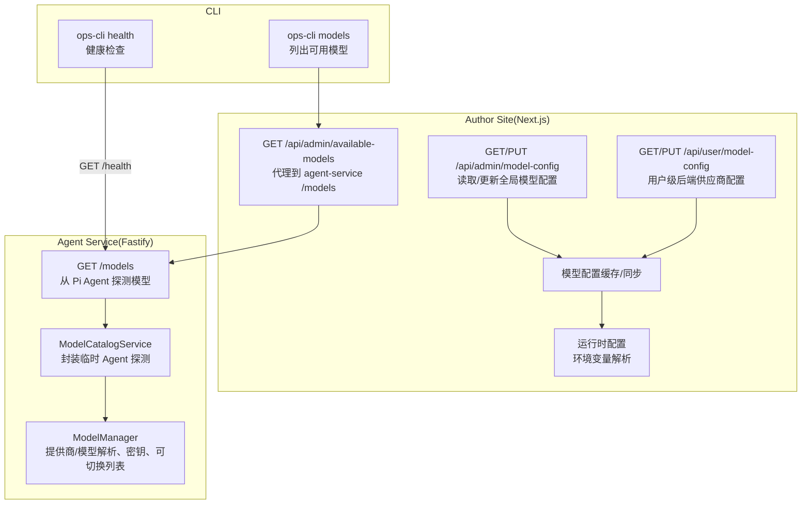
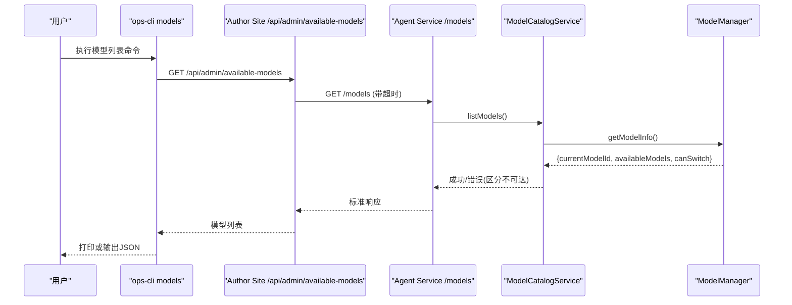
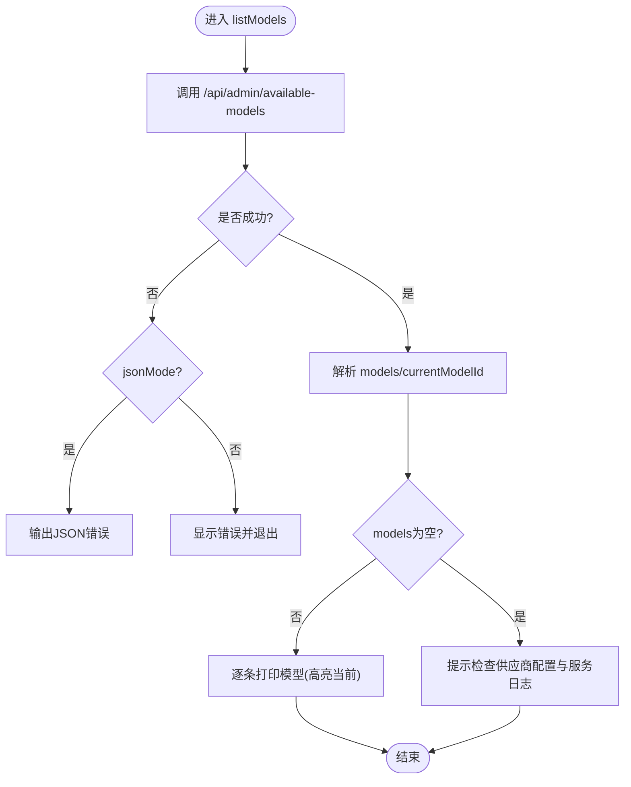
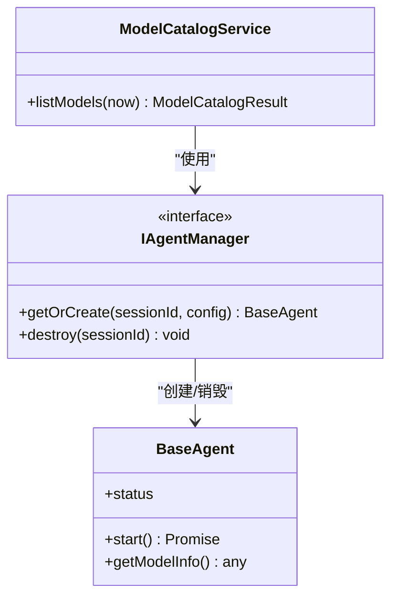
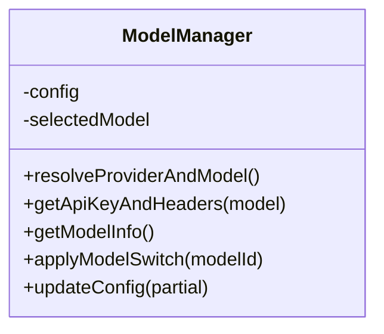
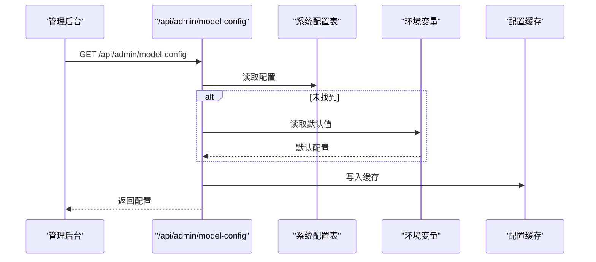
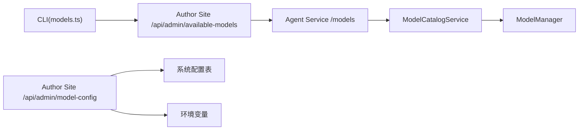

# 模型管理命令

<cite>
**本文引用的文件列表**
- [OPS/CLI/src/commands/models.ts](file://OPS/CLI/src/commands/models.ts)
- [packages/agent-service/src/routes/models.ts](file://packages/agent-service/src/routes/models.ts)
- [packages/agent-service/src/services/model-catalog-service.ts](file://packages/agent-service/src/services/model-catalog-service.ts)
- [packages/agent-service/src/backends/managers/model-manager.ts](file://packages/agent-service/src/backends/managers/model-manager.ts)
- [packages/author-site/src/app/api/admin/model-config/route.ts](file://packages/author-site/src/app/api/admin/model-config/route.ts)
- [packages/author-site/src/app/api/admin/available-models/route.ts](file://packages/author-site/src/app/api/admin/available-models/route.ts)
- [packages/author-site/src/lib/runtime-config.ts](file://packages/author-site/src/lib/runtime-config.ts)
- [packages/author-site/src/lib/model-config.ts](file://packages/author-site/src/lib/model-config.ts)
- [packages/author-site/src/lib/user-model-config.ts](file://packages/author-site/src/lib/user-model-config.ts)
- [packages/author-site/src/app/api/user/model-config/route.ts](file://packages/author-site/src/app/api/user/model-config/route.ts)
- [docs/用户指南/模型配置指南.md](file://docs/用户指南/模型配置指南.md)
- [OPS/CLI/src/commands/health.ts](file://OPS/CLI/src/commands/health.ts)
- [scripts/deploy.sh](file://scripts/deploy.sh)
</cite>

## 目录
1. [简介](#简介)
2. [项目结构](#项目结构)
3. [核心组件](#核心组件)
4. [架构总览](#架构总览)
5. [详细组件分析](#详细组件分析)
6. [依赖关系分析](#依赖关系分析)
7. [性能与监控](#性能与监控)
8. [故障排查指南](#故障排查指南)
9. [结论](#结论)
10. [附录：命令行接口与运维实践](#附录命令行接口与运维实践)

## 简介
本文件面向“模型管理命令”的完整能力说明，覆盖以下目标：
- 可用模型列表获取、当前模型状态检查
- 模型提供商支持与认证配置、连接测试
- 模型切换机制、负载均衡策略与故障转移逻辑
- 模型管理的 CLI 操作（添加新模型、更新配置、删除模型）
- 性能基准、响应时间监控与错误率统计思路
- 多模型环境管理与运维最佳实践

## 项目结构
围绕“模型管理命令”，代码分布在三层：
- 客户端 CLI：提供模型列表查询等命令
- Agent Service：暴露 /models 端点，聚合后端模型信息
- Author Site（管理后台）：提供模型配置读写、白名单/黑名单、默认模型、多模态模型管理等 API

图表来源
- [OPS/CLI/src/commands/models.ts:14-76](file://OPS/CLI/src/commands/models.ts#L14-L76)
- [packages/author-site/src/app/api/admin/available-models/route.ts:15-44](file://packages/author-site/src/app/api/admin/available-models/route.ts#L15-L44)
- [packages/agent-service/src/routes/models.ts:12-41](file://packages/agent-service/src/routes/models.ts#L12-L41)
- [packages/agent-service/src/services/model-catalog-service.ts:52-111](file://packages/agent-service/src/services/model-catalog-service.ts#L52-L111)
- [packages/agent-service/src/backends/managers/model-manager.ts:56-325](file://packages/agent-service/src/backends/managers/model-manager.ts#L56-L325)
- [packages/author-site/src/app/api/admin/model-config/route.ts:138-239](file://packages/author-site/src/app/api/admin/model-config/route.ts#L138-L239)
- [packages/author-site/src/lib/runtime-config.ts:72-79](file://packages/author-site/src/lib/runtime-config.ts#L72-L79)
- [packages/author-site/src/lib/model-config.ts:197-218](file://packages/author-site/src/lib/model-config.ts#L197-L218)

章节来源
- [OPS/CLI/src/commands/models.ts:14-76](file://OPS/CLI/src/commands/models.ts#L14-L76)
- [packages/agent-service/src/routes/models.ts:12-41](file://packages/agent-service/src/routes/models.ts#L12-L41)
- [packages/agent-service/src/services/model-catalog-service.ts:52-111](file://packages/agent-service/src/services/model-catalog-service.ts#L52-L111)
- [packages/agent-service/src/backends/managers/model-manager.ts:56-325](file://packages/agent-service/src/backends/managers/model-manager.ts#L56-L325)
- [packages/author-site/src/app/api/admin/model-config/route.ts:138-239](file://packages/author-site/src/app/api/admin/model-config/route.ts#L138-L239)
- [packages/author-site/src/lib/runtime-config.ts:72-79](file://packages/author-site/src/lib/runtime-config.ts#L72-L79)
- [packages/author-site/src/lib/model-config.ts:197-218](file://packages/author-site/src/lib/model-config.ts#L197-L218)

## 核心组件
- CLI 模型命令：调用管理后台或 Agent Service 的模型相关接口，输出人类可读或 JSON 格式结果。
- Agent Service 模型路由：创建临时 Pi Agent 实例，拉取可用模型并返回 currentModelId/canSwitch。
- ModelCatalogService：封装临时 Agent 生命周期，统一错误分类（不可达/获取失败）。
- ModelManager：负责提供商与模型解析、API Key 优先级、多提供商模型合并、模型切换应用。
- Author Site 管理 API：持久化前端模型白名单/黑名单/默认模型、多模态模型；支持部分更新与旧结构兼容。
- 用户级后端供应商配置：加密存储用户自定义 Provider 与默认模型，支持保留已有密钥。

章节来源
- [OPS/CLI/src/commands/models.ts:14-76](file://OPS/CLI/src/commands/models.ts#L14-L76)
- [packages/agent-service/src/routes/models.ts:12-41](file://packages/agent-service/src/routes/models.ts#L12-L41)
- [packages/agent-service/src/services/model-catalog-service.ts:52-111](file://packages/agent-service/src/services/model-catalog-service.ts#L52-L111)
- [packages/agent-service/src/backends/managers/model-manager.ts:56-325](file://packages/agent-service/src/backends/managers/model-manager.ts#L56-L325)
- [packages/author-site/src/app/api/admin/model-config/route.ts:138-239](file://packages/author-site/src/app/api/admin/model-config/route.ts#L138-L239)
- [packages/author-site/src/lib/user-model-config.ts:1-217](file://packages/author-site/src/lib/user-model-config.ts#L1-L217)

## 架构总览
下图展示“模型管理命令”的关键调用链与数据流：

图表来源
- [OPS/CLI/src/commands/models.ts:14-76](file://OPS/CLI/src/commands/models.ts#L14-L76)
- [packages/author-site/src/app/api/admin/available-models/route.ts:15-44](file://packages/author-site/src/app/api/admin/available-models/route.ts#L15-L44)
- [packages/agent-service/src/routes/models.ts:12-41](file://packages/agent-service/src/routes/models.ts#L12-L41)
- [packages/agent-service/src/services/model-catalog-service.ts:52-111](file://packages/agent-service/src/services/model-catalog-service.ts#L52-L111)
- [packages/agent-service/src/backends/managers/model-manager.ts:214-295](file://packages/agent-service/src/backends/managers/model-manager.ts#L214-L295)

## 详细组件分析

### 组件A：CLI 模型命令（列出可用模型）
- 功能：通过管理后台代理访问 Agent Service 的 /models，返回当前模型与可用模型列表。
- 交互：支持文本与 JSON 两种输出模式；失败时给出明确提示与退出码。
- 关键路径：
  - 请求入口：[listModels:14-76](file://OPS/CLI/src/commands/models.ts#L14-L76)
  - 管理后台代理：[GET /api/admin/available-models:15-44](file://packages/author-site/src/app/api/admin/available-models/route.ts#L15-L44)
  - Agent Service 路由：[GET /models:12-41](file://packages/agent-service/src/routes/models.ts#L12-L41)

图表来源
- [OPS/CLI/src/commands/models.ts:14-76](file://OPS/CLI/src/commands/models.ts#L14-L76)
- [packages/author-site/src/app/api/admin/available-models/route.ts:15-44](file://packages/author-site/src/app/api/admin/available-models/route.ts#L15-L44)

章节来源
- [OPS/CLI/src/commands/models.ts:14-76](file://OPS/CLI/src/commands/models.ts#L14-L76)
- [packages/author-site/src/app/api/admin/available-models/route.ts:15-44](file://packages/author-site/src/app/api/admin/available-models/route.ts#L15-L44)

### 组件B：Agent Service 模型目录服务
- 职责：创建临时 Pi Agent，启动后调用其 getModelInfo，清理临时 Agent；对网络错误进行分类。
- 关键点：
  - 临时会话 ID 生成与销毁，避免资源泄漏
  - 错误分类：SERVER_UNREACHABLE vs GET_MODELS_ERROR
  - 将 provider/model 拆分出 group 字段供前端展示

图表来源
- [packages/agent-service/src/services/model-catalog-service.ts:52-111](file://packages/agent-service/src/services/model-catalog-service.ts#L52-L111)

章节来源
- [packages/agent-service/src/services/model-catalog-service.ts:52-111](file://packages/agent-service/src/services/model-catalog-service.ts#L52-L111)

### 组件C：模型管理器（提供商解析、密钥、可切换列表）
- 提供商与模型解析：按优先级选择 provider 与 modelId（selected > configured > session > manager > serviceConfig）。
- 密钥优先级：backendProviders.apiKey > model.apiKey > piAgent.apiKey > 环境变量 > serviceConfig。
- 可切换模型组装：优先使用 backendProviders 声明的模型列表，其次尝试动态 getModels，最后回退合成模型。
- 模型切换：applyModelSwitch 更新 selectedModel 与 config.piAgent。

图表来源
- [packages/agent-service/src/backends/managers/model-manager.ts:56-325](file://packages/agent-service/src/backends/managers/model-manager.ts#L56-L325)

章节来源
- [packages/agent-service/src/backends/managers/model-manager.ts:56-325](file://packages/agent-service/src/backends/managers/model-manager.ts#L56-L325)

### 组件D：管理后台模型配置（白名单/黑名单/默认模型/多模态）
- 配置结构：支持新旧两种结构自动互转；前端 enabledModels + autoEnableRules，后端兼容 allowedPrefixes/nameFilters/defaultModelIds/blacklist。
- 权限控制：仅管理员可读写；普通用户可通过 /api/user/model-config 维护自己的后端供应商配置。
- 缓存与刷新：读取数据库配置，若无则回退环境变量；提供失效缓存方法以支持热更新。

图表来源
- [packages/author-site/src/app/api/admin/model-config/route.ts:138-239](file://packages/author-site/src/app/api/admin/model-config/route.ts#L138-L239)
- [packages/author-site/src/lib/model-config.ts:197-218](file://packages/author-site/src/lib/model-config.ts#L197-L218)
- [packages/author-site/src/lib/runtime-config.ts:72-79](file://packages/author-site/src/lib/runtime-config.ts#L72-L79)

章节来源
- [packages/author-site/src/app/api/admin/model-config/route.ts:138-239](file://packages/author-site/src/app/api/admin/model-config/route.ts#L138-L239)
- [packages/author-site/src/lib/model-config.ts:197-218](file://packages/author-site/src/lib/model-config.ts#L197-L218)
- [packages/author-site/src/lib/runtime-config.ts:72-79](file://packages/author-site/src/lib/runtime-config.ts#L72-L79)

### 组件E：用户级后端供应商配置（加密存储）
- 安全：API Key 采用 AES-GCM 加密存储，对外只返回 hasApiKey 标志。
- 合并策略：用户配置与全局 fallback providers 合并，保持用户默认激活模型。
- 更新：支持 keepExistingApiKey 保留已有密钥，clearApiKey 清空密钥。

章节来源
- [packages/author-site/src/lib/user-model-config.ts:1-217](file://packages/author-site/src/lib/user-model-config.ts#L1-L217)
- [packages/author-site/src/app/api/user/model-config/route.ts:47-94](file://packages/author-site/src/app/api/user/model-config/route.ts#L47-L94)

## 依赖关系分析
- CLI 依赖管理后台代理，管理后台再代理到 Agent Service。
- Agent Service 内部通过 ModelCatalogService 与 ModelManager 协作完成模型发现与切换。
- Author Site 的配置层依赖环境变量与数据库，并提供缓存失效能力。

图表来源
- [OPS/CLI/src/commands/models.ts:14-76](file://OPS/CLI/src/commands/models.ts#L14-L76)
- [packages/author-site/src/app/api/admin/available-models/route.ts:15-44](file://packages/author-site/src/app/api/admin/available-models/route.ts#L15-L44)
- [packages/agent-service/src/routes/models.ts:12-41](file://packages/agent-service/src/routes/models.ts#L12-L41)
- [packages/agent-service/src/services/model-catalog-service.ts:52-111](file://packages/agent-service/src/services/model-catalog-service.ts#L52-L111)
- [packages/agent-service/src/backends/managers/model-manager.ts:56-325](file://packages/agent-service/src/backends/managers/model-manager.ts#L56-L325)
- [packages/author-site/src/app/api/admin/model-config/route.ts:138-239](file://packages/author-site/src/app/api/admin/model-config/route.ts#L138-L239)

## 性能与监控
- 健康检查：CLI 提供 health 命令，直接调用 Agent Service 的 /health，返回运行时长、活跃 Agent 数等。
- 模型列表延迟：管理后台代理到 Agent Service 设置了 10s 超时，避免长时间阻塞。
- 指标采集建议：
  - 在 Agent Service 层记录 /models 请求耗时、错误率、后端不可达次数
  - 在 Author Site 层记录代理请求耗时与失败原因
  - 结合现有工作区性能采样器思路，为模型调用增加 p50/p95/p99 统计与 SLO 报告（参考现有采样器实现）

章节来源
- [OPS/CLI/src/commands/health.ts:11-89](file://OPS/CLI/src/commands/health.ts#L11-L89)
- [packages/author-site/src/app/api/admin/available-models/route.ts:27-44](file://packages/author-site/src/app/api/admin/available-models/route.ts#L27-L44)

## 故障排查指南
- 无法连接 Agent Service：
  - 使用 ops-cli health 检查服务可达性与状态
  - 确认服务地址、防火墙与端口
- 模型列表为空：
  - 检查 Pi Agent 模型供应商配置与 agent-service 日志
  - 确认 backendProviders 中已启用且包含模型
- 切换模型无效：
  - 确认 applyModelSwitch 已更新 selectedModel 与 config.piAgent
  - 校验 resolveProviderAndModel 的优先级是否符合预期
- 认证失败：
  - 检查 getApiKeyAndHeaders 的密钥优先级链路
  - 确认环境变量与 provider 配置中的 apiKey 正确

章节来源
- [OPS/CLI/src/commands/health.ts:11-89](file://OPS/CLI/src/commands/health.ts#L11-L89)
- [packages/agent-service/src/backends/managers/model-manager.ts:195-212](file://packages/agent-service/src/backends/managers/model-manager.ts#L195-L212)
- [packages/agent-service/src/backends/managers/model-manager.ts:297-312](file://packages/agent-service/src/backends/managers/model-manager.ts#L297-L312)

## 结论
模型管理命令围绕“列出模型—查看配置—切换模型—监控健康”形成闭环。Agent Service 作为模型发现与切换的核心，Author Site 提供配置管理与白名单控制，CLI 提供便捷的操作入口。通过合理的错误分类、超时控制与缓存失效机制，系统在可用性、可观测性与可维护性方面具备良好基础。

## 附录：命令行接口与运维实践

### 支持的模型提供商与认证配置
- 支持 OpenAI 兼容格式与 Anthropic 等提供商，具体示例见用户指南。
- 认证优先级：provider 配置 > 模型对象 > piAgent 配置 > 环境变量 > 服务配置。

章节来源
- [docs/用户指南/模型配置指南.md:22-31](file://docs/用户指南/模型配置指南.md#L22-L31)
- [packages/agent-service/src/backends/managers/model-manager.ts:195-212](file://packages/agent-service/src/backends/managers/model-manager.ts#L195-L212)

### 连接测试与健康检查
- 使用 ops-cli health 检查 Agent Service 健康状态，包括运行时长与活跃 Agent 数量。
- 管理后台代理到 Agent Service 的 /models 带有超时保护。

章节来源
- [OPS/CLI/src/commands/health.ts:11-89](file://OPS/CLI/src/commands/health.ts#L11-L89)
- [packages/author-site/src/app/api/admin/available-models/route.ts:27-44](file://packages/author-site/src/app/api/admin/available-models/route.ts#L27-L44)

### 模型切换机制与负载均衡策略
- 切换机制：applyModelSwitch 更新 selectedModel 与 config.piAgent，后续请求按 resolveProviderAndModel 优先级生效。
- 负载均衡策略：当前实现以“当前激活 provider + 其他已启用 provider 的模型集合”为主，未实现显式权重轮询；可按需扩展。
- 故障转移：当动态获取模型失败时回退到 backendProviders 声明列表；若仍为空，则使用配置中的合成模型。

章节来源
- [packages/agent-service/src/backends/managers/model-manager.ts:297-312](file://packages/agent-service/src/backends/managers/model-manager.ts#L297-L312)
- [packages/agent-service/src/backends/managers/model-manager.ts:214-295](file://packages/agent-service/src/backends/managers/model-manager.ts#L214-L295)

### 模型管理的命令行流程（添加/更新/删除）
- 添加新模型：
  - 在管理后台新增后端供应商或在其 models 列表中追加模型 ID
  - 如需前端可见，确保白名单包含对应分组前缀
  - 保存后通过 /api/admin/model-config 持久化
- 更新配置：
  - 使用 PUT /api/admin/model-config 进行部分更新（frontend/backendProviders/multimodalModels）
  - 服务端会同步旧结构与新结构，无需重启
- 删除模型：
  - 从对应 provider 的 models 列表中移除该模型 ID
  - 如仅需前端隐藏，可从黑名单中添加完整模型 ID

章节来源
- [packages/author-site/src/app/api/admin/model-config/route.ts:175-239](file://packages/author-site/src/app/api/admin/model-config/route.ts#L175-L239)
- [docs/用户指南/模型配置指南.md:162-233](file://docs/用户指南/模型配置指南.md#L162-L233)

### 性能基准与监控建议
- 建议在 Agent Service 层对 /models 与模型调用路径增加耗时与错误率埋点
- 在 Author Site 层记录代理请求耗时与失败原因
- 可复用现有性能采样器思路，为模型调用维度输出 p50/p95/p99 与 SLO 报告

章节来源
- [packages/author-site/src/lib/workspace-performance-sampling.ts:201-279](file://packages/author-site/src/lib/workspace-performance-sampling.ts#L201-L279)

### 多模型环境管理与部署要点
- 环境变量：
  - PI_AGENT_* 系列用于指定默认提供商、密钥、模型与基础地址
  - NEXT_PUBLIC_* 系列用于前端模型白名单/黑名单/默认模型
- 部署脚本要求 INTERNAL_API_TOKEN 用于管理后台与 Agent Service 间的安全通信

章节来源
- [docs/用户指南/模型配置指南.md:277-292](file://docs/用户指南/模型配置指南.md#L277-L292)
- [scripts/deploy.sh:36-77](file://scripts/deploy.sh#L36-L77)