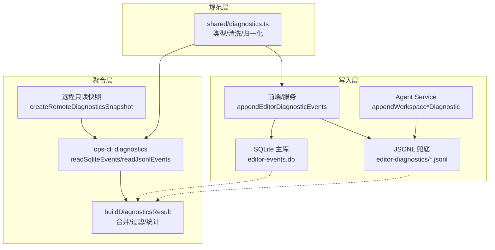
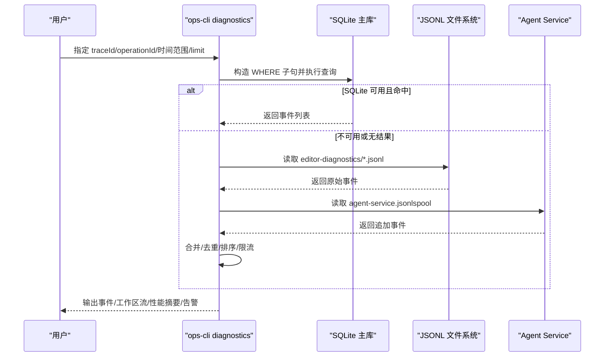
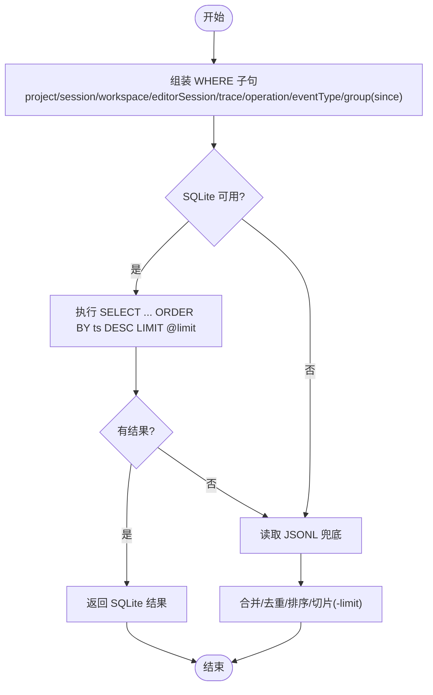
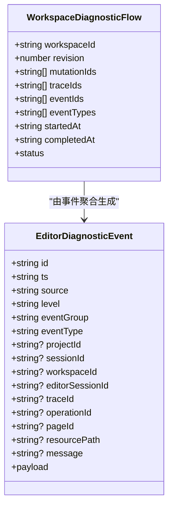
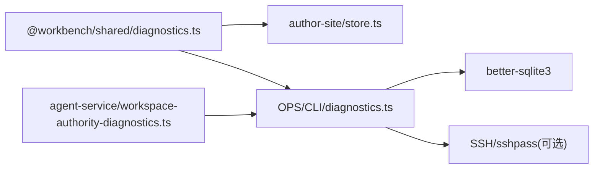

# 诊断事件查询

<cite>
**本文引用的文件**   
- [diagnostics.ts](file://OPS/CLI/src/commands/diagnostics.ts)
- [store.ts](file://packages/author-site/src/lib/editor-diagnostics/store.ts)
- [types.ts](file://packages/author-site/src/lib/editor-diagnostics/types.ts)
- [diagnostics.ts（共享类型与清洗）](file://packages/shared/src/diagnostics.ts)
- [workspace-authority-diagnostics.ts](file://packages/agent-service/src/workspace/workspace-authority-diagnostics.ts)
- [02_Codex查询CLI与导出包.md](file://docs/项目文档/创作端/11-诊断与日志/技术/02_Codex查询CLI与导出包.md)
- [diagnostics.test.ts](file://OPS/CLI/src/commands/diagnostics.test.ts)
</cite>

## 目录
1. [简介](#简介)
2. [项目结构](#项目结构)
3. [核心组件](#核心组件)
4. [架构总览](#架构总览)
5. [详细组件分析](#详细组件分析)
6. [依赖关系分析](#依赖关系分析)
7. [性能考量](#性能考量)
8. [故障排查指南](#故障排查指南)
9. [结论](#结论)
10. [附录](#附录)

## 简介
本文件面向使用 diagnostics 命令进行结构化事件检索的工程师与运维人员，系统阐述：
- 事件类型过滤、时间范围限定、项目级筛选等查询能力
- 诊断事件的存储格式、索引机制与查询语法
- 会话追踪与关联分析（traceId/operationId）、操作审计日志与性能指标收集
- 高级用法：复杂条件组合、排序与分页
- 数据导出格式、批量查询与远程只读快照方案
- 典型问题定位场景与最佳实践

## 项目结构
诊断事件体系由三部分构成：
- 写入层：前端/服务端将事件写入 SQLite 主库或 JSONL 兜底
- 聚合层：CLI 提供统一查询入口，支持本地与远程只读快照
- 规范层：共享类型与敏感字段清洗策略，保证跨进程一致性与安全

图表来源
- [store.ts:65-100](file://packages/author-site/src/lib/editor-diagnostics/store.ts#L65-L100)
- [diagnostics.ts（CLI）:377-440](file://OPS/CLI/src/commands/diagnostics.ts#L377-L440)
- [workspace-authority-diagnostics.ts:9-59](file://packages/agent-service/src/workspace/workspace-authority-diagnostics.ts#L9-L59)
- [diagnostics.ts（共享）:449-475](file://packages/shared/src/diagnostics.ts#L449-L475)

章节来源
- [store.ts:65-100](file://packages/author-site/src/lib/editor-diagnostics/store.ts#L65-L100)
- [diagnostics.ts（CLI）:377-440](file://OPS/CLI/src/commands/diagnostics.ts#L377-L440)
- [workspace-authority-diagnostics.ts:9-59](file://packages/agent-service/src/workspace/workspace-authority-diagnostics.ts#L9-L59)
- [diagnostics.ts（共享）:449-475](file://packages/shared/src/diagnostics.ts#L449-L475)

## 核心组件
- 事件模型与分组
  - 事件包含 id、ts、source、level、eventGroup、eventType、projectId/sessionId/workspaceId/editorSessionId/traceId/operationId/pageId/resourcePath/message/payload 等字段
  - eventGroup 用于按业务域划分：autosave/collab/preview/project/workspace/publish/page/ui/system
- 存储与索引
  - SQLite 表 editor_events，含多列复合索引以支撑按 project/session/editor_session/trace/operation/workspace/event_type/event_group + ts 的高效查询
  - JSONL 作为兜底与 spool，按 editorSessionId 分文件；agent-service 写 agent-service.jsonl
- 查询与过滤
  - CLI 与 author-site 均支持按 projectId/sessionId/workspaceId/editorSessionId/traceId/operationId/eventType/group/since 过滤
  - 支持 groups 多组过滤（逗号分隔），与 since 时间下限
- 结果与导出
  - buildDiagnosticsResult 返回 events、workspaceFlows、performance、fallbackEvents、agentRunLogs、diagnostics 等
  - 构建导出包时合并 SQLite 与 JSONL，去重并按时间排序

章节来源
- [diagnostics.ts（CLI）:30-48](file://OPS/CLI/src/commands/diagnostics.ts#L30-L48)
- [store.ts:70-98](file://packages/author-site/src/lib/editor-diagnostics/store.ts#L70-L98)
- [diagnostics.ts（CLI）:475-494](file://OPS/CLI/src/commands/diagnostics.ts#L475-L494)
- [diagnostics.ts（CLI）:659-707](file://OPS/CLI/src/commands/diagnostics.ts#L659-L707)
- [store.ts:515-553](file://packages/author-site/src/lib/editor-diagnostics/store.ts#L515-L553)

## 架构总览
下图展示一次“按 traceId 关联分析”的端到端流程：从 CLI 发起查询，优先走 SQLite，必要时回退到 JSONL，并合并结果。

图表来源
- [diagnostics.ts（CLI）:377-440](file://OPS/CLI/src/commands/diagnostics.ts#L377-L440)
- [diagnostics.ts（CLI）:442-473](file://OPS/CLI/src/commands/diagnostics.ts#L442-L473)
- [diagnostics.ts（CLI）:659-707](file://OPS/CLI/src/commands/diagnostics.ts#L659-L707)
- [workspace-authority-diagnostics.ts:53-59](file://packages/agent-service/src/workspace/workspace-authority-diagnostics.ts#L53-L59)

## 详细组件分析

### 事件存储与索引
- 表结构与索引
  - 表名：editor_events
  - 关键字段：id(ts)、project_id、session_id、workspace_id、editor_session_id、trace_id、operation_id、event_type、event_group、ts
  - 索引：按 project/session/editor_session/trace/operation/workspace/event_type/event_group 与 ts 的复合索引，优化常见过滤路径
- WAL 模式与并发
  - 启用 journal_mode=WAL 与 busy_timeout，提升并发读取稳定性
- JSONL 兜底
  - 当 SQLite 不可用时，自动回退到 editor-diagnostics/*.jsonl；agent-service 的事件写入 agent-service.jsonl

章节来源
- [store.ts:65-100](file://packages/author-site/src/lib/editor-diagnostics/store.ts#L65-L100)
- [diagnostics.ts（CLI）:442-473](file://OPS/CLI/src/commands/diagnostics.ts#L442-L473)
- [workspace-authority-diagnostics.ts:53-59](file://packages/agent-service/src/workspace/workspace-authority-diagnostics.ts#L53-L59)

### 查询语法与过滤语义
- 支持的过滤键
  - project、session、workspace、editorSession、trace、operation、eventType、group、groups、since
- 多组过滤
  - groups 为逗号分隔的 event_group 列表，与 group 单值过滤并存
- 时间范围
  - since 支持 ISO 字符串、相对小时/天（如 2h/1d），内部转换为 ISO 后比较 ts
- 排序与分页
  - 默认按 ts 降序取最近 N 条，最终输出按 ts 升序排列；limit 上限 1000，默认 200

图表来源
- [diagnostics.ts（CLI）:377-440](file://OPS/CLI/src/commands/diagnostics.ts#L377-L440)
- [diagnostics.ts（CLI）:475-494](file://OPS/CLI/src/commands/diagnostics.ts#L475-L494)
- [store.ts:375-493](file://packages/author-site/src/lib/editor-diagnostics/store.ts#L375-L493)

章节来源
- [diagnostics.ts（CLI）:377-440](file://OPS/CLI/src/commands/diagnostics.ts#L377-L440)
- [diagnostics.ts（CLI）:475-494](file://OPS/CLI/src/commands/diagnostics.ts#L475-L494)
- [store.ts:375-493](file://packages/author-site/src/lib/editor-diagnostics/store.ts#L375-L493)

### 会话追踪与关联分析
- 关联键
  - traceId：跨阶段链路标识（mutation/canonical 等）
  - operationId：具体操作标识（常用于 mutation 生命周期）
  - sessionId/editorSessionId：会话维度
- 工作区流（Workspace Flow）
  - 基于 workspace.mutation_*、workspace.projection_*、workspace.canonical_materialization_* 事件，按 workspaceId + revision 分组，推导状态机：pending → committed → projection_applied/projection_failed/projection_gap_detected → canonical_succeeded/canonical_failed
- 失败详情格式化
  - 针对 error 级别或 *_failed 事件，提取 phase/errorCode/httpStatus 等关键上下文

图表来源
- [diagnostics.ts（CLI）:83-100](file://OPS/CLI/src/commands/diagnostics.ts#L83-L100)
- [diagnostics.ts（CLI）:542-587](file://OPS/CLI/src/commands/diagnostics.ts#L542-L587)
- [diagnostics.ts（CLI）:709-732](file://OPS/CLI/src/commands/diagnostics.ts#L709-L732)

章节来源
- [diagnostics.ts（CLI）:542-587](file://OPS/CLI/src/commands/diagnostics.ts#L542-L587)
- [diagnostics.ts（CLI）:709-732](file://OPS/CLI/src/commands/diagnostics.ts#L709-L732)

### 性能指标收集与汇总
- 指标来源
  - 显式 payload 字段：debounceWaitMs、queueWaitMs、commitLatencyMs、remoteUpdateLatencyMs、draftPreviewLatencyMs、projectionLatencyMs、reconnectConvergenceMs、canonicalLagMs
  - 派生指标：canonical lag 可由 mutation_committed 与 canonical_materialization_succeeded 的时间差计算
- 汇总输出
  - metrics 固定八项，单位毫秒，每项包含 count/min/p50/p95/p99/max/average；无样本时 count=0，其余为 null

章节来源
- [diagnostics.ts（CLI）:610-637](file://OPS/CLI/src/commands/diagnostics.ts#L610-L637)
- [02_Codex查询CLI与导出包.md:111-115](file://docs/项目文档/创作端/11-诊断与日志/技术/02_Codex查询CLI与导出包.md#L111-L115)

### 数据导出与批量查询
- 导出包结构
  - events（原始）、normalizedEvents（标准化）、fallbackEvents（JSONL 补充）、agentRunLogs（会话运行日志索引）、diagnostics（查询元信息）
- 合并策略
  - 以 SQLite 为主账本，若存在 JSONL fallback/spool，则按 id 去重合并，保持时间顺序
- 批量查询建议
  - 通过 groups 一次性拉取 autosave/collab/preview/workspace 四组事件，串联草稿 flush → mutation → projection → canonical 全链路
  - 结合 since 限制时间窗口，limit 控制结果规模

章节来源
- [store.ts:515-553](file://packages/author-site/src/lib/editor-diagnostics/store.ts#L515-L553)
- [diagnostics.ts（CLI）:659-707](file://OPS/CLI/src/commands/diagnostics.ts#L659-L707)
- [02_Codex查询CLI与导出包.md:111-115](file://docs/项目文档/创作端/11-诊断与日志/技术/02_Codex查询CLI与导出包.md#L111-L115)

### 远程只读快照
- 适用场景
  - 生产环境无法直接访问数据目录时，通过 SSH 远程打包 diagnostics 相关目录，下载到本地临时目录进行只读分析
- 行为特征
  - query.source 标记为 remote，query.dataDir 保留远端真实路径，query.remote 记录主机/用户/端口
  - diagnostics.warnings 会提示本次使用了远程只读快照

章节来源
- [diagnostics.ts（CLI）:260-306](file://OPS/CLI/src/commands/diagnostics.ts#L260-L306)
- [02_Codex查询CLI与导出包.md:111-115](file://docs/项目文档/创作端/11-诊断与日志/技术/02_Codex查询CLI与导出包.md#L111-L115)

## 依赖关系分析
- 模块耦合
  - CLI 依赖 shared 的类型与清洗函数；author-site store 复用 shared 的创建/归一化/校验逻辑
  - agent-service 通过 appendWorkspace*Diagnostic 写入 JSONL spool，供 CLI 在 export/trace/operation 等关联查询中补齐
- 外部依赖
  - better-sqlite3 用于本地 SQLite 读写
  - SSH/sshpass 用于远程只读快照

图表来源
- [diagnostics.ts（共享）:449-475](file://packages/shared/src/diagnostics.ts#L449-L475)
- [store.ts:1-17](file://packages/author-site/src/lib/editor-diagnostics/store.ts#L1-L17)
- [workspace-authority-diagnostics.ts:1-5](file://packages/agent-service/src/workspace/workspace-authority-diagnostics.ts#L1-L5)
- [diagnostics.ts（CLI）:1-8](file://OPS/CLI/src/commands/diagnostics.ts#L1-L8)

章节来源
- [diagnostics.ts（CLI）:1-8](file://OPS/CLI/src/commands/diagnostics.ts#L1-L8)
- [store.ts:1-17](file://packages/author-site/src/lib/editor-diagnostics/store.ts#L1-L17)
- [workspace-authority-diagnostics.ts:1-5](file://packages/agent-service/src/workspace/workspace-authority-diagnostics.ts#L1-L5)

## 性能考量
- 索引利用
  - 尽量使用带 ts 的复合索引覆盖的过滤键（如 project+since、workspace+since、trace+since），避免全表扫描
- 结果集控制
  - 合理设置 limit（默认 200，最大 1000），配合 since 缩小时间窗口
- 合并开销
  - 关联查询（export/trace/operation）会合并 JSONL，注意数据量对 CPU/内存的影响
- 远程快照
  - 仅用于离线分析，避免在生产环境频繁触发

[本节为通用指导，不直接分析具体文件]

## 故障排查指南
- 常见问题
  - SQLite 不可用或未初始化：CLI 会发出警告并回退 JSONL；导出包 warnings 会明确提示
  - 事件缺失：检查是否因 SQLite 写入失败导致仅落盘 JSONL；确认 agent-service.jsonl 是否存在
  - 过滤无效：确认 groups 与 group 同时使用时语义一致性；since 格式是否正确
- 快速定位
  - 使用 traceId/operationId 精准定位一次变更的全链路
  - 使用 groups="autosave,collab,preview,workspace" 拉取完整工作区流
  - 查看 performance.metrics 中的 p95/p99 异常项，结合 workspaceFlows.status 判断瓶颈阶段

章节来源
- [diagnostics.ts（CLI）:659-707](file://OPS/CLI/src/commands/diagnostics.ts#L659-L707)
- [diagnostics.ts（CLI）:709-732](file://OPS/CLI/src/commands/diagnostics.ts#L709-L732)
- [diagnostics.test.ts:279-321](file://OPS/CLI/src/commands/diagnostics.test.ts#L279-L321)

## 结论
diagnostics 命令提供了稳定、可追溯、可扩展的诊断事件查询能力。通过 SQLite 主库与 JSONL 兜底的混合架构、完善的索引与过滤语义、以及工作区流与性能指标汇总，能够快速定位协作冲突、预览编译错误、保存延迟等问题。推荐在日常排障中优先使用 traceId/operationId 与 groups 组合，并结合 since/limit 控制查询成本。

[本节为总结性内容，不直接分析具体文件]

## 附录

### 查询参数速查
- 基本过滤
  - project、session、workspace、editorSession、trace、operation、eventType、group、groups、since
- 排序与分页
  - 默认按 ts 降序取最近 N 条，最终输出按 ts 升序；limit 上限 1000，默认 200
- 时间格式
  - ISO 字符串、相对小时/天（如 2h/1d）

章节来源
- [diagnostics.ts（CLI）:377-440](file://OPS/CLI/src/commands/diagnostics.ts#L377-L440)
- [diagnostics.ts（CLI）:475-494](file://OPS/CLI/src/commands/diagnostics.ts#L475-L494)

### 典型问题定位场景
- 场景一：保存卡顿
  - 使用 groups="autosave,collab,preview,workspace" 与 since="2h" 拉取最近两小时事件
  - 关注 queueWaitMs/commitLatencyMs/projectionLatencyMs 的 p95/p99
  - 结合 workspaceFlows.status 判断卡在 projection 还是 canonical 阶段
- 场景二：预览编译失败
  - 使用 eventType 过滤 preview.compile_failed，查看 errorCode/errorMessage/file/line/column
  - 结合 pageId 与资源路径定位具体页面与文件
- 场景三：协作冲突
  - 使用 operationId 或 traceId 定位一次 mutation 的生命周期
  - 观察 workspace.mutation_conflicted/rolled_back 与 projection_gap_detected 事件

章节来源
- [diagnostics.ts（CLI）:610-637](file://OPS/CLI/src/commands/diagnostics.ts#L610-L637)
- [diagnostics.ts（CLI）:542-587](file://OPS/CLI/src/commands/diagnostics.ts#L542-L587)
- [diagnostics.ts（CLI）:709-732](file://OPS/CLI/src/commands/diagnostics.ts#L709-L732)