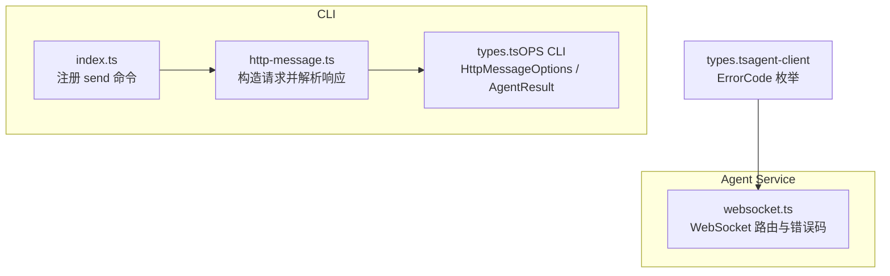
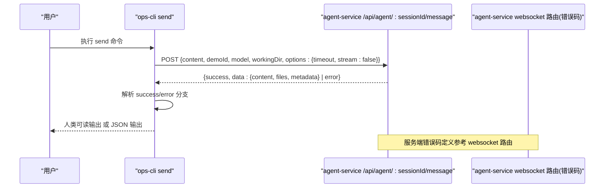
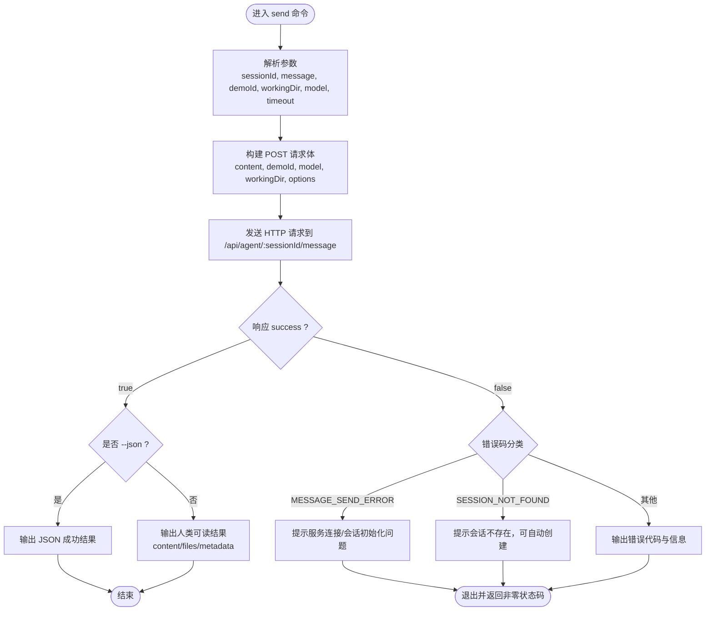
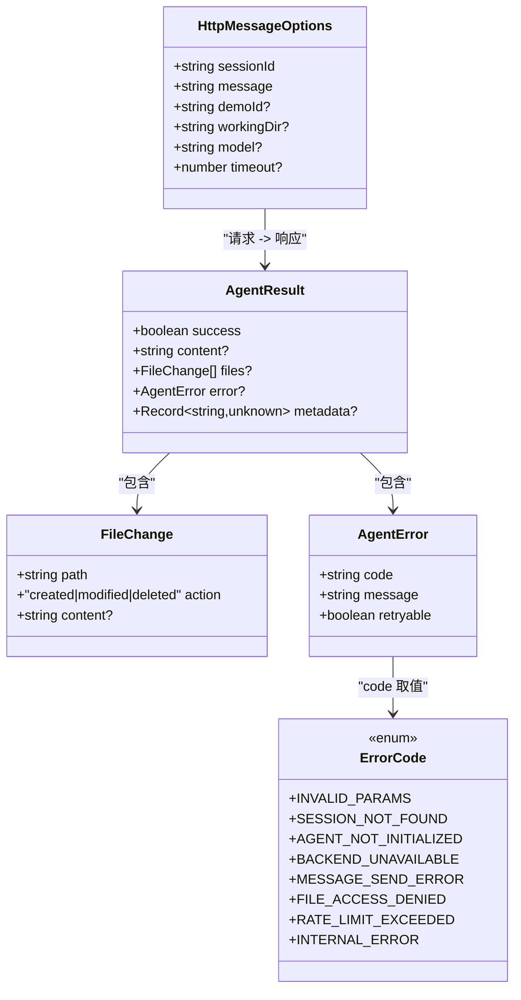

# HTTP 消息测试

<cite>
**本文引用的文件列表**
- [index.ts](file://OPS/CLI/src/index.ts)
- [http-message.ts](file://OPS/CLI/src/commands/http-message.ts)
- [types.ts（OPS CLI）](file://OPS/CLI/src/types.ts)
- [types.ts（agent-client）](file://packages/agent-client/src/types.ts)
- [websocket.ts（agent-service）](file://packages/agent-service/src/routes/websocket.ts)
</cite>

## 目录
1. [简介](#简介)
2. [项目结构](#项目结构)
3. [核心组件](#核心组件)
4. [架构总览](#架构总览)
5. [详细组件分析](#详细组件分析)
6. [依赖关系分析](#依赖关系分析)
7. [性能与超时](#性能与超时)
8. [故障排查指南](#故障排查指南)
9. [结论](#结论)
10. [附录：请求与响应规范](#附录请求与响应规范)

## 简介
本文件面向使用 ops-cli 的开发者与运维人员，系统化说明“HTTP 消息测试”能力，重点围绕 send 命令的非流式消息发送、参数配置、响应处理与错误诊断。文档覆盖如下要点：
- 支持的参数选项：sessionId、message、demoId、workingDir、model、timeout
- 请求格式与响应结构：成功响应中的 content、files、metadata 字段
- 错误处理机制：MESSAGE_SEND_ERROR、SESSION_NOT_FOUND 等错误码的诊断与解决方案
- JSON 模式输出与人类可读输出的使用场景

## 项目结构
ops-cli 通过命令行入口注册 send 子命令，调用内部函数完成 HTTP 请求与结果展示；类型定义统一在 types.ts 中维护；agent-service 侧提供 WebSocket 路由用于流式交互，同时定义了通用错误码集合。

图表来源
- [index.ts:62-82](file://OPS/CLI/src/index.ts#L62-L82)
- [http-message.ts:13-56](file://OPS/CLI/src/commands/http-message.ts#L13-L56)
- [types.ts（OPS CLI）:94-101](file://OPS/CLI/src/types.ts#L94-L101)
- [websocket.ts:447-487](file://packages/agent-service/src/routes/websocket.ts#L447-L487)
- [types.ts（agent-client）:10-18](file://packages/agent-client/src/types.ts#L10-L18)

章节来源
- [index.ts:62-82](file://OPS/CLI/src/index.ts#L62-L82)
- [http-message.ts:13-56](file://OPS/CLI/src/commands/http-message.ts#L13-L56)
- [types.ts（OPS CLI）:94-101](file://OPS/CLI/src/types.ts#L94-L101)
- [types.ts（agent-client）:10-18](file://packages/agent-client/src/types.ts#L10-L18)
- [websocket.ts:447-487](file://packages/agent-service/src/routes/websocket.ts#L447-L487)

## 核心组件
- 命令入口：send <sessionId> <message>，支持 -d/--demo-id、-w/--working-dir、-m/--model、-t/--timeout 以及全局 --json
- 请求构建：将参数映射为 POST body，包含 content、demoId、model、workingDir、options.timeout、options.stream=false
- 响应处理：根据 success 分支输出人类可读信息或 JSON 数据；对常见错误进行友好提示
- 类型契约：HttpMessageOptions 描述输入参数；AgentResult 描述返回体结构

章节来源
- [index.ts:62-82](file://OPS/CLI/src/index.ts#L62-L82)
- [http-message.ts:13-56](file://OPS/CLI/src/commands/http-message.ts#L13-L56)
- [types.ts（OPS CLI）:94-101](file://OPS/CLI/src/types.ts#L94-L101)
- [types.ts（OPS CLI）:11-17](file://OPS/CLI/src/types.ts#L11-L17)

## 架构总览
send 命令通过 HTTP 向 agent-service 发起非流式消息请求，服务端处理后返回一次性完整响应。CLI 负责格式化输出与错误诊断。

图表来源
- [index.ts:62-82](file://OPS/CLI/src/index.ts#L62-L82)
- [http-message.ts:39-56](file://OPS/CLI/src/commands/http-message.ts#L39-L56)
- [websocket.ts:447-487](file://packages/agent-service/src/routes/websocket.ts#L447-L487)

## 详细组件分析

### 命令与参数
- 命令签名：send <sessionId> <message>
- 可选参数
  - -d, --demo-id <demoId>：演示 ID
  - -w, --working-dir <dir>：工作目录路径
  - -m, --model <modelId>：模型 ID
  - -t, --timeout <ms>：超时时间（毫秒），默认 120000
  - 全局 --json：以 JSON 格式输出（供程序化解析）

章节来源
- [index.ts:62-82](file://OPS/CLI/src/index.ts#L62-L82)
- [types.ts（OPS CLI）:94-101](file://OPS/CLI/src/types.ts#L94-L101)

### 请求格式
- 方法：POST
- 路径：/api/agent/{sessionId}/message
- Body 字段
  - content：消息内容（必填）
  - demoId：演示 ID（可选）
  - model：模型 ID（可选）
  - workingDir：工作目录路径（可选）
  - options
    - timeout：超时时间（毫秒，可选）
    - stream：固定为 false（非流式）

章节来源
- [http-message.ts:39-56](file://OPS/CLI/src/commands/http-message.ts#L39-L56)

### 响应结构与字段
- 顶层字段
  - success：布尔值，表示本次请求是否成功
  - data：对象，包含 AI 回复与变更详情
    - content：AI 文本回复（字符串，可能为空）
    - files：文件变更数组，每项包含 path、action（created|modified|deleted）、可选 content
    - metadata：元数据对象，键值对形式，记录如模型、耗时等上下文信息
  - error：错误对象（当 success 为 false 时出现）
    - code：错误码（如 MESSAGE_SEND_ERROR、SESSION_NOT_FOUND 等）
    - message：错误描述
    - retryable：是否可重试（布尔值）

章节来源
- [types.ts（OPS CLI）:11-17](file://OPS/CLI/src/types.ts#L11-L17)
- [types.ts（OPS CLI）:19-23](file://OPS/CLI/src/types.ts#L19-L23)
- [types.ts（OPS CLI）:25-29](file://OPS/CLI/src/types.ts#L25-L29)
- [types.ts（agent-client）:70-76](file://packages/agent-client/src/types.ts#L70-L76)

### 输出模式
- 人类可读模式（默认）
  - 打印会话信息、模型、超时等摘要
  - 成功时显示 AI 回复、文件变更列表与元数据
  - 失败时给出错误代码、错误信息与可能的原因与建议操作
- JSON 模式（--json）
  - 成功：{ success: true, sessionId, duration, data }
  - 失败：{ success: false, sessionId, duration, error }

章节来源
- [http-message.ts:20-34](file://OPS/CLI/src/commands/http-message.ts#L20-L34)
- [http-message.ts:109-133](file://OPS/CLI/src/commands/http-message.ts#L109-L133)
- [http-message.ts:61-74](file://OPS/CLI/src/commands/http-message.ts#L61-L74)

### 错误处理与诊断
- 常见错误码
  - MESSAGE_SEND_ERROR：消息发送失败，可能由服务不可用、网络异常、会话未初始化等引起
  - SESSION_NOT_FOUND：会话不存在；再次发送相同 sessionId 的消息可自动创建会话
- CLI 行为
  - 在人类可读模式下，针对上述错误给出具体建议（例如检查 agent-service 是否启动、尝试新的 sessionId 等）
  - 在 JSON 模式下，直接返回结构化错误以便自动化处理
- 服务端错误码定义
  - ErrorCode 枚举包含 INVALID_PARAMS、SESSION_NOT_FOUND、AGENT_NOT_INITIALIZED、BACKEND_UNAVAILABLE、MESSAGE_SEND_ERROR、FILE_ACCESS_DENIED、RATE_LIMIT_EXCEEDED、INTERNAL_ERROR 等

章节来源
- [http-message.ts:76-107](file://OPS/CLI/src/commands/http-message.ts#L76-L107)
- [types.ts（agent-client）:10-18](file://packages/agent-client/src/types.ts#L10-L18)
- [websocket.ts:447-487](file://packages/agent-service/src/routes/websocket.ts#L447-L487)

### 流程图：send 命令处理逻辑

图表来源
- [http-message.ts:39-107](file://OPS/CLI/src/commands/http-message.ts#L39-L107)

## 依赖关系分析
- CLI 层
  - index.ts 注册 send 命令，并将参数传递给 http-message.ts
  - http-message.ts 依赖 types.ts 中的 HttpMessageOptions 与 AgentResult
- 服务端层
  - websocket.ts 定义了 MESSAGE_SEND_ERROR 等错误码的使用位置
  - agent-client 的 types.ts 集中定义了 ErrorCode 枚举，便于跨模块一致使用

图表来源
- [types.ts（OPS CLI）:94-101](file://OPS/CLI/src/types.ts#L94-L101)
- [types.ts（OPS CLI）:11-17](file://OPS/CLI/src/types.ts#L11-L17)
- [types.ts（OPS CLI）:19-23](file://OPS/CLI/src/types.ts#L19-L23)
- [types.ts（OPS CLI）:25-29](file://OPS/CLI/src/types.ts#L25-L29)
- [types.ts（agent-client）:10-18](file://packages/agent-client/src/types.ts#L10-L18)

章节来源
- [index.ts:62-82](file://OPS/CLI/src/index.ts#L62-L82)
- [http-message.ts:13-56](file://OPS/CLI/src/commands/http-message.ts#L13-L56)
- [types.ts（OPS CLI）:94-101](file://OPS/CLI/src/types.ts#L94-L101)
- [types.ts（agent-client）:10-18](file://packages/agent-client/src/types.ts#L10-L18)

## 性能与超时
- 超时控制
  - 通过 options.timeout 指定单次请求的最大等待时间（毫秒）
  - 默认值为 120000ms（可通过 -t 调整）
- 非流式语义
  - options.stream 固定为 false，意味着客户端等待一次完整响应后再继续
- 建议
  - 对于复杂任务或大文件生成，适当增大 timeout
  - 结合 --json 模式在自动化流程中进行超时与重试策略编排

章节来源
- [http-message.ts:39-56](file://OPS/CLI/src/commands/http-message.ts#L39-L56)
- [index.ts:62-82](file://OPS/CLI/src/index.ts#L62-L82)

## 故障排查指南
- 现象：返回 MESSAGE_SEND_ERROR
  - 可能原因
    - 服务未启动或端口不通（ECONNREFUSED/fetch failed）
    - 会话未正确初始化（No active session）
  - 解决建议
    - 确认 agent-service 已启动并可访问
    - 使用新的 sessionId 重新发送消息
- 现象：返回 SESSION_NOT_FOUND
  - 说明：当前会话不存在
  - 解决建议：使用相同的 sessionId 再次发送消息，系统会自动创建会话
- 现象：JSON 模式下无法解析或字段缺失
  - 检查 --json 开关是否正确传递
  - 对照响应结构确认 data.content、data.files、data.metadata 是否存在

章节来源
- [http-message.ts:76-107](file://OPS/CLI/src/commands/http-message.ts#L76-L107)
- [http-message.ts:61-74](file://OPS/CLI/src/commands/http-message.ts#L61-L74)

## 结论
send 命令提供了简洁可靠的非流式 HTTP 消息测试能力，适合快速验证 AI 对话链路、调试工作空间与模型配置，并通过 JSON 模式融入自动化测试与 CI 流程。配合完善的错误码与诊断提示，可有效定位常见问题并提升排障效率。

## 附录：请求与响应规范

### 请求参数
- 路径：/api/agent/{sessionId}/message
- 方法：POST
- Body 字段
  - content：消息内容（必填）
  - demoId：演示 ID（可选）
  - model：模型 ID（可选）
  - workingDir：工作目录路径（可选）
  - options
    - timeout：超时时间（毫秒，可选）
    - stream：固定为 false（非流式）

章节来源
- [http-message.ts:39-56](file://OPS/CLI/src/commands/http-message.ts#L39-L56)

### 响应结构
- success：布尔值
- data
  - content：AI 文本回复（字符串，可能为空）
  - files：文件变更数组，每项包含 path、action（created|modified|deleted）、可选 content
  - metadata：元数据对象（键值对）
- error（当 success 为 false）
  - code：错误码（如 MESSAGE_SEND_ERROR、SESSION_NOT_FOUND 等）
  - message：错误描述
  - retryable：是否可重试（布尔值）

章节来源
- [types.ts（OPS CLI）:11-17](file://OPS/CLI/src/types.ts#L11-L17)
- [types.ts（OPS CLI）:19-23](file://OPS/CLI/src/types.ts#L19-L23)
- [types.ts（OPS CLI）:25-29](file://OPS/CLI/src/types.ts#L25-L29)
- [types.ts（agent-client）:70-76](file://packages/agent-client/src/types.ts#L70-L76)