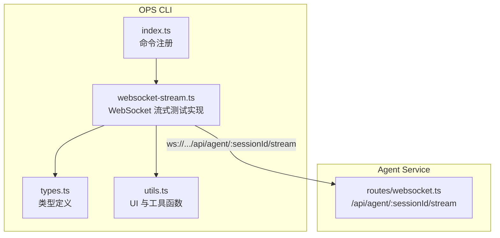
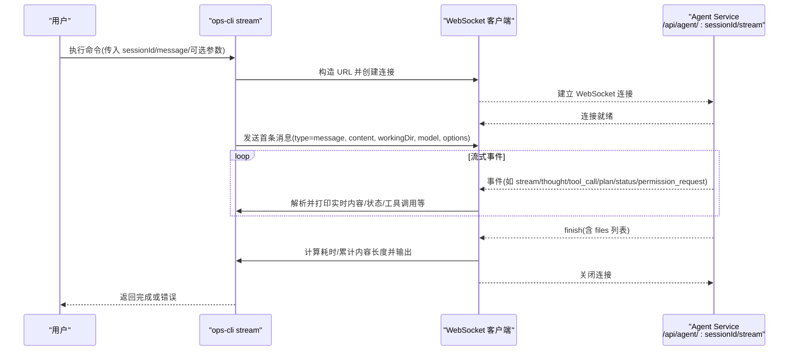
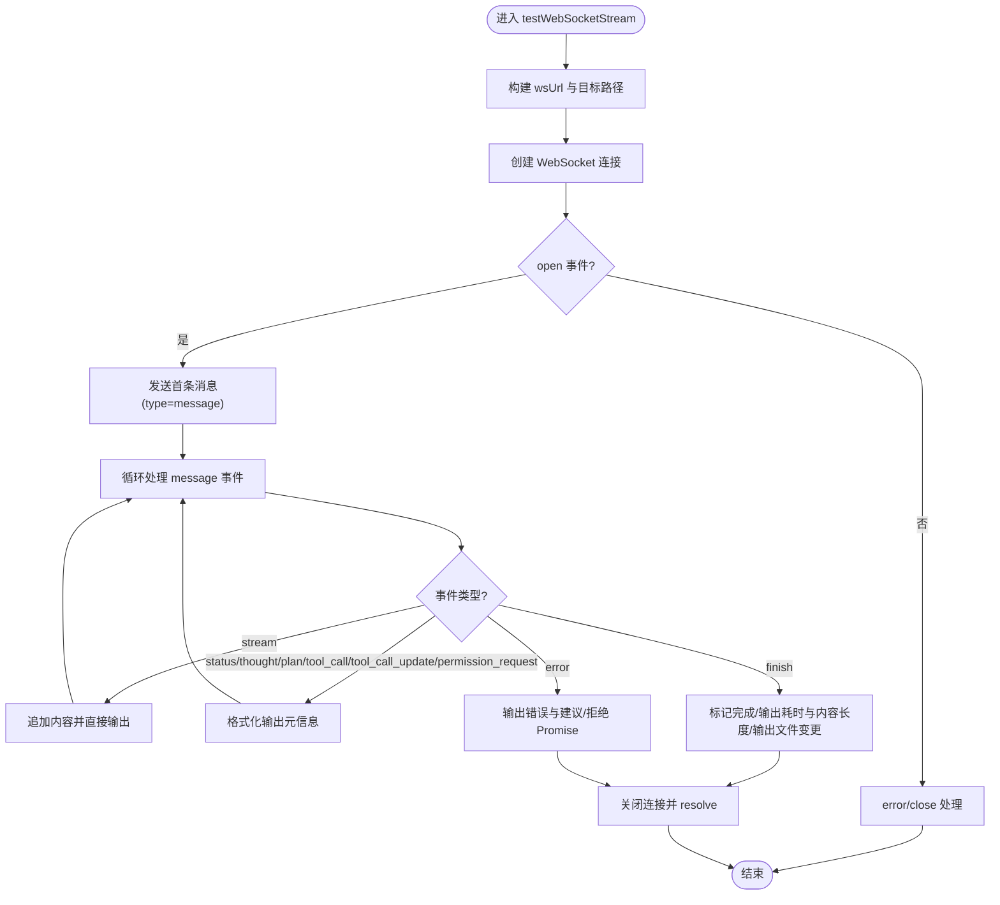
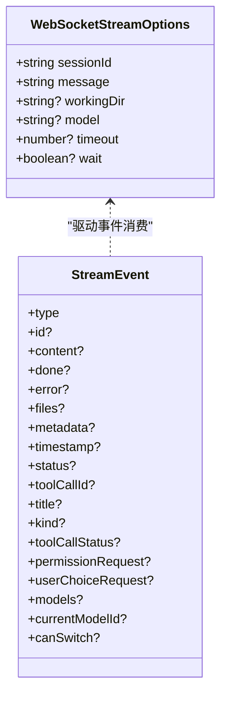
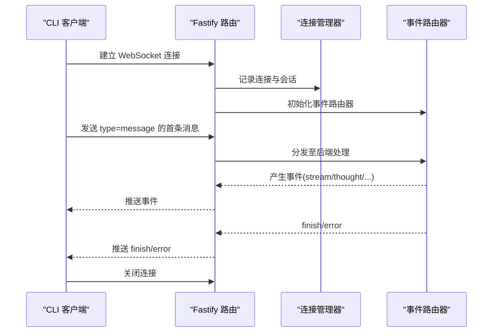
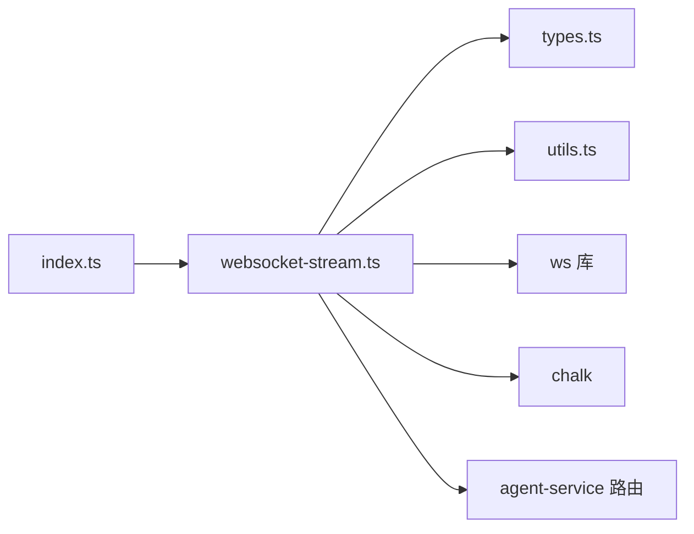

# WebSocket 流式测试

<cite>
**本文引用的文件**   
- [OPS/CLI/src/index.ts](file://OPS/CLI/src/index.ts)
- [OPS/CLI/src/commands/websocket-stream.ts](file://OPS/CLI/src/commands/websocket-stream.ts)
- [OPS/CLI/src/types.ts](file://OPS/CLI/src/types.ts)
- [OPS/CLI/src/utils.ts](file://OPS/CLI/src/utils.ts)
- [packages/agent-service/src/routes/websocket.ts](file://packages/agent-service/src/routes/websocket.ts)
</cite>

## 目录
1. [简介](#简介)
2. [项目结构](#项目结构)
3. [核心组件](#核心组件)
4. [架构总览](#架构总览)
5. [详细组件分析](#详细组件分析)
6. [依赖关系分析](#依赖关系分析)
7. [性能与输出](#性能与输出)
8. [故障排查指南](#故障排查指南)
9. [结论](#结论)
10. [附录：参数与事件说明](#附录参数与事件说明)

## 简介
本文件面向使用 OPS CLI 的开发者与测试工程师，系统化介绍“stream”命令的 WebSocket 流式测试能力。内容涵盖：
- 连接建立、消息发送与实时响应展示
- 连接管理与错误处理（超时、断线提示）
- 流式增量数据处理与最终结果聚合
- 连接参数配置（baseUrl、sessionId、message、workingDir、model、timeout、wait）
- 输出格式（实时日志、性能指标、错误信息）
- 网络异常与超时的最佳实践建议

注意：当前实现未包含自动重连机制；文档将明确说明现状并提供改进建议。

## 项目结构
与 stream 命令相关的代码主要位于 OPS CLI 子项目中，核心入口与命令注册在 index.ts，具体实现位于 commands/websocket-stream.ts，类型定义与工具函数分别位于 types.ts 与 utils.ts。服务端路由位于 packages/agent-service/src/routes/websocket.ts。

**图示来源** 
- [OPS/CLI/src/index.ts:84-103](file://OPS/CLI/src/index.ts#L84-L103)
- [OPS/CLI/src/commands/websocket-stream.ts:15-75](file://OPS/CLI/src/commands/websocket-stream.ts#L15-L75)
- [packages/agent-service/src/routes/websocket.ts:143-160](file://packages/agent-service/src/routes/websocket.ts#L143-L160)

**章节来源**
- [OPS/CLI/src/index.ts:84-103](file://OPS/CLI/src/index.ts#L84-L103)
- [OPS/CLI/src/commands/websocket-stream.ts:15-75](file://OPS/CLI/src/commands/websocket-stream.ts#L15-L75)
- [packages/agent-service/src/routes/websocket.ts:143-160](file://packages/agent-service/src/routes/websocket.ts#L143-L160)

## 核心组件
- 命令入口与参数解析：负责将命令行参数转换为调用选项，并触发流式测试流程。
- WebSocket 客户端实现：封装连接、发送首条消息、接收并渲染事件流、统计耗时与内容长度、处理错误与超时。
- 类型系统：统一定义了 WebSocketStreamOptions 与 StreamEvent 等关键数据结构。
- 工具函数：提供 spinner、成功/失败/警告信息输出、时长格式化等。

**章节来源**
- [OPS/CLI/src/index.ts:84-103](file://OPS/CLI/src/index.ts#L84-L103)
- [OPS/CLI/src/commands/websocket-stream.ts:15-75](file://OPS/CLI/src/commands/websocket-stream.ts#L15-L75)
- [OPS/CLI/src/types.ts:103-110](file://OPS/CLI/src/types.ts#L103-L110)
- [OPS/CLI/src/types.ts:176-233](file://OPS/CLI/src/types.ts#L176-L233)
- [OPS/CLI/src/utils.ts:43-99](file://OPS/CLI/src/utils.ts#L43-L99)

## 架构总览
下图展示了从 CLI 到 Agent Service 的完整交互流程，包括连接建立、消息发送、事件流处理与结束逻辑。

**图示来源** 
- [OPS/CLI/src/commands/websocket-stream.ts:35-75](file://OPS/CLI/src/commands/websocket-stream.ts#L35-L75)
- [OPS/CLI/src/commands/websocket-stream.ts:77-176](file://OPS/CLI/src/commands/websocket-stream.ts#L77-L176)
- [packages/agent-service/src/routes/websocket.ts:143-160](file://packages/agent-service/src/routes/websocket.ts#L143-L160)

## 详细组件分析

### 命令注册与参数映射
- 命令名：stream
- 位置参数：sessionId、message（可选）
- 选项：
  - -w/--working-dir：工作目录路径
  - -m/--model：模型 ID
  - -t/--timeout：超时时间（毫秒），默认 120000
  - --no-wait：发送后不等待完成即退出
- 全局选项：
  - -u/--url：Agent Service 地址（用于构建 wsUrl）
  - --json：JSON 模式（对 stream 命令无影响）

该命令将上述参数映射为 WebSocketStreamOptions 并调用 testWebSocketStream。

**章节来源**
- [OPS/CLI/src/index.ts:84-103](file://OPS/CLI/src/index.ts#L84-L103)
- [OPS/CLI/src/types.ts:103-110](file://OPS/CLI/src/types.ts#L103-L110)

### WebSocket 客户端实现要点
- 连接构建：将 baseUrl 的 http(s) 前缀替换为 ws(s)，拼接 /api/agent/{sessionId}/stream。
- 连接生命周期：
  - open：停止加载提示，显示连接成功，发送首条消息，开始打印 AI 回复。
  - message：按事件类型分流处理，增量写入 stdout，累积内容长度。
  - close：若未完成则提示意外关闭并输出已接收内容摘要。
  - error：提示连接失败原因与建议操作。
- 超时控制：基于 timeout 设置定时器，超时则关闭连接并拒绝 Promise。
- 完成语义：收到 finish 事件时标记完成，输出耗时与内容长度，必要时输出文件变更列表。

**图示来源** 
- [OPS/CLI/src/commands/websocket-stream.ts:35-75](file://OPS/CLI/src/commands/websocket-stream.ts#L35-L75)
- [OPS/CLI/src/commands/websocket-stream.ts:77-176](file://OPS/CLI/src/commands/websocket-stream.ts#L77-L176)
- [OPS/CLI/src/commands/websocket-stream.ts:219-283](file://OPS/CLI/src/commands/websocket-stream.ts#L219-L283)

**章节来源**
- [OPS/CLI/src/commands/websocket-stream.ts:35-75](file://OPS/CLI/src/commands/websocket-stream.ts#L35-L75)
- [OPS/CLI/src/commands/websocket-stream.ts:77-176](file://OPS/CLI/src/commands/websocket-stream.ts#L77-L176)
- [OPS/CLI/src/commands/websocket-stream.ts:219-283](file://OPS/CLI/src/commands/websocket-stream.ts#L219-L283)

### 类型与数据契约
- WebSocketStreamOptions：定义会话标识、消息体、工作目录、模型、超时与是否等待完成等。
- StreamEvent：定义服务端推送的事件类型集合与字段，包括流式内容、思考、计划、工具调用及更新、权限请求、完成、错误、状态等。

**图示来源** 
- [OPS/CLI/src/types.ts:103-110](file://OPS/CLI/src/types.ts#L103-L110)
- [OPS/CLI/src/types.ts:176-233](file://OPS/CLI/src/types.ts#L176-L233)

**章节来源**
- [OPS/CLI/src/types.ts:103-110](file://OPS/CLI/src/types.ts#L103-L110)
- [OPS/CLI/src/types.ts:176-233](file://OPS/CLI/src/types.ts#L176-L233)

### 服务端路由与协议适配
- 路由：GET /api/agent/:sessionId/stream，启用 websocket 模式。
- 职责：建立连接、维护连接表、转发事件、广播与优雅关闭。
- 心跳：服务侧周期性心跳（由 setInterval 驱动），但 CLI 端未实现 ping/pong 处理。

**图示来源** 
- [packages/agent-service/src/routes/websocket.ts:143-160](file://packages/agent-service/src/routes/websocket.ts#L143-L160)
- [packages/agent-service/src/routes/websocket.ts:854-883](file://packages/agent-service/src/routes/websocket.ts#L854-L883)

**章节来源**
- [packages/agent-service/src/routes/websocket.ts:143-160](file://packages/agent-service/src/routes/websocket.ts#L143-L160)
- [packages/agent-service/src/routes/websocket.ts:854-883](file://packages/agent-service/src/routes/websocket.ts#L854-L883)

## 依赖关系分析
- 命令层依赖：
  - commander：解析命令行参数
  - chalk：终端彩色输出
  - ws：WebSocket 客户端库
- 内部依赖：
  - types.ts：统一类型定义
  - utils.ts：spinner、格式化、错误/成功提示等
- 外部依赖：
  - agent-service 提供的 WebSocket 路由

**图示来源** 
- [OPS/CLI/src/index.ts:84-103](file://OPS/CLI/src/index.ts#L84-L103)
- [OPS/CLI/src/commands/websocket-stream.ts:5-13](file://OPS/CLI/src/commands/websocket-stream.ts#L5-L13)
- [packages/agent-service/src/routes/websocket.ts:143-160](file://packages/agent-service/src/routes/websocket.ts#L143-L160)

**章节来源**
- [OPS/CLI/src/index.ts:84-103](file://OPS/CLI/src/index.ts#L84-L103)
- [OPS/CLI/src/commands/websocket-stream.ts:5-13](file://OPS/CLI/src/commands/websocket-stream.ts#L5-L13)

## 性能与输出
- 实时输出：
  - 流式内容通过 process.stdout.write 即时输出，避免缓冲导致的延迟。
  - 其他元信息（思考、计划、工具调用、权限请求、状态）以带颜色与缩进的文本呈现。
- 性能指标：
  - 完成时输出总耗时与累计内容长度。
  - 错误与超时场景也会输出耗时与已接收内容长度。
- 文件变更：
  - finish 事件中携带 files 列表时，会逐行输出 action 与 path。

**章节来源**
- [OPS/CLI/src/commands/websocket-stream.ts:83-176](file://OPS/CLI/src/commands/websocket-stream.ts#L83-L176)
- [OPS/CLI/src/utils.ts:92-99](file://OPS/CLI/src/utils.ts#L92-L99)

## 故障排查指南
- 连接失败常见原因与建议：
  - Agent Service 未启动：先运行 health 检查服务状态。
  - WebSocket 路由配置问题：确认 /api/agent/:sessionId/stream 可用。
  - 会话 ID 无效：使用新会话重试。
- 超时处理：
  - 超过设置的 timeout 将主动关闭连接并拒绝 Promise，同时输出已接收内容片段以便定位。
- 错误响应：
  - 收到 error 事件时，会输出错误代码与信息，并根据消息内容给出可能原因与建议。
- 连接意外关闭：
  - 若未在 finish 前正常结束，close 事件会提示意外关闭并输出已接收内容摘要。

**章节来源**
- [OPS/CLI/src/commands/websocket-stream.ts:242-283](file://OPS/CLI/src/commands/websocket-stream.ts#L242-L283)
- [OPS/CLI/src/commands/websocket-stream.ts:178-217](file://OPS/CLI/src/commands/websocket-stream.ts#L178-L217)
- [OPS/CLI/src/commands/websocket-stream.ts:219-240](file://OPS/CLI/src/commands/websocket-stream.ts#L219-L240)

## 结论
stream 命令提供了轻量而直观的 WebSocket 流式测试能力，适合快速验证 Agent 服务的实时对话与工具调用链路。其优势在于：
- 低门槛：一条命令即可发起端到端流式测试
- 可视化：实时增量输出与结构化元信息展示
- 可观测：耗时、内容长度与错误信息清晰可见

当前实现的不足与改进方向：
- 未实现自动重连与心跳保活（服务端有周期心跳，但客户端未处理 ping/pong）
- 未支持 demoId 参数（HTTP 版本支持，WebSocket 版本未暴露）
- 错误恢复策略有限，建议在复杂网络环境下增加指数退避重连与最大重试次数

## 附录：参数与事件说明

### 连接参数配置
- baseUrl：通过全局 -u/--url 指定，用于构建 wsUrl（http -> ws）。
- sessionId：必需，决定 /api/agent/{sessionId}/stream 路径。
- message：可选，作为首条消息内容。
- workingDir：可选，随首条消息一并发送。
- model：可选，随首条消息一并发送。
- timeout：可选，单位毫秒，默认 120000。
- wait：可选，默认 true；设为 false 可在发送后立即退出。

注意：demoId 在当前 stream 命令中未暴露，仅 HTTP 版本支持。

**章节来源**
- [OPS/CLI/src/index.ts:84-103](file://OPS/CLI/src/index.ts#L84-L103)
- [OPS/CLI/src/commands/websocket-stream.ts:35-75](file://OPS/CLI/src/commands/websocket-stream.ts#L35-L75)
- [OPS/CLI/src/types.ts:103-110](file://OPS/CLI/src/types.ts#L103-L110)

### 事件类型与处理
- stream：增量内容，直接追加输出并累计长度。
- status：状态提示。
- thought：思考过程。
- plan：计划信息。
- tool_call：工具调用开始。
- tool_call_update：工具调用状态更新（pending/in_progress/completed/failed）。
- permission_request：权限请求，展示会话、工具与选项。
- finish：完成事件，附带 files 列表与累计结果。
- error：错误事件，包含 code 与 message。
- 其他：pong、models、user_choice_request 等（当前 CLI 未做特殊处理时会以未知事件形式输出）。

**章节来源**
- [OPS/CLI/src/commands/websocket-stream.ts:77-176](file://OPS/CLI/src/commands/websocket-stream.ts#L77-L176)
- [OPS/CLI/src/types.ts:176-233](file://OPS/CLI/src/types.ts#L176-L233)