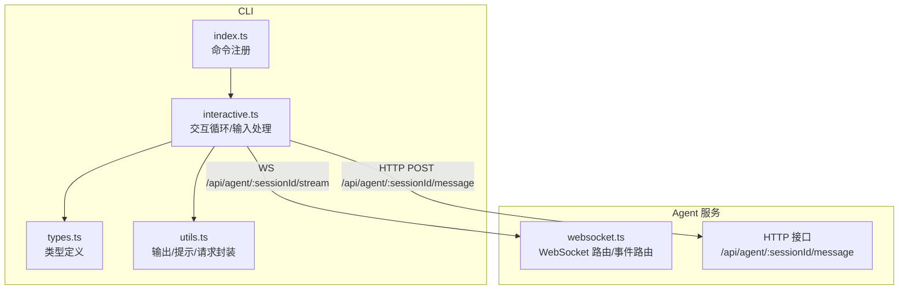
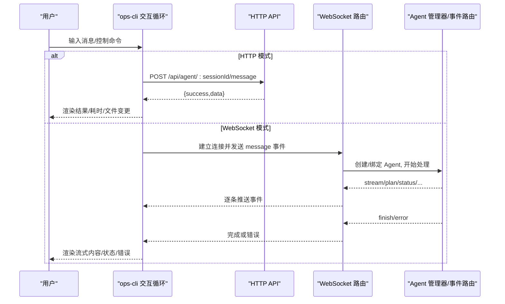
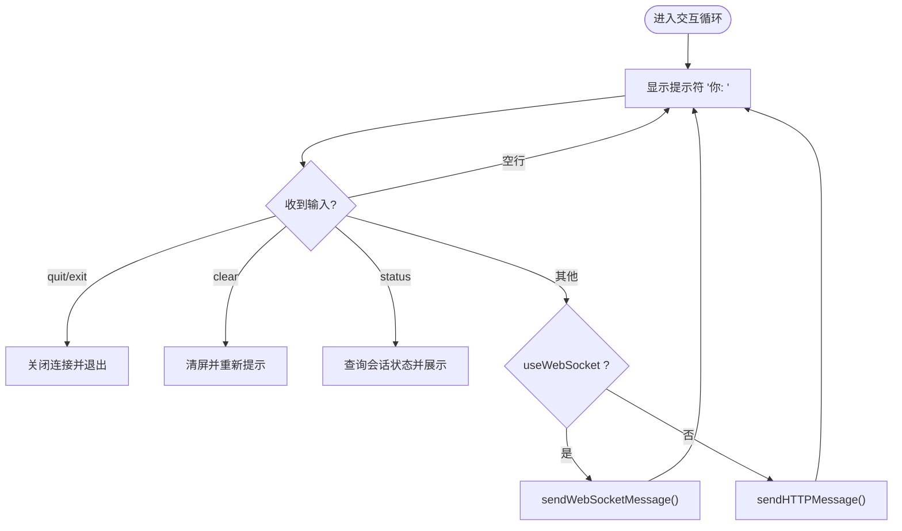
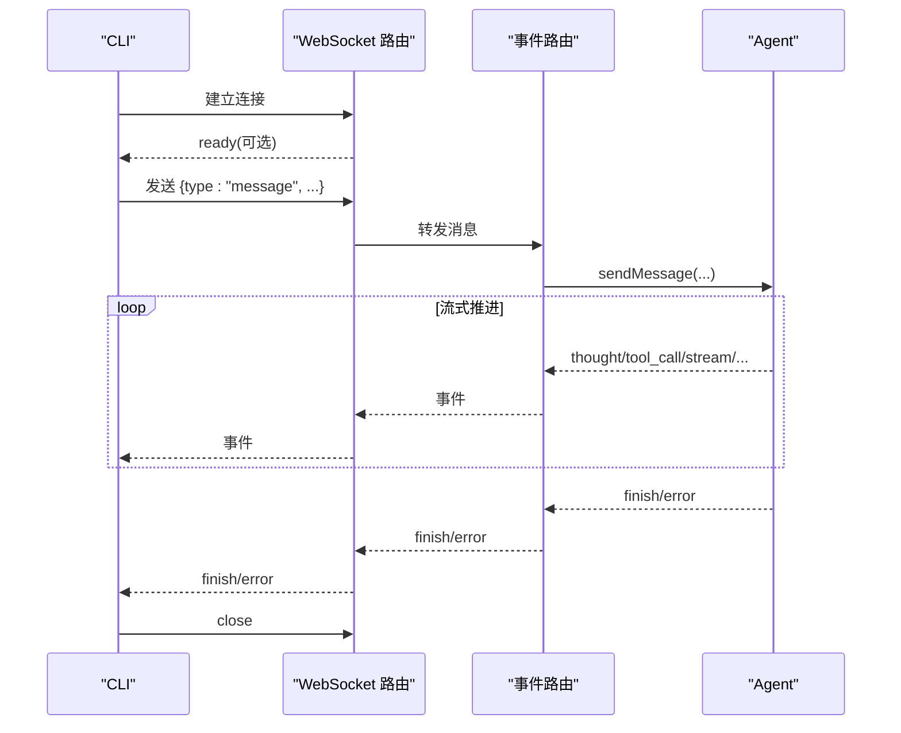
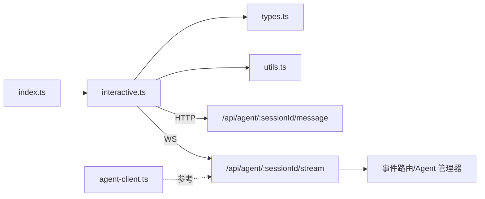

# 交互式测试模式

<cite>
**本文引用的文件**   
- [OPS/CLI/src/index.ts](file://OPS/CLI/src/index.ts)
- [OPS/CLI/src/commands/interactive.ts](file://OPS/CLI/src/commands/interactive.ts)
- [OPS/CLI/src/types.ts](file://OPS/CLI/src/types.ts)
- [OPS/CLI/src/utils.ts](file://OPS/CLI/src/utils.ts)
- [packages/agent-service/src/routes/websocket.ts](file://packages/agent-service/src/routes/websocket.ts)
- [packages/agent-client/src/client.ts](file://packages/agent-client/src/client.ts)
- [docs/项目文档/独立Agent服务层/02-接口规范.md](file://docs/项目文档/独立Agent服务层/02-接口规范.md)
</cite>

## 目录
1. [简介](#简介)
2. [项目结构](#项目结构)
3. [核心组件](#核心组件)
4. [架构总览](#架构总览)
5. [详细组件分析](#详细组件分析)
6. [依赖关系分析](#依赖关系分析)
7. [性能与体验优化](#性能与体验优化)
8. [故障排查指南](#故障排查指南)
9. [结论](#结论)
10. [附录](#附录)

## 简介
本文件面向“交互式测试模式”命令，系统性说明 CLI 的交互体验、会话管理、与 Agent 服务的通信协议、错误恢复机制以及用户体验优化建议。该功能通过 ops-cli 提供 interactive 子命令，支持 HTTP 与 WebSocket 两种模式与后端 Agent 服务进行对话式交互，便于快速验证工作流、调试问题与演示能力。

## 项目结构
交互式测试模式由 CLI 入口注册命令、交互式实现模块、类型定义与工具函数组成；服务端由 Agent 服务暴露 HTTP 与 WebSocket 接口，负责会话生命周期、事件路由与消息处理。

图表来源
- [OPS/CLI/src/index.ts:350-364](file://OPS/CLI/src/index.ts#L350-L364)
- [OPS/CLI/src/commands/interactive.ts:11-79](file://OPS/CLI/src/commands/interactive.ts#L11-L79)
- [packages/agent-service/src/routes/websocket.ts:134-180](file://packages/agent-service/src/routes/websocket.ts#L134-L180)

章节来源
- [OPS/CLI/src/index.ts:350-364](file://OPS/CLI/src/index.ts#L350-L364)
- [OPS/CLI/src/commands/interactive.ts:11-79](file://OPS/CLI/src/commands/interactive.ts#L11-L79)
- [packages/agent-service/src/routes/websocket.ts:134-180](file://packages/agent-service/src/routes/websocket.ts#L134-L180)

## 核心组件
- 命令入口与参数解析：在 CLI 主入口中注册 interactive 命令，支持可选 sessionId、工作目录与 ws 模式切换。
- 交互循环与输入处理：基于 readline 构建连续对话，内置 quit/exit/clear/status 等控制命令，按模式发送消息。
- 传输层：
  - HTTP 模式：POST 到 /api/agent/:sessionId/message，返回一次性响应。
  - WebSocket 模式：连接 /api/agent/:sessionId/stream，接收流式事件（stream/plan/finish/error/status）。
- 类型与工具：统一响应格式、事件类型、错误结构与输出工具。

章节来源
- [OPS/CLI/src/index.ts:350-364](file://OPS/CLI/src/index.ts#L350-L364)
- [OPS/CLI/src/commands/interactive.ts:11-79](file://OPS/CLI/src/commands/interactive.ts#L11-L79)
- [OPS/CLI/src/types.ts:1-234](file://OPS/CLI/src/types.ts#L1-L234)
- [OPS/CLI/src/utils.ts:1-174](file://OPS/CLI/src/utils.ts#L1-L174)

## 架构总览
下图展示从用户输入到服务端处理的端到端流程，包括 HTTP 与 WebSocket 两条路径。

图表来源
- [OPS/CLI/src/commands/interactive.ts:82-127](file://OPS/CLI/src/commands/interactive.ts#L82-L127)
- [OPS/CLI/src/commands/interactive.ts:130-247](file://OPS/CLI/src/commands/interactive.ts#L130-L247)
- [packages/agent-service/src/routes/websocket.ts:182-379](file://packages/agent-service/src/routes/websocket.ts#L182-L379)
- [packages/agent-service/src/routes/websocket.ts:380-579](file://packages/agent-service/src/routes/websocket.ts#L380-L579)

## 详细组件分析

### 交互循环与输入处理
- 启动时打印会话信息、模式与工作目录，并给出操作提示。
- 使用 readline.question 显示“你: ”提示符，等待用户输入。
- 特殊命令：
  - quit/exit：关闭 WebSocket（如有）并退出进程。
  - clear：清屏后重新进入提示符。
  - status：调用 /api/agent/:sessionId 查询会话状态并展示。
- 普通输入：根据 useWebSocket 选择 HTTP 或 WebSocket 发送。

图表来源
- [OPS/CLI/src/commands/interactive.ts:11-79](file://OPS/CLI/src/commands/interactive.ts#L11-L79)
- [OPS/CLI/src/commands/interactive.ts:249-273](file://OPS/CLI/src/commands/interactive.ts#L249-L273)

章节来源
- [OPS/CLI/src/commands/interactive.ts:11-79](file://OPS/CLI/src/commands/interactive.ts#L11-L79)
- [OPS/CLI/src/commands/interactive.ts:249-273](file://OPS/CLI/src/commands/interactive.ts#L249-L273)

### HTTP 模式发送与响应渲染
- 构造 POST 请求至 /api/agent/:sessionId/message，携带 content、workingDir 与 options（timeout/stream=false）。
- 解析 JSON 响应，若 success=false 则输出错误；否则渲染 AI 回复、耗时与文件变更列表。
- 异常捕获并友好提示。

章节来源
- [OPS/CLI/src/commands/interactive.ts:82-127](file://OPS/CLI/src/commands/interactive.ts#L82-L127)
- [OPS/CLI/src/utils.ts:1-41](file://OPS/CLI/src/utils.ts#L1-L41)

### WebSocket 模式与流式事件
- 首次发送前自动建立 ws 连接，URL 为 baseUrl 将 http(s) 替换为 ws(s)，路径 /api/agent/:sessionId/stream。
- 发送 message 事件，包含 id/content/workingDir/options(stream=true)。
- 事件处理：
  - stream：追加输出内容。
  - plan：以计划形式展示。
  - status：展示中间状态。
  - finish：结束流式输出，展示文件变更并关闭连接。
  - error：展示错误并关闭连接。
- 已有连接时直接复用发送，避免重复握手。

图表来源
- [OPS/CLI/src/commands/interactive.ts:130-247](file://OPS/CLI/src/commands/interactive.ts#L130-L247)
- [packages/agent-service/src/routes/websocket.ts:182-379](file://packages/agent-service/src/routes/websocket.ts#L182-L379)
- [packages/agent-service/src/routes/websocket.ts:380-579](file://packages/agent-service/src/routes/websocket.ts#L380-L579)

章节来源
- [OPS/CLI/src/commands/interactive.ts:130-247](file://OPS/CLI/src/commands/interactive.ts#L130-L247)
- [packages/agent-service/src/routes/websocket.ts:182-379](file://packages/agent-service/src/routes/websocket.ts#L182-L379)
- [packages/agent-service/src/routes/websocket.ts:380-579](file://packages/agent-service/src/routes/websocket.ts#L380-L579)

### 会话管理与上下文持久化
- 会话创建与初始化：
  - 当 Agent 处于 initializing 状态时，服务端会创建/获取 Agent，并在首次使用时同步元数据到全局 SessionStore（含 workingDir、workspaceMeta、snapshotMode 等）。
- 会话恢复：
  - 支持 resume 消息，传入 resumeSessionId 以恢复历史会话上下文。
- 会话状态同步：
  - processing/ready/error 等状态在服务端更新并可通过 CLI 的 status 命令查看。
- 客户端侧：
  - CLI 不维护本地会话状态，仅通过 sessionId 与服务端交互；如需跨进程保持，需外部存储 sessionId 并传入 interactive 命令。

章节来源
- [packages/agent-service/src/routes/websocket.ts:247-283](file://packages/agent-service/src/routes/websocket.ts#L247-L283)
- [packages/agent-service/src/routes/websocket.ts:489-556](file://packages/agent-service/src/routes/websocket.ts#L489-L556)
- [OPS/CLI/src/commands/interactive.ts:249-273](file://OPS/CLI/src/commands/interactive.ts#L249-L273)

### 与 Agent 服务的交互协议
- 通用响应格式：成功 { success: true, data }；失败 { success: false, error: { code, message, details? } }。
- HTTP 消息体字段：content、workingDir、options（timeout/stream）。
- WebSocket 客户端消息：
  - type=message：必需 content；可带 workingDir/projectId/demoId/model/systemPrompt/images/files/options。
  - type=resume：用于恢复会话，需要 resumeSessionId。
  - type=set_model：切换模型。
  - type=cancel：取消当前处理。
  - type=console_data：辅助通道，用于控制台日志回传。
- WebSocket 服务端事件：
  - stream/thought/tool_call/tool_call_update/plan/error/finish/pong/status/permission_request/user_choice_request/models。
- 超时与心跳：
  - 显式超时由 options.timeout 控制；服务端周期性发送 status 心跳，防止长连接空闲断开。

章节来源
- [docs/项目文档/独立Agent服务层/02-接口规范.md:1-25](file://docs/项目文档/独立Agent服务层/02-接口规范.md#L1-L25)
- [packages/agent-service/src/routes/websocket.ts:182-379](file://packages/agent-service/src/routes/websocket.ts#L182-L379)
- [packages/agent-service/src/routes/websocket.ts:380-579](file://packages/agent-service/src/routes/websocket.ts#L380-L579)
- [packages/agent-client/src/client.ts:380-408](file://packages/agent-client/src/client.ts#L380-L408)

### 错误处理与恢复
- 客户端：
  - HTTP 网络异常、JSON 解析失败、服务端返回 success=false 均会输出错误信息与代码。
  - WebSocket 连接错误、消息解析失败、服务端返回 error 事件均会清理连接并回到提示符。
- 服务端：
  - 非法参数返回 INVALID_PARAMS。
  - 显式超时返回 MESSAGE_TIMEOUT，并附带已产生的部分文件变更。
  - 内部错误返回 INTERNAL_ERROR 或具体错误码。
- 恢复策略：
  - 使用 resume 消息恢复会话上下文。
  - 对 MESSAGE_TIMEOUT 可重试或调整 timeout。

章节来源
- [OPS/CLI/src/commands/interactive.ts:120-127](file://OPS/CLI/src/commands/interactive.ts#L120-L127)
- [OPS/CLI/src/commands/interactive.ts:211-223](file://OPS/CLI/src/commands/interactive.ts#L211-L223)
- [packages/agent-service/src/routes/websocket.ts:188-198](file://packages/agent-service/src/routes/websocket.ts#L188-L198)
- [packages/agent-service/src/routes/websocket.ts:380-445](file://packages/agent-service/src/routes/websocket.ts#L380-L445)

### 用户体验优化建议
- 自动补全：
  - 可在 readline 中集成 commander 的命令补全或自定义关键词（如 model、workingDir）补全。
- 语法高亮：
  - 对 AI 输出的 Markdown/代码片段进行终端高亮（例如借助 chalk 主题或第三方库）。
- 多行输入：
  - 支持 Shift+Enter 换行、Enter 提交；或使用多行编辑器模式粘贴大段文本。
- 快捷键：
  - 增加 Ctrl+C 中断、Ctrl+R 重发上一条、Ctrl+S 暂停/继续等。
- 响应格式化：
  - 自动折叠超长输出、分页滚动、表格对齐、时间戳与耗时统计。
- 会话控制：
  - 提供 list/history/clear 等子命令，结合外部存储实现会话切换与历史记录查看。

[本节为概念性建议，无需源码引用]

## 依赖关系分析
- CLI 侧：
  - index.ts 注册 interactive 命令，动态导入 interactive.ts。
  - interactive.ts 依赖 types.ts 的类型与 utils.ts 的输出/请求工具。
- 服务端：
  - websocket.ts 提供 /api/agent/:sessionId/stream 与 /api/agent/:sessionId/message（HTTP），并通过事件路由与 Agent 管理器协作。
- 客户端库：
  - agent-client 提供 ping/事件订阅等基础能力，可作为参考实现。

图表来源
- [OPS/CLI/src/index.ts:350-364](file://OPS/CLI/src/index.ts#L350-L364)
- [OPS/CLI/src/commands/interactive.ts:11-79](file://OPS/CLI/src/commands/interactive.ts#L11-L79)
- [packages/agent-service/src/routes/websocket.ts:134-180](file://packages/agent-service/src/routes/websocket.ts#L134-L180)
- [packages/agent-client/src/client.ts:380-408](file://packages/agent-client/src/client.ts#L380-L408)

章节来源
- [OPS/CLI/src/index.ts:350-364](file://OPS/CLI/src/index.ts#L350-L364)
- [OPS/CLI/src/commands/interactive.ts:11-79](file://OPS/CLI/src/commands/interactive.ts#L11-L79)
- [packages/agent-service/src/routes/websocket.ts:134-180](file://packages/agent-service/src/routes/websocket.ts#L134-L180)
- [packages/agent-client/src/client.ts:380-408](file://packages/agent-client/src/client.ts#L380-L408)

## 性能与体验优化
- 流式优先：长响应建议使用 WebSocket 模式，减少首字节延迟。
- 合理超时：根据任务复杂度设置 options.timeout，避免长时间阻塞。
- 连接复用：同一会话多次发送消息时复用 WebSocket 连接，降低握手开销。
- 进度心跳：服务端周期性 status 心跳，有助于前端/CLI 感知活跃状态。
- 输出节流：大量 stream 事件时可合并渲染，避免频繁刷新导致卡顿。

[本节为通用指导，无需源码引用]

## 故障排查指南
- 无法连接：
  - 检查 baseUrl 是否正确，ws 模式需确保地址为 ws(s) 且端口开放。
  - 使用 health/system 命令确认服务运行状态。
- 消息为空或格式错误：
  - 服务端会返回 INVALID_PARAMS，请检查 content 是否为空或 JSON 是否合法。
- 处理超时：
  - 出现 MESSAGE_TIMEOUT，可适当增大 timeout 或拆分任务。
- 会话不存在或状态异常：
  - 使用 session/sessions/destroy 命令管理会话；必要时使用 diagnose 诊断。
- 日志采集：
  - 使用 logs 命令按级别/关键字过滤，定位问题。

章节来源
- [OPS/CLI/src/index.ts:115-162](file://OPS/CLI/src/index.ts#L115-L162)
- [OPS/CLI/src/commands/interactive.ts:249-273](file://OPS/CLI/src/commands/interactive.ts#L249-L273)
- [packages/agent-service/src/routes/websocket.ts:188-198](file://packages/agent-service/src/routes/websocket.ts#L188-L198)
- [packages/agent-service/src/routes/websocket.ts:380-445](file://packages/agent-service/src/routes/websocket.ts#L380-L445)

## 结论
交互式测试模式通过简洁的 CLI 界面与灵活的传输方式，提供了高效的 Agent 对话式测试能力。配合完善的错误处理、会话恢复与诊断工具链，能够快速定位问题并提升开发效率。建议在后续迭代中增强自动补全、多行输入与输出格式化等体验优化点。

## 附录
- 常用命令速查：
  - interactive [sessionId] [--working-dir <dir>] [--ws]
  - send <sessionId> <message> [-w/-m/-t]
  - stream <sessionId> [message] [-w/-m/-t/--no-wait]
  - session <sessionId>
  - sessions [-l/-o/-s]
  - destroy <sessionId>
  - diagnose [sessionId] [-m]
  - logs [sessionId] [-l/-p/-n]
  - models
  - workspace <sessionId>
  - workspace-set <sessionId> <workingDir> [--custom]
  - files <sessionId>

章节来源
- [OPS/CLI/src/index.ts:62-162](file://OPS/CLI/src/index.ts#L62-L162)
- [OPS/CLI/src/index.ts:167-228](file://OPS/CLI/src/index.ts#L167-L228)
- [OPS/CLI/src/index.ts:350-364](file://OPS/CLI/src/index.ts#L350-L364)