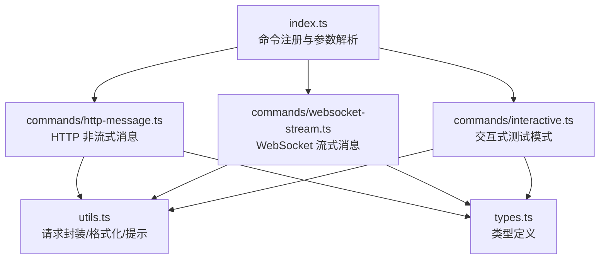
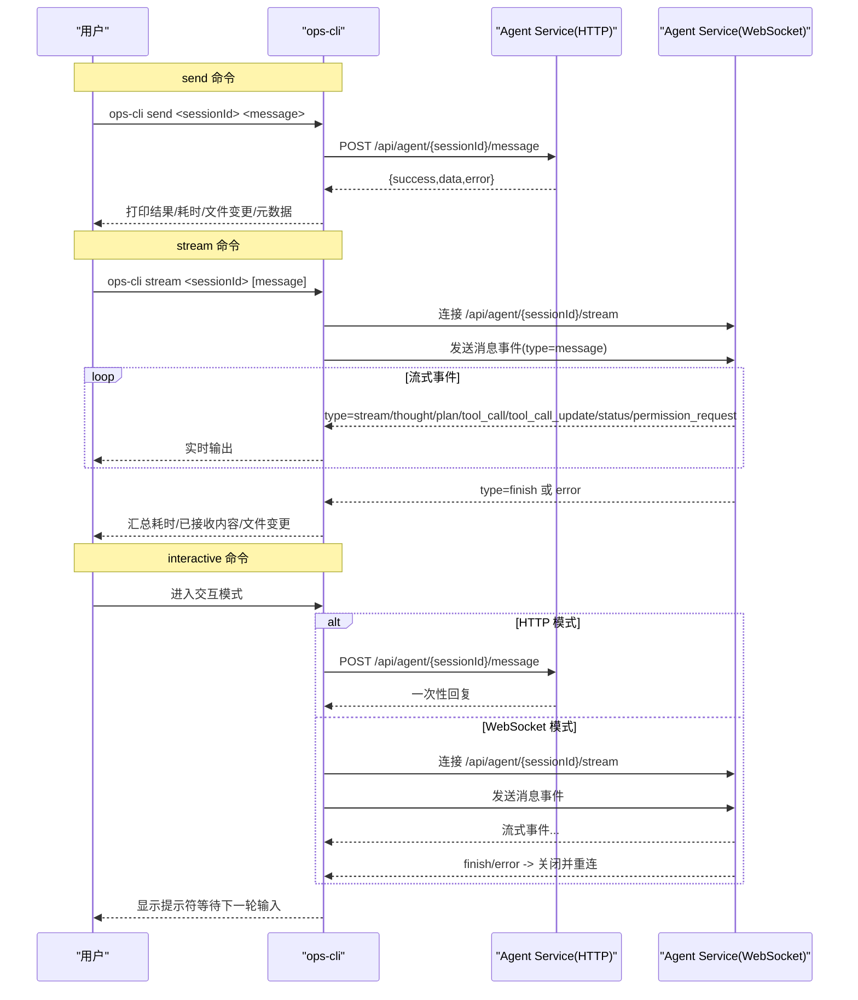
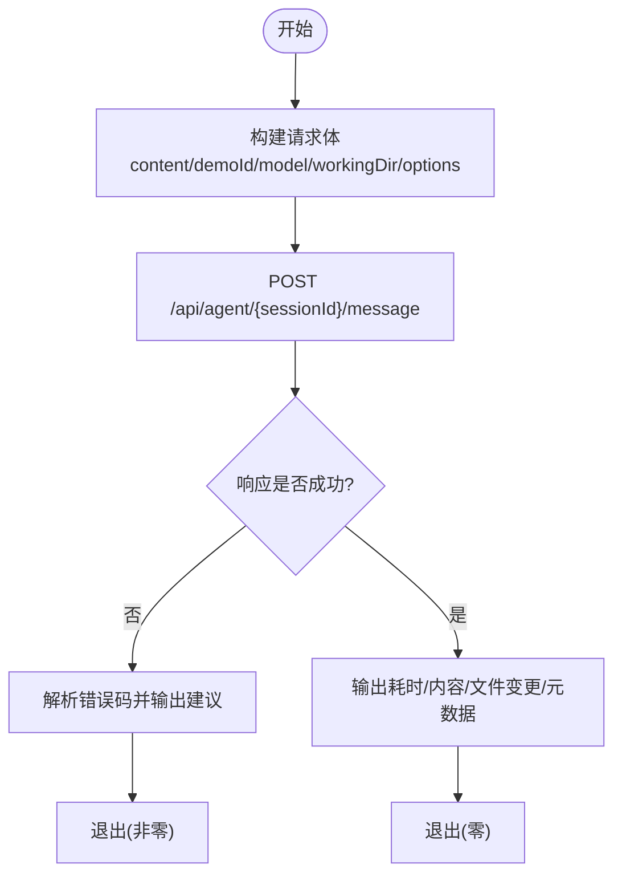
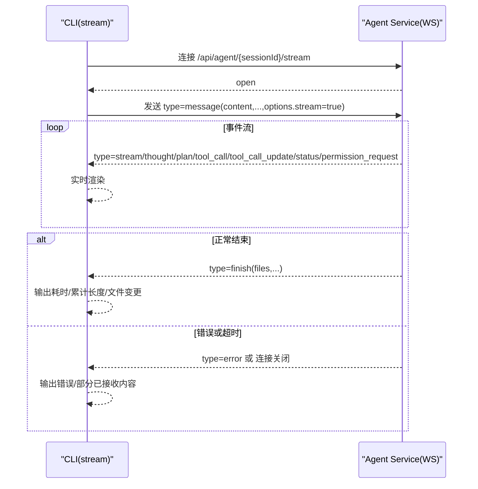
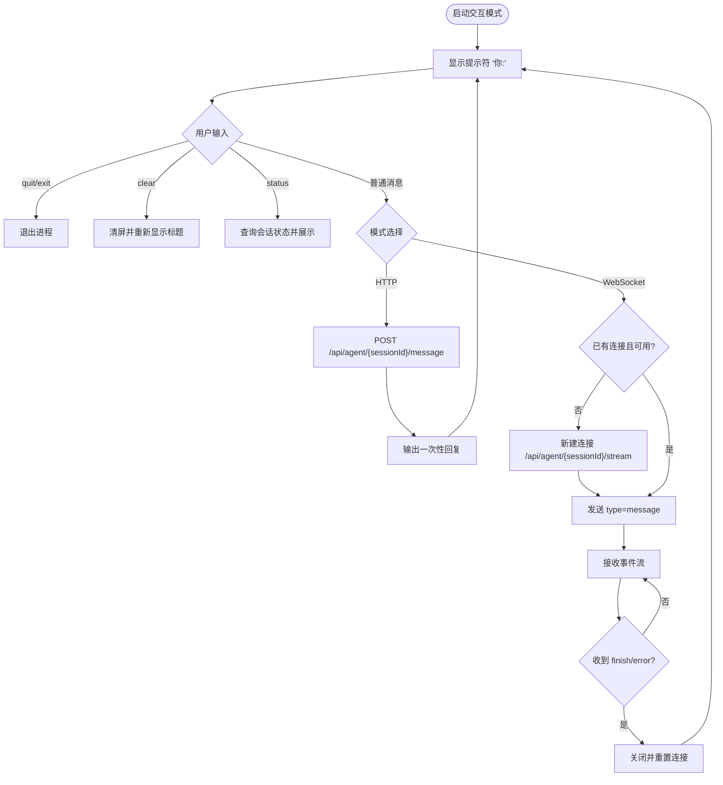
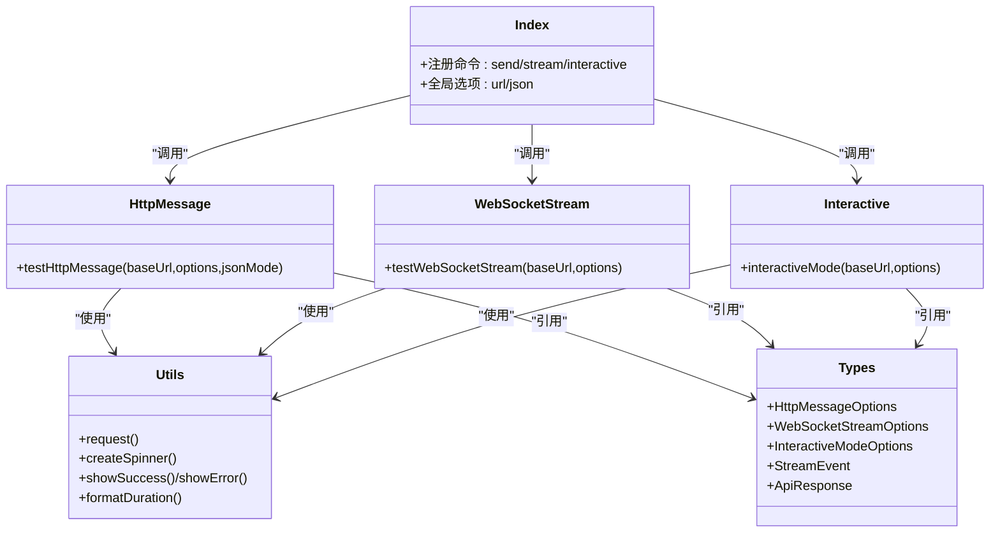

# 消息测试命令

<cite>
**本文引用的文件**   
- [index.ts](file://OPS/CLI/src/index.ts)
- [http-message.ts](file://OPS/CLI/src/commands/http-message.ts)
- [websocket-stream.ts](file://OPS/CLI/src/commands/websocket-stream.ts)
- [interactive.ts](file://OPS/CLI/src/commands/interactive.ts)
- [types.ts](file://OPS/CLI/src/types.ts)
- [utils.ts](file://OPS/CLI/src/utils.ts)
</cite>

## 目录
1. [简介](#简介)
2. [项目结构](#项目结构)
3. [核心组件](#核心组件)
4. [架构总览](#架构总览)
5. [详细组件分析](#详细组件分析)
6. [依赖关系分析](#依赖关系分析)
7. [性能与压力测试建议](#性能与压力测试建议)
8. [故障排查指南](#故障排查指南)
9. [结论](#结论)

## 简介
本文件面向使用 CLI 进行“消息测试”的工程师，聚焦以下三个命令：
- send：通过 HTTP API 发送非流式消息，支持超时控制与错误处理。
- stream：通过 WebSocket 建立流式连接，实时接收增量响应、展示进度并管理连接生命周期。
- interactive：交互式测试模式，支持连续对话、自动重连（在交互模式下按事件完成或出错后重建连接）与会话保持。

文档将覆盖每个命令的参数选项、通信协议、输出格式，并提供网络问题排查、性能测试与压力测试的使用场景建议。

## 项目结构
消息测试相关命令位于 OPS/CLI 子项目中，入口定义了命令行接口，具体实现拆分到独立命令模块中，类型与工具函数集中管理。

图表来源
- [index.ts:62-103](file://OPS/CLI/src/index.ts#L62-L103)
- [http-message.ts:13-56](file://OPS/CLI/src/commands/http-message.ts#L13-L56)
- [websocket-stream.ts:15-75](file://OPS/CLI/src/commands/websocket-stream.ts#L15-L75)
- [interactive.ts:11-79](file://OPS/CLI/src/commands/interactive.ts#L11-L79)
- [utils.ts:5-41](file://OPS/CLI/src/utils.ts#L5-L41)
- [types.ts:94-116](file://OPS/CLI/src/types.ts#L94-L116)

章节来源
- [index.ts:26-103](file://OPS/CLI/src/index.ts#L26-L103)

## 核心组件
- send 命令：基于 HTTP POST /api/agent/{sessionId}/message，返回一次性完整结果；支持超时、模型与工作目录等参数。
- stream 命令：基于 WebSocket /api/agent/{sessionId}/stream，服务端推送多类事件（如流式内容、计划、工具调用、状态、完成、错误等），客户端可实时渲染。
- interactive 命令：提供交互式输入循环，支持 HTTP 与 WebSocket 两种模式；在 WebSocket 模式下具备连接复用与自动重连逻辑，并在收到 finish/error 后恢复提示符。

章节来源
- [index.ts:62-103](file://OPS/CLI/src/index.ts#L62-L103)
- [http-message.ts:13-56](file://OPS/CLI/src/commands/http-message.ts#L13-L56)
- [websocket-stream.ts:15-75](file://OPS/CLI/src/commands/websocket-stream.ts#L15-L75)
- [interactive.ts:11-79](file://OPS/CLI/src/commands/interactive.ts#L11-L79)

## 架构总览
下图展示了三种命令的端到端流程与关键交互点。

图表来源
- [index.ts:62-103](file://OPS/CLI/src/index.ts#L62-L103)
- [http-message.ts:39-56](file://OPS/CLI/src/commands/http-message.ts#L39-L56)
- [websocket-stream.ts:47-75](file://OPS/CLI/src/commands/websocket-stream.ts#L47-L75)
- [interactive.ts:82-127](file://OPS/CLI/src/commands/interactive.ts#L82-L127)
- [interactive.ts:130-247](file://OPS/CLI/src/commands/interactive.ts#L130-L247)

## 详细组件分析

### send 命令（HTTP 非流式）
- 功能要点
  - 通过 HTTP POST 发送一次性消息，等待完整响应。
  - 支持工作目录、模型、超时时间等参数。
  - 统一错误处理与友好提示，包含常见错误码与修复建议。
- 参数选项
  - sessionId（必需）：会话标识。
  - message（必需）：消息内容。
  - --demo-id：可选 Demo ID。
  - --working-dir：可选工作目录路径。
  - --model：可选模型 ID。
  - --timeout：可选超时毫秒数，默认 120000。
- 通信协议
  - 方法：POST
  - 路径：/api/agent/{sessionId}/message
  - 请求体字段：content、demoId、model、workingDir、options.timeout、options.stream=false。
  - 响应体：包含 success、data（content/files/metadata）、error 等字段。
- 输出格式
  - 文本模式：成功/失败信息、耗时、AI 回复内容、文件变更列表、元数据。
  - JSON 模式：结构化输出，便于程序化解析。
- 超时与错误处理
  - 超时：由 options.timeout 控制，若服务侧未返回则触发超时。
  - 错误：根据 response.error.code 给出原因与建议，例如 MESSAGE_SEND_ERROR、SESSION_NOT_FOUND、ECONNREFUSED 等。

图表来源
- [http-message.ts:39-56](file://OPS/CLI/src/commands/http-message.ts#L39-L56)
- [http-message.ts:61-107](file://OPS/CLI/src/commands/http-message.ts#L61-L107)
- [http-message.ts:109-135](file://OPS/CLI/src/commands/http-message.ts#L109-L135)
- [http-message.ts:136-160](file://OPS/CLI/src/commands/http-message.ts#L136-L160)

章节来源
- [index.ts:62-82](file://OPS/CLI/src/index.ts#L62-L82)
- [http-message.ts:13-161](file://OPS/CLI/src/commands/http-message.ts#L13-L161)
- [types.ts:94-101](file://OPS/CLI/src/types.ts#L94-L101)
- [utils.ts:5-41](file://OPS/CLI/src/utils.ts#L5-L41)

### stream 命令（WebSocket 流式）
- 功能要点
  - 建立 WebSocket 长连接，发送一次消息后持续接收服务端推送的事件。
  - 支持实时内容输出、计划/思考/工具调用/权限请求等事件展示。
  - 支持超时控制与“不等待完成”快速退出。
- 参数选项
  - sessionId（必需）：会话标识。
  - message（可选）：消息内容，默认“你好”。
  - --working-dir：可选工作目录路径。
  - --model：可选模型 ID。
  - --timeout：可选超时毫秒数，默认 120000。
  - --no-wait：发送后立即退出，不等待 finish。
- 通信协议
  - 协议：WebSocket
  - 路径：/api/agent/{sessionId}/stream
  - 客户端消息：type=message，携带 content、workingDir、model、options.timeout、options.stream=true。
  - 服务端事件：type 可为 stream、status、thought、plan、tool_call、tool_call_update、permission_request、finish、error 等。
- 输出格式
  - 实时输出流式内容，附带状态/计划/工具调用等信息。
  - 完成后汇总耗时、累计字符数、文件变更。
  - 错误时输出错误信息与可能原因。
- 连接管理与超时
  - open：连接成功后立即发送消息。
  - message：按事件类型分发处理。
  - close：正常完成或异常关闭均会清理资源。
  - error：连接级错误提示与诊断建议。
  - timeout：超过阈值强制关闭并拒绝 Promise。

图表来源
- [websocket-stream.ts:35-75](file://OPS/CLI/src/commands/websocket-stream.ts#L35-L75)
- [websocket-stream.ts:77-217](file://OPS/CLI/src/commands/websocket-stream.ts#L77-L217)
- [websocket-stream.ts:219-283](file://OPS/CLI/src/commands/websocket-stream.ts#L219-L283)

章节来源
- [index.ts:87-103](file://OPS/CLI/src/index.ts#L87-L103)
- [websocket-stream.ts:15-285](file://OPS/CLI/src/commands/websocket-stream.ts#L15-L285)
- [types.ts:176-233](file://OPS/CLI/src/types.ts#L176-L233)

### interactive 命令（交互式测试模式）
- 功能要点
  - 提供交互式输入循环，支持连续对话。
  - 支持 HTTP 与 WebSocket 两种模式切换。
  - WebSocket 模式下具备连接复用与自动重连能力，在 finish/error 后恢复提示符。
- 参数选项
  - sessionId（可选）：会话标识，未提供时自动生成。
  - --working-dir：可选工作目录路径。
  - --ws：启用 WebSocket 模式（默认 HTTP）。
- 通信协议
  - HTTP 模式：同 send 命令，POST /api/agent/{sessionId}/message。
  - WebSocket 模式：同 stream 命令，连接 /api/agent/{sessionId}/stream，发送 type=message。
- 交互特性
  - 特殊命令：quit/exit 退出；clear 清屏；status 查看会话状态。
  - 自动重连：当 WebSocket 连接不可用或断开时，下次发送消息会自动重建连接。
  - 会话保持：同一 sessionId 下多次对话共享上下文。
- 输出格式
  - 文本模式：逐条显示 AI 回复、文件变更、耗时等。
  - 支持 status 查询会话状态（状态、后端、消息数、工作目录等）。

图表来源
- [interactive.ts:11-79](file://OPS/CLI/src/commands/interactive.ts#L11-L79)
- [interactive.ts:82-127](file://OPS/CLI/src/commands/interactive.ts#L82-L127)
- [interactive.ts:130-247](file://OPS/CLI/src/commands/interactive.ts#L130-L247)
- [interactive.ts:249-273](file://OPS/CLI/src/commands/interactive.ts#L249-L273)

章节来源
- [index.ts:352-364](file://OPS/CLI/src/index.ts#L352-L364)
- [interactive.ts:11-278](file://OPS/CLI/src/commands/interactive.ts#L11-L278)

## 依赖关系分析
- 命令层
  - index.ts 负责注册 send/stream/interactive 等命令，并将参数传递给对应实现。
- 实现层
  - http-message.ts 使用 utils.request 发起 HTTP 请求，统一错误包装与输出。
  - websocket-stream.ts 使用 ws 库建立 WebSocket 连接，处理事件与超时。
  - interactive.ts 组合 readline 与 ws/fetch，实现交互循环与连接管理。
- 类型与工具
  - types.ts 定义了所有请求/响应/事件的结构。
  - utils.ts 提供 request、spinner、输出格式化、时长格式化等通用能力。

图表来源
- [index.ts:62-103](file://OPS/CLI/src/index.ts#L62-L103)
- [http-message.ts:13-56](file://OPS/CLI/src/commands/http-message.ts#L13-L56)
- [websocket-stream.ts:15-75](file://OPS/CLI/src/commands/websocket-stream.ts#L15-L75)
- [interactive.ts:11-79](file://OPS/CLI/src/commands/interactive.ts#L11-L79)
- [utils.ts:5-41](file://OPS/CLI/src/utils.ts#L5-L41)
- [types.ts:94-116](file://OPS/CLI/src/types.ts#L94-L116)

章节来源
- [index.ts:26-103](file://OPS/CLI/src/index.ts#L26-L103)
- [utils.ts:5-41](file://OPS/CLI/src/utils.ts#L5-L41)
- [types.ts:94-116](file://OPS/CLI/src/types.ts#L94-L116)

## 性能与压力测试建议
- 基础指标采集
  - 使用 send 命令记录每次请求的耗时，结合 --json 输出便于自动化统计。
  - 使用 stream 命令观察首字节延迟与整体完成时间，关注 finish 事件的累积时长。
- 并发与压力
  - 通过外部脚本并行执行多条 ops-cli send/stream 命令，模拟高并发场景。
  - 逐步增加并发度，观察服务端的错误率、超时率与资源占用。
- 稳定性与容错
  - 针对 stream 命令，验证 --no-wait 行为是否符合预期，确保不会阻塞主流程。
  - 针对 interactive 命令，验证在频繁 finish/error 后的自动重连与提示符恢复。
- 监控与回归
  - 将关键指标（平均耗时、P95/P99、错误率）纳入 CI 回归，设置阈值告警。
  - 对典型错误码（如 MESSAGE_SEND_ERROR、INTERNAL_ERROR）建立专项用例。

[本节为通用指导，无需源码引用]

## 故障排查指南
- 常见问题与定位
  - Session 未正确初始化：尝试使用新的 sessionId 重试，或使用 diagnose 命令辅助定位。
  - Agent Service 无法连接：检查服务是否启动、端口是否正确、防火墙策略。
  - WebSocket 连接失败：确认路由配置、代理转发、证书与跨域策略。
  - 内部错误：查看服务端日志，必要时重启服务并检查系统资源。
- 诊断命令
  - 使用 diagnose 命令对指定会话进行健康检查、会话存在性校验与测试消息发送，输出分析与建议。
  - 使用 health 命令检查服务健康状态与活跃 Agent 数量。
  - 使用 logs 命令采集日志，支持级别过滤与关键字搜索。
- 输出与日志
  - 开启 --json 模式获取结构化输出，便于自动化解析与归档。
  - 在 stream/interactive 模式中，注意收集已接收的部分内容与错误堆栈，用于复现与分析。

章节来源
- [http-message.ts:76-107](file://OPS/CLI/src/commands/http-message.ts#L76-L107)
- [websocket-stream.ts:178-217](file://OPS/CLI/src/commands/websocket-stream.ts#L178-L217)
- [websocket-stream.ts:242-262](file://OPS/CLI/src/commands/websocket-stream.ts#L242-L262)
- [interactive.ts:197-223](file://OPS/CLI/src/commands/interactive.ts#L197-L223)

## 结论
send、stream、interactive 三个命令覆盖了从一次性请求到流式交互的多种测试场景。通过统一的类型定义与工具函数，命令实现了良好的错误处理、超时控制与输出规范。配合诊断与健康检查命令，能够快速定位网络与服务端问题，并为性能与压力测试提供可靠的数据基础。