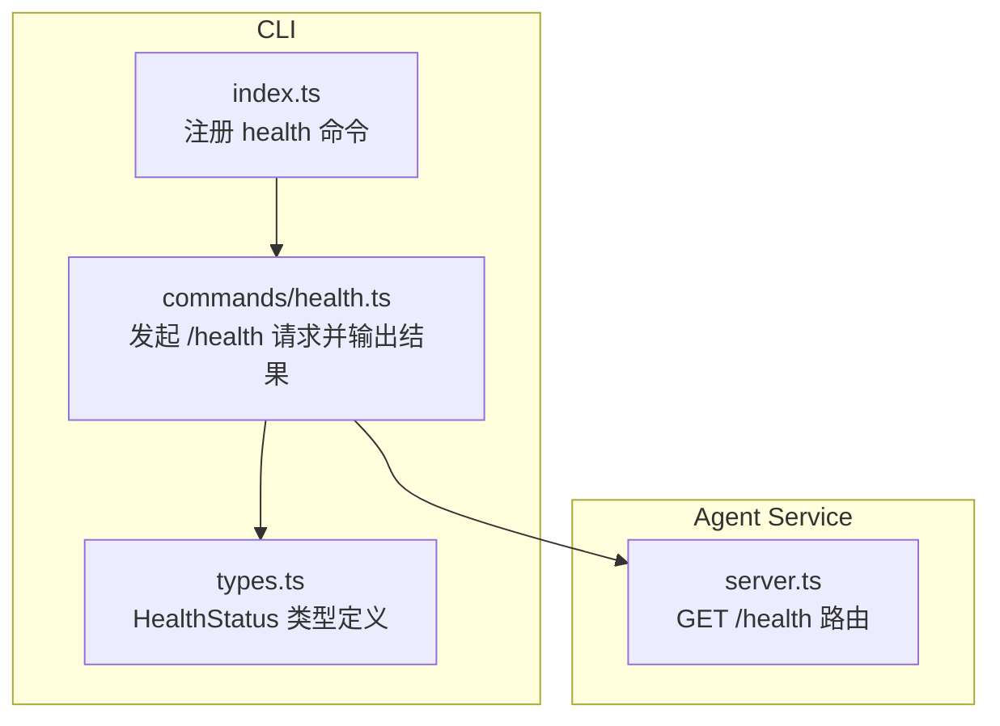
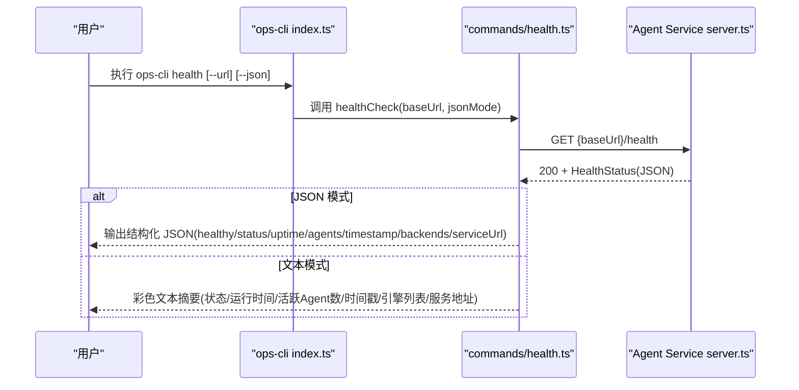
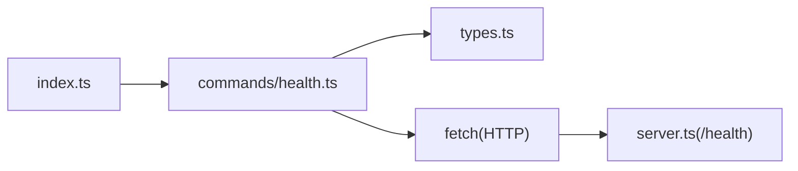
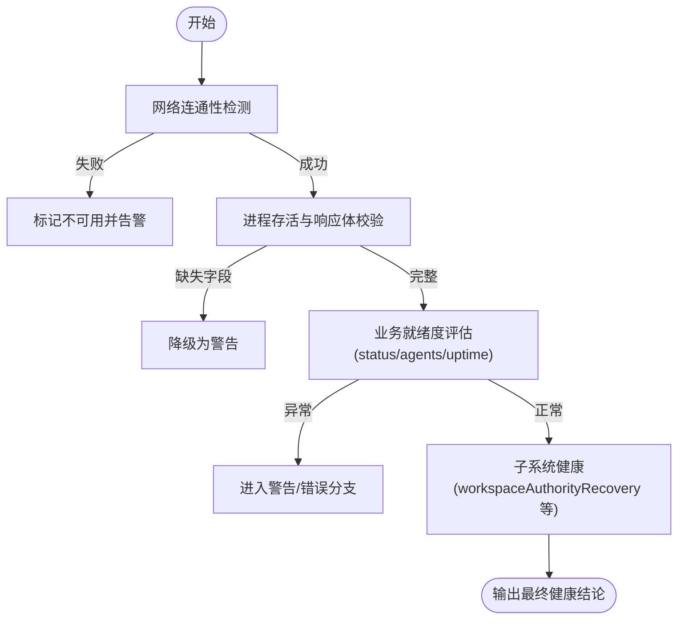

# 健康检查命令 (health)

<cite>
**本文引用的文件**   
- [OPS/CLI/src/index.ts](file://OPS/CLI/src/index.ts)
- [OPS/CLI/src/commands/health.ts](file://OPS/CLI/src/commands/health.ts)
- [OPS/CLI/src/types.ts](file://OPS/CLI/src/types.ts)
- [packages/agent-service/src/server.ts](file://packages/agent-service/src/server.ts)
- [packages/agent-client/src/client.ts](file://packages/agent-client/src/client.ts)
- [OPS/CLI/src/commands/system.ts](file://OPS/CLI/src/commands/system.ts)
- [OPS/CLI/src/commands/logs.ts](file://OPS/CLI/src/commands/logs.ts)
- [OPS/CLI/src/commands/diagnose.ts](file://OPS/CLI/src/commands/diagnose.ts)
</cite>

## 目录
1. [简介](#简介)
2. [项目结构](#项目结构)
3. [核心组件](#核心组件)
4. [架构总览](#架构总览)
5. [详细组件分析](#详细组件分析)
6. [依赖关系分析](#依赖关系分析)
7. [性能与可用性考量](#性能与可用性考量)
8. [故障排查指南](#故障排查指南)
9. [结论](#结论)
10. [附录](#附录)

## 简介
本文件围绕 health 命令，系统化说明服务健康检查机制：从基础网络连通性到应用层业务逻辑验证的层次化设计；健康状态的定义标准、阈值配置与告警建议；健康检查结果的解读方法（正常、警告、错误）；以及自定义健康检查扩展点与集成方式。该能力由 CLI 侧发起 HTTP 请求至 Agent Service 的 /health 端点，并基于返回的结构化数据输出人类可读或机器可解析的结果。

## 项目结构
health 命令位于 OPS CLI 中，通过命令行入口注册，调用具体实现函数，向 Agent Service 发起 /health 请求，并对响应进行格式化输出。Agent Service 在路由层暴露 /health 端点，返回服务运行态信息。

图表来源
- [OPS/CLI/src/index.ts:52-57](file://OPS/CLI/src/index.ts#L52-L57)
- [OPS/CLI/src/commands/health.ts:11-54](file://OPS/CLI/src/commands/health.ts#L11-L54)
- [OPS/CLI/src/types.ts:48-66](file://OPS/CLI/src/types.ts#L48-L66)
- [packages/agent-service/src/server.ts:88-95](file://packages/agent-service/src/server.ts#L88-L95)

章节来源
- [OPS/CLI/src/index.ts:26-57](file://OPS/CLI/src/index.ts#L26-L57)
- [packages/agent-service/src/server.ts:88-95](file://packages/agent-service/src/server.ts#L88-L95)

## 核心组件
- CLI 命令注册：在入口文件中将 health 命令绑定到 healthCheck 函数，支持全局 --url 和 --json 选项。
- 健康检查实现：构造目标 URL 为 {baseUrl}/health，发起 HTTP GET，处理成功与失败分支，分别输出 JSON 或彩色文本。
- 数据类型契约：HealthStatus 定义了服务端返回的核心字段，包括 status、timestamp、uptime、agents 等。
- 服务端端点：Agent Service 提供 GET /health，返回健康状态与运行时指标。

章节来源
- [OPS/CLI/src/index.ts:52-57](file://OPS/CLI/src/index.ts#L52-L57)
- [OPS/CLI/src/commands/health.ts:11-54](file://OPS/CLI/src/commands/health.ts#L11-L54)
- [OPS/CLI/src/types.ts:48-66](file://OPS/CLI/src/types.ts#L48-L66)
- [packages/agent-service/src/server.ts:88-95](file://packages/agent-service/src/server.ts#L88-L95)

## 架构总览
health 命令的整体交互流程如下：

图表来源
- [OPS/CLI/src/index.ts:52-57](file://OPS/CLI/src/index.ts#L52-L57)
- [OPS/CLI/src/commands/health.ts:17-65](file://OPS/CLI/src/commands/health.ts#L17-L65)
- [packages/agent-service/src/server.ts:88-95](file://packages/agent-service/src/server.ts#L88-L95)

## 详细组件分析

### 命令注册与参数
- 命令名：health
- 描述：检查 Agent Service 健康状态
- 全局选项：
  - --url <url>：Agent Service 地址（默认 http://localhost:3201）
  - --json：以 JSON 格式输出（供程序化解析）

章节来源
- [OPS/CLI/src/index.ts:28-37](file://OPS/CLI/src/index.ts#L28-L37)
- [OPS/CLI/src/index.ts:52-57](file://OPS/CLI/src/index.ts#L52-L57)

### 健康检查实现（CLI 侧）
- 行为要点
  - 拼接 URL：{baseUrl}/health
  - 非 2xx：JSON 模式输出 healthy=false/httpStatus/serviceUrl；文本模式输出错误提示并退出
  - 2xx：解析 JSON，按模式输出
    - JSON 模式：包含 healthy、status、uptime、activeAgents、timestamp、backends、serviceUrl
    - 文本模式：展示状态、运行时间、活跃 Agent 数量、时间戳、Agent 引擎列表、服务地址
  - 异常捕获：网络不可达时输出错误详情与可能原因，并提供启动命令参考

- 复杂度与性能
  - 单次 HTTP 请求，无重试与并发
  - 适合快速探测与脚本化集成

章节来源
- [OPS/CLI/src/commands/health.ts:11-89](file://OPS/CLI/src/commands/health.ts#L11-L89)

### 健康状态数据结构（类型契约）
- HealthStatus 关键字段
  - status：字符串，表示整体健康状态
  - timestamp：ISO 时间戳
  - uptime：秒级运行时长
  - agents：当前活跃 Agent 数量
  - workspaceAuthorityRecovery：可选对象，包含恢复过程的状态与统计（如 state、scannedWorkspaceCount、registeredWorkspaceCount、pendingTransactionCount、recoveredTransactionCount、rolledBackCount、committedCleanupCount、startedAt/completedAt、error 等）

- 其他相关类型
  - WorkspaceAuthorityHealthStatus：用于工作空间权限健康细项（队列深度、租约、准备计数、外部漂移、事件订阅者计数、备份/收据/Journal 条目等）

章节来源
- [OPS/CLI/src/types.ts:48-92](file://OPS/CLI/src/types.ts#L48-L92)

### 服务端端点（Agent Service）
- 路由：GET /health
- 职责：返回服务健康状态与运行时指标（如 status、uptime、agents、timestamp 等），并可携带 backends 列表（由 CLI 侧兼容读取）

章节来源
- [packages/agent-service/src/server.ts:88-95](file://packages/agent-service/src/server.ts#L88-L95)

### 与其他命令的协作
- system 命令：会主动调用 /health 以判断服务是否可用，并汇总系统环境信息
- logs 命令：在采集日志前尝试访问 /health，记录服务健康情况
- diagnose 命令：诊断流程中先校验 /health，若不可用则直接给出修复建议

章节来源
- [OPS/CLI/src/commands/system.ts:72-80](file://OPS/CLI/src/commands/system.ts#L72-L80)
- [OPS/CLI/src/commands/logs.ts:138-160](file://OPS/CLI/src/commands/logs.ts#L138-L160)
- [OPS/CLI/src/commands/diagnose.ts:75-102](file://OPS/CLI/src/commands/diagnose.ts#L75-L102)

### 客户端封装（agent-client）
- agent-client 亦提供对 /health 的调用封装，便于上层模块统一获取健康信息

章节来源
- [packages/agent-client/src/client.ts:190-195](file://packages/agent-client/src/client.ts#L190-L195)

## 依赖关系分析
- 耦合关系
  - CLI 命令层依赖 types.ts 的类型定义，确保与服务端返回结构一致
  - CLI 通过 fetch 直接访问 Agent Service 的 /health，不引入额外中间件
  - 其他运维命令复用 /health 作为前置可达性检查

- 外部依赖
  - Node.js fetch API
  - chalk（文本模式下的着色输出）
  - commander（CLI 框架）

图表来源
- [OPS/CLI/src/index.ts:52-57](file://OPS/CLI/src/index.ts#L52-L57)
- [OPS/CLI/src/commands/health.ts:11-54](file://OPS/CLI/src/commands/health.ts#L11-L54)
- [OPS/CLI/src/types.ts:48-66](file://OPS/CLI/src/types.ts#L48-L66)
- [packages/agent-service/src/server.ts:88-95](file://packages/agent-service/src/server.ts#L88-L95)

章节来源
- [OPS/CLI/src/index.ts:26-57](file://OPS/CLI/src/index.ts#L26-L57)
- [OPS/CLI/src/commands/health.ts:11-54](file://OPS/CLI/src/commands/health.ts#L11-L54)
- [packages/agent-service/src/server.ts:88-95](file://packages/agent-service/src/server.ts#L88-L95)

## 性能与可用性考量
- 延迟与吞吐
  - 单次短连接请求，开销主要来自网络往返与序列化
  - 建议在监控系统中周期性轮询，避免高频抖动
- 超时与重试
  - 当前实现未内置超时与重试策略，可在上层编排（如 systemd timer、cron、Prometheus blackbox）中补充
- 资源占用
  - 轻量级，几乎不占用本地 CPU/内存
- 可扩展性
  - 可通过 backends 字段了解后端引擎集合，便于分层健康评估

[本节为通用指导，无需代码引用]

## 故障排查指南
- 常见错误与定位
  - 无法连接：检查服务是否启动、端口是否正确、防火墙/代理是否放行
  - HTTP 非 2xx：查看返回状态码，确认服务内部错误或未就绪
  - JSON 解析失败：确认服务端返回结构与类型契约一致
- 辅助手段
  - 使用 --json 模式便于自动化解析与告警
  - 结合 system、logs、diagnose 命令进一步收集上下文
- 建议的阈值与告警（示例）
  - 可用性：连续 N 次 /health 失败触发告警
  - 运行时间：uptime 异常下降可能意味着重启
  - 活跃 Agent：agents 突降需关注会话管理或后端异常
  - 恢复阶段：workspaceAuthorityRecovery.state 处于 pending/recovering 且长时间未 ready 需预警

章节来源
- [OPS/CLI/src/commands/health.ts:21-89](file://OPS/CLI/src/commands/health.ts#L21-L89)
- [OPS/CLI/src/commands/system.ts:72-80](file://OPS/CLI/src/commands/system.ts#L72-L80)
- [OPS/CLI/src/commands/logs.ts:138-160](file://OPS/CLI/src/commands/logs.ts#L138-L160)
- [OPS/CLI/src/commands/diagnose.ts:75-102](file://OPS/CLI/src/commands/diagnose.ts#L75-L102)

## 结论
health 命令提供了简洁而可靠的服务健康探测能力，覆盖网络可达性与应用层基本指标。通过统一的类型契约与多模式输出，既满足人工巡检也便于自动化集成。建议在生产环境中配合监控系统与告警规则，形成闭环的健康治理体系。

[本节为总结性内容，无需代码引用]

## 附录

### 健康检查层次结构
- L1 网络连通性：HTTP GET /health 可达性
- L2 进程存活：返回 200 且包含必要字段
- L3 业务就绪：根据 status、agents、uptime 等指标判定
- L4 子系统健康：结合 workspaceAuthorityRecovery 与工作空间权限健康细项

[此图为概念性流程图，无需源码引用]

### 健康状态解读指南
- 正常
  - HTTP 200，healthy=true，status 指示就绪，agents>0，uptime 合理增长
- 警告
  - 字段存在但部分异常（如 agents 偏低、recovery 处于过渡态）
- 错误
  - HTTP 非 200、healthy=false、agents=0、recovery 长期失败或出现 error 字段

章节来源
- [OPS/CLI/src/types.ts:48-92](file://OPS/CLI/src/types.ts#L48-L92)
- [OPS/CLI/src/commands/health.ts:40-65](file://OPS/CLI/src/commands/health.ts#L40-L65)

### 自定义健康检查扩展点与集成方法
- 在服务端扩展
  - 在 /health 响应中增加自定义字段（例如 backends、featureFlags、依赖服务状态等），保持向后兼容
- 在 CLI 侧适配
  - 在 health.ts 中解析新增字段并按需输出或影响 healthy 判定
- 在监控系统中集成
  - 使用 --json 输出，结合 Prometheus blackbox exporter 或自研探针定时轮询
  - 设置阈值与持续失败次数触发告警
- 与其他命令联动
  - 在 system、logs、diagnose 中复用 /health 作为前置检查，提升诊断效率

章节来源
- [packages/agent-service/src/server.ts:88-95](file://packages/agent-service/src/server.ts#L88-L95)
- [OPS/CLI/src/commands/health.ts:40-65](file://OPS/CLI/src/commands/health.ts#L40-L65)
- [OPS/CLI/src/commands/system.ts:72-80](file://OPS/CLI/src/commands/system.ts#L72-L80)
- [OPS/CLI/src/commands/logs.ts:138-160](file://OPS/CLI/src/commands/logs.ts#L138-L160)
- [OPS/CLI/src/commands/diagnose.ts:75-102](file://OPS/CLI/src/commands/diagnose.ts#L75-L102)