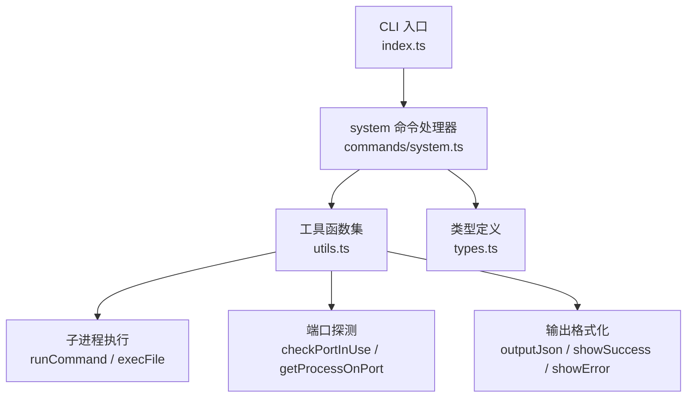
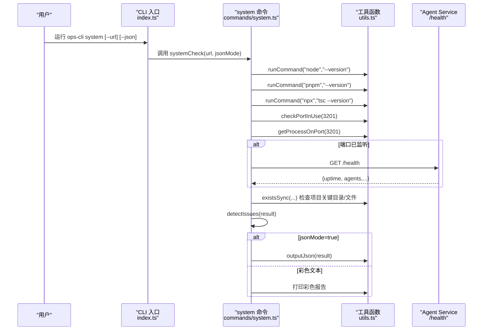
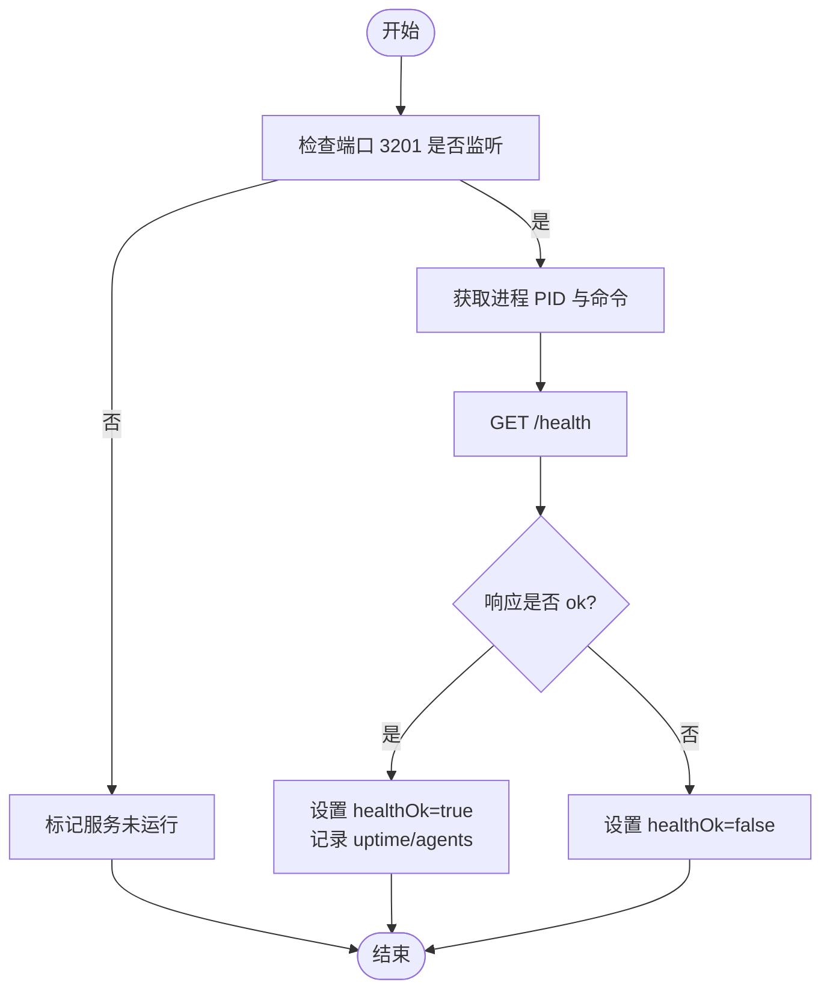
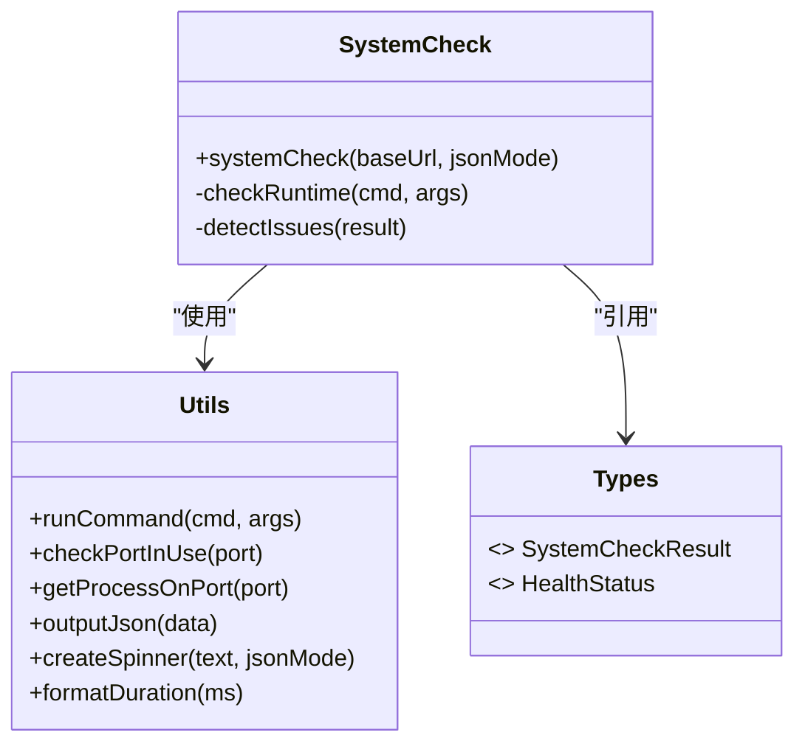

# 系统检查命令 (system)

<cite>
**本文引用的文件**
- [OPS/CLI/src/index.ts](file://OPS/CLI/src/index.ts)
- [OPS/CLI/src/commands/system.ts](file://OPS/CLI/src/commands/system.ts)
- [OPS/CLI/src/utils.ts](file://OPS/CLI/src/utils.ts)
- [OPS/CLI/src/types.ts](file://OPS/CLI/src/types.ts)
</cite>

## 目录
1. [简介](#简介)
2. [项目结构](#项目结构)
3. [核心组件](#核心组件)
4. [架构总览](#架构总览)
5. [详细组件分析](#详细组件分析)
6. [依赖关系分析](#依赖关系分析)
7. [性能与行为特征](#性能与行为特征)
8. [使用示例与参数说明](#使用示例与参数说明)
9. [常见问题识别与修复建议](#常见问题识别与修复建议)
10. [结论](#结论)

## 简介
本章节面向“系统检查命令 (system)”的一键环境诊断能力，覆盖运行时版本检查（Node.js、pnpm、TypeScript）、Agent Service 状态检测、端口监听验证以及项目结构完整性检查。文档将深入解释每个检测项的实现逻辑，包括进程信息获取、健康检查接口调用和文件系统存在性验证；并说明输出格式选项（JSON 模式与彩色文本模式），提供完整的使用示例与参数说明，同时总结常见问题识别机制与自动修复建议生成逻辑。

## 项目结构
system 命令位于 CLI 入口的 command 注册中，具体实现集中在 commands/system.ts，并通过 utils.ts 提供的工具函数完成跨平台进程与端口探测、子进程执行、结果输出等通用能力。类型定义集中于 types.ts，用于约束返回结果的结构。

图表来源
- [OPS/CLI/src/index.ts:42-47](file://OPS/CLI/src/index.ts#L42-L47)
- [OPS/CLI/src/commands/system.ts:1-250](file://OPS/CLI/src/commands/system.ts#L1-L250)
- [OPS/CLI/src/utils.ts:1-174](file://OPS/CLI/src/utils.ts#L1-L174)
- [OPS/CLI/src/types.ts:123-155](file://OPS/CLI/src/types.ts#L123-L155)

章节来源
- [OPS/CLI/src/index.ts:42-47](file://OPS/CLI/src/index.ts#L42-L47)
- [OPS/CLI/src/commands/system.ts:1-250](file://OPS/CLI/src/commands/system.ts#L1-L250)
- [OPS/CLI/src/utils.ts:1-174](file://OPS/CLI/src/utils.ts#L1-L174)
- [OPS/CLI/src/types.ts:123-155](file://OPS/CLI/src/types.ts#L123-L155)

## 核心组件
- systemCheck：系统检查主流程，负责收集运行时、服务、端口、项目结构等信息，并按模式输出。
- checkRuntime：通过子进程执行命令获取 Node.js、pnpm、TypeScript 的版本与可用性。
- detectIssues：基于检测结果汇总问题清单，辅助生成修复建议。
- 工具函数：
  - runCommand：跨平台执行外部命令并返回成功与否与标准输出。
  - checkPortInUse：跨平台判断端口是否被监听。
  - getProcessOnPort：跨平台获取占用端口的进程 PID 与命令名。
  - outputJson：以 JSON 格式输出结果。
  - createSpinner：在彩色模式下显示加载动画。
  - formatDuration：将毫秒转换为可读时长。

章节来源
- [OPS/CLI/src/commands/system.ts:22-217](file://OPS/CLI/src/commands/system.ts#L22-L217)
- [OPS/CLI/src/commands/system.ts:219-232](file://OPS/CLI/src/commands/system.ts#L219-L232)
- [OPS/CLI/src/commands/system.ts:234-249](file://OPS/CLI/src/commands/system.ts#L234-L249)
- [OPS/CLI/src/utils.ts:101-112](file://OPS/CLI/src/utils.ts#L101-L112)
- [OPS/CLI/src/utils.ts:114-133](file://OPS/CLI/src/utils.ts#L114-L133)
- [OPS/CLI/src/utils.ts:135-173](file://OPS/CLI/src/utils.ts#L135-L173)
- [OPS/CLI/src/utils.ts:48-50](file://OPS/CLI/src/utils.ts#L48-L50)
- [OPS/CLI/src/utils.ts:43-46](file://OPS/CLI/src/utils.ts#L43-L46)
- [OPS/CLI/src/utils.ts:92-99](file://OPS/CLI/src/utils.ts#L92-L99)

## 架构总览
system 命令的执行路径如下：CLI 入口解析全局参数（如 --url、--json）后，调用 systemCheck；systemCheck 依次执行运行时版本检查、端口监听检测、Agent Service 健康检查、项目结构校验，最后根据 jsonMode 选择输出方式或打印彩色文本报告，并汇总问题与建议。

图表来源
- [OPS/CLI/src/index.ts:42-47](file://OPS/CLI/src/index.ts#L42-L47)
- [OPS/CLI/src/commands/system.ts:22-217](file://OPS/CLI/src/commands/system.ts#L22-L217)
- [OPS/CLI/src/utils.ts:101-112](file://OPS/CLI/src/utils.ts#L101-L112)
- [OPS/CLI/src/utils.ts:114-133](file://OPS/CLI/src/utils.ts#L114-L133)
- [OPS/CLI/src/utils.ts:135-173](file://OPS/CLI/src/utils.ts#L135-L173)

## 详细组件分析

### 运行时版本检查（Node.js、pnpm、TypeScript）
- 实现逻辑：
  - 通过 runCommand 分别执行 node --version、pnpm --version、npx tsc --version。
  - 若命令成功且存在 stdout，则提取版本号并标记为可用；否则标记为不可用。
- 复杂度与边界：
  - 时间复杂度 O(1)，空间复杂度 O(1)。
  - 超时由 runCommand 内部设置（默认 10s），避免长时间阻塞。
  - 对 Windows 与非 Windows 平台的差异由底层 execFile 处理。
- 错误处理：
  - 命令失败时不抛异常，仅记录不可用，保证后续步骤继续执行。

章节来源
- [OPS/CLI/src/commands/system.ts:57-59](file://OPS/CLI/src/commands/system.ts#L57-L59)
- [OPS/CLI/src/commands/system.ts:219-232](file://OPS/CLI/src/commands/system.ts#L219-L232)
- [OPS/CLI/src/utils.ts:101-112](file://OPS/CLI/src/utils.ts#L101-L112)

### Agent Service 状态检测与健康检查
- 端口监听验证：
  - 使用 checkPortInUse 判断 3201 端口是否处于 LISTENING 状态。
  - 若监听，则通过 getProcessOnPort 获取 PID 与进程命令。
- 健康检查接口调用：
  - 当端口监听时，发起 HTTP GET 请求到 baseUrl + "/health"。
  - 若响应 ok，则从响应体中提取 uptime 与 agents 数量，标记 healthOk 为 true；否则标记 false。
- 异常处理：
  - 网络异常或响应非 ok 均视为健康检查失败，不影响整体流程。

图表来源
- [OPS/CLI/src/commands/system.ts:63-87](file://OPS/CLI/src/commands/system.ts#L63-L87)
- [OPS/CLI/src/utils.ts:114-133](file://OPS/CLI/src/utils.ts#L114-L133)
- [OPS/CLI/src/utils.ts:135-173](file://OPS/CLI/src/utils.ts#L135-L173)

章节来源
- [OPS/CLI/src/commands/system.ts:63-87](file://OPS/CLI/src/commands/system.ts#L63-L87)
- [OPS/CLI/src/utils.ts:114-133](file://OPS/CLI/src/utils.ts#L114-L133)
- [OPS/CLI/src/utils.ts:135-173](file://OPS/CLI/src/utils.ts#L135-L173)

### 端口监听验证
- 检查范围：
  - 固定检查 3201（Agent Service）与 3200（Author Site）。
- 实现逻辑：
  - 遍历 CHECK_PORTS，调用 checkPortInUse 与 getProcessOnPort，填充 ports 映射。
- 跨平台差异：
  - Windows 使用 netstat + tasklist；其他平台使用 lsof。

章节来源
- [OPS/CLI/src/commands/system.ts:89-96](file://OPS/CLI/src/commands/system.ts#L89-L96)
- [OPS/CLI/src/utils.ts:114-133](file://OPS/CLI/src/utils.ts#L114-L133)
- [OPS/CLI/src/utils.ts:135-173](file://OPS/CLI/src/utils.ts#L135-L173)

### 项目结构完整性检查
- 检查项：
  - package.json 是否存在
  - .env 或 .env.local 是否存在
  - packages/agent-service 目录是否存在
  - packages/author-site 目录是否存在
  - packages/shared 目录是否存在
- 实现逻辑：
  - 使用 existsSync 进行文件系统存在性验证，并将布尔结果写入 result.project。

章节来源
- [OPS/CLI/src/commands/system.ts:98-110](file://OPS/CLI/src/commands/system.ts#L98-L110)

### 输出格式选项（JSON 模式与彩色文本模式）
- JSON 模式：
  - 当启用 --json 时，直接输出结构化 JSON，便于程序化解析。
- 彩色文本模式：
  - 默认模式，使用 chalk 渲染彩色标题、状态与提示，包含运行时、服务、端口、项目结构与问题摘要。
- 交互体验：
  - 在非 JSON 模式下，使用 spinner 展示“正在收集系统环境信息...”的加载提示。

章节来源
- [OPS/CLI/src/commands/system.ts:114-216](file://OPS/CLI/src/commands/system.ts#L114-L216)
- [OPS/CLI/src/utils.ts:43-46](file://OPS/CLI/src/utils.ts#L43-L46)
- [OPS/CLI/src/utils.ts:48-50](file://OPS/CLI/src/utils.ts#L48-L50)

### 常见问题识别与修复建议生成逻辑
- 问题识别：
  - 检测 Node.js/pnpm 是否安装
  - 检测 Agent Service 是否运行与健康状态
  - 检测项目根目录缺少 package.json 或缺少 agent-service 包目录
- 修复建议：
  - 当服务未运行时，提示启动命令 pnpm dev:agent
  - 当健康检查失败时，提示服务异常需排查
  - 当缺失必要文件或目录时，给出相应补全建议

章节来源
- [OPS/CLI/src/commands/system.ts:234-249](file://OPS/CLI/src/commands/system.ts#L234-L249)
- [OPS/CLI/src/commands/system.ts:160-164](file://OPS/CLI/src/commands/system.ts#L160-L164)

## 依赖关系分析
- 模块耦合：
  - system.ts 依赖 utils.ts 的工具函数与 types.ts 的类型定义。
  - index.ts 作为 CLI 入口，注册 system 命令并传递全局参数。
- 外部依赖：
  - 子进程执行依赖操作系统命令（netstat/lsof/tasklist）。
  - 健康检查依赖 Agent Service 暴露的 /health 接口。

图表来源
- [OPS/CLI/src/commands/system.ts:22-249](file://OPS/CLI/src/commands/system.ts#L22-L249)
- [OPS/CLI/src/utils.ts:101-173](file://OPS/CLI/src/utils.ts#L101-L173)
- [OPS/CLI/src/types.ts:123-155](file://OPS/CLI/src/types.ts#L123-L155)
- [OPS/CLI/src/types.ts:48-66](file://OPS/CLI/src/types.ts#L48-L66)

章节来源
- [OPS/CLI/src/index.ts:42-47](file://OPS/CLI/src/index.ts#L42-L47)
- [OPS/CLI/src/commands/system.ts:22-249](file://OPS/CLI/src/commands/system.ts#L22-L249)
- [OPS/CLI/src/utils.ts:101-173](file://OPS/CLI/src/utils.ts#L101-L173)
- [OPS/CLI/src/types.ts:123-155](file://OPS/CLI/src/types.ts#L123-L155)

## 性能与行为特征
- 并发与顺序：
  - 运行时版本检查串行执行，避免并行带来的资源竞争。
  - 端口检查与进程查询串行，确保结果一致性。
- 超时控制：
  - 子进程执行默认 10s 超时，防止卡死。
- I/O 开销：
  - 健康检查为单次 HTTP 请求，开销较小。
  - 文件系统检查为同步存在性判断，开销极低。
- 可观测性：
  - 彩色模式下提供 spinner 与结构化输出，便于快速定位问题。

[本节为一般性指导，无需列出具体文件来源]

## 使用示例与参数说明

### 全局参数
- --url <url>：Agent Service 地址，默认 http://localhost:3201
- --json：以 JSON 格式输出（供程序化解析）

章节来源
- [OPS/CLI/src/index.ts:32-33](file://OPS/CLI/src/index.ts#L32-L33)

### 命令用法
- 基本用法：ops-cli system
- 指定服务地址：ops-cli system --url http://your-host:3201
- JSON 输出：ops-cli system --json

章节来源
- [OPS/CLI/src/index.ts:42-47](file://OPS/CLI/src/index.ts#L42-L47)

### 输出字段说明（JSON 模式）
- timestamp：诊断时间戳
- runtime.node/pnpm/typescript：各运行时版本与可用性
- agentService.running/port/pid/processCommand/healthOk/uptime/activeAgents/backends：服务状态与健康信息
- cliBackends：外部后端可用性（当前为空对象）
- project.rootDir/packageJsonExists/envFileExists/agentServiceDir/webDir/sharedDir：项目结构检查结果
- ports.[port].inUse/process：端口占用情况

章节来源
- [OPS/CLI/src/types.ts:123-155](file://OPS/CLI/src/types.ts#L123-L155)

## 常见问题识别与修复建议

- Node.js 未安装或不在 PATH 中
  - 现象：runtime.node.available 为 false
  - 建议：安装 Node.js 并确保加入 PATH
- pnpm 未安装或不在 PATH 中
  - 现象：runtime.pnpm.available 为 false
  - 建议：安装 pnpm 并确保加入 PATH
- TypeScript 未安装或不在 PATH 中
  - 现象：runtime.typescript.available 为 false
  - 建议：安装 TypeScript 或通过 npx 可用
- Agent Service 未运行（端口 3201 未监听）
  - 现象：agentService.running 为 false
  - 建议：执行启动命令 pnpm dev:agent
- Agent Service 运行中但健康检查失败
  - 现象：agentService.healthOk 为 false
  - 建议：检查服务日志与配置，确认 /health 接口正常
- 项目根目录缺少 package.json
  - 现象：project.packageJsonExists 为 false
  - 建议：初始化项目或恢复 package.json
- 缺少 agent-service 包目录
  - 现象：project.agentServiceDir 为 false
  - 建议：拉取或恢复 packages/agent-service 目录

章节来源
- [OPS/CLI/src/commands/system.ts:234-249](file://OPS/CLI/src/commands/system.ts#L234-L249)
- [OPS/CLI/src/commands/system.ts:160-164](file://OPS/CLI/src/commands/system.ts#L160-L164)

## 结论
system 命令提供了高效、可靠的一键环境诊断能力，覆盖运行时、服务、端口与项目结构的关键维度。其实现采用清晰的模块化设计，借助跨平台工具函数完成进程与端口探测，结合健康检查接口与服务状态聚合，形成完整的诊断闭环。配合 JSON 与彩色文本两种输出模式，既适合人工快速排障，也便于自动化集成。常见问题识别与修复建议进一步提升了用户体验与运维效率。