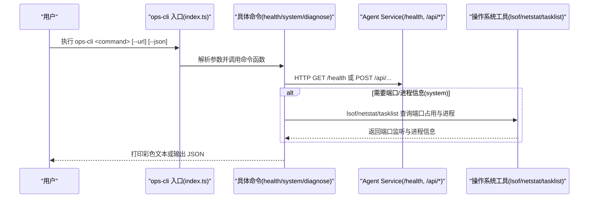
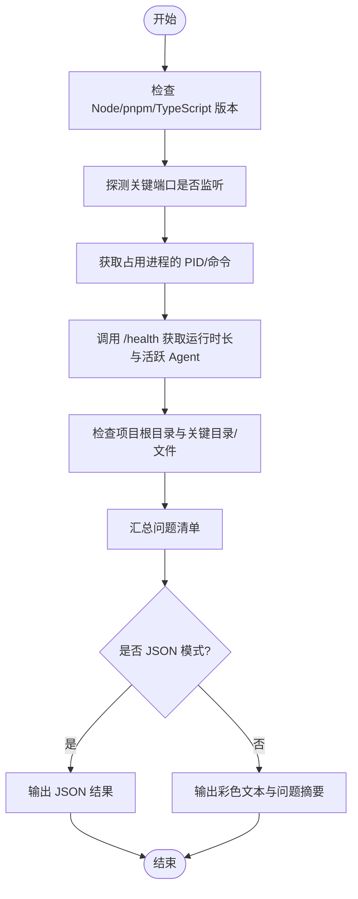
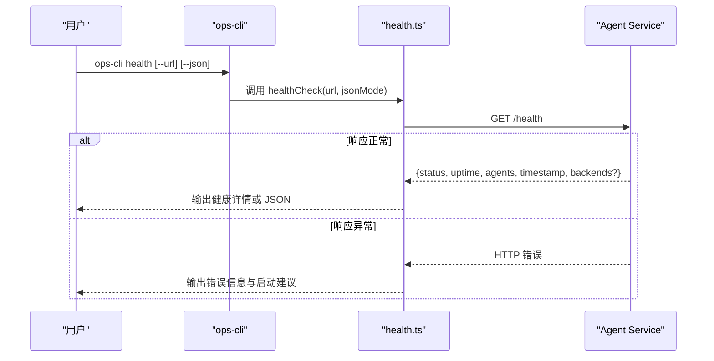
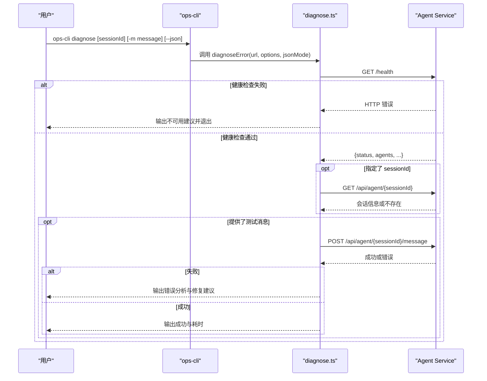
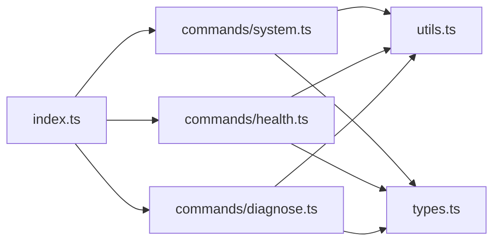

# 系统诊断命令

<cite>
**本文引用的文件**
- [index.ts](file://OPS/CLI/src/index.ts)
- [system.ts](file://OPS/CLI/src/commands/system.ts)
- [health.ts](file://OPS/CLI/src/commands/health.ts)
- [diagnose.ts](file://OPS/CLI/src/commands/diagnose.ts)
- [utils.ts](file://OPS/CLI/src/utils.ts)
- [types.ts](file://OPS/CLI/src/types.ts)
</cite>

## 目录
1. [简介](#简介)
2. [项目结构](#项目结构)
3. [核心组件](#核心组件)
4. [架构总览](#架构总览)
5. [详细组件分析](#详细组件分析)
6. [依赖关系分析](#依赖关系分析)
7. [性能与可用性考量](#性能与可用性考量)
8. [故障排查指南](#故障排查指南)
9. [结论](#结论)

## 简介
本文件面向运维与开发者，系统化说明 CLI 工具中的三大诊断命令：
- system：一键环境诊断（运行时版本、服务状态、端口监听验证、后端可用性）
- health：健康检查（依赖服务可达性与基础指标）
- diagnose：错误诊断（会话问题分析、失败原因识别、修复建议生成）

每个命令均支持人类可读输出与 JSON 模式输出，便于人工查看与程序化集成。

## 项目结构
与诊断相关的代码集中在 OPS/CLI 子包中，入口通过命令行框架注册各子命令，具体实现位于 commands 目录下，通用能力封装在 utils 与 types 中。

```mermaid
graph TB
A["入口 index.ts<br/>注册 system/health/diagnose 等命令"] --> B["commands/system.ts<br/>系统环境诊断"]
A --> C["commands/health.ts<br/>健康检查"]
A --> D["commands/diagnose.ts<br/>错误诊断"]
B --> E["utils.ts<br/>网络/进程/格式化等工具"]
C --> E
D --> E
B --> F["types.ts<br/>类型定义"]
C --> F
D --> F
```

图示来源
- [index.ts:28-60](file://OPS/CLI/src/index.ts#L28-L60)
- [system.ts:1-20](file://OPS/CLI/src/commands/system.ts#L1-L20)
- [health.ts:1-20](file://OPS/CLI/src/commands/health.ts#L1-L20)
- [diagnose.ts:1-20](file://OPS/CLI/src/commands/diagnose.ts#L1-L20)
- [utils.ts:1-20](file://OPS/CLI/src/utils.ts#L1-L20)
- [types.ts:1-20](file://OPS/CLI/src/types.ts#L1-L20)

章节来源
- [index.ts:28-60](file://OPS/CLI/src/index.ts#L28-L60)

## 核心组件
- system 命令
  - 功能：检测 Node.js/pnpm/TypeScript 运行时版本；探测 Agent Service 是否运行并调用 /health 获取运行时长与活跃 Agent 数；检查关键端口占用情况；校验项目根目录结构与必要文件存在性；汇总问题清单。
  - 输出：结构化结果对象，包含 timestamp、runtime、agentService、ports、project 等字段。
- health 命令
  - 功能：直接访问 /health 接口，返回服务状态、运行时间、活跃 Agent 数量、时间戳及可选的 backends 列表。
  - 输出：JSON 或彩色文本，异常时给出常见原因与启动提示。
- diagnose 命令
  - 功能：先检查服务健康，再按需提供会话信息查询与测试消息发送；对失败进行错误码/信息匹配，输出问题定位、可能原因与解决方案。
  - 输出：包含 health/session/testMessage/analysis 的结构化报告。

章节来源
- [system.ts:22-117](file://OPS/CLI/src/commands/system.ts#L22-L117)
- [health.ts:11-54](file://OPS/CLI/src/commands/health.ts#L11-L54)
- [diagnose.ts:44-124](file://OPS/CLI/src/commands/diagnose.ts#L44-L124)

## 架构总览
三个命令共享统一的请求与展示工具，并通过全局选项 --url 指定目标服务地址，--json 切换输出格式。

图示来源
- [index.ts:28-60](file://OPS/CLI/src/index.ts#L28-L60)
- [health.ts:11-54](file://OPS/CLI/src/commands/health.ts#L11-L54)
- [system.ts:22-117](file://OPS/CLI/src/commands/system.ts#L22-L117)
- [utils.ts:114-173](file://OPS/CLI/src/utils.ts#L114-L173)

## 详细组件分析

### system 命令：一键环境诊断
- 能力要点
  - 运行时版本检查：Node.js、pnpm、TypeScript（通过 npx tsc）。
  - 服务状态检测：探测端口监听、获取 PID/进程命令、调用 /health 获取 uptime 与 agents。
  - 端口监听验证：检查关键端口（默认 agent-service 与 author-site）是否被占用，并显示对应进程。
  - 后端可用性测试：当前为单后端架构，不再检查多后端状态。
  - 项目结构校验：package.json、.env/.env.local、packages/agent-service、packages/author-site、packages/shared 是否存在。
  - 问题发现：汇总缺失运行时、服务未运行、健康检查失败、关键目录缺失等问题。
- 参数与用法
  - 全局选项
    - -u, --url <url>：Agent Service 地址，默认 http://localhost:3201
    - --json：以 JSON 格式输出
  - 示例
    - 基本使用：ops-cli system
    - 指定服务地址：ops-cli system --url http://127.0.0.1:3201
    - JSON 输出：ops-cli system --json
- 输出格式
  - JSON 模式：输出 SystemCheckResult 对象，包含 timestamp、runtime、agentService、cliBackends、project、ports 等字段。
  - 文本模式：分区块展示运行时、Agent Service、端口状态、项目结构，并在末尾列出发现的问题。
- 流程图（系统诊断主流程）

图示来源
- [system.ts:22-117](file://OPS/CLI/src/commands/system.ts#L22-L117)
- [system.ts:219-249](file://OPS/CLI/src/commands/system.ts#L219-L249)
- [utils.ts:114-173](file://OPS/CLI/src/utils.ts#L114-L173)

章节来源
- [system.ts:22-117](file://OPS/CLI/src/commands/system.ts#L22-L117)
- [system.ts:219-249](file://OPS/CLI/src/commands/system.ts#L219-L249)
- [utils.ts:114-173](file://OPS/CLI/src/utils.ts#L114-L173)
- [types.ts:123-155](file://OPS/CLI/src/types.ts#L123-L155)

### health 命令：健康检查
- 能力要点
  - 直接访问 /health 接口，返回 status、uptime、agents、timestamp 以及可选的 backends。
  - 非 JSON 模式下提供友好提示与常见失败原因。
- 参数与用法
  - 全局选项
    - -u, --url <url>：Agent Service 地址，默认 http://localhost:3201
    - --json：以 JSON 格式输出
  - 示例
    - 基本使用：ops-cli health
    - 指定服务地址：ops-cli health --url http://127.0.0.1:3201
    - JSON 输出：ops-cli health --json
- 输出格式
  - JSON 模式：healthy、status、uptime、activeAgents、timestamp、backends、serviceUrl 等字段。
  - 文本模式：成功时展示详细信息；失败时输出 HTTP 状态码与服务地址，并给出启动建议。
- 序列图（健康检查流程）

图示来源
- [health.ts:11-54](file://OPS/CLI/src/commands/health.ts#L11-L54)
- [health.ts:66-89](file://OPS/CLI/src/commands/health.ts#L66-L89)

章节来源
- [health.ts:11-54](file://OPS/CLI/src/commands/health.ts#L11-L54)
- [health.ts:66-89](file://OPS/CLI/src/commands/health.ts#L66-L89)
- [types.ts:48-66](file://OPS/CLI/src/types.ts#L48-L66)

### diagnose 命令：错误诊断
- 能力要点
  - 步骤一：检查服务健康（/health），若不可用则直接给出建议。
  - 步骤二（可选）：查询指定 sessionId 的会话信息（状态、后端、消息数、工作目录）。
  - 步骤三（可选）：发送测试消息到 /api/agent/{sessionId}/message，记录耗时与回复长度。
  - 步骤四：根据错误码/信息进行问题定位，输出“问题-可能原因-解决方案”。
- 参数与用法
  - 全局选项
    - -u, --url <url>：Agent Service 地址，默认 http://localhost:3201
    - --json：以 JSON 格式输出
  - 命令选项
    - -m, --message <message>：发送测试消息进行诊断
  - 示例
    - 仅检查服务：ops-cli diagnose
    - 指定会话：ops-cli diagnose abc123
    - 发送测试消息：ops-cli diagnose abc123 --message "你好，请回复"
    - JSON 输出：ops-cli diagnose --json
- 输出格式
  - JSON 模式：包含 timestamp、serviceUrl、health、session、testMessage、analysis 等字段。
  - 文本模式：逐步展示检查结果，失败时输出错误分析与可操作建议。
- 序列图（错误诊断流程）

图示来源
- [diagnose.ts:44-124](file://OPS/CLI/src/commands/diagnose.ts#L44-L124)
- [diagnose.ts:126-177](file://OPS/CLI/src/commands/diagnose.ts#L126-L177)
- [diagnose.ts:179-283](file://OPS/CLI/src/commands/diagnose.ts#L179-L283)
- [diagnose.ts:285-371](file://OPS/CLI/src/commands/diagnose.ts#L285-L371)

章节来源
- [diagnose.ts:44-124](file://OPS/CLI/src/commands/diagnose.ts#L44-L124)
- [diagnose.ts:126-177](file://OPS/CLI/src/commands/diagnose.ts#L126-L177)
- [diagnose.ts:179-283](file://OPS/CLI/src/commands/diagnose.ts#L179-L283)
- [diagnose.ts:285-371](file://OPS/CLI/src/commands/diagnose.ts#L285-L371)
- [types.ts:118-121](file://OPS/CLI/src/types.ts#L118-L121)

## 依赖关系分析
- 入口层
  - index.ts 使用 commander 注册 system、health、diagnose 等命令，统一处理 --url 与 --json 全局选项。
- 命令层
  - system.ts：组合运行时检查、端口探测、进程查询、HTTP 健康检查与项目结构校验。
  - health.ts：聚焦 /health 接口的读取与展示。
  - diagnose.ts：串联健康检查、会话查询、消息发送与错误分析。
- 工具层
  - utils.ts：提供 request、createSpinner、outputJson、showSuccess/showError/showWarning/showInfo、formatDuration、runCommand、checkPortInUse、getProcessOnPort 等。
- 类型层
  - types.ts：定义 ApiResponse、HealthStatus、SystemCheckResult、DiagnoseOptions 等。

图示来源
- [index.ts:28-60](file://OPS/CLI/src/index.ts#L28-L60)
- [system.ts:1-20](file://OPS/CLI/src/commands/system.ts#L1-L20)
- [health.ts:1-20](file://OPS/CLI/src/commands/health.ts#L1-L20)
- [diagnose.ts:1-20](file://OPS/CLI/src/commands/diagnose.ts#L1-L20)
- [utils.ts:1-20](file://OPS/CLI/src/utils.ts#L1-L20)
- [types.ts:1-20](file://OPS/CLI/src/types.ts#L1-L20)

章节来源
- [index.ts:28-60](file://OPS/CLI/src/index.ts#L28-L60)
- [utils.ts:1-20](file://OPS/CLI/src/utils.ts#L1-L20)
- [types.ts:1-20](file://OPS/CLI/src/types.ts#L1-L20)

## 性能与可用性考量
- 并发与超时
  - 端口探测与进程查询通过外部命令执行，设置超时以避免阻塞。
  - HTTP 请求采用 fetch，建议在大规模自动化场景下结合重试与超时策略。
- 输出效率
  - JSON 模式避免额外格式化开销，适合流水线集成。
  - 文本模式使用 spinner 提升交互体验，但在脚本中应优先使用 JSON。
- 资源占用
  - 本地端口探测依赖系统工具（lsof/netstat/tasklist），在高负载环境下可能略有延迟。

[本节为通用指导，不直接分析具体文件]

## 故障排查指南
- 常见问题与快速定位
  - 服务未启动或地址错误
    - 现象：health 返回 HTTP 错误或无法连接。
    - 处理：确认服务已启动，核对 --url 参数；参考 health 输出的启动命令提示。
  - 端口被占用
    - 现象：system 显示端口空闲但服务不可达，或被其他进程占用。
    - 处理：使用 system 输出中的进程信息定位占用者，必要时释放端口或调整服务端口。
  - 运行时缺失
    - 现象：system 报告 Node.js/pnpm/TypeScript 未安装。
    - 处理：安装对应运行时并确保 PATH 正确。
  - 会话不存在或初始化失败
    - 现象：diagnose 报 SESSION_NOT_FOUND 或 No active session。
    - 处理：使用新的 sessionId 重试，或通过 stream 创建新会话。
  - 服务器内部错误
    - 现象：INTERNAL_ERROR。
    - 处理：查看服务端日志，重启服务，简化测试消息，检查系统资源。
- 推荐排查流程
  - 第一步：ops-cli health --json 确认服务可达与基础指标。
  - 第二步：ops-cli system --json 收集环境与端口信息。
  - 第三步：ops-cli diagnose --message "简短测试" 触发端到端路径验证与错误分析。
  - 第四步：根据 analyze 的建议逐项修复，必要时采集日志进一步定位。

章节来源
- [health.ts:66-89](file://OPS/CLI/src/commands/health.ts#L66-L89)
- [system.ts:234-249](file://OPS/CLI/src/commands/system.ts#L234-L249)
- [diagnose.ts:285-371](file://OPS/CLI/src/commands/diagnose.ts#L285-L371)

## 结论
- system 提供“从环境到服务”的一站式自检，适合部署前与巡检时使用。
- health 专注于服务可达性与基础指标，适合作为监控探针。
- diagnose 将健康检查、会话信息与端到端消息打通，并给出可操作的修复建议，适合问题复现与排障。
- 三者配合 --json 输出，可无缝接入 CI/CD 与自动化运维体系。