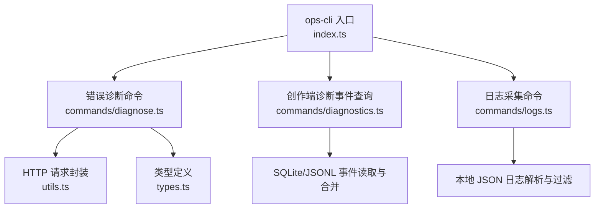
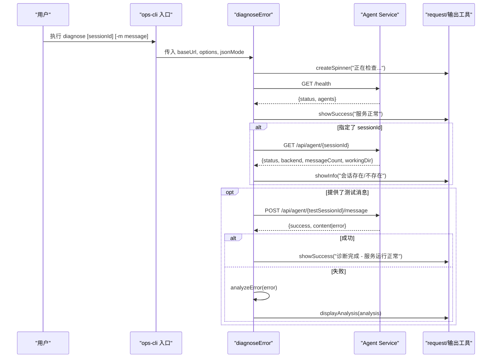
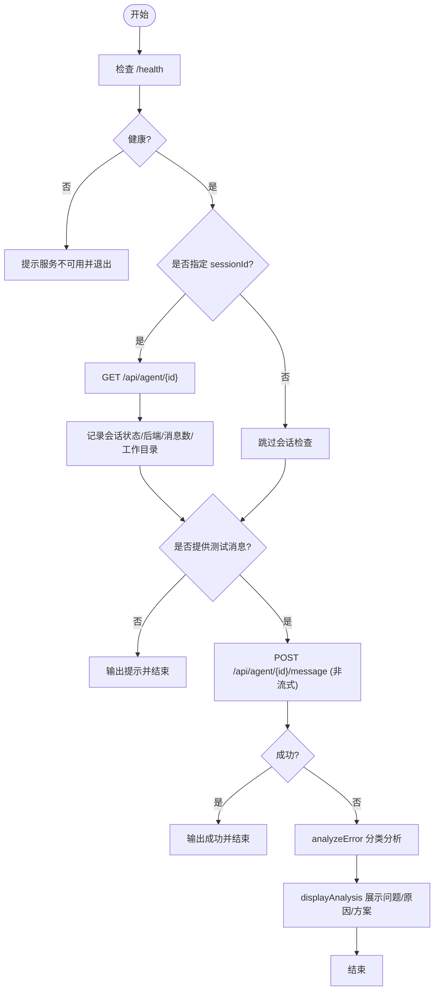
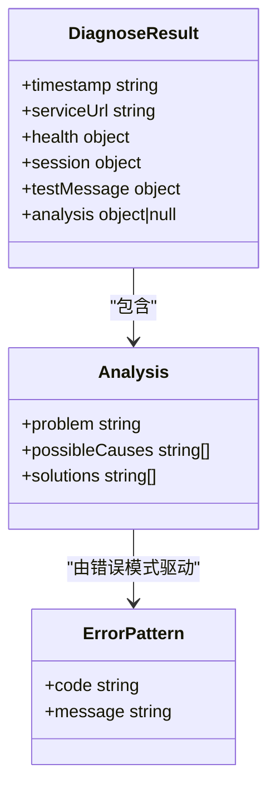
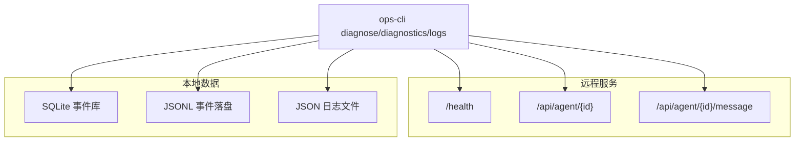
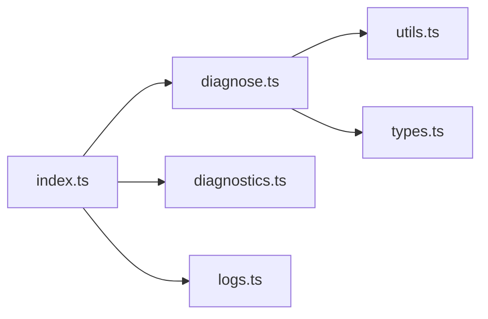

# 错误诊断命令 (diagnose)

<cite>
**本文引用的文件**   
- [OPS/CLI/src/index.ts](file://OPS/CLI/src/index.ts)
- [OPS/CLI/src/commands/diagnose.ts](file://OPS/CLI/src/commands/diagnose.ts)
- [OPS/CLI/src/types.ts](file://OPS/CLI/src/types.ts)
- [OPS/CLI/src/utils.ts](file://OPS/CLI/src/utils.ts)
- [OPS/CLI/src/commands/diagnostics.ts](file://OPS/CLI/src/commands/diagnostics.ts)
- [OPS/CLI/src/commands/logs.ts](file://OPS/CLI/src/commands/logs.ts)
- [packages/author-site/src/components/ai-elements/chat/hooks/use-chat-stream.ts](file://packages/author-site/src/components/ai-elements/chat/hooks/use-chat-stream.ts)
</cite>

## 目录
1. [简介](#简介)
2. [项目结构](#项目结构)
3. [核心组件](#核心组件)
4. [架构总览](#架构总览)
5. [详细组件分析](#详细组件分析)
6. [依赖关系分析](#依赖关系分析)
7. [性能与可扩展性](#性能与可扩展性)
8. [故障排查指南](#故障排查指南)
9. [结论](#结论)
10. [附录](#附录)

## 简介
本文件围绕 CLI 的 diagnose 命令，系统化说明其智能错误诊断能力、工作原理、支持的诊断场景、报告解读方法与自动化修复流程，并给出自定义诊断规则的配置与扩展建议。该命令用于快速定位 AI 对话失败、预览渲染异常、文件同步问题等典型问题的根因，并提供可执行的修复建议。

## 项目结构
diagnose 命令位于 OPS/CLI 子项目中，入口注册在 index.ts，具体实现位于 commands/diagnose.ts，类型定义在 types.ts，通用工具函数在 utils.ts。与之配套的“创作端诊断事件查询”命令 diagnostics 提供结构化事件检索与分析，logs 命令支持日志采集与过滤。

图示来源
- [OPS/CLI/src/index.ts:149-162](file://OPS/CLI/src/index.ts#L149-L162)
- [OPS/CLI/src/commands/diagnose.ts:44-72](file://OPS/CLI/src/commands/diagnose.ts#L44-L72)
- [OPS/CLI/src/utils.ts:5-41](file://OPS/CLI/src/utils.ts#L5-L41)
- [OPS/CLI/src/commands/diagnostics.ts:659-707](file://OPS/CLI/src/commands/diagnostics.ts#L659-L707)
- [OPS/CLI/src/commands/logs.ts:96-136](file://OPS/CLI/src/commands/logs.ts#L96-L136)

章节来源
- [OPS/CLI/src/index.ts:149-162](file://OPS/CLI/src/index.ts#L149-L162)
- [OPS/CLI/src/commands/diagnose.ts:44-72](file://OPS/CLI/src/commands/diagnose.ts#L44-L72)
- [OPS/CLI/src/utils.ts:5-41](file://OPS/CLI/src/utils.ts#L5-L41)
- [OPS/CLI/src/commands/diagnostics.ts:659-707](file://OPS/CLI/src/commands/diagnostics.ts#L659-L707)
- [OPS/CLI/src/commands/logs.ts:96-136](file://OPS/CLI/src/commands/logs.ts#L96-L136)

## 核心组件
- 诊断主流程：健康检查 → 会话信息校验 → 可选发送测试消息 → 错误分析与建议输出。
- 错误模式匹配：基于服务端返回的错误码与消息片段进行规则化分类，生成问题描述、可能原因与解决方案。
- 结果输出：支持文本与 JSON 两种格式，便于人类阅读与程序化处理。
- 配套能力：通过 diagnostics 命令拉取结构化事件（SQLite/JSONL），结合 logs 命令过滤日志，形成端到端诊断闭环。

章节来源
- [OPS/CLI/src/commands/diagnose.ts:44-283](file://OPS/CLI/src/commands/diagnose.ts#L44-L283)
- [OPS/CLI/src/commands/diagnose.ts:285-371](file://OPS/CLI/src/commands/diagnose.ts#L285-L371)
- [OPS/CLI/src/commands/diagnostics.ts:659-707](file://OPS/CLI/src/commands/diagnostics.ts#L659-L707)
- [OPS/CLI/src/commands/logs.ts:96-136](file://OPS/CLI/src/commands/logs.ts#L96-L136)

## 架构总览
diagnose 命令作为编排器，依次调用 Agent Service 的健康接口与会话接口，并在需要时发送一条非流式测试消息以触发后端处理链路，从而捕获真实运行时的错误路径。

图示来源
- [OPS/CLI/src/index.ts:149-162](file://OPS/CLI/src/index.ts#L149-L162)
- [OPS/CLI/src/commands/diagnose.ts:75-124](file://OPS/CLI/src/commands/diagnose.ts#L75-L124)
- [OPS/CLI/src/commands/diagnose.ts:126-177](file://OPS/CLI/src/commands/diagnose.ts#L126-L177)
- [OPS/CLI/src/commands/diagnose.ts:179-283](file://OPS/CLI/src/commands/diagnose.ts#L179-L283)
- [OPS/CLI/src/utils.ts:5-41](file://OPS/CLI/src/utils.ts#L5-L41)

## 详细组件分析

### 诊断引擎工作流程
- 健康检查：访问 /health，若不可用直接提示启动 agent-service 并退出。
- 会话校验：若提供 sessionId，则查询 /api/agent/{id}，记录状态、后端、消息数与工作目录。
- 测试消息：若提供 --message，则以非流式方式发送，记录耗时与回复长度；失败时进入错误分析。
- 错误分析：根据错误码与消息片段进行分类，输出问题、可能原因与解决方案。
- 输出控制：jsonMode 下仅输出 JSON，否则打印彩色文本与步骤提示。

图示来源
- [OPS/CLI/src/commands/diagnose.ts:75-124](file://OPS/CLI/src/commands/diagnose.ts#L75-L124)
- [OPS/CLI/src/commands/diagnose.ts:126-177](file://OPS/CLI/src/commands/diagnose.ts#L126-L177)
- [OPS/CLI/src/commands/diagnose.ts:179-283](file://OPS/CLI/src/commands/diagnose.ts#L179-L283)
- [OPS/CLI/src/commands/diagnose.ts:285-371](file://OPS/CLI/src/commands/diagnose.ts#L285-L371)

章节来源
- [OPS/CLI/src/commands/diagnose.ts:44-283](file://OPS/CLI/src/commands/diagnose.ts#L44-L283)
- [OPS/CLI/src/commands/diagnose.ts:285-371](file://OPS/CLI/src/commands/diagnose.ts#L285-L371)

### 错误模式匹配与修复建议
- 已覆盖的典型错误模式包括：
  - 会话未初始化或失效（如包含特定消息片段）
  - 服务器内部错误（INTERNAL_ERROR）
  - 连接被拒绝（ECONNREFUSED）
  - 会话不存在（SESSION_NOT_FOUND）
- 每种模式均提供：
  - 问题描述
  - 可能原因列表
  - 可操作的解决方案（含后续命令建议）

图示来源
- [OPS/CLI/src/commands/diagnose.ts:13-42](file://OPS/CLI/src/commands/diagnose.ts#L13-L42)
- [OPS/CLI/src/commands/diagnose.ts:285-356](file://OPS/CLI/src/commands/diagnose.ts#L285-L356)

章节来源
- [OPS/CLI/src/commands/diagnose.ts:285-356](file://OPS/CLI/src/commands/diagnose.ts#L285-L356)

### 诊断数据源与上下文收集
- 远程服务侧：通过 /health 与 /api/agent/* 获取运行时状态与会话元信息。
- 本地事件库：diagnostics 命令从 SQLite 主账本与 JSONL 兜底中读取结构化事件，按 kind 聚合，支持 trace/operation/session/project 等维度过滤与合并。
- 本地日志：logs 命令对 JSON 日志进行级别过滤、关键字搜索与会话关联。

图示来源
- [OPS/CLI/src/commands/diagnose.ts:75-124](file://OPS/CLI/src/commands/diagnose.ts#L75-L124)
- [OPS/CLI/src/commands/diagnostics.ts:659-707](file://OPS/CLI/src/commands/diagnostics.ts#L659-L707)
- [OPS/CLI/src/commands/logs.ts:96-136](file://OPS/CLI/src/commands/logs.ts#L96-L136)

章节来源
- [OPS/CLI/src/commands/diagnostics.ts:659-707](file://OPS/CLI/src/commands/diagnostics.ts#L659-L707)
- [OPS/CLI/src/commands/logs.ts:96-136](file://OPS/CLI/src/commands/logs.ts#L96-L136)

### 支持的诊断场景
- AI 对话失败：通过发送测试消息触发完整链路，捕获错误码与消息，结合 analyzeError 分类输出。
- 预览渲染异常：借助 diagnostics 的 preview 类事件与 workspace flows 定位渲染阶段失败与回退路径。
- 文件同步问题：通过 autosave/collab/workspace 相关事件与 agent-run-logs 辅助定位同步断点与冲突。

章节来源
- [OPS/CLI/src/commands/diagnostics.ts:659-707](file://OPS/CLI/src/commands/diagnostics.ts#L659-L707)
- [OPS/CLI/src/commands/diagnostics.ts:709-732](file://OPS/CLI/src/commands/diagnostics.ts#L709-L732)

### 诊断报告解读
- JSON 模式输出包含：
  - timestamp/serviceUrl：诊断时间与目标服务地址
  - health：健康检查结果（checked/healthy/status/activeAgents）
  - session：会话检查结果（checked/exists/status/backend/messageCount/workingDir）
  - testMessage：测试消息结果（sent/success/duration/error/replyLength）
  - analysis：错误分析（problem/possibleCauses/solutions）
- 文本模式输出：
  - 分步提示与彩色高亮
  - 失败时显示错误代码与信息，并附带分析结果

章节来源
- [OPS/CLI/src/commands/diagnose.ts:13-42](file://OPS/CLI/src/commands/diagnose.ts#L13-L42)
- [OPS/CLI/src/commands/diagnose.ts:210-283](file://OPS/CLI/src/commands/diagnose.ts#L210-L283)

### 自动化修复流程
- 自动重试：针对 SESSION_NOT_FOUND 等可重试错误，建议使用新的 sessionId 重试。
- 环境恢复：针对连接被拒绝或服务不可用，提示启动 agent-service 或检查端口占用。
- 上下文修复：当检测到工作目录缺失或不一致时，可通过 workspace 相关命令更新工作目录。
- 前端自愈联动：作者站侧在流式错误时具备自动修复与降级逻辑，可与 CLI 诊断配合使用。

章节来源
- [OPS/CLI/src/commands/diagnose.ts:340-356](file://OPS/CLI/src/commands/diagnose.ts#L340-L356)
- [packages/author-site/src/components/ai-elements/chat/hooks/use-chat-stream.ts:931-1018](file://packages/author-site/src/components/ai-elements/chat/hooks/use-chat-stream.ts#L931-L1018)

### 自定义诊断规则配置与扩展机制
- 当前 analyzeError 采用规则分支匹配，可按需新增错误码或消息片段分支，补充 possibleCauses 与 solutions。
- 建议将规则外置为配置文件（例如 rules.json），由 analyzeError 加载并动态匹配，便于运维与版本管理。
- 可将诊断结果标准化为统一 schema，供 CI/CD 流水线消费与告警。

章节来源
- [OPS/CLI/src/commands/diagnose.ts:285-356](file://OPS/CLI/src/commands/diagnose.ts#L285-L356)

## 依赖关系分析
- 入口与路由：index.ts 注册 diagnose 命令，绑定参数与选项。
- 网络与输出：diagnose.ts 依赖 utils.ts 的 request、spinner 与格式化输出。
- 类型契约：types.ts 定义 ApiResponse、AgentResult、AgentInfo、HealthStatus 等，确保前后端一致性。
- 事件与日志：diagnostics.ts 与 logs.ts 提供本地事件与日志支撑，增强诊断深度。

图示来源
- [OPS/CLI/src/index.ts:149-162](file://OPS/CLI/src/index.ts#L149-L162)
- [OPS/CLI/src/commands/diagnose.ts:44-72](file://OPS/CLI/src/commands/diagnose.ts#L44-L72)
- [OPS/CLI/src/utils.ts:5-41](file://OPS/CLI/src/utils.ts#L5-L41)
- [OPS/CLI/src/types.ts:1-66](file://OPS/CLI/src/types.ts#L1-L66)

章节来源
- [OPS/CLI/src/index.ts:149-162](file://OPS/CLI/src/index.ts#L149-L162)
- [OPS/CLI/src/commands/diagnose.ts:44-72](file://OPS/CLI/src/commands/diagnose.ts#L44-L72)
- [OPS/CLI/src/utils.ts:5-41](file://OPS/CLI/src/utils.ts#L5-L41)
- [OPS/CLI/src/types.ts:1-66](file://OPS/CLI/src/types.ts#L1-L66)

## 性能与可扩展性
- 诊断开销：健康检查与会话查询为轻量 HTTP 请求；测试消息为非流式，默认超时较短，避免长时间阻塞。
- 事件查询优化：diagnostics 优先使用 SQLite，必要时回退到 JSONL，并按 kind 合并去重，减少重复读取。
- 可扩展点：
  - 新增错误模式：在 analyzeError 中添加分支或引入外部规则表。
  - 新增数据源：在 diagnostics 中扩展 kind 与过滤器，支持更多事件维度。
  - 自动化集成：将 JSON 输出接入 CI/CD，结合阈值与告警策略实现持续监控。

章节来源
- [OPS/CLI/src/commands/diagnostics.ts:659-707](file://OPS/CLI/src/commands/diagnostics.ts#L659-L707)
- [OPS/CLI/src/commands/diagnostics.ts:709-732](file://OPS/CLI/src/commands/diagnostics.ts#L709-L732)

## 故障排查指南
- 服务不可用：
  - 现象：/health 返回非 2xx 或无法连接
  - 处理：确认 agent-service 已启动，检查端口占用与防火墙设置
- 会话不存在：
  - 现象：返回 SESSION_NOT_FOUND 或查询失败
  - 处理：使用新 sessionId 重试，或通过 sessions 列出活跃会话
- 内部错误：
  - 现象：INTERNAL_ERROR
  - 处理：查看 agent-service 日志，重启服务，简化测试消息复现
- 连接被拒绝：
  - 现象：ECONNREFUSED
  - 处理：启动服务、释放端口、检查网络策略
- 事件缺失：
  - 现象：SQLite 不可用或为空
  - 处理：启用 JSONL 回退，检查 data 目录权限与磁盘空间

章节来源
- [OPS/CLI/src/commands/diagnose.ts:75-124](file://OPS/CLI/src/commands/diagnose.ts#L75-L124)
- [OPS/CLI/src/commands/diagnose.ts:126-177](file://OPS/CLI/src/commands/diagnose.ts#L126-L177)
- [OPS/CLI/src/commands/diagnose.ts:179-283](file://OPS/CLI/src/commands/diagnose.ts#L179-L283)
- [OPS/CLI/src/commands/diagnostics.ts:659-707](file://OPS/CLI/src/commands/diagnostics.ts#L659-L707)

## 结论
diagnose 命令以最小成本完成“服务可达性—会话状态—端到端消息—错误分析”的诊断闭环，并结合 diagnostics 与 logs 命令形成完整的排障体系。通过规则化的错误模式匹配与清晰的修复建议，显著降低定位与恢复时间。未来可通过规则外置、事件维度扩展与自动化集成进一步提升诊断效率与覆盖面。

## 附录
- 常用用法
  - 基本诊断：ops-cli diagnose
  - 指定会话：ops-cli diagnose <sessionId>
  - 发送测试消息：ops-cli diagnose <sessionId> -m "你好"
  - JSON 输出：ops-cli --json diagnose ...
- 相关命令
  - 系统检查：ops-cli system
  - 健康检查：ops-cli health
  - 事件查询：ops-cli diagnostics <kind>
  - 日志采集：ops-cli logs [sessionId]

章节来源
- [OPS/CLI/src/index.ts:149-162](file://OPS/CLI/src/index.ts#L149-L162)
- [OPS/CLI/src/commands/diagnostics.ts:768-825](file://OPS/CLI/src/commands/diagnostics.ts#L768-L825)
- [OPS/CLI/src/commands/logs.ts:96-136](file://OPS/CLI/src/commands/logs.ts#L96-L136)