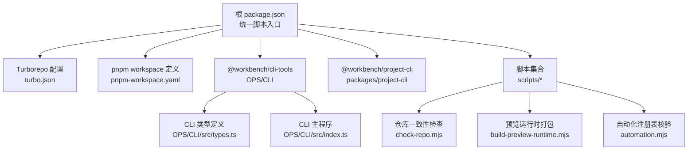
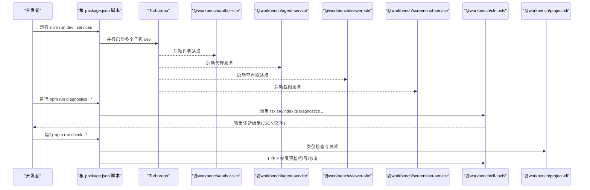
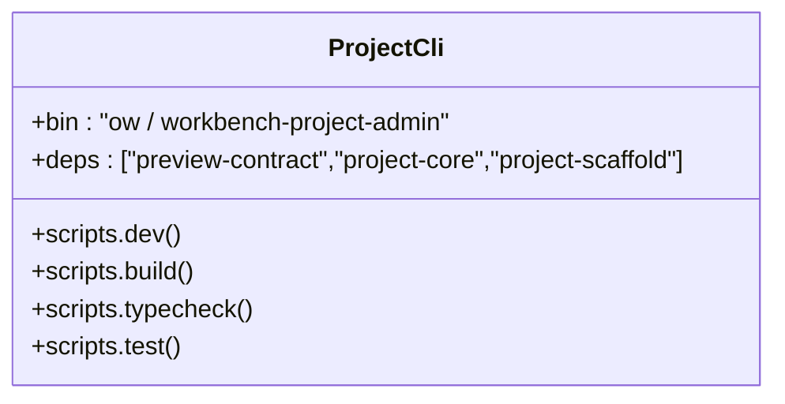
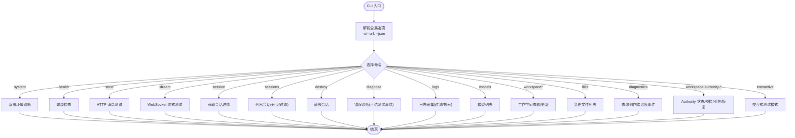
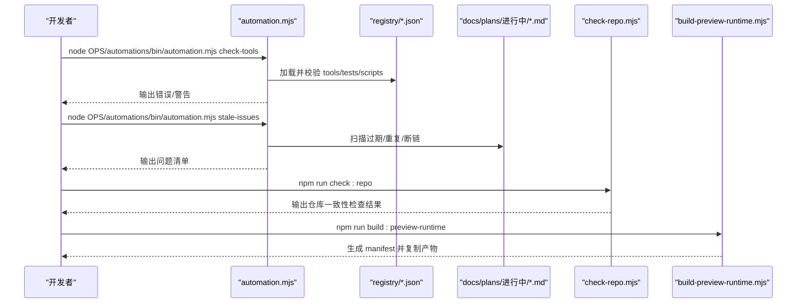
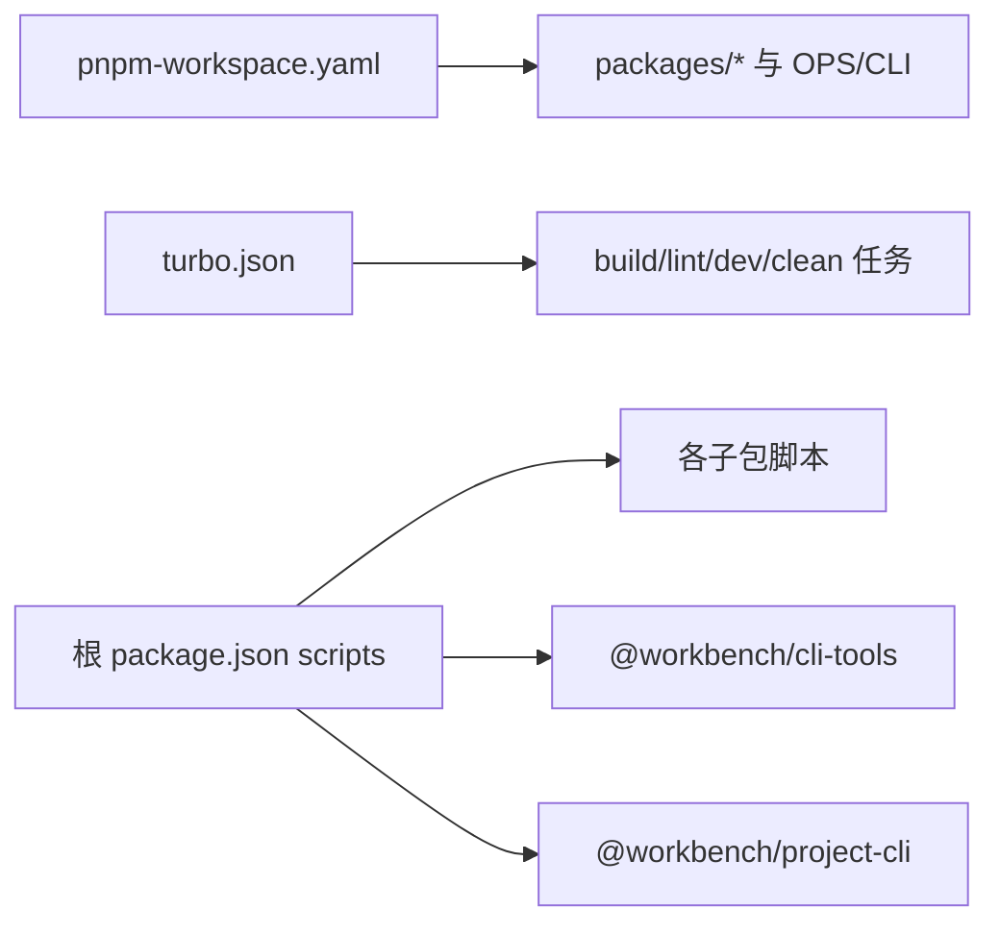

# 开发工具链

<cite>
**本文引用的文件**
- [package.json](file://package.json)
- [turbo.json](file://turbo.json)
- [pnpm-workspace.yaml](file://pnpm-workspace.yaml)
- [OPS/CLI/package.json](file://OPS/CLI/package.json)
- [OPS/CLI/src/index.ts](file://OPS/CLI/src/index.ts)
- [OPS/CLI/src/types.ts](file://OPS/CLI/src/types.ts)
- [scripts/check-repo.mjs](file://scripts/check-repo.mjs)
- [scripts/build-preview-runtime.mjs](file://scripts/build-preview-runtime.mjs)
- [OPS/automations/bin/automation.mjs](file://OPS/automations/bin/automation.mjs)
- [packages/project-cli/package.json](file://packages/project-cli/package.json)
- [packages/agent-service/.eslintrc.json](file://packages/agent-service/.eslintrc.json)
- [OPS/CLI/tsconfig.json](file://OPS/CLI/tsconfig.json)
</cite>

## 目录
1. [简介](#简介)
2. [项目结构](#项目结构)
3. [核心组件](#核心组件)
4. [架构总览](#架构总览)
5. [详细组件分析](#详细组件分析)
6. [依赖关系分析](#依赖关系分析)
7. [性能与构建优化](#性能与构建优化)
8. [代码质量与规范](#代码质量与规范)
9. [调试与诊断指南](#调试与诊断指南)
10. [故障排查](#故障排查)
11. [结论](#结论)
12. [附录](#附录)

## 简介
本文件面向 Workbench 平台的开发者与维护者，系统化梳理开发工具链：Project Admin CLI、自动化脚本、Turborepo 构建系统、代码质量检查与格式化、以及调试与诊断工具。文档提供命令清单、调用流程、配置要点与最佳实践，帮助团队提升开发与运维效率。

## 项目结构
仓库采用 pnpm workspace + Turborepo 的多包结构，根脚本统一编排各子包的类型检查、测试与构建任务；OPS 目录包含 CLI 工具与自动化脚本；scripts 目录提供构建、检查与部署辅助脚本。

图示来源
- [package.json:1-101](file://package.json#L1-L101)
- [turbo.json:1-20](file://turbo.json#L1-L20)
- [pnpm-workspace.yaml:1-15](file://pnpm-workspace.yaml#L1-L15)
- [OPS/CLI/src/index.ts:1-374](file://OPS/CLI/src/index.ts#L1-L374)
- [OPS/CLI/src/types.ts:1-234](file://OPS/CLI/src/types.ts#L1-L234)
- [scripts/check-repo.mjs:1-238](file://scripts/check-repo.mjs#L1-L238)
- [scripts/build-preview-runtime.mjs:1-369](file://scripts/build-preview-runtime.mjs#L1-L369)
- [OPS/automations/bin/automation.mjs:1-472](file://OPS/automations/bin/automation.mjs#L1-L472)

章节来源
- [package.json:1-101](file://package.json#L1-L101)
- [turbo.json:1-20](file://turbo.json#L1-L20)
- [pnpm-workspace.yaml:1-15](file://pnpm-workspace.yaml#L1-L15)

## 核心组件
- Project Admin CLI（@workbench/project-cli）
  - 通过 bin 暴露 ow 与 workbench-project-admin 两个可执行名，内部使用 TypeScript 实现，支持 dev/test/typecheck 等脚本。
- 诊断与运维 CLI（@workbench/cli-tools）
  - 提供 system、health、send、stream、session、sessions、destroy、diagnose、logs、models、workspace、files、diagnostics、interactive 等命令，用于会话管理、日志采集、工作空间与权限状态检查等。
- 自动化脚本
  - automation.mjs：校验注册表（tools/tests/scripts）、扫描过期计划文档、输出报告。
  - check-repo.mjs：检查必要文件、.gitignore 建议项、Markdown UTF-8 与链接有效性、脚本路径可达性。
  - build-preview-runtime.mjs：基于 esbuild 打包预览运行时 vendor 与 SDK，生成 manifest 并复制到 author-site 与 viewer-site。

章节来源
- [packages/project-cli/package.json:1-31](file://packages/project-cli/package.json#L1-L31)
- [OPS/CLI/package.json:1-28](file://OPS/CLI/package.json#L1-L28)
- [OPS/CLI/src/index.ts:1-374](file://OPS/CLI/src/index.ts#L1-L374)
- [OPS/automations/bin/automation.mjs:1-472](file://OPS/automations/bin/automation.mjs#L1-L472)
- [scripts/check-repo.mjs:1-238](file://scripts/check-repo.mjs#L1-L238)
- [scripts/build-preview-runtime.mjs:1-369](file://scripts/build-preview-runtime.mjs#L1-L369)

## 架构总览
下图展示根脚本如何串联各子包与工具，形成统一的开发体验。

图示来源
- [package.json:1-101](file://package.json#L1-L101)
- [turbo.json:1-20](file://turbo.json#L1-L20)
- [OPS/CLI/src/index.ts:1-374](file://OPS/CLI/src/index.ts#L1-L374)
- [packages/project-cli/package.json:1-31](file://packages/project-cli/package.json#L1-L31)

## 详细组件分析

### Project Admin CLI（@workbench/project-cli）
- 可执行入口
  - 通过 bin 字段映射到同一脚本，对外暴露 ow 与 workbench-project-admin 两个命令名，便于在不同环境以不同别名调用。
- 生命周期脚本
  - dev：tsx 直接运行源码，适合本地快速迭代。
  - build：自定义 Node 脚本进行构建。
  - typecheck：tsc --noEmit 进行类型检查。
  - test：自定义脚本运行测试套件。
- 依赖关系
  - 依赖 preview-contract、project-core、project-scaffold 等内部包，确保与预览协议与项目核心能力对齐。

图示来源
- [packages/project-cli/package.json:1-31](file://packages/project-cli/package.json#L1-L31)

章节来源
- [packages/project-cli/package.json:1-31](file://packages/project-cli/package.json#L1-L31)

### 诊断与运维 CLI（@workbench/cli-tools）
- 全局选项
  - -u/--url：指定 Agent Service 地址。
  - --json：以 JSON 格式输出，便于程序化解析。
- 主要命令族
  - 系统与环境
    - system：一键系统环境诊断（运行时版本、服务状态、端口占用、后端可用性）。
    - health：检查 Agent Service 健康状态。
  - 消息与流式交互
    - send：通过 HTTP API 发送非流式消息。
    - stream：通过 WebSocket 测试流式响应，支持超时与工作目录设置。
  - 会话管理
    - session：获取会话详细信息。
    - sessions：列出活跃会话，支持分页与状态过滤。
    - destroy：销毁指定会话释放资源。
  - 错误诊断与日志
    - diagnose：诊断会话错误，可选发送测试消息。
    - logs：采集日志，支持级别过滤、关键字搜索与行数限制。
  - 模型与工作空间
    - models：获取可用模型列表。
    - workspace：查看会话工作空间信息。
    - workspace-set：更新会话工作空间目录，支持标记为自定义。
    - files：查看会话变更文件列表。
  - 创作端诊断事件
    - diagnostics <kind>：查询结构化诊断事件（recent/project/session/trace/operation/autosave/collab/preview/export），支持多种过滤参数与远程 SSH 查询。
  - Workspace Authority
    - workspace-authority-status/preflight/bootstrap/reconcile-adopt/reconcile-restore：只读检查或执行 bootstrap/adopt/restore 操作，默认 dry-run，加 --apply 才生效。
  - 交互式模式
    - interactive：进入交互式测试模式，支持连续发送消息与切换 WebSocket 模式。

图示来源
- [OPS/CLI/src/index.ts:1-374](file://OPS/CLI/src/index.ts#L1-L374)
- [OPS/CLI/src/types.ts:1-234](file://OPS/CLI/src/types.ts#L1-L234)

章节来源
- [OPS/CLI/src/index.ts:1-374](file://OPS/CLI/src/index.ts#L1-L374)
- [OPS/CLI/src/types.ts:1-234](file://OPS/CLI/src/types.ts#L1-L234)

### 自动化脚本与注册表
- automation.mjs
  - 读取 OPS/automations/registry 下的 tools.json、tests.json、scripts.json，校验条目形状、路径存在性与命令引用（支持 corepack pnpm --filter 解析）。
  - 扫描 docs/plans/进行中 的 Markdown 文件，检测过期、重复标题、缺失链接等问题。
  - 提供 list-tools、check-tools、report、stale-issues、help 等子命令。
- check-repo.mjs
  - 检查必要文件是否存在、.gitignore 是否包含建议项、根目录临时产物清理提示、Markdown UTF-8 合法性与链接有效性、package.json 脚本中指向的文件路径可达性。
- build-preview-runtime.mjs
  - 使用 esbuild 将 react、react-dom、lucide-react、framer-motion、svgaplayerweb 等 vendor 模块打包为 ESM，生成 manifest.json（含文件哈希与包版本），并复制到 author-site 与 viewer-site 的 public/preview-runtime 目录。

图示来源
- [OPS/automations/bin/automation.mjs:1-472](file://OPS/automations/bin/automation.mjs#L1-L472)
- [scripts/check-repo.mjs:1-238](file://scripts/check-repo.mjs#L1-L238)
- [scripts/build-preview-runtime.mjs:1-369](file://scripts/build-preview-runtime.mjs#L1-L369)

章节来源
- [OPS/automations/bin/automation.mjs:1-472](file://OPS/automations/bin/automation.mjs#L1-L472)
- [scripts/check-repo.mjs:1-238](file://scripts/check-repo.mjs#L1-L238)
- [scripts/build-preview-runtime.mjs:1-369](file://scripts/build-preview-runtime.mjs#L1-L369)

## 依赖关系分析
- 包管理与工作区
  - pnpm-workspace.yaml 声明 packages/* 与 OPS/CLI 为工作区包，allowBuilds 允许部分原生依赖构建，overrides 锁定特定依赖版本。
- 构建编排
  - turbo.json 定义 build/lint/dev/clean 任务行为：build 依赖上游包的 build 产物，dev 禁用缓存且持久运行，lint 依赖上游构建。
- 根脚本编排
  - package.json 的 scripts 集中编排 dev、build、lint、typecheck、check:*、test:*、docker:*、ops:*、diagnostics:*、workspace-authority:* 等命令，统一入口提升协作效率。

图示来源
- [pnpm-workspace.yaml:1-15](file://pnpm-workspace.yaml#L1-L15)
- [turbo.json:1-20](file://turbo.json#L1-L20)
- [package.json:1-101](file://package.json#L1-L101)

章节来源
- [pnpm-workspace.yaml:1-15](file://pnpm-workspace.yaml#L1-L15)
- [turbo.json:1-20](file://turbo.json#L1-L20)
- [package.json:1-101](file://package.json#L1-L101)

## 性能与构建优化
- Turborepo 缓存与增量
  - build 任务启用缓存与输出目录控制（.next/**、dist/**），并通过 dependsOn 保证依赖顺序。
  - dev 任务禁用缓存并标记为 persistent，避免热重载被缓存干扰。
  - lint 依赖上游 build，确保在最新产物上运行。
- 预览运行时构建
  - 使用 esbuild 的 splitting 与 chunking 策略，按模块拆分并生成带哈希的 chunk，减少重复体积。
  - manifest.json 记录 imports/files/packages 信息与 generatedAt，便于浏览器端按需加载与缓存失效控制。
- 并行与选择性构建
  - 根脚本通过 pnpm --filter 精确选择子包执行，结合 concurrently 并行启动多服务，缩短整体等待时间。

章节来源
- [turbo.json:1-20](file://turbo.json#L1-L20)
- [scripts/build-preview-runtime.mjs:1-369](file://scripts/build-preview-runtime.mjs#L1-L369)
- [package.json:1-101](file://package.json#L1-L101)

## 代码质量与规范
- TypeScript 类型检查
  - 各子包通过 tsc --noEmit 进行类型检查，根脚本提供 check:* 组合命令统一执行。
  - CLI 工具使用 TS 严格模式与 ESNext 模块目标，确保类型安全与现代化语法。
- ESLint 规则
  - 示例配置启用 @typescript-eslint/recommended，关闭显式函数返回类型要求，对 any 与未使用变量给出告警/错误。
- 仓库级检查
  - check-repo.mjs 强制 Markdown UTF-8 编码与链接有效性，提示 .gitignore 建议项，避免污染仓库。
- 自动化注册表校验
  - automation.mjs 校验 registry 条目完整性与命令可达性，保障自动化资产一致。

章节来源
- [package.json:1-101](file://package.json#L1-L101)
- [OPS/CLI/tsconfig.json:1-16](file://OPS/CLI/tsconfig.json#L1-L16)
- [packages/agent-service/.eslintrc.json:1-22](file://packages/agent-service/.eslintrc.json#L1-L22)
- [scripts/check-repo.mjs:1-238](file://scripts/check-repo.mjs#L1-L238)
- [OPS/automations/bin/automation.mjs:1-472](file://OPS/automations/bin/automation.mjs#L1-L472)

## 调试与诊断指南
- 常用诊断命令
  - 系统与环境：system、health
  - 会话与消息：session、sessions、destroy、send、stream、diagnose
  - 日志与事件：logs、diagnostics <kind>
  - 工作空间与权限：workspace、workspace-set、files、workspace-authority-*
  - 交互式测试：interactive
- 输出格式
  - 所有命令支持 --json 输出，便于集成到 CI 或二次处理。
- 远程诊断
  - diagnostics 支持 --remote-host/--remote-user/--remote-port/--remote-data-dir 等参数，通过 SSH 拉取远程环境的诊断数据。
- 典型排障流程
  - 先运行 system 与 health 确认服务与端口状态。
  - 使用 diagnose 定位错误原因，必要时用 logs 过滤级别与关键字缩小范围。
  - 针对工作空间异常，使用 workspace-authority-preflight 检查前置条件，再根据结果选择 bootstrap/adopt/restore。

章节来源
- [OPS/CLI/src/index.ts:1-374](file://OPS/CLI/src/index.ts#L1-L374)
- [OPS/CLI/src/types.ts:1-234](file://OPS/CLI/src/types.ts#L1-L234)

## 故障排查
- 常见问题
  - 端口冲突：system 命令会报告端口占用情况，优先排查。
  - 服务不可达：health 返回状态码与指标，结合 logs 定位具体错误。
  - 工作空间不一致：workspace-authority-preflight 输出 issues，使用 reconcile-adopt 或 reconcile-restore 修复。
  - 构建缓存异常：dev 任务禁用缓存，若仍异常可尝试 clean 后重建。
- 建议步骤
  - 使用 check:repo 与 check:automation 确保仓库与自动化资产一致。
  - 使用 diagnostics 系列命令收集证据，必要时导出到文件以便回溯。

章节来源
- [OPS/CLI/src/index.ts:1-374](file://OPS/CLI/src/index.ts#L1-L374)
- [scripts/check-repo.mjs:1-238](file://scripts/check-repo.mjs#L1-L238)
- [OPS/automations/bin/automation.mjs:1-472](file://OPS/automations/bin/automation.mjs#L1-L472)

## 结论
Workbench 的开发工具链围绕 pnpm workspace 与 Turborepo 构建，结合 Project Admin CLI 与诊断运维 CLI，形成从开发、构建、检查到诊断的一体化流程。通过自动化脚本与注册表机制，进一步提升了仓库一致性与可维护性。遵循本文的最佳实践与排障指引，可显著提升团队协作效率与交付质量。

## 附录
- 常用命令速查
  - 开发与服务
    - npm run dev:services：并行启动 author、agent、viewer、screenshot 服务。
    - npm run dev:author / dev:agent / dev:viewer / dev:screenshot：单独启动某服务。
  - 构建与检查
    - npm run build：构建 author-site。
    - npm run build:preview-runtime：生成预览运行时 manifest。
    - npm run check:all：全量类型检查与测试。
    - npm run check:repo / check:automation：仓库与自动化资产校验。
  - 诊断与运维
    - npm run diagnostics:*：调用 CLI 的诊断子命令。
    - npm run workspace-authority:*：工作区权限相关操作。
  - Docker
    - npm run docker:*：镜像预拉取、验证与深度健康检查。

章节来源
- [package.json:1-101](file://package.json#L1-L101)