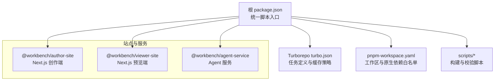
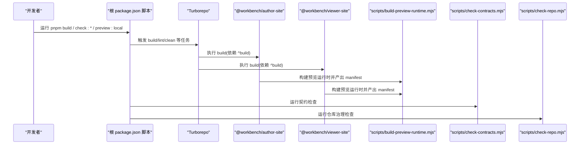
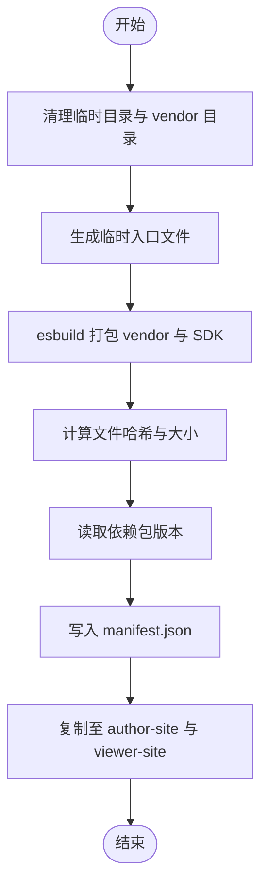
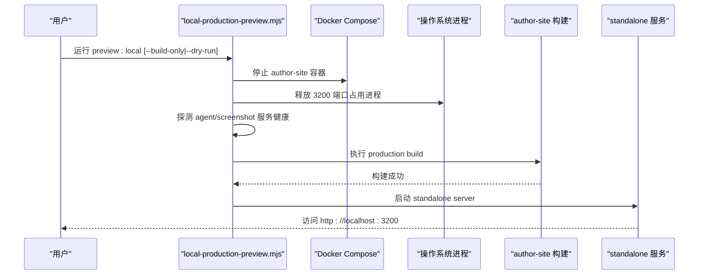
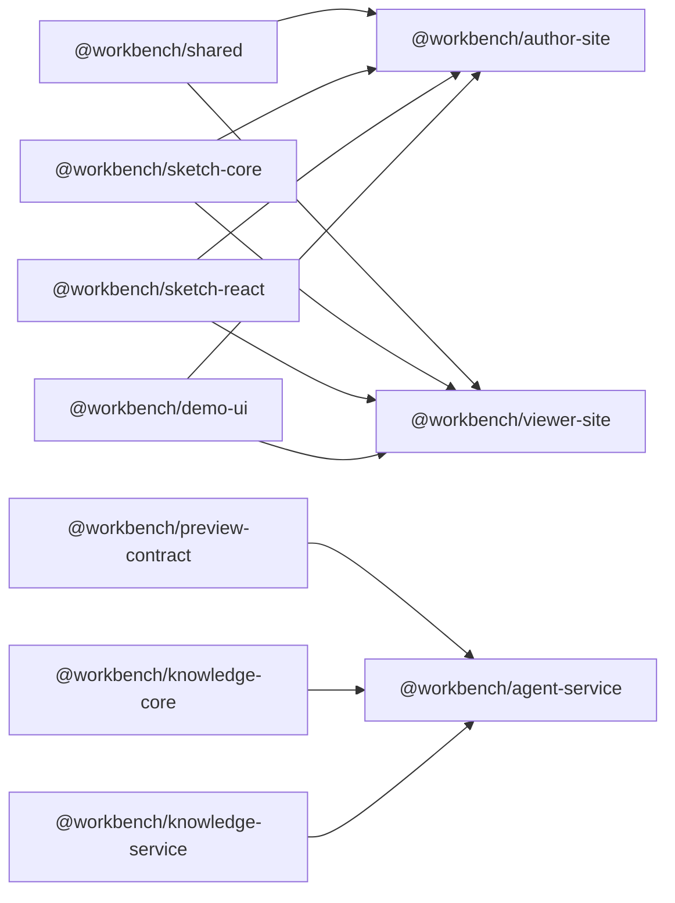

# 构建系统

<cite>
**本文引用的文件**
- [package.json](file://package.json)
- [turbo.json](file://turbo.json)
- [pnpm-workspace.yaml](file://pnpm-workspace.yaml)
- [scripts/build-preview-runtime.mjs](file://scripts/build-preview-runtime.mjs)
- [scripts/check-contracts.mjs](file://scripts/check-contracts.mjs)
- [scripts/check-repo.mjs](file://scripts/check-repo.mjs)
- [scripts/dev-restart.mjs](file://scripts/dev-restart.mjs)
- [scripts/local-production-preview.mjs](file://scripts/local-production-preview.mjs)
- [packages/author-site/package.json](file://packages/author-site/package.json)
- [packages/viewer-site/package.json](file://packages/viewer-site/package.json)
- [packages/agent-service/package.json](file://packages/agent-service/package.json)
</cite>

## 目录
1. [简介](#简介)
2. [项目结构](#项目结构)
3. [核心组件](#核心组件)
4. [架构总览](#架构总览)
5. [详细组件分析](#详细组件分析)
6. [依赖关系分析](#依赖关系分析)
7. [性能与缓存优化](#性能与缓存优化)
8. [故障排查指南](#故障排查指南)
9. [结论](#结论)
10. [附录](#附录)

## 简介
本文件面向 Workbench 平台的构建系统，系统性说明基于 Turborepo 的任务编排、缓存与并行策略，pnpm workspace 的包管理与版本控制，以及关键构建脚本（预览运行时构建、契约检查、代码质量与仓库治理）的职责与流程。同时给出任务依赖、缓存失效规则、性能调优建议、扩展方法与常见问题排查路径，帮助团队高效维护与演进该 Monorepo 构建体系。

## 项目结构
Workbench 采用 pnpm workspace 组织多个子包，并通过根级 package.json 暴露统一命令入口；Turborepo 负责跨包的构建任务编排与缓存；若干 Node 脚本承担预览运行时打包、契约校验、仓库健康检查等职责。

图表来源
- [package.json:1-101](file://package.json#L1-L101)
- [turbo.json:1-20](file://turbo.json#L1-L20)
- [pnpm-workspace.yaml:1-15](file://pnpm-workspace.yaml#L1-L15)
- [packages/author-site/package.json:1-127](file://packages/author-site/package.json#L1-L127)
- [packages/viewer-site/package.json:1-62](file://packages/viewer-site/package.json#L1-L62)
- [packages/agent-service/package.json:1-53](file://packages/agent-service/package.json#L1-L53)

章节来源
- [package.json:1-101](file://package.json#L1-L101)
- [turbo.json:1-20](file://turbo.json#L1-L20)
- [pnpm-workspace.yaml:1-15](file://pnpm-workspace.yaml#L1-L15)

## 核心组件
- Turborepo 任务配置：定义 build、dev、lint、clean 的行为，包括依赖前驱、输出产物与缓存开关。
- pnpm workspace：声明工作区范围、允许构建的原生依赖、全局覆盖项。
- 根级脚本：通过 corepack + pnpm --filter 将调用路由到具体子包，提供 dev、build、check、test 等统一入口。
- 构建脚本：
  - 预览运行时构建：使用 esbuild 聚合 vendor 模块并生成 manifest，供 author-site 与 viewer-site 消费。
  - 契约检查：静态扫描与类型断言，确保跨包接口一致。
  - 仓库治理：检查必要文件、Markdown 链接、脚本路径有效性等。
  - 本地准生产预览：停止冲突进程、保留 .next 缓存、执行 production build 并启动 standalone 服务。
  - 开发重启：端口占用清理、可选清除 Next.js 缓存、并发启动多服务。

章节来源
- [turbo.json:1-20](file://turbo.json#L1-L20)
- [pnpm-workspace.yaml:1-15](file://pnpm-workspace.yaml#L1-L15)
- [package.json:1-101](file://package.json#L1-L101)
- [scripts/build-preview-runtime.mjs:1-369](file://scripts/build-preview-runtime.mjs#L1-L369)
- [scripts/check-contracts.mjs:1-364](file://scripts/check-contracts.mjs#L1-L364)
- [scripts/check-repo.mjs:1-238](file://scripts/check-repo.mjs#L1-L238)
- [scripts/local-production-preview.mjs:1-273](file://scripts/local-production-preview.mjs#L1-L273)
- [scripts/dev-restart.mjs:1-151](file://scripts/dev-restart.mjs#L1-L151)

## 架构总览
下图展示从根命令到各子包与脚本的执行链路，以及 Turborepo 在其中的作用。

图表来源
- [package.json:1-101](file://package.json#L1-L101)
- [turbo.json:1-20](file://turbo.json#L1-L20)
- [packages/author-site/package.json:1-127](file://packages/author-site/package.json#L1-L127)
- [packages/viewer-site/package.json:1-62](file://packages/viewer-site/package.json#L1-L62)
- [scripts/build-preview-runtime.mjs:1-369](file://scripts/build-preview-runtime.mjs#L1-L369)
- [scripts/check-contracts.mjs:1-364](file://scripts/check-contracts.mjs#L1-L364)
- [scripts/check-repo.mjs:1-238](file://scripts/check-repo.mjs#L1-L238)

## 详细组件分析

### Turborepo 任务与缓存
- 任务定义
  - build：依赖所有上游包的 build 完成后再执行；输出产物包含 .next/** 与 dist/**，排除 .next/cache/**。
  - dev：禁用缓存，标记为持久任务，适合热重载场景。
  - lint：依赖上游 build，保证类型与依赖稳定。
  - clean：禁用缓存，用于清理中间产物。
- 缓存与增量
  - 通过 outputs 声明影响缓存键的文件集；上游变更会触发下游重新构建。
  - dev 任务关闭缓存以避免状态污染。
- 并行与顺序
  - Turborepo 默认并行执行无相互依赖的任务；^build 语义确保先构建依赖包。

章节来源
- [turbo.json:1-20](file://turbo.json#L1-L20)

### pnpm workspace 与依赖管理
- 工作区范围
  - packages/* 与 OPS/CLI 纳入工作区，便于统一安装与脚本分发。
- 原生依赖构建白名单
  - allowBuilds 显式允许部分需要编译的原生依赖，避免安装失败。
- 版本覆盖
  - overrides 锁定特定依赖版本，提升一致性。
- 包间引用
  - 子包通过 workspace:* 引用内部包，实现零拷贝安装与快速增量构建。

章节来源
- [pnpm-workspace.yaml:1-15](file://pnpm-workspace.yaml#L1-L15)
- [packages/author-site/package.json:1-127](file://packages/author-site/package.json#L1-L127)
- [packages/viewer-site/package.json:1-62](file://packages/viewer-site/package.json#L1-L62)
- [packages/agent-service/package.json:1-53](file://packages/agent-service/package.json#L1-L53)

### 根级脚本与命令路由
- 开发相关
  - dev：封装 dev-restart，支持 --clear-cache 清理 Next.js 缓存。
  - dev:services：并发启动 author、agent、viewer、screenshot 四个服务。
  - preview:local：本地准生产预览，仅用当前源码构建 author-site 并启动 standalone 服务。
- 构建与检查
  - build：构建 author-site。
  - build:preview-runtime：构建预览运行时。
  - check:*：按包或全量执行 typecheck 与 test；check:contracts 与 check:repo 分别执行契约与仓库治理。
- 测试与 E2E
  - playwright 相关命令用于端到端与 Playground 测试。

章节来源
- [package.json:1-101](file://package.json#L1-L101)

### 预览运行时构建脚本
- 目标
  - 将 React、ReactDOM、Lucide、Framer Motion、SVGA 等常用库打包为浏览器可直连的 vendor 资源，并生成 manifest.json 描述映射与哈希。
- 关键流程
  - 生成临时入口文件，esbuild 以 ESM 模式打包并拆分 chunk。
  - 计算每个文件的 SHA256 摘要与字节数，写入 manifest.files。
  - 读取依赖包版本号写入 manifest.packages，便于缓存失效与回滚。
  - 将产物复制到 author-site 与 viewer-site 的 public/preview-runtime 目录。
- 缓存与稳定性
  - 若 manifest 内容未变则复用 generatedAt，减少不必要的刷新。
  - 通过文件名 hash 与 manifest 版本双重保障缓存命中。

图表来源
- [scripts/build-preview-runtime.mjs:1-369](file://scripts/build-preview-runtime.mjs#L1-L369)

章节来源
- [scripts/build-preview-runtime.mjs:1-369](file://scripts/build-preview-runtime.mjs#L1-L369)

### 契约检查脚本
- 目标
  - 确保跨包 API 响应体、流事件、截图服务请求/结果、项目管理员返回结构等契约保持一致。
- 主要能力
  - 调用 viewer 契约检查子脚本。
  - 静态扫描 shared、agent-client、screenshot-service、project-core 等关键源文件，断言关键字段存在。
  - 对典型数据结构进行运行时校验，验证 success/error 信封、stream event 类型枚举、批处理状态字段等。
- 失败策略
  - 收集错误与警告，最终非零退出，阻断 CI。

章节来源
- [scripts/check-contracts.mjs:1-364](file://scripts/check-contracts.mjs#L1-L364)

### 仓库治理脚本
- 目标
  - 保证仓库基础规范与文档完整性，降低协作成本。
- 主要能力
  - 检查必要文件是否存在。
  - 校验 .gitignore 是否包含推荐忽略项。
  - 检测根目录临时产物并告警。
  - 校验 Markdown 编码与链接有效性（严格/宽松模式）。
  - 解析根 scripts，校验 node/tsx/playwright 指向的路径真实存在（考虑 pnpm --filter exec 的工作目录）。
- 输出
  - 打印限制数量的 warning，汇总 error，非零退出。

章节来源
- [scripts/check-repo.mjs:1-238](file://scripts/check-repo.mjs#L1-L238)

### 本地准生产预览脚本
- 目标
  - 在不影响其他 Docker 服务的前提下，用当前源码构建 author-site 并以 standalone 方式运行，模拟生产环境行为。
- 主要流程
  - 停止 docker compose 中的 author-site 容器与本机 3200 端口占用进程。
  - 探测可选服务可用性（agent-service、screenshot-service），不可用时发出警告但不中断。
  - 执行 author-site 的 production build，准备 standalone 运行时所需静态资源。
  - 启动 standalone server，透传环境变量与信号。
- 选项
  - --build-only：仅构建不启动。
  - --dry-run：仅打印计划。
  - --help：显示用法。

图表来源
- [scripts/local-production-preview.mjs:1-273](file://scripts/local-production-preview.mjs#L1-L273)

章节来源
- [scripts/local-production-preview.mjs:1-273](file://scripts/local-production-preview.mjs#L1-L273)

### 开发重启脚本
- 目标
  - 安全释放开发端口，可选清理 Next.js 缓存，然后并发启动多服务。
- 主要流程
  - 扫描指定端口监听进程，优先 SIGTERM，必要时 SIGKILL。
  - 根据参数决定是否删除 .next 缓存。
  - 通过 corepack pnpm run dev:services 启动 author、agent、viewer、screenshot 服务。
  - 转发 SIGINT/SIGTERM 信号，保持优雅退出。

章节来源
- [scripts/dev-restart.mjs:1-151](file://scripts/dev-restart.mjs#L1-L151)

## 依赖关系分析
- 包内依赖
  - author-site 与 viewer-site 均依赖 @workbench/shared、@workbench/sketch-*、@workbench/demo-ui 等内部包，并通过 workspace:* 绑定。
  - agent-service 依赖 @workbench/knowledge-*、@workbench/preview-contract、@workbench/shared 等。
- 构建期依赖
  - author-site 与 viewer-site 的 build 脚本均先执行根级 build:preview-runtime，再执行 next build。
- Turborepo 依赖图
  - build 任务依赖上游包的 build 完成，形成 DAG 执行顺序。

图表来源
- [packages/author-site/package.json:1-127](file://packages/author-site/package.json#L1-L127)
- [packages/viewer-site/package.json:1-62](file://packages/viewer-site/package.json#L1-L62)
- [packages/agent-service/package.json:1-53](file://packages/agent-service/package.json#L1-L53)

章节来源
- [packages/author-site/package.json:1-127](file://packages/author-site/package.json#L1-L127)
- [packages/viewer-site/package.json:1-62](file://packages/viewer-site/package.json#L1-L62)
- [packages/agent-service/package.json:1-53](file://packages/agent-service/package.json#L1-L53)

## 性能与缓存优化
- 任务级优化
  - 利用 Turborepo 的 dependsOn 与 outputs 精确声明缓存边界，避免无效重建。
  - dev 任务关闭缓存，防止热更新时缓存污染。
- 产物级优化
  - 预览运行时通过 esbuild splitting 与 chunk hash 提升浏览器缓存命中率。
  - manifest 版本与 generatedAt 机制减少不必要刷新。
- 依赖级优化
  - pnpm workspace 与 workspace:* 减少重复安装，提升增量速度。
  - allowBuilds 精准放行原生依赖，缩短安装时间。
- 构建流水线优化
  - 将耗时且稳定的步骤前置（如预览运行时构建），使后续 Next.js 构建更稳定命中缓存。
  - 在 CI 中启用远程缓存（结合 Turborepo 生态）进一步加速。

[本节为通用指导，无需列出具体文件来源]

## 故障排查指南
- 端口占用导致无法启动
  - 现象：3200/3201/3202/3300 端口被占用。
  - 处理：使用 dev-restart 自动释放端口；必要时手动 lsof 定位并终止进程。
- Next.js 缓存异常
  - 现象：构建后页面行为异常或样式错乱。
  - 处理：使用 dev:repair 清理 .next 缓存后重试。
- 预览运行时未更新
  - 现象：修改了 vendor 依赖但前端未生效。
  - 处理：确认 build:preview-runtime 已执行；检查 manifest 版本与文件哈希变化。
- 契约检查失败
  - 现象：check:contracts 报错。
  - 处理：对照错误信息修复共享类型或接口定义，确保关键字段存在。
- 仓库治理告警
  - 现象：check:repo 报告缺失文件或无效链接。
  - 处理：补齐必要文件、修正 Markdown 链接或忽略无关告警。
- 本地准生产预览失败
  - 现象：preview:local 构建或启动失败。
  - 处理：查看日志；确认可选服务健康；使用 --dry-run 预检计划；必要时 --build-only 单独构建。

章节来源
- [scripts/dev-restart.mjs:1-151](file://scripts/dev-restart.mjs#L1-L151)
- [scripts/local-production-preview.mjs:1-273](file://scripts/local-production-preview.mjs#L1-L273)
- [scripts/check-contracts.mjs:1-364](file://scripts/check-contracts.mjs#L1-L364)
- [scripts/check-repo.mjs:1-238](file://scripts/check-repo.mjs#L1-L238)

## 结论
Workbench 的构建系统以 Turborepo 为核心编排器，配合 pnpm workspace 与一系列专用脚本，实现了高效的增量构建、严格的契约校验与良好的本地体验。通过明确的任务依赖、精准的缓存边界与稳定的预览运行时产物，团队可在大型 Monorepo 中保持高生产力与高质量交付。

[本节为总结性内容，无需列出具体文件来源]

## 附录
- 常用命令速查
  - 开发：pnpm dev、pnpm dev:services、pnpm dev:author、pnpm dev:viewer、pnpm dev:sketch
  - 构建：pnpm build、pnpm build:preview-runtime、pnpm build:viewer
  - 检查：pnpm check:all、pnpm check:contracts、pnpm check:repo
  - 预览：pnpm preview:local
  - 测试：pnpm test:e2e、pnpm test:e2e:ui、pnpm test:e2e:headed
- 自定义扩展建议
  - 新增包：在 pnpm-workspace.yaml 中纳入，并在其 package.json 中定义 build/typecheck/test 脚本；如需参与 Turborepo 缓存，确保输出目录符合约定或在 turbo.json 中补充任务定义。
  - 新增任务：在根 package.json 中组合现有脚本，或通过 Turborepo 任务扩展 outputs/dependsOn。
  - 新增契约：在 check-contracts.mjs 中添加新的断言逻辑，并在 CI 中集成。

[本节为通用指导，无需列出具体文件来源]