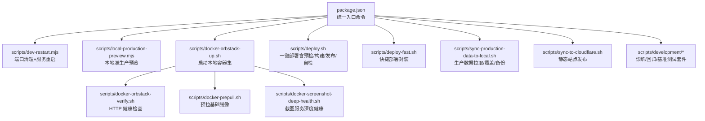
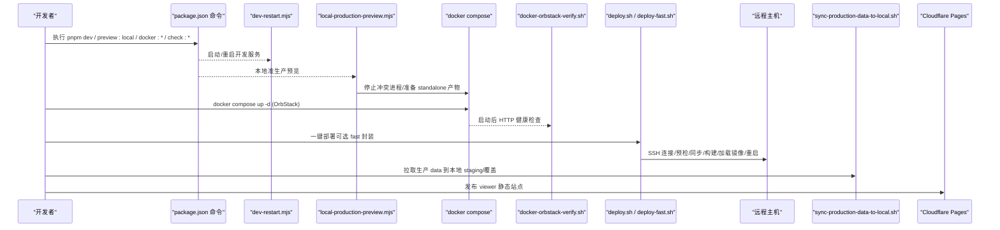
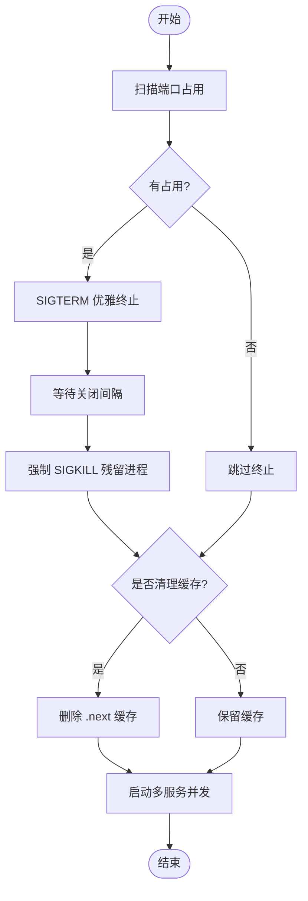
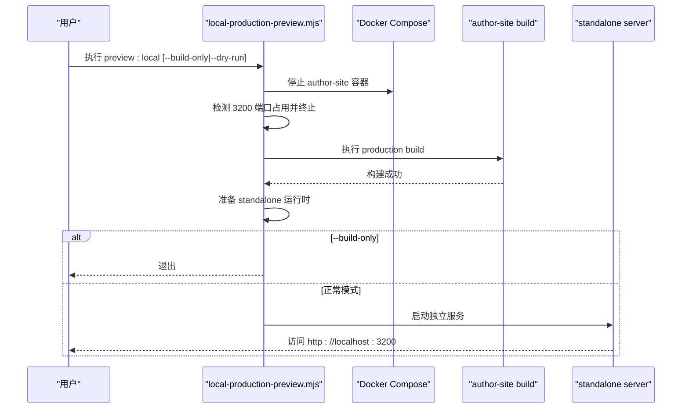
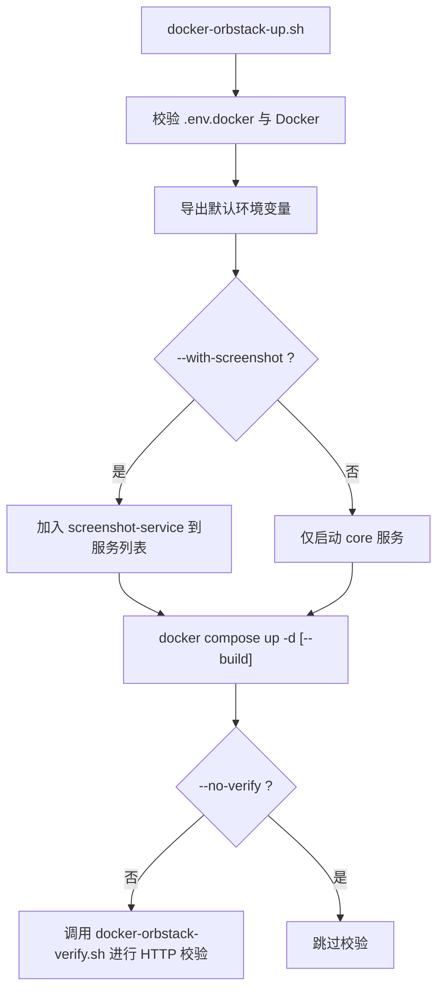
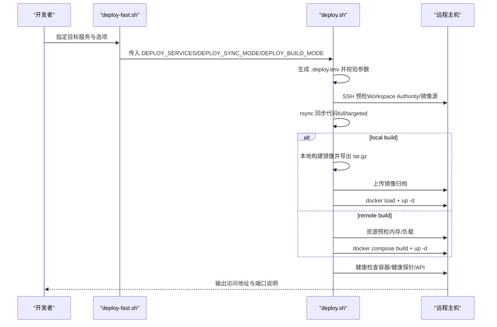
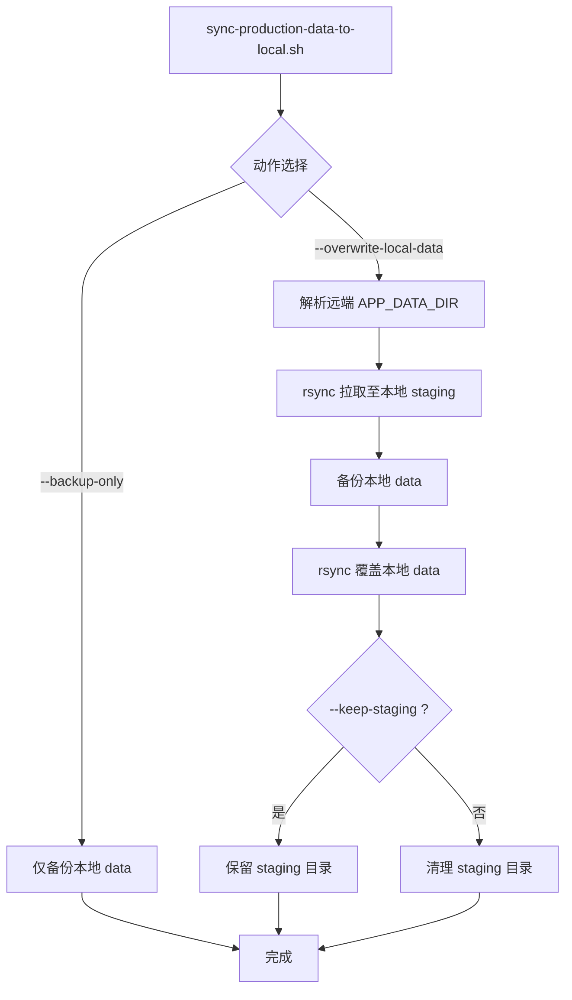
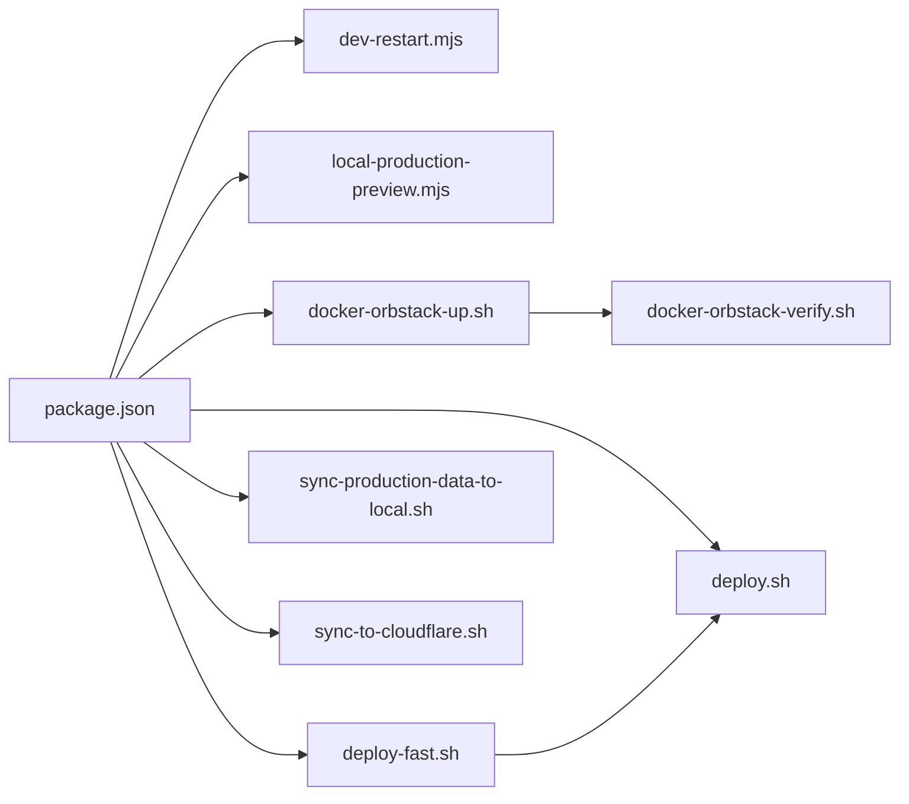

# 自动化脚本

<cite>
**本文引用的文件**   
- [package.json](file://package.json)
- [scripts/dev-restart.mjs](file://scripts/dev-restart.mjs)
- [scripts/local-production-preview.mjs](file://scripts/local-production-preview.mjs)
- [scripts/docker-orbstack-up.sh](file://scripts/docker-orbstack-up.sh)
- [scripts/docker-orbstack-verify.sh](file://scripts/docker-orbstack-verify.sh)
- [scripts/docker-prepull.sh](file://scripts/docker-prepull.sh)
- [scripts/docker-screenshot-deep-health.sh](file://scripts/docker-screenshot-deep-health.sh)
- [scripts/deploy.sh](file://scripts/deploy.sh)
- [scripts/deploy-fast.sh](file://scripts/deploy-fast.sh)
- [scripts/sync-production-data-to-local.sh](file://scripts/sync-production-data-to-local.sh)
- [scripts/sync-to-cloudflare.sh](file://scripts/sync-to-cloudflare.sh)
- [scripts/development/README.md](file://scripts/development/README.md)
</cite>

## 目录
1. [简介](#简介)
2. [项目结构](#项目结构)
3. [核心组件](#核心组件)
4. [架构总览](#架构总览)
5. [详细组件分析](#详细组件分析)
6. [依赖关系分析](#依赖关系分析)
7. [性能与效率考量](#性能与效率考量)
8. [故障排查指南](#故障排查指南)
9. [结论](#结论)
10. [附录](#附录)

## 简介
本文件系统化梳理 Workbench 平台的自动化脚本，覆盖开发环境、部署流水线、数据同步与开发辅助四大类。文档面向开发者与运维人员，提供从“快速上手”到“深度定制”的完整说明，并给出可落地的 CI/CD 集成建议与排错方法。

## 项目结构
脚本集中在仓库根目录 scripts 下，按职责分为：
- 开发与本地预览：dev-restart.mjs、local-production-preview.mjs
- Docker 与容器编排：docker-orbstack-up.sh、docker-orbstack-verify.sh、docker-prepull.sh、docker-screenshot-deep-health.sh
- 生产部署：deploy.sh、deploy-fast.sh
- 数据同步：sync-production-data-to-local.sh、sync-to-cloudflare.sh
- 开发辅助（诊断与验证）：scripts/development/*（见 README）

**图表来源** 
- [package.json:1-101](file://package.json#L1-L101)
- [scripts/dev-restart.mjs:1-151](file://scripts/dev-restart.mjs#L1-L151)
- [scripts/local-production-preview.mjs:1-273](file://scripts/local-production-preview.mjs#L1-L273)
- [scripts/docker-orbstack-up.sh:1-98](file://scripts/docker-orbstack-up.sh#L1-L98)
- [scripts/docker-orbstack-verify.sh:1-92](file://scripts/docker-orbstack-verify.sh#L1-L92)
- [scripts/docker-prepull.sh:1-45](file://scripts/docker-prepull.sh#L1-L45)
- [scripts/docker-screenshot-deep-health.sh:1-42](file://scripts/docker-screenshot-deep-health.sh#L1-L42)
- [scripts/deploy.sh:1-805](file://scripts/deploy.sh#L1-L805)
- [scripts/deploy-fast.sh:1-140](file://scripts/deploy-fast.sh#L1-L140)
- [scripts/sync-production-data-to-local.sh:1-335](file://scripts/sync-production-data-to-local.sh#L1-L335)
- [scripts/sync-to-cloudflare.sh:1-59](file://scripts/sync-to-cloudflare.sh#L1-L59)
- [scripts/development/README.md:1-264](file://scripts/development/README.md#L1-L264)

**章节来源**
- [package.json:1-101](file://package.json#L1-L101)

## 核心组件
- 开发服务器重启与端口治理：scripts/dev-restart.mjs
- 本地准生产预览：scripts/local-production-preview.mjs
- 本地容器编排与校验：scripts/docker-orbstack-up.sh + docker-orbstack-verify.sh
- 基础镜像预拉与截图服务深度健康：scripts/docker-prepull.sh、scripts/docker-screenshot-deep-health.sh
- 生产部署主流程与快速封装：scripts/deploy.sh、scripts/deploy-fast.sh
- 数据同步与发布：scripts/sync-production-data-to-local.sh、scripts/sync-to-cloudflare.sh
- 开发辅助与诊断：scripts/development/*（详见 README）

**章节来源**
- [scripts/dev-restart.mjs:1-151](file://scripts/dev-restart.mjs#L1-L151)
- [scripts/local-production-preview.mjs:1-273](file://scripts/local-production-preview.mjs#L1-L273)
- [scripts/docker-orbstack-up.sh:1-98](file://scripts/docker-orbstack-up.sh#L1-L98)
- [scripts/docker-orbstack-verify.sh:1-92](file://scripts/docker-orbstack-verify.sh#L1-L92)
- [scripts/docker-prepull.sh:1-45](file://scripts/docker-prepull.sh#L1-L45)
- [scripts/docker-screenshot-deep-health.sh:1-42](file://scripts/docker-screenshot-deep-health.sh#L1-L42)
- [scripts/deploy.sh:1-805](file://scripts/deploy.sh#L1-L805)
- [scripts/deploy-fast.sh:1-140](file://scripts/deploy-fast.sh#L1-L140)
- [scripts/sync-production-data-to-local.sh:1-335](file://scripts/sync-production-data-to-local.sh#L1-L335)
- [scripts/sync-to-cloudflare.sh:1-59](file://scripts/sync-to-cloudflare.sh#L1-L59)
- [scripts/development/README.md:1-264](file://scripts/development/README.md#L1-L264)

## 架构总览
下图展示从“开发者触发命令”到“服务运行与健康检查”的整体链路，以及生产部署与数据同步的关键路径。

**图表来源** 
- [package.json:1-101](file://package.json#L1-L101)
- [scripts/dev-restart.mjs:1-151](file://scripts/dev-restart.mjs#L1-L151)
- [scripts/local-production-preview.mjs:1-273](file://scripts/local-production-preview.mjs#L1-L273)
- [scripts/docker-orbstack-up.sh:1-98](file://scripts/docker-orbstack-up.sh#L1-L98)
- [scripts/docker-orbstack-verify.sh:1-92](file://scripts/docker-orbstack-verify.sh#L1-L92)
- [scripts/deploy.sh:1-805](file://scripts/deploy.sh#L1-L805)
- [scripts/deploy-fast.sh:1-140](file://scripts/deploy-fast.sh#L1-L140)
- [scripts/sync-production-data-to-local.sh:1-335](file://scripts/sync-production-data-to-local.sh#L1-L335)
- [scripts/sync-to-cloudflare.sh:1-59](file://scripts/sync-to-cloudflare.sh#L1-L59)

## 详细组件分析

### 开发服务器重启与端口治理（dev-restart.mjs）
- 功能要点
  - 扫描常用开发端口占用，优先 SIGTERM，必要时 SIGKILL 释放端口
  - 可选择清理 Next.js 缓存目录
  - 通过子进程启动多服务并行开发（author/agent/viewer/screenshot）
  - 信号转发与退出码透传，便于 IDE 或终端管理
- 关键参数
  - --clear-cache：清理 .next 缓存
- 典型用法
  - pnpm dev / pnpm dev:repair

**图表来源** 
- [scripts/dev-restart.mjs:1-151](file://scripts/dev-restart.mjs#L1-L151)

**章节来源**
- [scripts/dev-restart.mjs:1-151](file://scripts/dev-restart.mjs#L1-L151)
- [package.json:1-101](file://package.json#L1-L101)

### 本地准生产预览（local-production-preview.mjs）
- 功能要点
  - 停止本地 Docker author-site 与 3200 端口占用进程
  - 使用当前工作区源码执行 production build，保留 .next 缓存
  - 准备 standalone 运行时并启动 http://localhost:3200
  - 可选仅构建不启动（--build-only），或仅打印计划（--dry-run）
- 环境变量合并策略
  - 读取 .env 与 packages/author-site/.env.local，再叠加默认值（如 DATA_DIR、服务地址等）
- 典型用法
  - pnpm preview:local
  - pnpm preview:local -- --build-only

**图表来源** 
- [scripts/local-production-preview.mjs:1-273](file://scripts/local-production-preview.mjs#L1-L273)

**章节来源**
- [scripts/local-production-preview.mjs:1-273](file://scripts/local-production-preview.mjs#L1-L273)
- [package.json:1-101](file://package.json#L1-L101)

### 本地容器编排与校验（docker-orbstack-up.sh + verify）
- 启动脚本（docker-orbstack-up.sh）
  - 校验 .env.docker 存在与 Docker 可用
  - 设置默认环境变量（APP_DATA_DIR、NEXT_PUBLIC_*、CORS_ORIGINS 等）
  - 支持 --with-screenshot 启用 screenshot-service profile
  - 支持 --no-build 与 --no-verify 控制行为
- 校验脚本（docker-orbstack-verify.sh）
  - 轮询检查 author-site、agent-service、viewer-site 的 HTTP 状态
  - 可选检查 screenshot-service 的 JSON health
- 典型用法
  - pnpm docker:orbstack
  - pnpm docker:orbstack:screenshot
  - pnpm docker:orbstack:verify

**图表来源** 
- [scripts/docker-orbstack-up.sh:1-98](file://scripts/docker-orbstack-up.sh#L1-L98)
- [scripts/docker-orbstack-verify.sh:1-92](file://scripts/docker-orbstack-verify.sh#L1-L92)

**章节来源**
- [scripts/docker-orbstack-up.sh:1-98](file://scripts/docker-orbstack-up.sh#L1-L98)
- [scripts/docker-orbstack-verify.sh:1-92](file://scripts/docker-orbstack-verify.sh#L1-L92)
- [package.json:1-101](file://package.json#L1-L101)

### 基础镜像预拉与截图服务深度健康
- 预拉基础镜像（docker-prepull.sh）
  - 预拉 node:20-bookworm-slim、nginx:alpine
  - 可选为 screenshot-service 平台拉取对应基础镜像
- 截图服务深度健康（docker-screenshot-deep-health.sh）
  - 调用 /health?deep=1，解析 deepCheck.ok 判定结果
- 典型用法
  - pnpm docker:prepull
  - pnpm docker:prepull --screenshot
  - pnpm docker:screenshot:deep-health

**章节来源**
- [scripts/docker-prepull.sh:1-45](file://scripts/docker-prepull.sh#L1-L45)
- [scripts/docker-screenshot-deep-health.sh:1-42](file://scripts/docker-screenshot-deep-health.sh#L1-L42)
- [package.json:1-101](file://package.json#L1-L101)

### 生产部署（deploy.sh 与 deploy-fast.sh）
- 主流程（deploy.sh）
  - 生成部署环境文件（基于 .env.docker）
  - Workspace Authority 静态预检（本地与远端）
  - SSH 连接与镜像源检查
  - rsync 同步代码（full/targeted 两种模式）
  - 构建镜像（local/remote 两种模式）
  - 上传镜像归档并 load 到远端
  - 重启服务并执行健康检查（容器状态、健康探针、API 可达性）
- 快速封装（deploy-fast.sh）
  - 短名映射（author/agent/viewer/shot/core）
  - 默认 targeted sync + local build
  - 支持 --dry-run 预览实际执行的 deploy.sh 命令
- 典型用法
  - pnpm deploy（由 package.json 命令指向）
  - scripts/deploy-fast.sh author agent viewer shot

**图表来源** 
- [scripts/deploy-fast.sh:1-140](file://scripts/deploy-fast.sh#L1-L140)
- [scripts/deploy.sh:1-805](file://scripts/deploy.sh#L1-L805)

**章节来源**
- [scripts/deploy.sh:1-805](file://scripts/deploy.sh#L1-L805)
- [scripts/deploy-fast.sh:1-140](file://scripts/deploy-fast.sh#L1-L140)
- [package.json:1-101](file://package.json#L1-L101)

### 数据同步（生产到本地）与静态站点发布
- 生产数据同步（sync-production-data-to-local.sh）
  - 支持只读 dry-run、仅本地备份、覆盖本地 data（需显式确认）
  - 通过 SSH 解析远端 APP_DATA_DIR，rsync 拉取到本地 staging
  - 覆盖前自动备份本地 data，支持保留 staging 目录以便审计
- 静态站点发布（sync-to-cloudflare.sh）
  - 聚合 viewer-site 构建产物与 data/published
  - 生成 _headers 配置后通过 wrangler pages deploy 发布
- 典型用法
  - scripts/sync-production-data-to-local.sh --backup-only
  - scripts/sync-production-data-to-local.sh --overwrite-local-data --confirm-overwrite-local-data
  - scripts/sync-to-cloudflare.sh

**图表来源** 
- [scripts/sync-production-data-to-local.sh:1-335](file://scripts/sync-production-data-to-local.sh#L1-L335)

**章节来源**
- [scripts/sync-production-data-to-local.sh:1-335](file://scripts/sync-production-data-to-local.sh#L1-L335)
- [scripts/sync-to-cloudflare.sh:1-59](file://scripts/sync-to-cloudflare.sh#L1-L59)

### 开发辅助脚本（scripts/development/*）
- 定位协同同步抖动、采样 flush 状态、生成报告与截图
- 创建原型画布性能基线项目与采集指标
- 知识库链路验证套件（fixture/template/instantiate/metrics/ai/run）
- AI 写入后工作区刷新验证与日志摘要
- 参考 README 中的命令与环境变量说明，按需组合运行

**章节来源**
- [scripts/development/README.md:1-264](file://scripts/development/README.md#L1-L264)

## 依赖关系分析
- 命令入口集中化：package.json 将常用操作统一暴露为 pnpm 命令，降低学习成本
- 脚本间协作
  - dev-restart.mjs 与 local-production-preview.mjs 均涉及端口治理与进程管理
  - docker-orbstack-up.sh 依赖 docker-orbstack-verify.sh 做启动后校验
  - deploy-fast.sh 作为 deploy.sh 的参数包装器，简化日常部署
  - sync-production-data-to-local.sh 与 deploy.sh 共享 SSH/rsync 模式与远端路径约定
- 外部依赖
  - lsof（端口探测）、ssh/rsync（远程交互）、docker/compose（容器）、wrangler（静态发布）

**图表来源** 
- [package.json:1-101](file://package.json#L1-L101)
- [scripts/deploy-fast.sh:1-140](file://scripts/deploy-fast.sh#L1-L140)
- [scripts/docker-orbstack-up.sh:1-98](file://scripts/docker-orbstack-up.sh#L1-L98)
- [scripts/docker-orbstack-verify.sh:1-92](file://scripts/docker-orbstack-verify.sh#L1-L92)

**章节来源**
- [package.json:1-101](file://package.json#L1-L101)

## 性能与效率考量
- 构建优化
  - 本地构建模式优先，避免在正式机上进行高开销构建；远程构建带内存与负载阈值保护
  - targeted sync 仅同步目标服务所需包，减少 rsync 传输量
- 网络与 I/O
  - 使用 rsync 增量同步与 gzip 压缩镜像归档，降低带宽压力
  - 预拉基础镜像减少首次构建延迟
- 健康检查与重试
  - 健康检查采用轮询与超时控制，避免长时间阻塞
- 缓存利用
  - 本地预览保留 .next 缓存，加速二次构建

[本节为通用指导，无需特定文件引用]

## 故障排查指南
- 端口占用
  - 现象：启动失败提示端口被占用
  - 处理：使用 dev-restart.mjs 自动释放端口；若 lsof 不可用，先安装或手动 kill 占用进程
- SSH 与权限
  - 现象：部署阶段 SSH 连接失败或密钥不存在
  - 处理：确认私钥路径、权限与免密登录；检查防火墙与安全组
- 镜像源问题
  - 现象：远程 Docker 镜像源失效导致拉取失败
  - 处理：根据部署脚本提示修复 daemon.json 镜像源配置
- 健康检查失败
  - 现象：容器未 healthy 或 API 不可达
  - 处理：查看容器日志；检查 INTERNAL_API_TOKEN 一致性；确认 CORS 与端口映射
- 数据同步风险
  - 现象：误覆盖本地 data
  - 处理：始终先用 --dry-run 与 --backup-only 演练；覆盖必须同时传递确认参数；保留 staging 目录用于比对

**章节来源**
- [scripts/dev-restart.mjs:1-151](file://scripts/dev-restart.mjs#L1-L151)
- [scripts/deploy.sh:1-805](file://scripts/deploy.sh#L1-L805)
- [scripts/sync-production-data-to-local.sh:1-335](file://scripts/sync-production-data-to-local.sh#L1-L335)

## 结论
本套自动化脚本围绕“开发体验—本地验证—生产部署—数据治理”形成闭环。通过统一的命令入口、严格的预检与自检、可控的构建与同步策略，显著降低了人为失误与部署风险。建议在团队内推广标准化用法，并结合 CI/CD 实现更完整的自动化质量保障。

[本节为总结性内容，无需特定文件引用]

## 附录

### 常用命令速查
- 开发
  - pnpm dev / pnpm dev:repair
  - pnpm preview:local [-- --build-only]
- 容器
  - pnpm docker:orbstack[:screenshot]
  - pnpm docker:orbstack:verify
  - pnpm docker:prepull[:screenshot]
  - pnpm docker:screenshot:deep-health
- 部署
  - pnpm deploy（内部调用 deploy.sh）
  - scripts/deploy-fast.sh author agent viewer shot
- 数据与发布
  - scripts/sync-production-data-to-local.sh --backup-only
  - scripts/sync-production-data-to-local.sh --overwrite-local-data --confirm-overwrite-local-data
  - scripts/sync-to-cloudflare.sh

**章节来源**
- [package.json:1-101](file://package.json#L1-L101)

### 自定义扩展与 CI/CD 集成建议
- 新增脚本
  - 在 scripts 目录下新增可执行脚本，并在 package.json 中暴露统一命令
  - 保持参数风格一致（--help/--dry-run 等），输出结构化日志便于解析
- CI/CD 集成
  - 在 PR 阶段执行：check:all、test:e2e、check:workspace-deploy-preflight
  - 在发布阶段执行：deploy-fast.sh（指定目标服务）、sync-to-cloudflare.sh
  - 使用环境变量注入敏感信息（SSH_KEY、INTERNAL_API_TOKEN 等），避免明文提交
- 回滚与快照
  - 结合 sync-production-data-to-local.sh 的备份能力，建立定期快照与恢复流程
  - 对部署产物（镜像归档、staging 数据）保留固定周期，便于回溯

[本节为通用指导，无需特定文件引用]