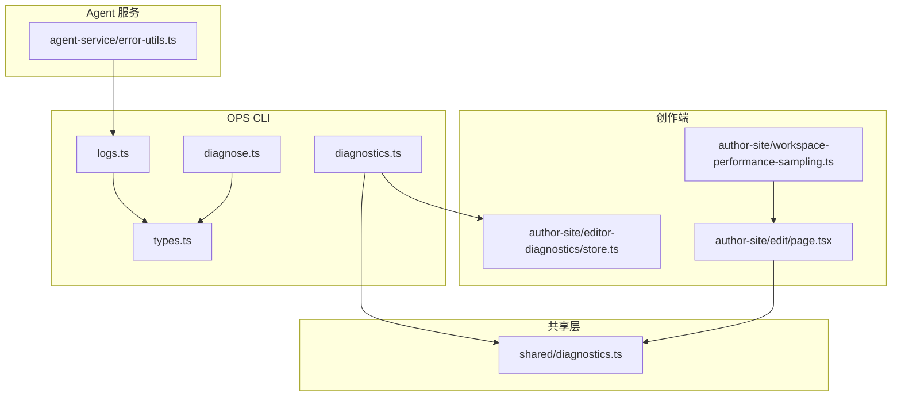
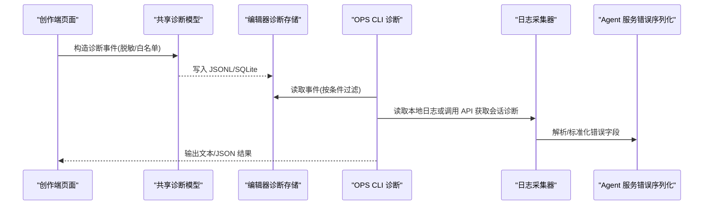
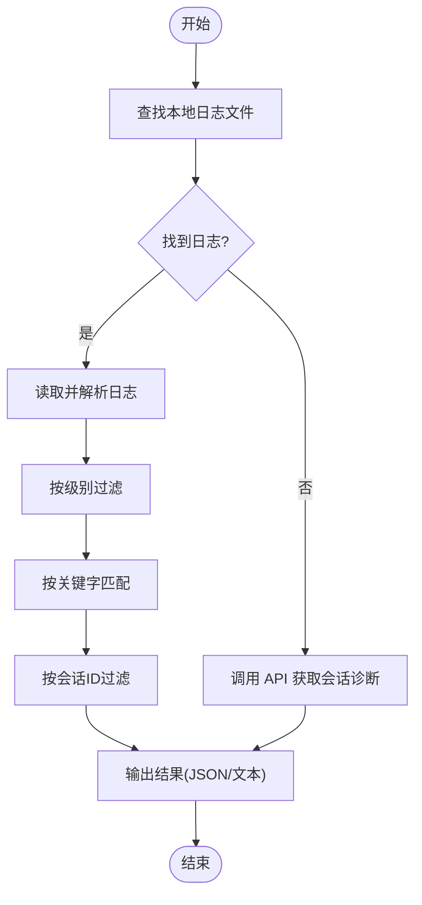
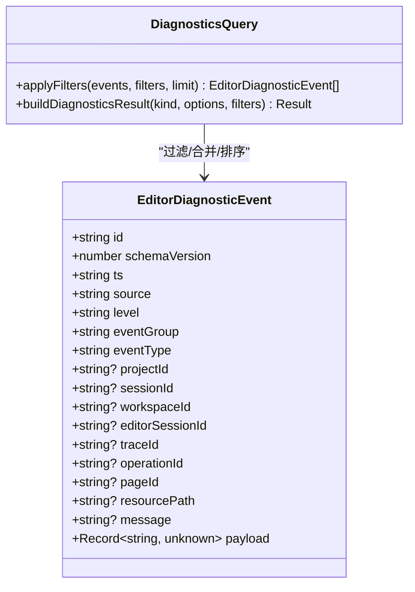
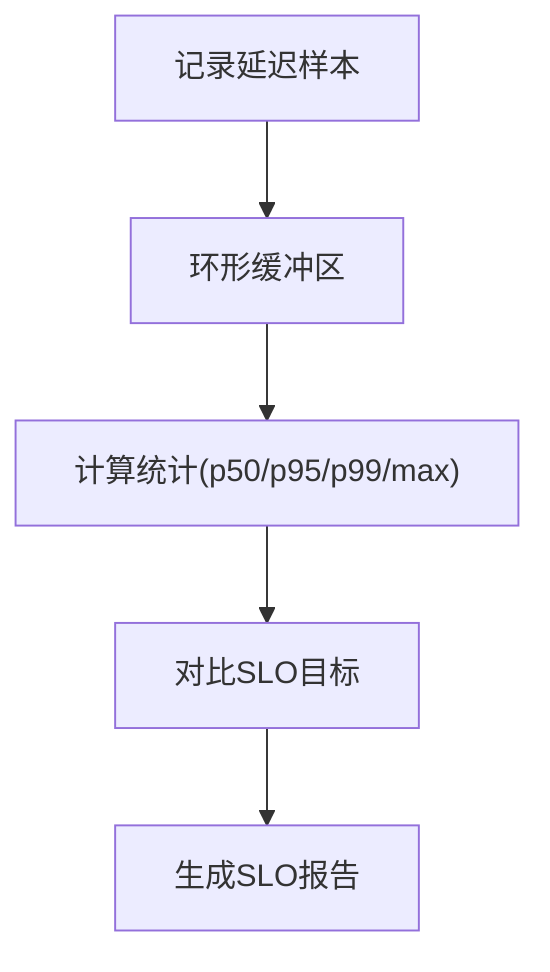
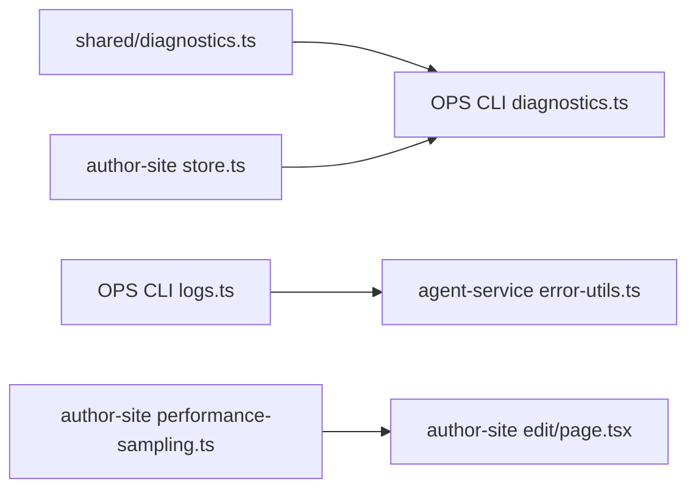

# 调试与诊断

<cite>
**本文引用的文件列表**
- [diagnostics.ts](file://OPS/CLI/src/commands/diagnostics.ts)
- [logs.ts](file://OPS/CLI/src/commands/logs.ts)
- [types.ts](file://OPS/CLI/src/types.ts)
- [diagnose.ts](file://OPS/CLI/src/commands/diagnose.ts)
- [editor-diagnostics.md](file://OPS/automations/diagnostics/editor-diagnostics.md)
- [07_运行进度与事件日志.md](file://docs/项目文档/创作端/05-AI对话/技术/07_运行进度与事件日志.md)
- [diagnostics.ts](file://packages/shared/src/diagnostics.ts)
- [store.ts](file://packages/author-site/src/lib/editor-diagnostics/store.ts)
- [workspace-performance-sampling.ts](file://packages/author-site/src/lib/workspace-performance-sampling.ts)
- [page.tsx](file://packages/author-site/src/app/demo/[id]/edit/page.tsx)
- [error-utils.ts](file://packages/agent-service/src/utils/error-utils.ts)
</cite>

## 目录
1. [简介](#简介)
2. [项目结构](#项目结构)
3. [核心组件](#核心组件)
4. [架构总览](#架构总览)
5. [详细组件分析](#详细组件分析)
6. [依赖关系分析](#依赖关系分析)
7. [性能考虑](#性能考虑)
8. [故障排查指南](#故障排查指南)
9. [结论](#结论)
10. [附录](#附录)

## 简介
本文件面向 Workbench 平台的调试与诊断，覆盖以下能力：
- 日志收集与分析：支持本地日志文件与 API 会话诊断的采集、级别过滤、关键字搜索、时间范围筛选。
- 结构化诊断事件查询：提供项目级、会话级、编辑器级的事件聚合与过滤，包含工作区流式变更、预览、自动保存、AI 运行等关键链路。
- 审计日志说明：基于数据目录中的按日归档 JSON 文件，用于用户操作追踪、权限变更记录与安全事件监控。
- 性能监控工具：前端采样器记录关键延迟指标并生成 SLO 报告，辅助定位瓶颈。
- 常见问题诊断流程：网络、数据库、内存泄漏等问题的定位方法与最佳实践。

## 项目结构
Workbench 的调试与诊断相关能力主要分布在如下位置：
- OPS CLI 命令：统一入口，提供日志采集、诊断事件查询、系统健康检查与导出包生成。
- 共享诊断模型与脱敏规则：定义结构化诊断事件的数据结构与字段白名单。
- 创作端（author-site）：在浏览器侧记录诊断事件，持久化为 JSONL，并提供性能采样器。
- Agent 服务：运行期日志与错误序列化，保障可观测性与安全。

图表来源
- [diagnostics.ts:308-499](file://OPS/CLI/src/commands/diagnostics.ts#L308-L499)
- [logs.ts:1-94](file://OPS/CLI/src/commands/logs.ts#L1-L94)
- [types.ts:118-174](file://OPS/CLI/src/types.ts#L118-L174)
- [diagnose.ts:1-58](file://OPS/CLI/src/commands/diagnose.ts#L1-L58)
- [diagnostics.ts:1-200](file://packages/shared/src/diagnostics.ts#L1-L200)
- [store.ts:394-433](file://packages/author-site/src/lib/editor-diagnostics/store.ts#L394-L433)
- [workspace-performance-sampling.ts:245-279](file://packages/author-site/src/lib/workspace-performance-sampling.ts#L245-L279)
- [page.tsx:1912-2036](file://packages/author-site/src/app/demo/[id]/edit/page.tsx#L1912-L2036)
- [error-utils.ts:1-106](file://packages/agent-service/src/utils/error-utils.ts#L1-L106)

章节来源
- [diagnostics.ts:308-499](file://OPS/CLI/src/commands/diagnostics.ts#L308-L499)
- [logs.ts:1-94](file://OPS/CLI/src/commands/logs.ts#L1-L94)
- [types.ts:118-174](file://OPS/CLI/src/types.ts#L118-L174)
- [diagnose.ts:1-58](file://OPS/CLI/src/commands/diagnose.ts#L1-L58)
- [diagnostics.ts:1-200](file://packages/shared/src/diagnostics.ts#L1-L200)
- [store.ts:394-433](file://packages/author-site/src/lib/editor-diagnostics/store.ts#L394-L433)
- [workspace-performance-sampling.ts:245-279](file://packages/author-site/src/lib/workspace-performance-sampling.ts#L245-L279)
- [page.tsx:1912-2036](file://packages/author-site/src/app/demo/[id]/edit/page.tsx#L1912-L2036)
- [error-utils.ts:1-106](file://packages/agent-service/src/utils/error-utils.ts#L1-L106)

## 核心组件
- 诊断事件模型与脱敏
  - 定义结构化诊断事件的类型、分组、来源、级别与通用字段；对 payload 进行敏感字段脱敏与长度截断，确保输出安全可控。
- 诊断 CLI 查询与过滤
  - 提供多条件过滤（项目、会话、工作区、编辑器会话、traceId、operationId、事件类型、分组、时间 since），支持 SQLite 优先与 JSONL 兜底，返回合并后的最近 N 条事件。
- 日志采集器
  - 优先读取本地 agent-service 日志文件，若不存在则通过 API 拉取会话诊断信息；支持级别过滤、关键字匹配与会话 ID 过滤。
- 系统健康检查
  - 检查运行时环境、端口占用、Agent 服务状态与健康接口，必要时发送测试消息并汇总分析结果。
- 性能采样器
  - 维护环形缓冲样本，计算 p50/p95/p99/max 等统计量，并按 SLO 目标生成报告，便于快速识别性能退化。

章节来源
- [diagnostics.ts:1-200](file://packages/shared/src/diagnostics.ts#L1-L200)
- [diagnostics.ts:308-499](file://OPS/CLI/src/commands/diagnostics.ts#L308-L499)
- [logs.ts:1-94](file://OPS/CLI/src/commands/logs.ts#L1-L94)
- [diagnose.ts:1-58](file://OPS/CLI/src/commands/diagnose.ts#L1-L58)
- [workspace-performance-sampling.ts:245-279](file://packages/author-site/src/lib/workspace-performance-sampling.ts#L245-L279)

## 架构总览
下图展示了从前端记录到 CLI 查询与展示的整体链路，以及后端运行日志与错误序列化的协作方式。

图表来源
- [diagnostics.ts:418-539](file://packages/shared/src/diagnostics.ts#L418-L539)
- [store.ts:394-433](file://packages/author-site/src/lib/editor-diagnostics/store.ts#L394-L433)
- [diagnostics.ts:639-766](file://OPS/CLI/src/commands/diagnostics.ts#L639-L766)
- [logs.ts:75-129](file://OPS/CLI/src/commands/logs.ts#L75-L129)
- [error-utils.ts:1-106](file://packages/agent-service/src/utils/error-utils.ts#L1-L106)

## 详细组件分析

### 日志收集与分析工具
- 功能要点
  - 本地日志文件查找与读取：优先在多个路径下寻找 agent-service 日志文件，逐行解析 JSON 日志，支持级别过滤、关键字匹配与会话 ID 过滤。
  - API 会话诊断兜底：当本地日志不可用时，通过 API 拉取会话诊断信息，并以统一格式输出。
  - 输出格式化：控制台彩色输出与 JSON 模式输出，便于自动化处理。
- 使用建议
  - 结合 --level 与 --pattern 缩小范围，再配合 --sessionId 精准定位。
  - 在容器化部署中，若日志仅输出到 stdout，应优先使用 API 会话诊断。

图表来源
- [logs.ts:61-129](file://OPS/CLI/src/commands/logs.ts#L61-L129)
- [types.ts:157-174](file://OPS/CLI/src/types.ts#L157-L174)

章节来源
- [logs.ts:1-94](file://OPS/CLI/src/commands/logs.ts#L1-L94)
- [types.ts:157-174](file://OPS/CLI/src/types.ts#L157-L174)

### 结构化诊断事件查询
- 数据模型
  - 事件包含 id、schemaVersion、ts、source、level、eventGroup、eventType、projectId、sessionId、workspaceId、editorSessionId、traceId、operationId、pageId、resourcePath、message、payload 等字段。
  - payload 经过白名单与脱敏规则处理，避免泄露敏感信息。
- 查询与过滤
  - 支持按项目、会话、工作区、编辑器会话、traceId、operationId、事件类型、分组、since 时间范围过滤，最终按时间排序并限制返回数量。
  - 优先使用 SQLite 事件库，不可用时回退到 JSONL 文件，并在结果中明确标注降级情况。
- 典型用法
  - 项目级：按 projectId 与 since 筛选，查看近期事件时间线。
  - 会话级：按 sessionId 或 editorSessionId 聚焦单轮交互。
  - 编辑器级：按 workspaceId 或 pageId 观察协同快照与自动保存行为。

图表来源
- [diagnostics.ts:44-77](file://packages/shared/src/diagnostics.ts#L44-L77)
- [diagnostics.ts:475-499](file://OPS/CLI/src/commands/diagnostics.ts#L475-L499)

章节来源
- [diagnostics.ts:1-200](file://packages/shared/src/diagnostics.ts#L1-L200)
- [diagnostics.ts:418-539](file://packages/shared/src/diagnostics.ts#L418-L539)
- [diagnostics.ts:308-499](file://OPS/CLI/src/commands/diagnostics.ts#L308-L499)
- [diagnostics.ts:639-766](file://OPS/CLI/src/commands/diagnostics.ts#L639-L766)
- [store.ts:394-433](file://packages/author-site/src/lib/editor-diagnostics/store.ts#L394-L433)

### 审计日志的结构与用途
- 存储位置与组织
  - 审计日志以日期为目录归档，文件名包含时间戳与随机串，便于检索与回溯。
- 用途
  - 用户操作追踪：记录管理员在项目维度的关键操作。
  - 权限变更记录：追踪角色、访问控制策略的变更历史。
  - 安全事件监控：结合告警与巡检脚本，发现异常操作与潜在风险。
- 分析方法
  - 按日期目录浏览，结合关键字搜索定位特定操作。
  - 将审计日志与诊断事件关联，交叉验证操作前后系统状态变化。

章节来源
- [editor-diagnostics.md:1-109](file://OPS/automations/diagnostics/editor-diagnostics.md#L1-L109)

### 性能监控工具
- 指标与采样
  - 采样器维护环形缓冲，记录提交延迟、队列等待、远程更新延迟、草稿预览延迟、投影确认延迟、重连收敛时间、规范物化延迟等。
  - 计算分位数统计（p50/p95/p99/max），并生成 SLO 报告，判断是否达标。
- 使用建议
  - 在问题复现场景开启采样，导出 SLO 报告并与诊断事件时间线对照。
  - 关注 p95 超标的指标，结合诊断事件中的耗时字段定位瓶颈阶段。

图表来源
- [workspace-performance-sampling.ts:245-279](file://packages/author-site/src/lib/workspace-performance-sampling.ts#L245-L279)

章节来源
- [workspace-performance-sampling.ts:245-279](file://packages/author-site/src/lib/workspace-performance-sampling.ts#L245-L279)

### 错误处理与标准化
- 错误序列化
  - 仅保留安全字段（名称、消息、状态码、堆栈等），并对长文本进行截断，防止日志膨胀与敏感信息泄露。
  - 递归处理 cause 链，深度限制以避免无限嵌套。
- 应用价值
  - 在日志与诊断事件中呈现一致的错误摘要，便于跨模块定位根因。

章节来源
- [error-utils.ts:1-106](file://packages/agent-service/src/utils/error-utils.ts#L1-L106)

## 依赖关系分析
- 组件耦合
  - CLI 诊断命令依赖共享诊断模型与创作端存储，形成“前端记录—后端查询”的闭环。
  - 日志采集器与 Agent 服务错误序列化紧密协作，保证错误信息的可读性与安全性。
- 外部依赖
  - SQLite 作为高性能事件库，JSONL 作为兜底存储，二者共同保障查询可用性与数据完整性。
- 循环依赖
  - 当前设计无直接循环依赖，各模块职责清晰，易于扩展与维护。

图表来源
- [diagnostics.ts:1-200](file://packages/shared/src/diagnostics.ts#L1-L200)
- [diagnostics.ts:308-499](file://OPS/CLI/src/commands/diagnostics.ts#L308-L499)
- [store.ts:394-433](file://packages/author-site/src/lib/editor-diagnostics/store.ts#L394-L433)
- [logs.ts:1-94](file://OPS/CLI/src/commands/logs.ts#L1-L94)
- [error-utils.ts:1-106](file://packages/agent-service/src/utils/error-utils.ts#L1-L106)
- [workspace-performance-sampling.ts:245-279](file://packages/author-site/src/lib/workspace-performance-sampling.ts#L245-L279)
- [page.tsx:1912-2036](file://packages/author-site/src/app/demo/[id]/edit/page.tsx#L1912-L2036)

章节来源
- [diagnostics.ts:1-200](file://packages/shared/src/diagnostics.ts#L1-L200)
- [diagnostics.ts:308-499](file://OPS/CLI/src/commands/diagnostics.ts#L308-L499)
- [store.ts:394-433](file://packages/author-site/src/lib/editor-diagnostics/store.ts#L394-L433)
- [logs.ts:1-94](file://OPS/CLI/src/commands/logs.ts#L1-L94)
- [error-utils.ts:1-106](file://packages/agent-service/src/utils/error-utils.ts#L1-L106)
- [workspace-performance-sampling.ts:245-279](file://packages/author-site/src/lib/workspace-performance-sampling.ts#L245-L279)
- [page.tsx:1912-2036](file://packages/author-site/src/app/demo/[id]/edit/page.tsx#L1912-L2036)

## 性能考虑
- 采样开销
  - 环形缓冲固定容量，避免内存增长；统计计算仅在需要时触发，降低运行时开销。
- 查询优化
  - SQLite 优先查询，减少 I/O 压力；JSONL 兜底时限制读取行数，避免大文件扫描。
- 日志体积控制
  - 脱敏与截断策略有效抑制日志膨胀，保持可观测性与安全的平衡。

[本节为通用指导，不直接分析具体文件]

## 故障排查指南
- 网络连接问题
  - 现象：预览无法加载、协同连接频繁断开。
  - 步骤：
    - 使用 CLI 系统健康检查，确认端口占用与服务可用性。
    - 通过日志采集器过滤 warn/error 级别，结合会话 ID 查看连接生命周期。
    - 检查诊断事件中的 collab.status_snapshot 与 reconnect-convergence 指标。
- 数据库性能问题
  - 现象：提交延迟高、同步卡顿。
  - 步骤：
    - 查看性能采样器的 commit-latency 与 remote-update-latency 指标。
    - 使用诊断查询按 workspaceId 过滤，观察 mutation/projection/canonical 阶段耗时。
    - 结合审计日志核对是否存在大规模批量变更。
- 内存泄漏检测
  - 现象：长时间使用后响应变慢、资源占用上升。
  - 步骤：
    - 导出诊断事件，关注 autosave.flush_* 与 snapshot.apply 频率。
    - 检查 AI 运行日志中的 finish 摘要，确认是否有未释放的资源或异常流。
    - 使用系统健康检查与进程信息，评估内存趋势。

章节来源
- [diagnose.ts:1-58](file://OPS/CLI/src/commands/diagnose.ts#L1-L58)
- [logs.ts:1-94](file://OPS/CLI/src/commands/logs.ts#L1-L94)
- [diagnostics.ts:308-499](file://OPS/CLI/src/commands/diagnostics.ts#L308-L499)
- [workspace-performance-sampling.ts:245-279](file://packages/author-site/src/lib/workspace-performance-sampling.ts#L245-L279)
- [07_运行进度与事件日志.md:57-90](file://docs/项目文档/创作端/05-AI对话/技术/07_运行进度与事件日志.md#L57-L90)

## 结论
Workbench 的调试与诊断体系围绕“结构化事件+统一查询+安全脱敏”展开，既满足开发者的快速定位需求，又兼顾生产环境的安全与稳定性。通过 CLI 命令、前端采样器与后端日志的协同，能够高效覆盖网络、数据库、内存等常见问题的排查场景。建议在日常开发与运维中遵循本文的最佳实践，持续完善诊断事件字段与查询能力，提升整体可观测性。

[本节为总结性内容，不直接分析具体文件]

## 附录
- 常用命令参考
  - 项目维度最近时间线：diagnostics:recent -- --project <projectId>
  - 项目维度近 24h：diagnostics:project -- --project <projectId> --since 24h
  - 预览/自动保存/协同/会话/追踪/操作维度查询：见诊断包文档
  - 导出摘要包：diagnostics:export -- --project <projectId> --since 24h --output /tmp/workbench-diagnostics-export.json

章节来源
- [editor-diagnostics.md:21-45](file://OPS/automations/diagnostics/editor-diagnostics.md#L21-L45)