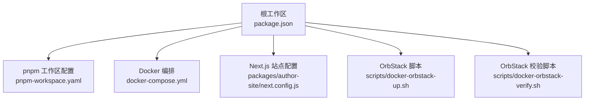
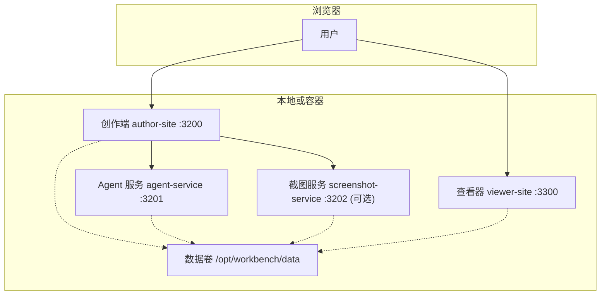
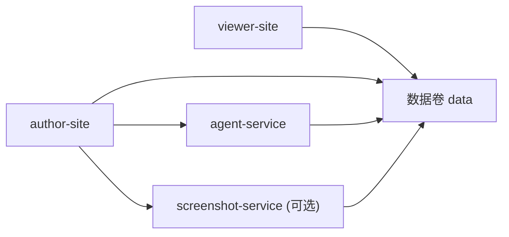

# 快速开始

<cite>
**本文引用的文件**   
- [package.json](file://package.json)
- [docker-compose.yml](file://docker-compose.yml)
- [pnpm-workspace.yaml](file://pnpm-workspace.yaml)
- [.npmrc](file://.npmrc)
- [packages/author-site/next.config.js](file://packages/author-site/next.config.js)
- [scripts/docker-orbstack-up.sh](file://scripts/docker-orbstack-up.sh)
- [scripts/docker-orbstack-verify.sh](file://scripts/docker-orbstack-verify.sh)
</cite>

## 目录
1. [简介](#简介)
2. [项目结构](#项目结构)
3. [核心组件](#核心组件)
4. [架构总览](#架构总览)
5. [详细组件分析](#详细组件分析)
6. [依赖关系分析](#依赖关系分析)
7. [性能与资源建议](#性能与资源建议)
8. [故障排除指南](#故障排除指南)
9. [结论](#结论)
10. [附录](#附录)

## 简介
本指南面向首次接触 Workbench 平台的开发者，帮助你在最短时间内完成本地开发环境搭建、容器化部署验证，并体验创作端与预览服务。你将了解：
- 前置要求（Node.js 18+、pnpm 8.15.0）
- 代码克隆、依赖安装、环境变量配置与服务启动
- Docker Compose 一键拉起多服务（含可选截图服务）
- OrbStack 集成与本地验证流程
- 基本使用示例（创建第一个项目、启动预览、访问创作端）
- 常见问题排查

## 项目结构
Workbench 采用 monorepo 组织方式，根目录通过 pnpm workspace 管理多个子包，包含创作端、查看器、Agent 服务、截图服务等。关键入口与脚本集中在根 package.json 中，容器编排由 docker-compose.yml 定义。

图表来源
- [package.json:1-101](file://package.json#L1-L101)
- [docker-compose.yml:1-140](file://docker-compose.yml#L1-L140)
- [packages/author-site/next.config.js:1-24](file://packages/author-site/next.config.js#L1-L24)
- [scripts/docker-orbstack-up.sh](file://scripts/docker-orbstack-up.sh)
- [scripts/docker-orbstack-verify.sh](file://scripts/docker-orbstack-verify.sh)

章节来源
- [package.json:1-101](file://package.json#L1-L101)
- [pnpm-workspace.yaml](file://pnpm-workspace.yaml)
- [docker-compose.yml:1-140](file://docker-compose.yml#L1-L140)

## 核心组件
- 创作端（author-site）：提供可视化创作界面，默认端口 3200
- Agent 服务（agent-service）：AI 能力与业务逻辑后端，默认端口 3201
- 截图服务（screenshot-service，可选）：基于 Chromium 的页面截图，默认端口 3202
- 查看器（viewer-site）：静态内容展示，默认端口映射到 3300

这些服务在 docker-compose.yml 中统一编排，支持数据卷挂载与资源限制。

章节来源
- [docker-compose.yml:1-140](file://docker-compose.yml#L1-L140)

## 架构总览
下图展示了本地开发与容器化运行时的主要服务及其交互关系。

图表来源
- [docker-compose.yml:1-140](file://docker-compose.yml#L1-L140)

## 详细组件分析

### 环境准备与本地开发
- Node.js 版本要求：>=18.0.0
- 包管理器：pnpm@8.15.0（通过 packageManager 字段锁定）
- 推荐工具链：corepack（用于自动启用指定 pnpm 版本）

步骤概览
1. 克隆仓库并进入项目根目录
2. 确保 Node.js 版本满足要求；建议使用 corepack 启用 pnpm 8.15.0
3. 安装依赖（monorepo 根执行）
4. 配置环境变量（见“环境变量”小节）
5. 启动开发服务（可并行启动全部或按需选择）

常用命令（来自根 scripts）
- 全量开发模式：dev
- 仅启动创作端：dev:author
- 启动创作端 + 截图服务：dev:preview
- 启动 Agent 服务：dev:agent
- 启动查看器：dev:viewer

章节来源
- [package.json:1-101](file://package.json#L1-L101)

### 环境变量配置
- Next.js 站点会从根目录 .env 加载变量（若存在），以便注入到构建期与运行期
- 建议在根目录创建 .env 文件，集中管理如 INTERNAL_API_TOKEN 等变量

注意
- 某些变量仅在容器运行时生效（由 docker-compose.yml 注入）
- 本地开发时，请确保 Next.js 能读取到必要的环境变量

章节来源
- [packages/author-site/next.config.js:1-24](file://packages/author-site/next.config.js#L1-L24)

### 容器化部署（Docker Compose）
- 服务列表：agent-service、author-site、screenshot-service（profile: screenshot）、viewer-site
- 端口映射：
  - 创作端：3200
  - Agent 服务：3201
  - 截图服务：3202（可选）
  - 查看器：3300
- 数据持久化：通过 APP_DATA_DIR 环境变量映射到宿主路径（默认 /opt/workbench/data）
- 资源限制：CPU、内存、进程数上限已在 compose 中设置
- 健康检查：截图服务提供 /health 健康检查

启动方式
- 基础服务（不含截图服务）：使用提供的脚本或直接 docker compose up
- 包含截图服务：使用 --with-screenshot 参数或显式指定 profile

章节来源
- [docker-compose.yml:1-140](file://docker-compose.yml#L1-L140)

### OrbStack 集成与本地验证
- 提供便捷脚本以配合 OrbStack 启动与验证
- 常用脚本：
  - 启动（可选包含截图服务）：scripts/docker-orbstack-up.sh
  - 验证服务可用性：scripts/docker-orbstack-verify.sh

建议流程
1. 安装并启动 OrbStack
2. 在项目根目录执行启动脚本
3. 等待服务就绪后，打开浏览器访问创作端与查看器
4. 使用验证脚本确认各服务状态

章节来源
- [scripts/docker-orbstack-up.sh](file://scripts/docker-orbstack-up.sh)
- [scripts/docker-orbstack-verify.sh](file://scripts/docker-orbstack-verify.sh)

### 基本使用示例
- 访问创作端：http://localhost:3200
- 访问查看器：http://localhost:3300
- 创建第一个项目：在创作端中新建项目并按提示完成初始化
- 启动预览：在创作端内触发预览，或通过脚本启动本地生产预览模式
- 截图功能（可选）：确保截图服务已启动，并在创作端中启用相关能力

章节来源
- [docker-compose.yml:1-140](file://docker-compose.yml#L1-L140)
- [package.json:1-101](file://package.json#L1-L101)

## 依赖关系分析
- 包管理与工作区：pnpm workspace 统一管理子包依赖
- 服务间依赖：
  - author-site 依赖 agent-service 与可选的 screenshot-service
  - viewer-site 只读挂载数据卷，依赖 author-site 产出的数据
- 外部依赖：
  - 截图服务依赖 Chromium（容器内预装）
  - Agent 服务可配置第三方模型提供商（通过环境变量）

图表来源
- [docker-compose.yml:1-140](file://docker-compose.yml#L1-L140)

章节来源
- [pnpm-workspace.yaml](file://pnpm-workspace.yaml)
- [docker-compose.yml:1-140](file://docker-compose.yml#L1-L140)

## 性能与资源建议
- CPU/内存限制：compose 已为各服务设置合理上限，可根据本机性能调整
- 截图服务：需要更多内存与共享内存空间，建议至少 1.5GB 内存与 256MB shm_size
- 数据卷：将 APP_DATA_DIR 指向 SSD 以提升 I/O 性能
- 网络：确保防火墙放行 3200/3201/3202/3300 端口

[本节为通用指导，无需源码引用]

## 故障排除指南
- 端口冲突
  - 现象：服务无法启动或浏览器无法访问
  - 处理：修改 docker-compose.yml 中的端口映射或停止占用端口的进程
- 环境变量未生效
  - 现象：创作端缺少 API Token 或模型配置
  - 处理：确认 .env 文件位于根目录且格式正确；容器模式下检查 compose 的 environment 注入
- 截图服务不可用
  - 现象：预览无法生成截图
  - 处理：确认已启用 screenshot profile；检查 /health 接口；必要时增大 shm_size
- 数据卷权限问题
  - 现象：写入失败或数据不同步
  - 处理：检查 APP_DATA_DIR 的读写权限；确保容器内外用户一致
- 依赖安装失败
  - 现象：pnpm 安装报错
  - 处理：确认 Node.js 版本与 pnpm 版本；清理缓存后重试

章节来源
- [docker-compose.yml:1-140](file://docker-compose.yml#L1-L140)
- [packages/author-site/next.config.js:1-24](file://packages/author-site/next.config.js#L1-L24)
- [package.json:1-101](file://package.json#L1-L101)

## 结论
通过以上步骤，你可以在本地快速搭建 Workbench 开发环境，并使用 Docker Compose 与 OrbStack 进行容器化验证。按照本文指引，你将能够顺利创建项目、启动预览并访问创作端与查看器。遇到问题时，参考故障排除部分定位并解决。

[本节为总结性内容，无需源码引用]

## 附录

### 常用命令速查
- 安装依赖：在根目录执行 pnpm install（或使用 corepack pnpm）
- 启动所有开发服务：pnpm dev
- 仅启动创作端：pnpm dev:author
- 启动创作端 + 截图服务：pnpm dev:preview
- 启动 Agent 服务：pnpm dev:agent
- 启动查看器：pnpm dev:viewer
- 使用 OrbStack 启动（可选截图服务）：pnpm docker:orbstack 或 pnpm docker:orbstack:screenshot
- 验证服务状态：pnpm docker:orbstack:verify

章节来源
- [package.json:1-101](file://package.json#L1-L101)
- [scripts/docker-orbstack-up.sh](file://scripts/docker-orbstack-up.sh)
- [scripts/docker-orbstack-verify.sh](file://scripts/docker-orbstack-verify.sh)