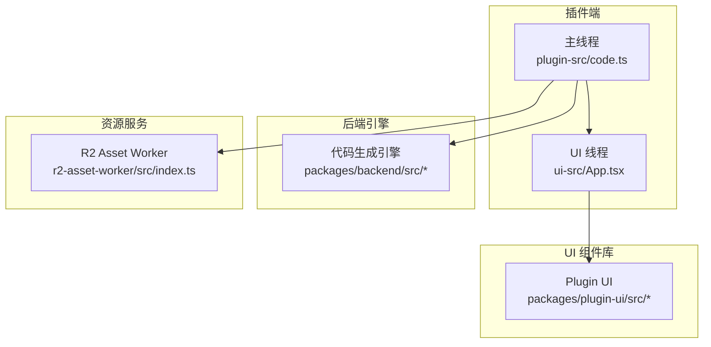
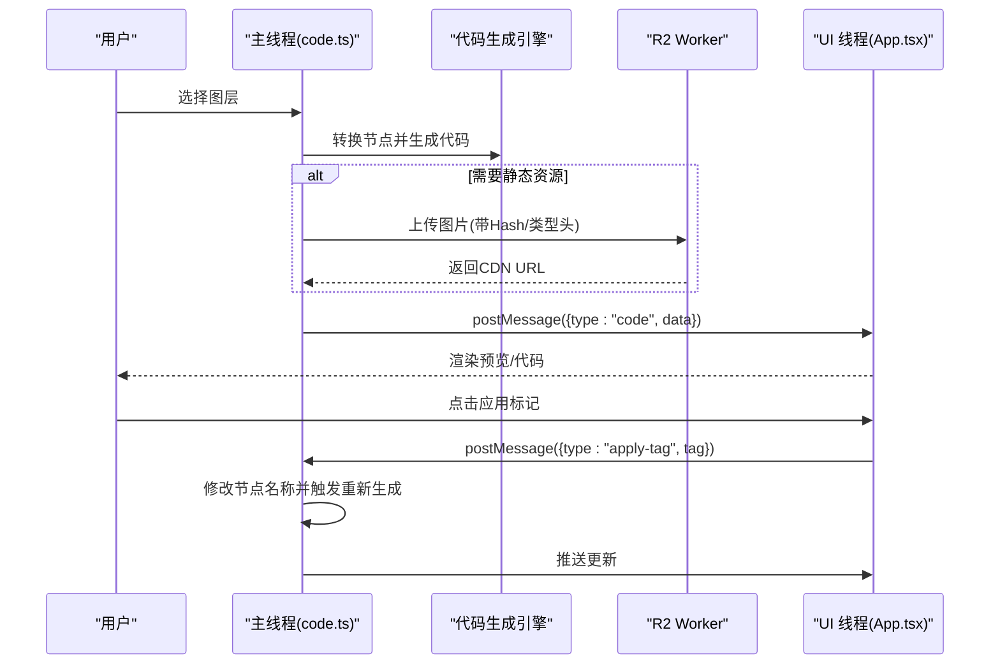
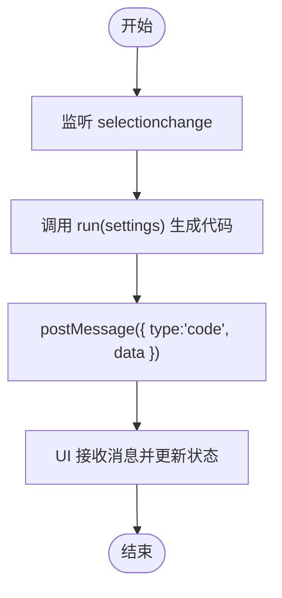
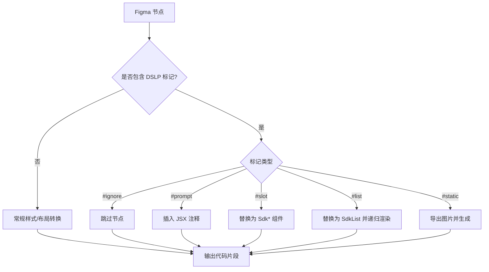
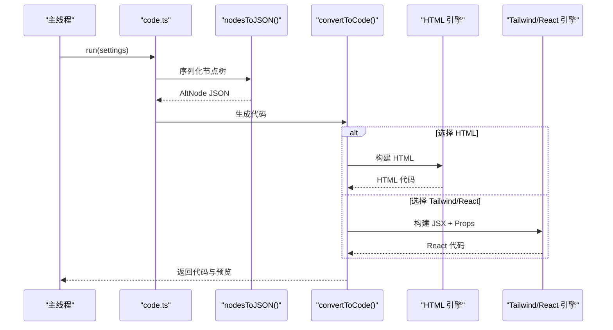
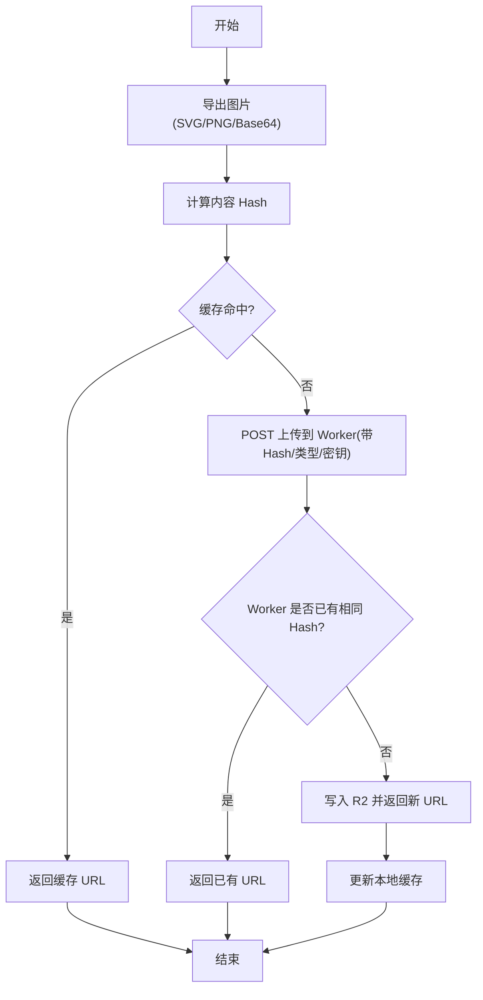
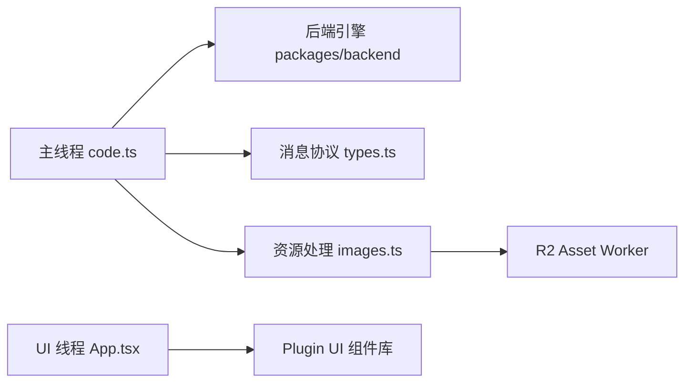

# Figma 集成

<cite>
**本文引用的文件**   
- [Figma插件架构.md](file://docs/项目文档/figma插件/技术/Figma插件架构.md)
- [代码生成引擎.md](file://docs/项目文档/figma插件/技术/代码生成引擎.md)
- [资源处理与上传.md](file://docs/项目文档/figma插件/技术/资源处理与上传.md)
</cite>

## 目录
1. [引言](#引言)
2. [项目结构](#项目结构)
3. [核心组件](#核心组件)
4. [架构总览](#架构总览)
5. [详细组件分析](#详细组件分析)
6. [依赖关系分析](#依赖关系分析)
7. [性能考虑](#性能考虑)
8. [故障排查指南](#故障排查指南)
9. [结论](#结论)
10. [附录](#附录)

## 引言
本指南面向需要在 Workbench 中集成 Figma 插件的开发者，围绕双线程架构、标记系统、代码生成引擎、UI 组件库、资源处理与上传机制，以及开发环境与发布流程进行系统化说明。目标是帮助读者快速理解从 Figma 节点到 HTML/CSS/React 代码的完整链路，并掌握调试与排障方法。

## 项目结构
整体采用“插件端 + 后端引擎 + UI 组件库 + 资源 Worker”的分层组织：
- 插件端（主线程与 UI 线程）负责与 Figma API 交互、用户界面渲染与消息通信
- 后端引擎提供双引擎（HTML / Tailwind+React）的代码生成能力
- UI 组件库封装通用 React 组件与偏好配置
- 资源 Worker 负责图片导出与上传至对象存储并返回 CDN URL

图表来源
- [Figma插件架构.md:269-320](file://docs/项目文档/figma插件/技术/Figma插件架构.md#L269-L320)

章节来源
- [Figma插件架构.md:269-320](file://docs/项目文档/figma插件/技术/Figma插件架构.md#L269-L320)

## 核心组件
- 主线程：初始化设置、监听选区变化、调用代码生成引擎、与 UI 线程通信
- UI 线程：React 应用、用户交互、向主线程发送指令、展示结果
- 代码生成引擎：将 Figma 节点树转换为 HTML 或 Tailwind/React 代码，支持 DSLP 标记解析与 Props 自动生成
- 资源处理与上传：导出图片、并发控制、缓存与去重、上传至 R2 并返回 CDN URL
- UI 组件库：封装预览工具栏、标签面板、偏好设置等通用组件

章节来源
- [Figma插件架构.md:41-96](file://docs/项目文档/figma插件/技术/Figma插件架构.md#L41-L96)
- [代码生成引擎.md:50-122](file://docs/项目文档/figma插件/技术/代码生成引擎.md#L50-L122)
- [资源处理与上传.md:42-117](file://docs/项目文档/figma插件/技术/资源处理与上传.md#L42-L117)

## 架构总览
Figma 插件采用双线程架构，主线程负责与 Figma API 交互和代码生成调度，UI 线程通过 iframe 承载 React 应用，两者通过 postMessage/onmessage 通信。

图表来源
- [Figma插件架构.md:199-266](file://docs/项目文档/figma插件/技术/Figma插件架构.md#L199-L266)
- [资源处理与上传.md:126-162](file://docs/项目文档/figma插件/技术/资源处理与上传.md#L126-L162)

## 详细组件分析

### 双线程架构与通信机制
- 职责分离
  - 主线程：访问 Figma API、读取/修改文档、导出图片、调用代码生成、管理消息分发
  - UI 线程：React 渲染、用户交互、事件处理、展示代码与预览
- 消息类型定义
  - 主线程→UI：code、empty、error、update-selection-tags、check-layers-result、document-changed、locked-preview-update
  - UI→主线程：apply-tag、toggle-static、set-layout-mode、update-ai-instruction、check-layers、select-layer-by-id、select-layer-by-warning、reconvert-node、update-settings
- 典型流程
  - 选区变化触发代码生成
  - 用户应用标记后修改节点名并重新生成
  - 预览锁定与文档变更后的增量重转换

图表来源
- [Figma插件架构.md:199-220](file://docs/项目文档/figma插件/技术/Figma插件架构.md#L199-L220)

章节来源
- [Figma插件架构.md:41-96](file://docs/项目文档/figma插件/技术/Figma插件架构.md#L41-L96)
- [Figma插件架构.md:99-197](file://docs/项目文档/figma插件/技术/Figma插件架构.md#L99-L197)
- [Figma插件架构.md:199-266](file://docs/项目文档/figma插件/技术/Figma插件架构.md#L199-L266)

### 标记系统与命名规范
- 标记识别与处理
  - #ignore：跳过节点
  - #prompt：转为 JSX 注释
  - #slot:type:id：替换为 SdkImage/SdkText/SdkVideo 组件
  - #list:id：替换为 SdkList 组件并递归渲染子节点
  - #static：导出为图片并生成  标签
- 命名建议
  - 使用语义化前缀区分功能区域与元素类型
  - 列表项与插槽 ID 保持唯一且稳定，便于 Props 自动推断与后续维护
- 属性映射与转换规则
  - 尺寸、位置、填充、边框、圆角、阴影、布局等均映射为 CSS/Tailwind 类名
  - Auto Layout 映射为 Flexbox 相关类名

图表来源
- [代码生成引擎.md:110-122](file://docs/项目文档/figma插件/技术/代码生成引擎.md#L110-L122)
- [代码生成引擎.md:171-199](file://docs/项目文档/figma插件/技术/代码生成引擎.md#L171-L199)

章节来源
- [代码生成引擎.md:110-122](file://docs/项目文档/figma插件/技术/代码生成引擎.md#L110-L122)
- [代码生成引擎.md:171-199](file://docs/项目文档/figma插件/技术/代码生成引擎.md#L171-L199)

### 代码生成引擎工作流程
- 入口调度
  - run(settings)：选择节点 → 转换为 AltNode JSON → 调用 convertToCode() → 生成预览
- 节点转换层
  - nodesToJSON()：提取核心属性、处理颜色变量与样式引用、递归构建纯 JSON 树
- 双引擎实现
  - HTML 引擎：输出 HTML + CSS，适合预览与静态页面
  - Tailwind/React 引擎：输出 Tailwind 类名的 React 组件，支持 DSLP 标记拦截与 Props 自动生成
- Props 自动生成
  - 在生成 JSX 的同时收集 #slot/#list 字段，注入 interface Props 及元数据注释，辅助工作台编译配置面板

图表来源
- [代码生成引擎.md:50-99](file://docs/项目文档/figma插件/技术/代码生成引擎.md#L50-L99)
- [代码生成引擎.md:124-168](file://docs/项目文档/figma插件/技术/代码生成引擎.md#L124-L168)

章节来源
- [代码生成引擎.md:50-99](file://docs/项目文档/figma插件/技术/代码生成引擎.md#L50-L99)
- [代码生成引擎.md:124-168](file://docs/项目文档/figma插件/技术/代码生成引擎.md#L124-L168)

### UI 组件库设计模式
- 组件封装
  - 以 React 函数组件为主，统一 props 接口与默认值
  - 通过 PluginUI 容器组合各功能模块（预览、标签、偏好设置）
- 状态管理
  - 基于 React useState/useEffect 管理本地状态
  - 通过 window.onmessage 与主线程同步状态
- 用户交互处理
  - 按钮点击、输入校验、错误提示与重试
  - 与主线程协作完成标记应用、布局模式切换、AI 指令更新等操作

章节来源
- [Figma插件架构.md:70-96](file://docs/项目文档/figma插件/技术/Figma插件架构.md#L70-L96)
- [Figma插件架构.md:269-320](file://docs/项目文档/figma插件/技术/Figma插件架构.md#L269-L320)

### 资源处理与上传机制
- 插件端
  - 图片导出：支持 Uint8Array/Base64/SVG 导出
  - 缓存机制：内存 Map 缓存已上传资源的 hash→url
  - 并发控制：队列 + 信号量限制最大并发数
  - Hash 计算：优先 SHA-256，降级 FNV-1a
- Worker 端
  - 接收上传请求，校验密钥与类型
  - 检查 R2 是否存在相同 Hash 的文件，存在则直接返回已有 URL
  - 写入 R2 并返回 { url, hash, size }
- 使用场景
  - #static 标记：导出 PNG 并上传，生成  标签
  - VECTOR 节点：可内嵌 SVG 或上传 CDN，失败回退占位
  - 图片填充：导出并上传，生成背景图或  标签
  - Base64 内嵌：作为备用方案

图表来源
- [资源处理与上传.md:56-117](file://docs/项目文档/figma插件/技术/资源处理与上传.md#L56-L117)
- [资源处理与上传.md:126-162](file://docs/项目文档/figma插件/技术/资源处理与上传.md#L126-L162)

章节来源
- [资源处理与上传.md:42-117](file://docs/项目文档/figma插件/技术/资源处理与上传.md#L42-L117)
- [资源处理与上传.md:126-162](file://docs/项目文档/figma插件/技术/资源处理与上传.md#L126-L162)
- [资源处理与上传.md:166-213](file://docs/项目文档/figma插件/技术/资源处理与上传.md#L166-L213)

## 依赖关系分析
- 插件端依赖后端引擎进行代码生成，并通过消息协议与 UI 线程解耦
- UI 组件库被插件 UI 线程复用，降低重复实现成本
- 资源上传依赖外部 Worker 服务，插件端仅持有上传端点与密钥策略

图表来源
- [Figma插件架构.md:269-320](file://docs/项目文档/figma插件/技术/Figma插件架构.md#L269-L320)
- [资源处理与上传.md:13-38](file://docs/项目文档/figma插件/技术/资源处理与上传.md#L13-L38)

章节来源
- [Figma插件架构.md:269-320](file://docs/项目文档/figma插件/技术/Figma插件架构.md#L269-L320)
- [资源处理与上传.md:13-38](file://docs/项目文档/figma插件/技术/资源处理与上传.md#L13-L38)

## 性能考虑
- 执行缓存：避免重复计算样式与转换逻辑
- 资源缓存：按内容 Hash 去重，减少重复上传
- 并发控制：限制图片上传并发，防止内存溢出
- 增量更新：文档变更后对锁定节点进行节流重转换，提升响应速度

章节来源
- [代码生成引擎.md:202-213](file://docs/项目文档/figma插件/技术/代码生成引擎.md#L202-L213)
- [资源处理与上传.md:78-93](file://docs/项目文档/figma插件/技术/资源处理与上传.md#L78-L93)

## 故障排查指南
- 主线程调试
  - 使用 console.log 与 figma.notify 输出关键信息
- UI 线程调试
  - 使用浏览器 DevTools 检查插件界面与消息收发
- 消息调试
  - 在消息处理处统一打印日志，确认 type 与 payload 是否符合预期
- 常见错误与处理
  - 上传超时：降级为 Base64 内嵌
  - Worker 不可用：使用占位图并给出警告提示
  - Hash 冲突：信任缓存并使用已有 URL
  - 内存不足：降低并发数并分批处理

章节来源
- [Figma插件架构.md:392-418](file://docs/项目文档/figma插件/技术/Figma插件架构.md#L392-L418)
- [资源处理与上传.md:279-296](file://docs/项目文档/figma插件/技术/资源处理与上传.md#L279-L296)

## 结论
本指南梳理了 Figma 插件集成的双线程架构、标记系统、代码生成引擎、UI 组件库与资源上传机制，提供了端到端的流程图与排障建议。遵循本文档的设计与最佳实践，可在保证性能与可维护性的前提下高效完成从设计稿到前端代码的自动化产出。

## 附录
- 开发环境搭建
  - 启动 UI 开发服务器并在 Figma 中添加开发插件
  - 生产构建产物位于 dist 目录，包含 code.js 与 index.html
- 发布流程
  - 构建生产版本 → 在 Figma 开发者面板创建新版本 → 上传 dist 内容 → 提交审核或内部分发

章节来源
- [Figma插件架构.md:359-389](file://docs/项目文档/figma插件/技术/Figma插件架构.md#L359-L389)