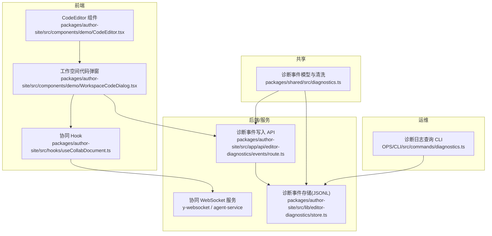
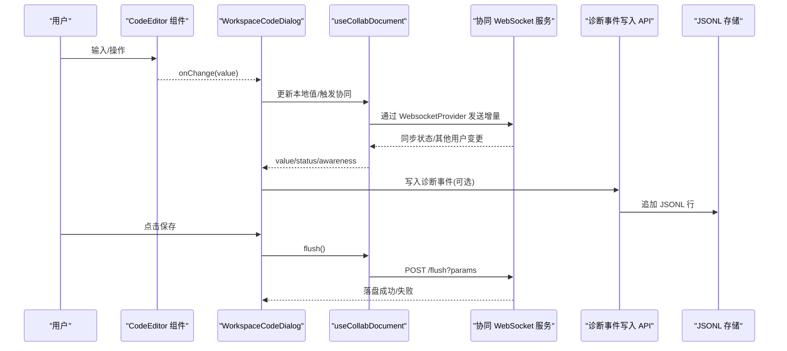
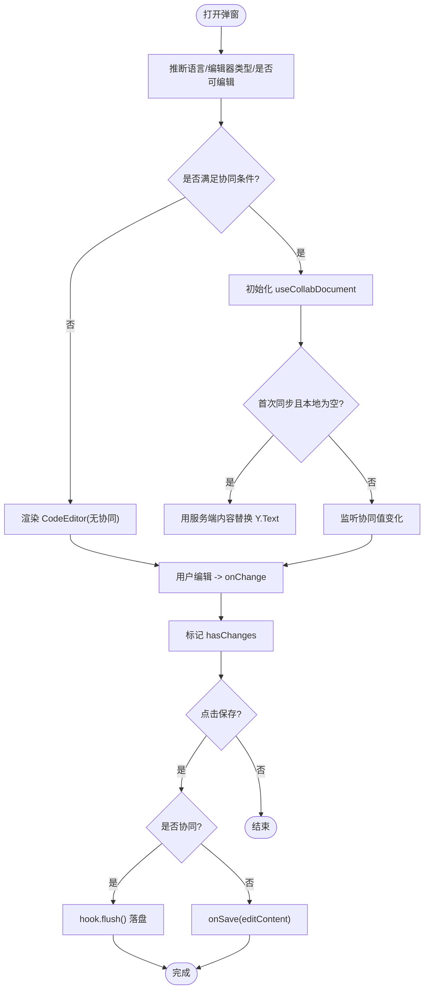
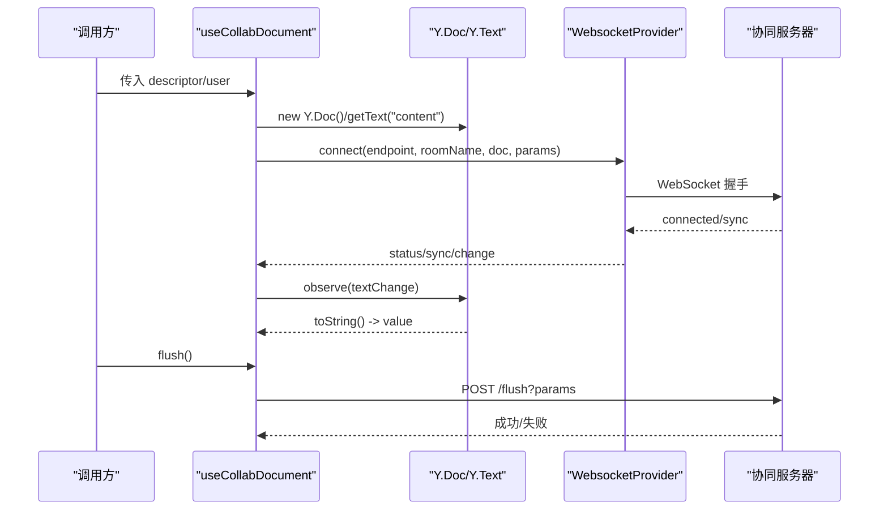
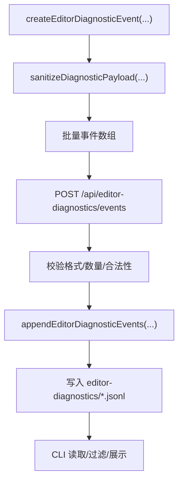
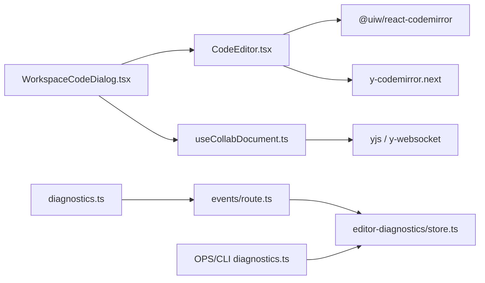

# CodeEditor 代码编辑器

<cite>
**本文引用的文件**   
- [packages/author-site/src/components/demo/CodeEditor.tsx](file://packages/author-site/src/components/demo/CodeEditor.tsx)
- [packages/author-site/src/components/demo/WorkspaceCodeDialog.tsx](file://packages/author-site/src/components/demo/WorkspaceCodeDialog.tsx)
- [packages/author-site/src/hooks/useCollabDocument.ts](file://packages/author-site/src/hooks/useCollabDocument.ts)
- [packages/shared/src/diagnostics.ts](file://packages/shared/src/diagnostics.ts)
- [packages/author-site/src/app/api/editor-diagnostics/events/route.ts](file://packages/author-site/src/app/api/editor-diagnostics/events/route.ts)
- [packages/author-site/src/lib/editor-diagnostics/store.ts](file://packages/author-site/src/lib/editor-diagnostics/store.ts)
- [OPS/CLI/src/commands/diagnostics.ts](file://OPS/CLI/src/commands/diagnostics.ts)
</cite>

## 目录
1. [简介](#简介)
2. [项目结构](#项目结构)
3. [核心组件](#核心组件)
4. [架构总览](#架构总览)
5. [详细组件分析](#详细组件分析)
6. [依赖关系分析](#依赖关系分析)
7. [性能与体验优化](#性能与体验优化)
8. [故障排查指南](#故障排查指南)
9. [结论](#结论)
10. [附录：配置 API 与使用示例](#附录配置-api-与使用示例)

## 简介
本技术文档围绕基于 Monaco Editor 的封装目标，结合仓库中实际实现的“基于 CodeMirror 6”的 CodeEditor 组件进行系统化说明。内容涵盖语法高亮、自动补全、折叠、只读模式、协同编辑（Yjs + y-codemirror）、状态同步策略（主线程通信、实时保存、版本控制集成）、诊断事件采集与持久化、以及高级编辑能力的使用建议与扩展点。同时提供完整的编辑器配置 API 和使用示例，帮助读者快速集成与二次开发。

## 项目结构
- 前端编辑器封装位于 author-site 包，采用 React + CodeMirror 6 实现，并通过 hooks 管理协同与状态。
- 共享的诊断事件模型与清洗逻辑位于 shared 包，便于前后端统一规范。
- 诊断事件写入 API 与本地 JSONL 存储位于 author-site 包。
- CLI 工具用于读取与解析诊断日志，辅助排障与分析。



图表来源
- [packages/author-site/src/components/demo/CodeEditor.tsx:1-89](file://packages/author-site/src/components/demo/CodeEditor.tsx#L1-L89)
- [packages/author-site/src/components/demo/WorkspaceCodeDialog.tsx:1-297](file://packages/author-site/src/components/demo/WorkspaceCodeDialog.tsx#L1-L297)
- [packages/author-site/src/hooks/useCollabDocument.ts:1-346](file://packages/author-site/src/hooks/useCollabDocument.ts#L1-L346)
- [packages/author-site/src/app/api/editor-diagnostics/events/route.ts:43-72](file://packages/author-site/src/app/api/editor-diagnostics/events/route.ts#L43-L72)
- [packages/author-site/src/lib/editor-diagnostics/store.ts:330-373](file://packages/author-site/src/lib/editor-diagnostics/store.ts#L330-L373)
- [packages/shared/src/diagnostics.ts:1-540](file://packages/shared/src/diagnostics.ts#L1-L540)
- [OPS/CLI/src/commands/diagnostics.ts:417-473](file://OPS/CLI/src/commands/diagnostics.ts#L417-L473)

章节来源
- [packages/author-site/src/components/demo/CodeEditor.tsx:1-89](file://packages/author-site/src/components/demo/CodeEditor.tsx#L1-L89)
- [packages/author-site/src/components/demo/WorkspaceCodeDialog.tsx:1-297](file://packages/author-site/src/components/demo/WorkspaceCodeDialog.tsx#L1-L297)
- [packages/author-site/src/hooks/useCollabDocument.ts:1-346](file://packages/author-site/src/hooks/useCollabDocument.ts#L1-L346)
- [packages/shared/src/diagnostics.ts:1-540](file://packages/shared/src/diagnostics.ts#L1-L540)
- [packages/author-site/src/app/api/editor-diagnostics/events/route.ts:43-72](file://packages/author-site/src/app/api/editor-diagnostics/events/route.ts#L43-L72)
- [packages/author-site/src/lib/editor-diagnostics/store.ts:330-373](file://packages/author-site/src/lib/editor-diagnostics/store.ts#L330-L373)
- [OPS/CLI/src/commands/diagnostics.ts:417-473](file://OPS/CLI/src/commands/diagnostics.ts#L417-L473)

## 核心组件
- CodeEditor 组件：基于 @uiw/react-codemirror 封装，支持 TypeScript/JSON 语法高亮、基础编辑功能（行号、括号匹配、自动缩进、折叠、自动补全）与只读模式；可选接入 Yjs 协同。
- WorkspaceCodeDialog：工作空间代码查看/编辑弹窗，负责语言推断、可编辑性判定、协同连接、本地草稿与远端落盘、用户提示等。
- useCollabDocument：协同 Hook，维护 Y.Doc/Y.Text/WebsocketProvider，处理连接状态、在线用户感知、文本变更监听、flush 落盘等。
- 诊断系统：统一的诊断事件模型、清洗与归一化、API 写入、JSONL 持久化、CLI 读取与展示。

章节来源
- [packages/author-site/src/components/demo/CodeEditor.tsx:1-89](file://packages/author-site/src/components/demo/CodeEditor.tsx#L1-L89)
- [packages/author-site/src/components/demo/WorkspaceCodeDialog.tsx:1-297](file://packages/author-site/src/components/demo/WorkspaceCodeDialog.tsx#L1-L297)
- [packages/author-site/src/hooks/useCollabDocument.ts:1-346](file://packages/author-site/src/hooks/useCollabDocument.ts#L1-L346)
- [packages/shared/src/diagnostics.ts:1-540](file://packages/shared/src/diagnostics.ts#L1-L540)

## 架构总览
下图展示了从编辑器到协同服务、再到持久化与诊断的全链路交互。



图表来源
- [packages/author-site/src/components/demo/CodeEditor.tsx:1-89](file://packages/author-site/src/components/demo/CodeEditor.tsx#L1-L89)
- [packages/author-site/src/components/demo/WorkspaceCodeDialog.tsx:1-297](file://packages/author-site/src/components/demo/WorkspaceCodeDialog.tsx#L1-L297)
- [packages/author-site/src/hooks/useCollabDocument.ts:1-346](file://packages/author-site/src/hooks/useCollabDocument.ts#L1-L346)
- [packages/author-site/src/app/api/editor-diagnostics/events/route.ts:43-72](file://packages/author-site/src/app/api/editor-diagnostics/events/route.ts#L43-L72)
- [packages/author-site/src/lib/editor-diagnostics/store.ts:330-373](file://packages/author-site/src/lib/editor-diagnostics/store.ts#L330-L373)

## 详细组件分析

### CodeEditor 组件
- 语法高亮：根据 language 动态注入 JavaScript/JSON 语言扩展。
- 基础编辑：启用行号、活动行高亮、括号匹配、自动闭合、输入缩进、折叠侧边栏、自动补全（非只读）。
- 只读模式：通过 EditorView.editable.of(false) 禁用编辑。
- 协同集成：当传入 collab.ytext 与 awareness 时，挂载 y-codemirror.next 的 yCollab 扩展，将编辑器内容与 Y.Text 双向绑定。
- 主题与样式：使用 vscodeDark 主题，并微调字体、字号与 gutters 宽度。

```mermaid
classDiagram
class CodeEditor {
+value : string
+onChange(value) : void
+language : "typescript"|"json"|"text"
+readOnly : boolean
+height : string
+collab? : { ytext, awareness }
}
class CodeMirror {
+extensions : any[]
+basicSetup : object
+theme : any
}
class Yjs {
+ytext : Y.Text
+awareness : Awareness
}
CodeEditor --> CodeMirror : "渲染"
CodeEditor --> Yjs : "可选协同"
```

图表来源
- [packages/author-site/src/components/demo/CodeEditor.tsx:1-89](file://packages/author-site/src/components/demo/CodeEditor.tsx#L1-L89)

章节来源
- [packages/author-site/src/components/demo/CodeEditor.tsx:1-89](file://packages/author-site/src/components/demo/CodeEditor.tsx#L1-L89)

### WorkspaceCodeDialog 弹窗
- 文件类型与语言推断：根据路径决定编辑器类型与语言。
- 协同资源判定：按路径规则映射为协同资源 kind，决定是否开启协同。
- 状态同步：打开弹窗时重置本地状态；协同未就绪且初始为空时，用服务端内容初始化 Y.Text；后续以协同值为权威源，合并本地编辑标记。
- 保存流程：若开启协同则调用 flush 落盘；否则直接 onSave；成功后提示并关闭弹窗。
- 用户体验：显示当前协作者头像、状态文案、复制按钮、保存按钮与加载态。



图表来源
- [packages/author-site/src/components/demo/WorkspaceCodeDialog.tsx:1-297](file://packages/author-site/src/components/demo/WorkspaceCodeDialog.tsx#L1-L297)

章节来源
- [packages/author-site/src/components/demo/WorkspaceCodeDialog.tsx:1-297](file://packages/author-site/src/components/demo/WorkspaceCodeDialog.tsx#L1-L297)

### useCollabDocument 协同 Hook
- 连接管理：根据 descriptor 构造房间名与 endpoint，创建 WebsocketProvider，订阅 status/sync/connection-error 事件。
- 数据模型：维护 Y.Doc 与 Y.Text("content")，通过 text.observe 同步 value。
- 用户感知：设置 awareness 本地字段，监听 change 事件，去重比较后更新 users 列表。
- 离线保护：断开超过阈值后切换为 offline 状态。
- 落盘接口：flush 调用 HTTP 接口将协同草稿持久化，并更新状态。



图表来源
- [packages/author-site/src/hooks/useCollabDocument.ts:1-346](file://packages/author-site/src/hooks/useCollabDocument.ts#L1-L346)

章节来源
- [packages/author-site/src/hooks/useCollabDocument.ts:1-346](file://packages/author-site/src/hooks/useCollabDocument.ts#L1-L346)

### 诊断事件体系
- 事件模型：统一 schemaVersion、ts、source、level、eventGroup、eventType、payload 等字段，兼容旧版结构。
- 安全清洗：对敏感键与禁止键做脱敏与摘要，限制 payload 深度与长度。
- 写入通道：前端批量提交至 API，服务端校验后追加到 JSONL 文件。
- 读取与展示：CLI 读取 JSONL 或数据库，归一化为标准事件供分析。



图表来源
- [packages/shared/src/diagnostics.ts:1-540](file://packages/shared/src/diagnostics.ts#L1-L540)
- [packages/author-site/src/app/api/editor-diagnostics/events/route.ts:43-72](file://packages/author-site/src/app/api/editor-diagnostics/events/route.ts#L43-L72)
- [packages/author-site/src/lib/editor-diagnostics/store.ts:330-373](file://packages/author-site/src/lib/editor-diagnostics/store.ts#L330-L373)
- [OPS/CLI/src/commands/diagnostics.ts:417-473](file://OPS/CLI/src/commands/diagnostics.ts#L417-L473)

章节来源
- [packages/shared/src/diagnostics.ts:1-540](file://packages/shared/src/diagnostics.ts#L1-L540)
- [packages/author-site/src/app/api/editor-diagnostics/events/route.ts:43-72](file://packages/author-site/src/app/api/editor-diagnostics/events/route.ts#L43-L72)
- [packages/author-site/src/lib/editor-diagnostics/store.ts:330-373](file://packages/author-site/src/lib/editor-diagnostics/store.ts#L330-L373)
- [OPS/CLI/src/commands/diagnostics.ts:417-473](file://OPS/CLI/src/commands/diagnostics.ts#L417-L473)

## 依赖关系分析
- 组件耦合
  - CodeEditor 仅依赖 CodeMirror 生态与 Yjs 协同扩展，职责单一，易于替换底层编辑器。
  - WorkspaceCodeDialog 聚合语言推断、协同 Hook、UI 交互与保存流程，承担编排职责。
  - useCollabDocument 独立于 UI，可被多处复用。
- 外部依赖
  - CodeMirror 6 生态：@uiw/react-codemirror、@codemirror/lang-*、@codemirror/view、y-codemirror.next。
  - Yjs 生态：yjs、y-websocket。
  - 诊断系统：shared 包中的事件模型与清洗函数。
- 潜在循环依赖
  - 当前未见循环引用；Hook 与组件单向依赖。
- 接口契约
  - useCollabDocument 返回稳定结构（value/status/awareness/provider/ydoc/ytext/flush/error），对外契约清晰。
  - 诊断事件写入 API 要求事件数组合法且不超过上限。



图表来源
- [packages/author-site/src/components/demo/CodeEditor.tsx:1-89](file://packages/author-site/src/components/demo/CodeEditor.tsx#L1-L89)
- [packages/author-site/src/components/demo/WorkspaceCodeDialog.tsx:1-297](file://packages/author-site/src/components/demo/WorkspaceCodeDialog.tsx#L1-L297)
- [packages/author-site/src/hooks/useCollabDocument.ts:1-346](file://packages/author-site/src/hooks/useCollabDocument.ts#L1-L346)
- [packages/shared/src/diagnostics.ts:1-540](file://packages/shared/src/diagnostics.ts#L1-L540)
- [packages/author-site/src/app/api/editor-diagnostics/events/route.ts:43-72](file://packages/author-site/src/app/api/editor-diagnostics/events/route.ts#L43-L72)
- [packages/author-site/src/lib/editor-diagnostics/store.ts:330-373](file://packages/author-site/src/lib/editor-diagnostics/store.ts#L330-L373)
- [OPS/CLI/src/commands/diagnostics.ts:417-473](file://OPS/CLI/src/commands/diagnostics.ts#L417-L473)

章节来源
- [packages/author-site/src/components/demo/CodeEditor.tsx:1-89](file://packages/author-site/src/components/demo/CodeEditor.tsx#L1-L89)
- [packages/author-site/src/components/demo/WorkspaceCodeDialog.tsx:1-297](file://packages/author-site/src/components/demo/WorkspaceCodeDialog.tsx#L1-L297)
- [packages/author-site/src/hooks/useCollabDocument.ts:1-346](file://packages/author-site/src/hooks/useCollabDocument.ts#L1-L346)
- [packages/shared/src/diagnostics.ts:1-540](file://packages/shared/src/diagnostics.ts#L1-L540)
- [packages/author-site/src/app/api/editor-diagnostics/events/route.ts:43-72](file://packages/author-site/src/app/api/editor-diagnostics/events/route.ts#L43-L72)
- [packages/author-site/src/lib/editor-diagnostics/store.ts:330-373](file://packages/author-site/src/lib/editor-diagnostics/store.ts#L330-L373)
- [OPS/CLI/src/commands/diagnostics.ts:417-473](file://OPS/CLI/src/commands/diagnostics.ts#L417-L473)

## 性能与体验优化
- 渲染性能
  - 使用 useMemo 构建 extensions，避免重复创建扩展实例。
  - basicSetup 已启用必要功能，按需开启以避免额外开销。
- 协同性能
  - Yjs 增量同步天然高效；注意在大型文档场景下合理拆分资源（按文件/页面维度）。
  - 使用 awareness 去重比较减少不必要的重渲染。
- 网络与容错
  - 断线重连与离线状态延迟判断提升稳定性。
  - flush 失败时明确错误状态，便于用户重试。
- 可扩展性
  - 语言扩展可按需引入，避免打包体积膨胀。
  - 诊断事件批量写入降低 I/O 压力。

[本节为通用指导，不直接分析具体文件]

## 故障排查指南
- 协同连接异常
  - 检查环境变量 NEXT_PUBLIC_COLLAB_WS_URL/NEXT_PUBLIC_AGENT_SERVICE_URL 是否正确。
  - 观察 hook 返回的 status/error，确认是否处于 connecting/offline/error。
- 保存失败
  - 检查 flush 请求是否成功，关注服务端返回码与错误信息。
  - 确认资源路径与 kind 参数正确。
- 诊断事件缺失
  - 确认 API 写入是否通过，检查 JSONL 文件是否存在与可读。
  - 使用 CLI 命令读取并过滤特定 session/project/workspace 的事件。

章节来源
- [packages/author-site/src/hooks/useCollabDocument.ts:1-346](file://packages/author-site/src/hooks/useCollabDocument.ts#L1-L346)
- [packages/author-site/src/app/api/editor-diagnostics/events/route.ts:43-72](file://packages/author-site/src/app/api/editor-diagnostics/events/route.ts#L43-L72)
- [packages/author-site/src/lib/editor-diagnostics/store.ts:330-373](file://packages/author-site/src/lib/editor-diagnostics/store.ts#L330-L373)
- [OPS/CLI/src/commands/diagnostics.ts:417-473](file://OPS/CLI/src/commands/diagnostics.ts#L417-L473)

## 结论
该 CodeEditor 组件以轻量封装的方式提供了丰富的编辑能力与协同支持，配合完善的诊断事件体系，形成了从编辑到落盘、从运行到排障的闭环。尽管当前实现基于 CodeMirror 6，但其设计具备良好的可替换性与扩展性，未来可平滑迁移至 Monaco Editor 或其他编辑器内核。

[本节为总结性内容，不直接分析具体文件]

## 附录：配置 API 与使用示例

### CodeEditor 配置 API
- 属性
  - value: string — 编辑器内容（仅在非协同模式下受控）
  - onChange?: (value: string) => void — 内容变更回调
  - language: "typescript" | "json" | "text" — 语言类型
  - readOnly?: boolean — 是否只读
  - height?: string — 高度样式
  - collab?: { ytext: Y.Text; awareness: unknown } — 协同上下文（可选）
- 行为
  - 当存在 collab 时，value 由 Y.Text 驱动，onChange 不再作为受控来源。
  - 只读模式下禁用编辑，但仍可浏览与搜索（取决于基础设置）。

章节来源
- [packages/author-site/src/components/demo/CodeEditor.tsx:1-89](file://packages/author-site/src/components/demo/CodeEditor.tsx#L1-L89)

### 使用示例（描述性）
- 基本用法：传入 value、onChange、language="typescript"，即可启用 TS/JSX 高亮与基础编辑。
- 只读模式：设置 readOnly=true，适合预览与展示。
- 协同模式：通过 useCollabDocument 获取 ytext 与 awareness，传入 collab，实现多人实时协作。
- 保存流程：在弹窗中点击保存时，若开启协同则调用 flush，否则直接 onSave。

章节来源
- [packages/author-site/src/components/demo/WorkspaceCodeDialog.tsx:1-297](file://packages/author-site/src/components/demo/WorkspaceCodeDialog.tsx#L1-L297)
- [packages/author-site/src/hooks/useCollabDocument.ts:1-346](file://packages/author-site/src/hooks/useCollabDocument.ts#L1-L346)

### 诊断事件写入（描述性）
- 前端构造事件：使用 createEditorDiagnosticEvent 生成标准化事件。
- 批量提交：POST /api/editor-diagnostics/events，服务端校验后写入 JSONL。
- 读取分析：使用 CLI 读取 JSONL 或数据库，过滤时间范围与事件类型。

章节来源
- [packages/shared/src/diagnostics.ts:1-540](file://packages/shared/src/diagnostics.ts#L1-L540)
- [packages/author-site/src/app/api/editor-diagnostics/events/route.ts:43-72](file://packages/author-site/src/app/api/editor-diagnostics/events/route.ts#L43-L72)
- [packages/author-site/src/lib/editor-diagnostics/store.ts:330-373](file://packages/author-site/src/lib/editor-diagnostics/store.ts#L330-L373)
- [OPS/CLI/src/commands/diagnostics.ts:417-473](file://OPS/CLI/src/commands/diagnostics.ts#L417-L473)