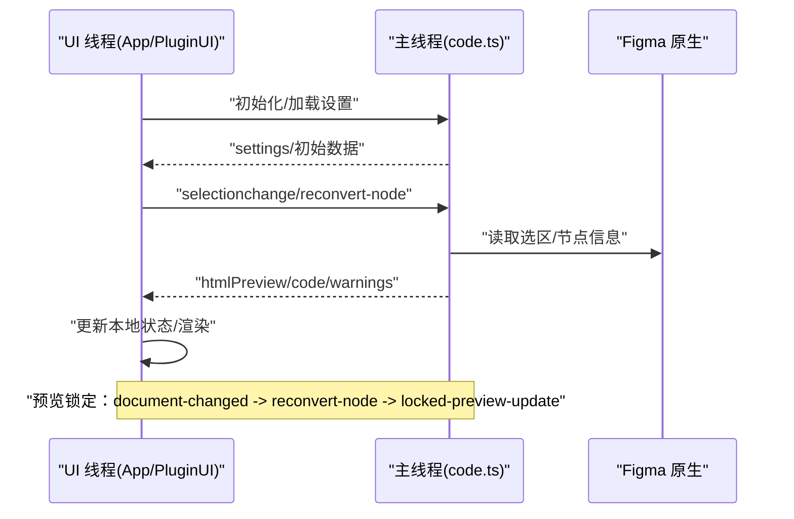
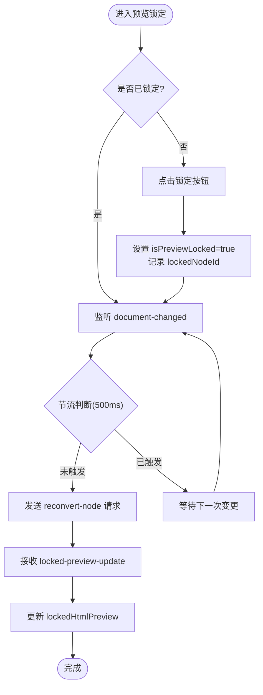

# PluginUI 主容器组件

<cite>
**本文引用的文件**   
- [Figma插件架构.md](file://docs/项目文档/figma插件/技术/Figma插件架构.md)
- [UI组件与交互.md](file://docs/项目文档/figma插件/技术/UI组件与交互.md)
</cite>

## 目录
1. [简介](#简介)
2. [项目结构](#项目结构)
3. [核心组件](#核心组件)
4. [架构总览](#架构总览)
5. [详细组件分析](#详细组件分析)
6. [依赖分析](#依赖分析)
7. [性能考虑](#性能考虑)
8. [故障排查指南](#故障排查指南)
9. [结论](#结论)
10. [附录](#附录)

## 简介
本文件面向 PluginUI 主容器组件，系统性阐述其架构设计、生命周期管理、状态初始化流程以及与 Figma 插件 API 的集成方式。同时覆盖属性配置（主题、布局、事件）、使用示例与最佳实践、错误边界处理与性能优化策略，帮助读者快速理解并高质量地使用该组件。

## 项目结构
根据仓库文档，PluginUI 作为 UI 线程中的 React 应用入口组件，位于 UI 线程代码中，由 App 组件渲染；主线程负责与 Figma 原生能力通信，并通过消息机制与 UI 线程双向通信。

```mermaid
graph TB
subgraph "UI 线程"
A["App.tsx<br/>注册 message 监听/初始化状态"] --> B["PluginUI.tsx<br/>主容器：Tab/预览锁定/主题/数据分发"]
B --> C["PreviewToolbar<br/>工具栏：标记/导出/背景切换"]
B --> D["TaggingPanel<br/>标注面板：检查/高级设置"]
end
subgraph "主线程"
E["code.ts<br/>初始化/选区监听/生成引擎/消息处理"]
end
B < --> |postMessage| E
```

图示来源 
- [Figma插件架构.md:70-95](file://docs/项目文档/figma插件/技术/Figma插件架构.md#L70-L95)
- [UI组件与交互.md:40-70](file://docs/项目文档/figma插件/技术/UI组件与交互.md#L40-L70)

章节来源
- [Figma插件架构.md:70-95](file://docs/项目文档/figma插件/技术/Figma插件架构.md#L70-L95)
- [UI组件与交互.md:40-70](file://docs/项目文档/figma插件/技术/UI组件与交互.md#L40-L70)

## 核心组件
- PluginUI 主容器
  - 职责：Tab 状态管理、预览锁定、数据分发、主题适配、向子组件下发 props。
  - 关键 Props（来自文档）：
    - code: string
    - htmlPreview: HTMLPreview
    - warnings: Warning[]
    - selectedFramework: Framework
    - setSelectedFramework: (f) => void
    - settings: PluginSettings | null
    - onPreferenceChanged: (key, value) => void
    - isLoading: boolean
    - onCopyRequest?: () => Promise<string>
    - onExportHTMLRequest?: () => Promise<string>
- 预览面板（Preview）
  - 功能：自适应缩放、白/黑背景切换、预览锁定、图层名称显示等。
- 更多页（More）
  - 功能：优化建议、高级设置（代码格式、样式细项、Tailwind 配置）。
- 标注面板（TaggingPanel）
  - 功能：警告检查、高级选项开关等。

章节来源
- [UI组件与交互.md:40-70](file://docs/项目文档/figma插件/技术/UI组件与交互.md#L40-L70)
- [UI组件与交互.md:140-190](file://docs/项目文档/figma插件/技术/UI组件与交互.md#L140-L190)

## 架构总览
PluginUI 处于 UI 线程，通过 postMessage 与主线程进行指令与数据交换。UI 侧维护本地状态（React useState），将用户操作转化为消息发送给主线程，主线程执行 Figma API 或代码生成逻辑后回传结果。



图示来源 
- [Figma插件架构.md:41-95](file://docs/项目文档/figma插件/技术/Figma插件架构.md#L41-L95)
- [UI组件与交互.md:166-190](file://docs/项目文档/figma插件/技术/UI组件与交互.md#L166-L190)

## 详细组件分析

### PluginUI 主容器
- 生命周期与初始化
  - 由 App 组件在 UI 线程启动时渲染。
  - 注册 message 监听，接收主线程推送的数据（代码、预览、警告等）。
  - 初始化本地状态（如 activeTab、previewBgColor、isPreviewLocked 等）。
- 状态管理
  - 采用 React useState 进行本地状态管理。
  - 关键状态包括：activeTab、previewBgColor、isPreviewLocked、lockedHtmlPreview、lockedNodeId 等。
- 与 Figma 插件 API 的集成
  - 通过 postMessage 发送指令（如 selectionchange、reconvert-node）。
  - 接收主线程返回的消息（如 locked-preview-update）。
- 主题与布局
  - 支持深色/浅色模式切换。
  - 预览区域支持白/黑背景切换以检验不同背景下的表现。
- 事件处理机制
  - Tab 切换：控制当前激活页面（preview/tagging）。
  - 预览锁定：点击锁定后，文档变化触发节流重转换，最终更新锁定预览。
  - 工具栏事件：标记、导出、AI 指令等。

```mermaid
classDiagram
class PluginUI {
+props : PluginUIProps
+state : {
activeTab : "preview"|"tagging"
previewBgColor : "white"|"black"
isPreviewLocked : boolean
lockedHtmlPreview : HTMLPreview|null
lockedNodeId : string|null
}
+handleTabChange()
+togglePreviewLock()
+onDocumentChanged()
+requestReconvert()
+updateLockedPreview()
}
class PreviewToolbar {
+slotType : string
+slotId : string
+listId : string
+aiInstruction : string
+isStatic : boolean
+currentTagType : string
+autoLayoutMode : string
}
class TaggingPanel {
+checkWarnings : Warning[]
+isAdvancedOpen : boolean
}
PluginUI --> PreviewToolbar : "传递工具栏状态"
PluginUI --> TaggingPanel : "传递标注状态"
```

图示来源 
- [UI组件与交互.md:140-190](file://docs/项目文档/figma插件/技术/UI组件与交互.md#L140-L190)

章节来源
- [Figma插件架构.md:70-95](file://docs/项目文档/figma插件/技术/Figma插件架构.md#L70-L95)
- [UI组件与交互.md:140-190](file://docs/项目文档/figma插件/技术/UI组件与交互.md#L140-L190)

### 预览锁定流程（算法流程图）


图示来源 
- [UI组件与交互.md:180-190](file://docs/项目文档/figma插件/技术/UI组件与交互.md#L180-L190)

### 属性配置选项
- 主题设置
  - 深色/浅色模式切换（由 PluginUI 提供）。
  - 预览背景色切换（white/black）。
- 布局配置
  - 预览自适应缩放。
  - 标签页布局（preview/tagging）。
- 事件处理机制
  - 选区变化：selectionchange。
  - 文档变化：document-changed。
  - 重新转换：reconvert-node。
  - 锁定预览更新：locked-preview-update。
  - 复制/导出：onCopyRequest/onExportHTMLRequest。

章节来源
- [UI组件与交互.md:40-70](file://docs/项目文档/figma插件/技术/UI组件与交互.md#L40-L70)
- [UI组件与交互.md:140-190](file://docs/项目文档/figma插件/技术/UI组件与交互.md#L140-L190)

### 完整使用示例与最佳实践
- 基本用法
  - 在 App 中注册 message 监听，初始化状态后渲染 PluginUI。
  - 传入 code、htmlPreview、warnings、selectedFramework、settings、isLoading 等必要 props。
  - 实现 onCopyRequest/onExportHTMLRequest 回调以支持导出功能。
- 主题与布局
  - 根据用户偏好切换深色/浅色模式。
  - 在预览区域切换白/黑背景以验证设计在不同背景下的表现。
- 预览锁定最佳实践
  - 锁定前确保 lockedNodeId 有效。
  - 使用节流避免频繁重转换。
  - 收到 locked-preview-update 后再更新 lockedHtmlPreview。
- 事件处理
  - 统一在 App 层集中处理 message，再分发给 PluginUI。
  - 对 selectionchange/currentpagechange 做去抖/节流，避免重复生成。

章节来源
- [Figma插件架构.md:70-95](file://docs/项目文档/figma插件/技术/Figma插件架构.md#L70-L95)
- [UI组件与交互.md:140-190](file://docs/项目文档/figma插件/技术/UI组件与交互.md#L140-L190)

## 依赖分析
- 组件耦合
  - PluginUI 与 PreviewToolbar、TaggingPanel 为父子关系，通过 props 传递状态。
  - PluginUI 与主线程通过 postMessage 解耦，降低直接依赖。
- 外部依赖
  - Figma 插件 API（主线程 code.ts）。
  - React 运行时（useState 等）。
- 潜在循环依赖
  - 通过消息机制避免 UI 与主线程的直接函数调用，减少循环依赖风险。

```mermaid
graph LR
P["PluginUI.tsx"] --> PT["PreviewToolbar"]
P --> TP["TaggingPanel"]
P <- --> M["code.ts(主线程)"]
```

图示来源 
- [UI组件与交互.md:40-70](file://docs/项目文档/figma插件/技术/UI组件与交互.md#L40-L70)
- [Figma插件架构.md:41-95](file://docs/项目文档/figma插件/技术/Figma插件架构.md#L41-L95)

章节来源
- [UI组件与交互.md:40-70](file://docs/项目文档/figma插件/技术/UI组件与交互.md#L40-L70)
- [Figma插件架构.md:41-95](file://docs/项目文档/figma插件/技术/Figma插件架构.md#L41-L95)

## 性能考虑
- 节流与去抖
  - 文档变化重转换使用 500ms 节流，避免频繁请求。
- 状态最小化
  - 仅维护必要的本地状态，减少不必要的重渲染。
- 消息批处理
  - 在 App 层合并多次消息更新，批量刷新 UI。
- 资源加载
  - 大体积 HTML 预览可考虑懒加载或分页渲染。
- 调试与监控
  - 在主线程和 UI 线程分别添加日志，便于定位问题。

章节来源
- [UI组件与交互.md:180-190](file://docs/项目文档/figma插件/技术/UI组件与交互.md#L180-L190)
- [Figma插件架构.md:392-418](file://docs/项目文档/figma插件/技术/Figma插件架构.md#L392-L418)

## 故障排查指南
- 常见问题
  - 预览不更新：检查 document-changed 是否触发、节流是否生效、locked-preview-update 是否到达。
  - 导出失败：确认 onExportHTMLRequest 是否正确实现且返回字符串。
  - 主题异常：确认深色/浅色模式切换逻辑与 CSS 变量是否一致。
- 调试技巧
  - 主线程：console.log 与 figma.notify 输出提示。
  - UI 线程：浏览器 DevTools（右键插件 → Inspect Plugin）。
  - 消息链路：在 messaging.ts 中统一打印消息内容。

章节来源
- [Figma插件架构.md:392-418](file://docs/项目文档/figma插件/技术/Figma插件架构.md#L392-L418)

## 结论
PluginUI 主容器通过清晰的职责划分与消息机制，实现了与 Figma 主线程的高效协作。其本地状态管理与预览锁定机制保障了良好的用户体验。遵循本文的最佳实践与性能优化建议，可在复杂场景下保持稳定的交互与渲染性能。

## 附录
- 类型系统参考
  - Framework、PluginSettings、AssetUploadSettings 等类型定义位于 packages/types/src/types.ts，用于跨模块共享。
- 构建与部署
  - 开发模式：启动 UI 开发服务器并在 Figma 中添加开发插件。
  - 生产构建：构建整个插件，输出到 dist 目录，包含 code.js 与 index.html。

章节来源
- [Figma插件架构.md:324-355](file://docs/项目文档/figma插件/技术/Figma插件架构.md#L324-L355)
- [Figma插件架构.md:359-389](file://docs/项目文档/figma插件/技术/Figma插件架构.md#L359-L389)