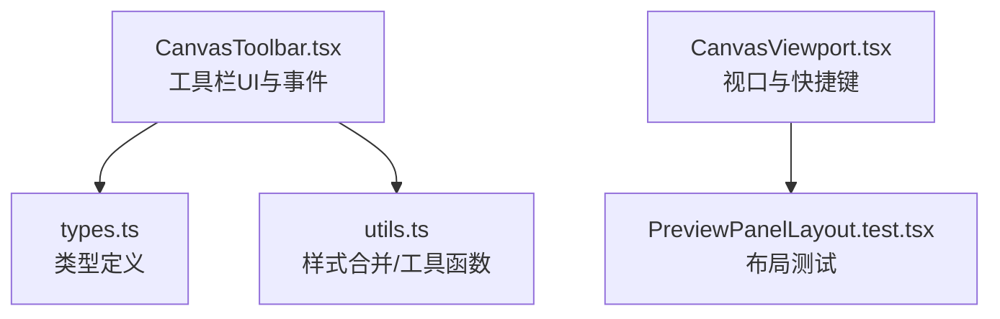
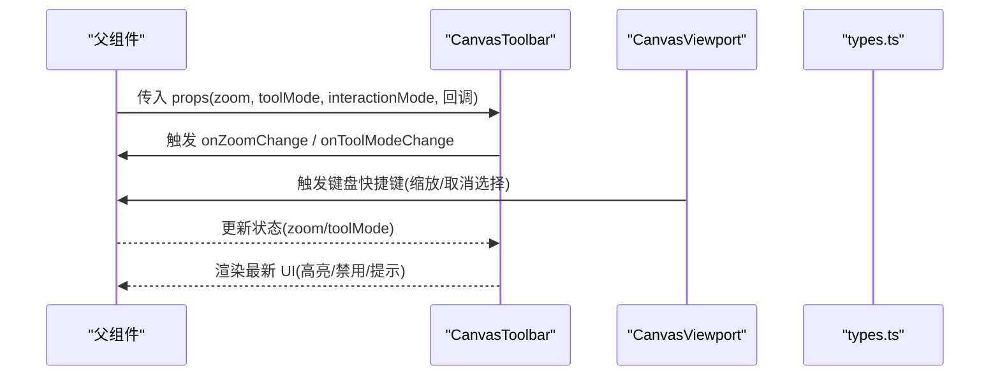
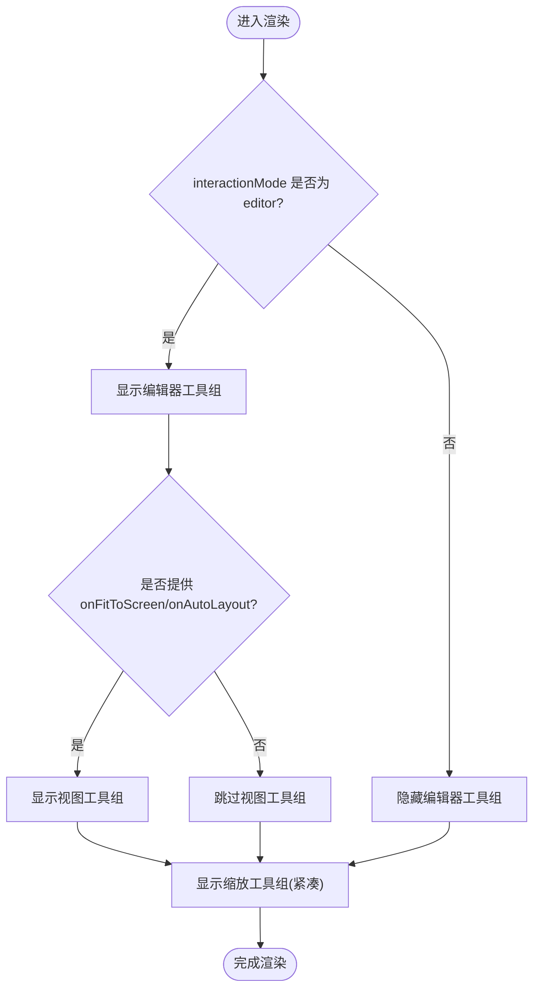
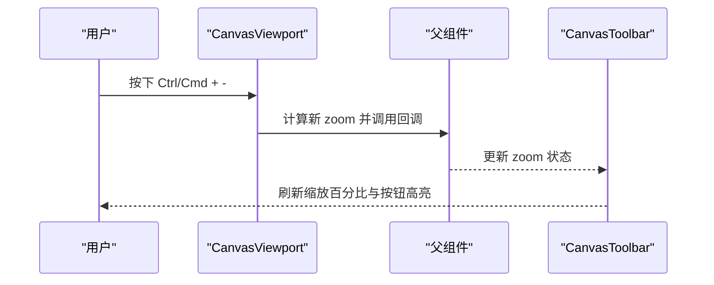
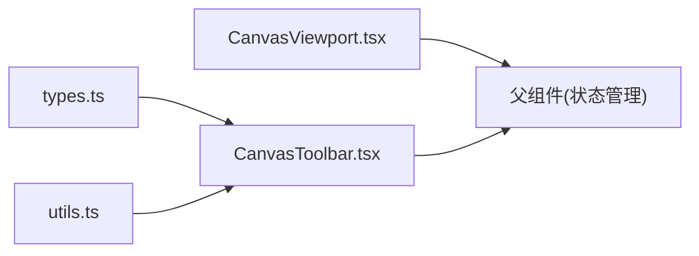

# PreviewToolbar 预览工具栏

<cite>
**本文引用的文件**   
- [CanvasToolbar.tsx](file://packages/demo-ui/src/CanvasToolbar.tsx)
- [types.ts](file://packages/demo-ui/src/types.ts)
- [CanvasViewport.tsx](file://packages/demo-ui/src/CanvasViewport.tsx)
- [utils.ts](file://packages/demo-ui/src/utils.ts)
- [PreviewPanelLayout.test.tsx](file://packages/author-site/components/demo/__tests__/PreviewPanelLayout.test.tsx)
</cite>

## 目录
1. [简介](#简介)
2. [项目结构](#项目结构)
3. [核心组件](#核心组件)
4. [架构总览](#架构总览)
5. [详细组件分析](#详细组件分析)
6. [依赖关系分析](#依赖关系分析)
7. [性能与可访问性](#性能与可访问性)
8. [故障排查指南](#故障排查指南)
9. [结论](#结论)
10. [附录：配置与扩展示例](#附录配置与扩展示例)

## 简介
本文件为 PreviewToolbar（预览工具栏）的全面开发文档，聚焦于以下方面：
- 布局设计与响应式适配方案
- 按钮组管理与图标资源加载
- 快捷键绑定机制
- 工具项的动态注册与配置系统
- 自定义工具项的开发接口
- 用户交互反馈（悬停、点击、状态指示器）
- 完整配置示例与扩展开发指南

该工具栏位于 demo-ui 包中，作为画布/预览区域的悬浮控制条，提供视图模式切换、内容添加、缩放控制等常用能力。

## 项目结构
与 PreviewToolbar 直接相关的代码主要分布在 demo-ui 包的 src 目录下：
- CanvasToolbar.tsx：工具栏主实现，包含分组、提示、缩放菜单、工具模式切换等
- types.ts：类型定义，包括工具模式、交互模式、预览面板属性等
- CanvasViewport.tsx：视口交互逻辑，包含键盘快捷键处理（如 Ctrl/Cmd +/- 缩放）
- utils.ts：通用工具函数（样式合并、防抖等）
- PreviewPanelLayout.test.tsx：预览面板布局测试，验证居中与缩放容器行为

图表来源
- [CanvasToolbar.tsx:1-317](file://packages/demo-ui/src/CanvasToolbar.tsx#L1-L317)
- [types.ts:155-165](file://packages/demo-ui/src/types.ts#L155-L165)
- [CanvasViewport.tsx:237-281](file://packages/demo-ui/src/CanvasViewport.tsx#L237-L281)
- [PreviewPanelLayout.test.tsx:1-46](file://packages/author-site/components/demo/__tests__/PreviewPanelLayout.test.tsx#L1-L46)

章节来源
- [CanvasToolbar.tsx:1-317](file://packages/demo-ui/src/CanvasToolbar.tsx#L1-L317)
- [types.ts:155-165](file://packages/demo-ui/src/types.ts#L155-L165)
- [CanvasViewport.tsx:237-281](file://packages/demo-ui/src/CanvasViewport.tsx#L237-L281)
- [PreviewPanelLayout.test.tsx:1-46](file://packages/author-site/components/demo/__tests__/PreviewPanelLayout.test.tsx#L1-L46)

## 核心组件
- CanvasToolbar：负责渲染工具栏 UI、管理按钮组、处理缩放与工具模式切换、弹出提示与下拉菜单
- 类型系统：通过 types.ts 暴露工具模式、交互模式、预览面板属性等类型，确保组件间契约一致
- 视口快捷键：CanvasViewport.tsx 提供全局快捷键（如 Ctrl/Cmd +/-），与工具栏的缩放功能协同工作
- 工具函数：utils.ts 提供 cn 样式合并与 debounce 等基础能力

章节来源
- [CanvasToolbar.tsx:24-93](file://packages/demo-ui/src/CanvasToolbar.tsx#L24-L93)
- [types.ts:155-165](file://packages/demo-ui/src/types.ts#L155-L165)
- [CanvasViewport.tsx:237-281](file://packages/demo-ui/src/CanvasViewport.tsx#L237-L281)
- [utils.ts:1-19](file://packages/demo-ui/src/utils.ts#L1-L19)

## 架构总览
PreviewToolbar 采用“受控 + 回调”的模式：父组件传入当前状态（如 zoom、toolMode、interactionMode）与回调（如 onZoomChange、onToolModeChange），工具栏仅负责渲染与触发事件。

图表来源
- [CanvasToolbar.tsx:82-93](file://packages/demo-ui/src/CanvasToolbar.tsx#L82-L93)
- [CanvasViewport.tsx:237-281](file://packages/demo-ui/src/CanvasViewport.tsx#L237-L281)
- [types.ts:155-165](file://packages/demo-ui/src/types.ts#L155-L165)

## 详细组件分析

### 布局设计与响应式适配
- 整体布局：使用绝对定位将工具栏固定在底部中央，结合圆角、边框、阴影与毛玻璃背景提升视觉层次
- 分组组织：通过 ToolbarGroup 将相关按钮分组，支持紧凑模式（compact）以节省空间
- 间距与分隔：组内使用 gap 控制间距，组间使用左侧边框进行视觉分隔
- 响应式策略：根据 interactionMode 动态显示/隐藏特定按钮组；在紧凑模式下减小按钮尺寸与间距

图表来源
- [CanvasToolbar.tsx:113-316](file://packages/demo-ui/src/CanvasToolbar.tsx#L113-L316)

章节来源
- [CanvasToolbar.tsx:47-63](file://packages/demo-ui/src/CanvasToolbar.tsx#L47-L63)
- [CanvasToolbar.tsx:113-316](file://packages/demo-ui/src/CanvasToolbar.tsx#L113-L316)

### 按钮组管理与图标资源加载
- 按钮组：ToolbarGroup 封装一组按钮，支持 compact 参数控制间距与边距
- 图标资源：使用 lucide-react 提供的矢量图标（如 Hand、MousePointer2、ZoomIn、ZoomOut、Maximize、FileText、Image、Type、LayoutGrid），按需导入，避免冗余
- 按钮样式：定义多套样式类（普通、紧凑、切换、激活态），通过 cn 工具合并，保证样式一致性

章节来源
- [CanvasToolbar.tsx:37-45](file://packages/demo-ui/src/CanvasToolbar.tsx#L37-L45)
- [CanvasToolbar.tsx:47-63](file://packages/demo-ui/src/CanvasToolbar.tsx#L47-L63)
- [CanvasToolbar.tsx:120-155](file://packages/demo-ui/src/CanvasToolbar.tsx#L120-L155)
- [utils.ts:1-6](file://packages/demo-ui/src/utils.ts#L1-L6)

### 快捷键绑定机制
- 全局快捷键：CanvasViewport.tsx 监听 window 的 keydown/keyup，支持 Ctrl/Cmd +/- 缩放、Escape 取消选择、Space 临时平移等
- 与工具栏联动：工具栏的缩放按钮与快捷键共同更新同一状态（zoom），由父组件统一管理
- 条件生效：当目标元素为输入框或文本编辑区时，部分快捷键会被忽略，避免冲突

图表来源
- [CanvasViewport.tsx:237-281](file://packages/demo-ui/src/CanvasViewport.tsx#L237-L281)
- [CanvasToolbar.tsx:253-311](file://packages/demo-ui/src/CanvasToolbar.tsx#L253-L311)

章节来源
- [CanvasViewport.tsx:237-281](file://packages/demo-ui/src/CanvasViewport.tsx#L237-L281)
- [CanvasToolbar.tsx:253-311](file://packages/demo-ui/src/CanvasToolbar.tsx#L253-L311)

### 工具项的动态注册与配置系统
- 动态显示：通过 props 控制工具项的显隐（如 onAddDocument、onAddText、onAddImageFiles、onFitToScreen、onAutoLayout）
- 模式切换：toolMode 与 onToolModeChange 配合，实现拖动/选择/文字/图片工具的切换
- 配置入口：父组件集中维护工具项列表与回调，工具栏仅消费这些配置，便于统一扩展与维护

章节来源
- [CanvasToolbar.tsx:24-35](file://packages/demo-ui/src/CanvasToolbar.tsx#L24-L35)
- [CanvasToolbar.tsx:157-221](file://packages/demo-ui/src/CanvasToolbar.tsx#L157-L221)
- [types.ts:155-165](file://packages/demo-ui/src/types.ts#L155-L165)

### 自定义工具项的开发接口
- 新增工具项步骤：
  1) 在父组件中定义新的回调与状态
  2) 在工具栏中增加对应按钮与 Tooltip
  3) 通过 props 注入到工具栏
- 建议遵循现有模式：使用 ToolbarTooltip 包裹按钮，设置 aria-label 与 active 样式，保持可访问性与一致性

章节来源
- [CanvasToolbar.tsx:65-80](file://packages/demo-ui/src/CanvasToolbar.tsx#L65-L80)
- [CanvasToolbar.tsx:120-155](file://packages/demo-ui/src/CanvasToolbar.tsx#L120-L155)

### 用户交互反馈机制
- 悬停效果：hover:bg-muted/hover:text-foreground 提供一致的悬停反馈
- 点击动画：transition-colors 平滑过渡，focus-visible:ring-2 增强键盘导航可见性
- 状态指示器：activeToggleButtonClass/activeToolbarButtonClass 表示选中/激活状态；缩放菜单中高亮当前比例

章节来源
- [CanvasToolbar.tsx:37-45](file://packages/demo-ui/src/CanvasToolbar.tsx#L37-L45)
- [CanvasToolbar.tsx:278-299](file://packages/demo-ui/src/CanvasToolbar.tsx#L278-L299)

## 依赖关系分析
- CanvasToolbar 依赖 types.ts 中的类型定义，确保 props 与内部状态的一致性
- CanvasViewport 与 CanvasToolbar 通过父组件的状态与回调形成松耦合协作
- utils.ts 提供样式合并与工具函数，被多处复用

图表来源
- [types.ts:155-165](file://packages/demo-ui/src/types.ts#L155-L165)
- [CanvasToolbar.tsx:1-22](file://packages/demo-ui/src/CanvasToolbar.tsx#L1-L22)
- [CanvasViewport.tsx:237-281](file://packages/demo-ui/src/CanvasViewport.tsx#L237-L281)
- [utils.ts:1-19](file://packages/demo-ui/src/utils.ts#L1-L19)

章节来源
- [types.ts:155-165](file://packages/demo-ui/src/types.ts#L155-L165)
- [CanvasToolbar.tsx:1-22](file://packages/demo-ui/src/CanvasToolbar.tsx#L1-L22)
- [CanvasViewport.tsx:237-281](file://packages/demo-ui/src/CanvasViewport.tsx#L237-L281)
- [utils.ts:1-19](file://packages/demo-ui/src/utils.ts#L1-L19)

## 性能与可访问性
- 性能优化：
  - 使用 cn 合并样式类，减少重复计算
  - 缩放菜单通过 ref 与外部点击关闭，避免不必要的重渲染
- 可访问性：
  - 所有按钮均设置 aria-label，Toggle 按钮使用 aria-pressed 表达状态
  - 焦点可见性通过 focus-visible:ring-2 强化

章节来源
- [CanvasToolbar.tsx:113-316](file://packages/demo-ui/src/CanvasToolbar.tsx#L113-L316)
- [utils.ts:1-6](file://packages/demo-ui/src/utils.ts#L1-L6)

## 故障排查指南
- 缩放菜单无法关闭：检查外部点击事件是否正确绑定与清理
- 快捷键无效：确认目标元素不是输入框或文本编辑区；检查父组件是否正确更新 zoom 状态
- 工具项未显示：核对 props 是否传入对应的回调；检查 interactionMode 是否符合预期

章节来源
- [CanvasToolbar.tsx:99-109](file://packages/demo-ui/src/CanvasToolbar.tsx#L99-L109)
- [CanvasViewport.tsx:237-281](file://packages/demo-ui/src/CanvasViewport.tsx#L237-L281)

## 结论
PreviewToolbar 通过清晰的 props 契约与受控模式，实现了可扩展、可访问且响应式的预览工具栏。借助 types.ts 的类型约束与 CanvasViewport 的快捷键支持，工具栏能够与整个预览系统无缝协作。开发者可通过统一的配置方式扩展工具项，并保持交互与样式的一致性。

## 附录：配置与扩展示例
- 基本配置要点：
  - 传入 zoom 与 onZoomChange 实现缩放控制
  - 传入 toolMode 与 onToolModeChange 实现工具切换
  - 根据需要传入 onAddDocument/onAddText/onAddImageFiles 启用编辑器工具
  - 传入 onFitToScreen/onAutoLayout 启用视图工具
- 扩展步骤：
  - 在父组件中新增状态与回调
  - 在工具栏中添加对应按钮与 Tooltip
  - 通过 props 注入，保持与其他工具项一致的交互与样式

章节来源
- [CanvasToolbar.tsx:24-35](file://packages/demo-ui/src/CanvasToolbar.tsx#L24-L35)
- [CanvasToolbar.tsx:157-221](file://packages/demo-ui/src/CanvasToolbar.tsx#L157-L221)
- [CanvasToolbar.tsx:223-251](file://packages/demo-ui/src/CanvasToolbar.tsx#L223-L251)
- [CanvasToolbar.tsx:253-311](file://packages/demo-ui/src/CanvasToolbar.tsx#L253-L311)