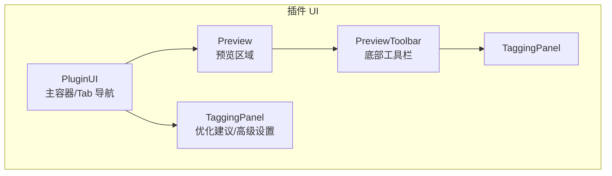
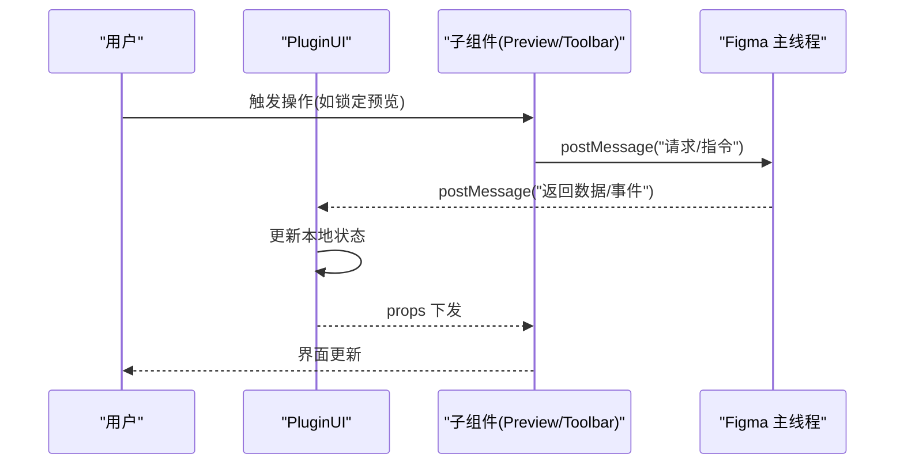
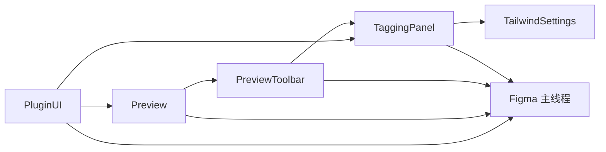
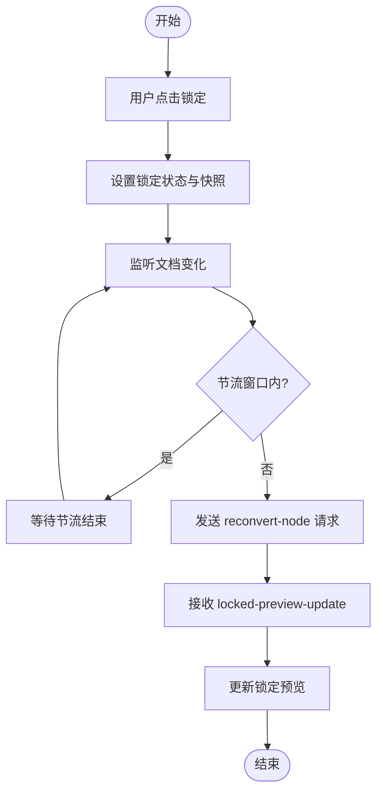

# UI 组件与交互

<cite>
**本文引用的文件**
- [UI组件与交互.md](file://docs/项目文档/figma插件/技术/UI组件与交互.md)
- [标记系统.md](file://docs/项目文档/figma插件/技术/标记系统.md)
</cite>

## 目录
1. [简介](#简介)
2. [项目结构](#项目结构)
3. [核心组件](#核心组件)
4. [架构总览](#架构总览)
5. [详细组件分析](#详细组件分析)
6. [依赖关系分析](#依赖关系分析)
7. [性能考量](#性能考量)
8. [故障排查指南](#故障排查指南)
9. [结论](#结论)
10. [附录：API 参考与使用示例](#附录api-参考与使用示例)

## 简介
本文件面向 Figma 插件的 UI 组件系统，聚焦基于 React 的组件库架构与交互设计。内容覆盖主容器、预览工具栏、代码编辑器等核心组件的设计模式；阐述与主线程的数据同步、实时更新与错误处理；总结拖拽、快捷键、上下文菜单等高级交互；并提供主题定制与样式覆盖方案、完整的 API 参考与使用示例。

## 项目结构
插件前端采用“标签页导航”组织界面，包含两个核心视图：
- 预览页：展示生成的 HTML 效果，底部提供标记操作与导出功能
- 更多页：提供优化建议与高级设置（代码格式、样式细项、Tailwind 配置）

图表来源
- [UI组件与交互.md:25-43](file://docs/项目文档/figma插件/技术/UI组件与交互.md#L25-L43)
- [标记系统.md:19-37](file://docs/项目文档/figma插件/技术/标记系统.md#L19-L37)

章节来源
- [UI组件与交互.md:25-43](file://docs/项目文档/figma插件/技术/UI组件与交互.md#L25-L43)
- [标记系统.md:19-37](file://docs/项目文档/figma插件/技术/标记系统.md#L19-L37)

## 核心组件
- PluginUI：主容器，负责 Tab 切换、预览锁定、数据分发与主题适配
- Preview：实时预览生成结果，支持自适应缩放、背景切换、图层名称显示
- PreviewToolbar：底部工具栏，承载标记操作与导出能力
- TaggingPanel：优化建议与高级设置面板
- TailwindSettings：Tailwind 专属设置面板
- Loading/CopyButton/SelectionEmptyState/SelectableToggle/CustomPrefixInput/ExpandIcon/Modal：通用辅助组件

章节来源
- [UI组件与交互.md:121-139](file://docs/项目文档/figma插件/技术/UI组件与交互.md#L121-L139)

## 架构总览
插件 UI 通过 postMessage 与 Figma 主线程通信，形成“子组件 → 父容器 → 主线程”的双向消息流。状态以本地 React useState 管理，关键流程包括预览锁定与节流重转换。

图表来源
- [UI组件与交互.md:140-178](file://docs/项目文档/figma插件/技术/UI组件与交互.md#L140-L178)

## 详细组件分析

### PluginUI 主容器
职责
- 管理当前激活标签页（preview | tagging）
- 管理预览锁定与锁定态预览数据
- 接收来自主线程的代码、预览、警告信息
- 主题适配（深色/浅色）

关键状态
- activeTab、previewBgColor、isPreviewLocked、lockedHtmlPreview、lockedNodeId

交互要点
- 点击锁定后，监听文档变化并节流触发重新转换
- 根据选中框架与设置项渲染不同内容

章节来源
- [UI组件与交互.md:47-70](file://docs/项目文档/figma插件/技术/UI组件与交互.md#L47-L70)
- [UI组件与交互.md:140-164](file://docs/项目文档/figma插件/技术/UI组件与交互.md#L140-L164)

### Preview 预览面板
能力
- 自适应缩放：按容器尺寸计算合适比例
- 背景切换：白/黑背景对比
- 图层名称显示：底部状态栏提示当前选中图层

章节来源
- [UI组件与交互.md:72-88](file://docs/项目文档/figma插件/技术/UI组件与交互.md#L72-L88)

### PreviewToolbar 预览工具栏
位置与职责
- 位于预览区底部，承载标记操作与导出功能
- 与 TaggingPanel 联动，提供资源标记、动态布局、提示词等入口

章节来源
- [标记系统.md:19-37](file://docs/项目文档/figma插件/技术/标记系统.md#L19-L37)

### TaggingPanel 标记与设置面板
内容
- 优化建议列表
- 高级设置折叠面板（代码格式、样式细项、Tailwind 配置）

章节来源
- [标记系统.md:27-37](file://docs/项目文档/figma插件/技术/标记系统.md#L27-L37)
- [UI组件与交互.md:121-139](file://docs/项目文档/figma插件/技术/UI组件与交互.md#L121-L139)

### TailwindSettings 设置面板
用途
- 针对 Tailwind 的专属配置项

章节来源
- [UI组件与交互.md:121-139](file://docs/项目文档/figma插件/技术/UI组件与交互.md#L121-L139)

### 辅助组件
- Loading：加载动画
- CopyButton：复制按钮
- SelectionEmptyState：空状态提示
- SelectableToggle：带帮助提示的开关
- CustomPrefixInput：自定义前缀输入（含实时预览）
- ExpandIcon：展开/折叠图标
- Modal：通用弹窗与确认对话框

章节来源
- [UI组件与交互.md:121-139](file://docs/项目文档/figma插件/技术/UI组件与交互.md#L121-L139)

## 依赖关系分析
- 组件内聚性
  - PluginUI 作为根容器，聚合 Tab 与预览锁定逻辑，向下分发 props
  - Preview 与 PreviewToolbar 强耦合于预览工作流
  - TaggingPanel 与 TailwindSettings 属于“更多”视图下的设置域
- 外部依赖
  - 与 Figma 主线程通过 postMessage 通信
  - 样式体系基于 Tailwind CSS

图表来源
- [UI组件与交互.md:25-43](file://docs/项目文档/figma插件/技术/UI组件与交互.md#L25-L43)
- [UI组件与交互.md:140-178](file://docs/项目文档/figma插件/技术/UI组件与交互.md#L140-L178)

## 性能考量
- 预览锁定节流：在文档变化时进行节流，避免频繁重转换
- 局部更新：仅对必要状态进行变更，减少不必要的重渲染
- 缩放与渲染：根据容器尺寸计算缩放比例，控制渲染开销

章节来源
- [UI组件与交互.md:180-188](file://docs/项目文档/figma插件/技术/UI组件与交互.md#L180-L188)

## 故障排查指南
常见问题与定位思路
- 预览未更新
  - 检查是否处于锁定态且节流窗口未结束
  - 核对主线程是否返回对应消息
- 标记操作无效
  - 确认工具栏与 TaggingPanel 的状态是否同步
  - 检查 postMessage 调用链路与返回值
- 主题不生效
  - 校验主题切换状态与样式类名应用是否正确

章节来源
- [UI组件与交互.md:140-188](file://docs/项目文档/figma插件/技术/UI组件与交互.md#L140-L188)

## 结论
该 UI 组件系统以 PluginUI 为中枢，围绕预览与标记两大工作流组织组件，结合 postMessage 与主线程协同，实现高效的实时预览与可配置的生成策略。通过合理的状态划分与节流机制，兼顾了交互流畅性与性能表现。

## 附录：API 参考与使用示例

### PluginUI Props 接口
- code: string — 生成的代码
- htmlPreview: HTMLPreview — HTML 预览数据
- warnings: Warning[] — 警告信息
- selectedFramework: Framework — 选中的框架
- setSelectedFramework: (f) => void — 设置框架
- settings: PluginSettings | null — 插件设置
- onPreferenceChanged: (key, value) => void — 偏好变更回调
- isLoading: boolean — 加载状态
- onCopyRequest?: () => Promise<string> — 复制请求
- onExportHTMLRequest?: () => Promise<string> — 导出 HTML 请求

章节来源
- [UI组件与交互.md:56-70](file://docs/项目文档/figma插件/技术/UI组件与交互.md#L56-L70)

### 状态管理与数据流
- 本地状态
  - activeTab、previewBgColor、isPreviewLocked、lockedHtmlPreview、lockedNodeId
  - 工具栏相关：slotType、slotId、listId、aiInstruction、isStatic、currentTagType、autoLayoutMode
  - 面板相关：checkWarnings、isAdvancedOpen
- 数据流向
  - 子组件通过 postMessage 向上层或主线程发起请求
  - 主线程通过 postMessage 回传数据与事件
  - 上层组件更新状态并通过 props 下发至子组件

章节来源
- [UI组件与交互.md:140-178](file://docs/项目文档/figma插件/技术/UI组件与交互.md#L140-L178)

### 预览锁定流程

图表来源
- [UI组件与交互.md:180-188](file://docs/项目文档/figma插件/技术/UI组件与交互.md#L180-L188)

### 主题定制与样式覆盖
- 主题切换：支持深色/浅色模式
- 背景切换：预览区支持白/黑背景对比
- 样式体系：基于 Tailwind CSS，可通过配置项调整代码输出风格与样式细节

章节来源
- [UI组件与交互.md:47-55](file://docs/项目文档/figma插件/技术/UI组件与交互.md#L47-L55)
- [UI组件与交互.md:72-88](file://docs/项目文档/figma插件/技术/UI组件与交互.md#L72-L88)
- [UI组件与交互.md:121-139](file://docs/项目文档/figma插件/技术/UI组件与交互.md#L121-L139)

### 使用示例（路径指引）
- 主容器与预览：[PluginUI.tsx](file://packages/plugin-ui/src/PluginUI.tsx)、[Preview.tsx](file://packages/plugin-ui/src/components/Preview.tsx)
- 工具栏与标记：[PreviewToolbar.tsx](file://packages/plugin-ui/src/components/PreviewToolbar.tsx)、[TaggingPanel.tsx](file://packages/plugin-ui/src/components/TaggingPanel.tsx)
- 设置与选项：[TailwindSettings.tsx](file://packages/plugin-ui/src/components/TailwindSettings.tsx)、[codegenPreferenceOptions.ts](file://packages/plugin-ui/src/codegenPreferenceOptions.ts)
- 辅助组件：[Loading.tsx](file://packages/plugin-ui/src/components/Loading.tsx)、[CopyButton.tsx](file://packages/plugin-ui/src/components/CopyButton.tsx)、[SelectionEmptyState.tsx](file://packages/plugin-ui/src/components/SelectionEmptyState.tsx)、[SelectableToggle.tsx](file://packages/plugin-ui/src/components/SelectableToggle.tsx)、[CustomPrefixInput.tsx](file://packages/plugin-ui/src/components/CustomPrefixInput.tsx)、[ExpandIcon.tsx](file://packages/plugin-ui/src/components/ExpandIcon.tsx)、[Modal.tsx](file://packages/plugin-ui/src/components/Modal.tsx)
- 设计建议：[designerSuggestions.ts](file://packages/plugin-ui/src/lib/designerSuggestions.ts)