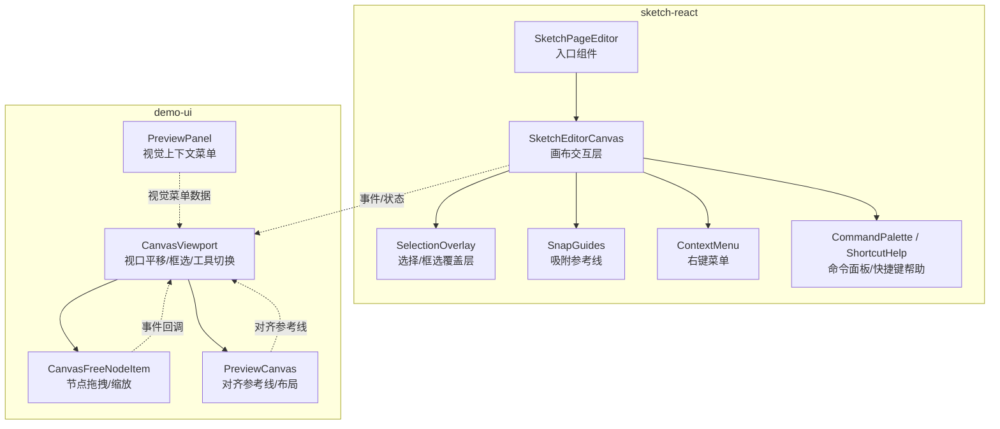
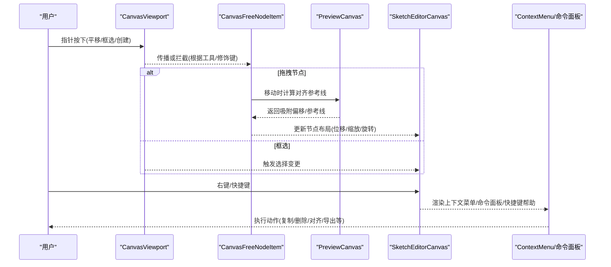
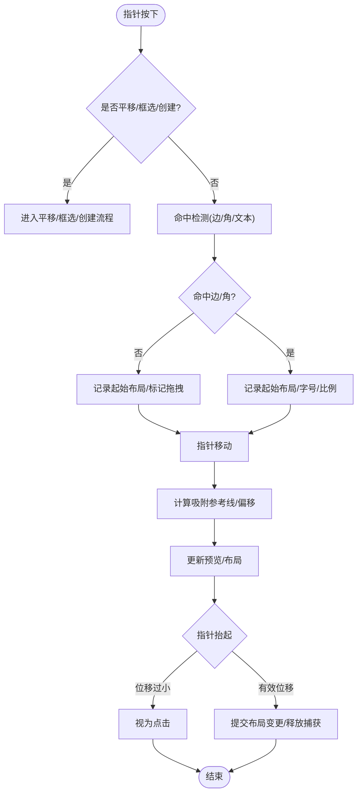
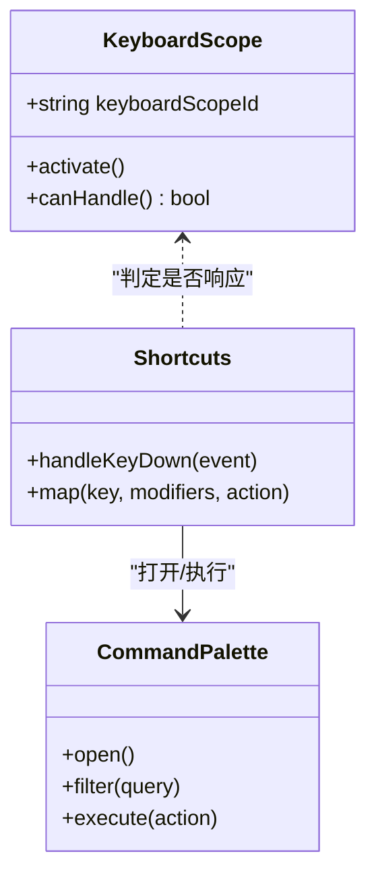
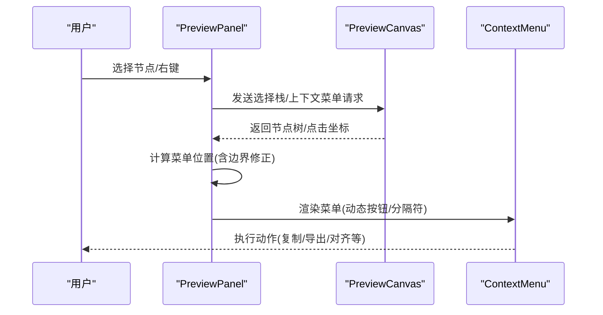
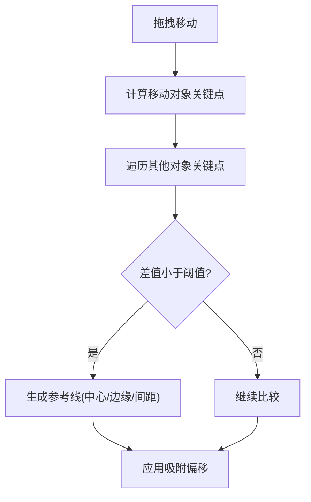
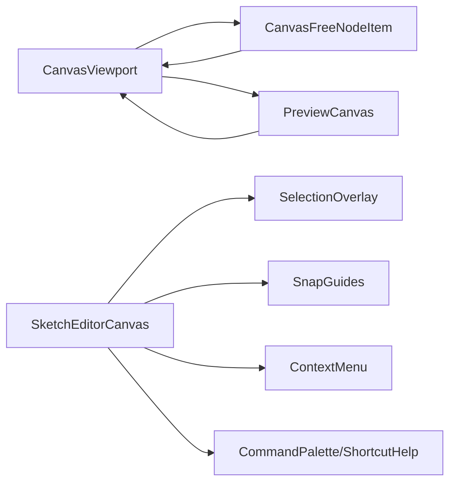

# 交互设计模式

<cite>
**本文引用的文件**   
- [packages/sketch-react/src/index.tsx](file://packages/sketch-react/src/index.tsx)
- [packages/demo-ui/src/CanvasViewport.tsx](file://packages/demo-ui/src/CanvasViewport.tsx)
- [packages/demo-ui/src/CanvasFreeNodeItem.tsx](file://packages/demo-ui/src/CanvasFreeNodeItem.tsx)
- [packages/demo-ui/src/PreviewPanel.tsx](file://packages/demo-ui/src/PreviewPanel.tsx)
- [packages/demo-ui/src/PreviewCanvas.tsx](file://packages/demo-ui/src/PreviewCanvas.tsx)
- [packages/author-site/src/components/demo/preview-canvas-interaction-mode.test.tsx](file://packages/author-site/src/components/demo/preview-canvas-interaction-mode.test.tsx)
</cite>

## 目录
1. [简介](#简介)
2. [项目结构](#项目结构)
3. [核心组件](#核心组件)
4. [架构总览](#架构总览)
5. [详细组件分析](#详细组件分析)
6. [依赖分析](#依赖分析)
7. [性能考虑](#性能考虑)
8. [故障排查指南](#故障排查指南)
9. [结论](#结论)
10. [附录](#附录)

## 简介
本指南面向 UI 组件交互开发，聚焦以下能力：拖拽（源与目标、预览、放置验证）、键盘快捷键（注册、冲突检测、组合键）、上下文菜单（动态生成、位置计算、层级管理）、手势与移动端适配，以及可复用的交互模式与规范。文档基于仓库中现有实现进行提炼，提供可视化图示与“代码片段路径”以便快速定位源码。

## 项目结构
与交互相关的核心代码主要分布在两个包：
- sketch-react：画布编辑器与交互内核（选择、拖拽、缩放、旋转、吸附、命令面板、快捷键帮助、右键菜单等）
- demo-ui：预览画布容器、视口平移/框选、节点拖拽与缩放、对齐参考线、视觉上下文菜单等

图表来源
- [packages/sketch-react/src/index.tsx:1198-1260](file://packages/sketch-react/src/index.tsx#L1198-L1260)
- [packages/sketch-react/src/index.tsx:2264-2328](file://packages/sketch-react/src/index.tsx#L2264-L2328)
- [packages/sketch-react/src/index.tsx:7000-7180](file://packages/sketch-react/src/index.tsx#L7000-L7180)
- [packages/demo-ui/src/CanvasViewport.tsx:174-281](file://packages/demo-ui/src/CanvasViewport.tsx#L174-L281)
- [packages/demo-ui/src/CanvasViewport.tsx:283-365](file://packages/demo-ui/src/CanvasViewport.tsx#L283-L365)
- [packages/demo-ui/src/CanvasFreeNodeItem.tsx:112-155](file://packages/demo-ui/src/CanvasFreeNodeItem.tsx#L112-L155)
- [packages/demo-ui/src/PreviewCanvas.tsx:264-335](file://packages/demo-ui/src/PreviewCanvas.tsx#L264-L335)
- [packages/demo-ui/src/PreviewPanel.tsx:1041-1077](file://packages/demo-ui/src/PreviewPanel.tsx#L1041-L1077)

章节来源
- [packages/sketch-react/src/index.tsx:1198-1260](file://packages/sketch-react/src/index.tsx#L1198-L1260)
- [packages/sketch-react/src/index.tsx:2264-2328](file://packages/sketch-react/src/index.tsx#L2264-L2328)
- [packages/sketch-react/src/index.tsx:7000-7180](file://packages/sketch-react/src/index.tsx#L7000-L7180)
- [packages/demo-ui/src/CanvasViewport.tsx:174-281](file://packages/demo-ui/src/CanvasViewport.tsx#L174-L281)
- [packages/demo-ui/src/CanvasViewport.tsx:283-365](file://packages/demo-ui/src/CanvasViewport.tsx#L283-L365)
- [packages/demo-ui/src/CanvasFreeNodeItem.tsx:112-155](file://packages/demo-ui/src/CanvasFreeNodeItem.tsx#L112-L155)
- [packages/demo-ui/src/PreviewCanvas.tsx:264-335](file://packages/demo-ui/src/PreviewCanvas.tsx#L264-L335)
- [packages/demo-ui/src/PreviewPanel.tsx:1041-1077](file://packages/demo-ui/src/PreviewPanel.tsx#L1041-L1077)

## 核心组件
- SketchPageEditor/SketchEditorCanvas：提供完整的编辑态交互（选择、拖拽、缩放、旋转、吸附、导出、复制粘贴、图层操作、命令面板、快捷键帮助、右键菜单）。
- CanvasViewport：负责视口平移、框选、工具切换（手型/选择）、空格+左键平移、鼠标中键平移、缩放快捷键。
- CanvasFreeNodeItem：节点级拖拽与缩放手柄识别、边缘/角点命中、尺寸约束、文本节点特殊处理。
- PreviewCanvas：对齐参考线与吸附逻辑（中心/边缘/间距），用于拖拽过程中的实时对齐提示。
- PreviewPanel：视觉上下文菜单的数据组装与展示（节点树、层级关系、打开位置）。

章节来源
- [packages/sketch-react/src/index.tsx:7253-7287](file://packages/sketch-react/src/index.tsx#L7253-L7287)
- [packages/demo-ui/src/CanvasViewport.tsx:174-281](file://packages/demo-ui/src/CanvasViewport.tsx#L174-L281)
- [packages/demo-ui/src/CanvasFreeNodeItem.tsx:112-155](file://packages/demo-ui/src/CanvasFreeNodeItem.tsx#L112-L155)
- [packages/demo-ui/src/PreviewCanvas.tsx:264-335](file://packages/demo-ui/src/PreviewCanvas.tsx#L264-L335)
- [packages/demo-ui/src/PreviewPanel.tsx:1041-1077](file://packages/demo-ui/src/PreviewPanel.tsx#L1041-L1077)

## 架构总览
下图展示了从用户输入到交互反馈的端到端流程，涵盖拖拽、吸附、菜单与快捷键。

图表来源
- [packages/demo-ui/src/CanvasViewport.tsx:283-365](file://packages/demo-ui/src/CanvasViewport.tsx#L283-L365)
- [packages/demo-ui/src/CanvasFreeNodeItem.tsx:112-155](file://packages/demo-ui/src/CanvasFreeNodeItem.tsx#L112-L155)
- [packages/demo-ui/src/PreviewCanvas.tsx:264-335](file://packages/demo-ui/src/PreviewCanvas.tsx#L264-L335)
- [packages/sketch-react/src/index.tsx:7000-7180](file://packages/sketch-react/src/index.tsx#L7000-L7180)

## 详细组件分析

### 拖拽系统（源与目标、预览、放置验证）
- 拖拽源与捕获
  - 使用 Pointer Events + setPointerCapture/releasePointerCapture 确保拖拽期间事件稳定指向目标元素，避免跨元素丢失。
  - 在 Capture 阶段优先处理平移/框选，防止子元素误触发。
- 拖拽目标与命中
  - 节点边缘/角点命中检测：通过局部坐标与阈值判断 n/s/e/w/ne/nw/se/sw 八方向，区分边与角。
  - 文本节点采用更小的命中阈值以提升易用性。
- 拖拽预览与吸附
  - 拖拽过程中计算选中集合的预览边界，结合网格/中心/边缘/间距规则生成吸附参考线。
  - 支持按住 Meta/Ctrl 抑制吸附；Shift 保持宽高比；从选择边界或手柄处开始缩放。
- 放置验证与落盘
  - 在 pointerup 时校验最小位移阈值，将小位移视为点击；否则提交布局变更并释放指针捕获。
  - 对图片类节点在缩放时保持比例且不添加背景色（测试用例覆盖）。

图表来源
- [packages/demo-ui/src/CanvasViewport.tsx:283-365](file://packages/demo-ui/src/CanvasViewport.tsx#L283-L365)
- [packages/demo-ui/src/CanvasFreeNodeItem.tsx:112-155](file://packages/demo-ui/src/CanvasFreeNodeItem.tsx#L112-L155)
- [packages/sketch-react/src/index.tsx:2233-2262](file://packages/sketch-react/src/index.tsx#L2233-L2262)
- [packages/sketch-react/src/index.tsx:2264-2328](file://packages/sketch-react/src/index.tsx#L2264-L2328)
- [packages/author-site/src/components/demo/preview-canvas-interaction-mode.test.tsx:2137-2175](file://packages/author-site/src/components/demo/preview-canvas-interaction-mode.test.tsx#L2137-L2175)

章节来源
- [packages/demo-ui/src/CanvasViewport.tsx:283-365](file://packages/demo-ui/src/CanvasViewport.tsx#L283-L365)
- [packages/demo-ui/src/CanvasFreeNodeItem.tsx:112-155](file://packages/demo-ui/src/CanvasFreeNodeItem.tsx#L112-L155)
- [packages/sketch-react/src/index.tsx:2233-2262](file://packages/sketch-react/src/index.tsx#L2233-L2262)
- [packages/sketch-react/src/index.tsx:2264-2328](file://packages/sketch-react/src/index.tsx#L2264-L2328)
- [packages/author-site/src/components/demo/preview-canvas-interaction-mode.test.tsx:2137-2175](file://packages/author-site/src/components/demo/preview-canvas-interaction-mode.test.tsx#L2137-L2175)

### 键盘快捷键系统（注册、冲突检测、组合键）
- 作用域与冲突检测
  - 通过 keyboardScopeId 激活当前作用域，仅当处于活跃作用域或全局唯一作用域时才响应快捷键，避免多实例冲突。
- 组合键与常用快捷键
  - 支持 Ctrl/Cmd + 数字/符号进行缩放、适应屏幕；Ctrl/Cmd + Z/Y 撤销/重做；Tab 切换相邻节点；Delete/Backspace 删除；? 打开快捷键帮助；Ctrl/Cmd + K 打开命令面板。
- 快捷键帮助与命令面板
  - 快捷键帮助以对话框形式列出所有带快捷键的动作；命令面板支持按标签/描述/快捷键搜索并执行。

图表来源
- [packages/sketch-react/src/index.tsx:172-184](file://packages/sketch-react/src/index.tsx#L172-L184)
- [packages/sketch-react/src/index.tsx:6162-6197](file://packages/sketch-react/src/index.tsx#L6162-L6197)
- [packages/sketch-react/src/index.tsx:3254-3321](file://packages/sketch-react/src/index.tsx#L3254-L3321)
- [packages/sketch-react/src/index.tsx:3324-3353](file://packages/sketch-react/src/index.tsx#L3324-L3353)

章节来源
- [packages/sketch-react/src/index.tsx:172-184](file://packages/sketch-react/src/index.tsx#L172-L184)
- [packages/sketch-react/src/index.tsx:6162-6197](file://packages/sketch-react/src/index.tsx#L6162-L6197)
- [packages/sketch-react/src/index.tsx:3254-3321](file://packages/sketch-react/src/index.tsx#L3254-L3321)
- [packages/sketch-react/src/index.tsx:3324-3353](file://packages/sketch-react/src/index.tsx#L3324-L3353)

### 上下文菜单（动态生成、位置计算、层级管理）
- 动态菜单生成
  - 根据当前选中节点集合与场景状态动态构建菜单项（复制/删除/导出/对齐/分布/锁定/可见性/成组解组等），并通过禁用条件控制可用性。
- 位置计算与显示
  - 在预览面板中根据点击坐标计算菜单位置，若超出视口则调整；通过绝对定位与 z-index 保证层级正确。
- 层级管理
  - 菜单容器设置高 z-index，并在内部阻止事件冒泡，避免穿透到画布或其他浮层。

图表来源
- [packages/demo-ui/src/PreviewPanel.tsx:1041-1077](file://packages/demo-ui/src/PreviewPanel.tsx#L1041-L1077)
- [packages/sketch-react/src/index.tsx:7000-7180](file://packages/sketch-react/src/index.tsx#L7000-L7180)

章节来源
- [packages/demo-ui/src/PreviewPanel.tsx:1041-1077](file://packages/demo-ui/src/PreviewPanel.tsx#L1041-L1077)
- [packages/sketch-react/src/index.tsx:7000-7180](file://packages/sketch-react/src/index.tsx#L7000-L7180)

### 手势支持与移动端适配策略
- 指针统一抽象
  - 使用 Pointer Events 统一鼠标/触控/笔输入，配合 setPointerCapture 保障拖拽稳定性。
- 移动端友好
  - 命中区域与阈值针对文本节点做了优化；拖拽/缩放具备最小位移阈值，避免误触。
- 触摸导航示例
  - 演示页面包含 touchstart/touchend 滑动切换与 wheel 滚轮翻页的实现思路，可作为移动端手势扩展参考。

章节来源
- [packages/author-site/src/components/demo/preview-canvas-interaction-mode.test.tsx:600-621](file://packages/author-site/src/components/demo/preview-canvas-interaction-mode.test.tsx#L600-L621)
- [packages/demo-ui/src/CanvasFreeNodeItem.tsx:112-155](file://packages/demo-ui/src/CanvasFreeNodeItem.tsx#L112-L155)

### 对齐与吸附（拖拽预览的重要组成）
- 对齐参考线
  - 在拖拽过程中计算移动对象与其他对象的中心/边缘/间距对齐，达到阈值后绘制参考线并应用偏移。
- 吸附类型
  - 网格、中心线、边缘、间距四类参考线，分别以不同颜色标识，便于用户感知。

图表来源
- [packages/demo-ui/src/PreviewCanvas.tsx:264-335](file://packages/demo-ui/src/PreviewCanvas.tsx#L264-L335)
- [packages/sketch-react/src/index.tsx:2264-2328](file://packages/sketch-react/src/index.tsx#L2264-L2328)

章节来源
- [packages/demo-ui/src/PreviewCanvas.tsx:264-335](file://packages/demo-ui/src/PreviewCanvas.tsx#L264-L335)
- [packages/sketch-react/src/index.tsx:2264-2328](file://packages/sketch-react/src/index.tsx#L2264-L2328)

## 依赖分析
- 组件耦合
  - CanvasViewport 作为容器协调平移/框选/工具切换，向上暴露回调给父级；向下驱动节点项的拖拽与缩放。
  - CanvasFreeNodeItem 专注单节点的命中与变换，依赖外部提供的 onDrag* 回调完成状态提升。
  - PreviewCanvas 提供对齐参考线，被拖拽方消费以实现精准对齐。
  - SketchEditorCanvas 集成选择、拖拽、吸附、菜单、命令面板等完整能力，对外暴露控制器接口。
- 外部依赖
  - 大量使用 React Hooks、Tailwind 样式、图标库；Pointer Events API 为交互基础。

图表来源
- [packages/demo-ui/src/CanvasViewport.tsx:283-365](file://packages/demo-ui/src/CanvasViewport.tsx#L283-L365)
- [packages/demo-ui/src/CanvasFreeNodeItem.tsx:112-155](file://packages/demo-ui/src/CanvasFreeNodeItem.tsx#L112-L155)
- [packages/sketch-react/src/index.tsx:1198-1260](file://packages/sketch-react/src/index.tsx#L1198-L1260)
- [packages/sketch-react/src/index.tsx:2264-2328](file://packages/sketch-react/src/index.tsx#L2264-L2328)
- [packages/sketch-react/src/index.tsx:7000-7180](file://packages/sketch-react/src/index.tsx#L7000-L7180)

章节来源
- [packages/demo-ui/src/CanvasViewport.tsx:283-365](file://packages/demo-ui/src/CanvasViewport.tsx#L283-L365)
- [packages/demo-ui/src/CanvasFreeNodeItem.tsx:112-155](file://packages/demo-ui/src/CanvasFreeNodeItem.tsx#L112-L155)
- [packages/sketch-react/src/index.tsx:1198-1260](file://packages/sketch-react/src/index.tsx#L1198-L1260)
- [packages/sketch-react/src/index.tsx:2264-2328](file://packages/sketch-react/src/index.tsx#L2264-L2328)
- [packages/sketch-react/src/index.tsx:7000-7180](file://packages/sketch-react/src/index.tsx#L7000-L7180)

## 性能考虑
- 使用 requestAnimationFrame 批量更新视口，减少频繁 setState 导致的重排。
- 使用 will-change 过渡属性在交互期间提示浏览器优化合成层。
- 命中检测与吸附计算尽量使用轻量几何运算，避免昂贵 DOM 查询。
- 指针捕获降低事件冒泡开销，提高拖拽稳定性。

[本节为通用指导，不直接分析具体文件]

## 故障排查指南
- 拖拽无效或中途丢失
  - 检查是否正确调用 setPointerCapture/releasePointerCapture；确认 capture/bubble 阶段的事件拦截顺序。
- 吸附不生效
  - 确认是否按住 Meta/Ctrl 抑制了吸附；检查阈值与参考线计算逻辑。
- 快捷键冲突
  - 检查 keyboardScopeId 是否激活；确认是否在文本输入框内导致被跳过。
- 上下文菜单错位
  - 检查点击坐标与视口偏移换算；确认 z-index 层级未被其他浮层覆盖。

章节来源
- [packages/sketch-react/src/index.tsx:6104-6128](file://packages/sketch-react/src/index.tsx#L6104-L6128)
- [packages/sketch-react/src/index.tsx:172-184](file://packages/sketch-react/src/index.tsx#L172-L184)
- [packages/sketch-react/src/index.tsx:2264-2328](file://packages/sketch-react/src/index.tsx#L2264-L2328)
- [packages/demo-ui/src/PreviewPanel.tsx:1041-1077](file://packages/demo-ui/src/PreviewPanel.tsx#L1041-L1077)

## 结论
本指南总结了仓库中已实现的交互模式：统一的指针事件与捕获机制、健壮的拖拽/缩放/旋转与吸附体系、完善的快捷键与作用域管理、动态上下文菜单与命令面板，以及移动端友好的命中与阈值策略。建议在新功能开发中复用上述模式与组件，遵循“低耦合、高内聚、可测试”的原则，持续提升交互一致性与性能。

[本节为总结，不直接分析具体文件]

## 附录
- 代码片段路径（便于快速定位）
  - 拖拽与缩放命中检测：[packages/demo-ui/src/CanvasFreeNodeItem.tsx:112-155](file://packages/demo-ui/src/CanvasFreeNodeItem.tsx#L112-L155)
  - 视口平移/框选/工具切换：[packages/demo-ui/src/CanvasViewport.tsx:283-365](file://packages/demo-ui/src/CanvasViewport.tsx#L283-L365)
  - 对齐参考线计算：[packages/demo-ui/src/PreviewCanvas.tsx:264-335](file://packages/demo-ui/src/PreviewCanvas.tsx#L264-L335)
  - 吸附参考线生成：[packages/sketch-react/src/index.tsx:2264-2328](file://packages/sketch-react/src/index.tsx#L2264-L2328)
  - 拖拽预览边界计算：[packages/sketch-react/src/index.tsx:2233-2262](file://packages/sketch-react/src/index.tsx#L2233-L2262)
  - 快捷键作用域与冲突检测：[packages/sketch-react/src/index.tsx:172-184](file://packages/sketch-react/src/index.tsx#L172-L184)
  - 快捷键处理（缩放/撤销/删除/Tab/帮助/命令面板）：[packages/sketch-react/src/index.tsx:6162-6197](file://packages/sketch-react/src/index.tsx#L6162-L6197)
  - 命令面板与快捷键帮助：[packages/sketch-react/src/index.tsx:3254-3321](file://packages/sketch-react/src/index.tsx#L3254-L3321), [packages/sketch-react/src/index.tsx:3324-3353](file://packages/sketch-react/src/index.tsx#L3324-L3353)
  - 右键菜单与悬浮工具条：[packages/sketch-react/src/index.tsx:7000-7180](file://packages/sketch-react/src/index.tsx#L7000-L7180)
  - 视觉上下文菜单数据与位置：[packages/demo-ui/src/PreviewPanel.tsx:1041-1077](file://packages/demo-ui/src/PreviewPanel.tsx#L1041-L1077)
  - 指针捕获封装：[packages/sketch-react/src/index.tsx:6104-6128](file://packages/sketch-react/src/index.tsx#L6104-L6128)
  - 图片拖放与缩放行为测试：[packages/author-site/src/components/demo/preview-canvas-interaction-mode.test.tsx:2137-2175](file://packages/author-site/src/components/demo/preview-canvas-interaction-mode.test.tsx#L2137-L2175)