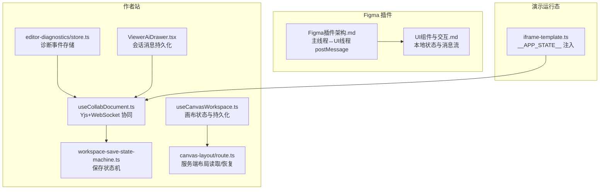
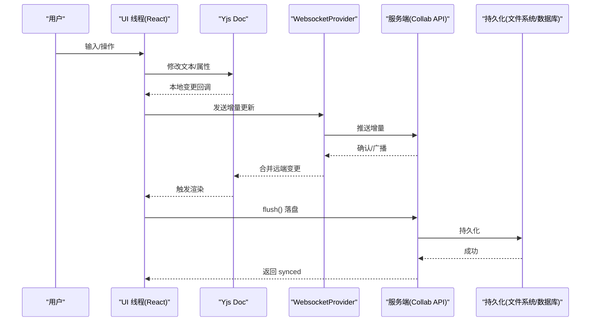
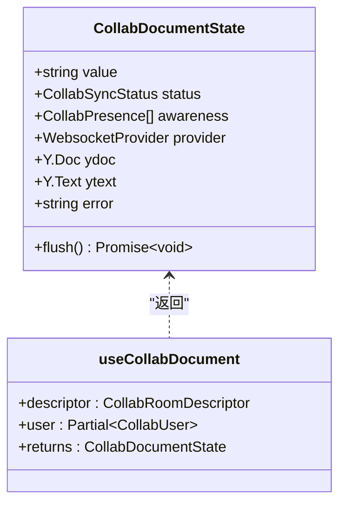
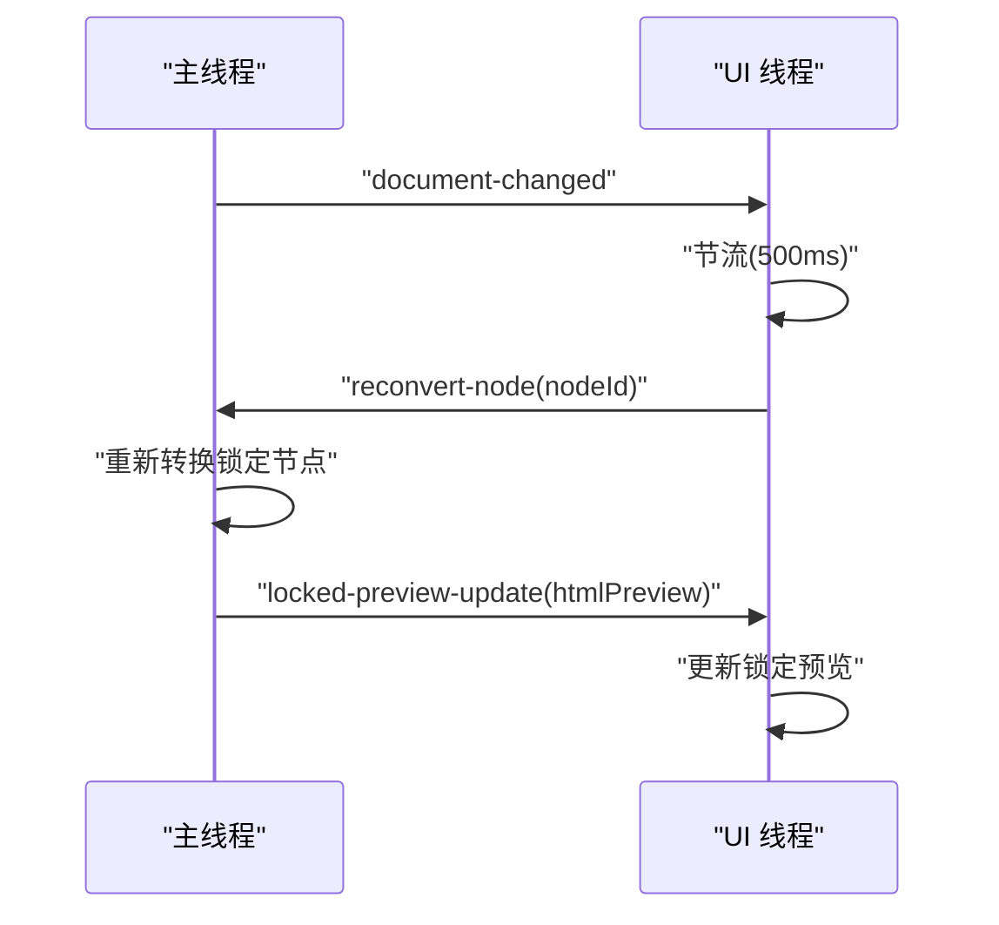
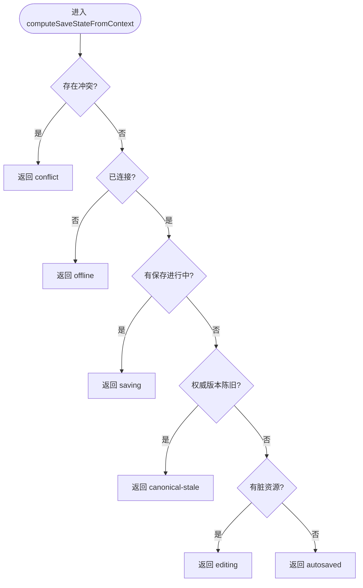
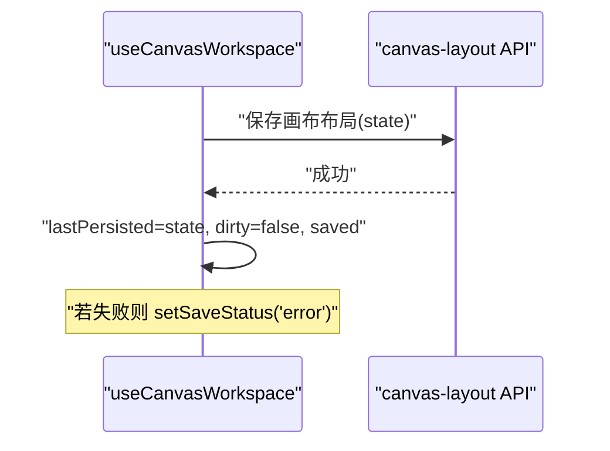
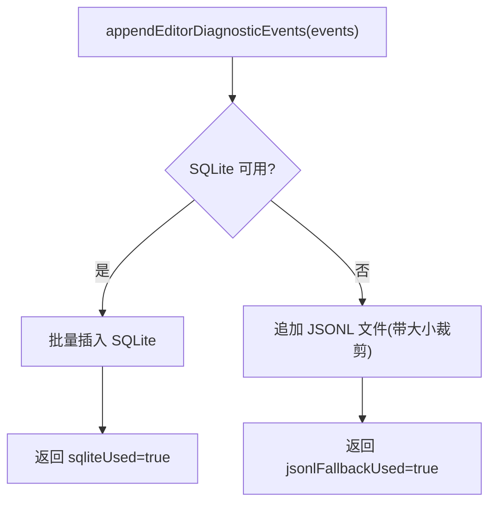
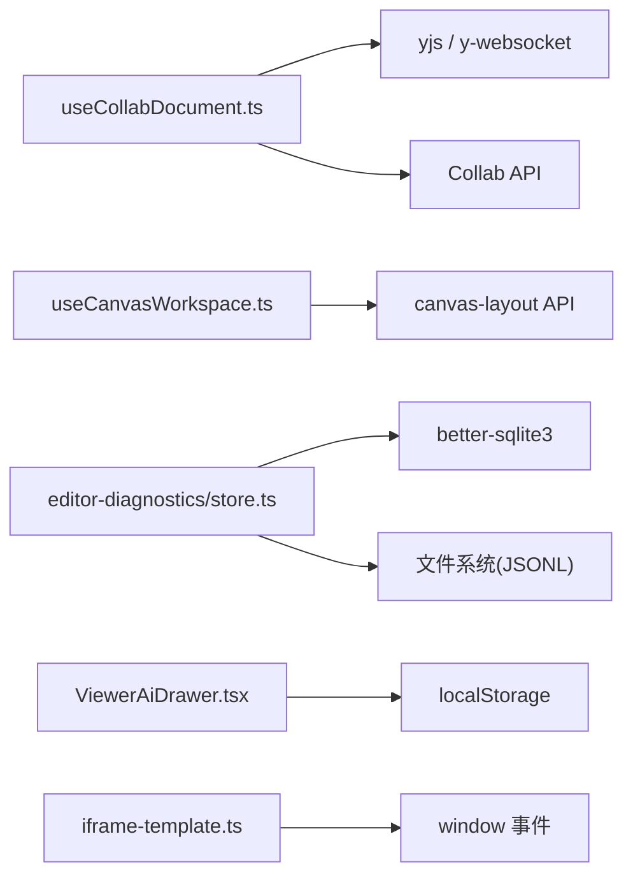

# 组件状态管理

<cite>
**本文引用的文件**
- [useCollabDocument.ts](file://packages/author-site/src/hooks/useCollabDocument.ts)
- [Figma插件架构.md](file://docs/项目文档/figma插件/技术/Figma插件架构.md)
- [UI组件与交互.md](file://docs/项目文档/figma插件/技术/UI组件与交互.md)
- [workspace-save-state-machine.ts](file://packages/author-site/src/lib/workspace-save-state-machine.ts)
- [canvas-layout/route.ts](file://packages/author-site/src/app/api/sessions/[sessionId]/canvas-layout/route.ts)
- [useCanvasWorkspace.ts](file://packages/author-site/src/components/demo/useCanvasWorkspace.ts)
- [editor-diagnostics/store.ts](file://packages/author-site/src/lib/editor-diagnostics/store.ts)
- [ViewerAiDrawer.tsx](file://packages/viewer-site/src/components/ViewerAiDrawer.tsx)
- [iframe-template.ts](file://packages/demo-ui/src/iframe-template.ts)
</cite>

## 目录
1. [简介](#简介)
2. [项目结构](#项目结构)
3. [核心组件](#核心组件)
4. [架构总览](#架构总览)
5. [详细组件分析](#详细组件分析)
6. [依赖关系分析](#依赖关系分析)
7. [性能考虑](#性能考虑)
8. [故障排查指南](#故障排查指南)
9. [结论](#结论)
10. [附录](#附录)

## 简介
本文件面向 UI 组件状态管理系统，聚焦以下目标：
- 全局状态设计与分层（本地状态、协同状态、持久化状态）
- 状态持久化策略（IndexedDB、localStorage、服务端落盘）
- 状态同步机制（Yjs + WebSocket 的增量同步、冲突解决、错误恢复）
- Figma 插件主线程与 UI 线程的状态同步协议（postMessage 消息模型、增量更新、节流重转换）
- 状态变更监听与副作用处理模式
- 最佳实践与性能优化建议
- 完整类型定义与调试工具使用说明

## 项目结构
围绕“状态”的关键位置与职责如下：
- 协同编辑与在线状态：useCollabDocument.ts
- Figma 插件双线程通信与状态流转：Figma插件架构.md、UI组件与交互.md
- 保存状态机与冲突判定：workspace-save-state-machine.ts
- 画布布局持久化与恢复：canvas-layout/route.ts、useCanvasWorkspace.ts
- 诊断事件存储与回退：editor-diagnostics/store.ts
- 会话消息持久化：ViewerAiDrawer.tsx
- 预览运行时状态注入：iframe-template.ts

图表来源
- [useCollabDocument.ts:1-346](file://packages/author-site/src/hooks/useCollabDocument.ts#L1-L346)
- [Figma插件架构.md:1-268](file://docs/项目文档/figma插件/技术/Figma插件架构.md#L1-L268)
- [UI组件与交互.md:140-190](file://docs/项目文档/figma插件/技术/UI组件与交互.md#L140-L190)
- [workspace-save-state-machine.ts:131-146](file://packages/author-site/src/lib/workspace-save-state-machine.ts#L131-L146)
- [canvas-layout/route.ts:503-546](file://packages/author-site/src/app/api/sessions/[sessionId]/canvas-layout/route.ts#L503-L546)
- [useCanvasWorkspace.ts:168-212](file://packages/author-site/src/components/demo/useCanvasWorkspace.ts#L168-L212)
- [editor-diagnostics/store.ts:218-281](file://packages/author-site/src/lib/editor-diagnostics/store.ts#L218-L281)
- [ViewerAiDrawer.tsx:142-314](file://packages/viewer-site/src/components/ViewerAiDrawer.tsx#L142-L314)
- [iframe-template.ts:1460-1494](file://packages/demo-ui/src/iframe-template.ts#L1460-L1494)

章节来源
- [useCollabDocument.ts:1-346](file://packages/author-site/src/hooks/useCollabDocument.ts#L1-L346)
- [Figma插件架构.md:1-268](file://docs/项目文档/figma插件/技术/Figma插件架构.md#L1-L268)
- [UI组件与交互.md:140-190](file://docs/项目文档/figma插件/技术/UI组件与交互.md#L140-L190)
- [workspace-save-state-machine.ts:131-146](file://packages/author-site/src/lib/workspace-save-state-machine.ts#L131-L146)
- [canvas-layout/route.ts:503-546](file://packages/author-site/src/app/api/sessions/[sessionId]/canvas-layout/route.ts#L503-L546)
- [useCanvasWorkspace.ts:168-212](file://packages/author-site/src/components/demo/useCanvasWorkspace.ts#L168-L212)
- [editor-diagnostics/store.ts:218-281](file://packages/author-site/src/lib/editor-diagnostics/store.ts#L218-L281)
- [ViewerAiDrawer.tsx:142-314](file://packages/viewer-site/src/components/ViewerAiDrawer.tsx#L142-L314)
- [iframe-template.ts:1460-1494](file://packages/demo-ui/src/iframe-template.ts#L1460-L1494)

## 核心组件
- 协同文档 Hook（useCollabDocument）
  - 基于 Yjs + WebsocketProvider 建立实时协作通道，维护 value/status/awareness/provider/ydoc/ytext 等状态。
  - 提供 flush 方法将草稿落盘至服务端，统一状态机推进 saving→synced。
- 保存状态机（computeSaveStateFromContext）
  - 根据上下文计算展示状态：conflict > offline > saving > canonical-stale > autosaved > editing。
- 画布工作区 Hook（useCanvasWorkspace）
  - 封装 canvasState 的更新、持久化、远程应用、未保存标记与页面聚焦。
- 画布布局 API（canvas-layout/route.ts）
  - 从多候选中按 updatedAt 选择最新布局，原子写入与恢复。
- 诊断事件存储（editor-diagnostics/store.ts）
  - SQLite 优先，失败回退 JSONL；支持查询与导出。
- 会话消息持久化（ViewerAiDrawer.tsx）
  - localStorage 持久化消息与会话列表，迁移兼容旧格式。
- 预览运行时状态（iframe-template.ts）
  - 通过 __APP_STATE__ 注入与 PREVIEW_APP_RUNTIME_UPDATE 事件驱动 UI 状态更新。

章节来源
- [useCollabDocument.ts:93-315](file://packages/author-site/src/hooks/useCollabDocument.ts#L93-L315)
- [workspace-save-state-machine.ts:131-146](file://packages/author-site/src/lib/workspace-save-state-machine.ts#L131-L146)
- [useCanvasWorkspace.ts:168-212](file://packages/author-site/src/components/demo/useCanvasWorkspace.ts#L168-L212)
- [canvas-layout/route.ts:503-546](file://packages/author-site/src/app/api/sessions/[sessionId]/canvas-layout/route.ts#L503-L546)
- [editor-diagnostics/store.ts:218-281](file://packages/author-site/src/lib/editor-diagnostics/store.ts#L218-L281)
- [ViewerAiDrawer.tsx:142-314](file://packages/viewer-site/src/components/ViewerAiDrawer.tsx#L142-L314)
- [iframe-template.ts:1460-1494](file://packages/demo-ui/src/iframe-template.ts#L1460-L1494)

## 架构总览
整体采用“本地状态 + 协同状态 + 持久化状态”的分层设计：
- 本地状态：React useState/useRef 管理 UI 交互与中间态
- 协同状态：Yjs 在内存中维护 CRDT 文本，WebsocketProvider 负责增量同步
- 持久化状态：IndexedDB/localStorage 做离线缓存，服务端 API 做最终一致性落盘
- 外部系统：Figma 插件主线程与 UI 线程通过 postMessage 进行指令与数据交换

图表来源
- [useCollabDocument.ts:173-303](file://packages/author-site/src/hooks/useCollabDocument.ts#L173-L303)
- [canvas-layout/route.ts:503-546](file://packages/author-site/src/app/api/sessions/[sessionId]/canvas-layout/route.ts#L503-L546)

## 详细组件分析

### 协同文档 Hook（useCollabDocument）
- 关键状态
  - value: 当前文本内容
  - status: offline/connecting/synced/saving/error
  - awareness: 协作者在线信息
  - provider/ydoc/ytext: Yjs 实例与提供者
  - flush(): 落盘接口
- 生命周期
  - 初始化时创建 Y.Doc/Y.Text/WebsocketProvider，注册 text.observe 与 awareness.change
  - 连接状态变化驱动 status 切换，并设置离线延迟计时器
  - 清理阶段销毁 Provider 与 Doc，避免内存泄漏
- 错误恢复
  - connection-error 置 error 与 status=error
  - 断开后延时降级为 offline，保持 UI 可操作
- 副作用
  - 每次文本变更更新 awareness.lastActiveAt
  - flush 调用后由服务端落盘并返回 synced

图表来源
- [useCollabDocument.ts:19-315](file://packages/author-site/src/hooks/useCollabDocument.ts#L19-L315)

章节来源
- [useCollabDocument.ts:93-315](file://packages/author-site/src/hooks/useCollabDocument.ts#L93-L315)

### Figma 插件主线程与 UI 线程状态同步协议
- 消息模型
  - 主线程 → UI：code、empty、error、update-selection-tags、check-layers-result、document-changed、locked-preview-update
  - UI → 主线程：apply-tag、toggle-static、set-layout-mode、update-ai-instruction、check-layers、select-layer-by-id、select-layer-by-warning、reconvert-node、update-settings
- 典型流程
  - 选区变化：主线程生成代码并推送 code 消息，UI 更新状态并渲染
  - 应用标记：UI 发送 apply-tag，主线程修改节点并触发 selectionchange 重新生成
  - 预览锁定：UI 记录 lockedNodeId，主线程 document-changed 通知 UI，UI 节流后请求 reconvert-node，主线程返回 locked-preview-update

图表来源
- [Figma插件架构.md:199-268](file://docs/项目文档/figma插件/技术/Figma插件架构.md#L199-L268)
- [UI组件与交互.md:140-190](file://docs/项目文档/figma插件/技术/UI组件与交互.md#L140-L190)

章节来源
- [Figma插件架构.md:100-268](file://docs/项目文档/figma插件/技术/Figma插件架构.md#L100-L268)
- [UI组件与交互.md:140-190](file://docs/项目文档/figma插件/技术/UI组件与交互.md#L140-L190)

### 保存状态机与冲突解决
- 优先级规则
  - conflict > offline > saving > canonical-stale > autosaved > editing
- 使用方式
  - 根据 hasConflict/isConnected/isMutationInFlight/isCanonicalStale/hasDirtyResources 计算 SaveState
- 适用场景
  - 无需维护状态机实例，直接基于事实推导展示状态

图表来源
- [workspace-save-state-machine.ts:131-146](file://packages/author-site/src/lib/workspace-save-state-machine.ts#L131-L146)

章节来源
- [workspace-save-state-machine.ts:131-146](file://packages/author-site/src/lib/workspace-save-state-machine.ts#L131-L146)

### 画布布局持久化与恢复
- 更新与持久化
  - updateCanvasState 标记 dirty 并更新本地状态
  - saveCanvasLayout 调用服务端保存，成功后清除 dirty 并置 saved
  - applyRemoteCanvasState 用于应用远端状态并重置 dirty
- 服务端恢复
  - 遍历候选布局，按 updatedAt 取最新，原子写入保证一致性

图表来源
- [useCanvasWorkspace.ts:168-212](file://packages/author-site/src/components/demo/useCanvasWorkspace.ts#L168-L212)
- [canvas-layout/route.ts:503-546](file://packages/author-site/src/app/api/sessions/[sessionId]/canvas-layout/route.ts#L503-L546)

章节来源
- [useCanvasWorkspace.ts:168-212](file://packages/author-site/src/components/demo/useCanvasWorkspace.ts#L168-L212)
- [canvas-layout/route.ts:503-546](file://packages/author-site/src/app/api/sessions/[sessionId]/canvas-layout/route.ts#L503-L546)

### 诊断事件存储与回退
- 写入策略
  - 优先写入 SQLite，失败自动回退到 JSONL 文件
  - 写入前进行校验与归一化，批量事务插入提升吞吐
- 查询与导出
  - 优先从 SQLite 查询，若无结果或不可用则回退扫描 JSONL
  - 导出包包含 normalizedEvents、fallbackEvents 与 agentRunLogs 索引

图表来源
- [editor-diagnostics/store.ts:218-281](file://packages/author-site/src/lib/editor-diagnostics/store.ts#L218-L281)

章节来源
- [editor-diagnostics/store.ts:218-281](file://packages/author-site/src/lib/editor-diagnostics/store.ts#L218-L281)

### 会话消息持久化（Viewer）
- 持久化键空间
  - viewer-ai:{projectId}: 消息历史
  - viewer-ai-sessions:{projectId}: 会话列表
  - viewer-ai-active-session:{projectId}: 当前会话 ID
  - viewer-ai-model:{projectId}: 模型选择
- 行为
  - 启动时迁移旧格式，过滤非法项
  - 消息变更节流持久化，异常时静默降级

章节来源
- [ViewerAiDrawer.tsx:142-314](file://packages/viewer-site/src/components/ViewerAiDrawer.tsx#L142-L314)

### 预览运行时状态注入
- 注入方式
  - 通过 __APP_STATE__/__ROUTE_PARAMS__ 注入初始状态
  - 以 PREVIEW_APP_RUNTIME_UPDATE 事件驱动 React 状态更新
- 模块加载
  - 动态 import 模块，完成后向父窗口发送 LOADED 消息

章节来源
- [iframe-template.ts:1460-1494](file://packages/demo-ui/src/iframe-template.ts#L1460-L1494)

## 依赖关系分析
- 组件耦合
  - useCollabDocument 依赖 Yjs 与 WebsocketProvider，向上暴露稳定接口
  - useCanvasWorkspace 依赖服务端 API，内部维护本地 dirty 与 lastPersisted
  - editor-diagnostics/store 同时依赖 SQLite 与文件系统，具备强回退能力
- 外部依赖
  - Yjs 提供 CRDT 语义，天然支持增量同步与冲突消解
  - Figma 插件通过 postMessage 与 UI 线程通信，无共享内存
- 潜在循环依赖
  - 当前实现未见循环引用；Hook 仅消费服务与存储，不反向依赖上层

图表来源
- [useCollabDocument.ts:1-346](file://packages/author-site/src/hooks/useCollabDocument.ts#L1-L346)
- [useCanvasWorkspace.ts:168-212](file://packages/author-site/src/components/demo/useCanvasWorkspace.ts#L168-L212)
- [editor-diagnostics/store.ts:1-554](file://packages/author-site/src/lib/editor-diagnostics/store.ts#L1-L554)
- [ViewerAiDrawer.tsx:142-314](file://packages/viewer-site/src/components/ViewerAiDrawer.tsx#L142-L314)
- [iframe-template.ts:1460-1494](file://packages/demo-ui/src/iframe-template.ts#L1460-L1494)

章节来源
- [useCollabDocument.ts:1-346](file://packages/author-site/src/hooks/useCollabDocument.ts#L1-L346)
- [useCanvasWorkspace.ts:168-212](file://packages/author-site/src/components/demo/useCanvasWorkspace.ts#L168-L212)
- [editor-diagnostics/store.ts:1-554](file://packages/author-site/src/lib/editor-diagnostics/store.ts#L1-L554)
- [ViewerAiDrawer.tsx:142-314](file://packages/viewer-site/src/components/ViewerAiDrawer.tsx#L142-L314)
- [iframe-template.ts:1460-1494](file://packages/demo-ui/src/iframe-template.ts#L1460-L1494)

## 性能考虑
- 增量同步
  - 使用 Yjs 的增量传输，避免全量同步；仅在首次或断线重连时拉取差异
- 节流与去抖
  - Figma 插件锁定预览重转换采用 500ms 节流，降低频繁重算
  - 会话消息持久化采用 5s 节流，减少频繁 IO
- 状态比较与最小更新
  - useCollabDocument 对 awareness 列表签名比较，避免不必要重渲染
  - Canvas 状态更新前后对比 lastPersisted，避免重复落盘
- 存储回退与容量控制
  - 诊断事件在 SQLite 不可用时回退 JSONL，并对文件大小进行裁剪，防止磁盘膨胀
- 异步与批处理
  - 诊断事件批量事务写入，提高吞吐并降低锁竞争

[本节为通用指导，不直接分析具体文件]

## 故障排查指南
- 协同连接失败
  - 现象：status=error，提示“协同连接失败”
  - 排查：检查网络与服务端地址，确认房间名编码与参数正确
  - 参考路径：[useCollabDocument.ts:264-270](file://packages/author-site/src/hooks/useCollabDocument.ts#L264-L270)
- 保存失败
  - 现象：saveCanvasLayout 抛出错误，UI 显示 error 状态
  - 排查：查看服务端日志与响应体，确认权限与资源路径
  - 参考路径：[useCanvasWorkspace.ts:176-185](file://packages/author-site/src/components/demo/useCanvasWorkspace.ts#L176-L185)
- 诊断事件丢失
  - 现象：SQLite 不可用，JSONL fallback 被启用
  - 排查：检查磁盘空间与权限，关注 diagnostics.warnings 中的提示
  - 参考路径：[editor-diagnostics/store.ts:252-267](file://packages/author-site/src/lib/editor-diagnostics/store.ts#L252-L267)
- 预览锁定不同步
  - 现象：文档变化后锁定预览未更新
  - 排查：确认 document-changed 是否到达 UI，节流是否生效，reconvert-node 是否返回 locked-preview-update
  - 参考路径：[Figma插件架构.md:240-268](file://docs/项目文档/figma插件/技术/Figma插件架构.md#L240-L268)

章节来源
- [useCollabDocument.ts:264-270](file://packages/author-site/src/hooks/useCollabDocument.ts#L264-L270)
- [useCanvasWorkspace.ts:176-185](file://packages/author-site/src/components/demo/useCanvasWorkspace.ts#L176-L185)
- [editor-diagnostics/store.ts:252-267](file://packages/author-site/src/lib/editor-diagnostics/store.ts#L252-L267)
- [Figma插件架构.md:240-268](file://docs/项目文档/figma插件/技术/Figma插件架构.md#L240-L268)

## 结论
本系统通过“本地状态 + 协同状态 + 持久化状态”的分层设计，结合 Yjs 的增量同步与稳健的回退策略，实现了高可用、低延迟的 UI 状态管理。Figma 插件的双线程通信协议清晰明确，配合节流与错误恢复机制，保障了复杂交互下的稳定性。建议在后续迭代中继续强化：
- 更细粒度的状态切片与选择性订阅
- 更完善的监控与指标上报（如同步延迟、冲突率）
- 统一的错误码与用户可见提示规范

[本节为总结性内容，不直接分析具体文件]

## 附录

### 状态类型定义（节选）
- 协同文档状态
  - value: string
  - status: offline | connecting | synced | saving | error
  - awareness: CollabPresence[]
  - provider: WebsocketProvider | null
  - ydoc: Y.Doc | null
  - ytext: Y.Text | null
  - flush(): Promise<void>
  - error: string | null
- 保存状态
  - conflict | offline | saving | canonical-stale | autosaved | editing

章节来源
- [useCollabDocument.ts:19-35](file://packages/author-site/src/hooks/useCollabDocument.ts#L19-L35)
- [workspace-save-state-machine.ts:131-146](file://packages/author-site/src/lib/workspace-save-state-machine.ts#L131-L146)

### 调试工具使用说明
- 浏览器 DevTools
  - 观察 Yjs awareness 与 provider 状态，验证增量同步
  - 监视 localStorage/IndexedDB 中的会话与消息持久化
- 诊断事件导出
  - 使用 buildEditorDiagnosticExport 获取 normalizedEvents、fallbackEvents 与 agentRunLogs
  - 关注 diagnostics.sqliteUsed/jsonlFallbackUsed/dbUnavailable/eventGapDetected/warnings
- Figma 插件调试
  - 在主线程与 UI 线程分别打印消息收发，核对 type 与 data 结构
  - 使用 Figma 开发者面板 Inspect Plugin 查看 UI 线程 DOM 与状态

章节来源
- [editor-diagnostics/store.ts:515-553](file://packages/author-site/src/lib/editor-diagnostics/store.ts#L515-L553)
- [Figma插件架构.md:392-418](file://docs/项目文档/figma插件/技术/Figma插件架构.md#L392-L418)