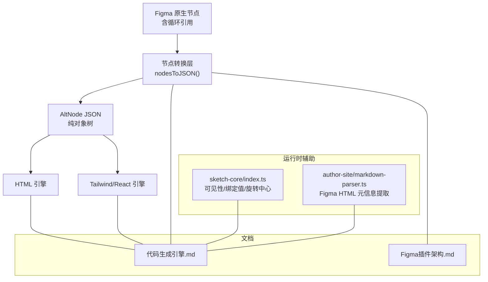
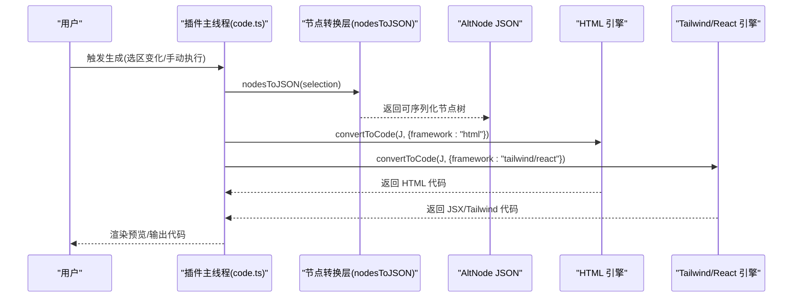
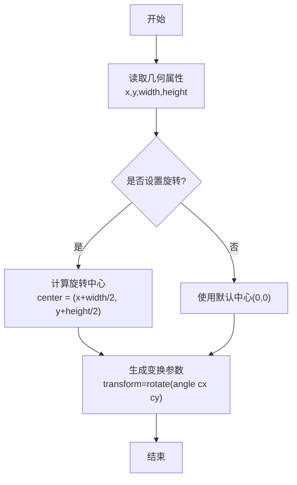
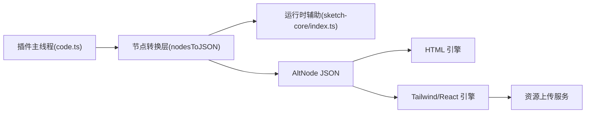

# AltNode 转换器

<cite>
**本文引用的文件**   
- [代码生成引擎.md](file://docs/项目文档/figma插件/技术/代码生成引擎.md)
- [Figma插件架构.md](file://docs/项目文档/figma插件/技术/Figma插件架构.md)
- [index.ts](file://packages/sketch-core/src/index.ts)
- [markdown-parser.ts](file://packages/author-site/lib/markdown-parser.ts)
</cite>

## 目录
1. [引言](#引言)
2. [项目结构](#项目结构)
3. [核心组件](#核心组件)
4. [架构总览](#架构总览)
5. [详细组件分析](#详细组件分析)
6. [依赖关系分析](#依赖关系分析)
7. [性能考虑](#性能考虑)
8. [故障排查指南](#故障排查指南)
9. [结论](#结论)
10. [附录](#附录)

## 引言
本文件面向“AltNode 转换器”的技术实现，聚焦从 Figma 原生节点到 AltNode JSON 的转换过程。内容覆盖：
- 循环引用处理与序列化策略
- 节点属性提取算法（位置、尺寸、样式、布局等）
- 颜色变量与样式引用（设计令牌解析与值替换）
- 节点过滤与预处理规则（不可见节点过滤、特殊标记识别）
- 转换性能优化策略与错误处理机制

该转换器是 Figma 插件与后端代码生成引擎之间的关键桥梁，负责将包含循环引用的 Figma 节点树转换为可序列化的 AltNode JSON，供后续 HTML/Tailwind/React 双引擎消费。

## 项目结构
围绕 AltNode 转换器的相关结构与职责如下：
- 文档层：描述整体流程、双引擎架构、关键算法与扩展点
- 类型与运行环境：插件主线程与 UI 线程的职责划分
- 运行时辅助：可见性判断、绑定值解析、旋转中心计算等通用能力
- 导入侧：对 Figma HTML 导出的元信息提取，用于原型页识别

图表来源
- [代码生成引擎.md:50-89](file://docs/项目文档/figma插件/技术/代码生成引擎.md#L50-L89)
- [Figma插件架构.md:269-320](file://docs/项目文档/figma插件/技术/Figma插件架构.md#L269-L320)
- [index.ts:1134-1169](file://packages/sketch-core/src/index.ts#L1134-L1169)
- [markdown-parser.ts:60-83](file://packages/author-site/lib/markdown-parser.ts#L60-L83)

章节来源
- [代码生成引擎.md:50-89](file://docs/项目文档/figma插件/技术/代码生成引擎.md#L50-L89)
- [Figma插件架构.md:269-320](file://docs/项目文档/figma插件/技术/Figma插件架构.md#L269-L320)

## 核心组件
- 入口调度与流程编排
  - 负责选择节点、调用转换、驱动代码生成与预览
- 节点转换层（altNodes）
  - 将 Figma 节点树转换为可序列化的 AltNode JSON，处理循环引用、递归子节点、提取核心属性
- 双引擎
  - HTML 引擎：输出 HTML + CSS
  - Tailwind/React 引擎：输出 React/Tailwind 代码，并支持 DSLP 标记拦截与 Props 自动生成
- 运行时辅助
  - 可见性与绑定值解析、旋转中心计算、Figma HTML 元信息提取

章节来源
- [代码生成引擎.md:50-89](file://docs/项目文档/figma插件/技术/代码生成引擎.md#L50-L89)
- [Figma插件架构.md:269-320](file://docs/项目文档/figma插件/技术/Figma插件架构.md#L269-L320)
- [index.ts:1134-1169](file://packages/sketch-core/src/index.ts#L1134-L1169)
- [markdown-parser.ts:60-83](file://packages/author-site/lib/markdown-parser.ts#L60-L83)

## 架构总览
下图展示从 Figma 节点到 AltNode JSON 再到代码生成的端到端流程，以及关键预处理与后处理环节。

图表来源
- [代码生成引擎.md:50-89](file://docs/项目文档/figma插件/技术/代码生成引擎.md#L50-L89)
- [Figma插件架构.md:269-320](file://docs/项目文档/figma插件/技术/Figma插件架构.md#L269-L320)

## 详细组件分析

### 节点转换层（altNodes）
- 目标
  - 将 Figma 原生节点（含 parent 指针等循环引用）转换为无环的 AltNode JSON，便于跨进程/跨语言序列化与传输
- 主要职责
  - 提取核心属性：位置、尺寸、样式、布局等
  - 处理颜色变量与样式引用：解析设计令牌并替换为最终值
  - 递归遍历子节点，构建层级化 JSON
  - 过滤不可见节点与特殊标记节点（如 #ignore/#prompt/#slot/#list/#static）
- 复杂度
  - 时间复杂度 O(N)，N 为节点总数；空间复杂度 O(N) 存储结果树
- 注意事项
  - 避免重复计算：对已处理的样式或资源进行缓存
  - 安全与健壮性：对缺失字段提供默认值，防止空引用异常

章节来源
- [代码生成引擎.md:68-76](file://docs/项目文档/figma插件/技术/代码生成引擎.md#L68-L76)

### 属性提取算法（位置、尺寸、样式、布局）
- 位置与尺寸
  - 从节点几何信息中读取 x/y/width/height，必要时结合父容器坐标进行相对定位
- 样式
  - 填充（fills）、边框（strokes）、圆角（radius）、阴影（effects）等映射为目标框架的样式表达
- 布局
  - Auto Layout 映射为 Flexbox/Grid 相关类名或样式
- 旋转
  - 基于节点宽高计算旋转中心，生成 transform 参数

图表来源
- [index.ts:1157-1169](file://packages/sketch-core/src/index.ts#L1157-L1169)

章节来源
- [代码生成引擎.md:171-199](file://docs/项目文档/figma插件/技术/代码生成引擎.md#L171-L199)
- [index.ts:1157-1169](file://packages/sketch-core/src/index.ts#L1157-L1169)

### 颜色变量与样式引用（设计令牌解析与值替换）
- 设计令牌
  - 在 Figma 中通过变量/样式定义的颜色、字体、间距等，需在转换阶段解析为具体值
- 替换策略
  - 优先使用绑定值解析器获取最终值；若未绑定则回退到节点默认值
  - 对颜色值进行规范化（如十六进制、透明色处理），确保下游引擎稳定消费
- 兼容与降级
  - 当令牌不存在或解析失败时，采用默认值或保留原始字符串，保证不中断流程

章节来源
- [代码生成引擎.md:68-76](file://docs/项目文档/figma插件/技术/代码生成引擎.md#L68-L76)

### 节点过滤与预处理规则
- 不可见节点过滤
  - 根据 visible 绑定值与节点类型（如 group、image 的空 src）决定是否参与转换
- 特殊标记识别
  - #ignore：跳过节点
  - #prompt：转为注释或指令
  - #slot/#list：替换为 SDK 组件或列表渲染
  - #static：导出为图片并以 img 标签渲染
- 作用范围
  - 在节点转换层与代码生成层共同生效，前者影响 AltNode 树结构，后者影响最终代码形态

章节来源
- [代码生成引擎.md:110-121](file://docs/项目文档/figma插件/技术/代码生成引擎.md#L110-L121)
- [index.ts:1143-1151](file://packages/sketch-core/src/index.ts#L1143-L1151)

### 转换性能优化策略
- 执行缓存
  - previousExecutionCache 缓存已计算的样式，避免重复计算
- 资源缓存
  - 上传后的图片资源按 hash 缓存，避免重复上传
- 并发控制
  - 资源上传队列 + 并发限制（默认 5），防止内存溢出与带宽拥塞

章节来源
- [代码生成引擎.md:202-213](file://docs/项目文档/figma插件/技术/代码生成引擎.md#L202-L213)

### 错误处理机制
- 输入校验
  - 对缺失或非法字段提供默认值与快速失败路径
- 容错与降级
  - 令牌解析失败时回退到默认值；不可见节点直接过滤
- 日志与可观测性
  - 关键步骤输出日志（如 PropsCollector 收集结果），便于定位问题

章节来源
- [代码生成引擎.md:134-168](file://docs/项目文档/figma插件/技术/代码生成引擎.md#L134-L168)

## 依赖关系分析
- 模块耦合
  - 节点转换层依赖运行时辅助（可见性、绑定值、旋转中心）
  - 双引擎依赖转换层输出的 AltNode JSON
- 外部依赖
  - Figma 插件主线程与 UI 线程通信
  - 资源上传服务（Cloudflare Worker）
- 潜在风险
  - 循环引用未在转换层正确处理会导致序列化失败
  - 大量图片同时导出可能引发内存压力

图表来源
- [Figma插件架构.md:269-320](file://docs/项目文档/figma插件/技术/Figma插件架构.md#L269-L320)
- [index.ts:1134-1169](file://packages/sketch-core/src/index.ts#L1134-L1169)

章节来源
- [Figma插件架构.md:269-320](file://docs/项目文档/figma插件/技术/Figma插件架构.md#L269-L320)

## 性能考虑
- 建议
  - 在转换前尽可能裁剪选区，减少节点数量
  - 启用执行缓存与资源缓存，降低重复计算与网络开销
  - 合理设置并发上传上限，平衡吞吐与稳定性
- 监控
  - 关注转换耗时、内存峰值与上传成功率，建立基线与告警

[本节为通用指导，无需源码引用]

## 故障排查指南
- 常见问题
  - 转换结果为空：检查可见性绑定与 image 的 src 是否为空
  - 颜色异常：确认设计令牌是否存在且可解析，必要时回退默认值
  - 预览错位：核对 Auto Layout 映射与旋转中心计算
- 调试手段
  - 查看控制台日志（如 PropsCollector 输出）
  - 在插件主线程与 UI 线程分别添加日志，追踪消息传递
  - 使用浏览器 DevTools 检查 UI 线程状态

章节来源
- [Figma插件架构.md:392-418](file://docs/项目文档/figma插件/技术/Figma插件架构.md#L392-L418)
- [代码生成引擎.md:134-168](file://docs/项目文档/figma插件/技术/代码生成引擎.md#L134-L168)

## 结论
AltNode 转换器通过“节点转换层 + 双引擎”的架构，将 Figma 原生节点高效、稳定地转化为可序列化的 AltNode JSON，并驱动 HTML 与 Tailwind/React 两种代码生成路径。其核心价值在于：
- 解决循环引用导致的序列化难题
- 统一属性提取与样式映射规范
- 提供可扩展的标记系统与 Props 自动生成
- 兼顾性能与可观测性的工程实践

[本节为总结，无需源码引用]

## 附录
- Figma HTML 导入元信息提取
  - 从 HTML 中提取画布宽高与来源标识，用于原型页识别与初始化
- 示例参考
  - 可见性判断与绑定值解析
  - 旋转中心计算与 transform 生成

章节来源
- [markdown-parser.ts:60-83](file://packages/author-site/lib/markdown-parser.ts#L60-L83)
- [index.ts:1134-1169](file://packages/sketch-core/src/index.ts#L1134-L1169)