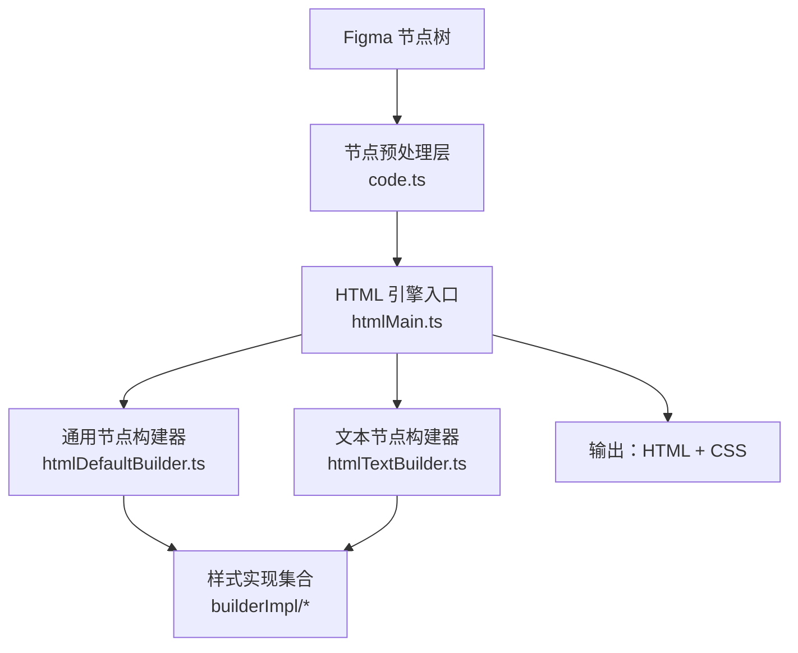
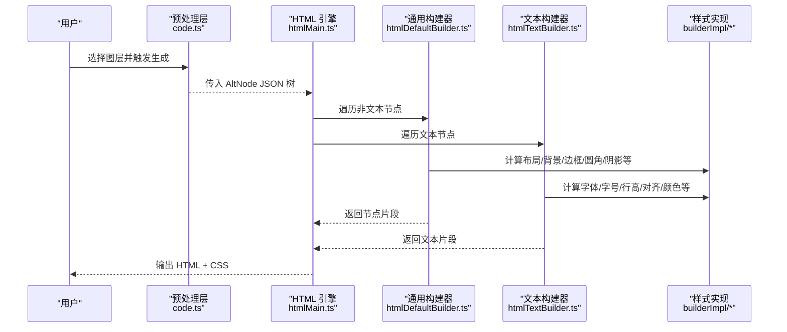
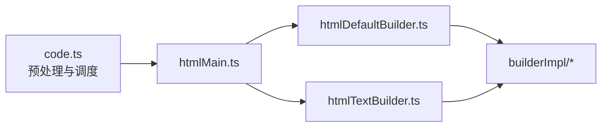

# HTML 代码生成器

<cite>
**本文引用的文件**   
- [代码生成引擎.md](file://docs/项目文档/figma插件/技术/代码生成引擎.md)
- [ImportFromFigmaDialog.tsx](file://packages/author-site/src/components/demo/ImportFromFigmaDialog.tsx)
</cite>

## 目录
1. [简介](#简介)
2. [项目结构](#项目结构)
3. [核心组件](#核心组件)
4. [架构总览](#架构总览)
5. [详细组件分析](#详细组件分析)
6. [依赖关系分析](#依赖关系分析)
7. [性能与优化建议](#性能与优化建议)
8. [故障排查指南](#故障排查指南)
9. [结论](#结论)
10. [附录：样式映射与扩展接口](#附录样式映射与扩展接口)

## 简介
本文件面向“HTML 代码生成器”的技术文档，聚焦于将 Figma 节点树转换为可运行的 HTML/CSS 的引擎实现。内容涵盖入口协调逻辑、通用节点构建器、文本节点专用处理、样式转换算法（尺寸、位置、填充、边框、圆角、阴影等）、响应式适配策略与浏览器兼容性、代码质量优化建议，以及自定义构建器的扩展接口与开发指南。

## 项目结构
根据现有资料，HTML 代码生成器属于“双引擎架构”的一部分，另一路为 Tailwind/React 引擎。HTML 引擎的核心由以下模块组成：
- htmlMain.ts：HTML 引擎入口，负责协调生成流程
- htmlDefaultBuilder.ts：通用节点构建器，处理大多数节点类型
- htmlTextBuilder.ts：文本节点专用构建器
- builderImpl/*：各类样式实现（布局、颜色、阴影等）

此外，创作端提供从 Figma 导入 HTML 的能力，支持粘贴、剪贴板读取与上传 .html/.htm 文件，并创建 prototype-html-css 页面写入 prototype.html。

图表来源
- [代码生成引擎.md:24-46](file://docs/项目文档/figma插件/技术/代码生成引擎.md#L24-L46)
- [代码生成引擎.md:79-88](file://docs/项目文档/figma插件/技术/代码生成引擎.md#L79-L88)

章节来源
- [代码生成引擎.md:24-46](file://docs/项目文档/figma插件/技术/代码生成引擎.md#L24-L46)
- [代码生成引擎.md:79-88](file://docs/项目文档/figma插件/技术/代码生成引擎.md#L79-L88)

## 核心组件
- 入口调度（HTML 引擎）
  - 职责：接收 AltNode JSON 树，按节点类型分发到对应构建器，汇总生成 HTML 与 CSS。
  - 关键流程：遍历节点树 → 识别节点类型 → 调用构建器 → 合并样式与结构 → 输出结果。
- 通用节点构建器
  - 职责：处理容器、图形、组合等常见节点；应用布局、背景、边框、圆角、阴影等样式；递归处理子节点。
- 文本节点构建器
  - 职责：处理文本节点，解析字体、字号、行高、对齐、颜色、装饰线等文本相关样式，生成文本节点与内联样式。
- 样式实现集合
  - 职责：将 Figma 属性映射为 CSS 属性值，如尺寸、位置、填充、边框、圆角、阴影等。

章节来源
- [代码生成引擎.md:79-88](file://docs/项目文档/figma插件/技术/代码生成引擎.md#L79-L88)

## 架构总览
整体采用“预处理 + 双引擎并行”的架构。HTML 引擎与 Tailwind/React 引擎共享预处理阶段（过滤不可见节点、处理特殊标记），随后各自独立生成目标代码。

图表来源
- [代码生成引擎.md:50-66](file://docs/项目文档/figma插件/技术/代码生成引擎.md#L50-L66)
- [代码生成引擎.md:79-88](file://docs/项目文档/figma插件/技术/代码生成引擎.md#L79-L88)

## 详细组件分析

### 入口函数 htmlMain.ts
- 角色定位：HTML 引擎的编排者，负责驱动节点遍历、构建器选择与结果聚合。
- 主要职责：
  - 接收 AltNode JSON 树
  - 按节点类型路由至通用或文本构建器
  - 收集生成的 HTML 片段与 CSS 规则
  - 组装最终文档结构（可选包裹标签、样式注入方式）
- 与其他模块的关系：
  - 依赖通用构建器与文本构建器完成具体节点的渲染
  - 依赖样式实现集合完成 Figma 属性到 CSS 的映射

章节来源
- [代码生成引擎.md:79-88](file://docs/项目文档/figma插件/技术/代码生成引擎.md#L79-L88)

### 通用节点构建器 htmlDefaultBuilder.ts
- 角色定位：处理除文本外的绝大多数节点类型（容器、图形、组合等）。
- 主要职责：
  - 解析节点几何信息（位置、尺寸）
  - 应用背景色、渐变、边框、圆角、阴影等视觉样式
  - 递归处理子节点，维护层级与嵌套结构
- 典型处理流程：
  - 读取节点属性 → 计算布局与尺寸 → 生成 CSS 片段 → 生成 HTML 片段 → 合并子节点结果

章节来源
- [代码生成引擎.md:79-88](file://docs/项目文档/figma插件/技术/代码生成引擎.md#L79-L88)

### 文本节点专用处理 htmlTextBuilder.ts
- 角色定位：专门处理文本节点，确保文本样式与排版准确还原。
- 主要职责：
  - 解析字体族、字号、字重、行高、字母间距、对齐方式
  - 处理文本颜色、描边、阴影、装饰线等
  - 生成文本节点与对应的内联样式或样式类
- 注意事项：
  - 多行文本换行与溢出处理
  - 富文本与纯文本的差异处理（若存在）

章节来源
- [代码生成引擎.md:79-88](file://docs/项目文档/figma插件/技术/代码生成引擎.md#L79-L88)

### 样式转换算法（Figma → CSS）
- 尺寸与位置
  - 输入：节点 width/height、x/y、约束（constraints）
  - 输出：CSS width/height、position/top/left/right/bottom、margin/padding
- 填充与内边距
  - 输入：padding 四值或统一值
  - 输出：CSS padding
- 边框与圆角
  - 输入：strokeWidth、strokeColor、cornerRadii
  - 输出：border-*、border-radius
- 阴影
  - 输入：dropShadow、innerShadow 列表
  - 输出：box-shadow 序列
- 背景与渐变
  - 输入：fill 列表（纯色、线性/径向渐变）
  - 输出：background-color / background-image 与相应渐变语法
- 文本样式
  - 输入：fontSize、fontFamily、fontWeight、lineHeight、textAlign、textDecoration
  - 输出：对应 CSS 文本属性

章节来源
- [代码生成引擎.md:79-88](file://docs/项目文档/figma插件/技术/代码生成引擎.md#L79-L88)

### 响应式适配策略与浏览器兼容性
- 响应式策略
  - 使用相对单位（%、vw/vh、rem）替代固定像素，提升在不同视口下的适应性
  - 对容器节点优先采用弹性布局（flex/grid）以增强自适应能力
  - 针对图片与媒体资源设置 max-width: 100% 与 object-fit 控制缩放
- 兼容性处理
  - 避免使用仅新浏览器支持的 CSS 特性，必要时提供降级方案
  - 对 box-shadow、border-radius、渐变等广泛支持的属性保持默认兼容写法
  - 在需要时通过 polyfill 或渐进增强手段覆盖旧版浏览器差异

[本节为通用指导，不直接分析具体文件]

## 依赖关系分析
HTML 引擎内部依赖关系如下：
- htmlMain.ts 依赖 htmlDefaultBuilder.ts 与 htmlTextBuilder.ts
- 两个构建器共同依赖 builderImpl/* 进行样式映射
- 上层 code.ts 负责节点预处理与调度，向 HTML 引擎提供 AltNode JSON

图表来源
- [代码生成引擎.md:50-66](file://docs/项目文档/figma插件/技术/代码生成引擎.md#L50-L66)
- [代码生成引擎.md:79-88](file://docs/项目文档/figma插件/技术/代码生成引擎.md#L79-L88)

章节来源
- [代码生成引擎.md:50-66](file://docs/项目文档/figma插件/技术/代码生成引擎.md#L50-L66)
- [代码生成引擎.md:79-88](file://docs/项目文档/figma插件/技术/代码生成引擎.md#L79-L88)

## 性能与优化建议
- HTML 结构优化
  - 减少不必要的嵌套层级，合并相邻同构节点
  - 为重复样式抽取公共类名，避免重复内联样式
- CSS 压缩与内联策略
  - 对静态样式进行压缩与去重
  - 首屏关键样式内联，其余样式按需加载
- 资源内联与懒加载
  - 小图标与背景图可 base64 内联以减少请求
  - 大图片与视频采用懒加载与占位图
- 构建期优化
  - 预计算常用样式组合，缓存中间结果
  - 对大型节点树进行分块生成与增量更新

[本节为通用指导，不直接分析具体文件]

## 故障排查指南
- 导入失败或格式错误
  - 现象：提示“格式解析失败”，请确认内容为 Figma 插件导出的 HTML 或旧版 Markdown 格式
  - 排查：检查粘贴内容是否为完整 HTML 文档；确认文件编码与字符集
- 文件类型不支持
  - 现象：提示“文件类型不支持”，请选择 .html 或 .htm 文件
  - 排查：确认上传文件的后缀与 MIME 类型
- 读取文件失败
  - 现象：提示“读取文件失败”
  - 排查：检查文件系统权限与文件大小限制
- 未创建 Session
  - 现象：提示“未创建 Session”，请先进入编辑模式
  - 排查：确保处于正确的会话上下文后再执行导入

章节来源
- [ImportFromFigmaDialog.tsx:83-136](file://packages/author-site/src/components/demo/ImportFromFigmaDialog.tsx#L83-L136)

## 结论
HTML 代码生成器基于清晰的模块化设计，通过入口协调、通用与文本构建器分工协作，配合完善的样式映射实现，能够稳定地将 Figma 节点树转换为高质量的 HTML/CSS。结合响应式与兼容性策略、构建期优化与导入流程的健壮性保障，可在多种场景下高效产出可用前端代码。

[本节为总结性内容，不直接分析具体文件]

## 附录：样式映射与扩展接口

### 样式映射速查表（Figma → CSS）
- 尺寸与位置
  - width/height → width/height
  - x/y/constraints → position/top/left/right/bottom/margin
- 填充
  - padding → padding
- 边框与圆角
  - strokeWidth/strokeColor → border-width/border-color
  - cornerRadii → border-radius
- 阴影
  - dropShadow/innerShadow → box-shadow
- 背景与渐变
  - fill → background-color/background-image
- 文本样式
  - fontSize/fontFamily/fontWeight/lineHeight/textAlign/textDecoration → 对应 CSS 文本属性

章节来源
- [代码生成引擎.md:79-88](file://docs/项目文档/figma插件/技术/代码生成引擎.md#L79-L88)

### 自定义构建器扩展接口与开发指南
- 扩展点
  - 新增节点类型：在入口中注册新的类型分支，并实现对应构建器
  - 新增样式映射：在 builderImpl/* 中补充 Figma 属性到 CSS 的转换逻辑
- 开发步骤
  - 定义节点类型与数据模型
  - 实现构建器方法，返回 HTML 片段与 CSS 片段
  - 在入口中注册该构建器，参与遍历与聚合
  - 编写单元测试验证样式与结构正确性
- 最佳实践
  - 保持构建器无副作用，便于测试与复用
  - 对复杂样式进行抽象与组合，避免重复逻辑
  - 遵循命名约定与注释规范，提升可维护性

[本节为通用指导，不直接分析具体文件]