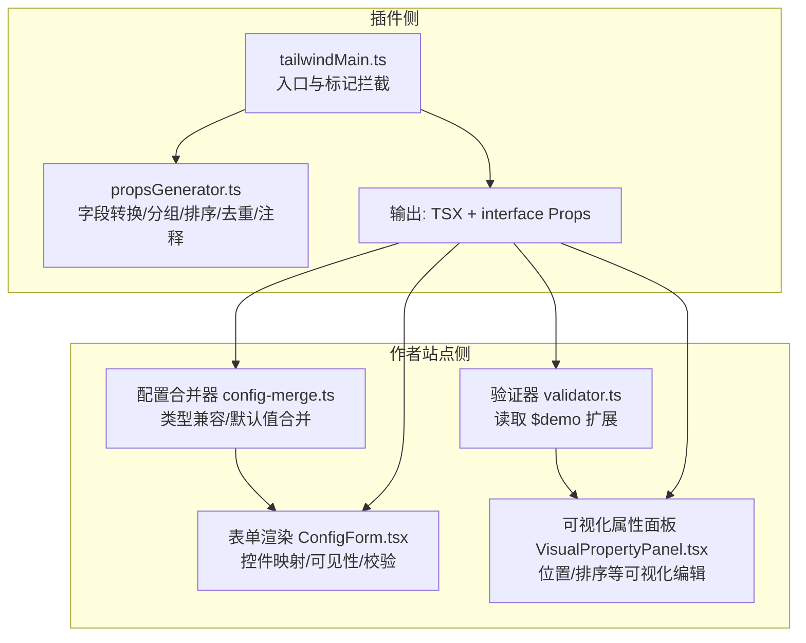
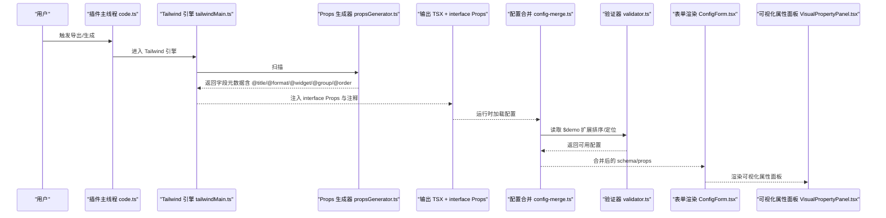
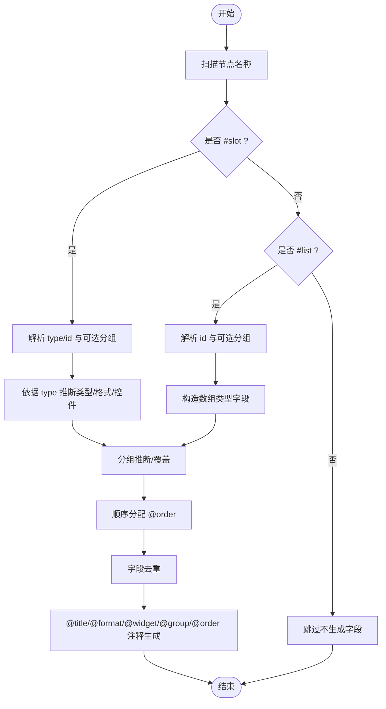
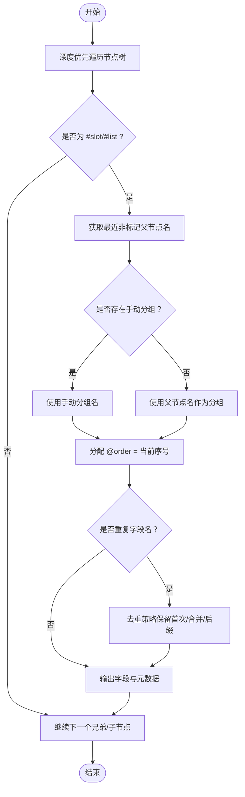
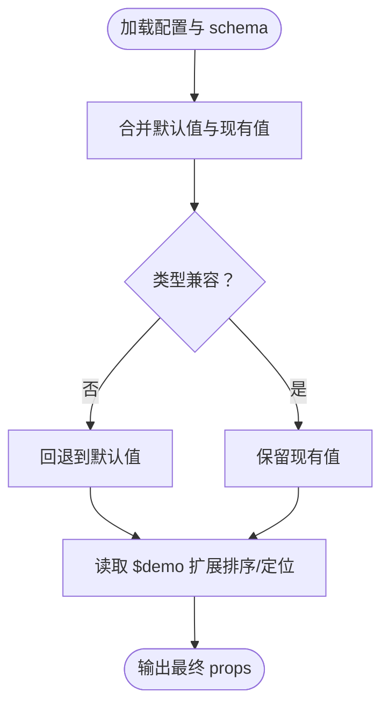
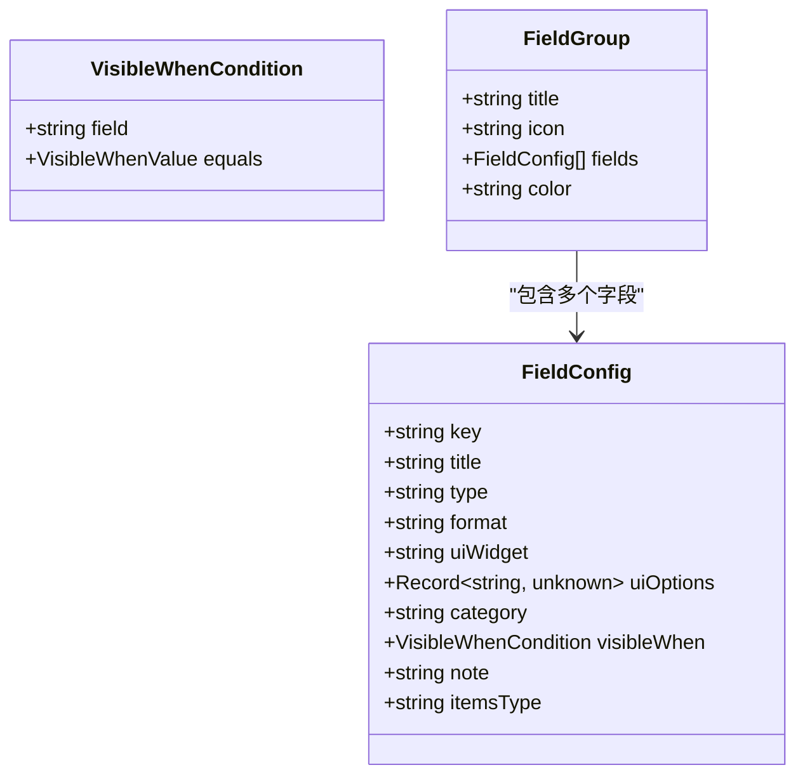
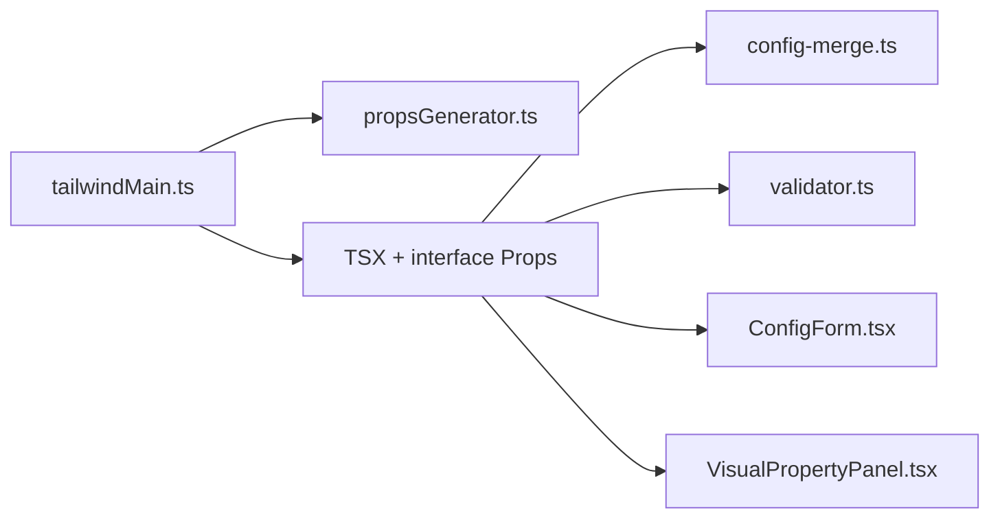

# Props 自动生成系统

<cite>
**本文引用的文件**   
- [代码生成引擎.md](file://docs/项目文档/figma插件/技术/代码生成引擎.md)
- [标记系统.md](file://docs/项目文档/figma插件/技术/标记系统.md)
- [配置系统_需求文档.md](file://docs/项目文档/创作端/04-配置与预览/配置系统_需求文档.md)
- [ConfigForm.tsx](file://packages/demo-ui/src/ConfigForm.tsx)
- [validator.ts](file://packages/demo-ui/src/validator.ts)
- [config-merge.ts](file://packages/author-site/src/lib/config-merge.ts)
- [VisualPropertyPanel.tsx](file://packages/author-site/src/app/demo/[id]/edit/components/VisualPropertyPanel.tsx)
</cite>

## 目录
1. [简介](#简介)
2. [项目结构](#项目结构)
3. [核心组件](#核心组件)
4. [架构总览](#架构总览)
5. [详细组件分析](#详细组件分析)
6. [依赖关系分析](#依赖关系分析)
7. [性能考虑](#性能考虑)
8. [故障排查指南](#故障排查指南)
9. [结论](#结论)
10. [附录](#附录)

## 简介
本文件面向“Props 自动生成系统”，系统性阐述从 Figma 节点到可驱动工作台配置面板的 Props 元数据的全链路生成机制。重点覆盖：
- #slot 与 #list 标记识别与字段推断
- 元数据注释自动添加（@title、@format、@widget、@group、@order）
- 字段命名规范与类型推断（字符串、数字、布尔值、数组）
- 分组规则与顺序分配算法（基于父节点名称的智能分组）
- 向后兼容策略与降级处理

## 项目结构
该能力由“Figma 插件侧”和“作者站点/表单渲染侧”共同组成：
- 插件侧负责在生成 JSX 时收集 #slot/#list 并注入 interface Props 及元数据注释
- 作者站点侧负责解析与渲染这些元数据，形成可视化配置面板

图表来源
- [代码生成引擎.md:1-170](file://docs/项目文档/figma插件/技术/代码生成引擎.md#L1-L170)
- [标记系统.md:216-227](file://docs/项目文档/figma插件/技术/标记系统.md#L216-L227)
- [config-merge.ts:102-132](file://packages/author-site/src/lib/config-merge.ts#L102-L132)
- [ConfigForm.tsx:70-116](file://packages/demo-ui/src/ConfigForm.tsx#L70-L116)
- [validator.ts:101-158](file://packages/demo-ui/src/validator.ts#L101-L158)
- [VisualPropertyPanel.tsx:954-972](file://packages/author-site/src/app/demo/[id]/edit/components/VisualPropertyPanel.tsx#L954-L972)

章节来源
- [代码生成引擎.md:1-170](file://docs/项目文档/figma插件/技术/代码生成引擎.md#L1-L170)
- [标记系统.md:216-227](file://docs/项目文档/figma插件/技术/标记系统.md#L216-L227)

## 核心组件
- 标记识别与拦截层
  - 识别 #slot:type:id 与 #list:id 两类标记；普通命名节点不参与 Props 生成
  - 支持手动分组覆盖语法：#slot:img:banner[Banner区域]、#list:products[商品列表]
- Props 收集与生成器
  - 字段名转换（如 snake_case → camelCase）
  - 分组推断（默认取最近非标记父节点名作为 @group）
  - 顺序分配（按遍历顺序递增 @order）
  - 字段去重（同名冲突时保留首次或按策略合并）
  - 注释生成（为每个字段附加 @title/@format/@widget/@group/@order）
- 运行时配置合并与校验
  - 类型兼容性检查（string/number/integer/boolean/array/object）
  - 默认值与 $demo 扩展（排序、定位）合并
- 表单渲染与可视化编辑
  - 根据 type/format/uiWidget 选择控件
  - 支持可见性条件、枚举、范围、最大项数等
  - 可视化属性面板提供位置、尺寸等直观编辑

章节来源
- [代码生成引擎.md:124-170](file://docs/项目文档/figma插件/技术/代码生成引擎.md#L124-L170)
- [标记系统.md:216-227](file://docs/项目文档/figma插件/技术/标记系统.md#L216-L227)
- [配置系统_需求文档.md:243-263](file://docs/项目文档/创作端/04-配置与预览/配置系统_需求文档.md#L243-L263)
- [config-merge.ts:102-132](file://packages/author-site/src/lib/config-merge.ts#L102-L132)
- [ConfigForm.tsx:70-116](file://packages/demo-ui/src/ConfigForm.tsx#L70-L116)
- [validator.ts:101-158](file://packages/demo-ui/src/validator.ts#L101-L158)
- [VisualPropertyPanel.tsx:954-972](file://packages/author-site/src/app/demo/[id]/edit/components/VisualPropertyPanel.tsx#L954-L972)

## 架构总览
下图展示从 Figma 节点到配置面板的端到端流程，包括标记识别、Props 生成、元数据注入、运行时合并与表单渲染。

图表来源
- [代码生成引擎.md:1-170](file://docs/项目文档/figma插件/技术/代码生成引擎.md#L1-L170)
- [标记系统.md:216-227](file://docs/项目文档/figma插件/技术/标记系统.md#L216-L227)
- [config-merge.ts:102-132](file://packages/author-site/src/lib/config-merge.ts#L102-L132)
- [validator.ts:101-158](file://packages/demo-ui/src/validator.ts#L101-L158)
- [ConfigForm.tsx:70-116](file://packages/demo-ui/src/ConfigForm.tsx#L70-L116)
- [VisualPropertyPanel.tsx:954-972](file://packages/author-site/src/app/demo/[id]/edit/components/VisualPropertyPanel.tsx#L954-L972)

## 详细组件分析

### 标记识别与字段推断
- 仅 #slot 与 #list 参与 Props 生成；普通命名节点不生成字段
- #slot:type:id 映射到具体 UI 语义（如图片、文本、视频），据此推断 format 与 widget
- #list:id 映射为数组类型字段，并附带标题元数据
- 支持手动分组覆盖：在标记末尾追加 [分组名]

图表来源
- [代码生成引擎.md:124-170](file://docs/项目文档/figma插件/技术/代码生成引擎.md#L124-L170)
- [标记系统.md:216-227](file://docs/项目文档/figma插件/技术/标记系统.md#L216-L227)

章节来源
- [代码生成引擎.md:124-170](file://docs/项目文档/figma插件/技术/代码生成引擎.md#L124-L170)
- [标记系统.md:216-227](file://docs/项目文档/figma插件/技术/标记系统.md#L216-L227)

### 元数据注释生成机制
- @title：用于字段显示标题，可从节点名或上下文推导
- @format：遵循 JSON Schema 标准语义（如 string、uri 等）
- @widget：UI 控件映射（input、image-upload、video-upload 等）
- @group：分组键，默认使用最近非标记父节点名；支持手动覆盖
- @order：顺序号，按遍历顺序递增，保证稳定排序

章节来源
- [代码生成引擎.md:124-170](file://docs/项目文档/figma插件/技术/代码生成引擎.md#L124-L170)

### 字段命名规范与类型推断
- 命名规范
  - 将下划线风格转为驼峰（如 hero_banner → heroBanner）
  - 保持唯一性，必要时进行去重或后缀处理
- 类型推断
  - 字符串：text 类 slot 推断为 string
  - 数值：若上下文或默认值为数字则推断 number/integer
  - 布尔值：开关/复选框场景推断 boolean
  - 数组：#list 推断为 Array<object> 或 Array<string> 等
  - 对象：嵌套结构通过子节点递归推断

章节来源
- [代码生成引擎.md:124-170](file://docs/项目文档/figma插件/技术/代码生成引擎.md#L124-L170)
- [配置系统_需求文档.md:243-263](file://docs/项目文档/创作端/04-配置与预览/配置系统_需求文档.md#L243-L263)

### 分组规则与顺序分配算法
- 分组规则
  - 默认：取最近的非标记父节点名称作为 @group
  - 手动覆盖：在标记后追加 [分组名]
- 顺序分配
  - 按深度优先遍历顺序递增 @order，确保稳定的 UI 顺序
  - 同组内按 @order 排序，跨组按组内顺序拼接

图表来源
- [代码生成引擎.md:124-170](file://docs/项目文档/figma插件/技术/代码生成引擎.md#L124-L170)
- [标记系统.md:216-227](file://docs/项目文档/figma插件/技术/标记系统.md#L216-L227)

章节来源
- [代码生成引擎.md:124-170](file://docs/项目文档/figma插件/技术/代码生成引擎.md#L124-L170)
- [标记系统.md:216-227](file://docs/项目文档/figma插件/技术/标记系统.md#L216-L227)

### 向后兼容与降级处理
- 若生成的 TSX 缺失 interface Props 或元数据不完整，作者站点仍按原有推断逻辑降级处理
- JSX 主体结构保持不变，Props 作为增强信息注入，不破坏既有渲染链路
- 运行时类型兼容性检查确保旧配置与新 schema 共存

章节来源
- [代码生成引擎.md:154-157](file://docs/项目文档/figma插件/技术/代码生成引擎.md#L154-L157)
- [config-merge.ts:102-132](file://packages/author-site/src/lib/config-merge.ts#L102-L132)

### 运行时配置合并与校验
- 类型兼容性检查：对现有值与 schema 定义进行类型匹配（string/number/integer/boolean/array/object）
- 默认值合并：当值缺失或类型不兼容时使用默认值
- $demo 扩展：读取 orderable/orderableHorizontal/positionable 等扩展，注入到 props 中供编辑器使用

图表来源
- [config-merge.ts:102-132](file://packages/author-site/src/lib/config-merge.ts#L102-L132)
- [validator.ts:101-158](file://packages/demo-ui/src/validator.ts#L101-L158)

章节来源
- [config-merge.ts:102-132](file://packages/author-site/src/lib/config-merge.ts#L102-L132)
- [validator.ts:101-158](file://packages/demo-ui/src/validator.ts#L101-L158)

### 表单渲染与可视化编辑
- 控件映射三层优先级：ui:widget 显式覆盖 > format 语义映射 > type 数据类型回退
- 支持可见性条件、枚举、范围、最大项数等高级选项
- 可视化属性面板提供位置、尺寸等直观编辑体验

图表来源
- [ConfigForm.tsx:70-116](file://packages/demo-ui/src/ConfigForm.tsx#L70-L116)
- [配置系统_需求文档.md:243-263](file://docs/项目文档/创作端/04-配置与预览/配置系统_需求文档.md#L243-L263)
- [VisualPropertyPanel.tsx:954-972](file://packages/author-site/src/app/demo/[id]/edit/components/VisualPropertyPanel.tsx#L954-L972)

章节来源
- [ConfigForm.tsx:70-116](file://packages/demo-ui/src/ConfigForm.tsx#L70-L116)
- [配置系统_需求文档.md:243-263](file://docs/项目文档/创作端/04-配置与预览/配置系统_需求文档.md#L243-L263)
- [VisualPropertyPanel.tsx:954-972](file://packages/author-site/src/app/demo/[id]/edit/components/VisualPropertyPanel.tsx#L954-L972)

## 依赖关系分析
- 插件侧依赖
  - tailwindMain.ts 负责入口与标记拦截，调用 propsGenerator.ts 完成字段收集与元数据生成
  - 输出 TSX 同时携带 interface Props 与注释，便于后续编译与运行
- 作者站点侧依赖
  - config-merge.ts 负责类型兼容与默认值合并
  - validator.ts 负责读取 $demo 扩展（排序/定位）
  - ConfigForm.tsx 负责根据 type/format/uiWidget 渲染控件
  - VisualPropertyPanel.tsx 提供可视化属性编辑（位置、尺寸等）

图表来源
- [代码生成引擎.md:1-170](file://docs/项目文档/figma插件/技术/代码生成引擎.md#L1-L170)
- [config-merge.ts:102-132](file://packages/author-site/src/lib/config-merge.ts#L102-L132)
- [validator.ts:101-158](file://packages/demo-ui/src/validator.ts#L101-L158)
- [ConfigForm.tsx:70-116](file://packages/demo-ui/src/ConfigForm.tsx#L70-L116)
- [VisualPropertyPanel.tsx:954-972](file://packages/author-site/src/app/demo/[id]/edit/components/VisualPropertyPanel.tsx#L954-L972)

章节来源
- [代码生成引擎.md:1-170](file://docs/项目文档/figma插件/技术/代码生成引擎.md#L1-L170)
- [config-merge.ts:102-132](file://packages/author-site/src/lib/config-merge.ts#L102-L132)
- [validator.ts:101-158](file://packages/demo-ui/src/validator.ts#L101-L158)
- [ConfigForm.tsx:70-116](file://packages/demo-ui/src/ConfigForm.tsx#L70-L116)
- [VisualPropertyPanel.tsx:954-972](file://packages/author-site/src/app/demo/[id]/edit/components/VisualPropertyPanel.tsx#L954-L972)

## 性能考虑
- 标记扫描与字段生成采用单次深度优先遍历，避免重复计算
- 字段去重与分组推断在内存中进行，时间复杂度近似 O(n)
- 运行时合并仅在加载配置时执行，且类型检查为常数级分支判断
- 建议对大型页面进行分页或懒加载以减轻首屏压力

## 故障排查指南
- 现象：未看到 interface Props 或元数据注释
  - 确认已构建并重新加载插件产物
  - 控制台应出现 “[PropsCollector] collected props:” 日志
- 现象：字段类型不正确
  - 检查 #slot 的 type 是否与预期一致（img/text/video）
  - 确认运行时类型兼容性检查是否触发回退
- 现象：分组或顺序不符合预期
  - 检查是否使用了手动分组覆盖语法
  - 确认遍历顺序与 @order 分配是否符合预期
- 现象：可视化属性面板异常
  - 检查 $demo 扩展是否完整（orderable/orderableHorizontal/positionable）
  - 确认控件映射优先级（ui:widget > format > type）

章节来源
- [代码生成引擎.md:159-167](file://docs/项目文档/figma插件/技术/代码生成引擎.md#L159-L167)
- [标记系统.md:216-227](file://docs/项目文档/figma插件/技术/标记系统.md#L216-L227)
- [config-merge.ts:102-132](file://packages/author-site/src/lib/config-merge.ts#L102-L132)
- [validator.ts:101-158](file://packages/demo-ui/src/validator.ts#L101-L158)
- [ConfigForm.tsx:70-116](file://packages/demo-ui/src/ConfigForm.tsx#L70-L116)
- [VisualPropertyPanel.tsx:954-972](file://packages/author-site/src/app/demo/[id]/edit/components/VisualPropertyPanel.tsx#L954-L972)

## 结论
Props 自动生成系统将 Figma 设计中的 #slot/#list 标记直接转化为可驱动配置面板的结构化元数据，显著降低人工补全成本。通过严格的命名规范、类型推断、分组与顺序算法，以及完善的向后兼容与降级策略，系统在易用性与稳定性之间取得良好平衡。配合运行时合并与可视化编辑，进一步提升了创作效率与用户体验。

## 附录
- 验收步骤（开发/验收）
  - 构建插件主线程产物
  - 在 Figma 中 Reload 插件
  - 再次生成并确认代码顶部出现 interface Props
  - 控制台确认存在 “[PropsCollector] collected props:” 日志

章节来源
- [代码生成引擎.md:159-167](file://docs/项目文档/figma插件/技术/代码生成引擎.md#L159-L167)