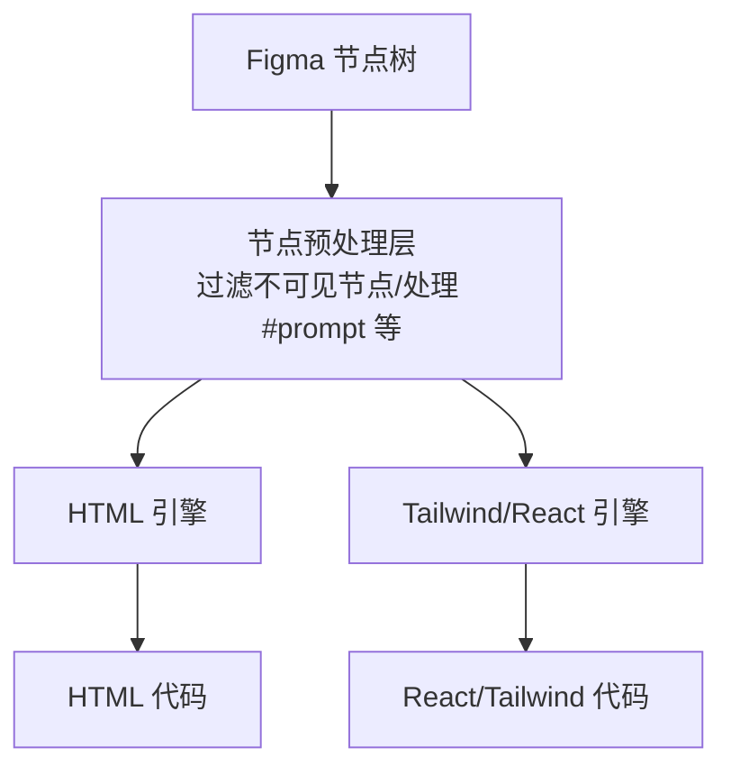
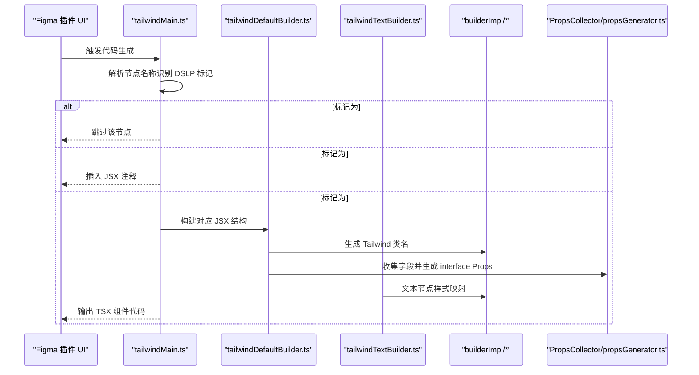
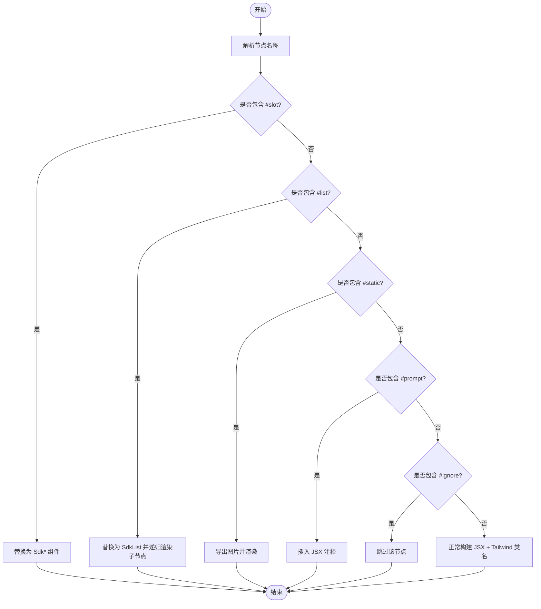
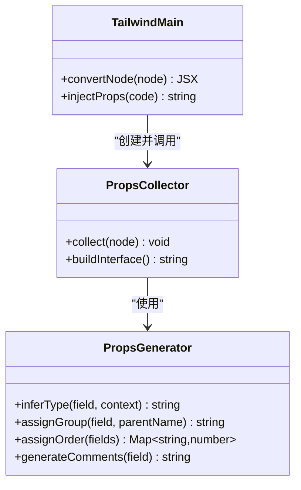
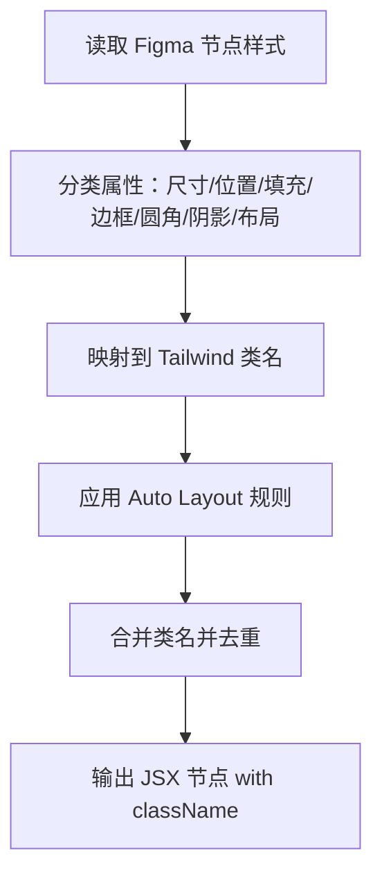
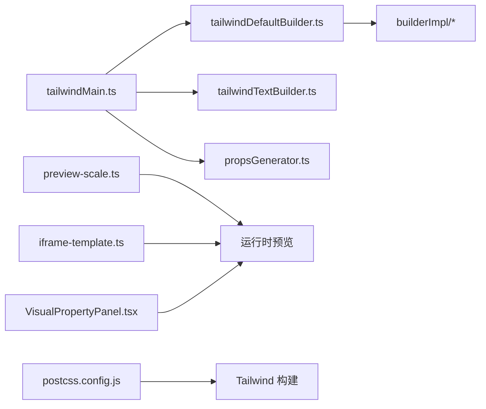

# Tailwind/React 代码生成器

<cite>
**本文引用的文件**   
- [代码生成引擎.md](file://docs/项目文档/figma插件/技术/代码生成引擎.md)
- [标记系统.md](file://docs/项目文档/figma插件/技术/标记系统.md)
- [Figma插件架构.md](file://docs/项目文档/figma插件/技术/Figma插件架构.md)
- [schema-generator.test.ts](file://packages/author-site/lib/__tests__/schema-generator.test.ts)
- [validator.ts](file://packages/shared/src/validator.ts)
- [preview-scale.ts](file://packages/demo-ui/src/preview-scale.ts)
- [iframe-template.ts](file://packages/demo-ui/src/iframe-template.ts)
- [VisualPropertyPanel.tsx](file://packages/author-site/src/app/demo/[id]/edit/components/VisualPropertyPanel.tsx)
- [postcss.config.js (sketch-playground)](file://packages/sketch-playground/postcss.config.js)
- [postcss.config.js (viewer-site)](file://packages/viewer-site/postcss.config.js)
- [postcss.config.js (author-site)](file://packages/author-site/postcss.config.js)
</cite>

## 目录
1. [简介](#简介)
2. [项目结构](#项目结构)
3. [核心组件](#核心组件)
4. [架构总览](#架构总览)
5. [详细组件分析](#详细组件分析)
6. [依赖关系分析](#依赖关系分析)
7. [性能考虑](#性能考虑)
8. [故障排查指南](#故障排查指南)
9. [结论](#结论)
10. [附录](#附录)

## 简介
本技术文档聚焦于 Tailwind/React 代码生成器，系统性阐述 DSLP（Design System Language Protocol）标记系统的设计理念与处理逻辑，解析 React 组件生成流程（JSX 结构构建、Props 自动生成机制与 TypeScript 类型定义），并说明 Tailwind CSS 类名生成算法（样式属性到 Tailwind 类的智能映射与响应式断点处理）。此外，提供组件封装最佳实践、性能优化策略，以及自定义标记扩展与 SDK 组件集成指南。

## 项目结构
该能力由“双引擎”架构实现：HTML 引擎与 Tailwind/React 引擎并行工作，根据用户选择输出不同格式的代码。Tailwind/React 引擎是 DSLP 的主要输出目标，负责将 Figma 节点树转换为带 Tailwind 类名的 React 组件代码，并在生成过程中识别与处理 DSLP 特殊标记。

图表来源
- [代码生成引擎.md:24-46](file://docs/项目文档/figma插件/技术/代码生成引擎.md#L24-L46)

章节来源
- [代码生成引擎.md:24-46](file://docs/项目文档/figma插件/技术/代码生成引擎.md#L24-L46)
- [Figma插件架构.md:269-320](file://docs/项目文档/figma插件/技术/Figma插件架构.md#L269-L320)

## 核心组件
- 入口与标记拦截：tailwindMain.ts（负责 DSLP 标记识别与拦截）
- 通用节点构建器：tailwindDefaultBuilder.ts（通用节点到 JSX/Tailwind 的转换）
- 文本节点构建器：tailwindTextBuilder.ts（文本节点渲染与样式映射）
- 类名生成器集合：builderImpl/*（样式属性到 Tailwind 类的映射实现）
- Props 收集与注入：在 tailwindMain.ts 中创建 PropsCollector，结合 propsGenerator.ts 完成字段推断与元数据注释生成

章节来源
- [代码生成引擎.md:100-121](file://docs/项目文档/figma插件/技术/代码生成引擎.md#L100-L121)
- [代码生成引擎.md:134-138](file://docs/项目文档/figma插件/技术/代码生成引擎.md#L134-L138)

## 架构总览
下图展示了从 Figma 节点到最终代码的关键路径，包括 DSLP 标记识别、Props 自动收集与注入、以及 Tailwind 类名生成。

图表来源
- [代码生成引擎.md:100-121](file://docs/项目文档/figma插件/技术/代码生成引擎.md#L100-L121)
- [代码生成引擎.md:134-138](file://docs/项目文档/figma插件/技术/代码生成引擎.md#L134-L138)

## 详细组件分析

### DSLP 标记系统设计与处理逻辑
DSLP 通过命名约定在 Figma 图层名称上表达语义，代码生成引擎在遍历节点时识别这些前缀或后缀标记，从而改变渲染行为。

- 资源标记
  - #slot:type:id：替换为 SdkImage/SdkText/SdkVideo 等组件
  - #static：导出图片并渲染为 img 标签
  - #prompt：转换为 JSX 注释
- 交互标记
  - #list:id：列表容器，子元素作为列表项递归渲染
  - #canvas:id：画布容器，支持自由拖拽布局
- 互斥规则
  - 配置项标记与动态布局标记不能同时存在；切换时会弹出确认对话框并清除已有标记

图表来源
- [代码生成引擎.md:110-121](file://docs/项目文档/figma插件/技术/代码生成引擎.md#L110-L121)
- [标记系统.md:41-85](file://docs/项目文档/figma插件/技术/标记系统.md#L41-L85)

章节来源
- [标记系统.md:41-85](file://docs/项目文档/figma插件/技术/标记系统.md#L41-L85)
- [代码生成引擎.md:110-121](file://docs/项目文档/figma插件/技术/代码生成引擎.md#L110-L121)

### React 组件生成流程（JSX 结构、Props 自动生成与 TypeScript 类型）
- JSX 结构构建
  - 通用节点通过 tailwindDefaultBuilder.ts 转换为 JSX 树
  - 文本节点通过 tailwindTextBuilder.ts 进行文本渲染与样式映射
- Props 自动生成
  - 在 tailwindMain.ts 中创建 PropsCollector，扫描 #slot/#list 等标记，收集字段名与分组信息
  - 使用 propsGenerator.ts 进行字段名转换、分组推断、顺序分配、去重与元数据注释生成（@title/@format/@widget/@group/@order）
  - 在输出顶部注入 interface Props，供工作台直接编译配置面板
- TypeScript 类型定义
  - 生成的 interface Props 字段类型基于标记类型与上下文推断（如 string、number、boolean、联合类型 enum）
  - 测试用例验证了从接口提取必填字段、可选字段与枚举类型的能力

图表来源
- [代码生成引擎.md:134-138](file://docs/项目文档/figma插件/技术/代码生成引擎.md#L134-L138)
- [schema-generator.test.ts:1-105](file://packages/author-site/lib/__tests__/schema-generator.test.ts#L1-105)

章节来源
- [代码生成引擎.md:134-138](file://docs/项目文档/figma插件/技术/代码生成引擎.md#L134-L138)
- [schema-generator.test.ts:1-105](file://packages/author-site/lib/__tests__/schema-generator.test.ts#L1-105)

### Tailwind CSS 类名生成算法（样式映射与响应式断点）
- 样式属性到 Tailwind 类的智能映射
  - 尺寸（width/height）→ w-* / h-*
  - 位置（x/y）→ absolute / relative 定位
  - 填充（fills）→ bg-color / background-image
  - 边框（strokes）→ border-color / border-width
  - 圆角（radius）→ rounded-*
  - 阴影（effects）→ shadow-*
  - 布局（layoutMode）→ flex/grid 布局
- 自动布局（Auto Layout）转换
  - HORIZONTAL → flex-row
  - VERTICAL → flex-col
  - primaryAxisAlignItems/counterAxisAlignItems → justify-center / items-center
  - itemSpacing → gap-x / gap-y
  - paddingLeft/Right/Top/Bottom → pl/pr/pt/pb
- 响应式断点处理
  - 在预览与运行时环境中，通过缩放与归一化样式值确保在不同视口下正确显示
  - 示例：preview-scale.ts 计算 scale 与 wrapper/content 样式；iframe-template.ts 对数值型样式值进行 px 单位补全与 opacity 范围归一化

图表来源
- [代码生成引擎.md:171-199](file://docs/项目文档/figma插件/技术/代码生成引擎.md#L171-L199)
- [preview-scale.ts:123-185](file://packages/demo-ui/src/preview-scale.ts#L123-L185)
- [iframe-template.ts:471-502](file://packages/demo-ui/src/iframe-template.ts#L471-L502)

章节来源
- [代码生成引擎.md:171-199](file://docs/项目文档/figma插件/技术/代码生成引擎.md#L171-L199)
- [preview-scale.ts:123-185](file://packages/demo-ui/src/preview-scale.ts#L123-L185)
- [iframe-template.ts:471-502](file://packages/demo-ui/src/iframe-template.ts#L471-L502)

### 组件封装最佳实践
- 插槽与列表
  - 使用 #slot 明确内容区域，便于运行时数据驱动；#list 用于可复用列表模板
- 静态资源
  - 使用 #static 将设计稿中的图片导出为静态资源，避免运行时加载开销
- 分组与顺序
  - 利用 @group/@order 组织配置面板，提升可维护性
- 类型安全
  - 保持 interface Props 与组件参数解构一致，减少运行时错误

章节来源
- [代码生成引擎.md:140-157](file://docs/项目文档/figma插件/技术/代码生成引擎.md#L140-L157)

### 性能优化策略
- 执行缓存：previousExecutionCache 存储已处理的样式，避免重复计算
- 资源缓存：上传后的图片资源通过 hash 缓存，避免重复上传
- 并发控制：资源上传队列 + 并发限制（默认 5 个并发），防止内存溢出

章节来源
- [代码生成引擎.md:202-213](file://docs/项目文档/figma插件/技术/代码生成引擎.md#L202-L213)

### 自定义标记扩展与 SDK 组件集成指南
- 新增 DSLP 标记
  - 在 tailwindMain.ts 的 convertNode 函数中添加拦截器
  - 实现对应的 SDK 组件渲染逻辑
  - 在 TaggingPanel.tsx 中添加 UI 支持
- 字段元数据与分组
  - 支持语法 #slot:img:banner[Banner区域] 覆盖 @group
  - 字段名转换与去重由 propsGenerator.ts 负责
- 运行注意事项
  - 插件主线程代码打包产物需更新；Reload 插件后再次生成以生效

章节来源
- [代码生成引擎.md:216-222](file://docs/项目文档/figma插件/技术/代码生成引擎.md#L216-L222)
- [代码生成引擎.md:159-167](file://docs/项目文档/figma插件/技术/代码生成引擎.md#L159-L167)

## 依赖关系分析
- 代码生成引擎依赖
  - tailwindMain.ts：入口与标记拦截、Props 注入
  - tailwindDefaultBuilder.ts / tailwindTextBuilder.ts：节点构建与文本渲染
  - builderImpl/*：Tailwind 类名生成
  - propsGenerator.ts：字段推断与元数据生成
- 前端与运行时依赖
  - preview-scale.ts：缩放与容器样式计算
  - iframe-template.ts：样式值归一化（px 补全、opacity 范围）
  - VisualPropertyPanel.tsx：可视化属性面板映射（padding/margin/gap 等）
- Tailwind 构建配置
  - postcss.config.js（多个站点）启用 tailwindcss 与 autoprefixer

图表来源
- [代码生成引擎.md:100-121](file://docs/项目文档/figma插件/技术/代码生成引擎.md#L100-L121)
- [preview-scale.ts:123-185](file://packages/demo-ui/src/preview-scale.ts#L123-L185)
- [iframe-template.ts:471-502](file://packages/demo-ui/src/iframe-template.ts#L471-L502)
- [VisualPropertyPanel.tsx:233-278](file://packages/author-site/src/app/demo/[id]/edit/components/VisualPropertyPanel.tsx#L233-L278)
- [postcss.config.js (sketch-playground):1-6](file://packages/sketch-playground/postcss.config.js#L1-L6)
- [postcss.config.js (viewer-site):1-6](file://packages/viewer-site/postcss.config.js#L1-L6)
- [postcss.config.js (author-site):1-6](file://packages/author-site/postcss.config.js#L1-L6)

章节来源
- [代码生成引擎.md:100-121](file://docs/项目文档/figma插件/技术/代码生成引擎.md#L100-L121)
- [preview-scale.ts:123-185](file://packages/demo-ui/src/preview-scale.ts#L123-L185)
- [iframe-template.ts:471-502](file://packages/demo-ui/src/iframe-template.ts#L471-L502)
- [VisualPropertyPanel.tsx:233-278](file://packages/author-site/src/app/demo/[id]/edit/components/VisualPropertyPanel.tsx#L233-L278)
- [postcss.config.js (sketch-playground):1-6](file://packages/sketch-playground/postcss.config.js#L1-L6)
- [postcss.config.js (viewer-site):1-6](file://packages/viewer-site/postcss.config.js#L1-L6)
- [postcss.config.js (author-site):1-6](file://packages/author-site/postcss.config.js#L1-L6)

## 性能考虑
- 执行缓存与资源缓存降低重复计算与网络开销
- 并发上传队列避免峰值压力导致内存溢出
- 样式值归一化与缩放计算保证多端一致性，减少运行时重排

[本节为通用指导，不直接分析具体文件]

## 故障排查指南
- 插件未重载最新产物
  - 现象：后端逻辑已更新但 Figma 仍表现旧行为
  - 解决：重新构建插件主线程产物并 Reload 插件
- Props 未生成或元数据不完整
  - 现象：工作台无法直接编译配置面板
  - 排查：检查控制台是否存在 “[PropsCollector] collected props:” 日志；确认 #slot/#list 标记与分组语法
- 样式值异常
  - 现象：数值型样式缺少单位或 opacity 超出范围
  - 排查：确认 iframe-template.ts 的 normalizeStyleValue 逻辑是否正确执行

章节来源
- [代码生成引擎.md:159-167](file://docs/项目文档/figma插件/技术/代码生成引擎.md#L159-L167)
- [iframe-template.ts:471-502](file://packages/demo-ui/src/iframe-template.ts#L471-L502)

## 结论
Tailwind/React 代码生成器通过 DSLP 标记系统与双引擎架构，实现了从 Figma 设计稿到高质量 React/Tailwind 代码的高效转换。Props 自动生成与 TypeScript 类型定义进一步打通了设计到配置的链路，配合性能优化与可扩展的标记体系，为团队协作与工程化落地提供了坚实基础。

[本节为总结性内容，不直接分析具体文件]

## 附录
- 相关工具与验证
  - schema-generator.test.ts：验证从接口与函数参数中提取 Props 的能力
  - validator.ts：辅助提取接口/类型声明中的字段名，支撑 Props 推断

章节来源
- [schema-generator.test.ts:1-105](file://packages/author-site/lib/__tests__/schema-generator.test.ts#L1-105)
- [validator.ts:123-179](file://packages/shared/src/validator.ts#L123-L179)