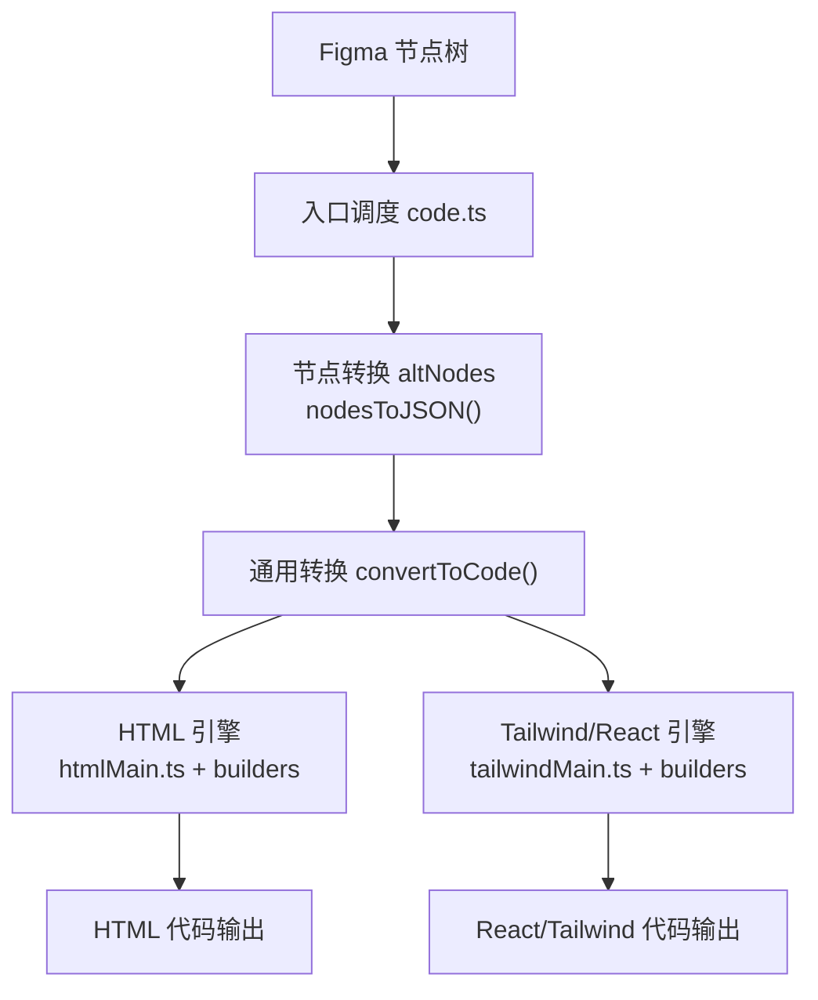
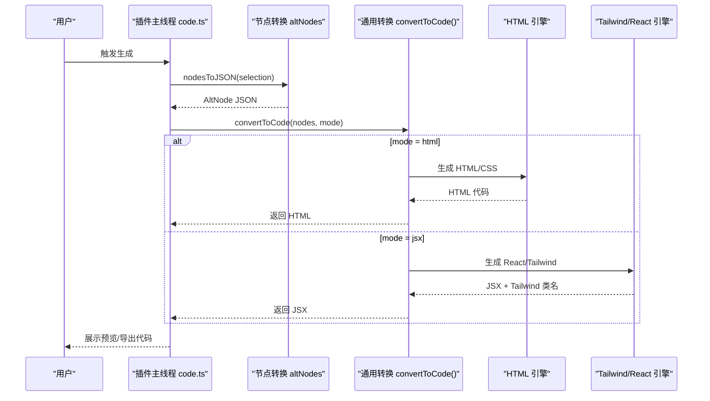
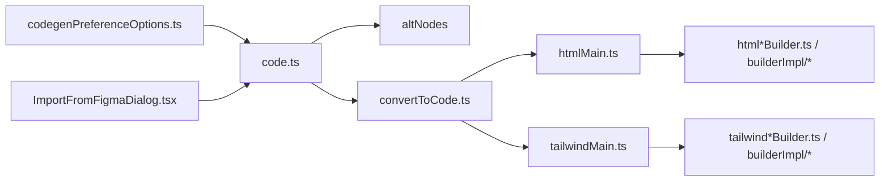

# 代码生成引擎

<cite>
**本文引用的文件**   
- [代码生成引擎.md](file://docs/项目文档/figma插件/技术/代码生成引擎.md)
- [Figma插件架构.md](file://docs/项目文档/figma插件/技术/Figma插件架构.md)
- [schema-generator.test.ts](file://packages/author-site/lib/__tests__/schema-generator.test.ts)
</cite>

## 目录
1. [简介](#简介)
2. [项目结构](#项目结构)
3. [核心组件](#核心组件)
4. [架构总览](#架构总览)
5. [详细组件分析](#详细组件分析)
6. [依赖关系分析](#依赖关系分析)
7. [性能考虑](#性能考虑)
8. [故障排查指南](#故障排查指南)
9. [结论](#结论)
10. [附录](#附录)

## 简介
本文件面向“从 Figma 节点解析到代码输出”的完整工作流，系统性阐述代码生成引擎的设计与实现。内容覆盖：
- AltNode 转换层的设计理念与职责边界
- HTML 代码生成器的架构（模板系统、样式处理、响应式适配）
- Tailwind/React 代码生成器特性（组件封装、样式类映射、动态属性绑定）
- 代码质量优化策略（格式化、注释生成、性能优化建议）
- 自定义生成器的扩展接口与开发指南

## 项目结构
根据文档与工程组织，代码生成相关能力主要分布在以下位置：
- 入口调度与流程编排：code.ts
- 节点转换层：altNodes（将 Figma 原生节点转换为可序列化的 AltNode JSON）
- 双引擎实现：
  - HTML 引擎：htmlMain.ts、htmlDefaultBuilder.ts、htmlTextBuilder.ts、builderImpl/*
  - Tailwind/React 引擎：tailwindMain.ts、tailwindDefaultBuilder.ts、tailwindTextBuilder.ts、builderImpl/*
- 通用转换与工具：common/retrieveUI/convertToCode.ts、common/propsGenerator.ts
- 插件 UI 偏好配置：plugin-ui/src/codegenPreferenceOptions.ts
- 创作端导入与识别：author-site/lib/markdown-parser.ts、author-site/src/components/demo/ImportFromFigmaDialog.tsx、author-site/src/lib/project-api.ts

图表来源
- [代码生成引擎.md:24-46](file://docs/项目文档/figma插件/技术/代码生成引擎.md#L24-L46)
- [Figma插件架构.md:269-320](file://docs/项目文档/figma插件/技术/Figma插件架构.md#L269-L320)

章节来源
- [代码生成引擎.md:24-46](file://docs/项目文档/figma插件/技术/代码生成引擎.md#L24-L46)
- [Figma插件架构.md:269-320](file://docs/项目文档/figma插件/技术/Figma插件架构.md#L269-L320)

## 核心组件
- 入口调度（code.ts）
  - 负责选择节点、调用 nodesToJSON 进行序列化、调用 convertToCode 生成目标代码、并生成预览 HTML。
- 节点转换层（altNodes）
  - 解决 Figma 节点循环引用问题，提取关键属性（尺寸、布局、填充、描边、圆角、阴影等），递归构建纯 JSON 的 AltNode 树。
- HTML 引擎
  - htmlMain.ts 协调生成流程；htmlDefaultBuilder.ts 提供通用节点构建；htmlTextBuilder.ts 处理文本节点；builderImpl/* 实现各类样式映射。
- Tailwind/React 引擎
  - tailwindMain.ts 包含 DSLP 标记拦截逻辑；tailwindDefaultBuilder.ts/tailwindTextBuilder.ts 分别负责通用与文本节点；builderImpl/* 生成 Tailwind 类名。
- Props 自动生成（propsGenerator.ts）
  - 在 JSX 生成时收集 #slot/#list 字段，注入 interface Props 及元数据注释，驱动工作台配置面板。

章节来源
- [代码生成引擎.md:50-170](file://docs/项目文档/figma插件/技术/代码生成引擎.md#L50-L170)

## 架构总览
代码生成采用“双引擎并行”的架构：同一份 AltNode 输入，可同时或按需切换至 HTML 或 Tailwind/React 引擎，输出不同形态的代码产物。

图表来源
- [代码生成引擎.md:50-98](file://docs/项目文档/figma插件/技术/代码生成引擎.md#L50-L98)

## 详细组件分析

### 节点转换层（AltNode）
- 设计目标
  - 解耦 Figma 原生对象与代码生成器，屏蔽循环引用与运行时依赖，提供稳定、可序列化的中间表示。
- 关键职责
  - 提取节点核心属性（位置、尺寸、样式、布局模式等）
  - 处理颜色变量与样式引用
  - 递归遍历子节点，构建无环 JSON 树
- 复杂度与健壮性
  - 时间复杂度 O(N)，空间复杂度 O(N)，N 为节点数
  - 对不可见节点、隐藏图层等进行过滤，减少后续生成负担

章节来源
- [代码生成引擎.md:68-76](file://docs/项目文档/figma插件/技术/代码生成引擎.md#L68-L76)

### HTML 代码生成器
- 架构要点
  - htmlMain.ts 作为入口，协调 builder 链路与资源处理
  - htmlDefaultBuilder.ts 负责通用节点（容器、图像、形状等）的 HTML 片段生成
  - htmlTextBuilder.ts 专注文本节点，处理富文本与换行
  - builderImpl/* 集中实现样式映射（布局、颜色、阴影、边框、圆角等）
- 模板系统与样式处理
  - 通过 builder 组合拼装 HTML 片段，避免硬编码模板字符串
  - 样式以内联 CSS 为主，便于快速预览与静态页面生成
- 响应式适配
  - 基于 Flexbox/Grid 的布局映射，结合媒体查询或相对单位提升适配能力
  - 对于复杂 Auto Layout，优先映射为 flex 布局，保持结构与间距一致

章节来源
- [代码生成引擎.md:79-98](file://docs/项目文档/figma插件/技术/代码生成引擎.md#L79-L98)

### Tailwind/React 代码生成器
- 架构要点
  - tailwindMain.ts 负责 DSLP 标记拦截与整体编排
  - tailwindDefaultBuilder.ts/tailwindTextBuilder.ts 分别生成通用与文本节点的 JSX 片段
  - builderImpl/* 将 Figma 样式映射为 Tailwind 类名
- DSLP 标记拦截
  - #ignore：跳过节点
  - #prompt：转为 JSX 注释
  - #slot:type:id：替换为 SdkImage/SdkText/SdkVideo 组件
  - #list:id：替换为 SdkList 组件并递归渲染子节点
  - #static：导出图片并以  渲染
- 组件封装与动态属性绑定
  - 通过 props 注入动态内容，支持图片、文本、视频等插槽
  - 列表项通过 #list 动态渲染，提高复用性与可配置性

章节来源
- [代码生成引擎.md:100-122](file://docs/项目文档/figma插件/技术/代码生成引擎.md#L100-L122)

### Props 自动生成（PropsCollector 与 propsGenerator）
- 设计目标
  - 在生成 JSX 的同时，自动生成 interface Props 与元数据注释，使 AI 工作台可直接编译配置面板，减少对二次补全的依赖。
- 关键实现
  - tailwindMain.ts 中创建 PropsCollector，收集 #slot/#list 字段并在输出顶部注入 interface Props
  - propsGenerator.ts 负责字段名转换、分组推断、顺序分配、去重与注释生成
- 字段映射规则（示例）
  - #slot:img:hero_banner → heroBanner: string，@format uri @widget image-upload
  - #slot:text:title → title: string，@format string @widget input
  - #slot:video:hero_video → heroVideo: string，@format uri @widget video-upload
  - #list:product_grid → productGrid: Array<object>，@title Product Grid 列表
- 分组规则
  - 默认使用最近的非标记父节点名称作为 @group
  - 支持手动覆盖语法 #slot:img:banner[Banner区域]（#list 同理）
- 向后兼容
  - 若缺失 interface Props 或元数据不完整，工作台按原有推断逻辑降级处理
  - JSX 主体结构不变，Props 作为增强信息注入

章节来源
- [代码生成引擎.md:124-170](file://docs/项目文档/figma插件/技术/代码生成引擎.md#L124-L170)

### Schema 生成与校验（作者站点侧）
- 功能概述
  - 从生成的 TSX 代码中提取 Props 定义，生成 JSON Schema，用于表单渲染与校验
- 测试用例覆盖
  - 支持基础类型、可选属性、函数参数解构、联合类型（enum）
  - 当找不到 Props 定义时返回 null，保证鲁棒性

章节来源
- [schema-generator.test.ts:1-105](file://packages/author-site/lib/__tests__/schema-generator.test.ts#L1-L105)

## 依赖关系分析
- 模块耦合
  - 入口调度 code.ts 依赖 altNodes 与 convertToCode，再分派至具体引擎
  - 各引擎内部通过 builder 组合降低耦合度，样式映射集中在 builderImpl/*
- 外部集成点
  - 插件 UI 偏好配置（codegenPreferenceOptions.ts）控制输出格式
  - 创作端导入（markdown-parser.ts、ImportFromFigmaDialog.tsx、project-api.ts）支持从 Figma 导入 HTML/Markdown 并创建原型页

图表来源
- [Figma插件架构.md:269-320](file://docs/项目文档/figma插件/技术/Figma插件架构.md#L269-L320)
- [代码生成引擎.md:24-46](file://docs/项目文档/figma插件/技术/代码生成引擎.md#L24-L46)

章节来源
- [Figma插件架构.md:269-320](file://docs/项目文档/figma插件/技术/Figma插件架构.md#L269-L320)
- [代码生成引擎.md:24-46](file://docs/项目文档/figma插件/技术/代码生成引擎.md#L24-L46)

## 性能考虑
- 缓存机制
  - 执行缓存：previousExecutionCache 存储已处理的样式，避免重复计算
  - 资源缓存：上传后的图片资源通过 hash 缓存，避免重复上传
- 并发控制
  - 资源上传使用队列 + 并发限制（默认 5 个并发），防止大量图片同时导出导致内存溢出
- 算法复杂度
  - 节点转换与代码生成均为线性复杂度，适合大规模节点树的批量处理

章节来源
- [代码生成引擎.md:202-214](file://docs/项目文档/figma插件/技术/代码生成引擎.md#L202-L214)

## 故障排查指南
- 常见问题定位
  - 插件未重载最新产物：后端 tailwindMain.ts 更新后，需重新构建并 Reload 插件
  - Props 未生效：确认控制台存在 “[PropsCollector] collected props:” 日志
- 推荐验收步骤
  - 运行 pnpm --filter plugin build:main
  - 在 Figma 中 Reload 插件
  - 再次生成并确认代码顶部出现 interface Props
  - 检查控制台日志是否包含 PropsCollector 收集结果
- 导入相关问题
  - 从 Figma 导入 HTML 时，确保完整 HTML 文档被识别为原型页内容，并写入 prototype.html
  - 旧版 Markdown 仍按 React 页面导入，注意区分

章节来源
- [代码生成引擎.md:159-170](file://docs/项目文档/figma插件/技术/代码生成引擎.md#L159-L170)

## 结论
该代码生成引擎通过“节点转换层 + 双引擎”的架构，实现了从 Figma 节点到 HTML 或 Tailwind/React 的稳定转换。新增的 Props 自动生成能力进一步打通了“设计→代码→配置面板”的链路，提升了自动化程度与可维护性。配合缓存与并发控制，系统在大规模节点场景下具备良好的性能表现。

## 附录

### 关键算法与映射
- 样式转换流程
  - 尺寸 → Tailwind 类名（如 w-10 h-20）
  - 位置 → absolute/relative 定位
  - 填充 → bg-color/background-image
  - 边框 → border-color/border-width
  - 圆角 → rounded-lg
  - 阴影 → shadow-md
  - 布局 → flex/grid 布局
- 自动布局（Auto Layout）映射
  - layoutMode: "HORIZONTAL" → flex flex-row
  - layoutMode: "VERTICAL" → flex flex-col
  - primaryAxisAlignItems: "CENTER" → justify-center
  - counterAxisAlignItems: "CENTER" → items-center
  - itemSpacing → gap-x/gap-y
  - paddingLeft/Right/Top/Bottom → pl/pr/pt/pb

章节来源
- [代码生成引擎.md:171-200](file://docs/项目文档/figma插件/技术/代码生成引擎.md#L171-L200)

### 扩展点与开发指南
- 新增 DSLP 标记支持
  - 在 tailwindMain.ts 的 convertNode 中添加拦截器
  - 实现对应的 SDK 组件渲染逻辑
  - 在 TaggingPanel.tsx 中添加 UI 支持
- 自定义生成器
  - 遵循现有 builder 模式，新增对应 builder 与样式映射
  - 在入口调度处注册新引擎，并通过偏好配置切换输出格式

章节来源
- [代码生成引擎.md:216-223](file://docs/项目文档/figma插件/技术/代码生成引擎.md#L216-L223)